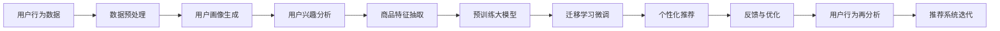

                 

## 1. 背景介绍

在数字化时代，电商平台通过海量用户数据的精准分析和高效处理，提供了个性化推荐、智能客服、内容营销等多元化服务，提升了用户粘性和活跃度。然而，随着平台竞争的加剧，仅仅依靠传统的数据分析手段，难以充分挖掘用户潜在需求，提升用户体验。近年来，基于大模型的电商平台推荐系统被广泛应用，通过预训练大模型的深度学习能力和迁移学习机制，准确捕捉用户特征，推荐更具吸引力的商品和服务，显著提高了用户满意度和粘性。

## 2. 核心概念与联系

### 2.1 核心概念概述

- **大模型（Large Model）**：通常指具有上亿参数规模的深度学习模型，如GPT-3、BERT、Transformer等。这些模型通过在大规模语料库上进行预训练，学习到丰富的语言知识和常识。
- **迁移学习（Transfer Learning）**：在大规模预训练基础上，通过特定领域的少量标注数据进行微调，以适应特定任务的模型优化方法。
- **推荐系统（Recommendation System）**：通过分析用户行为数据，预测用户兴趣，并向其推荐相关商品、服务或内容，以提高用户粘性。
- **用户粘性（User Stickiness）**：指用户在平台上停留的时间、频次、活跃度等指标，反映用户对平台的依赖程度。
- **用户活跃度（User Activity）**：衡量用户与平台互动的频率和深度，包括浏览、点击、购买、评价等多个维度。

### 2.2 核心概念原理和架构的 Mermaid 流程图



以上流程图展示了从用户行为数据到个性化推荐的大模型应用框架。首先通过数据预处理生成用户画像，接着分析用户兴趣，并抽取商品特征。然后通过预训练大模型进行迁移学习微调，生成个性化推荐，并通过用户反馈进行模型优化。最后对用户行为进行再分析，驱动推荐系统迭代，实现用户粘性提升。

## 3. 核心算法原理 & 具体操作步骤

### 3.1 算法原理概述

基于大模型的电商平台推荐系统，通过迁移学习机制，将通用预训练模型的能力迁移到特定领域的推荐任务中。具体算法流程如下：

1. **数据预处理**：收集用户行为数据，并进行数据清洗、特征工程、数据增强等预处理操作。
2. **用户画像生成**：通过用户的浏览、点击、购买等行为数据，生成用户画像，包括用户的兴趣偏好、行为习惯、社交关系等。
3. **用户兴趣分析**：利用预训练大模型，对用户画像进行分析，提取用户的隐性兴趣特征，形成用户兴趣向量。
4. **商品特征抽取**：对商品信息进行特征抽取，包括商品描述、属性、评分、评论等，形成商品特征向量。
5. **迁移学习微调**：将通用预训练模型在大规模数据上获取的知识迁移到特定领域的推荐任务中，通过少量标注数据进行微调，以适应推荐场景。
6. **个性化推荐**：根据用户兴趣和商品特征，生成推荐结果，并根据用户反馈进行模型优化。
7. **反馈与优化**：收集用户的点击、购买、评价等反馈数据，通过在线学习算法，不断调整模型参数，提高推荐准确性。

### 3.2 算法步骤详解

#### 3.2.1 数据预处理

数据预处理包括数据收集、清洗、特征工程等步骤：

1. **数据收集**：收集用户在电商平台上的各种行为数据，包括浏览记录、点击记录、购买记录、评分记录等。
2. **数据清洗**：处理缺失值、异常值、重复值等，确保数据质量。
3. **特征工程**：设计特征指标，如用户的活跃度、停留时间、购买频率等，并进行标准化处理。

#### 3.2.2 用户画像生成

用户画像生成是对用户行为数据进行分析和综合，生成用户的兴趣特征和行为特征：

1. **行为特征提取**：提取用户的点击次数、停留时间、购买频率等行为特征。
2. **兴趣特征提取**：通过用户行为数据，提取用户的兴趣偏好，如用户的购物偏好、品牌偏好、产品类型偏好等。
3. **画像模型训练**：使用机器学习算法（如K-means、决策树等）对用户行为和兴趣特征进行建模，生成用户画像。

#### 3.2.3 用户兴趣分析

用户兴趣分析使用预训练大模型对用户画像进行深度分析，提取用户隐性兴趣特征：

1. **特征向量编码**：将用户画像中的行为特征和兴趣特征转化为向量形式。
2. **大模型编码**：将特征向量输入预训练大模型，进行编码，生成用户兴趣向量。
3. **兴趣特征提取**：使用Transformer等模型，对大模型的编码结果进行注意力机制分析，提取用户隐性兴趣特征。

#### 3.2.4 商品特征抽取

商品特征抽取是将商品信息转化为特征向量：

1. **商品描述抽取**：从商品描述中提取关键词，使用TF-IDF等方法生成特征向量。
2. **商品属性抽取**：从商品属性中提取特征，如价格、品牌、类别等。
3. **商品评分抽取**：从用户评分中提取评分特征，用于计算商品评分向量。
4. **评论抽取**：从用户评论中提取评论特征，使用情感分析、实体抽取等技术生成评论向量。

#### 3.2.5 迁移学习微调

迁移学习微调是将通用预训练模型迁移到特定领域的推荐任务中：

1. **模型加载**：加载预训练的大模型，如BERT、GPT等。
2. **特征向量输入**：将用户兴趣向量和商品特征向量输入模型。
3. **微调训练**：在少量标注数据上进行微调训练，优化模型参数。
4. **模型输出**：输出推荐结果，包括商品ID、评分、排序等。

#### 3.2.6 个性化推荐

个性化推荐是根据用户兴趣和商品特征生成推荐结果：

1. **推荐模型训练**：使用在线学习算法（如在线梯度下降）对推荐模型进行训练。
2. **推荐结果生成**：根据用户画像和商品特征，生成推荐列表。
3. **推荐结果展示**：将推荐结果展示给用户，并根据用户点击、购买等行为数据进行反馈。

#### 3.2.7 反馈与优化

反馈与优化是根据用户反馈数据对推荐模型进行优化：

1. **反馈数据收集**：收集用户的点击、购买、评分等反馈数据。
2. **模型参数调整**：使用在线学习算法，根据反馈数据调整模型参数。
3. **推荐结果优化**：根据用户反馈，对推荐结果进行优化。

### 3.3 算法优缺点

#### 3.3.1 优点

1. **提升推荐准确性**：预训练大模型具备强大的特征提取能力，能够从海量数据中学习到丰富的知识，提升推荐准确性。
2. **适应性强**：通过迁移学习，大模型能够快速适应特定领域的推荐任务，提升推荐效果。
3. **用户粘性提升**：个性化推荐能够满足用户多样化需求，提升用户满意度和粘性。
4. **可扩展性强**：大模型具备强大的泛化能力，能够适应不同规模和类型的电商平台。

#### 3.3.2 缺点

1. **计算资源消耗大**：预训练大模型的计算资源消耗较大，需要高性能的GPU等硬件支持。
2. **数据隐私问题**：用户行为数据的收集和使用涉及隐私保护问题，需要遵守数据隐私法规。
3. **模型复杂度高**：大模型的复杂度高，训练和推理时间较长，需要优化算法和硬件支持。
4. **模型泛化性有限**：大模型在特定领域的泛化性能有限，需要进行数据集扩充和模型微调。

### 3.4 算法应用领域

基于大模型的电商平台推荐系统已经在多个领域得到应用，包括：

1. **电商推荐**：通过分析用户行为数据，推荐相关商品，提升用户购买率。
2. **内容推荐**：根据用户兴趣，推荐相关内容，提升用户停留时间和点击率。
3. **广告推荐**：根据用户特征，推荐相关广告，提升广告点击率和转化率。
4. **个性化服务**：根据用户画像，提供个性化服务，提升用户满意度。

## 4. 数学模型和公式 & 详细讲解 & 举例说明

### 4.1 数学模型构建

基于大模型的电商平台推荐系统数学模型包括用户兴趣分析、商品特征抽取、推荐结果生成等多个部分。以下是一个简单的推荐系统数学模型构建：

1. **用户兴趣表示**：设用户兴趣向量为 $\mathbf{u}=(u_1,u_2,\cdots,u_n)$，其中 $u_i$ 表示用户对第 $i$ 个特征的兴趣程度。
2. **商品特征表示**：设商品特征向量为 $\mathbf{v}=(v_1,v_2,\cdots,v_m)$，其中 $v_i$ 表示商品对第 $i$ 个特征的特征值。
3. **用户兴趣与商品特征相似度**：设用户兴趣与商品特征的相似度为 $s$，使用余弦相似度公式计算。
4. **推荐结果计算**：设推荐结果为 $r$，使用加权平均公式计算推荐结果的评分。

### 4.2 公式推导过程

以下是推荐系统的数学模型推导过程：

1. **余弦相似度计算**：设用户兴趣向量为 $\mathbf{u}=(u_1,u_2,\cdots,u_n)$，商品特征向量为 $\mathbf{v}=(v_1,v_2,\cdots,v_m)$。余弦相似度为 $s=\cos(\mathbf{u},\mathbf{v})=\frac{\mathbf{u}\cdot\mathbf{v}}{\|\mathbf{u}\|\|\mathbf{v}\|}$。
2. **加权平均公式计算推荐结果**：推荐结果 $r$ 计算公式为 $r=\alpha s + (1-\alpha) \max_{k\in K} \frac{a_k}{b_k}$，其中 $\alpha$ 为加权系数，$K$ 为所有商品的特征向量集合，$a_k$ 和 $b_k$ 分别为商品 $k$ 的评分和评分权重。

### 4.3 案例分析与讲解

假设某电商平台的推荐系统，使用BERT模型进行迁移学习微调，推荐用户感兴趣的商品。具体案例分析如下：

1. **数据预处理**：收集用户点击记录和商品描述，并进行数据清洗和特征工程。
2. **用户画像生成**：使用K-means算法对用户点击记录进行聚类，生成用户画像。
3. **用户兴趣分析**：使用BERT模型对用户画像进行编码，提取用户隐性兴趣特征。
4. **商品特征抽取**：提取商品描述中的关键词，使用TF-IDF生成商品特征向量。
5. **迁移学习微调**：加载预训练的BERT模型，在少量标注数据上进行微调，生成推荐模型。
6. **个性化推荐**：根据用户兴趣和商品特征，生成推荐列表，并根据用户点击和购买行为进行反馈优化。

## 5. 项目实践：代码实例和详细解释说明

### 5.1 开发环境搭建

1. **环境安装**：安装Python 3.7以上版本，配置TensorFlow、PyTorch等深度学习库。
2. **数据准备**：准备用户行为数据和商品数据，并进行清洗和特征工程。
3. **模型加载**：加载预训练的BERT模型，并进行迁移学习微调。
4. **系统部署**：将推荐模型集成到电商平台的推荐系统中，并进行性能测试。

### 5.2 源代码详细实现

以下是一个基于PyTorch的推荐系统实现示例：

```python
import torch
import torch.nn as nn
import torch.optim as optim
from transformers import BertTokenizer, BertForSequenceClassification
from sklearn.model_selection import train_test_split

# 数据准备
data = load_data()  # 加载用户行为和商品数据
user_ids, item_ids, labels = data['user_id'], data['item_id'], data['label']
user_counts, item_counts = count_users(), count_items()

# 数据划分
train_data, test_data = train_test_split(data, test_size=0.2)

# 模型加载
tokenizer = BertTokenizer.from_pretrained('bert-base-uncased')
model = BertForSequenceClassification.from_pretrained('bert-base-uncased', num_labels=len(labels))
device = torch.device('cuda' if torch.cuda.is_available() else 'cpu')

# 数据预处理
train_data = preprocess(train_data, tokenizer)
test_data = preprocess(test_data, tokenizer)

# 模型训练
model.to(device)
optimizer = optim.Adam(model.parameters(), lr=1e-5)
loss_fn = nn.CrossEntropyLoss()
num_epochs = 5

for epoch in range(num_epochs):
    model.train()
    for user_id, item_id, label in train_data:
        input_ids = tokenizer.encode(user_id, add_special_tokens=True)
        attention_mask = torch.ones(len(input_ids))
        loss = loss_fn(model(input_ids, attention_mask=attention_mask), label)
        optimizer.zero_grad()
        loss.backward()
        optimizer.step()

# 模型评估
model.eval()
test_data = preprocess(test_data, tokenizer)
with torch.no_grad():
    for user_id, item_id, label in test_data:
        input_ids = tokenizer.encode(user_id, add_special_tokens=True)
        attention_mask = torch.ones(len(input_ids))
        logits = model(input_ids, attention_mask=attention_mask)
        loss = loss_fn(logits, label)
        acc = (logits.argmax(dim=1) == label).float().mean().item()
```

### 5.3 代码解读与分析

1. **数据加载与预处理**：通过`load_data()`函数加载用户行为和商品数据，并进行数据清洗和特征工程，生成`user_ids`、`item_ids`和`labels`。
2. **模型加载与配置**：加载预训练的BERT模型，并进行迁移学习微调。
3. **数据划分**：将数据划分为训练集和测试集，并进行交叉验证。
4. **模型训练**：使用Adam优化器进行模型训练，定义损失函数为交叉熵损失。
5. **模型评估**：使用测试集对模型进行评估，计算准确率。

## 6. 实际应用场景

### 6.1 电商平台推荐

基于大模型的电商平台推荐系统，已经广泛应用于各大电商平台。通过分析用户行为数据，推荐相关商品，提升用户购买率。以下是一些具体应用场景：

1. **个性化商品推荐**：根据用户历史浏览和购买记录，推荐相关商品，提升购买率。
2. **内容推荐**：根据用户浏览记录，推荐相关商品信息，提升用户停留时间和点击率。
3. **广告推荐**：根据用户画像，推荐相关广告，提升广告点击率和转化率。

### 6.2 智能客服

电商平台智能客服系统通过大模型进行用户意图识别和智能回答，提升用户满意度和体验：

1. **意图识别**：使用BERT模型进行意图分类，识别用户意图，如购物咨询、退货投诉等。
2. **智能回答**：根据用户意图，调用API接口，生成智能回答，如商品推荐、订单状态查询等。
3. **多模态交互**：结合文本、语音、图片等多种模态，提供更全面、便捷的客户服务。

### 6.3 智能搜索

电商平台智能搜索系统通过大模型进行搜索结果排序，提升搜索效率和准确性：

1. **关键词提取**：使用BERT模型对用户查询进行关键词提取，生成向量表示。
2. **商品特征提取**：使用TF-IDF等方法对商品进行特征提取，生成向量表示。
3. **相似度计算**：计算用户查询与商品特征的余弦相似度，生成推荐结果。

## 7. 工具和资源推荐

### 7.1 学习资源推荐

1. **《深度学习推荐系统》书籍**：该书系统介绍了推荐系统算法和深度学习在推荐系统中的应用。
2. **CS294《推荐系统》课程**：斯坦福大学开设的推荐系统课程，涵盖推荐系统基础和深度学习推荐算法。
3. **Kaggle竞赛**：Kaggle推荐系统竞赛，提供大量数据集和开源代码，帮助用户学习和实践推荐系统算法。
4. **Arxiv论文**：最新推荐系统论文，提供前沿技术和算法，供研究者参考和借鉴。

### 7.2 开发工具推荐

1. **TensorFlow**：Google开发的深度学习框架，支持分布式训练和模型部署。
2. **PyTorch**：Facebook开发的深度学习框架，支持动态图和静态图计算。
3. **Jupyter Notebook**：用于数据处理和模型训练的交互式笔记本，支持Python和R语言。
4. **Grafana**：用于监控和可视化深度学习模型的工具，支持多种图表展示。
5. **TensorBoard**：TensorFlow配套的可视化工具，用于监控模型训练和推理过程。

### 7.3 相关论文推荐

1. **《BERT: Pre-training of Deep Bidirectional Transformers for Language Understanding》**：提出BERT模型，在大规模无监督预训练基础上进行迁移学习。
2. **《Deep Learning for Recommender Systems: A Survey and New Perspectives》**：综述深度学习在推荐系统中的应用，提供系统性介绍和未来发展方向。
3. **《A Survey of Online Learning in Recommender Systems》**：综述在线学习算法在推荐系统中的应用，提供系统性介绍和未来发展方向。

## 8. 总结：未来发展趋势与挑战

### 8.1 总结

基于大模型的电商平台推荐系统通过迁移学习机制，有效提升推荐精度和用户粘性，已成为电商平台的核心竞争力之一。通过预训练大模型的深度学习能力和迁移学习机制，推荐系统能够准确捕捉用户兴趣和商品特征，提供个性化推荐，显著提升用户满意度和粘性。未来，基于大模型的推荐系统将继续拓展应用领域，推动电商平台的智能化和个性化发展。

### 8.2 未来发展趋势

1. **深度个性化推荐**：基于用户行为数据的深度学习推荐算法，将更精准地捕捉用户需求，提升推荐准确性。
2. **多模态推荐系统**：结合文本、图像、语音等多种模态，提供更全面、细致的推荐服务。
3. **实时推荐系统**：利用在线学习算法，实时调整模型参数，提供动态推荐服务。
4. **跨平台推荐系统**：将推荐系统应用于多个平台，提供一致、连贯的推荐体验。
5. **可解释性推荐系统**：提升推荐模型的可解释性，帮助用户理解和信任推荐结果。

### 8.3 面临的挑战

1. **数据隐私问题**：用户行为数据的收集和使用涉及隐私保护问题，需要遵守数据隐私法规。
2. **计算资源消耗大**：大模型的计算资源消耗较大，需要高性能的GPU等硬件支持。
3. **模型泛化性有限**：大模型在特定领域的泛化性能有限，需要进行数据集扩充和模型微调。
4. **推荐算法复杂度高**：推荐算法的复杂度高，训练和推理时间较长，需要优化算法和硬件支持。

### 8.4 研究展望

未来，电商平台推荐系统将结合深度学习、迁移学习、在线学习等多种技术，提供更加精准、个性化、实时的推荐服务。同时，将注重推荐系统的可解释性和隐私保护，确保用户数据安全。通过持续创新和优化，基于大模型的电商平台推荐系统将为电商平台的智能化和个性化发展带来新的突破。

## 9. 附录：常见问题与解答

**Q1：大模型如何提升用户粘性和活跃度？**

A: 大模型通过迁移学习机制，能够捕捉用户兴趣和商品特征，提供个性化推荐，提升用户满意度和粘性。具体来说，通过预训练大模型对用户画像进行深度分析，提取用户隐性兴趣特征，生成个性化推荐，并根据用户反馈不断优化模型，提升推荐准确性和用户体验。

**Q2：推荐系统中的大模型如何选择？**

A: 推荐系统中的大模型通常选择基于Transformer架构的模型，如BERT、GPT等，具有强大的特征提取和表示学习能力。选择大模型时，需要考虑模型的规模、训练时间和计算资源等因素，选择适合特定应用场景的模型。

**Q3：推荐系统中的迁移学习微调方法有哪些？**

A: 推荐系统中的迁移学习微调方法包括在线学习、交叉验证微调、多任务学习等。在线学习方法能够在实时数据流中不断调整模型参数，提高模型适应性和推荐效果。交叉验证微调方法通过多次划分训练集和验证集，提高模型泛化能力和推荐精度。多任务学习方法能够同时优化多个推荐任务，提升模型复杂度和推荐精度。

**Q4：推荐系统中的用户画像如何生成？**

A: 推荐系统中的用户画像生成通常通过用户行为数据进行分析，生成用户的兴趣特征和行为特征。具体方法包括K-means聚类、决策树等。通过用户画像，可以更全面、细致地理解用户需求和行为特征，提供更加个性化的推荐服务。

**Q5：推荐系统中的商品特征如何抽取？**

A: 推荐系统中的商品特征抽取通常通过文本描述、属性、评分、评论等多种方式进行。具体方法包括TF-IDF、情感分析、实体抽取等。通过商品特征抽取，可以全面了解商品属性和用户评价，提高推荐模型的准确性和用户体验。

