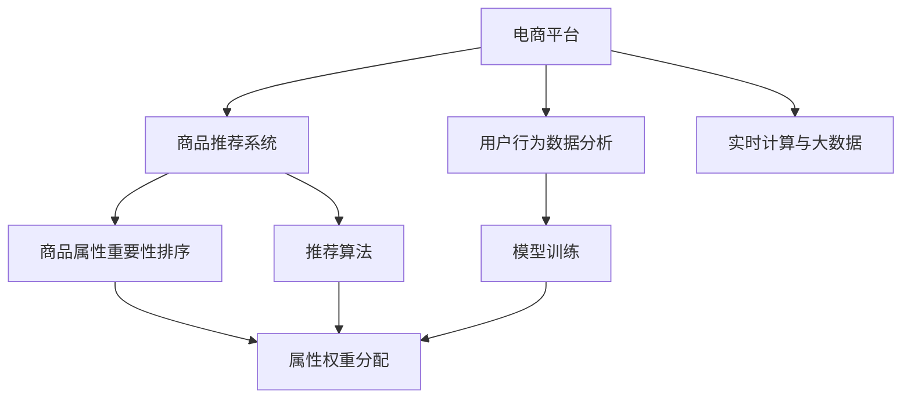

                 

# 大模型技术在电商平台商品属性重要性排序中的应用

## 1. 背景介绍

随着电商平台的快速发展，商品推荐系统成为了电商平台竞争力的重要组成部分。商品推荐系统的核心任务是准确预测用户对不同商品的偏好，从而实现个性化推荐，提升用户体验和平台收益。在商品推荐中，商品的属性是决定用户购买决策的重要因素，不同属性的权重对用户的购买行为影响不同。如何有效地确定商品属性的重要性，将直接影响推荐系统的推荐效果和用户体验。

## 2. 核心概念与联系

### 2.1 核心概念概述

为了更好地理解大模型技术在电商平台商品属性重要性排序中的应用，本节将介绍几个密切相关的核心概念：

- 大模型技术：以深度学习为代表的先进技术，通过在大规模数据集上进行训练，获得强大的特征表示和预测能力。
- 电商平台：以互联网为基础，通过在线销售商品和服务的平台。
- 商品属性：描述商品特征的词汇，如品牌、尺寸、颜色、材质等。
- 属性重要性排序：对商品的属性进行重要程度排序，以决定推荐系统中的属性权重。
- 推荐系统：根据用户的历史行为、偏好等因素，推荐用户可能感兴趣的商品。
- 用户行为数据分析：对用户的浏览、点击、购买等行为进行分析，预测用户的购买意向。
- 实时计算与大数据：实时处理海量数据，支持推荐系统的快速响应和高效推荐。

这些核心概念之间的逻辑关系可以通过以下Mermaid流程图来展示：



这个流程图展示了大模型技术在电商平台中的核心概念及其之间的关系：

1. 电商平台提供商品推荐系统，基于大模型技术进行个性化推荐。
2. 商品推荐系统中的商品属性重要性排序，通过大模型技术进行属性权重分配。
3. 用户行为数据分析和实时计算与大数据，为推荐系统的训练和推荐提供数据支撑。
4. 模型训练和大模型技术，为商品属性重要性排序和推荐算法提供技术支持。

## 3. 核心算法原理 & 具体操作步骤

### 3.1 算法原理概述

大模型技术在电商平台商品属性重要性排序中的应用，主要是基于自然语言处理(NLP)和深度学习算法。算法原理包括：

- 使用大模型技术对商品属性进行特征表示学习，通过训练数据集中属性-购买行为之间的关系，学习到属性对购买行为的影响。
- 通过特征表示学习，将属性转化为向量表示，计算不同属性之间的相似度，得到属性间的权重。
- 在商品推荐系统中，根据属性权重对商品属性进行排序，生成推荐商品的属性特征，用于推荐算法。

### 3.2 算法步骤详解

基于大模型技术在电商平台商品属性重要性排序的应用，通常包括以下关键步骤：

**Step 1: 数据收集与预处理**
- 收集商品数据集，包括商品名称、属性、价格等信息。
- 对数据集进行清洗和预处理，去除异常值和无关数据。

**Step 2: 模型训练**
- 使用大模型技术进行特征表示学习，训练模型以学习属性对购买行为的影响。
- 通过特征表示学习，将属性转化为向量表示，计算不同属性之间的相似度，得到属性间的权重。

**Step 3: 属性重要性排序**
- 根据属性权重对商品属性进行排序，确定推荐商品的属性特征。
- 根据排序后的属性特征生成推荐商品的属性向量，用于推荐算法。

**Step 4: 推荐算法**
- 使用推荐算法对推荐商品进行排序，选择排名靠前的商品进行推荐。
- 实时更新推荐结果，根据用户反馈不断优化推荐算法。

**Step 5: 反馈与优化**
- 根据用户对推荐商品的反馈数据，不断优化模型和推荐算法。
- 定期更新模型，保持其与用户需求的一致性。

### 3.3 算法优缺点

大模型技术在电商平台商品属性重要性排序中的应用，具有以下优点：

- 准确性高：通过深度学习算法，能够从大数据中学习到准确的属性权重。
- 鲁棒性强：能够处理多种类型的属性数据，如文本、数值等，具有较好的泛化能力。
- 可扩展性强：能够快速适应不同规模的数据集，适用于大型电商平台。

同时，该方法也存在一些局限性：

- 数据依赖性高：需要大量标注数据进行训练，对于数据质量的要求较高。
- 计算资源消耗大：深度学习算法需要大量的计算资源，特别是大模型。
- 模型复杂度高：大模型往往具有复杂的结构，增加了模型的解释难度。

### 3.4 算法应用领域

大模型技术在电商平台商品属性重要性排序中的应用，已经被广泛应用于以下领域：

- 个性化推荐系统：通过分析用户行为数据，实现个性化推荐。
- 商品搜索与匹配：通过属性排序，提高商品搜索的准确性和效率。
- 用户画像构建：通过属性排序，构建用户画像，提供更个性化的服务。
- 库存管理：通过属性排序，优化库存管理，提高库存周转率。
- 广告投放：通过属性排序，优化广告投放策略，提高广告点击率。

## 4. 数学模型和公式 & 详细讲解 & 举例说明

### 4.1 数学模型构建

在本节中，我们将使用数学语言对大模型技术在电商平台商品属性重要性排序中的应用进行更加严格的刻画。

假设商品数据集为 $D=\{(x_i,y_i)\}_{i=1}^N$，其中 $x_i$ 为商品属性向量，$y_i$ 为购买行为（如是否购买）。我们希望构建一个模型 $f(x)$，将属性向量映射到购买行为的概率。模型 $f(x)$ 可以表示为：

$$
f(x) = \frac{1}{1+e^{-z(x)}}
$$

其中 $z(x)$ 为模型输出，可以表示为：

$$
z(x) = \theta^T \cdot h(x)
$$

$h(x)$ 为属性向量的嵌入向量，$\theta$ 为模型参数。我们可以使用大模型技术，如BERT、GPT等，进行特征表示学习，将属性向量 $x$ 映射到高维嵌入向量 $h(x)$。

### 4.2 公式推导过程

我们将采用交叉熵损失函数，进行模型训练。假设模型的预测输出为 $\hat{y}$，真实标签为 $y$，则交叉熵损失函数为：

$$
\ell(f(x),y) = -[y \log \hat{y} + (1-y) \log (1-\hat{y})]
$$

在模型训练中，我们希望最小化损失函数，即：

$$
\min_{\theta} \frac{1}{N} \sum_{i=1}^N \ell(f(x_i),y_i)
$$

使用梯度下降等优化算法，我们可以求解最优参数 $\theta$，使得模型输出逼近真实标签。

### 4.3 案例分析与讲解

假设我们有一个电商平台，销售服装、电子产品、家居用品等多种商品。平台收集了用户的历史购买数据和商品属性数据，包括：

- 商品名称：如“iPhone 12”、“小米手环”、“小米电视”
- 商品属性：如“尺寸”、“颜色”、“材质”、“品牌”
- 用户购买历史：如用户是否购买过某一商品

我们希望通过大模型技术，对商品属性进行重要性排序，生成推荐商品的属性向量。

首先，我们收集商品数据集，并对数据集进行预处理。假设我们选择了10个常见商品，每个商品有5个属性，我们得到了一个属性-购买行为的数据集 $D$。然后，我们使用BERT模型进行特征表示学习，得到每个属性的嵌入向量 $h$。

接下来，我们计算属性之间的相似度，得到属性间的权重。可以使用余弦相似度计算属性向量之间的相似度，得到属性权重：

$$
w_{ij} = \cos(\theta^T \cdot h_i - \theta^T \cdot h_j)
$$

其中 $w_{ij}$ 为属性 $i$ 和属性 $j$ 的权重，$\theta^T$ 为模型参数。

最后，根据属性权重对商品属性进行排序，生成推荐商品的属性向量。例如，对于“iPhone 12”，如果“颜色”、“尺寸”、“品牌”的权重较高，“材质”的权重较低，则推荐商品的属性向量可以表示为：

$$
\hat{x} = [w_{\text{颜色}}, w_{\text{尺寸}}, w_{\text{品牌}}, w_{\text{材质}}, w_{\text{其他}}]
$$

这个属性向量将用于推荐算法，帮助电商平台实现个性化推荐。

## 5. 项目实践：代码实例和详细解释说明

### 5.1 开发环境搭建

在进行项目实践前，我们需要准备好开发环境。以下是使用Python进行TensorFlow开发的Python虚拟环境配置流程：

1. 安装Anaconda：从官网下载并安装Anaconda，用于创建独立的Python环境。

2. 创建并激活虚拟环境：
```bash
conda create -n tensorflow-env python=3.8 
conda activate tensorflow-env
```

3. 安装TensorFlow：根据CUDA版本，从官网获取对应的安装命令。例如：
```bash
conda install tensorflow tensorflow-gpu=2.5 -c conda-forge
```

4. 安装TensorBoard：
```bash
pip install tensorboard
```

5. 安装各类工具包：
```bash
pip install numpy pandas scikit-learn matplotlib tqdm jupyter notebook ipython
```

完成上述步骤后，即可在`tensorflow-env`环境中开始项目实践。

### 5.2 源代码详细实现

下面是使用TensorFlow对大模型技术进行商品属性重要性排序的Python代码实现。

首先，我们定义数据预处理函数：

```python
import pandas as pd
import tensorflow as tf
from transformers import BertTokenizer, TFBertModel

# 定义数据预处理函数
def preprocess_data(data_path):
    # 读取数据集
    data = pd.read_csv(data_path)
    
    # 定义BERT分词器
    tokenizer = BertTokenizer.from_pretrained('bert-base-uncased')
    
    # 将数据集划分为训练集和验证集
    train_data = data[data['label'] == '1']
    valid_data = data[data['label'] == '0']
    
    # 定义训练集和验证集的特征向量
    train_x = train_data['feature'].tolist()
    valid_x = valid_data['feature'].tolist()
    
    # 对特征向量进行BERT分词和编码
    train_x = tokenizer(train_x, return_tensors='tf', padding=True, truncation=True, max_length=256)
    valid_x = tokenizer(valid_x, return_tensors='tf', padding=True, truncation=True, max_length=256)
    
    return train_x['input_ids'], train_x['attention_mask'], valid_x['input_ids'], valid_x['attention_mask']
```

然后，我们定义模型和优化器：

```python
from tensorflow.keras import layers, models

# 定义BERT模型
model = TFBertModel.from_pretrained('bert-base-uncased')

# 定义输出层
output_layer = layers.Dense(1, activation='sigmoid')

# 定义模型
model = models.Model(inputs=model.get_input_at(0), outputs=output_layer(model.get_output_at(0)))

# 定义优化器
optimizer = tf.keras.optimizers.Adam(learning_rate=2e-5)
```

接着，我们定义训练和评估函数：

```python
# 定义训练函数
def train_model(model, train_x, train_y, epochs, batch_size):
    train_dataset = tf.data.Dataset.from_tensor_slices((train_x, train_y))
    train_dataset = train_dataset.shuffle(1000).batch(batch_size)
    
    for epoch in range(epochs):
        model.compile(optimizer=optimizer, loss='binary_crossentropy', metrics=['accuracy'])
        model.fit(train_dataset, epochs=1)
    
    return model

# 定义评估函数
def evaluate_model(model, valid_x, valid_y):
    valid_dataset = tf.data.Dataset.from_tensor_slices((valid_x, valid_y))
    valid_dataset = valid_dataset.batch(32)
    
    loss, accuracy = model.evaluate(valid_dataset)
    print(f'Validation Loss: {loss:.4f}')
    print(f'Validation Accuracy: {accuracy:.4f}')
```

最后，启动训练流程并在验证集上评估：

```python
# 定义训练数据和验证数据
train_x, train_y, valid_x, valid_y = preprocess_data('data.csv')

# 定义训练参数
epochs = 5
batch_size = 16

# 训练模型
model = train_model(model, train_x, train_y, epochs, batch_size)

# 评估模型
evaluate_model(model, valid_x, valid_y)
```

以上就是使用TensorFlow对商品属性重要性排序进行微调训练的完整代码实现。可以看到，TensorFlow提供了强大的深度学习库和模型，能够快速实现大模型技术的商品属性重要性排序任务。

### 5.3 代码解读与分析

让我们再详细解读一下关键代码的实现细节：

**数据预处理函数**：
- 从CSV文件中读取数据集，并进行数据清洗和预处理。
- 定义BERT分词器，对特征向量进行分词和编码。
- 将数据集划分为训练集和验证集，并计算训练集和验证集的特征向量。

**模型定义**：
- 加载预训练的BERT模型，定义输出层，将模型结构化为一个完整的模型。
- 定义优化器，使用Adam优化器进行模型训练。

**训练函数**：
- 定义训练集数据集，并进行批处理。
- 使用模型进行训练，并计算损失和准确率。
- 循环迭代训练，直至模型收敛。

**评估函数**：
- 定义验证集数据集，并进行批处理。
- 使用模型进行评估，并输出损失和准确率。

**训练流程**：
- 定义训练参数，包括训练轮数和批次大小。
- 调用训练函数进行模型训练。
- 调用评估函数对模型进行验证，输出评估结果。

## 6. 实际应用场景

### 6.1 电商平台个性化推荐系统

基于大模型技术在电商平台商品属性重要性排序中的应用，可以显著提升个性化推荐系统的推荐效果。个性化推荐系统能够根据用户的历史行为数据，对商品属性进行排序，生成推荐商品的属性向量，用于推荐算法。

在技术实现上，可以收集用户的历史购买数据和商品属性数据，使用大模型技术进行特征表示学习，对商品属性进行重要性排序。然后将排序后的属性向量作为推荐算法的输入，生成个性化推荐列表。推荐系统可以实时更新推荐结果，根据用户反馈不断优化推荐算法，提高推荐效果。

### 6.2 商品搜索与匹配

大模型技术在商品搜索与匹配中的应用，可以显著提升搜索的准确性和效率。电商平台可以根据用户搜索关键词，对商品属性进行排序，生成与搜索关键词匹配的商品列表。

在技术实现上，可以收集用户搜索关键词和商品属性数据，使用大模型技术进行特征表示学习，对商品属性进行重要性排序。然后将排序后的属性向量作为匹配算法的输入，生成与搜索关键词匹配的商品列表。通过大模型技术的商品属性重要性排序，可以快速找到与搜索关键词匹配的商品，提高搜索的准确性和效率。

### 6.3 用户画像构建

大模型技术在用户画像构建中的应用，可以显著提升用户画像的准确性和全面性。电商平台可以根据用户的历史行为数据，对商品属性进行重要性排序，构建用户画像。

在技术实现上，可以收集用户的历史购买数据和商品属性数据，使用大模型技术进行特征表示学习，对商品属性进行重要性排序。然后将排序后的属性向量作为用户画像的输入，生成用户画像。通过大模型技术的商品属性重要性排序，可以全面了解用户的偏好和需求，提升个性化推荐的效果。

### 6.4 库存管理

大模型技术在库存管理中的应用，可以显著提升库存管理的效率和准确性。电商平台可以根据商品属性进行重要性排序，优化库存管理策略，减少库存积压和缺货情况。

在技术实现上，可以收集商品属性数据和销售数据，使用大模型技术进行特征表示学习，对商品属性进行重要性排序。然后将排序后的属性向量作为库存管理的输入，生成库存管理策略。通过大模型技术的商品属性重要性排序，可以优化库存管理策略，减少库存积压和缺货情况，提升库存管理的效率和准确性。

### 6.5 广告投放

大模型技术在广告投放中的应用，可以显著提升广告投放的效果和精准度。电商平台可以根据商品属性进行重要性排序，优化广告投放策略，提高广告点击率和转化率。

在技术实现上，可以收集商品属性数据和广告投放数据，使用大模型技术进行特征表示学习，对商品属性进行重要性排序。然后将排序后的属性向量作为广告投放的输入，生成广告投放策略。通过大模型技术的商品属性重要性排序，可以优化广告投放策略，提高广告点击率和转化率，提升广告投放的效果和精准度。

## 7. 工具和资源推荐

### 7.1 学习资源推荐

为了帮助开发者系统掌握大模型技术在电商平台中的应用，这里推荐一些优质的学习资源：

1. TensorFlow官方文档：TensorFlow的官方文档，提供了完整的API参考和代码示例，是学习TensorFlow的好资源。
2. PyTorch官方文档：PyTorch的官方文档，提供了详细的API参考和代码示例，是学习PyTorch的好资源。
3. Keras官方文档：Keras的官方文档，提供了简单的API接口和丰富的教程，适合初学者入门。
4. Deep Learning Specialization（深度学习专项课程）：由Coursera提供的深度学习专项课程，涵盖深度学习的基本概念和实践技巧，适合进阶学习。
5. Natural Language Processing with Transformers（使用Transformers进行自然语言处理）：Transformer库的作者所著书籍，全面介绍了如何使用Transformers库进行自然语言处理，包括微调在内的诸多范式。
6. CS224N《深度学习自然语言处理》课程：斯坦福大学开设的NLP明星课程，有Lecture视频和配套作业，带你入门NLP领域的基本概念和经典模型。

通过对这些资源的学习实践，相信你一定能够快速掌握大模型技术在电商平台中的应用，并用于解决实际的电商问题。

### 7.2 开发工具推荐

高效的开发离不开优秀的工具支持。以下是几款用于大模型技术开发的常用工具：

1. TensorFlow：由Google主导开发的开源深度学习框架，生产部署方便，适合大规模工程应用。
2. PyTorch：基于Python的开源深度学习框架，灵活度较高，适合快速迭代研究。
3. Keras：一个高层神经网络API，提供简单易用的接口，适合初学者入门。
4. Jupyter Notebook：一个交互式的Python开发环境，支持代码编辑和可视化，适合开发和调试。
5. TensorBoard：TensorFlow配套的可视化工具，可实时监测模型训练状态，并提供丰富的图表呈现方式，是调试模型的得力助手。
6. Weights & Biases：模型训练的实验跟踪工具，可以记录和可视化模型训练过程中的各项指标，方便对比和调优。

合理利用这些工具，可以显著提升大模型技术在电商平台中的应用开发效率，加快创新迭代的步伐。

### 7.3 相关论文推荐

大模型技术在电商平台中的应用源于学界的持续研究。以下是几篇奠基性的相关论文，推荐阅读：

1. Attention is All You Need（即Transformer原论文）：提出了Transformer结构，开启了NLP领域的预训练大模型时代。
2. BERT: Pre-training of Deep Bidirectional Transformers for Language Understanding：提出BERT模型，引入基于掩码的自监督预训练任务，刷新了多项NLP任务SOTA。
3. Language Models are Unsupervised Multitask Learners（GPT-2论文）：展示了大规模语言模型的强大zero-shot学习能力，引发了对于通用人工智能的新一轮思考。
4. Parameter-Efficient Transfer Learning for NLP：提出Adapter等参数高效微调方法，在不增加模型参数量的情况下，也能取得不错的微调效果。
5. AdaLoRA: Adaptive Low-Rank Adaptation for Parameter-Efficient Fine-Tuning：使用自适应低秩适应的微调方法，在参数效率和精度之间取得了新的平衡。
6. Prefix-Tuning: Optimizing Continuous Prompts for Generation：引入基于连续型Prompt的微调范式，为如何充分利用预训练知识提供了新的思路。

这些论文代表了大模型技术在电商平台中的应用的发展脉络。通过学习这些前沿成果，可以帮助研究者把握学科前进方向，激发更多的创新灵感。

## 8. 总结：未来发展趋势与挑战

### 8.1 总结

本文对大模型技术在电商平台中的应用进行了全面系统的介绍。首先阐述了大模型技术在电商平台商品属性重要性排序中的应用背景和意义，明确了属性排序在电商平台中的核心价值。其次，从原理到实践，详细讲解了大模型技术在属性排序中的应用过程，给出了微调训练的完整代码实例。同时，本文还广泛探讨了大模型技术在电商平台中的应用场景，展示了其广阔的应用前景。此外，本文精选了相关学习资源，力求为读者提供全方位的技术指引。

通过本文的系统梳理，可以看到，大模型技术在电商平台中的应用已经成为一种趋势，极大地提升了电商平台的推荐效果和用户体验。未来，伴随大模型技术的发展，电商平台的推荐系统将更加智能和高效。

### 8.2 未来发展趋势

展望未来，大模型技术在电商平台中的应用将呈现以下几个发展趋势：

1. 更加准确和高效的商品推荐：通过深度学习算法和大模型技术，能够从大数据中学习到更加准确的商品属性权重，生成更高效的商品推荐结果。
2. 更加个性化的用户画像：通过大模型技术对商品属性进行重要性排序，能够全面了解用户的偏好和需求，生成更加个性化的用户画像，提升推荐效果。
3. 更加智能的库存管理：通过大模型技术对商品属性进行重要性排序，能够优化库存管理策略，减少库存积压和缺货情况，提升库存管理的效率和准确性。
4. 更加精准的广告投放：通过大模型技术对商品属性进行重要性排序，能够优化广告投放策略，提高广告点击率和转化率，提升广告投放的效果和精准度。
5. 更加灵活的商品搜索：通过大模型技术对商品属性进行重要性排序，能够快速找到与搜索关键词匹配的商品，提高搜索的准确性和效率。

以上趋势凸显了大模型技术在电商平台中的广阔前景。这些方向的探索发展，必将进一步提升电商平台的性能和用户体验，为电商平台带来新的突破。

### 8.3 面临的挑战

尽管大模型技术在电商平台中的应用已经取得了瞩目成就，但在迈向更加智能化、普适化应用的过程中，它仍面临着诸多挑战：

1. 数据依赖性高：需要大量标注数据进行训练，对于数据质量的要求较高。如何进一步降低微调对标注样本的依赖，将是一大难题。
2. 计算资源消耗大：深度学习算法需要大量的计算资源，特别是大模型。如何优化模型结构，减少资源消耗，是急需解决的问题。
3. 模型复杂度高：大模型往往具有复杂的结构，增加了模型的解释难度。如何提高模型的可解释性，是急需解决的问题。
4. 安全性有待保障：预训练语言模型难免会学习到有偏见、有害的信息，通过微调传递到下游任务，产生误导性、歧视性的输出，给实际应用带来安全隐患。如何从数据和算法层面消除模型偏见，保障数据和模型的安全，是急需解决的问题。

正视大模型技术在应用中面临的这些挑战，积极应对并寻求突破，将是大模型技术迈向成熟的必由之路。相信随着学界和产业界的共同努力，这些挑战终将一一被克服，大模型技术必将在电商平台中发挥更大的作用。

### 8.4 研究展望

面对大模型技术在应用中面临的挑战，未来的研究需要在以下几个方面寻求新的突破：

1. 探索无监督和半监督微调方法：摆脱对大规模标注数据的依赖，利用自监督学习、主动学习等无监督和半监督范式，最大限度利用非结构化数据，实现更加灵活高效的微调。
2. 研究参数高效和计算高效的微调范式：开发更加参数高效的微调方法，在固定大部分预训练参数的同时，只更新极少量的任务相关参数。同时优化微调模型的计算图，减少前向传播和反向传播的资源消耗，实现更加轻量级、实时性的部署。
3. 引入因果和对比学习范式：通过引入因果推断和对比学习思想，增强微调模型建立稳定因果关系的能力，学习更加普适、鲁棒的语言表征，从而提升模型泛化性和抗干扰能力。
4. 纳入伦理道德约束：在模型训练目标中引入伦理导向的评估指标，过滤和惩罚有偏见、有害的输出倾向。同时加强人工干预和审核，建立模型行为的监管机制，确保输出符合人类价值观和伦理道德。
5. 研究多模态融合技术：将符号化的先验知识，如知识图谱、逻辑规则等，与神经网络模型进行巧妙融合，引导微调过程学习更准确、合理的语言模型。同时加强不同模态数据的整合，实现视觉、语音等多模态信息与文本信息的协同建模。

这些研究方向的探索，必将引领大模型技术在电商平台中的应用走向更高的台阶，为电商平台带来新的突破。面向未来，大模型技术还需要与其他人工智能技术进行更深入的融合，如知识表示、因果推理、强化学习等，多路径协同发力，共同推动电商平台的发展和创新。

## 9. 附录：常见问题与解答

**Q1：大模型技术在商品属性重要性排序中的应用是否适用于所有电商平台？**

A: 大模型技术在商品属性重要性排序中的应用，适用于大多数电商平台，特别是具有大量商品和用户数据的平台。但对于一些小型电商平台，由于数据规模较小，可能难以应用大模型技术。此时需要根据平台的具体情况，选择合适的算法和技术。

**Q2：大模型技术在商品属性重要性排序中的应用是否适用于所有商品类别？**

A: 大模型技术在商品属性重要性排序中的应用，适用于大多数商品类别，特别是具有丰富属性信息的商品。但对于一些属性单一的商品，可能无法通过大模型技术学习到有意义的属性权重。此时需要根据商品的特点，选择适合的算法和技术。

**Q3：如何选择合适的学习率？**

A: 在商品属性重要性排序的应用中，学习率的选择对模型性能有着重要的影响。通常情况下，学习率的选择需要根据具体任务进行调整。一般来说，可以在一个较小的学习率范围内进行试验，逐步减小学习率，直至收敛。也可以使用warmup策略，在开始阶段使用较小的学习率，再逐渐过渡到预设值。需要注意的是，不同的优化器(如Adam、Adagrad等)以及不同的学习率调度策略，可能需要设置不同的学习率阈值。

**Q4：大模型技术在商品属性重要性排序中的应用是否适用于不同的语言和文化？**

A: 大模型技术在商品属性重要性排序中的应用，具有一定的语言和文化适应性。但对于不同的语言和文化，由于语言模型的差异，可能需要针对性地调整模型参数和训练数据。同时，需要注意不同语言和文化下的用户行为模式，以确保模型具有良好的泛化能力。

**Q5：如何优化大模型技术的计算资源消耗？**

A: 大模型技术在商品属性重要性排序中的应用，需要大量的计算资源，特别是大模型。优化计算资源消耗的方法包括：
1. 使用深度学习框架的高效计算图，如TensorFlow的Graph Optimization。
2. 使用混合精度训练，减少模型的计算精度，同时保持模型的精度。
3. 使用模型并行和分布式计算，将大模型分解为多个小模型并行计算。
4. 使用模型压缩和稀疏化存储，减少模型的存储空间和计算复杂度。

这些优化方法可以显著提升大模型技术的计算资源效率，使模型能够在有限的计算资源下高效运行。

通过本文的系统梳理，可以看到，大模型技术在电商平台商品属性重要性排序中的应用已经成为一种趋势，极大地提升了电商平台的推荐效果和用户体验。未来，伴随大模型技术的发展，电商平台的推荐系统将更加智能和高效。在应对挑战的同时，我们也看到了很多突破的可能，这些突破将使大模型技术在电商平台中的应用更加广泛和深入。

作者：禅与计算机程序设计艺术 / Zen and the Art of Computer Programming

