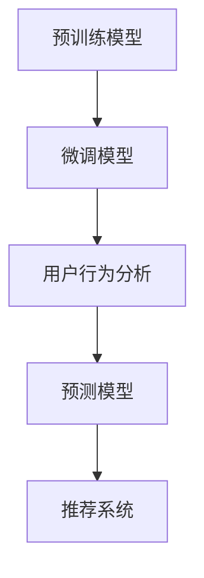

                 

# 大模型技术在电商平台用户行为理解与预测中的应用

> 关键词：
  - 大模型技术
  - 用户行为分析
  - 预测模型
  - 推荐系统
  - 电商平台的个性化推荐

## 1. 背景介绍

### 1.1 问题由来
随着电子商务的迅猛发展，电商平台需要更加深入地理解用户行为，以提升用户体验、优化购物流程，并最终驱动商业增长。传统的数据分析方法已无法有效处理海量用户数据，更不用说对用户行为进行准确预测。在这一背景下，大模型技术成为电商行业实现用户行为理解与预测的重要手段。

### 1.2 问题核心关键点
大模型技术在电商平台的应用，核心在于利用大规模预训练语言模型，深入挖掘用户行为数据，生成个性化推荐。具体而言：

- 用户行为数据的收集：电商平台通过用户在浏览、购买、评价等行为中产生的大量数据，捕捉用户的兴趣偏好、购买习惯等信息。
- 预训练模型：选择如BERT、GPT等先进的大模型进行预训练，学习大规模语料中的通用语言知识和模式。
- 用户行为理解：通过在大模型基础上微调，学习特定电商平台的用户行为数据，生成关于用户行为的多维度、深入理解。
- 用户行为预测：在用户行为理解的基础上，结合业务规则和实时数据，预测用户未来行为。
- 个性化推荐：根据用户行为预测结果，提供个性化的商品推荐，提高用户满意度和购买转化率。

这些步骤共同构成了大模型在电商平台用户行为理解与预测的完整流程。通过这一流程，电商平台能够更好地了解用户需求，提供更为精准的推荐服务，从而提升用户粘性和业务收入。

## 2. 核心概念与联系

### 2.1 核心概念概述

为更好地理解大模型在电商平台用户行为分析中的应用，本节将介绍几个关键概念：

- 预训练模型：如BERT、GPT等，通过大规模无标签文本数据进行预训练，学习语言的一般知识和模式。
- 微调模型：在大模型基础上进行微调，适配特定电商平台的业务需求和用户行为数据。
- 用户行为分析：通过处理用户的历史行为数据，理解用户的兴趣偏好、购买意图等信息。
- 预测模型：基于用户行为分析结果，构建预测模型，预测用户未来的行为和需求。
- 推荐系统：根据预测结果，结合用户特征、商品属性等多维度信息，生成个性化的商品推荐。

这些概念之间的联系可以通过以下Mermaid流程图来展示：



这个流程图展示了预训练模型到最终推荐系统的转化路径，以及各个环节之间的逻辑关系：

1. 预训练模型提供通用的语言知识基础。
2. 微调模型结合电商平台的业务规则，生成针对该平台的用户行为分析能力。
3. 用户行为分析从历史行为数据中学习用户的兴趣和需求。
4. 预测模型结合实时数据，对用户未来行为进行预测。
5. 推荐系统根据预测结果生成个性化的商品推荐。

这些概念相互配合，形成了电商平台用户行为理解与预测的核心技术框架。

## 3. 核心算法原理 & 具体操作步骤
### 3.1 算法原理概述

大模型在电商平台用户行为理解与预测中的应用，主要基于深度学习中的预训练-微调机制。具体原理如下：

- **预训练模型**：首先使用大规模无标签文本数据进行预训练，学习通用的语言知识。
- **微调模型**：在预训练模型基础上，结合特定电商平台的业务规则和用户行为数据，进行微调，生成适合该平台的模型。
- **用户行为分析**：将用户行为数据输入微调后的模型，生成用户行为的向量表示，理解用户的兴趣偏好。
- **预测模型**：通过多维度数据的整合，如用户历史行为、实时数据等，构建预测模型，预测用户未来的行为。
- **推荐系统**：根据预测结果，结合用户特征和商品属性，生成个性化的商品推荐。

这一流程通过深度学习算法不断优化，形成精准、高效的电商平台个性化推荐系统。

### 3.2 算法步骤详解

下面详细介绍基于大模型技术在电商平台用户行为理解与预测的具体步骤：

**Step 1: 准备预训练模型和数据集**
- 选择适当的预训练语言模型（如BERT、GPT等），并下载其预训练权重。
- 准备电商平台的用户行为数据集，包括用户浏览记录、购买记录、评价数据等，划分为训练集、验证集和测试集。

**Step 2: 添加任务适配层**
- 在预训练模型的顶层，添加电商平台的业务规则和用户行为数据，设计合适的输出层和损失函数。
- 对于电商平台的推荐任务，通常使用交叉熵损失，计算预测值和实际标签之间的差异。

**Step 3: 设置微调超参数**
- 选择合适的优化算法（如Adam、SGD等）及其参数，如学习率、批大小、迭代轮数等。
- 设置正则化技术（如L2正则、Dropout等）和早期停止策略。
- 确定冻结预训练参数的策略，如仅微调顶层，或全部参数都参与微调。

**Step 4: 执行梯度训练**
- 将训练集数据分批次输入模型，前向传播计算损失函数。
- 反向传播计算参数梯度，根据设定的优化算法和学习率更新模型参数。
- 周期性在验证集上评估模型性能，根据性能指标决定是否触发早期停止。
- 重复上述步骤直至满足预设的迭代轮数或早期停止条件。

**Step 5: 测试和部署**
- 在测试集上评估微调后模型对用户行为的预测准确率。
- 使用微调后的模型对实时用户数据进行预测，集成到电商平台的推荐系统中。
- 持续收集新的用户行为数据，定期重新微调模型，以适应数据分布的变化。

### 3.3 算法优缺点

基于大模型技术的电商平台用户行为预测方法具有以下优点：

1. **高效性**：预训练模型和微调技术能够快速处理大量的用户数据，生成精准的推荐。
2. **准确性**：通过多维度数据的融合，生成的推荐结果更符合用户实际需求。
3. **可扩展性**：预训练模型和微调技术可以扩展到多种电商平台的推荐系统，具有较强的通用性。

同时，该方法也存在一些缺点：

1. **数据依赖**：微调效果很大程度上依赖于用户行为数据的准确性和丰富性。
2. **计算成本**：预训练模型和微调模型需要大量计算资源和时间。
3. **模型解释性不足**：大模型的预测结果难以解释，难以向用户和业务方解释推荐依据。
4. **隐私风险**：电商平台用户数据涉及隐私问题，需要严格控制数据使用和隐私保护。

尽管存在这些局限性，但就目前而言，基于大模型的电商平台推荐系统仍然是最为先进和高效的方法之一。未来相关研究的方向主要是如何进一步降低计算成本、提升模型解释性以及加强数据隐私保护。

### 3.4 算法应用领域

基于大模型的电商平台用户行为理解与预测方法，已经在以下领域得到了广泛应用：

- **个性化推荐系统**：根据用户历史行为和实时数据，生成个性化的商品推荐。
- **用户行为分析**：通过分析用户的历史行为数据，理解用户的兴趣和需求。
- **推荐算法优化**：利用用户行为数据和预测结果，优化推荐算法，提高推荐效果。
- **用户满意度提升**：通过精准推荐，提升用户满意度和购物体验。

除了上述这些领域，大模型技术还被应用于电商平台的搜索系统、广告投放、库存管理等多个环节，为电商平台提供了全面的技术支持。

## 4. 数学模型和公式 & 详细讲解 & 举例说明

### 4.1 数学模型构建

大模型在电商平台用户行为预测中的应用，主要通过构建预测模型来实现。假设预训练模型为 $M_{\theta}$，用户行为向量为 $x_i$，其中 $i$ 表示用户编号。模型在用户行为数据 $D=\{(x_i, y_i)\}_{i=1}^N$ 上的损失函数定义为：

$$
\mathcal{L}(\theta) = -\frac{1}{N}\sum_{i=1}^N \log M_{\theta}(x_i)
$$

其中，$\log M_{\theta}(x_i)$ 表示模型对用户行为 $x_i$ 的预测概率，$y_i$ 表示真实标签（如1或0，表示是否购买某商品）。

### 4.2 公式推导过程

以下我们以电商平台的商品推荐为例，推导基于大模型的预测模型的公式。

假设用户行为数据为 $x_i$，预训练模型为 $M_{\theta}$。通过微调得到的推荐模型为 $M_{\hat{\theta}}$，其中 $\hat{\theta}$ 为微调后的模型参数。推荐模型预测用户购买商品的概率为：

$$
P(y_i=1|x_i) = \sigma\big(M_{\hat{\theta}}(x_i)\big)
$$

其中，$\sigma$ 为 sigmoid 函数，将模型输出映射到0-1之间的概率值。模型在用户行为数据 $D=\{(x_i, y_i)\}_{i=1}^N$ 上的损失函数为交叉熵损失：

$$
\mathcal{L}(\hat{\theta}) = -\frac{1}{N}\sum_{i=1}^N y_i \log P(y_i=1|x_i) + (1-y_i) \log P(y_i=0|x_i)
$$

通过梯度下降算法，不断更新模型参数 $\hat{\theta}$，最小化损失函数 $\mathcal{L}(\hat{\theta})$，使得模型预测结果逼近真实标签 $y_i$。

### 4.3 案例分析与讲解

假设我们有一家电商平台，收集了100万条用户浏览数据，其中包含用户的浏览记录、购买记录、评分等。通过将这些数据输入微调后的模型 $M_{\hat{\theta}}$，可以生成每条数据的用户行为向量 $x_i$。然后将用户行为向量作为输入，通过预测模型 $M_{\hat{\theta}}$ 计算每个用户对某商品的购买概率。最终，根据用户的购买概率生成推荐列表，并将推荐结果返回给用户。

## 5. 项目实践：代码实例和详细解释说明
### 5.1 开发环境搭建

在进行电商平台推荐系统开发前，我们需要准备好开发环境。以下是使用Python进行TensorFlow开发的环境配置流程：

1. 安装Anaconda：从官网下载并安装Anaconda，用于创建独立的Python环境。

2. 创建并激活虚拟环境：
```bash
conda create -n recommendation-env python=3.8 
conda activate recommendation-env
```

3. 安装TensorFlow：根据CUDA版本，从官网获取对应的安装命令。例如：
```bash
conda install tensorflow-gpu -c tensorflow -c conda-forge
```

4. 安装Keras：
```bash
pip install keras
```

5. 安装各类工具包：
```bash
pip install numpy pandas scikit-learn matplotlib tqdm jupyter notebook ipython
```

完成上述步骤后，即可在`recommendation-env`环境中开始推荐系统开发。

### 5.2 源代码详细实现

下面是使用TensorFlow和Keras框架，对预训练模型进行微调并生成推荐系统的示例代码：

```python
import tensorflow as tf
from tensorflow.keras.layers import Input, Dense, Dropout, Embedding, Flatten
from tensorflow.keras.models import Model
from tensorflow.keras.optimizers import Adam
from sklearn.model_selection import train_test_split
from sklearn.metrics import accuracy_score

# 假设用户行为数据和标签数据已经准备好
X_train, X_test, y_train, y_test = train_test_split(X, y, test_size=0.2, random_state=42)

# 定义模型架构
input_layer = Input(shape=(max_length,))
embedding_layer = Embedding(input_dim=vocab_size, output_dim=embedding_dim, input_length=max_length)(input_layer)
dense_layer = Dense(64, activation='relu')(embedding_layer)
dropout_layer = Dropout(0.5)(dense_layer)
output_layer = Dense(1, activation='sigmoid')(dropout_layer)

model = Model(inputs=input_layer, outputs=output_layer)

# 编译模型
model.compile(optimizer=Adam(lr=0.001), loss='binary_crossentropy', metrics=['accuracy'])

# 训练模型
model.fit(X_train, y_train, epochs=10, batch_size=32, validation_data=(X_test, y_test))

# 评估模型
y_pred = model.predict(X_test)
accuracy = accuracy_score(y_test, y_pred)
print('Accuracy:', accuracy)
```

### 5.3 代码解读与分析

让我们再详细解读一下关键代码的实现细节：

- `Input`层：定义输入数据的维度，如用户行为数据的长度。
- `Embedding`层：将用户行为数据转换为高维向量，以供神经网络处理。
- `Dense`层：全连接层，通过非线性激活函数学习特征。
- `Dropout`层：随机丢弃部分神经元，防止过拟合。
- `Dense`层：输出层，使用sigmoid函数将特征映射到0-1之间的概率。
- `Model`层：将各层组合成完整的模型。
- `compile`方法：编译模型，指定优化器、损失函数和评价指标。
- `fit`方法：训练模型，使用训练集和验证集进行迭代优化。
- `predict`方法：预测模型，在测试集上进行性能评估。
- `accuracy_score`函数：计算预测准确率。

可以看到，TensorFlow和Keras框架使得模型构建和训练变得简单高效。开发者可以专注于模型架构和特征工程的设计，而不必过多关注底层实现细节。

## 6. 实际应用场景
### 6.1 电商平台的个性化推荐系统

电商平台通过个性化推荐系统，可以显著提升用户满意度和购物体验，从而增加销售额。基于大模型的推荐系统，能够深度挖掘用户行为数据，生成个性化的商品推荐，实现精准营销。

在技术实现上，可以收集用户的历史浏览、点击、购买、评价等行为数据，通过预训练模型进行预训练，再在大模型基础上微调，学习用户行为数据。最终生成的推荐模型可以根据用户行为数据和实时数据，生成个性化的商品推荐，优化用户体验。

### 6.2 电商平台的搜索系统

搜索系统是电商平台的另一重要组成部分，用户可以通过搜索关键词快速找到所需商品。基于大模型的搜索系统，能够通过自然语言理解技术，准确捕捉用户意图，提高搜索结果的相关性和准确性。

在技术实现上，可以将用户输入的搜索词作为输入，通过预训练模型进行预训练，再在大模型基础上微调，学习搜索词和商品的相关性。最终生成的搜索模型可以根据用户输入的搜索词，快速匹配相关商品，提升用户搜索体验。

### 6.3 电商平台的广告投放

广告投放是电商平台的重要收入来源，通过精准投放广告，可以有效提升广告的点击率和转化率。基于大模型的广告投放系统，能够深度理解用户行为数据，生成个性化的广告投放方案。

在技术实现上，可以收集用户的浏览、点击、购买等行为数据，通过预训练模型进行预训练，再在大模型基础上微调，学习用户的兴趣偏好和行为模式。最终生成的广告投放模型可以根据用户行为数据，生成个性化的广告方案，提升广告投放效果。

### 6.4 未来应用展望

随着大模型和微调技术的不断进步，基于大模型的电商平台推荐系统将在更多领域得到应用，为传统行业带来变革性影响。

在智慧医疗领域，基于大模型的推荐系统可以推荐个性化医疗方案，辅助医生诊疗，提升医疗服务质量。

在智能教育领域，基于大模型的推荐系统可以推荐个性化学习方案，因材施教，提高教育公平性。

在智慧城市治理中，基于大模型的推荐系统可以推荐城市事件，提高城市管理的自动化和智能化水平。

此外，在企业生产、社会治理、文娱传媒等众多领域，基于大模型的推荐系统也将不断涌现，为经济社会发展注入新的动力。相信随着技术的日益成熟，大模型推荐系统必将在更广阔的应用领域大放异彩。

## 7. 工具和资源推荐
### 7.1 学习资源推荐

为了帮助开发者系统掌握大模型在电商平台用户行为理解与预测的技术，这里推荐一些优质的学习资源：

1. 《深度学习》系列书籍：由Deep Learning Books推荐，涵盖深度学习的理论基础和实践技巧，适合初学者和进阶开发者。
2. Coursera《深度学习专项课程》：由斯坦福大学教授吴恩达讲授，详细讲解深度学习的基本概念和实际应用，适合在线学习。
3. CS229《机器学习》课程：斯坦福大学的经典机器学习课程，覆盖机器学习的基本理论和算法，适合深入学习。
4. Kaggle竞赛平台：世界顶级的机器学习竞赛平台，提供大量实战案例和数据集，适合锻炼实战能力。
5. Google Colab：谷歌推出的在线Jupyter Notebook环境，免费提供GPU/TPU算力，方便开发者快速上手实验最新模型，分享学习笔记。

通过对这些资源的学习实践，相信你一定能够快速掌握大模型在电商平台应用的技术，并用于解决实际的电商问题。

### 7.2 开发工具推荐

高效的开发离不开优秀的工具支持。以下是几款用于大模型推荐系统开发的常用工具：

1. TensorFlow：由Google主导开发的开源深度学习框架，生产部署方便，适合大规模工程应用。
2. PyTorch：基于Python的开源深度学习框架，灵活动态的计算图，适合快速迭代研究。
3. Keras：基于TensorFlow和Theano等深度学习框架的高级API，简化了模型构建和训练过程。
4. Weights & Biases：模型训练的实验跟踪工具，可以记录和可视化模型训练过程中的各项指标，方便对比和调优。
5. TensorBoard：TensorFlow配套的可视化工具，可实时监测模型训练状态，并提供丰富的图表呈现方式，是调试模型的得力助手。
6. HuggingFace Transformers库：包含多种预训练模型和微调样例代码，是推荐系统开发的重要工具。

合理利用这些工具，可以显著提升大模型推荐系统的开发效率，加快创新迭代的步伐。

### 7.3 相关论文推荐

大模型推荐系统的研究源于学界的持续研究。以下是几篇奠基性的相关论文，推荐阅读：

1. Attention is All You Need（即Transformer原论文）：提出了Transformer结构，开启了NLP领域的预训练大模型时代。
2. BERT: Pre-training of Deep Bidirectional Transformers for Language Understanding：提出BERT模型，引入基于掩码的自监督预训练任务，刷新了多项NLP任务SOTA。
3. Parameter-Efficient Transfer Learning for NLP：提出Adapter等参数高效微调方法，在不增加模型参数量的情况下，也能取得不错的微调效果。
4. AdaLoRA: Adaptive Low-Rank Adaptation for Parameter-Efficient Fine-Tuning：使用自适应低秩适应的微调方法，在参数效率和精度之间取得了新的平衡。
5. MoCo: Momentum Contrast for Unsupervised Visual Representation Learning：提出自监督学习的MoCo方法，显著提升了模型的自监督学习能力。

这些论文代表了大模型推荐系统的发展脉络。通过学习这些前沿成果，可以帮助研究者把握学科前进方向，激发更多的创新灵感。

## 8. 总结：未来发展趋势与挑战

### 8.1 总结

本文对基于大模型的电商平台用户行为理解与预测方法进行了全面系统的介绍。首先阐述了大模型在电商平台中的应用背景和意义，明确了推荐系统在提升用户体验、优化购物流程方面的独特价值。其次，从原理到实践，详细讲解了推荐系统的构建过程，给出了推荐系统开发的完整代码实例。同时，本文还广泛探讨了推荐系统在电商平台用户行为理解与预测中的应用场景，展示了推荐系统范式的巨大潜力。

通过本文的系统梳理，可以看到，基于大模型的电商平台推荐系统正在成为电商行业实现个性化推荐的重要手段，极大地提升了用户满意度和业务收入。未来，伴随大模型和微调方法的持续演进，相信电商平台推荐系统必将在更多领域得到应用，为经济社会发展注入新的动力。

### 8.2 未来发展趋势

展望未来，大模型推荐系统将呈现以下几个发展趋势：

1. 推荐算法不断优化：推荐系统将在不断优化算法，提升推荐效果，实现更高精度的推荐。
2. 多模态数据融合：推荐系统将融合视觉、语音、文本等多模态数据，提升推荐准确性。
3. 实时数据处理：推荐系统将实时处理用户行为数据，及时更新推荐结果，提高用户体验。
4. 深度个性化：推荐系统将深入分析用户行为数据，实现更精准的个性化推荐。
5. 跨平台推荐：推荐系统将在不同平台之间实现数据和模型的跨平台互通，提升推荐效果。

以上趋势凸显了大模型推荐系统的广阔前景。这些方向的探索发展，必将进一步提升推荐系统的性能和应用范围，为电商行业的发展注入新的动力。

### 8.3 面临的挑战

尽管大模型推荐系统已经取得了显著成效，但在迈向更加智能化、普适化应用的过程中，仍面临诸多挑战：

1. 数据隐私和安全：电商平台用户数据涉及隐私问题，推荐系统需要在保护用户隐私的前提下进行推荐。
2. 推荐算法透明性：推荐系统的决策过程难以解释，需要增强算法的透明性，提升用户信任。
3. 实时推荐效果：实时推荐效果难以保证，需要优化算法和系统架构，提升推荐准确性。
4. 跨平台一致性：不同平台之间的数据和模型可能不一致，需要实现跨平台的数据和模型融合。
5. 数据分布变化：电商平台用户行为数据分布可能随时间变化，推荐系统需要及时更新模型。

这些挑战需要从数据、算法、工程等多个维度共同努力，才能实现推荐系统的高效、透明和安全性。

### 8.4 研究展望

面对大模型推荐系统面临的挑战，未来的研究需要在以下几个方面寻求新的突破：

1. 数据隐私保护：开发数据隐私保护技术，确保用户数据的匿名化和安全传输。
2. 推荐算法透明性：增强推荐算法的可解释性，提升用户对推荐结果的理解和信任。
3. 实时推荐系统：开发实时推荐算法和系统架构，提高推荐准确性和用户满意度。
4. 跨平台推荐：实现不同平台之间的数据和模型融合，提升推荐系统的一致性。
5. 数据动态更新：实现推荐系统的动态更新，确保推荐结果与数据分布一致。

这些研究方向将引领大模型推荐系统走向更高的台阶，为电商行业的发展提供更为精准、可靠、高效的推荐服务。

## 9. 附录：常见问题与解答

**Q1：大模型推荐系统是否适用于所有电商平台？**

A: 大模型推荐系统在大多数电商平台上都能取得不错的效果，特别是对于数据量较大的电商平台。但对于一些特定领域的电商平台，如奢侈品、二手商品等，还需要根据其业务特点进行定制化调整。

**Q2：如何提高大模型推荐系统的实时性？**

A: 提高推荐系统的实时性需要从算法和架构两个方面进行优化。算法上，可以采用基于矩阵分解的推荐算法，提高推荐速度。架构上，可以采用多级缓存、异步计算等技术，减少数据传输和计算延迟。

**Q3：如何保护电商平台用户的隐私数据？**

A: 保护用户隐私是大模型推荐系统的重要问题。可以采用数据匿名化、差分隐私等技术，确保用户数据在传输和使用过程中的安全性。同时，平台需要制定严格的数据使用政策和隐私保护措施，保障用户数据的安全。

**Q4：如何增强推荐系统的透明性？**

A: 增强推荐系统的透明性需要从算法和接口两个方面进行改进。算法上，可以引入可解释性较强的算法，如基于规则的推荐算法。接口上，可以提供推荐理由、推荐依据等信息，增强用户对推荐结果的理解和信任。

**Q5：如何处理电商平台用户行为数据的不稳定性？**

A: 电商平台用户行为数据的不稳定性需要通过数据清洗、数据平滑等技术进行处理。可以采用时间序列分析等方法，对用户行为数据进行平稳化处理，提高推荐系统的鲁棒性。

这些问答帮助读者更好地理解大模型推荐系统在电商平台中的具体应用场景和技术细节，相信在实际开发中能够有所借鉴和参考。

---

作者：禅与计算机程序设计艺术 / Zen and the Art of Computer Programming

