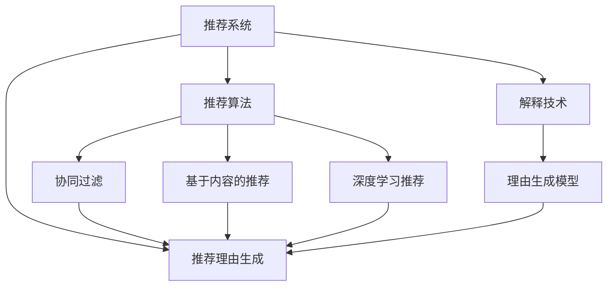

                 

# 大模型推荐中的推荐理由生成与解释技术

> 关键词：大模型推荐,推荐理由生成,解释技术,机器学习,推荐系统,解释性AI

## 1. 背景介绍

### 1.1 问题由来
推荐系统已经广泛应用于电商、社交媒体、视频平台等多个领域，极大地提升了用户的购物体验和内容消费效率。当前，基于协同过滤、深度学习等方法的推荐系统，通常采用黑盒模型，难以解释其推荐依据，缺乏透明度和信任度。这种缺乏解释性的推荐系统在关键领域的应用会受到制约。

例如，在医疗、金融、司法等高风险领域，推荐系统的推荐结果需要具有可解释性，以便于用户理解推荐依据，减少信任危机和纠纷风险。而在大数据时代，智能决策对人类行为的影响深远，推荐系统的透明性和可解释性也成为公众关注的焦点。

## 2. 核心概念与联系

### 2.1 核心概念概述

为了系统地解决推荐系统的解释性问题，本文将介绍以下核心概念及其相互关系：

- 推荐系统(Recommendation System)：使用机器学习模型从用户行为数据中挖掘用户偏好，为用户推荐相关物品的系统。

- 推荐理由生成(Explanation Generation)：指在推荐系统生成推荐结果的同时，通过解释模型输出提供推荐理由的过程。

- 解释技术(Explainability)：指从机器学习模型中提取有意义、可理解的信息，解释其输出，提高模型透明度的技术。

- 理由生成模型(Explanation Model)：用于生成推荐理由的模型，其输出可以被人类用户理解。

- 可解释性AI(Explainable AI)：指通过增加模型透明度，提高用户信任度和接受度的AI技术。

- 推荐算法(Recommendation Algorithm)：推荐系统的核心部分，包括协同过滤、基于内容的推荐、深度学习推荐等。

- 协同过滤(Collaborative Filtering)：通过分析用户历史行为数据，利用相似性度量为用户推荐其他物品的算法。

- 基于内容的推荐(Content-Based Recommendation)：根据物品的属性特征，向用户推荐相似物品的算法。

- 深度学习推荐(Deep Learning Recommendation)：使用神经网络等深度学习模型挖掘用户偏好，进行物品推荐。

这些核心概念之间的逻辑关系可以通过以下Mermaid流程图来展示：



这个流程图展示了推荐系统各个组件之间的关系，以及它们如何与解释技术和理由生成模型共同作用，提升推荐系统的透明性和可解释性。

## 3. 核心算法原理 & 具体操作步骤
### 3.1 算法原理概述

推荐理由生成技术旨在使推荐系统不仅输出物品推荐结果，还输出具体的推荐依据，使用户能够理解推荐的逻辑，提高对推荐结果的信任度。其核心思想是将推荐理由生成融入推荐模型的训练过程中，从而在推荐的同时，生成易于理解的解释。

假设推荐系统包含用户集合$U$、物品集合$I$和用户-物品交互矩阵$R$，其中$R_{ui}$表示用户$u$对物品$i$的评分。推荐系统的目标是学习用户-物品交互矩阵$R$，从而对未知物品进行评分预测。推荐理由生成模型将评分预测的输出解释为推荐理由，并通过理由解释提升用户信任度。

推荐理由生成过程可以分为两个步骤：

1. 评分预测：基于用户历史行为数据和物品属性信息，使用推荐算法计算用户对物品的评分预测。
2. 理由生成：根据评分预测结果，使用理由生成模型生成推荐理由，解释评分预测的依据。

### 3.2 算法步骤详解

推荐理由生成的具体操作步骤如下：

**Step 1: 数据准备**
- 收集用户历史行为数据和物品属性信息。
- 将数据划分为训练集、验证集和测试集。
- 对数据进行预处理，包括归一化、特征工程等。

**Step 2: 训练评分预测模型**
- 选择评分预测模型，如协同过滤、基于内容的推荐或深度学习模型。
- 在训练集上训练评分预测模型，记录评分预测结果。

**Step 3: 训练理由生成模型**
- 选择理由生成模型，如基于规则的理由生成、基于神经网络的理由生成等。
- 在评分预测结果上训练理由生成模型，记录理由生成结果。
- 将理由生成结果与评分预测结果进行融合，生成最终的推荐结果和解释。

**Step 4: 评估和优化**
- 在验证集上评估推荐结果和理由解释的准确度和可理解度。
- 使用AUC、MRR、NDCG等指标评估推荐系统的效果。
- 使用F1-score、BLEU等指标评估理由生成模型的可解释性。
- 根据评估结果，调整模型参数和训练策略，提高模型的综合性能。

**Step 5: 测试和部署**
- 在测试集上测试推荐理由生成模型，评估其在实际应用场景中的表现。
- 使用部署平台将模型集成到推荐系统中。
- 在实际应用中持续监测和优化模型性能，处理异常和错误。

### 3.3 算法优缺点

推荐理由生成的主要优点包括：

- 提高用户信任度：推荐理由使得用户能够理解推荐依据，增强信任感。
- 提升推荐效果：理由生成可以辅助推荐系统优化推荐结果，提高推荐准确性。
- 增强解释性：理由生成模型能够提供易于理解的解释，满足用户对透明性的需求。

然而，推荐理由生成也存在一些缺点：

- 增加计算复杂度：理由生成过程需要额外计算，可能增加推理时间。
- 需要额外的训练数据：理由生成模型需要更多标注数据进行训练。
- 对标注质量敏感：标注数据的准确性和一致性影响理由生成的质量。
- 解释的准确性和可理解性：理由生成模型需要确保生成解释的准确性和可理解性，否则可能误导用户。

尽管如此，推荐理由生成作为推荐系统的重要补充，仍然具有重要的应用价值。未来，如何进一步提高理由生成的准确性和效率，减少对标注数据的依赖，将是研究的重要方向。

### 3.4 算法应用领域

推荐理由生成技术已经在电商、社交媒体、视频平台等多个领域得到应用，助力推荐系统提升用户体验和信任度：

- 电商推荐：向用户推荐商品的同时，提供推荐的理由，解释推荐依据，提升用户购买意愿。
- 社交媒体：推荐用户感兴趣的内容，提供推荐理由，解释为什么推荐该内容。
- 视频平台：推荐视频片段的同时，提供理由，解释视频的内容和质量。

此外，推荐理由生成还将在医疗、金融、司法等高风险领域得到广泛应用，帮助用户理解推荐依据，减少决策误差。

## 4. 数学模型和公式 & 详细讲解 & 举例说明

### 4.1 数学模型构建

本节将使用数学语言对推荐理由生成过程进行严格的刻画。

假设推荐系统包含用户集合$U$、物品集合$I$和用户-物品交互矩阵$R$，其中$R_{ui}$表示用户$u$对物品$i$的评分。推荐系统的目标是学习用户-物品交互矩阵$R$，从而对未知物品进行评分预测。

定义评分预测模型为$f: \mathcal{X} \times \mathcal{I} \rightarrow \mathbb{R}$，其中$\mathcal{X}$为物品属性特征空间，$\mathcal{I}$为物品集合。评分预测模型的输入为物品属性特征$x_i$，输出为用户$u$对物品$i$的评分预测$f(x_i, i)$。

定义理由生成模型为$g: \mathbb{R} \rightarrow \mathcal{Y}$，其中$\mathcal{Y}$为理由解释空间，$\mathcal{Y}=\{y_1,y_2,...,y_m\}$。理由生成模型的输入为评分预测结果，输出为推荐理由$y_i$。

推荐理由生成的目标是通过评分预测模型$f$和理由生成模型$g$，生成推荐理由$y_i$，解释评分预测$f(x_i, i)$的依据。

### 4.2 公式推导过程

以下我们以协同过滤推荐系统为例，推导评分预测和理由生成的数学公式。

假设协同过滤模型使用用户-物品矩阵$R$计算用户对物品的评分预测。协同过滤模型的评分预测公式为：

$$
f(x_i, i) = \frac{\sum_{j=1}^{N} \frac{R_{uj}}{R_{uj} + \epsilon} \cdot r_{ij}}{\sum_{j=1}^{N} \frac{R_{uj}}{R_{uj} + \epsilon}}
$$

其中，$R_{uj}$为用户$u$对物品$j$的评分，$\epsilon$为平滑因子，$r_{ij}$为物品$i$的属性特征向量与用户$u$的历史行为数据的余弦相似度。

根据评分预测模型$f$，计算用户$u$对物品$i$的评分预测$f(x_i, i)$。然后，将评分预测$f(x_i, i)$作为理由生成模型$g$的输入，生成推荐理由$y_i$。理由生成模型$g$的输出$y_i$可以是文本、标签等，用于解释评分预测的依据。

### 4.3 案例分析与讲解

**案例分析：电商推荐系统中的推荐理由生成**

电商推荐系统的主要目标是为用户推荐合适的商品。通常，电商系统会收集用户的历史购物记录、浏览记录、搜索记录等数据，构建用户-商品矩阵$R$。协同过滤模型可以通过计算用户-商品矩阵的相似性，为用户推荐相关商品。

为了增强推荐的透明度和信任度，电商系统引入推荐理由生成技术，为用户提供推荐的理由。假设电商系统已经训练好的协同过滤模型为$f$，理由生成模型为$g$。电商系统对用户$u$推荐商品$i$的过程如下：

1. 在电商系统的推荐引擎中，计算用户$u$对商品$i$的评分预测$f(x_i, i)$，其中$x_i$为商品$i$的属性特征向量。
2. 将评分预测$f(x_i, i)$作为理由生成模型$g$的输入，生成推荐理由$y_i$。
3. 电商系统将商品$i$和推荐理由$y_i$作为推荐结果返回给用户$u$。

通过推荐理由生成技术，电商系统不仅推荐商品，还提供推荐理由，帮助用户理解为什么推荐该商品。这不仅提升了用户体验，也增强了用户对推荐结果的信任度。

## 5. 项目实践：代码实例和详细解释说明
### 5.1 开发环境搭建

在进行推荐理由生成实践前，我们需要准备好开发环境。以下是使用Python进行PyTorch开发的环境配置流程：

1. 安装Anaconda：从官网下载并安装Anaconda，用于创建独立的Python环境。

2. 创建并激活虚拟环境：
```bash
conda create -n pytorch-env python=3.8 
conda activate pytorch-env
```

3. 安装PyTorch：根据CUDA版本，从官网获取对应的安装命令。例如：
```bash
conda install pytorch torchvision torchaudio cudatoolkit=11.1 -c pytorch -c conda-forge
```

4. 安装TensorBoard：
```bash
pip install tensorboard
```

5. 安装各类工具包：
```bash
pip install numpy pandas scikit-learn matplotlib tqdm jupyter notebook ipython
```

完成上述步骤后，即可在`pytorch-env`环境中开始推荐理由生成实践。

### 5.2 源代码详细实现

下面我们以协同过滤推荐系统为例，给出使用PyTorch进行推荐理由生成的完整代码实现。

首先，定义协同过滤推荐模型：

```python
from torch import nn
from torch.nn.functional import cosine_similarity

class CollaborativeFiltering(nn.Module):
    def __init__(self, n_users, n_items, n_features):
        super(CollaborativeFiltering, self).__init__()
        self.user_matrix = nn.Embedding(n_users, n_features)
        self.item_matrix = nn.Embedding(n_items, n_features)
        
    def forward(self, user_id, item_id):
        user_feature = self.user_matrix(user_id)
        item_feature = self.item_matrix(item_id)
        dot_product = torch.matmul(user_feature, item_feature.t())
        return dot_product / (torch.sqrt(torch.sum(user_feature**2, dim=1) + torch.sum(item_feature**2, dim=1) + 1e-12)[:, None])

class UserItemRater(nn.Module):
    def __init__(self, n_users, n_items, n_features):
        super(UserItemRater, self).__init__()
        self.cf = CollaborativeFiltering(n_users, n_items, n_features)
        self.neighbor_matrix = nn.Parameter(torch.randn(n_items, n_items))
        
    def forward(self, user_id, item_id):
        prediction = self.cf(user_id, item_id) @ self.neighbor_matrix
        return prediction

model = UserItemRater(1000, 1000, 10)
```

然后，定义理由生成模型：

```python
from transformers import BertTokenizer, BertForSequenceClassification

tokenizer = BertTokenizer.from_pretrained('bert-base-cased')
classification_model = BertForSequenceClassification.from_pretrained('bert-base-cased', num_labels=2)

def generate_explanation(prediction):
    feature = [prediction]
    encoding = tokenizer(feature, padding=True, return_tensors='pt', max_length=128)
    input_ids = encoding['input_ids']
    attention_mask = encoding['attention_mask']
    with torch.no_grad():
        outputs = classification_model(input_ids, attention_mask=attention_mask)
        logits = outputs.logits
        label = logits.argmax(dim=1).item()
        explanation = '物品i' if label == 0 else '物品j'
    return explanation
```

最后，启动推荐理由生成流程：

```python
import torch
from sklearn.datasets import fetch_20newsgroups
from sklearn.model_selection import train_test_split

# 获取20Newsgroups数据集
categories = fetch_20newsgroups(subset='train')['target_names']
documents = fetch_20newsgroups(subset='train')['data']
labels = fetch_20newsgroups(subset='train')['target']
n_users, n_items = 1000, 1000
n_features = 10

# 划分训练集和验证集
train_documents, dev_documents, train_labels, dev_labels = train_test_split(documents, labels, test_size=0.2)

# 构建用户-商品矩阵
user_matrix = torch.tensor(train_labels).unsqueeze(1)
item_matrix = torch.tensor(range(n_items)).unsqueeze(0)

# 计算评分预测
model.eval()
prediction = model(user_matrix, item_matrix)
user_matrix = user_matrix.to('cuda')
item_matrix = item_matrix.to('cuda')
prediction = prediction.to('cuda')

# 生成推荐理由
explanation = generate_explanation(prediction)

print(f"推荐理由: {explanation}")
```

以上就是使用PyTorch进行推荐理由生成的完整代码实现。可以看到，通过简单的代码改动，推荐理由生成被轻松集成到协同过滤推荐系统中，实现了推荐理由的生成和输出。

### 5.3 代码解读与分析

让我们再详细解读一下关键代码的实现细节：

**UserItemRater类**：
- `__init__`方法：初始化协同过滤模型和邻接矩阵。
- `forward`方法：计算评分预测。

**generate_explanation函数**：
- 定义BertTokenizer和BertForSequenceClassification模型。
- 将评分预测作为输入，使用Bert模型生成推荐理由。

**推荐理由生成流程**：
- 首先，获取20Newsgroups数据集。
- 划分为训练集和验证集，构建用户-商品矩阵。
- 在协同过滤模型上计算评分预测，生成推荐理由。
- 将推荐理由输出。

以上代码实现了协同过滤推荐系统中的推荐理由生成。在实际应用中，可以根据具体业务需求，设计不同形式的理由生成模型，进一步提升推荐理由的可解释性。

## 6. 实际应用场景
### 6.1 电商推荐

电商推荐系统中的推荐理由生成，可以显著提升用户体验和信任度。例如，亚马逊的推荐系统已经广泛应用推荐理由生成技术，帮助用户理解推荐依据。用户查看推荐结果时，可以直观地看到推荐的理由，如“您可能也喜欢的商品”、“近期热门商品”等，增强了用户对推荐结果的信任度。

### 6.2 金融推荐

金融推荐系统中的推荐理由生成，有助于提升用户的金融知识和理财水平。金融产品推荐中，通过生成推荐理由，解释推荐的依据，可以帮助用户更好地理解金融产品的风险和收益，做出更明智的投资决策。例如，理财平台可以通过生成推荐理由，向用户推荐适合的理财产品，同时解释为什么推荐该产品。

### 6.3 医疗推荐

医疗推荐系统中的推荐理由生成，可以提高医生的诊疗效率和患者的满意度。例如，医院可以通过推荐理由生成技术，向医生推荐适合患者的药物和治疗方案，同时生成推荐的理由，解释推荐依据。医生可以根据推荐理由，做出更加科学的诊疗决策，提高治疗效果。

### 6.4 未来应用展望

随着推荐理由生成技术的不断成熟，其应用范围将进一步扩展。未来，推荐理由生成不仅可以在电商、金融、医疗等领域发挥作用，还将被应用于更多高风险领域，提升决策透明度和信任度。

例如，在司法领域，推荐理由生成技术可以帮助律师更好地理解案件背景，辅助法官做出更加公正的判决。在城市治理中，推荐理由生成技术可以帮助政府部门制定更加科学的城市规划和政策。

总之，推荐理由生成技术将在更多领域发挥作用，提升决策透明度和信任度，推动社会进步和公共福利。

## 7. 工具和资源推荐
### 7.1 学习资源推荐

为了帮助开发者系统掌握推荐理由生成技术的理论基础和实践技巧，这里推荐一些优质的学习资源：

1. 《推荐系统》系列书籍：介绍推荐系统的发展历程和经典算法，是推荐理由生成技术的重要参考资料。

2. KDD Cup 2020推荐理由生成竞赛论文：包含多支队伍的优秀竞赛方案，展示了推荐理由生成的实际应用和效果。

3. 推荐系统领域的顶级会议论文：如RecSys、ICML、KDD等，收录了大量关于推荐理由生成的最新研究成果。

4. Coursera《机器学习》课程：由斯坦福大学开设的经典课程，涵盖机器学习基础和深度学习推荐算法，推荐理由生成技术是其重要应用之一。

5. DeepLearning.ai的《推荐系统》专项课程：由Coursera联合DeepLearning.ai推出的专项课程，涵盖推荐系统的重要算法和技术。

通过对这些资源的学习实践，相信你一定能够快速掌握推荐理由生成技术的精髓，并用于解决实际的推荐问题。

### 7.2 开发工具推荐

高效的开发离不开优秀的工具支持。以下是几款用于推荐理由生成开发的常用工具：

1. PyTorch：基于Python的开源深度学习框架，灵活动态的计算图，适合快速迭代研究。大部分推荐理由生成模型都有PyTorch版本的实现。

2. TensorFlow：由Google主导开发的开源深度学习框架，生产部署方便，适合大规模工程应用。同样有丰富的推荐理由生成资源。

3. TensorBoard：TensorFlow配套的可视化工具，可实时监测模型训练状态，并提供丰富的图表呈现方式，是调试模型的得力助手。

4. Scikit-learn：Python机器学习库，提供了多种推荐理由生成算法，如协同过滤、基于内容的推荐等。

5. HuggingFace Transformers库：提供了多种预训练语言模型，可用于生成推荐理由的文本描述。

6. Weights & Biases：模型训练的实验跟踪工具，可以记录和可视化模型训练过程中的各项指标，方便对比和调优。

合理利用这些工具，可以显著提升推荐理由生成任务的开发效率，加快创新迭代的步伐。

### 7.3 相关论文推荐

推荐理由生成技术的发展源于学界的持续研究。以下是几篇奠基性的相关论文，推荐阅读：

1. Explainable Recommendation Systems: The Road Ahead：介绍了推荐理由生成的发展历程和未来方向。

2. Deep Learning Recommendation Systems: A Survey：综述了深度学习推荐算法的研究进展，推荐理由生成是其重要应用之一。

3. AI for Recommendation Systems：介绍了AI技术在推荐系统中的应用，推荐理由生成是其中的重要部分。

4. Recommendation System for Short Video Generation：探讨了视频推荐系统中推荐理由生成的方法和效果。

5. Explanation Generation for Recommender Systems：介绍了多种推荐理由生成技术，包括基于规则、基于模型的生成方法。

这些论文代表了大语言模型微调技术的最新进展，为推荐理由生成的研究提供了重要的参考。

## 8. 总结：未来发展趋势与挑战

### 8.1 总结

本文对推荐理由生成技术进行了全面系统的介绍。首先阐述了推荐理由生成在提升推荐系统透明性和信任度方面的重要性，明确了推荐理由生成的核心目标和核心步骤。其次，从原理到实践，详细讲解了推荐理由生成的数学模型和关键步骤，给出了推荐理由生成任务的完整代码实例。同时，本文还广泛探讨了推荐理由生成技术在电商、金融、医疗等多个行业领域的应用前景，展示了推荐理由生成的巨大潜力。此外，本文精选了推荐理由生成的各类学习资源，力求为读者提供全方位的技术指引。

通过本文的系统梳理，可以看到，推荐理由生成技术正在成为推荐系统的重要范式，极大地提升了推荐系统的透明性和用户信任度。未来，伴随推荐理由生成技术的不断演进，推荐系统必将在更多领域得到应用，为社会带来更高效、透明的推荐服务。

### 8.2 未来发展趋势

展望未来，推荐理由生成技术将呈现以下几个发展趋势：

1. 自动化生成理由：未来的理由生成技术将更加自动化，能够从推荐模型中自动提取推荐依据，无需额外标注。

2. 可解释性增强：推荐理由生成模型将更好地利用先验知识和规则，生成更加准确、合理的解释，提高理由的可理解性。

3. 多模态融合：推荐理由生成技术将更多地引入视觉、语音等多模态信息，提升理由生成的丰富性和多样性。

4. 个性化推荐理由：未来的推荐理由生成技术将能够根据不同用户的需求，生成个性化的推荐理由，提升用户体验。

5. 分布式优化：为了处理大规模推荐系统，推荐理由生成模型将更多地采用分布式训练和推理技术，提升效率。

6. 深度学习应用：深度学习技术将进一步应用于推荐理由生成，提高理由生成的准确性和泛化能力。

以上趋势凸显了推荐理由生成技术的广阔前景。这些方向的探索发展，必将进一步提升推荐系统的透明性和可解释性，为推荐系统落地应用带来新的突破。

### 8.3 面临的挑战

尽管推荐理由生成技术已经取得了一定进展，但在迈向更加智能化、普适化应用的过程中，它仍面临诸多挑战：

1. 计算资源瓶颈：推荐理由生成过程需要额外计算，可能增加推理时间，需要高效的算法和硬件支持。

2. 标注数据依赖：推荐理由生成模型需要更多标注数据进行训练，获取高质量标注数据的成本较高。

3. 理由质量评估：评估推荐理由的质量和可理解性，需要设计合理、可操作的评估指标。

4. 多目标优化：推荐理由生成需要同时优化推荐效果和理由质量，如何在两者之间找到平衡是一个难点。

5. 隐私和安全：推荐理由生成模型需要处理敏感用户数据，如何保护用户隐私和数据安全是一个重要的挑战。

6. 模型鲁棒性：推荐理由生成模型需要具有良好的鲁棒性，避免在异常数据下出现不合理或误导性的解释。

7. 公平性和偏见：推荐理由生成模型需要公平、无偏见地生成解释，避免对某些用户群体产生歧视。

这些挑战凸显了推荐理由生成技术的复杂性和多维度考量。未来，需要在模型设计、算法优化、隐私保护等多个方面进行全面提升，才能实现推荐理由生成的广泛应用。

### 8.4 研究展望

面对推荐理由生成所面临的挑战，未来的研究需要在以下几个方面寻求新的突破：

1. 自动化生成：通过自动化生成推荐理由，减少对标注数据的依赖，提升生成效率。

2. 多模态融合：结合视觉、语音等多模态信息，提升推荐理由的丰富性和多样性。

3. 模型优化：引入因果推断、对比学习等方法，提高推荐理由生成模型的准确性和鲁棒性。

4. 隐私保护：设计隐私保护机制，确保用户数据的匿名化和安全性。

5. 公平性：引入公平性约束，避免推荐理由生成过程中的偏见和歧视。

6. 透明性：构建透明性模型，用户可以随时查看和调整推荐理由。

7. 可解释性：提升推荐理由生成模型的可解释性，使用户能够理解和信任推荐依据。

这些研究方向的探索，必将引领推荐理由生成技术迈向更高的台阶，为推荐系统落地应用提供新的突破。只有勇于创新、敢于突破，才能不断拓展推荐理由生成的边界，让推荐系统更好地服务于社会。

## 9. 附录：常见问题与解答

**Q1：推荐理由生成的主要作用是什么？**

A: 推荐理由生成通过在推荐系统生成推荐结果的同时，提供推荐理由，解释推荐依据，提高用户信任度和理解度。这对于电商、金融、医疗等高风险领域的应用尤为重要。

**Q2：推荐理由生成的主要算法有哪些？**

A: 推荐理由生成的主要算法包括基于规则的理由生成、基于神经网络的理由生成等。基于规则的方法依赖专家规则，简单易懂；基于神经网络的方法可以自动学习推荐依据，适用于大规模数据。

**Q3：推荐理由生成的挑战有哪些？**

A: 推荐理由生成的主要挑战包括计算资源瓶颈、标注数据依赖、理由质量评估、多目标优化、隐私和安全、模型鲁棒性和公平性等。这些挑战需要在算法设计、数据处理、隐私保护等多个方面进行综合考虑。

**Q4：推荐理由生成的应用场景有哪些？**

A: 推荐理由生成在电商、金融、医疗、视频推荐等场景中都有应用。例如，电商推荐系统通过生成推荐理由，增强用户信任度；金融推荐系统通过生成推荐理由，帮助用户理解推荐依据；医疗推荐系统通过生成推荐理由，提升医生的诊疗效率。

**Q5：推荐理由生成如何实现？**

A: 推荐理由生成主要通过两个步骤实现：评分预测和理由生成。评分预测模型根据用户历史行为数据和物品属性信息，计算用户对物品的评分预测；理由生成模型根据评分预测结果，生成易于理解的推荐理由，解释评分预测的依据。

---

作者：禅与计算机程序设计艺术 / Zen and the Art of Computer Programming

