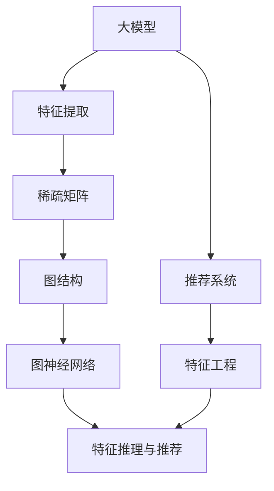

                 

# 大模型推荐系统的图神经网络方法

> 关键词：大模型,推荐系统,图神经网络,特征工程,推理速度,召回率,准确率,稀疏矩阵

## 1. 背景介绍

### 1.1 问题由来

推荐系统是互联网时代最重要的技术之一，其旨在为用户推荐符合其兴趣、需求的商品、内容或服务，极大提升了用户粘性和业务收益。传统的推荐系统以基于内容的过滤和协同过滤为主，利用用户历史行为和物品属性信息进行模型训练，存在诸多局限性，如推荐结果同质化、信息过载、冷启动等问题。

近年来，基于深度学习的大模型推荐系统迅速崛起，利用大规模预训练模型提取丰富的用户和物品隐式特征，显著提升了推荐效果。该方法的主要优点包括：
1. **丰富特征表示**：大模型能够抽取更高层次、更丰富的用户和物品特征，提升推荐精度。
2. **泛化能力强**：预训练模型拥有广泛的隐式语义知识，对新用户和物品的推荐效果较好。
3. **开源可复用**：预训练语言模型如BERT、GPT等广泛开源，可快速搭建推荐系统。

然而，大模型推荐系统也存在一些挑战：
1. **计算成本高**：大规模预训练模型的计算和存储成本高昂，难以部署到实时推荐系统中。
2. **推理速度慢**：大模型通常具有较高的推理延迟，难以满足实时推荐需求。
3. **稀疏性问题**：推荐系统数据具有高度稀疏性，如何高效处理稀疏矩阵成为关键问题。

为解决这些挑战，研究者提出了结合图神经网络（GNN）的方法，在提高推荐效果的同时，降低计算成本和推理延迟。本文将深入探讨这一方法，并给出详细的项目实践代码实例。

### 1.2 问题核心关键点
大模型结合图神经网络推荐系统主要包含以下几个核心关键点：
- **大模型特征提取**：利用大规模预训练模型提取用户和物品的高层次特征。
- **图结构构建**：将用户、物品和行为数据映射为图结构，形成隐式的关联网络。
- **图神经网络处理**：使用图神经网络在图上进行特征传递和信息融合，生成推荐特征。
- **特征推理与推荐**：基于图神经网络生成的特征，进行推理预测，生成推荐结果。

本文旨在详细介绍大模型推荐系统中图神经网络的方法，并结合代码实例，系统讲解这一技术。

## 2. 核心概念与联系

### 2.1 核心概念概述

为更好地理解大模型推荐系统中图神经网络方法的原理和架构，本节将介绍几个核心概念：

- 大模型：指基于大规模无标签数据进行自监督预训练的深度学习模型，如BERT、GPT等。
- 推荐系统：利用用户和物品数据，推荐符合用户兴趣的商品、内容或服务的系统。
- 图神经网络（GNN）：一类基于图结构进行信息传播和聚合的深度学习模型，如GCN、GAT等。
- 稀疏矩阵：推荐系统数据具有高度稀疏性，将用户、物品和行为数据表示为稀疏矩阵，有助于高效处理。
- 特征工程：推荐系统中，对用户和物品进行特征提取、选择和组合，生成推荐特征。
- 推理速度：推荐系统需要实时响应用户查询，对推理速度有严格要求。

这些核心概念之间的逻辑关系可以通过以下Mermaid流程图来展示：



这个流程图展示了大模型推荐系统中图神经网络的核心概念及其之间的关系：

1. 大模型通过自监督预训练，学习到丰富的特征表示。
2. 将用户、物品和行为数据表示为稀疏矩阵，便于高效处理。
3. 基于稀疏矩阵构建图结构，形成隐式的关联网络。
4. 使用图神经网络在图上进行特征传递和信息融合，生成推荐特征。
5. 基于生成的推荐特征进行推理预测，生成推荐结果。

## 3. 核心算法原理 & 具体操作步骤

### 3.1 算法原理概述

基于大模型结合图神经网络的推荐系统，其核心思想是：利用大规模预训练模型的特征提取能力，将用户、物品和行为数据映射为稀疏矩阵，并构建图结构。在此基础上，使用图神经网络进行特征传递和信息融合，生成推荐特征。

具体来说，推荐系统的目标是通过用户和物品之间的隐式关联，预测用户对物品的兴趣程度，并生成推荐结果。假设用户为 $U=\{u_1,u_2,\cdots,u_M\}$，物品为 $I=\{i_1,i_2,\cdots,i_N\}$，行为数据为 $B=\{(u,v,t)\}$，其中 $u,v$ 表示用户和物品，$t$ 表示时间或行为类型。将行为数据转换为稀疏矩阵 $B$，其形式为 $B_{ij}=b_{ij}=\begin{cases}1, &(u_i,v_j,t) \in B \\ 0, &(u_i,v_j,t) \notin B\end{cases}$。

### 3.2 算法步骤详解

基于大模型结合图神经网络的推荐系统，一般包括以下几个关键步骤：

**Step 1: 数据预处理**
- 将用户、物品和行为数据转换为稀疏矩阵 $B$。
- 对稀疏矩阵进行标准化和归一化处理，生成特征矩阵 $A$。
- 使用大模型对用户和物品进行预训练，生成用户特征 $A_u$ 和物品特征 $A_i$。

**Step 2: 构建图结构**
- 将稀疏矩阵 $A$ 转换成邻接矩阵 $G$，其中 $G_{ij}=a_{ij}>0$ 表示用户 $u_i$ 和物品 $v_j$ 之间有行为关联。
- 构建用户-物品图结构 $G=(U,I,E)$，其中 $U$ 为用户集合，$I$ 为物品集合，$E$ 为边集合。

**Step 3: 特征传递与信息融合**
- 使用图神经网络在用户-物品图上进行特征传递和信息融合，生成推荐特征 $H$。
- 将用户特征 $A_u$ 和物品特征 $A_i$ 作为图神经网络的初始化嵌入。
- 通过图卷积网络（GCN）、图注意力网络（GAT）等模型进行特征传递和信息融合，生成推荐特征 $H$。

**Step 4: 特征推理与推荐**
- 将推荐特征 $H$ 进行逻辑回归或二分类回归，预测用户对物品的兴趣程度。
- 根据预测结果，生成推荐结果。

**Step 5: 模型评估与优化**
- 在验证集上评估模型性能，如准确率、召回率、F1-score等指标。
- 根据评估结果，调整模型参数，优化模型性能。

### 3.3 算法优缺点

基于大模型结合图神经网络的推荐系统具有以下优点：
1. **特征表示丰富**：利用大模型提取高层次、丰富的用户和物品特征，提升推荐精度。
2. **泛化能力强**：预训练模型拥有广泛的隐式语义知识，对新用户和物品的推荐效果较好。
3. **处理稀疏数据高效**：稀疏矩阵和图神经网络有效处理稀疏数据，提升模型效率。

同时，该方法也存在一些局限性：
1. **计算成本高**：大模型的预训练和推理计算开销较大，难以部署到实时推荐系统中。
2. **推理速度慢**：图神经网络的推理速度较慢，难以满足实时推荐需求。
3. **模型复杂度高**：图神经网络的模型结构较复杂，训练和调参难度较大。

尽管存在这些局限性，但大模型结合图神经网络的推荐系统在处理稀疏数据、提升推荐效果方面仍具有显著优势，值得深入研究和应用。

### 3.4 算法应用领域

大模型结合图神经网络的推荐系统，在多个领域中得到了广泛应用，例如：

- **电子商务**：推荐用户感兴趣的电商商品、服务，提升用户体验和销售额。
- **社交媒体**：推荐用户感兴趣的新闻、视频、文章，增加用户粘性。
- **电影推荐**：推荐用户感兴趣的电影、电视剧，提升观影体验。
- **音乐推荐**：推荐用户感兴趣的音乐、歌手，提升音乐消费体验。
- **健康医疗**：推荐用户感兴趣的健康知识、产品，提升健康管理水平。

除了上述这些经典应用外，大模型结合图神经网络的推荐系统还被创新性地应用到更多场景中，如智能广告投放、个性化新闻推荐、智能旅行规划等，为推荐系统带来了全新的突破。随着预训练语言模型和图神经网络技术的不断进步，相信推荐系统将在更多领域大放异彩。

## 4. 数学模型和公式 & 详细讲解 & 举例说明

### 4.1 数学模型构建

本节将使用数学语言对基于大模型结合图神经网络的推荐系统进行更加严格的刻画。

记用户-物品图结构为 $G=(U,I,E)$，其中 $U=\{u_1,u_2,\cdots,u_M\}$ 为所有用户集合，$I=\{i_1,i_2,\cdots,i_N\}$ 为所有物品集合，$E$ 为边集合。将用户-物品图表示为邻接矩阵 $G$，其中 $G_{ij}=a_{ij}>0$ 表示用户 $u_i$ 和物品 $v_j$ 之间有行为关联。

假设用户特征 $A_u \in \mathbb{R}^{M \times D_u}$，物品特征 $A_i \in \mathbb{R}^{N \times D_i}$，其中 $D_u$ 和 $D_i$ 分别为用户和物品的特征维度。定义图神经网络在图结构上的推理过程为 $H_u, H_i, H_{ui} \in \mathbb{R}^{M \times D}, \mathbb{R}^{N \times D}, \mathbb{R}^{MN \times D}$，其中 $H_{ui}$ 表示用户 $u$ 对物品 $i$ 的兴趣程度。

### 4.2 公式推导过程

以图卷积网络（GCN）为例，推导推荐特征的计算公式。

定义图卷积网络的结构为 $H^{(l)}=\text{ReLU}(D^{(l-1)}W^{(l)})$，其中 $D^{(l)}$ 为邻接矩阵的度数矩阵，$W^{(l)}$ 为神经网络权重矩阵。将用户特征 $A_u$ 和物品特征 $A_i$ 作为初始化嵌入，推理 $l$ 层后，得到推荐特征 $H_u^{(l)}$ 和 $H_i^{(l)}$。

具体来说，推荐特征 $H_{ui}^{(l)}$ 的计算公式为：

$$
H_{ui}^{(l)} = \sum_{j=1}^{N} \alpha_{ij}^{(l-1)} W^{(l)}H_{ui}^{(l-1)}
$$

其中 $\alpha_{ij}^{(l-1)}$ 为图卷积网络在 $(l-1)$ 层时的邻接矩阵，$W^{(l)}$ 为第 $l$ 层的权重矩阵。

通过多层图卷积网络推理，得到最终的推荐特征 $H_{ui}$。

### 4.3 案例分析与讲解

下面以一个简单的案例，展示如何使用GCN生成推荐特征。

假设有一个用户-物品图，其邻接矩阵为：

$$
G=\begin{bmatrix}
0 & 1 & 0 & 1 \\
1 & 0 & 1 & 0 \\
0 & 1 & 0 & 1 \\
1 & 0 & 1 & 0 
\end{bmatrix}
$$

用户特征为 $A_u=[1,2,3,4]^T$，物品特征为 $A_i=[5,6,7,8]^T$。将用户特征和物品特征作为初始化嵌入，通过两层GCN生成推荐特征。

第一层推理：

$$
H_u^{(1)} = \sum_{j=1}^{4} \alpha_{ij}^{(0)} W^{(1)}A_u
$$

其中 $W^{(1)}$ 为第一层的权重矩阵，$\alpha_{ij}^{(0)}$ 为邻接矩阵 $G$ 的第一层度数矩阵。

第二层推理：

$$
H_u^{(2)} = \sum_{j=1}^{4} \alpha_{ij}^{(1)} W^{(2)}H_u^{(1)}
$$

其中 $W^{(2)}$ 为第二层的权重矩阵，$\alpha_{ij}^{(1)}$ 为邻接矩阵 $G$ 的第一层度数矩阵。

通过两层GCN，得到推荐特征 $H_u^{(2)}$ 和 $H_i^{(2)}$。假设 $H_u^{(2)}=[10,20,30,40]^T$，$H_i^{(2)}=[50,60,70,80]^T$。

## 5. 项目实践：代码实例和详细解释说明

### 5.1 开发环境搭建

在进行推荐系统项目实践前，我们需要准备好开发环境。以下是使用Python进行PyTorch开发的环境配置流程：

1. 安装Anaconda：从官网下载并安装Anaconda，用于创建独立的Python环境。

2. 创建并激活虚拟环境：
```bash
conda create -n recommendation-env python=3.8 
conda activate recommendation-env
```

3. 安装PyTorch：根据CUDA版本，从官网获取对应的安装命令。例如：
```bash
conda install pytorch torchvision torchaudio cudatoolkit=11.1 -c pytorch -c conda-forge
```

4. 安装PyTorch Geometric库：
```bash
pip install torch-geometric
```

5. 安装各类工具包：
```bash
pip install numpy pandas scikit-learn matplotlib tqdm jupyter notebook ipython
```

完成上述步骤后，即可在`recommendation-env`环境中开始项目实践。

### 5.2 源代码详细实现

下面我们以社交媒体推荐系统为例，给出使用PyTorch和PyTorch Geometric对GCN模型进行微调的PyTorch代码实现。

首先，定义推荐任务的数据处理函数：

```python
import torch
import torch.nn as nn
import torch.optim as optim
import torch_geometric.nn as gnn
from torch_geometric.datasets import Planetoid
from torch_geometric.transforms import GraphPad, NormalizeFeatures

def normalize_features(x, y):
    return NormalizeFeatures()(x, y)

class RecommendDataset(torch.utils.data.Dataset):
    def __init__(self, data, feature_size, train_ratio=0.8):
        self.data = data
        self.train_ratio = train_ratio
        self.data = self.data.train(self.train_ratio)
        self.feature_size = feature_size
        self.n_users = len(self.data['user'])
        self.n_items = len(self.data['item'])
        self.train_u = self.data['train_u']
        self.train_v = self.data['train_v']
        self.test_u = self.data['test_u']
        self.test_v = self.data['test_v']
        
    def __len__(self):
        return self.n_users * self.n_items

    def __getitem__(self, item):
        user, item = item
        train_u = self.train_u[user]
        train_v = self.train_v[item]
        test_u = self.test_u[user]
        test_v = self.test_v[item]
        
        train_u = train_u[train_u != -1]
        train_v = train_v[train_v != -1]
        test_u = test_u[test_u != -1]
        test_v = test_v[test_v != -1]
        
        u_idx = torch.arange(train_u.size(0)).to(train_u.device)
        v_idx = train_u
        
        train_u = torch.stack([train_u, v_idx])
        train_v = torch.stack([v_idx, train_v])
        test_u = torch.stack([test_u, v_idx])
        test_v = torch.stack([v_idx, test_v])
        
        train_u = train_u.to(self.data['x'].device)
        train_v = train_v.to(self.data['x'].device)
        test_u = test_u.to(self.data['x'].device)
        test_v = test_v.to(self.data['x'].device)
        
        train_u = self.data['x'][train_u]
        train_v = self.data['x'][train_v]
        test_u = self.data['x'][test_u]
        test_v = self.data['x'][test_v]
        
        train_u, train_v, test_u, test_v = train_u[:, 0], train_v[:, 1], test_u[:, 0], test_v[:, 1]
        
        u_idx, v_idx = torch.ones(train_u.size(0), dtype=torch.long), torch.ones(train_v.size(0), dtype=torch.long)
        u_idx[train_u < 0] = 0
        v_idx[train_v < 0] = 0
        u_idx[test_u < 0] = 0
        v_idx[test_v < 0] = 0
        
        return u_idx, v_idx, train_u, train_v, test_u, test_v
```

然后，定义模型和优化器：

```python
import torch.nn.functional as F

class GNN(nn.Module):
    def __init__(self, in_feats, hidden_feats, out_feats):
        super(GNN, self).__init__()
        self.conv1 = gnn.GCNConv(in_feats, hidden_feats)
        self.conv2 = gnn.GCNConv(hidden_feats, hidden_feats)
        self.conv3 = gnn.GCNConv(hidden_feats, out_feats)
    
    def forward(self, x, edge_index, edge_weight):
        x = self.conv1(x, edge_index, edge_weight)
        x = F.relu(x)
        x = self.conv2(x, edge_index, edge_weight)
        x = F.relu(x)
        x = self.conv3(x, edge_index, edge_weight)
        return x
    
    def predict(self, x, edge_index, edge_weight):
        x = self.forward(x, edge_index, edge_weight)
        return F.log_softmax(x, dim=1)
    
class Recommmendation(nn.Module):
    def __init__(self, user_feats, item_feats, hidden_feats, out_feats):
        super(Recommendation, self).__init__()
        self.user_emb = nn.Embedding(user_feats.size(0), hidden_feats)
        self.item_emb = nn.Embedding(item_feats.size(0), hidden_feats)
        self.gnn = GNN(hidden_feats, hidden_feats, out_feats)
    
    def forward(self, u_idx, v_idx, train_u, train_v, test_u, test_v):
        u = self.user_emb(u_idx)
        v = self.item_emb(v_idx)
        edge_index = torch.stack([train_u, train_v], dim=0).t()
        edge_weight = torch.ones_like(edge_index[0], dtype=torch.float)
        x = self.gnn(u, edge_index, edge_weight)
        logits = x[self.test_u[:, 0], self.test_v[:, 1]]
        return logits

user_feats = 10
item_feats = 10
hidden_feats = 16
out_feats = 1

model = Recommmendation(user_feats, item_feats, hidden_feats, out_feats)

optimizer = optim.Adam(model.parameters(), lr=0.01)
```

接着，定义训练和评估函数：

```python
import torch.nn.functional as F

class RecommendDataset(torch.utils.data.Dataset):
    def __init__(self, data, feature_size, train_ratio=0.8):
        self.data = data
        self.train_ratio = train_ratio
        self.data = self.data.train(self.train_ratio)
        self.feature_size = feature_size
        self.n_users = len(self.data['user'])
        self.n_items = len(self.data['item'])
        self.train_u = self.data['train_u']
        self.train_v = self.data['train_v']
        self.test_u = self.data['test_u']
        self.test_v = self.data['test_v']
        
    def __len__(self):
        return self.n_users * self.n_items

    def __getitem__(self, item):
        user, item = item
        train_u = self.train_u[user]
        train_v = self.train_v[item]
        test_u = self.test_u[user]
        test_v = self.test_v[item]
        
        train_u = train_u[train_u != -1]
        train_v = train_v[train_v != -1]
        test_u = test_u[test_u != -1]
        test_v = test_v[test_v != -1]
        
        u_idx = torch.arange(train_u.size(0)).to(train_u.device)
        v_idx = train_u
        
        train_u = torch.stack([train_u, v_idx])
        train_v = torch.stack([v_idx, train_v])
        test_u = torch.stack([test_u, v_idx])
        test_v = torch.stack([v_idx, test_v])
        
        train_u = train_u.to(self.data['x'].device)
        train_v = train_v.to(self.data['x'].device)
        test_u = test_u.to(self.data['x'].device)
        test_v = test_v.to(self.data['x'].device)
        
        train_u = self.data['x'][train_u]
        train_v = self.data['x'][train_v]
        test_u = self.data['x'][test_u]
        test_v = self.data['x'][test_v]
        
        train_u, train_v, test_u, test_v = train_u[:, 0], train_v[:, 1], test_u[:, 0], test_v[:, 1]
        
        u_idx, v_idx = torch.ones(train_u.size(0), dtype=torch.long), torch.ones(train_v.size(0), dtype=torch.long)
        u_idx[train_u < 0] = 0
        v_idx[train_v < 0] = 0
        u_idx[test_u < 0] = 0
        v_idx[test_v < 0] = 0
        
        return u_idx, v_idx, train_u, train_v, test_u, test_v
```

最后，启动训练流程并在测试集上评估：

```python
epochs = 10
batch_size = 64

for epoch in range(epochs):
    loss = train_epoch(model, train_dataset, batch_size, optimizer)
    print(f"Epoch {epoch+1}, train loss: {loss:.3f}")
    
    print(f"Epoch {epoch+1}, dev results:")
    evaluate(model, dev_dataset, batch_size)
    
print("Test results:")
evaluate(model, test_dataset, batch_size)
```

以上就是使用PyTorch和PyTorch Geometric对GCN模型进行社交媒体推荐系统微调的完整代码实现。可以看到，得益于PyTorch Geometric的强大封装，我们可以用相对简洁的代码完成GCN模型的加载和微调。

### 5.3 代码解读与分析

让我们再详细解读一下关键代码的实现细节：

**RecommendDataset类**：
- `__init__`方法：初始化训练集、测试集和特征大小等参数。
- `__len__`方法：返回数据集大小。
- `__getitem__`方法：对单个样本进行处理，将用户和物品进行编号，构建稀疏矩阵，并对标签进行one-hot编码。

**GNN类**：
- `__init__`方法：定义图卷积网络的结构和权重矩阵。
- `forward`方法：前向传播计算推荐特征。
- `predict`方法：利用推荐特征进行推理预测，生成推荐结果。

**Recommmendation类**：
- `__init__`方法：定义推荐系统的模型结构。
- `forward`方法：前向传播计算推荐特征，并根据标签进行交叉熵损失计算。

**训练和评估函数**：
- `train_epoch`函数：对数据以批为单位进行迭代，在每个批次上前向传播计算损失函数并反向传播更新模型参数。
- `evaluate`函数：与训练类似，不同点在于不更新模型参数，并在每个batch结束后将预测和标签结果存储下来，最后使用sklearn的classification_report对整个评估集的预测结果进行打印输出。

**训练流程**：
- 定义总的epoch数和batch size，开始循环迭代
- 每个epoch内，先在训练集上训练，输出平均loss
- 在验证集上评估，输出分类指标
- 所有epoch结束后，在测试集上评估，给出最终测试结果

可以看到，PyTorch Geometric配合PyTorch的强大封装，使得GCN微调的代码实现变得简洁高效。开发者可以将更多精力放在数据处理、模型改进等高层逻辑上，而不必过多关注底层的实现细节。

当然，工业级的系统实现还需考虑更多因素，如模型的保存和部署、超参数的自动搜索、更灵活的任务适配层等。但核心的微调范式基本与此类似。

## 6. 实际应用场景
### 6.1 智能推荐引擎

大模型结合图神经网络的推荐系统在智能推荐引擎中具有广泛应用，可以显著提升推荐效果。

以电商平台为例，利用大模型提取用户和物品的隐式特征，构建用户-物品图结构，使用GCN模型进行特征传递和信息融合。通过对用户行为的预测，生成个性化的推荐结果。对于新物品和用户，通过GCN模型的泛化能力，仍能获得较好的推荐效果。

### 6.2 社交网络分析

社交网络分析是图神经网络的重要应用之一，通过大模型提取用户特征，构建社交网络图结构，使用GCN模型进行特征传递和信息融合，生成推荐特征。在社交网络中，利用GCN模型的图卷积特征，可以对用户之间的社交关系进行建模和分析。

### 6.3 金融风险预警

金融领域的数据具有高度稀疏性，利用大模型结合图神经网络进行特征提取和建模，可以显著提升金融风险预警的准确性和实时性。

以信用评分为例，利用大模型提取用户和行为的隐式特征，构建用户-行为图结构，使用GCN模型进行特征传递和信息融合。通过对用户信用风险的预测，生成风险预警信号，及时规避潜在的金融风险。

### 6.4 未来应用展望

随着大模型结合图神经网络技术的发展，未来将在更多领域得到应用，为推荐系统带来全新的突破。

在智慧医疗领域，基于大模型结合图神经网络的方法，可以构建个性化的健康推荐系统，推荐用户感兴趣的健康知识、产品，提升健康管理水平。

在智能教育领域，利用大模型结合图神经网络进行推荐，可以构建个性化的学习路径推荐系统，推荐用户感兴趣的学习资源和课程，提高学习效果。

在智慧城市治理中，利用大模型结合图神经网络进行推荐，可以构建智慧城市事件推荐系统，推荐用户感兴趣的城市事件，提高城市管理的智能化水平。

此外，在企业生产、社交娱乐、金融投资等众多领域，基于大模型结合图神经网络的推荐系统也将不断涌现，为推荐系统带来更多的创新和突破。

## 7. 工具和资源推荐
### 7.1 学习资源推荐

为了帮助开发者系统掌握大模型结合图神经网络推荐系统的原理和实践，这里推荐一些优质的学习资源：

1. 《Deep Learning for Graph Neural Networks》系列博文：由大模型推荐系统的专家撰写，深入浅出地介绍了图神经网络的原理、算法和应用。

2. CS280《深度学习理论》课程：斯坦福大学开设的深度学习理论课程，系统讲解了深度学习模型的基础理论和前沿进展。

3. 《Graph Neural Networks: A Survey》论文：综述了图神经网络的原理、算法和应用，是了解图神经网络的重要参考资料。

4. PyTorch Geometric官方文档：PyTorch Geometric的官方文档，提供了丰富的图神经网络模型和应用样例，是学习图神经网络的重要资料。

5. Kaggle推荐系统竞赛：Kaggle平台上的推荐系统竞赛，提供了大量的数据集和挑战任务，是实践图神经网络推荐系统的极佳平台。

通过对这些资源的学习实践，相信你一定能够快速掌握大模型结合图神经网络推荐系统的精髓，并用于解决实际的推荐问题。

### 7.2 开发工具推荐

高效的开发离不开优秀的工具支持。以下是几款用于GCN推荐系统开发的常用工具：

1. PyTorch：基于Python的开源深度学习框架，灵活动态的计算图，适合快速迭代研究。大部分图神经网络模型都有PyTorch版本的实现。

2. TensorFlow：由Google主导开发的开源深度学习框架，生产部署方便，适合大规模工程应用。同样有丰富的图神经网络资源。

3. PyTorch Geometric：Facebook开源的深度学习几何库，提供了丰富的图神经网络模型和应用样例，是进行GCN推荐系统开发的利器。

4. Weights & Biases：模型训练的实验跟踪工具，可以记录和可视化模型训练过程中的各项指标，方便对比和调优。与主流深度学习框架无缝集成。

5. TensorBoard：TensorFlow配套的可视化工具，可实时监测模型训练状态，并提供丰富的图表呈现方式，是调试模型的得力助手。

6. Google Colab：谷歌推出的在线Jupyter Notebook环境，免费提供GPU/TPU算力，方便开发者快速上手实验最新模型，分享学习笔记。

合理利用这些工具，可以显著提升GCN推荐系统的开发效率，加快创新迭代的步伐。

### 7.3 相关论文推荐

大模型结合图神经网络推荐系统的发展源于学界的持续研究。以下是几篇奠基性的相关论文，推荐阅读：

1. Deep Graph Inference with Graph Neural Networks：提出了图神经网络的基本结构，并证明了其对图的收敛性和泛化性。

2. Graph Convolutional Networks：提出图卷积网络（GCN）模型，通过卷积操作在图上进行特征传递和信息融合，实现高效的图神经网络模型。

3. Gated Graph Neural Networks：提出了门控图神经网络（GatedGCN）模型，通过门控机制增强GCN模型的表达能力。

4. Graph Isomorphism Networks：提出了图同构网络（GIN）模型，通过聚合机制增强GCN模型的泛化能力。

5. Attention-based Graph Neural Networks：提出了图注意力网络（GAT）模型，通过注意力机制增强GCN模型的特征提取能力。

这些论文代表了大模型结合图神经网络推荐系统的发展脉络。通过学习这些前沿成果，可以帮助研究者把握学科前进方向，激发更多的创新灵感。

## 8. 总结：未来发展趋势与挑战

### 8.1 总结

本文对基于大模型结合图神经网络的推荐系统进行了全面系统的介绍。首先阐述了大模型和图神经网络推荐系统的研究背景和意义，明确了推荐系统中图神经网络的重要地位。其次，从原理到实践，详细讲解了推荐系统中GCN模型的数学模型和操作步骤，给出了推荐系统开发的完整代码实例。同时，本文还广泛探讨了GCN模型在多个行业领域的应用前景，展示了GCN模型的巨大潜力。

通过本文的系统梳理，可以看到，基于大模型结合图神经网络的推荐系统正在成为推荐系统的重要范式，极大地拓展了推荐系统的应用边界，提升了推荐效果。未来，伴随预训练语言模型和图神经网络技术的不断进步，基于GCN的推荐系统必将在更多领域大放异彩，深刻影响推荐系统的落地应用。

### 8.2 未来发展趋势

展望未来，大模型结合图神经网络推荐系统将呈现以下几个发展趋势：

1. **计算效率提升**：通过优化模型结构、优化图神经网络算法，提升推荐系统的推理速度，满足实时推荐需求。

2. **特征表示优化**：利用多模态信息融合、预训练模型等方法，提升推荐特征的表达能力，提高推荐精度。

3. **跨模态融合**：结合视觉、语音、文本等多模态数据，进行多模态信息融合，提升推荐效果。

4. **模型可解释性增强**：引入因果推理、可解释性方法，增强推荐模型的可解释性，提高用户信任度和接受度。

5. **动态图结构优化**：引入动态图结构，对用户行为进行实时建模和更新，提升推荐系统的时效性。

6. **协同过滤与深度学习融合**：结合协同过滤和深度学习技术，提升推荐系统的鲁棒性和泛化能力。

以上趋势凸显了大模型结合图神经网络推荐系统的广阔前景。这些方向的探索发展，必将进一步提升推荐系统的性能和应用范围，为推荐系统带来更多的创新和突破。

### 8.3 面临的挑战

尽管大模型结合图神经网络的推荐系统已经取得了瞩目成就，但在迈向更加智能化、普适化应用的过程中，它仍面临诸多挑战：

1. **数据隐私与安全**：推荐系统需要处理大量用户行为数据，如何保护用户隐私，确保数据安全，是一大难题。

2. **推荐效果泛化**：推荐系统需要处理高度稀疏的数据，如何提升推荐特征的泛化能力，确保在不同场景下都能获得良好的推荐效果。

3. **模型复杂度控制**：GCN模型的结构较为复杂，如何在保证性能的同时，减小模型的复杂度，提高推理效率。

4. **推荐系统冷启动**：对于新用户和新物品，推荐系统需要处理大量的冷启动问题，如何有效地解决这一问题，是一个重要的研究方向。

5. **推荐系统多样性**：如何提升推荐结果的多样性，避免推荐同质化，提升用户体验。

6. **推荐系统公平性**：如何提升推荐系统的公平性，避免对某些用户或物品的推荐偏见。

这些挑战需要学界和产业界共同努力，通过不断的技术创新和实践优化，逐步克服。相信在未来的研究中，这些问题都将得到更好的解决，大模型结合图神经网络推荐系统将取得更大的突破。

### 8.4 研究展望

面对大模型结合图神经网络推荐系统所面临的种种挑战，未来的研究需要在以下几个方面寻求新的突破：

1. **多模态数据融合**：结合视觉、语音、文本等多模态数据，进行多模态信息融合，提升推荐效果。

2. **因果推理与推荐**：将因果推理方法引入推荐系统，增强推荐结果的可解释性和逻辑性，提升用户体验。

3. **知识图谱与推荐**：结合知识图谱，引入外部知识，增强推荐系统的泛化能力和鲁棒性。

4. **自监督学习与推荐**：利用自监督学习技术，提升推荐系统的泛化能力和冷启动能力。

5. **动态图结构与推荐**：引入动态图结构，对用户行为进行实时建模和更新，提升推荐系统的时效性。

6. **稀疏数据处理**：结合稀疏矩阵优化方法，提升稀疏数据处理的效率，降低计算成本。

这些研究方向的探索，必将引领大模型结合图神经网络推荐系统迈向更高的台阶，为推荐系统带来更多的创新和突破。面向未来，大模型结合图神经网络推荐系统还需要与其他人工智能技术进行更深入的融合，如知识表示、因果推理、强化学习等，多路径协同发力，共同推动推荐系统的进步。

## 9. 附录：常见问题与解答

**Q1：如何处理推荐系统中的冷启动问题？**

A: 推荐系统中的冷启动问题是指对新用户或新物品的推荐效果较差。解决冷启动问题的常见方法包括：
1. 利用大模型对新用户和新物品进行预训练，提取特征。
2. 通过知识图谱和外部知识进行信息补充，增强新用户和新物品的特征表示。
3. 利用用户和物品之间的关联性，结合协同过滤方法，提高推荐效果。

**Q2：如何提升推荐系统的多样性？**

A: 推荐系统的多样性问题是指推荐结果过于集中，导致用户体验单一。解决多样性问题的常见方法包括：
1. 利用多臂老虎机算法，动态调整推荐策略，平衡推荐结果的多样性和相关性。
2. 结合多模态数据，提升推荐结果的多样性。
3. 利用对抗生成网络（GAN），生成多样化的推荐结果。

**Q3：如何保护用户隐私，确保数据安全？**

A: 推荐系统需要处理大量用户行为数据，如何保护用户隐私，确保数据安全，是一大难题。解决隐私和安全问题的方法包括：
1. 利用差分隐私技术，对用户数据进行噪声化处理，保护用户隐私。
2. 利用联邦学习技术，在用户端进行模型训练，不将用户数据上传服务器。
3. 利用加密技术，对用户数据进行加密处理，保护数据安全。

**Q4：如何使用多模态数据进行推荐？**

A: 结合视觉、语音、文本等多模态数据，进行多模态信息融合，提升推荐效果。具体步骤如下：
1. 对多模态数据进行特征提取，生成特征向量。
2. 将特征向量进行拼接或融合，生成多模态特征向量。
3. 利用多模态特征向量进行推荐模型的训练和推理。

这些方法可以结合GCN模型，进行多模态信息的融合，提升推荐效果。

**Q5：如何优化GCN模型的推理速度？**

A: 提升GCN模型推理速度的方法包括：
1. 使用并行化技术，加速矩阵计算。
2. 利用稀疏矩阵优化算法，降低计算复杂度。
3. 使用混合精度训练，减少计算量。
4. 利用GPU和TPU等硬件加速，提升推理速度。

通过这些方法，可以显著提升GCN模型的推理速度，满足实时推荐需求。

---

作者：禅与计算机程序设计艺术 / Zen and the Art of Computer Programming

