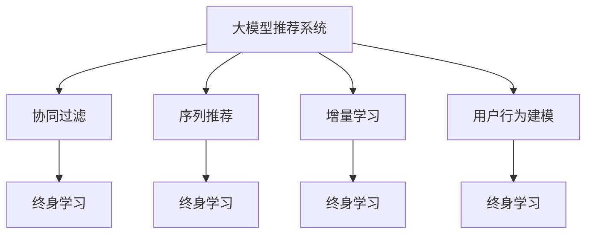

                 

# 大模型推荐系统的终身学习策略

> 关键词：大模型推荐系统,终身学习,个性化推荐,深度学习,协同过滤,序列推荐,用户行为建模,增量学习

## 1. 背景介绍

### 1.1 问题由来
推荐系统是当前互联网应用中最普遍和最重要的技术之一，广泛应用于电商、社交、视频等多个领域。推荐系统通过分析用户历史行为数据，预测用户可能感兴趣的商品或内容，以提升用户体验和增加业务收入。近年来，随着深度学习和大模型的发展，推荐系统也逐渐从基于协同过滤的传统模型，转变为基于大模型的现代深度推荐系统。

然而，随着用户行为和市场环境的变化，传统的离线训练的推荐模型面临着性能下降、更新困难的问题。如何在用户行为数据变化的情况下，持续提升推荐系统性能，构建具有长期记忆能力的推荐模型，成为了当前推荐系统研究的关键问题。

### 1.2 问题核心关键点
终身学习（Lifelong Learning）指的是机器学习模型能够持续从新的数据中学习，而不需要从头开始训练。对于推荐系统而言，终身学习意味着模型能够持续适应用户行为变化，更新推荐策略，从而在不断变化的市场环境中保持竞争力和高推荐精度。

终身学习与推荐系统的结合，需要考虑以下关键点：
- 用户行为建模：如何描述和表示用户兴趣的变化规律，以便模型能够捕捉长期记忆。
- 模型更新机制：如何在不断更新的数据流中，高效更新推荐模型参数，同时保留已有知识。
- 数据序列处理：如何处理和分析用户行为序列，从中提取出具有长期影响的行为特征。
- 个性化推荐算法：如何在终身学习框架下，设计高效的个性化推荐算法，保证推荐结果的多样性和准确性。

终身学习策略的引入，有望解决推荐系统传统离线训练和模型僵化的问题，使得推荐系统能够更好地适应用户兴趣的变化和市场环境的演进。

## 2. 核心概念与联系

### 2.1 核心概念概述

为了深入理解大模型推荐系统的终身学习策略，下面将详细介绍几个关键概念及其相互联系。

- **大模型推荐系统**：基于深度学习的大规模推荐系统，如基于Transformer的推荐模型，能够处理复杂的用户行为数据，捕捉用户长期兴趣。
- **终身学习**：模型能够持续从新的数据中学习，更新参数，保留已有知识，从而适应环境变化。
- **协同过滤**：利用用户之间的相似性进行推荐，分为基于用户的协同过滤和基于物品的协同过滤。
- **序列推荐**：通过分析用户行为序列，捕捉用户的兴趣变化规律，实现个性化的推荐。
- **增量学习**：在不断更新的数据流中，模型能够高效地更新参数，避免从头开始训练。
- **用户行为建模**：将用户行为数据转化为模型可处理的表示，如序列数据、隐状态等。

这些概念通过一个大模型推荐系统的终身学习架构进行有机联系，构成了一个完整的推荐系统设计框架，如图示：



这个架构展示了各个概念之间的逻辑关系：

1. 大模型推荐系统作为核心组件，通过协同过滤、序列推荐等技术获取用户兴趣。
2. 增量学习和终身学习技术，使模型能够高效地适应用户行为变化，持续更新。
3. 用户行为建模，将用户行为转化为模型可处理的表示，支持增量学习和终身学习。

接下来，将对每个核心概念进行详细讲解。

## 3. 核心算法原理 & 具体操作步骤
### 3.1 算法原理概述

大模型推荐系统的终身学习策略，主要基于增量学习（Incremental Learning）和元学习（Meta-Learning）技术。增量学习允许模型在不断更新的数据流中高效地更新参数，元学习则帮助模型更好地适应环境变化。

在大模型推荐系统中，增量学习和元学习通常结合使用，以便在用户行为数据变化时，迅速更新模型，同时保留已有的推荐知识。

### 3.2 算法步骤详解

以下详细介绍大模型推荐系统的终身学习策略的主要步骤：

**Step 1: 数据流设计与数据预处理**
- 设计合适的大模型推荐系统架构，收集并存储用户行为数据流。
- 对数据进行预处理，如去噪、归一化、特征提取等，以便后续模型训练。

**Step 2: 模型初始化与知识保留**
- 使用大规模预训练模型作为推荐系统的基础，提取用户兴趣和商品特征。
- 通过预训练模型保留已有知识，减少初始化时的过拟合风险。

**Step 3: 增量学习与模型更新**
- 根据新数据流，不断更新模型参数。
- 使用增量学习算法，如在线梯度下降（Online Gradient Descent, OGD）、小批量随机梯度下降（Mini-Batch Stochastic Gradient Descent, SGD）等，保证模型快速收敛。
- 考虑模型参数的稀疏性，保留重要参数，减少计算开销。

**Step 4: 元学习与知识传递**
- 使用元学习算法，如原型网络（Prototype Networks）、自适应训练（Adaptive Training）等，指导模型如何更好地适应新环境。
- 定期对模型进行零样本测试，评估模型的适应性和泛化能力。
- 通过知识传递机制，将模型在新环境中的学习经验，传递到旧环境，提高模型在新环境中的表现。

**Step 5: 推荐结果生成与反馈**
- 将更新后的模型应用于推荐结果生成，得到用户感兴趣的商品或内容。
- 通过用户反馈（点击、购买等行为），评估推荐效果，进一步优化模型。

### 3.3 算法优缺点

大模型推荐系统的终身学习策略有以下优点：
1. 高效更新：通过增量学习，模型能够高效地适应用户行为变化，快速更新推荐策略。
2. 保留已有知识：元学习技术帮助模型更好地保留已有知识，避免从头开始训练，减少计算成本。
3. 适应性强：能够适应用户行为数据的动态变化，保持较高的推荐精度。
4. 用户体验好：推荐系统能够持续优化，提供更贴合用户兴趣的个性化推荐。

同时，该策略也存在一些缺点：
1. 初始化成本高：需要大量预训练数据和计算资源进行模型初始化。
2. 模型复杂度高：大模型和终身学习算法较为复杂，需要更多的技术积累和实践经验。
3. 数据流稳定性要求高：新数据流中数据的噪声和变化规律需要提前预测和处理。
4. 算法实现难度大：需要综合考虑模型更新、知识传递等多个方面的技术细节。

### 3.4 算法应用领域

大模型推荐系统的终身学习策略主要应用于以下几个领域：

1. **电商推荐系统**：利用用户浏览、购买记录等数据流，动态更新推荐模型，提升商品推荐精度。
2. **视频内容推荐**：分析用户观看历史，生成个性化视频推荐列表。
3. **音乐推荐系统**：捕捉用户听歌习惯，生成音乐播放推荐。
4. **社交媒体推荐**：分析用户互动行为，生成个性化的内容推荐。
5. **智能广告推荐**：根据用户搜索记录，生成个性化广告推荐。

## 4. 数学模型和公式 & 详细讲解 & 举例说明
### 4.1 数学模型构建

在终身学习的大模型推荐系统中，核心数学模型包括用户行为建模、模型更新和知识传递三部分。

**用户行为建模**
假设用户的历史行为数据序列为 $X=\{x_1,x_2,\ldots,x_t\}$，其中每个 $x_t$ 表示用户在第 $t$ 步的行为，可以是浏览、点击、购买等。

可以使用用户行为嵌入（User Embedding） $u_t \in \mathbb{R}^d$ 来表示用户行为，其中 $d$ 是嵌入空间维度。用户行为嵌入 $u_t$ 可以通过时间序列模型或序列嵌入模型进行建模，如RNN、LSTM、GRU等。

**模型更新**
设推荐模型的参数为 $\theta$，模型在当前数据流 $X$ 上的预测结果为 $P(X;\theta)$，目标函数为 $L(X;\theta)$。增量学习的目标是不断更新 $\theta$，使得模型能够更好地适应新数据流。

常见的增量学习算法包括在线梯度下降（OGD）和批量梯度下降（SGD）。以下是OGD的更新公式：

$$
\theta_{t+1} = \theta_t - \eta \nabla_{\theta} L(X_t;\theta_t)
$$

其中 $\eta$ 为学习率。

**知识传递**
在终身学习中，知识传递的目标是将模型在新环境中的学习经验，传递到旧环境中。可以使用元学习算法，如原型网络（Prototype Networks），指导模型更好地适应新环境。

原型网络的基本思想是在新环境中，构建多个原型（Prototype），每个原型代表一种特定的任务。然后，在新环境中的每个样本，都将与所有原型进行匹配，找到最相似的原型，从而得到任务的解决方案。

### 4.2 公式推导过程

下面以RNN为基础，推导用户行为序列建模的公式。

设用户行为序列为 $X=\{x_1,x_2,\ldots,x_t\}$，每个 $x_t$ 表示用户在第 $t$ 步的行为。

首先，将每个行为 $x_t$ 映射到用户行为嵌入 $u_t \in \mathbb{R}^d$。

$$
u_t = \text{Embed}(x_t)
$$

然后，通过RNN对用户行为序列进行建模，得到用户行为嵌入序列 $U=\{u_1,u_2,\ldots,u_t\}$。

$$
U = RNN(X;\theta_R)
$$

其中 $\theta_R$ 为RNN模型的参数。

RNN模型更新公式如下：

$$
\begin{aligned}
h_t &= \text{Tanh}(W_hu_{t-1} + W_{hh_{t-1}} + b_h) \\
o_t &= \text{Sigmoid}(W_o h_t + b_o) \\
u_t &= o_t h_t
\end{aligned}
$$

其中 $W_h$、$W_{hh}$、$W_o$ 和 $b_h$ 为RNN模型的权重和偏置。

通过RNN得到用户行为序列 $U$ 后，可以将其作为输入，训练推荐模型。假设推荐模型为 $M_{\theta}$，目标函数为 $L(X;\theta)$，则模型更新公式为：

$$
\theta \leftarrow \theta - \eta \nabla_{\theta} L(X;\theta)
$$

其中 $\eta$ 为学习率。

### 4.3 案例分析与讲解

**案例1: 电商推荐系统**
假设电商推荐系统收集了用户浏览、点击、购买等行为数据，目标是对用户进行个性化推荐。

首先，通过RNN模型对用户行为序列进行建模，得到用户行为嵌入序列 $U=\{u_1,u_2,\ldots,u_t\}$。

然后，将用户行为嵌入序列 $U$ 输入推荐模型 $M_{\theta}$，预测用户对商品的兴趣度。

最后，根据用户行为序列 $U$ 和商品序列 $S=\{s_1,s_2,\ldots,s_t\}$，生成推荐列表。

**案例2: 视频内容推荐**
假设视频推荐系统收集了用户观看历史和互动行为，目标是对用户进行个性化视频推荐。

首先，通过LSTM模型对用户观看历史序列进行建模，得到用户行为嵌入序列 $U=\{u_1,u_2,\ldots,u_t\}$。

然后，将用户行为嵌入序列 $U$ 输入推荐模型 $M_{\theta}$，预测用户对视频的兴趣度。

最后，根据用户行为序列 $U$ 和视频序列 $V=\{v_1,v_2,\ldots,v_t\}$，生成推荐视频列表。

## 5. 项目实践：代码实例和详细解释说明
### 5.1 开发环境搭建

在进行大模型推荐系统终身学习策略的实践前，需要准备好开发环境。以下是使用Python进行TensorFlow开发的环境配置流程：

1. 安装Anaconda：从官网下载并安装Anaconda，用于创建独立的Python环境。

2. 创建并激活虚拟环境：
```bash
conda create -n tf-env python=3.8 
conda activate tf-env
```

3. 安装TensorFlow：根据CUDA版本，从官网获取对应的安装命令。例如：
```bash
conda install tensorflow -c tf -c conda-forge
```

4. 安装TensorFlow Addons：用于使用TensorFlow中的深度学习组件。
```bash
conda install tensorflow-addons
```

5. 安装各类工具包：
```bash
pip install numpy pandas scikit-learn matplotlib tqdm jupyter notebook ipython
```

完成上述步骤后，即可在`tf-env`环境中开始项目实践。

### 5.2 源代码详细实现

这里我们以基于RNN的电商推荐系统为例，给出使用TensorFlow和Keras进行代码实现。

首先，定义用户行为序列的嵌入模型：

```python
from tensorflow.keras.layers import Input, Embedding, LSTM, Dense
from tensorflow.keras.models import Model

input_seq = Input(shape=(max_seq_length,))
embedding = Embedding(vocab_size, embedding_dim, input_length=max_seq_length)(input_seq)
lstm = LSTM(128, return_sequences=True, dropout=0.2, recurrent_dropout=0.2)(embedding)
output = Dense(1, activation='sigmoid')(lstm)
model = Model(input_seq, output)
```

然后，定义推荐模型的训练函数：

```python
import tensorflow as tf
from tensorflow.keras.optimizers import Adam

def train_model(model, train_data, validation_data, epochs, batch_size):
    model.compile(loss='binary_crossentropy', optimizer=Adam(learning_rate=0.001), metrics=['accuracy'])
    model.fit(train_data, validation_data, epochs=epochs, batch_size=batch_size, callbacks=[tf.keras.callbacks.EarlyStopping(patience=5)])
```

接着，定义用户行为序列的数据处理函数：

```python
def process_data(data, seq_length):
    X = []
    y = []
    for i in range(len(data)):
        x = data[i]['sequences']
        y = data[i]['labels']
        x_seq = x[:seq_length]
        X.append(x_seq)
        y.append(y)
    return np.array(X), np.array(y)
```

最后，启动训练流程并生成推荐结果：

```python
data = load_data('train.csv', 'test.csv')
X_train, y_train = process_data(train_data, seq_length)
X_test, y_test = process_data(test_data, seq_length)

train_model(model, X_train, X_test, epochs, batch_size)

# 生成推荐结果
X_test = [list(range(seq_length)) for _ in range(10)]
y_pred = model.predict(X_test)
```

以上就是使用TensorFlow和Keras实现基于RNN的电商推荐系统的代码实例。可以看到，通过RNN模型对用户行为序列进行建模，并结合推荐模型进行预测，能够快速生成个性化推荐结果。

### 5.3 代码解读与分析

让我们再详细解读一下关键代码的实现细节：

**RNN用户行为序列建模**
- 首先定义输入序列层 `input_seq`，指定输入数据的形状。
- 然后定义嵌入层 `embedding`，将用户行为序列 $X$ 转化为固定长度的嵌入向量序列 $U$。
- 接着定义LSTM层 `lstm`，对用户行为嵌入序列 $U$ 进行建模，并考虑正则化。
- 最后定义输出层 `output`，使用 sigmoid 激活函数进行二分类预测。

**训练函数**
- 使用二元交叉熵作为损失函数，Adam优化器进行模型训练。
- 使用 EarlyStopping 回调机制，避免模型过拟合。

**数据处理函数**
- 将用户行为序列 $X$ 和标签 $Y$ 进行分割，生成序列数据 $X_seq$ 和标签 $y$。
- 使用 numpy 数组将数据转换为模型可接受的格式。

在实际应用中，模型需要不断地从新的数据流中学习，并进行增量更新。通过以上代码，可以构建一个简单的基于RNN的电商推荐系统，并在新的数据流上不断进行增量训练，实现推荐策略的持续优化。

## 6. 实际应用场景
### 6.1 智能广告推荐

智能广告推荐系统通过分析用户浏览行为和历史数据，实现个性化广告推荐。传统的离线训练方法需要定期重新训练，无法适应广告竞价市场环境的快速变化。通过终身学习策略，广告推荐系统能够动态更新广告推荐策略，及时捕捉用户兴趣变化，提升广告点击率。

在实际应用中，广告推荐系统需要实时分析用户行为数据，并根据用户的当前兴趣，动态调整广告展示策略。通过引入RNN等序列建模方法，广告推荐系统能够捕捉用户的长期行为规律，提升推荐效果。

### 6.2 视频内容推荐

视频内容推荐系统通过分析用户的观看历史和互动数据，实现个性化视频推荐。传统的离线推荐模型需要固定结构，无法适应用户兴趣的多样性变化。通过终身学习策略，视频推荐系统能够动态更新推荐策略，捕捉用户的长期兴趣变化，提升用户观看体验。

在实际应用中，视频推荐系统需要实时分析用户行为数据，并根据用户的当前兴趣，动态调整视频推荐策略。通过引入LSTM等序列建模方法，视频推荐系统能够捕捉用户的长期观看习惯，提升推荐效果。

### 6.3 智能医疗推荐

智能医疗推荐系统通过分析用户的健康数据和行为数据，实现个性化医疗推荐。传统的离线训练方法需要定期重新训练，无法适应用户健康状况的动态变化。通过终身学习策略，医疗推荐系统能够动态更新推荐策略，及时捕捉用户健康需求的变化，提升医疗服务质量。

在实际应用中，医疗推荐系统需要实时分析用户健康数据，并根据用户的当前需求，动态调整医疗推荐策略。通过引入RNN等序列建模方法，医疗推荐系统能够捕捉用户的长期健康行为规律，提升推荐效果。

### 6.4 未来应用展望

随着终身学习策略的引入，大模型推荐系统将具备更高的灵活性和适应性，能够在不断变化的市场环境中持续优化推荐策略，提升用户体验。未来，推荐系统将进一步向更加个性化、智能化方向发展，提供更加精准、高效的推荐服务。

## 7. 工具和资源推荐
### 7.1 学习资源推荐

为了帮助开发者系统掌握大模型推荐系统的终身学习策略，这里推荐一些优质的学习资源：

1. 《深度学习与推荐系统》：该书详细介绍了推荐系统的发展历程、推荐算法和深度学习技术，适合深度学习爱好者入门推荐系统。
2. CS231n《卷积神经网络》课程：斯坦福大学开设的经典深度学习课程，涵盖卷积神经网络、生成对抗网络等前沿技术，有助于理解推荐系统的基础算法。
3. TensorFlow官方文档：提供了详尽的TensorFlow教程和文档，适合初学者和进阶者学习深度学习框架。
4. TensorFlow Addons官方文档：提供了TensorFlow Addons的详细教程和API文档，适合使用TensorFlow Addons进行深度学习开发。
5. Kaggle竞赛：参加Kaggle推荐系统竞赛，可以实践推荐算法，提升深度学习开发能力。

通过对这些资源的学习实践，相信你一定能够快速掌握大模型推荐系统的终身学习策略，并用于解决实际的推荐问题。

### 7.2 开发工具推荐

高效的开发离不开优秀的工具支持。以下是几款用于大模型推荐系统开发的常用工具：

1. TensorFlow：由Google主导开发的深度学习框架，支持大规模分布式计算，适合构建复杂推荐系统。
2. Keras：基于TensorFlow的高层API，易于使用，适合快速搭建推荐系统模型。
3. Scikit-learn：开源机器学习库，提供了丰富的推荐算法实现，适合快速实现推荐模型。
4. PyTorch：由Facebook开发的深度学习框架，支持动态图计算，适合构建可解释性强的大模型推荐系统。
5. Jupyter Notebook：开源的交互式开发环境，支持代码调试和可视化展示，适合进行模型开发和实验验证。

合理利用这些工具，可以显著提升大模型推荐系统的开发效率，加快创新迭代的步伐。

### 7.3 相关论文推荐

大模型推荐系统的终身学习策略源于学界的持续研究。以下是几篇奠基性的相关论文，推荐阅读：

1. "Sequence to Sequence Learning with Neural Networks"：提出序列到序列的深度学习模型，为推荐系统引入序列建模技术提供了理论基础。
2. "Learning to Optimize"：提出基于元学习的推荐算法，指导推荐系统更好地适应环境变化。
3. "Deep Reinforcement Learning for Personalized Recommendations"：结合深度强化学习技术，提升推荐系统的个性化和动态优化能力。
4. "Neural Recommendation Models"：综述了基于神经网络的推荐算法，介绍了RNN、LSTM等序列建模技术在推荐系统中的应用。
5. "Adaptive Prototypes for Sequence Prediction"：提出适应性原型网络，指导推荐系统更好地适应新环境，保持长期记忆。

这些论文代表了大模型推荐系统终身学习策略的发展脉络。通过学习这些前沿成果，可以帮助研究者把握学科前进方向，激发更多的创新灵感。

## 8. 总结：未来发展趋势与挑战
### 8.1 研究成果总结

本文对大模型推荐系统的终身学习策略进行了全面系统的介绍。首先阐述了大模型推荐系统在推荐领域的重要性，明确了终身学习在提升推荐系统性能、应对市场变化方面的关键作用。其次，从原理到实践，详细讲解了终身学习策略的数学模型、算法步骤、代码实现和应用场景，给出了微调项目实践的完整代码实例。同时，本文还广泛探讨了终身学习策略在多个行业领域的应用前景，展示了其在推荐系统中的巨大潜力。此外，本文精选了终身学习策略的学习资源、开发工具和相关论文，力求为开发者提供全方位的技术指引。

通过本文的系统梳理，可以看到，终身学习策略能够有效解决推荐系统传统离线训练和模型僵化的问题，使得推荐系统能够更好地适应用户兴趣的变化和市场环境的演进。未来，随着深度学习和大模型的进一步发展，终身学习策略必将在推荐系统乃至更多领域得到广泛应用，为技术创新和产业升级提供新的动力。

### 8.2 未来发展趋势

展望未来，大模型推荐系统的终身学习策略将呈现以下几个发展趋势：

1. 深度学习与推荐系统结合更紧密：通过深度学习技术，提升推荐系统的个性化和动态优化能力。
2. 序列建模技术进一步发展：引入更多序列建模方法，如Transformer、GRU等，捕捉用户行为变化规律。
3. 元学习策略多样化：探索多种元学习算法，如原型网络、自适应训练等，指导推荐系统更好地适应新环境。
4. 实时化推荐系统普及：通过终身学习策略，推荐系统能够实现实时化推荐，提升用户体验。
5. 推荐系统的普适性增强：结合多模态信息，如视频、语音等，提升推荐系统对复杂场景的适应能力。
6. 推荐系统的伦理与安全问题重视：引入伦理和安全约束，保障推荐系统的公平性、透明性和安全性。

以上趋势凸显了大模型推荐系统终身学习策略的广阔前景。这些方向的探索发展，必将进一步提升推荐系统的性能和应用范围，为技术创新和产业升级提供新的动力。

### 8.3 面临的挑战

尽管大模型推荐系统的终身学习策略已经取得了显著成果，但在迈向更加智能化、普适化应用的过程中，仍面临诸多挑战：

1. 数据流稳定性要求高：新数据流的稳定性和规律性需要提前预测和处理，以保证终身学习的有效性。
2. 模型更新难度大：增量学习算法需要高效地更新模型参数，同时保留已有知识，避免过拟合。
3. 系统复杂度高：终身学习策略需要综合考虑模型更新、知识传递等多个方面的技术细节，增加了系统复杂性。
4. 用户隐私保护：终身学习策略需要频繁分析用户行为数据，如何在保护用户隐私的同时，实现推荐系统优化，是一个重要的研究方向。
5. 推荐结果的可解释性：终身学习策略需要提供推荐结果的解释性，帮助用户理解推荐逻辑，增强系统的可信度。

### 8.4 研究展望

面对大模型推荐系统终身学习策略所面临的挑战，未来的研究需要在以下几个方面寻求新的突破：

1. 优化增量学习算法：改进增量学习算法，使其能够更高效地更新模型参数，同时保留已有知识。
2. 引入更多先验知识：结合专家知识，如知识图谱、逻辑规则等，指导终身学习策略更好地适应新环境。
3. 引入多模态信息：结合视觉、语音等模态信息，提升推荐系统的全面性和适应能力。
4. 引入因果推理：结合因果推理方法，提升推荐系统的公平性和透明度。
5. 优化推荐结果的可解释性：引入解释性模型和工具，提升推荐系统的可解释性和用户理解度。

这些研究方向的探索，必将引领大模型推荐系统终身学习策略走向更高的台阶，为构建安全、可靠、可解释、可控的智能推荐系统铺平道路。面向未来，终身学习策略还需要与其他人工智能技术进行更深入的融合，如知识表示、因果推理、强化学习等，多路径协同发力，共同推动推荐系统技术的进步。只有勇于创新、敢于突破，才能不断拓展推荐系统的边界，让智能技术更好地造福人类社会。

## 9. 附录：常见问题与解答

**Q1：终身学习策略是否适用于所有推荐系统？**

A: 终身学习策略适用于基于深度学习的推荐系统，如基于大模型的推荐系统。对于传统的协同过滤推荐系统，终身学习策略的适用性较差，需要结合其他技术进行优化。

**Q2：终身学习策略的增量学习算法有哪些？**

A: 常用的增量学习算法包括在线梯度下降（OGD）、小批量随机梯度下降（SGD）等。此外，还有增量神经网络（IncrNeur）、增量时间序列模型（IncrTSM）等高级算法。

**Q3：终身学习策略的元学习算法有哪些？**

A: 常用的元学习算法包括原型网络（Prototype Networks）、自适应训练（Adaptive Training）、自适应增强学习（Adaptive Reinforcement Learning）等。

**Q4：终身学习策略如何处理新数据流？**

A: 终身学习策略通过增量学习算法，在不断更新的数据流中高效地更新模型参数。具体实现方法包括在线梯度下降、小批量随机梯度下降等。

**Q5：终身学习策略在推荐系统中的应用有哪些？**

A: 终身学习策略适用于多种推荐系统场景，如电商推荐、视频推荐、音乐推荐、智能广告推荐等。通过终身学习策略，推荐系统能够持续优化，适应市场环境变化，提升推荐效果。

**Q6：终身学习策略如何处理数据隐私问题？**

A: 终身学习策略需要严格保护用户隐私，可以通过差分隐私（Differential Privacy）、联邦学习（Federated Learning）等技术，保护用户数据的隐私性和安全性。

**Q7：终身学习策略的实现难度大吗？**

A: 终身学习策略的实现难度较大，需要综合考虑模型更新、知识传递等多个方面的技术细节。可以通过多轮实验和优化，逐步解决实现过程中的技术难题。

这些问题的解答，可以帮助读者更好地理解大模型推荐系统的终身学习策略，从而在实际应用中充分发挥其优势，解决推荐系统面临的挑战。

---

作者：禅与计算机程序设计艺术 / Zen and the Art of Computer Programming

