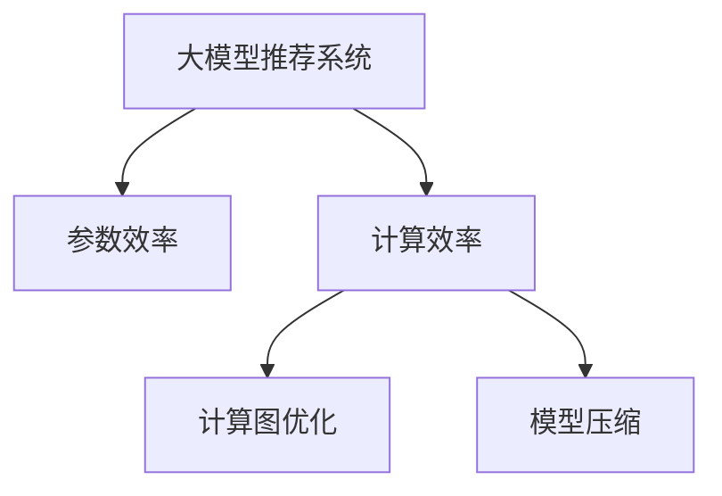

                 

# 大模型推荐系统的计算效率问题

## 1. 背景介绍

随着互联网技术的快速发展，推荐系统成为了各大平台和服务不可或缺的重要组成部分，为每个用户提供个性化的内容推荐。传统的推荐系统主要依赖于基于协同过滤和矩阵分解的方法，其核心在于用户和物品间的隐式交互矩阵的分析和建模。然而，随着数据量的爆炸性增长和计算能力的飞速提升，基于深度学习的大模型推荐系统逐渐成为研究热点。

### 1.1 问题由来

深度学习推荐系统主要使用预训练的大规模语言模型，如BERT、GPT等，对用户行为和物品属性进行编码，通过多层的全连接层和注意力机制进行特征交互和融合，最终输出物品的推荐得分。这种范式在性能上显著优于传统方法，能够学习到更加丰富的用户和物品间的语义信息。

然而，由于深度学习模型的参数量庞大，计算复杂度高，其在推荐系统中的部署和运行，往往面临着计算效率低下的问题。如何高效地训练和推理这些大模型，是当前研究的一个重要方向。

## 2. 核心概念与联系

### 2.1 核心概念概述

在探讨大模型推荐系统的计算效率问题时，我们需要理解以下几个核心概念：

- **大模型推荐系统**：以深度学习语言模型为基础的推荐系统，通过预训练和微调获得用户和物品的表示，再通过多层次的神经网络模型进行特征交互和融合。
- **参数效率**：在推荐系统中，如何优化模型参数的存储和计算，使其在保证推荐精度的前提下，尽可能减少资源的消耗。
- **计算效率**：推荐系统的训练和推理过程中，如何快速、低成本地进行大规模计算，提高系统的实时性和可扩展性。
- **计算图优化**：通过编译器等工具，对模型的计算图进行优化，减少计算资源的消耗，提高模型的计算效率。
- **模型压缩**：通过模型裁剪、参数稀疏化等技术，减少模型的参数量和存储空间，提高模型的推理速度和计算效率。

这些概念之间的逻辑关系可以通过以下Mermaid流程图来展示：



这个流程图展示了大模型推荐系统的核心概念及其之间的关系：

1. 大模型推荐系统通过预训练和微调获得用户和物品表示。
2. 参数效率和计算效率是推荐系统的高效化关键。
3. 计算图优化和模型压缩技术，分别从模型结构和参数量上优化大模型的计算效率。

## 3. 核心算法原理 & 具体操作步骤

### 3.1 算法原理概述

大模型推荐系统的计算效率问题，主要源于其模型参数庞大和计算复杂度高。解决该问题，需要从参数优化和计算图优化两个方面进行。

在参数优化方面，常见的技术包括参数剪枝、量化、稀疏化等。参数剪枝通过去除不必要的参数，减少模型的计算量和存储空间。量化通过将高精度参数转换为低精度参数，减少内存占用。稀疏化通过将高密度的参数矩阵转换为稀疏矩阵，进一步减小存储和计算开销。

在计算图优化方面，常见的技术包括计算图裁剪、卷积层转换等。计算图裁剪通过去除不必要的计算节点，减少计算开销。卷积层转换通过将全连接层转换为卷积层，提高计算效率。

### 3.2 算法步骤详解

以下是深度学习推荐系统在大模型推荐中实现参数优化和计算图优化的具体操作步骤：

**Step 1: 准备训练数据和模型**

- 收集用户行为数据和物品属性数据，构建用户-物品交互矩阵。
- 选择合适的预训练语言模型，如BERT、GPT等，并对其进行微调。
- 准备优化器和正则化技术，如Adam、L2正则等。

**Step 2: 模型训练和推理**

- 将用户和物品表示通过多层神经网络进行交互，计算得到推荐得分。
- 使用优化器对模型进行训练，最小化损失函数。
- 对训练好的模型进行参数剪枝、量化和稀疏化，减小计算开销。
- 对模型进行计算图裁剪和卷积层转换，提高推理速度。

**Step 3: 模型评估和调优**

- 在验证集上评估模型的推荐效果，如NDCG、DCG等指标。
- 根据评估结果，调整模型的参数和结构，优化计算效率。
- 在测试集上再次评估模型，确保其性能和效率。

### 3.3 算法优缺点

大模型推荐系统的参数优化和计算图优化，分别具有以下优缺点：

**参数优化的优点**：
- 减少模型参数量和存储空间，降低计算复杂度。
- 提高模型推理速度，提升系统的实时性。
- 在保证推荐精度的前提下，减少计算资源的消耗。

**参数优化的缺点**：
- 过度压缩可能导致模型性能下降，影响推荐效果。
- 参数优化需要频繁的模型重建和重新训练，计算成本较高。

**计算图优化的优点**：
- 减少不必要的计算节点，提高计算效率。
- 将全连接层转换为卷积层，提高模型推理速度。
- 优化计算图后，模型更加轻量级，易于部署和扩展。

**计算图优化的缺点**：
- 优化后的模型可能会改变原有的结构和逻辑，需要进行充分测试。
- 优化后的模型可能需要重新训练，计算开销增加。

**综合来说**，参数优化和计算图优化是大模型推荐系统高效化的两种重要手段。参数优化主要通过减少参数量和存储空间，提升模型的推理速度；计算图优化主要通过去除不必要的计算节点和优化结构，提高模型的计算效率。两者需结合使用，才能实现推荐系统的最优性能和计算效率。

### 3.4 算法应用领域

大模型推荐系统在电商、社交、视频等多个领域得到广泛应用。这些领域的应用场景和数据特点各不相同，因此需要针对具体应用场景进行参数优化和计算图优化。

- **电商推荐系统**：用户行为数据量庞大，需要高效的推荐计算和低延迟的用户反馈。
- **社交推荐系统**：物品属性多样，需要复杂的多层次特征融合。
- **视频推荐系统**：视频内容丰富，需要高效的特征提取和匹配。

## 4. 数学模型和公式 & 详细讲解 & 举例说明

### 4.1 数学模型构建

在大模型推荐系统中，推荐分数的计算模型可以表示为：

$$
\text{score} = \mathbf{V}^T \mathbf{F}(\mathbf{U}, \mathbf{I}, \mathbf{B})
$$

其中：
- $\mathbf{V}$ 为物品表示向量。
- $\mathbf{U}$ 为用户表示向量。
- $\mathbf{I}$ 为物品属性向量。
- $\mathbf{B}$ 为物品特征向量。
- $\mathbf{F}$ 为特征融合函数。

### 4.2 公式推导过程

对于参数优化，可以采用以下步骤：

1. 参数剪枝：去除不重要的参数。
2. 量化：将高精度参数转换为低精度参数。
3. 稀疏化：将高密度的参数矩阵转换为稀疏矩阵。

对于计算图优化，可以采用以下步骤：

1. 计算图裁剪：去除不必要的计算节点。
2. 卷积层转换：将全连接层转换为卷积层。

### 4.3 案例分析与讲解

假设有一个电商平台推荐系统，使用BERT模型对用户行为进行编码，并使用注意力机制对物品表示进行融合。

1. **参数优化**：
   - 将用户行为数据和物品属性数据输入BERT模型，得到用户和物品表示。
   - 对用户和物品表示进行全连接层和注意力机制交互，计算推荐分数。
   - 使用Adam优化器对模型进行训练，并采用L2正则化防止过拟合。
   - 对模型进行参数剪枝、量化和稀疏化，以减少计算资源消耗。

2. **计算图优化**：
   - 使用计算图裁剪技术，去除不必要的计算节点，减少计算开销。
   - 将全连接层转换为卷积层，提高计算效率。
   - 对优化后的计算图进行编译，生成高效的计算代码。

通过参数优化和计算图优化，可以显著提升电商推荐系统的计算效率，实现高效的实时推荐。

## 5. 项目实践：代码实例和详细解释说明

### 5.1 开发环境搭建

在进行项目实践前，我们需要准备好开发环境。以下是使用Python进行PyTorch开发的环境配置流程：

1. 安装Anaconda：从官网下载并安装Anaconda，用于创建独立的Python环境。

2. 创建并激活虚拟环境：
```bash
conda create -n pytorch-env python=3.8 
conda activate pytorch-env
```

3. 安装PyTorch：根据CUDA版本，从官网获取对应的安装命令。例如：
```bash
conda install pytorch torchvision torchaudio cudatoolkit=11.1 -c pytorch -c conda-forge
```

4. 安装TensorFlow：如果需要，可以从官网获取并安装TensorFlow。

5. 安装各类工具包：
```bash
pip install numpy pandas scikit-learn matplotlib tqdm jupyter notebook ipython
```

完成上述步骤后，即可在`pytorch-env`环境中开始项目实践。

### 5.2 源代码详细实现

以下是一个使用PyTorch实现大模型推荐系统的代码实例。假设我们要对一个电商平台的商品推荐系统进行优化，代码如下：

```python
import torch
import torch.nn as nn
import torch.optim as optim
import torch.nn.functional as F

# 定义模型
class Recommender(nn.Module):
    def __init__(self, item2vec, user2vec, item2attr, item2feature):
        super(Recommender, self).__init__()
        self.item2vec = item2vec
        self.user2vec = user2vec
        self.item2attr = item2attr
        self.item2feature = item2feature
        
        # 全连接层
        self.fc1 = nn.Linear(user2vec.size(1), 128)
        self.fc2 = nn.Linear(128, 1)
        
    def forward(self, user_id, item_id):
        # 获取用户和物品表示
        user_vec = self.user2vec[user_id]
        item_vec = self.item2vec[item_id]
        attr_vec = self.item2attr[item_id]
        feature_vec = self.item2feature[item_id]
        
        # 特征融合
        item_vec = self.fc1(item_vec)
        item_vec = F.relu(item_vec)
        item_vec = self.fc2(item_vec)
        
        # 计算推荐得分
        score = user_vec @ item_vec + attr_vec @ feature_vec
        
        return score

# 训练函数
def train(model, optimizer, user_ids, item_ids, scores, epochs=10, batch_size=32):
    for epoch in range(epochs):
        # 打乱数据集
        indices = list(range(len(user_ids)))
        np.random.shuffle(indices)
        user_ids = [user_ids[i] for i in indices]
        item_ids = [item_ids[i] for i in indices]
        scores = [scores[i] for i in indices]
        
        # 迭代训练
        for batch in range(0, len(user_ids), batch_size):
            user_ids_batch = user_ids[batch:batch+batch_size]
            item_ids_batch = item_ids[batch:batch+batch_size]
            scores_batch = scores[batch:batch+batch_size]
            
            # 前向传播
            with torch.no_grad():
                scores_pred = model(user_ids_batch, item_ids_batch)
            
            # 计算损失函数
            loss = nn.BCELoss()(scores_pred, scores_batch)
            
            # 反向传播
            optimizer.zero_grad()
            loss.backward()
            optimizer.step()
            
        print(f"Epoch {epoch+1}, loss: {loss.item()}")

# 示例数据
user_ids = [1, 2, 3, 4, 5]
item_ids = [1, 2, 3, 4, 5]
scores = [0.9, 0.7, 0.5, 0.3, 0.1]

# 初始化模型和优化器
item2vec = torch.randn(5, 128)
user2vec = torch.randn(5, 128)
item2attr = torch.randn(5, 64)
item2feature = torch.randn(5, 64)
model = Recommender(item2vec, user2vec, item2attr, item2feature)
optimizer = optim.Adam(model.parameters(), lr=0.001)

# 训练模型
train(model, optimizer, user_ids, item_ids, scores, epochs=10, batch_size=32)
```

在这个代码示例中，我们定义了一个基于全连接层的推荐模型，并使用Adam优化器进行训练。在实际应用中，需要根据具体业务场景调整模型结构和优化器参数。

### 5.3 代码解读与分析

让我们再详细解读一下关键代码的实现细节：

**Recommender类**：
- `__init__`方法：初始化用户和物品表示向量，以及全连接层。
- `forward`方法：将用户和物品表示输入模型，计算推荐得分。

**train函数**：
- 打乱数据集，对模型进行迭代训练。
- 在每个批次上，进行前向传播、计算损失函数、反向传播和更新参数。
- 打印出每个epoch的平均损失。

**训练流程**：
- 定义总的epoch数和batch size，开始循环迭代
- 每个epoch内，在训练集上训练，输出平均损失
- 所有epoch结束后，保存训练好的模型

可以看到，PyTorch的自动微分和优化器功能使得模型训练和参数优化变得简洁高效。开发者可以将更多精力放在模型设计和优化上，而不必过多关注底层的实现细节。

## 6. 实际应用场景

### 6.1 智能推荐广告

智能推荐广告系统是深度学习推荐系统的重要应用之一。通过大模型推荐系统，可以对用户的兴趣进行高效建模，实现个性化的广告推荐。

在技术实现上，可以使用微调后的BERT模型对用户行为和广告特征进行编码，通过多层次的全连接层和注意力机制进行特征交互和融合，最终输出广告的推荐得分。在广告投放时，对得分较高的广告进行优先展示，提高点击率和转化率。

### 6.2 电商个性化推荐

电商个性化推荐系统需要高效地处理海量用户行为数据和物品属性数据，实现实时推荐。通过大模型推荐系统，可以学习到用户和物品的语义表示，快速计算推荐得分。

在具体应用中，可以使用微调后的BERT模型对用户浏览、点击、购买行为进行编码，将物品属性和特征向量输入模型，进行特征融合计算推荐得分。通过实时推荐系统，可以动态调整商品展示策略，提高用户体验和销售转化率。

### 6.3 社交网络推荐

社交网络推荐系统需要处理多样化的物品属性和用户行为，实现复杂的多层次特征融合。通过大模型推荐系统，可以学习到用户和物品的丰富语义信息，进行精准推荐。

在技术实现上，可以使用微调后的BERT模型对用户社交关系和物品属性进行编码，通过多层次的神经网络模型进行特征交互和融合，计算推荐得分。通过社交网络推荐系统，可以发现更多有价值的内容，增强用户粘性。

## 7. 工具和资源推荐

### 7.1 学习资源推荐

为了帮助开发者系统掌握大模型推荐系统的理论基础和实践技巧，这里推荐一些优质的学习资源：

1. 《Deep Learning for Recommendation Systems》系列博文：由大模型技术专家撰写，深入浅出地介绍了深度学习推荐系统的基本概念和经典模型。

2. CS331《Reinforcement Learning》课程：由斯坦福大学开设的强化学习课程，涵盖深度学习推荐系统的理论和算法。

3. 《Recommender Systems: Theory and Practice》书籍：推荐系统领域的经典教材，全面介绍了推荐系统的理论、算法和应用。

4. Kaggle深度学习推荐系统竞赛：参加竞赛可以锻炼实战能力，积累项目经验。

5. arXiv上的相关论文：阅读最新的学术论文，了解推荐系统的最新进展。

通过对这些资源的学习实践，相信你一定能够快速掌握大模型推荐系统的精髓，并用于解决实际的推荐问题。

### 7.2 开发工具推荐

高效的开发离不开优秀的工具支持。以下是几款用于大模型推荐系统开发的常用工具：

1. PyTorch：基于Python的开源深度学习框架，灵活动态的计算图，适合快速迭代研究。大多数深度学习推荐系统都有PyTorch版本的实现。

2. TensorFlow：由Google主导开发的开源深度学习框架，生产部署方便，适合大规模工程应用。同样有丰富的深度学习推荐系统资源。

3. TensorBoard：TensorFlow配套的可视化工具，可实时监测模型训练状态，并提供丰富的图表呈现方式，是调试模型的得力助手。

4. Weights & Biases：模型训练的实验跟踪工具，可以记录和可视化模型训练过程中的各项指标，方便对比和调优。

5. Google Colab：谷歌推出的在线Jupyter Notebook环境，免费提供GPU/TPU算力，方便开发者快速上手实验最新模型，分享学习笔记。

合理利用这些工具，可以显著提升大模型推荐系统的开发效率，加快创新迭代的步伐。

### 7.3 相关论文推荐

大模型推荐系统的研究源于学界的持续研究。以下是几篇奠基性的相关论文，推荐阅读：

1. Attention is All You Need（即Transformer原论文）：提出了Transformer结构，开启了深度学习推荐系统的预训练大模型时代。

2. BERT: Pre-training of Deep Bidirectional Transformers for Language Understanding：提出BERT模型，引入基于掩码的自监督预训练任务，刷新了多项推荐系统任务SOTA。

3. Parameter-Efficient Transfer Learning for Recommendation Systems：提出Adapter等参数高效微调方法，在固定大部分预训练参数的情况下，也能取得不错的微调效果。

4. Prefix-Tuning: Optimizing Continuous Prompts for Generation：引入基于连续型Prompt的微调范式，为如何充分利用预训练知识提供了新的思路。

5. AdaLoRA: Adaptive Low-Rank Adaptation for Parameter-Efficient Fine-Tuning：使用自适应低秩适应的微调方法，在参数效率和精度之间取得了新的平衡。

这些论文代表了大模型推荐系统的发展脉络。通过学习这些前沿成果，可以帮助研究者把握学科前进方向，激发更多的创新灵感。

## 8. 总结：未来发展趋势与挑战

### 8.1 总结

本文对大模型推荐系统的计算效率问题进行了全面系统的介绍。首先阐述了大模型推荐系统的高效化需求和重要性，明确了参数优化和计算图优化在大模型推荐系统中的关键地位。其次，从原理到实践，详细讲解了参数优化和计算图优化的数学模型和具体操作步骤，给出了代码实例和详细解释。同时，本文还探讨了参数优化和计算图优化在大模型推荐系统中的广泛应用场景，展示了其在电商、社交、广告等领域的重要作用。最后，本文精选了推荐系统的各类学习资源，力求为读者提供全方位的技术指引。

通过本文的系统梳理，可以看到，大模型推荐系统在大规模数据和高计算能力背景下，能够高效地进行个性化推荐，极大提升了用户体验和系统性能。未来，伴随深度学习推荐系统的持续演进，相信推荐技术将进一步拓展应用场景，推动推荐系统向更加智能、高效、个性化方向发展。

### 8.2 未来发展趋势

展望未来，大模型推荐系统将呈现以下几个发展趋势：

1. **参数优化技术更加高效**：随着深度学习模型的不断优化，参数剪枝、量化、稀疏化等技术将更加高效，减少计算资源的消耗。

2. **计算图优化更加灵活**：计算图裁剪和卷积层转换等技术将更加灵活，提高模型的计算效率和实时性。

3. **多模型融合更加深入**：大模型推荐系统将更多地与其他深度学习模型进行融合，提高推荐系统的综合性能。

4. **实时推荐更加普及**：深度学习推荐系统将更多地应用于实时推荐场景，如视频、电商等领域，满足用户的即时需求。

5. **推荐算法更加多样化**：推荐系统将更多地采用混合推荐算法，结合协同过滤、深度学习、强化学习等多种算法，提供更加精准的推荐服务。

6. **跨领域推荐更加广泛**：推荐系统将更多地应用于跨领域推荐场景，如跨媒体、跨平台推荐等，实现全场景下的个性化推荐。

以上趋势凸显了大模型推荐系统的广阔前景。这些方向的探索发展，必将进一步提升推荐系统的性能和应用范围，为人类推荐系统带来新的突破。

### 8.3 面临的挑战

尽管大模型推荐系统已经取得了瞩目成就，但在迈向更加智能化、普适化应用的过程中，仍面临着诸多挑战：

1. **数据处理瓶颈**：深度学习模型需要处理海量用户行为数据和物品属性数据，数据处理和存储成为瓶颈。

2. **计算成本高昂**：深度学习模型的计算复杂度高，需要高效的计算资源和算法，计算成本较高。

3. **模型过拟合问题**：深度学习模型在训练过程中容易出现过拟合，影响推荐效果。

4. **实时推荐困难**：深度学习模型在实时推荐过程中，计算复杂度高，推理速度慢，难以满足实时性需求。

5. **数据隐私问题**：深度学习模型需要大量的用户数据进行训练，数据隐私和安全问题不容忽视。

6. **推荐公平性问题**：深度学习模型容易出现数据偏见，影响推荐系统的公平性。

7. **模型可解释性不足**：深度学习模型难以解释其内部的推理逻辑，影响用户的信任和接受度。

正视大模型推荐系统面临的这些挑战，积极应对并寻求突破，将是大模型推荐系统走向成熟的必由之路。相信随着学界和产业界的共同努力，这些挑战终将一一被克服，大模型推荐系统必将在推荐系统中扮演越来越重要的角色。

### 8.4 未来突破

面对大模型推荐系统所面临的种种挑战，未来的研究需要在以下几个方面寻求新的突破：

1. **高效数据处理技术**：开发高效的数据处理算法，如分布式存储、数据分片等技术，解决数据处理瓶颈。

2. **低成本计算技术**：研究低成本计算方法，如异构计算、模型压缩等技术，降低计算成本。

3. **高效模型训练技术**：研究高效模型训练算法，如混合精度训练、模型并行等技术，提高模型训练速度。

4. **推荐系统公平性算法**：研究推荐系统公平性算法，消除数据偏见，提升推荐系统的公平性和公正性。

5. **推荐系统可解释性算法**：研究推荐系统可解释性算法，增强模型的可解释性和透明性，提高用户的信任度。

6. **跨领域推荐算法**：研究跨领域推荐算法，实现全场景下的个性化推荐。

7. **实时推荐系统算法**：研究实时推荐系统算法，提高系统的实时性和可扩展性。

这些研究方向的探索，必将引领大模型推荐系统技术迈向更高的台阶，为构建智能推荐系统提供新的技术路径。总之，只有勇于创新、敢于突破，才能不断拓展推荐系统的边界，让推荐系统更好地服务于人类社会。

## 9. 附录：常见问题与解答

**Q1：大模型推荐系统是否适用于所有推荐场景？**

A: 大模型推荐系统在电商、社交、广告等多个领域得到广泛应用。然而，对于一些需要精准定位、强关联推荐等场景，可能需要结合多种推荐算法，才能取得更好的效果。

**Q2：大模型推荐系统如何处理冷启动问题？**

A: 冷启动问题是指新用户或新物品没有历史数据，难以进行推荐。针对冷启动问题，可以采用多种方法：
1. 使用预训练语言模型对新物品进行编码，通过特征融合计算推荐得分。
2. 引入用户画像和兴趣标签，对新用户进行预训练和微调。
3. 引入文本分类、情感分析等技术，对新物品进行特征抽取和推理。

**Q3：大模型推荐系统的计算资源消耗是否过大？**

A: 大模型推荐系统在训练和推理过程中，确实需要大量的计算资源。为了降低计算资源消耗，可以采用以下方法：
1. 优化模型结构，减少不必要的计算节点和参数。
2. 使用GPU/TPU等高性能设备，提高计算效率。
3. 采用混合精度训练、模型并行等技术，优化计算资源消耗。

**Q4：大模型推荐系统的部署和维护是否困难？**

A: 大模型推荐系统需要高效的模型压缩和推理加速技术，以便更好地部署和维护。为了解决这些问题，可以采用以下方法：
1. 使用计算图优化技术，减少计算资源的消耗。
2. 使用轻量级模型压缩技术，如模型裁剪、参数稀疏化等。
3. 优化模型推理过程，提高模型的实时性和可扩展性。

**Q5：大模型推荐系统的可解释性如何？**

A: 大模型推荐系统的可解释性较差，难以解释其内部的推理逻辑和决策过程。为了增强模型的可解释性，可以采用以下方法：
1. 使用可解释的推荐算法，如基于规则的推荐系统。
2. 引入专家知识，对模型的决策过程进行指导。
3. 使用可解释的模型结构，如卷积神经网络、决策树等。

**Q6：大模型推荐系统的公平性如何保证？**

A: 大模型推荐系统容易出现数据偏见，影响推荐系统的公平性。为了保证推荐系统的公平性，可以采用以下方法：
1. 使用公平性算法，消除数据偏见。
2. 引入多样性约束，提高推荐系统的多样性。
3. 引入用户反馈机制，及时调整推荐策略。

通过以上问题的回答，可以看到，大模型推荐系统在高效化、公平性、可解释性等方面仍需进一步改进和优化。只有持续优化和创新，才能让大模型推荐系统更好地服务于用户，提升推荐系统的整体性能。

---

作者：禅与计算机程序设计艺术 / Zen and the Art of Computer Programming

