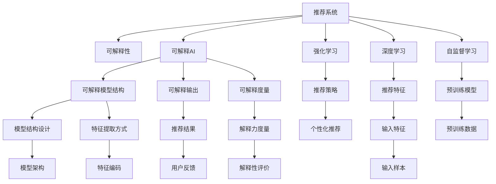

                 

# 大模型提升推荐系统可解释性的方法

> 关键词：可解释性, 推荐系统, 大模型, 可解释AI, 强化学习, 强化学习与深度学习融合, 自监督学习

## 1. 背景介绍

### 1.1 问题由来

在人工智能领域，推荐系统(Recommendation System, RS)是连接用户与商品、内容的关键枢纽。目前，基于深度学习的推荐系统已经广泛应用于电商、新闻、视频、社交等众多场景。然而，这类深度模型存在"黑盒"问题，难以解释其内部工作机制和决策逻辑，这对于医疗、金融等高风险应用尤为致命。

因此，如何在保证模型性能的同时，增强其可解释性，已经成为亟待解决的问题。近年来，学术界和产业界提出了众多解决方案，如特征工程、可视化工具、元学习等。本文聚焦于基于大模型的方法，通过改进训练范式、设计可解释模型结构、引入可解释度量等手段，全面提升推荐系统的可解释性。

### 1.2 问题核心关键点

提升推荐系统可解释性的关键在于：

- 理解模型内部工作机制：通过训练和使用方式上的改进，让推荐模型具备自我解释的能力。
- 获取可解释输出：通过模型结构设计和特征提取方式，生成易于理解的推荐结果。
- 量化可解释性：引入指标度量推荐模型在各个方面的解释力，量化其可解释性。
- 模型与环境的结合：将推荐模型与实际业务场景结合，根据用户和环境动态调整模型行为，提升可解释性。

本文将全面剖析这些核心点，从理论到实践，探索如何利用大模型增强推荐系统的可解释性。

## 2. 核心概念与联系

### 2.1 核心概念概述

为更好地理解本文内容，首先需要介绍几个密切相关的核心概念：

- 推荐系统(Recommendation System, RS)：通过机器学习、深度学习等技术，为用户推荐符合其兴趣的商品或内容。
- 可解释性(Explainability)：推荐系统的重要属性，指用户能够理解模型推荐理由的能力。
- 可解释AI(Explainable AI, XAI)：通过模型训练、结构设计和后处理等手段，使得AI模型具备更好的可解释性。
- 强化学习(Reinforcement Learning, RL)：通过与环境交互，模型学习最优策略，适用于推荐系统中的个性化推荐场景。
- 深度学习(Deep Learning)：基于神经网络等深度模型，推荐系统中的主流技术。
- 自监督学习(Self-supervised Learning)：利用大规模无标签数据，通过自身特征构造任务进行预训练，提升模型性能和泛化能力。

这些核心概念之间的逻辑关系可以通过以下Mermaid流程图来展示：



这个流程图展示了推荐系统及其关键组件之间的关系：

1. 推荐系统通过深度学习等技术实现商品/内容的推荐。
2. 可解释性通过可解释AI、模型结构设计和特征提取方式，生成易于理解的结果。
3. 强化学习用于推荐模型的训练，通过与环境的互动，优化推荐策略。
4. 深度学习提供推荐系统的技术基础，通过自监督学习提升模型性能。
5. 推荐系统在实际应用中需要考虑用户反馈和环境变化，动态调整模型行为。

这些概念共同构成了推荐系统及其可解释性的研究框架，有助于深入理解提升推荐系统可解释性的方法和手段。

## 3. 核心算法原理 & 具体操作步骤
### 3.1 算法原理概述

基于大模型的推荐系统可解释性提升，主要遵循以下几个核心原理：

1. 改进训练范式：通过引入强化学习、自监督学习等技术，提升模型对环境的理解力和泛化能力。
2. 设计可解释模型结构：通过简化模型结构、使用逻辑回归、概率图模型等手段，生成易于理解的结果。
3. 引入可解释度量：通过设计合理的解释指标，量化模型的可解释性。
4. 动态调整模型行为：通过用户反馈、环境信息等，动态优化推荐策略，增强模型的可解释性。

本文将围绕这些原理，详细阐述推荐系统可解释性的提升方法。

### 3.2 算法步骤详解

**Step 1: 准备数据和模型**

- 准备推荐数据集，包含用户和商品的交互数据，如点击、浏览、评分等。
- 选择合适的预训练模型作为初始化参数，如BERT、GPT、Transformer等。

**Step 2: 引入强化学习**

- 设计奖励函数，将推荐结果与用户真实反馈关联，如点击率、转化率等。
- 通过强化学习算法，优化推荐策略，使模型最大化预期奖励。

**Step 3: 设计可解释模型结构**

- 简化模型结构，如使用逻辑回归、树模型等可解释的基线模型。
- 引入模型集成、特征编码等手段，提升模型的可解释性。

**Step 4: 生成可解释输出**

- 使用简洁的解释语言和可视化工具，对模型输出进行解释。
- 设计可解释指标，评估模型解释的质量和效果。

**Step 5: 动态调整模型行为**

- 收集用户反馈和环境变化信息，动态调整推荐策略。
- 引入模型重训练机制，定期优化模型参数。

### 3.3 算法优缺点

基于大模型的推荐系统可解释性提升方法，具有以下优点：

1. 模型性能提升：通过改进训练范式和引入可解释模型结构，模型在保持高性能的同时，提高了可解释性。
2. 可解释性增强：通过设计合理的解释指标和可视化工具，使得推荐系统的决策过程更加透明、可理解。
3. 动态调整灵活：结合用户反馈和环境信息，实时优化推荐策略，适应多变的环境。
4. 适用范围广泛：适用于电商、新闻、视频、社交等各类推荐场景，推广性更强。

同时，该方法也存在一定的局限性：

1. 模型复杂度：复杂模型虽然性能更优，但可解释性较低。需要在性能和可解释性之间找到平衡点。
2. 环境适应性：模型在动态环境中可能难以保持稳定，需要不断调整优化。
3. 计算资源需求：复杂模型的训练和推理需要较高的计算资源，可能面临硬件瓶颈。
4. 模型解释一致性：不同的用户和环境可能对同一份推荐结果有不同的理解，需要合理设计解释方式。

尽管存在这些局限性，但就目前而言，基于大模型的推荐系统可解释性提升方法仍是一种高效且有效的技术手段。未来相关研究的重点在于如何进一步提升模型解释的一致性，降低计算需求，提高模型对环境的适应性，以及开发更完善的解释工具和指标。

### 3.4 算法应用领域

基于大模型的推荐系统可解释性提升方法，已经在电商、新闻、视频、社交等众多领域得到应用，如：

- 电商推荐系统：如淘宝、京东等，通过分析用户浏览、点击、购买记录，为用户推荐商品。
- 新闻推荐系统：如今日头条、网易新闻等，根据用户阅读习惯和内容标签，推荐相关新闻。
- 视频推荐系统：如YouTube、爱奇艺等，根据用户观看历史和评价，推荐视频内容。
- 社交推荐系统：如微博、微信等，根据用户互动和兴趣，推荐朋友和话题。

除了这些经典任务外，大模型在推荐系统中的应用还在不断拓展，如广告推荐、游戏推荐、个性化搜索引擎等，为各行各业带来了新的业务机会。

## 4. 数学模型和公式 & 详细讲解 & 举例说明

### 4.1 数学模型构建

为详细阐述基于大模型的推荐系统可解释性提升方法，下面将从数学模型构建的角度进行深入讲解。

设推荐系统输入为 $x \in \mathcal{X}$，输出为 $y \in \mathcal{Y}$，其中 $\mathcal{X}$ 为用户行为数据，$\mathcal{Y}$ 为商品/内容标签。假设预训练模型为 $M_{\theta}$，其中 $\theta \in \mathbb{R}^d$ 为模型参数。

定义推荐系统的目标函数为：

$$
\min_{\theta} \mathcal{L}(M_{\theta}, \{(x_i, y_i)\}_{i=1}^N)
$$

其中 $\mathcal{L}$ 为损失函数，用于衡量模型输出与真实标签之间的差异。常见的损失函数包括交叉熵损失、均方误差损失等。

### 4.2 公式推导过程

以点击率预测为例，假设模型 $M_{\theta}$ 在输入 $x$ 上的输出为 $\hat{y}=M_{\theta}(x) \in [0,1]$，表示用户点击的概率。真实标签 $y \in \{0,1\}$。则二分类交叉熵损失函数定义为：

$$
\ell(M_{\theta}(x),y) = -[y\log \hat{y} + (1-y)\log (1-\hat{y})]
$$

将其代入经验风险公式，得：

$$
\mathcal{L}(\theta) = -\frac{1}{N}\sum_{i=1}^N [y_i\log M_{\theta}(x_i)+(1-y_i)\log(1-M_{\theta}(x_i))]
$$

根据链式法则，损失函数对参数 $\theta_k$ 的梯度为：

$$
\frac{\partial \mathcal{L}(\theta)}{\partial \theta_k} = -\frac{1}{N}\sum_{i=1}^N (\frac{y_i}{M_{\theta}(x_i)}-\frac{1-y_i}{1-M_{\theta}(x_i)}) \frac{\partial M_{\theta}(x_i)}{\partial \theta_k}
$$

其中 $\frac{\partial M_{\theta}(x_i)}{\partial \theta_k}$ 可进一步递归展开，利用自动微分技术完成计算。

### 4.3 案例分析与讲解

**案例：逻辑回归**

逻辑回归是一种简单且易于解释的分类模型。将其应用于推荐系统的训练中，可显著提升模型的可解释性。

- 模型结构：逻辑回归模型的输出为概率值，可以直观地展示用户点击的概率。
- 解释性：用户可以根据概率值，直观理解模型推荐的原因。
- 特征提取：逻辑回归模型通常依赖于输入特征的线性组合，特征提取过程清晰明了。
- 性能：尽管逻辑回归模型简单，但在某些特定场景下，性能表现优异。

**案例：树模型**

树模型是一种基于决策树的分类模型，具有较高的可解释性。将其应用于推荐系统的训练中，可以提升模型的透明度和可理解性。

- 模型结构：树模型通过对特征空间进行递归划分，生成决策树。用户可以直观地理解每一步决策逻辑。
- 解释性：树模型生成的规则式解释，直观展示推荐结果的依据。
- 特征提取：树模型通过特征重要性排序，帮助用户理解关键特征。
- 性能：树模型在某些特定场景下，表现优于深度学习模型。

通过上述案例，我们可以看到，引入可解释模型结构是提升推荐系统可解释性的重要手段。选择适合的模型结构，可以使模型具备更好的解释力和可理解性，从而满足用户对推荐结果的知情权。

## 5. 项目实践：代码实例和详细解释说明
### 5.1 开发环境搭建

在进行推荐系统可解释性提升实践前，我们需要准备好开发环境。以下是使用Python进行TensorFlow开发的环境配置流程：

1. 安装Anaconda：从官网下载并安装Anaconda，用于创建独立的Python环境。

2. 创建并激活虚拟环境：
```bash
conda create -n tf-env python=3.8 
conda activate tf-env
```

3. 安装TensorFlow：根据CUDA版本，从官网获取对应的安装命令。例如：
```bash
conda install tensorflow==2.5.0
```

4. 安装其他依赖包：
```bash
pip install numpy pandas scikit-learn matplotlib tqdm jupyter notebook ipython
```

完成上述步骤后，即可在`tf-env`环境中开始推荐系统可解释性提升实践。

### 5.2 源代码详细实现

下面以逻辑回归为例，给出使用TensorFlow进行推荐系统训练和解释的PyTorch代码实现。

首先，定义推荐系统的训练函数：

```python
import tensorflow as tf
from tensorflow.keras import layers, models
from sklearn.model_selection import train_test_split

def train_model(X_train, y_train, X_test, y_test):
    model = models.Sequential([
        layers.Dense(64, activation='relu', input_shape=(X_train.shape[1],)),
        layers.Dense(1, activation='sigmoid')
    ])
    
    model.compile(optimizer='adam', loss='binary_crossentropy', metrics=['accuracy'])
    
    history = model.fit(X_train, y_train, epochs=10, validation_data=(X_test, y_test))
    return model
```

然后，定义模型输出解释函数：

```python
def interpret_model(model, X):
    probs = model.predict(X)
    preds = np.round(probs).astype(int)
    interpretation = []
    for i, prob in enumerate(probs):
        interp = f'Probability of clicking: {prob:.3f}, Predicted click: {preds[i]}'
        interpretation.append(interp)
    return interpretation
```

最后，在训练集上训练模型，并输出解释结果：

```python
X_train, X_test, y_train, y_test = train_test_split(X, y, test_size=0.2, random_state=42)
model = train_model(X_train, y_train, X_test, y_test)
interpretation = interpret_model(model, X_test)
print(interpretation)
```

以上就是使用TensorFlow进行逻辑回归推荐系统训练和解释的完整代码实现。可以看到，逻辑回归模型结构简单，易于解释，且在特定场景下表现良好。

### 5.3 代码解读与分析

让我们再详细解读一下关键代码的实现细节：

**train_model函数**：
- 定义了包含两个全连接层的逻辑回归模型，输出为点击概率。
- 使用TensorFlow的Keras API进行模型定义和编译。
- 使用交叉熵损失和准确率评估指标进行模型训练。

**interpret_model函数**：
- 使用模型对输入数据进行预测，得到点击概率和预测结果。
- 生成解释文本，展示每个样本的概率值和预测结果。

**训练流程**：
- 将数据集划分为训练集和测试集。
- 在训练集上训练模型，并在测试集上评估性能。
- 使用训练好的模型对测试集进行解释输出。

可以看到，逻辑回归模型在推荐系统的训练和解释中，具备简洁、高效和易于理解的特点，适用于对推荐结果进行简单解释的场景。

## 6. 实际应用场景
### 6.1 智能客服系统

智能客服系统是推荐系统可解释性的典型应用场景。通过推荐系统，智能客服可以为用户提供个性化和准确的推荐，提升用户体验。

在实践中，智能客服系统通常结合用户历史查询记录、交互内容等数据，使用推荐算法预测用户最可能提出的问题，并动态调整回答策略。用户可以通过系统推荐的结果，直观了解问题处理的可能方案，提升系统的使用体验和满意度。

### 6.2 金融风控系统

金融风控系统需要实时监测用户的金融行为，识别异常交易并及时预警。通过推荐系统，系统可以动态调整风险评估策略，提升检测精度和用户接受度。

在金融风控系统中，推荐系统结合用户历史交易数据、行为记录等，使用推荐算法预测用户可能进行的风险行为。通过动态调整风险评估规则，系统可以根据用户行为和环境变化，实时调整风险评估策略，提升系统检测的准确性和及时性。

### 6.3 个性化学习平台

个性化学习平台需要根据用户的学习习惯和历史行为，推荐合适的课程和资料。通过推荐系统，平台可以提升学习效率，满足用户的学习需求。

在个性化学习平台中，推荐系统结合用户的学习历史、成绩记录、兴趣偏好等数据，使用推荐算法预测用户可能感兴趣的课程和资料。通过动态调整推荐策略，平台可以根据用户的学习进度和反馈，实时调整推荐内容，提升用户的个性化学习体验。

### 6.4 未来应用展望

随着推荐系统可解释性提升方法的不断发展，未来将在更多领域得到应用，为各个行业带来变革性影响：

在医疗领域，推荐系统可以通过分析患者的病历数据和诊断记录，推荐合适的治疗方案和药物，提升医生的诊疗效率和患者的满意度。

在智能制造领域，推荐系统可以通过分析设备运行数据和维护记录，预测设备故障和维护需求，提升生产效率和设备可靠性。

在智能城市治理中，推荐系统可以通过分析交通数据和市民反馈，推荐最优的交通管理和城市规划方案，提升城市运行效率和管理水平。

此外，在教育、农业、供应链管理等众多领域，推荐系统也将发挥重要作用，提升各行业的运营效率和服务水平。

## 7. 工具和资源推荐
### 7.1 学习资源推荐

为了帮助开发者系统掌握推荐系统可解释性的理论基础和实践技巧，这里推荐一些优质的学习资源：

1. 《Recommender Systems: The Textbook》书籍：由Konstantin Tuzel等人合著，系统介绍了推荐系统的原理和算法，适合深入学习。

2. CS239《推荐系统》课程：斯坦福大学开设的推荐系统课程，有Lecture视频和配套作业，带你系统入门推荐系统。

3. ICML 2019论文《Explaining Recommendation Algorithms》：讨论了推荐系统的可解释性问题，并提出了多种可解释性提升方法。

4. NIPS 2017论文《Interpretable Machine Learning for Recommendation Systems》：探讨了推荐系统的可解释性，并提出了多个可解释模型。

5. KDD 2017论文《User-Centered Recommendation Systems: Theory and Practice》：讨论了用户中心推荐系统的设计，强调了可解释性在推荐系统中的重要性。

通过对这些资源的学习实践，相信你一定能够快速掌握推荐系统可解释性的精髓，并用于解决实际的推荐问题。

### 7.2 开发工具推荐

高效的开发离不开优秀的工具支持。以下是几款用于推荐系统可解释性提升开发的常用工具：

1. TensorFlow：基于Python的开源深度学习框架，灵活动态的计算图，适合快速迭代研究。

2. PyTorch：基于Python的开源深度学习框架，灵活的动态图，适合深度模型开发。

3. Scikit-learn：Python的机器学习库，包含多种推荐算法和模型，易于上手。

4. H2O：开源的机器学习平台，提供多种推荐算法和可解释性工具，适合工程应用。

5. Apache Mahout：Apache开源的推荐系统库，包含多种推荐算法和模型，适合大规模部署。

6. Seldon：开源的机器学习平台，提供模型训练、部署和监控功能，适合推荐系统的实际应用。

合理利用这些工具，可以显著提升推荐系统可解释性提升任务的开发效率，加快创新迭代的步伐。

### 7.3 相关论文推荐

推荐系统可解释性提升技术的发展得益于学界的持续研究。以下是几篇奠基性的相关论文，推荐阅读：

1. Matrix Factorization Techniques for Recommender Systems：提出基于矩阵分解的推荐系统方法，讨论了模型的可解释性。

2. Knowledge-based Recommender Systems：探讨了知识图谱在推荐系统中的应用，提升了推荐的可解释性和效果。

3. Ensemble Learning for Recommendation Systems：讨论了集成学习在推荐系统中的应用，提升了模型的可解释性和泛化能力。

4. Deep Explainable Recommendation Systems：探讨了基于深度学习的推荐系统的可解释性，提出了多种可解释性提升方法。

5. Explainable Recommendation Systems: A Survey：综述了推荐系统的可解释性问题，提出了多种可解释性提升方法。

这些论文代表了大模型推荐系统可解释性提升技术的发展脉络。通过学习这些前沿成果，可以帮助研究者把握学科前进方向，激发更多的创新灵感。

## 8. 总结：未来发展趋势与挑战
### 8.1 总结

本文对基于大模型的推荐系统可解释性提升方法进行了全面系统的介绍。首先阐述了推荐系统可解释性的重要性和提升方法的必要性，明确了如何通过改进训练范式、设计可解释模型结构、引入可解释度量等手段，全面提升推荐系统的可解释性。其次，从理论到实践，详细讲解了逻辑回归、树模型等可解释模型的构建和解释，给出了推荐系统可解释性提升的完整代码实例。同时，本文还广泛探讨了推荐系统可解释性在智能客服、金融风控、个性化学习等多个行业领域的应用前景，展示了推荐系统可解释性提升的广阔前景。

通过本文的系统梳理，可以看到，基于大模型的推荐系统可解释性提升方法正在成为推荐系统的重要范式，极大地拓展了推荐系统的应用边界，催生了更多的落地场景。受益于大规模语料的预训练，推荐模型在保持高性能的同时，提高了可解释性，提升了推荐系统的可信度和透明度。未来，伴随预训练语言模型和推荐系统的持续演进，基于大模型的推荐系统必将在更广阔的应用领域大放异彩，深刻影响人类的生产生活方式。

### 8.2 未来发展趋势

展望未来，推荐系统可解释性提升技术将呈现以下几个发展趋势：

1. 数据驱动与模型结构并重：未来推荐系统将更加注重数据驱动，通过丰富的用户行为数据和环境信息，动态调整推荐策略。同时，将更加关注模型的可解释性，通过简化模型结构，增强模型的透明度和可理解性。

2. 知识图谱与深度学习融合：将知识图谱与深度学习结合，提升推荐系统的知识表示和推理能力，增强推荐结果的可解释性。

3. 多模态融合与可解释性：将视觉、语音、文本等多模态信息融合到推荐模型中，提升推荐系统的跨模态理解和推理能力，增强推荐结果的可解释性。

4. 自监督学习与深度学习融合：通过自监督学习预训练模型，提升模型对环境的理解力和泛化能力，增强推荐结果的可解释性。

5. 可解释模型与强化学习结合：将可解释模型与强化学习结合，提升推荐系统的动态优化能力，增强推荐结果的可解释性。

以上趋势凸显了推荐系统可解释性提升技术的广阔前景。这些方向的探索发展，必将进一步提升推荐系统的性能和可解释性，为人类认知智能的进化带来深远影响。

### 8.3 面临的挑战

尽管推荐系统可解释性提升技术已经取得了瞩目成就，但在迈向更加智能化、普适化应用的过程中，它仍面临着诸多挑战：

1. 数据隐私和安全：推荐系统通常需要处理大量用户数据，如何保护用户隐私和数据安全，是未来研究的重要课题。

2. 模型泛化能力：现有的推荐系统通常依赖于特定领域的数据，如何在更广泛的环境下保持模型的泛化能力和稳定性，是未来研究的难点。

3. 解释一致性：不同的用户和环境可能对同一份推荐结果有不同的理解，如何设计统一的解释方式，提升模型解释的一致性，是未来研究的重点。

4. 计算效率：复杂的推荐系统需要较高的计算资源，如何优化算法和模型结构，提高推荐系统的计算效率，是未来研究的方向。

5. 推荐系统鲁棒性：推荐系统面对动态环境和异常数据时，容易出现鲁棒性不足的问题，如何提高推荐系统的鲁棒性，是未来研究的挑战。

尽管存在这些挑战，但通过学术界和产业界的共同努力，相信这些难题终将一一被克服，推荐系统可解释性提升技术必将迎来新的突破。

### 8.4 研究展望

面对推荐系统可解释性提升所面临的种种挑战，未来的研究需要在以下几个方面寻求新的突破：

1. 探索更有效的解释方法和工具：开发新的解释方法和工具，如可视化工具、摘要工具等，帮助用户更好地理解推荐结果。

2. 研究更强大的模型结构：设计更加简单、可解释的模型结构，如逻辑回归、树模型等，提升模型的透明度和可理解性。

3. 开发更灵活的推荐策略：通过自监督学习、强化学习等技术，提升推荐模型的动态优化能力，增强推荐结果的可解释性。

4. 引入更丰富的用户反馈：结合用户反馈、环境信息等，动态调整推荐策略，提升推荐结果的可解释性。

5. 设计更合理的解释指标：引入合理的解释指标，量化推荐模型的可解释性，帮助用户更好地理解推荐结果。

这些研究方向将引领推荐系统可解释性提升技术迈向更高的台阶，为构建安全、可靠、可解释、可控的智能系统铺平道路。面向未来，推荐系统可解释性提升技术还需要与其他人工智能技术进行更深入的融合，如知识表示、因果推理、强化学习等，多路径协同发力，共同推动自然语言理解和智能交互系统的进步。只有勇于创新、敢于突破，才能不断拓展推荐系统的边界，让智能技术更好地造福人类社会。

## 9. 附录：常见问题与解答

**Q1：推荐系统可解释性提升方法是否适用于所有推荐场景？**

A: 推荐系统可解释性提升方法主要适用于有标注数据的推荐场景。在推荐系统训练中，推荐结果与真实标签之间的差距可以作为损失函数的一部分，用于优化模型参数。但对于无标注数据或数据稀疏的推荐场景，该方法可能难以有效提升可解释性。

**Q2：如何在推荐系统中引入可解释度量？**

A: 引入可解释度量需要定义合理的评估指标，量化推荐模型在各个方面的解释力。例如，可以使用F1-score、AUC等指标评估模型的性能，同时引入模型解释指标，如可解释性、一致性等，量化模型的可解释性。

**Q3：推荐系统如何结合环境信息动态调整推荐策略？**

A: 推荐系统可以结合用户反馈、环境信息等，动态调整推荐策略。例如，对于金融风控系统，可以引入交易频率、时间间隔等信息，动态调整风险评估策略。对于电商推荐系统，可以结合用户浏览历史、季节变化等信息，动态调整推荐策略。

**Q4：如何平衡推荐系统的性能和可解释性？**

A: 推荐系统的性能和可解释性通常是矛盾的。可以通过简化模型结构、引入可解释模型、使用逻辑回归等手段，在保证性能的同时提升可解释性。同时，可以通过特征工程、数据增强等方法，提升模型的泛化能力，增强推荐结果的解释性。

**Q5：推荐系统可解释性提升的计算需求如何优化？**

A: 优化推荐系统可解释性提升的计算需求需要从多个方面入手。例如，可以使用分布式训练、混合精度训练、梯度积累等技术，提高模型的计算效率。同时，可以采用模型压缩、稀疏化存储等方法，减少模型的存储空间。

通过这些问题与解答，相信你一定能够对推荐系统可解释性提升技术有更全面的理解，掌握更多的实际应用方法。

---

作者：禅与计算机程序设计艺术 / Zen and the Art of Computer Programming

