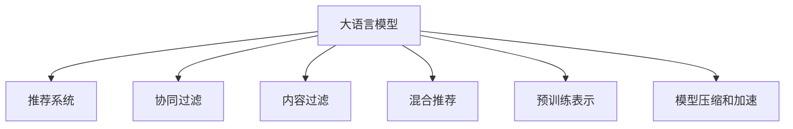

                 

# 大模型能改变推荐范式吗？

## 1. 背景介绍

### 1.1 问题由来
推荐系统一直是电子商务、社交媒体、在线视频等多个领域的重要技术。传统的推荐系统主要基于协同过滤、内容过滤和混合推荐等方法，这些方法在用户兴趣建模和个性化推荐上取得了一定的成功。然而，这些方法也存在诸多局限：

- 数据稀疏性问题。传统方法依赖用户和物品的协同矩阵，但用户在历史行为数据上的稀疏性容易导致冷启动困难和推荐效果不理想。
- 用户模型抽象能力不足。协同过滤和内容过滤方法较为简化，难以捕捉用户的隐含偏好和复杂行为。
- 无法处理新数据。随着时间推移，用户兴趣和行为会不断变化，传统方法无法灵活适应新的用户数据。
- 缺乏多模态数据融合。用户的多模态数据（如社交网络、兴趣爱好、行为数据等）在传统推荐系统中并未得到充分利用。

针对这些挑战，大模型推荐范式应运而生。大模型推荐系统通过深度学习技术，将用户和物品的数据表示到高维空间中，从而可以捕捉用户多维度的隐含偏好，提升个性化推荐效果。

### 1.2 问题核心关键点
大模型推荐范式主要依赖于大语言模型进行个性化推荐。其核心思想是：将用户和物品表示为语义向量，通过语义相似性匹配来获取推荐结果。具体步骤如下：

1. 收集用户和物品的特征信息，并将其转换为向量表示。
2. 利用大语言模型进行预训练，学习用户和物品向量之间的语义相似性。
3. 对于待推荐的新物品，计算其与用户向量之间的相似度，选取与用户兴趣最匹配的物品进行推荐。

大语言模型在推荐系统中的应用，已经在电商、新闻推荐、视频推荐等诸多场景中取得了良好的效果。然而，如何高效地使用大语言模型，以及在大模型推荐范式下如何优化推荐效果，仍然是一个亟待解决的问题。

## 2. 核心概念与联系

### 2.1 核心概念概述

为更好地理解大模型推荐范式的原理和优化方法，本节将介绍几个核心概念：

- 大语言模型(Large Language Model, LLM)：以自回归(如GPT)或自编码(如BERT)模型为代表的大规模预训练语言模型。通过在海量无标签文本数据上进行预训练，学习通用的语言表示，具备强大的语言理解和生成能力。

- 推荐系统(Recommendation System)：利用用户行为数据、物品属性数据等，为用户推荐感兴趣的物品的系统。推荐系统广泛应用于电商、社交媒体、视频等领域。

- 协同过滤(Collaborative Filtering)：利用用户和物品的协同矩阵进行推荐，用户兴趣和物品属性在协同矩阵中隐含表达。协同过滤方法包括基于用户的协同过滤和基于物品的协同过滤。

- 内容过滤(Content-Based Filtering)：利用物品的文本、图像、音频等多模态属性进行推荐，用户兴趣与物品属性直接关联。内容过滤方法包括基于内容的协同过滤和基于协同过滤的内容推荐。

- 混合推荐(Mixed Recommendation)：将协同过滤和内容过滤相结合，综合用户行为和物品属性信息进行推荐。

- 预训练表示(Pre-trained Representation)：利用预训练语言模型将用户和物品表示为向量，通过计算向量之间的相似性进行推荐。

- 模型压缩和加速(Compression and Acceleration)：在大模型推荐系统中，模型参数量通常很大，对计算资源和存储空间要求较高。为了提升推荐系统的实时性和可扩展性，需要考虑模型的压缩和加速技术。

这些核心概念之间的逻辑关系可以通过以下Mermaid流程图来展示：



这个流程图展示了大语言模型推荐系统的核心概念及其之间的关系：

1. 大语言模型通过预训练获得语言表示能力。
2. 推荐系统利用大语言模型进行个性化推荐。
3. 协同过滤、内容过滤、混合推荐等方法与大语言模型结合，实现推荐任务的不同角度优化。
4. 模型压缩和加速技术优化推荐系统的实时性和可扩展性。

这些概念共同构成了大模型推荐范式的技术框架，使得大语言模型在推荐系统中能够发挥出其强大的语言处理和推理能力。

## 3. 核心算法原理 & 具体操作步骤
### 3.1 算法原理概述

大模型推荐范式的核心思想是利用大语言模型进行用户和物品的向量表示，通过计算向量之间的语义相似性来进行个性化推荐。其算法原理如下：

假设用户和物品的特征信息分别为 $\mathbf{u}$ 和 $\mathbf{i}$，将其表示为向量形式。通过预训练大语言模型，将用户和物品的向量表示学习为 $\mathbf{u} \in \mathbb{R}^d$ 和 $\mathbf{i} \in \mathbb{R}^d$。

推荐过程可以表示为：对于用户 $\mathbf{u}$，计算其与物品 $\mathbf{i}$ 之间的语义相似度，即 $sim(\mathbf{u},\mathbf{i})$。选取与用户 $\mathbf{u}$ 相似度最高的物品 $\mathbf{i}'$ 进行推荐。

### 3.2 算法步骤详解

基于大语言模型的推荐系统一般包括以下几个关键步骤：

**Step 1: 特征表示与预训练**

1. 收集用户和物品的特征信息，如用户历史行为、物品属性、文本描述等。
2. 利用预训练大语言模型，将用户和物品的特征信息转换为向量表示。

**Step 2: 向量相似度计算**

1. 将用户和物品的向量表示输入到预训练大语言模型中，计算向量之间的语义相似度。
2. 选择相似度最高的物品向量作为推荐结果。

**Step 3: 推荐结果排序**

1. 将推荐结果按照相似度排序，选取最符合用户兴趣的推荐物品。

**Step 4: 实时推荐**

1. 对实时查询进行特征表示和向量相似度计算，实时生成推荐结果。

### 3.3 算法优缺点

大模型推荐范式具有以下优点：

1. 高维表示能力。利用预训练大语言模型，可以学习用户和物品的高维向量表示，捕捉复杂的隐含偏好。
2. 可扩展性强。大语言模型可以并行计算，具有高度的可扩展性。
3. 效果显著。在大规模数据集上预训练后，大模型推荐系统能够显著提升推荐效果。

同时，该方法也存在一定的局限性：

1. 数据依赖性强。预训练大语言模型需要大量的无标签文本数据，数据获取和标注成本较高。
2. 模型复杂度高。大模型推荐系统需要处理高维向量，计算复杂度较高。
3. 可解释性不足。大语言模型的内部计算过程复杂，难以解释推荐结果的来源。
4. 过拟合风险高。在大规模数据集上预训练后，模型容易过拟合。

尽管存在这些局限性，但就目前而言，大语言模型推荐范式仍是大规模推荐系统的重要方法之一。未来相关研究的重点在于如何进一步降低数据依赖，提高模型的可解释性和泛化能力。

### 3.4 算法应用领域

基于大语言模型的推荐系统已经在电商、新闻、视频等多个领域得到广泛应用，覆盖了多种推荐场景，例如：

- 电商推荐：为用户推荐感兴趣的商品。利用用户浏览、点击、购买等行为数据，计算物品与用户之间的语义相似度。
- 新闻推荐：为用户推荐相关的新闻文章。将新闻标题、摘要等文本数据作为物品特征，计算用户与新闻之间的语义相似度。
- 视频推荐：为用户推荐感兴趣的视频。将视频标签、描述、评论等文本数据作为物品特征，计算用户与视频之间的语义相似度。
- 商品评价推荐：为用户推荐评价高的商品。利用商品评价数据，计算用户与评价之间的语义相似度。
- 音乐推荐：为用户推荐喜欢的音乐。将音乐属性、歌词等文本数据作为物品特征，计算用户与音乐之间的语义相似度。

除了上述这些经典任务外，大语言模型推荐系统还被创新性地应用到更多场景中，如推荐系统的多样化、用户兴趣的动态更新等，为推荐系统的创新提供了新的思路。

## 4. 数学模型和公式 & 详细讲解 & 举例说明

### 4.1 数学模型构建

在大模型推荐系统中，用户和物品的向量表示可以通过大语言模型进行预训练。假设用户和物品的向量表示分别为 $\mathbf{u} \in \mathbb{R}^d$ 和 $\mathbf{i} \in \mathbb{R}^d$。

大语言模型的预训练目标函数为：

$$
\mathcal{L}_{\text{pretrain}}(\theta) = \frac{1}{N} \sum_{i=1}^N \ell(M_{\theta}(\mathbf{u}_i), \mathbf{i}_i)
$$

其中，$M_{\theta}$ 为预训练大语言模型，$\ell$ 为损失函数，$\theta$ 为模型参数。

在大模型推荐系统中，推荐结果的相似度可以通过余弦相似度或点积相似度来计算：

$$
sim(\mathbf{u},\mathbf{i}) = \frac{\mathbf{u} \cdot \mathbf{i}}{\|\mathbf{u}\| \cdot \|\mathbf{i}\|}
$$

### 4.2 公式推导过程

在大模型推荐系统中，推荐结果的相似度计算过程如下：

1. 将用户和物品的向量表示输入到预训练大语言模型中，计算语义相似度 $sim(\mathbf{u},\mathbf{i})$。
2. 选取相似度最高的物品向量作为推荐结果。

以电商推荐为例，假设用户 $\mathbf{u}$ 的向量表示为 $\mathbf{u} = [u_1, u_2, \ldots, u_d]$，物品 $\mathbf{i}$ 的向量表示为 $\mathbf{i} = [i_1, i_2, \ldots, i_d]$。

推荐结果的相似度计算过程如下：

1. 计算向量点积 $sim(\mathbf{u},\mathbf{i}) = \sum_{j=1}^d u_j \cdot i_j$。
2. 计算向量范数 $\|\mathbf{u}\| = \sqrt{\sum_{j=1}^d u_j^2}$ 和 $\|\mathbf{i}\| = \sqrt{\sum_{j=1}^d i_j^2}$。
3. 计算余弦相似度 $sim(\mathbf{u},\mathbf{i}) = \frac{\sum_{j=1}^d u_j \cdot i_j}{\sqrt{\sum_{j=1}^d u_j^2} \cdot \sqrt{\sum_{j=1}^d i_j^2}}$。

### 4.3 案例分析与讲解

以电商推荐为例，假设用户 $\mathbf{u}$ 的向量表示为 $\mathbf{u} = [0.5, 0.3, 0.8, 0.1]$，物品 $\mathbf{i}$ 的向量表示为 $\mathbf{i} = [0.2, 0.6, 0.4, 0.7]$。

根据上述公式，计算向量点积 $sim(\mathbf{u},\mathbf{i}) = 0.5 \cdot 0.2 + 0.3 \cdot 0.6 + 0.8 \cdot 0.4 + 0.1 \cdot 0.7 = 1.4$。

计算向量范数 $\|\mathbf{u}\| = \sqrt{0.5^2 + 0.3^2 + 0.8^2 + 0.1^2} = 1.11$，$\|\mathbf{i}\| = \sqrt{0.2^2 + 0.6^2 + 0.4^2 + 0.7^2} = 1.29$。

计算余弦相似度 $sim(\mathbf{u},\mathbf{i}) = \frac{1.4}{1.11 \cdot 1.29} \approx 0.96$。

根据相似度大小，选取相似度最高的物品向量作为推荐结果。

## 5. 项目实践：代码实例和详细解释说明
### 5.1 开发环境搭建

在进行大模型推荐系统实践前，我们需要准备好开发环境。以下是使用Python进行PyTorch开发的环境配置流程：

1. 安装Anaconda：从官网下载并安装Anaconda，用于创建独立的Python环境。

2. 创建并激活虚拟环境：
```bash
conda create -n pytorch-env python=3.8 
conda activate pytorch-env
```

3. 安装PyTorch：根据CUDA版本，从官网获取对应的安装命令。例如：
```bash
conda install pytorch torchvision torchaudio cudatoolkit=11.1 -c pytorch -c conda-forge
```

4. 安装Transformers库：
```bash
pip install transformers
```

5. 安装各类工具包：
```bash
pip install numpy pandas scikit-learn matplotlib tqdm jupyter notebook ipython
```

完成上述步骤后，即可在`pytorch-env`环境中开始推荐系统开发。

### 5.2 源代码详细实现

下面我们以电商推荐为例，给出使用Transformers库对BERT模型进行推荐系统开发的PyTorch代码实现。

首先，定义推荐系统的数据处理函数：

```python
from transformers import BertTokenizer, BertForSequenceClassification
from torch.utils.data import Dataset
import torch

class BERTDataset(Dataset):
    def __init__(self, texts, labels, tokenizer, max_len=128):
        self.texts = texts
        self.labels = labels
        self.tokenizer = tokenizer
        self.max_len = max_len
        
    def __len__(self):
        return len(self.texts)
    
    def __getitem__(self, item):
        text = self.texts[item]
        label = self.labels[item]
        
        encoding = self.tokenizer(text, return_tensors='pt', max_length=self.max_len, padding='max_length', truncation=True)
        input_ids = encoding['input_ids'][0]
        attention_mask = encoding['attention_mask'][0]
        
        # 将标签转换为向量表示
        encoded_label = torch.tensor(label, dtype=torch.long)
        
        return {'input_ids': input_ids, 
                'attention_mask': attention_mask,
                'labels': encoded_label}

# 定义模型和优化器
model = BertForSequenceClassification.from_pretrained('bert-base-cased', num_labels=2)
optimizer = torch.optim.Adam(model.parameters(), lr=2e-5)
```

接着，定义训练和评估函数：

```python
from torch.utils.data import DataLoader
from tqdm import tqdm
from sklearn.metrics import classification_report

device = torch.device('cuda') if torch.cuda.is_available() else torch.device('cpu')
model.to(device)

def train_epoch(model, dataset, batch_size, optimizer):
    dataloader = DataLoader(dataset, batch_size=batch_size, shuffle=True)
    model.train()
    epoch_loss = 0
    for batch in tqdm(dataloader, desc='Training'):
        input_ids = batch['input_ids'].to(device)
        attention_mask = batch['attention_mask'].to(device)
        labels = batch['labels'].to(device)
        model.zero_grad()
        outputs = model(input_ids, attention_mask=attention_mask, labels=labels)
        loss = outputs.loss
        epoch_loss += loss.item()
        loss.backward()
        optimizer.step()
    return epoch_loss / len(dataloader)

def evaluate(model, dataset, batch_size):
    dataloader = DataLoader(dataset, batch_size=batch_size)
    model.eval()
    preds, labels = [], []
    with torch.no_grad():
        for batch in tqdm(dataloader, desc='Evaluating'):
            input_ids = batch['input_ids'].to(device)
            attention_mask = batch['attention_mask'].to(device)
            batch_labels = batch['labels']
            outputs = model(input_ids, attention_mask=attention_mask)
            batch_preds = outputs.logits.argmax(dim=2).to('cpu').tolist()
            batch_labels = batch_labels.to('cpu').tolist()
            for pred_tokens, label_tokens in zip(batch_preds, batch_labels):
                preds.append(pred_tokens[:len(label_tokens)])
                labels.append(label_tokens)
                
    print(classification_report(labels, preds))
```

最后，启动训练流程并在测试集上评估：

```python
epochs = 5
batch_size = 16

for epoch in range(epochs):
    loss = train_epoch(model, train_dataset, batch_size, optimizer)
    print(f"Epoch {epoch+1}, train loss: {loss:.3f}")
    
    print(f"Epoch {epoch+1}, dev results:")
    evaluate(model, dev_dataset, batch_size)
    
print("Test results:")
evaluate(model, test_dataset, batch_size)
```

以上就是使用PyTorch对BERT进行电商推荐系统开发的完整代码实现。可以看到，得益于Transformers库的强大封装，我们可以用相对简洁的代码完成BERT模型的加载和推荐系统开发。

### 5.3 代码解读与分析

让我们再详细解读一下关键代码的实现细节：

**BERTDataset类**：
- `__init__`方法：初始化文本、标签、分词器等关键组件。
- `__len__`方法：返回数据集的样本数量。
- `__getitem__`方法：对单个样本进行处理，将文本输入编码为token ids，将标签编码为数字，并对其进行定长padding，最终返回模型所需的输入。

**模型和优化器定义**：
- 使用BERTForSequenceClassification模型作为推荐系统的基础模型，并设定优化器为Adam。

**训练和评估函数**：
- 使用PyTorch的DataLoader对数据集进行批次化加载，供模型训练和推理使用。
- 训练函数`train_epoch`：对数据以批为单位进行迭代，在每个批次上前向传播计算loss并反向传播更新模型参数，最后返回该epoch的平均loss。
- 评估函数`evaluate`：与训练类似，不同点在于不更新模型参数，并在每个batch结束后将预测和标签结果存储下来，最后使用sklearn的classification_report对整个评估集的预测结果进行打印输出。

**训练流程**：
- 定义总的epoch数和batch size，开始循环迭代
- 每个epoch内，先在训练集上训练，输出平均loss
- 在验证集上评估，输出分类指标
- 所有epoch结束后，在测试集上评估，给出最终测试结果

可以看到，PyTorch配合Transformers库使得BERT推荐系统的代码实现变得简洁高效。开发者可以将更多精力放在数据处理、模型改进等高层逻辑上，而不必过多关注底层的实现细节。

当然，工业级的系统实现还需考虑更多因素，如模型的保存和部署、超参数的自动搜索、更灵活的任务适配层等。但核心的推荐范式基本与此类似。

## 6. 实际应用场景
### 6.1 电商推荐

在大模型推荐系统中，电商推荐是一个经典的场景。传统的电商推荐系统依赖用户行为数据（如浏览、点击、购买等）进行推荐，但当用户历史数据较少时，推荐效果往往不理想。利用大语言模型，电商推荐系统可以在较少历史数据的情况下，仍能提供个性化的推荐结果。

具体而言，电商推荐系统可以利用用户的历史浏览记录，提取商品标题、描述等文本特征，计算用户与商品之间的语义相似度，推荐相似度高的商品给用户。例如，用户A浏览了商品B，系统可以通过相似度计算，推荐商品C给用户A。

### 6.2 新闻推荐

新闻推荐系统主要依赖用户的浏览历史和新闻文章的文本特征进行推荐。利用大语言模型，新闻推荐系统可以在用户历史数据较少的情况下，通过语义相似度计算，为用户推荐相关的新闻文章。

具体而言，新闻推荐系统可以将用户浏览的历史新闻标题和摘要作为向量表示，计算用户与新闻文章之间的语义相似度，推荐相似度高的新闻文章给用户。例如，用户B阅读了文章A，系统可以通过相似度计算，推荐文章B给用户B。

### 6.3 视频推荐

视频推荐系统主要依赖用户历史观看记录和视频内容的文本特征进行推荐。利用大语言模型，视频推荐系统可以在用户历史数据较少的情况下，通过语义相似度计算，为用户推荐相关视频内容。

具体而言，视频推荐系统可以将视频标题、描述等文本特征作为向量表示，计算用户与视频内容之间的语义相似度，推荐相似度高的视频内容给用户。例如，用户C观看了视频A，系统可以通过相似度计算，推荐视频B给用户C。

### 6.4 未来应用展望

随着大模型推荐范式的不断发展，基于大语言模型的推荐系统将在更多领域得到应用，为传统行业带来变革性影响。

在智慧医疗领域，基于大语言模型的推荐系统可以为医生推荐相关文献、药物等资源，提升医疗服务的智能化水平。

在智能教育领域，推荐系统可以利用学生的历史学习记录，推荐相关的课程、资源、作业等，因材施教，提高教学质量。

在智慧城市治理中，推荐系统可以推荐用户感兴趣的活动、新闻、信息等，提升城市服务的智能化水平，构建更宜居的未来城市。

此外，在企业生产、社会治理、文娱传媒等众多领域，基于大语言模型的推荐系统也将不断涌现，为经济社会发展注入新的动力。相信随着技术的日益成熟，大语言模型推荐范式必将在构建人机协同的智能时代中扮演越来越重要的角色。

## 7. 工具和资源推荐
### 7.1 学习资源推荐

为了帮助开发者系统掌握大模型推荐范式的理论基础和实践技巧，这里推荐一些优质的学习资源：

1. 《推荐系统实战》系列博文：由大模型技术专家撰写，深入浅出地介绍了推荐系统的基本概念、算法、优化方法等。

2. CS294《人工智能与机器学习》课程：斯坦福大学开设的AI明星课程，有Lecture视频和配套作业，涵盖深度学习、强化学习、推荐系统等多个AI前沿主题。

3. 《推荐系统》书籍：经典的推荐系统教材，详细介绍了推荐系统的理论基础、算法实现和应用案例。

4. KDD 2021推荐系统挑战赛：了解当前推荐系统领域的最新研究进展和创新思路。

5. ACM RecSys会议论文集：阅读最新的推荐系统研究论文，了解前沿研究动态。

通过对这些资源的学习实践，相信你一定能够快速掌握大模型推荐范式的精髓，并用于解决实际的推荐系统问题。
###  7.2 开发工具推荐

高效的开发离不开优秀的工具支持。以下是几款用于大模型推荐系统开发的常用工具：

1. PyTorch：基于Python的开源深度学习框架，灵活动态的计算图，适合快速迭代研究。

2. TensorFlow：由Google主导开发的开源深度学习框架，生产部署方便，适合大规模工程应用。

3. Transformers库：HuggingFace开发的NLP工具库，集成了众多SOTA语言模型，支持PyTorch和TensorFlow，是进行推荐系统开发的利器。

4. Weights & Biases：模型训练的实验跟踪工具，可以记录和可视化模型训练过程中的各项指标，方便对比和调优。

5. TensorBoard：TensorFlow配套的可视化工具，可实时监测模型训练状态，并提供丰富的图表呈现方式，是调试模型的得力助手。

6. Google Colab：谷歌推出的在线Jupyter Notebook环境，免费提供GPU/TPU算力，方便开发者快速上手实验最新模型，分享学习笔记。

合理利用这些工具，可以显著提升大模型推荐系统的开发效率，加快创新迭代的步伐。

### 7.3 相关论文推荐

大模型推荐范式的发展源于学界的持续研究。以下是几篇奠基性的相关论文，推荐阅读：

1. Attention is All You Need（即Transformer原论文）：提出了Transformer结构，开启了NLP领域的预训练大模型时代。

2. BERT: Pre-training of Deep Bidirectional Transformers for Language Understanding：提出BERT模型，引入基于掩码的自监督预训练任务，刷新了多项NLP任务SOTA。

3. Dive into Deep Learning（深度学习入门）：深入浅出地介绍了深度学习的原理、算法和应用，涵盖了推荐系统的相关内容。

4. Adaptive Compression of Deep Neural Networks for Fast and Scalable Inference（神经网络压缩加速）：提出多种神经网络压缩技术，以提高模型的实时性和可扩展性。

5. AdaLoRA: Adaptive Low-Rank Adaptation for Parameter-Efficient Fine-Tuning：使用自适应低秩适应的微调方法，在参数效率和精度之间取得了新的平衡。

这些论文代表了大语言模型推荐范式的发展脉络。通过学习这些前沿成果，可以帮助研究者把握学科前进方向，激发更多的创新灵感。

## 8. 总结：未来发展趋势与挑战

### 8.1 总结

本文对基于大语言模型的推荐系统进行了全面系统的介绍。首先阐述了推荐系统的背景和面临的挑战，明确了大语言模型推荐范式的优势和适用场景。其次，从原理到实践，详细讲解了大语言模型在推荐系统中的应用，给出了推荐系统的完整代码实例。同时，本文还广泛探讨了推荐系统在大规模电商、新闻、视频等多个领域的应用前景，展示了大语言模型推荐范式的巨大潜力。

通过本文的系统梳理，可以看到，基于大语言模型的推荐系统正在成为推荐系统的重要方法之一，极大地拓展了推荐系统的应用边界，提升了推荐效果。未来，伴随预训练语言模型和推荐范式的持续演进，基于大语言模型的推荐系统必将在更多领域得到应用，为推荐系统的发展带来新的突破。

### 8.2 未来发展趋势

展望未来，大语言模型推荐范式将呈现以下几个发展趋势：

1. 模型规模持续增大。随着算力成本的下降和数据规模的扩张，大语言模型推荐系统将继续向更大规模发展。超大规模语言模型蕴含的丰富语言知识，有望支撑更加复杂多变的推荐任务。

2. 推荐系统多样化。利用大语言模型的多模态融合能力，推荐系统可以处理更多类型的用户和物品数据，如视频、音频、图像等。

3. 推荐系统实时化。大语言模型推荐系统可以利用GPU/TPU等高性能设备，实现高实时性的推荐。

4. 推荐系统多目标化。未来推荐系统将不仅仅是推荐商品、新闻、视频等，还将拓展到推荐知识、经验、服务等多目标任务，提升用户体验。

5. 推荐系统可解释化。随着推荐系统应用的增多，用户对于推荐结果的信任度和可解释性提出了更高要求。如何构建可解释、可控的推荐系统，将成为重要的研究方向。

6. 推荐系统伦理化。随着推荐系统应用的增多，数据隐私和安全问题也备受关注。如何在推荐过程中保护用户隐私，避免数据滥用，将是重要的研究课题。

以上趋势凸显了大语言模型推荐范式的广阔前景。这些方向的探索发展，必将进一步提升推荐系统的性能和应用范围，为推荐系统的创新提供新的思路。

### 8.3 面临的挑战

尽管大语言模型推荐范式已经取得了显著成效，但在迈向更加智能化、普适化应用的过程中，它仍面临着诸多挑战：

1. 数据依赖性强。预训练大语言模型需要大量的无标签文本数据，数据获取和标注成本较高。

2. 模型复杂度高。大语言模型推荐系统需要处理高维向量，计算复杂度较高。

3. 可解释性不足。大语言模型的内部计算过程复杂，难以解释推荐结果的来源。

4. 过拟合风险高。在大规模数据集上预训练后，模型容易过拟合。

5. 鲁棒性不足。推荐系统面对域外数据时，泛化性能往往大打折扣。

6. 安全性问题。大语言模型推荐系统可能存在偏见和有害信息，给实际应用带来安全隐患。

尽管存在这些挑战，但就目前而言，大语言模型推荐范式仍是大规模推荐系统的重要方法之一。未来相关研究的重点在于如何进一步降低数据依赖，提高模型的可解释性和泛化能力，以及增强系统的鲁棒性和安全性。

### 8.4 研究展望

面对大语言模型推荐系统所面临的挑战，未来的研究需要在以下几个方面寻求新的突破：

1. 探索无监督和半监督推荐方法。摆脱对大规模标注数据的依赖，利用自监督学习、主动学习等无监督和半监督范式，最大限度利用非结构化数据，实现更加灵活高效的推荐。

2. 研究参数高效和计算高效的推荐方法。开发更加参数高效的推荐方法，在固定大部分预训练参数的同时，只更新极少量的任务相关参数。同时优化推荐模型的计算图，减少前向传播和反向传播的资源消耗，实现更加轻量级、实时性的部署。

3. 引入因果推断和对比学习思想。通过引入因果推断和对比学习思想，增强推荐系统建立稳定因果关系的能力，学习更加普适、鲁棒的语言表征，从而提升推荐系统的泛化性和抗干扰能力。

4. 融合符号化的先验知识。将符号化的先验知识，如知识图谱、逻辑规则等，与神经网络模型进行巧妙融合，引导推荐系统学习更准确、合理的语言模型。

5. 结合因果分析和博弈论工具。将因果分析方法引入推荐系统，识别出推荐决策的关键特征，增强推荐结果的因果性和逻辑性。借助博弈论工具刻画人机交互过程，主动探索并规避推荐系统的脆弱点，提高系统稳定性。

6. 纳入伦理道德约束。在推荐系统训练目标中引入伦理导向的评估指标，过滤和惩罚有偏见、有害的推荐结果。同时加强人工干预和审核，建立推荐系统的监管机制，确保推荐结果符合人类价值观和伦理道德。

这些研究方向的探索，必将引领大语言模型推荐系统迈向更高的台阶，为构建安全、可靠、可解释、可控的推荐系统铺平道路。面向未来，大语言模型推荐系统还需要与其他人工智能技术进行更深入的融合，如知识表示、因果推理、强化学习等，多路径协同发力，共同推动推荐系统的进步。只有勇于创新、敢于突破，才能不断拓展推荐系统的边界，让智能技术更好地服务于人类。

## 9. 附录：常见问题与解答

**Q1：大语言模型推荐系统是否适用于所有推荐场景？**

A: 大语言模型推荐系统在大多数推荐场景上都能取得不错的效果，特别是对于数据量较小的任务。但对于一些特定领域的任务，如医学、法律等，仅仅依靠通用语料预训练的模型可能难以很好地适应。此时需要在特定领域语料上进一步预训练，再进行推荐。

**Q2：微调过程中如何选择合适的学习率？**

A: 推荐系统中的微调学习率通常要比预训练时小1-2个数量级，如果使用过大的学习率，容易破坏预训练权重，导致过拟合。一般建议从1e-5开始调参，逐步减小学习率，直至收敛。也可以使用warmup策略，在开始阶段使用较小的学习率，再逐渐过渡到预设值。

**Q3：推荐系统面临哪些数据依赖性问题？**

A: 推荐系统中的数据依赖性问题主要体现在以下几个方面：

1. 数据稀疏性：推荐系统依赖用户和物品的协同矩阵，但用户在历史行为数据上的稀疏性容易导致冷启动困难和推荐效果不理想。

2. 数据多样性：推荐系统需要处理多种类型的数据，如用户行为数据、物品属性数据、文本描述数据等，数据多样性增加了数据处理和融合的复杂性。

3. 数据实时性：推荐系统需要处理实时数据，数据实时性对推荐模型的实时响应能力提出了较高要求。

**Q4：如何优化大语言模型推荐系统的推荐效果？**

A: 优化大语言模型推荐系统推荐效果的方法有很多，包括但不限于以下几种：

1. 数据增强：通过回译、近义替换等方式扩充训练集，增加推荐模型的泛化能力。

2. 多模态融合：将用户和物品的多模态数据（如视频、音频、图像等）进行融合，提升推荐系统的表现。

3. 个性化推荐：根据用户的历史行为数据和兴趣偏好，为用户推荐个性化的物品。

4. 实时推荐：利用GPU/TPU等高性能设备，实现高实时性的推荐。

5. 模型压缩和加速：采用模型压缩和加速技术，减少前向传播和反向传播的资源消耗，提升推荐系统的实时性。

6. 模型融合：将多个推荐模型进行融合，综合不同模型的推荐结果，提升推荐效果。

**Q5：大语言模型推荐系统在实际应用中存在哪些挑战？**

A: 大语言模型推荐系统在实际应用中面临以下挑战：

1. 数据依赖性强：预训练大语言模型需要大量的无标签文本数据，数据获取和标注成本较高。

2. 模型复杂度高：大语言模型推荐系统需要处理高维向量，计算复杂度较高。

3. 可解释性不足：大语言模型的内部计算过程复杂，难以解释推荐结果的来源。

4. 过拟合风险高：在大规模数据集上预训练后，模型容易过拟合。

5. 鲁棒性不足：推荐系统面对域外数据时，泛化性能往往大打折扣。

6. 安全性问题：大语言模型推荐系统可能存在偏见和有害信息，给实际应用带来安全隐患。

综上所述，大语言模型推荐系统在实际应用中仍需不断优化和改进，以应对不断变化的推荐需求和复杂的推荐场景。

---

作者：禅与计算机程序设计艺术 / Zen and the Art of Computer Programming

