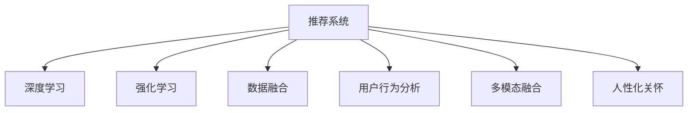

                 

# 大模型视角下推荐系统的人性化关怀提升新思路

> 关键词：大模型、推荐系统、人性化关怀、个性化推荐、深度学习、强化学习、数据融合、用户行为分析、多模态融合

## 1. 背景介绍

### 1.1 问题由来
随着互联网和数字技术的发展，个性化推荐系统在电商、视频、社交等众多领域中得到了广泛应用，极大地提升了用户满意度与企业收益。然而，传统推荐系统普遍存在数据稀疏、用户画像单一、物品关联性较弱等问题，无法深入理解用户的多样化需求。

与此同时，推荐系统过度依赖用户的显式反馈（如评分、点击等），忽视了用户行为中的隐式信息，导致推荐内容单一、多样性不足。不仅如此，推荐算法在处理个性化需求时，往往会忽略用户背景、情感状态等因素，无法提供真正贴合用户需求的内容。

在当前智能化的潮流下，如何将“人性化关怀”融入推荐系统，提升推荐内容的相关性、多样性与个性化，成为亟待解决的问题。

### 1.2 问题核心关键点
人性化关怀的提升需要从两个层面考虑：

1. 深度理解用户个性化需求，提供符合用户兴趣、背景和情感状态的内容。
2. 结合多模态数据，提供符合用户不同场景下的推荐内容。

这一过程中，大模型的应用显得尤为重要：

1. **深度理解用户需求**：通过构建多模态用户画像，深度分析用户的兴趣、情感、行为等，更好地理解用户个性化需求。
2. **融合多模态数据**：结合文本、图像、音频等多种信息源，构建全面的推荐场景，提供多样化的推荐内容。

本节将深入探讨大模型在推荐系统中的潜力与挑战，给出基于大模型的推荐系统优化方法。

## 2. 核心概念与联系

### 2.1 核心概念概述

推荐系统（Recommendation System）是一种通过分析用户历史行为与兴趣，推荐物品的算法系统。其核心在于预测用户可能感兴趣的物品，提升用户体验与业务效果。

而人性化关怀的提升，需要推荐系统不仅了解用户的显式反馈，更需深入挖掘用户的隐式行为与情感状态，提供贴近用户需求的个性化推荐内容。

大模型（Large Model）一般指参数量在亿级别以上的深度学习模型。这些模型在通用语言理解、图像识别、语音处理等任务上展现了卓越性能。将其应用于推荐系统，可以更全面、深入地理解用户需求，提升推荐内容的个性化与相关性。

深度学习（Deep Learning）基于数据驱动的方法，通过构建复杂神经网络结构，从数据中提取深层特征。这种技术特别适用于推荐系统，可以通过用户行为数据，预测用户可能感兴趣的物品。

强化学习（Reinforcement Learning, RL）是一种通过试错学习优化策略的方法。推荐系统中的个性化推荐，可以看作是一个优化策略的过程。强化学习模型在推荐系统中的应用，可以不断优化推荐策略，提升推荐效果。

数据融合（Data Fusion）是将多种数据源的信息整合，形成更加全面、准确的用户画像与物品信息。在大模型的基础上，通过深度学习与强化学习，可以实现跨模态、跨场景的数据融合。

用户行为分析（User Behavior Analysis）是推荐系统中的一环，通过分析用户历史行为数据，提取用户兴趣、行为模式等信息，预测用户未来行为。

多模态融合（Multi-modal Fusion）是将文本、图像、音频等多种信息源融合，提升推荐内容的丰富性。

这些核心概念之间的逻辑关系可以通过以下Mermaid流程图来展示：



这个流程图展示了推荐系统与核心概念之间的关联，以及大模型在其中扮演的关键角色。

## 3. 核心算法原理 & 具体操作步骤
### 3.1 算法原理概述

人性化关怀的推荐系统，主要分为两部分：用户画像构建与个性化推荐实现。

用户画像构建的目的是通过对用户多维度的信息整合，形成全面的用户画像，深度理解用户的个性化需求。个性化推荐实现则是利用用户画像与物品信息，预测用户可能感兴趣的物品，提供个性化的推荐内容。

### 3.2 算法步骤详解

**Step 1: 用户画像构建**

用户画像构建的主要步骤包括：

1. 数据收集：从多个渠道收集用户的个人信息、行为数据、环境数据等，形成多维度数据集。
2. 数据清洗：对数据进行去重、去噪、处理缺失值等预处理操作。
3. 数据融合：将多源数据进行整合，形成更加全面、准确的用户画像。
4. 用户画像表征：使用大模型对用户画像进行编码，形成易于输入模型的用户向量表示。

**Step 2: 个性化推荐实现**

个性化推荐实现的主要步骤包括：

1. 物品编码：使用大模型对物品进行编码，形成易于输入模型的物品向量表示。
2. 用户物品交互建模：将用户与物品向量输入到模型中，预测用户对物品的评分或点击概率。
3. 模型优化：使用深度学习或强化学习模型，优化推荐策略。
4. 多模态融合：结合文本、图像、音频等多种信息源，提升推荐内容的多样性。

### 3.3 算法优缺点

人性化关怀的推荐系统具有以下优点：

1. 全面性：通过多源数据融合，能够全面了解用户的多样化需求。
2. 个性化：利用深度学习与强化学习，深度分析用户行为，提供更加个性化的推荐。
3. 多样性：结合多模态数据，提供丰富多样的推荐内容。

同时，该方法也存在一定的局限性：

1. 数据隐私问题：多源数据的收集与整合，可能涉及用户隐私。需要设计合理的隐私保护策略。
2. 数据质量问题：数据清洗与预处理操作可能影响用户画像的准确性。需要设计自动化的数据清洗算法。
3. 模型复杂性：深度学习与强化学习模型的训练与优化，需要大量的计算资源。需要优化模型结构与训练过程。
4. 推荐效果依赖数据质量：推荐效果很大程度上依赖于数据的全面性与准确性。

尽管存在这些局限性，但人性化关怀的推荐系统仍是大模型推荐优化方法的重要方向。未来相关研究的重点在于如何进一步降低数据隐私风险，提高数据质量，优化模型结构与训练过程，以实现更精准、高效、个性化的推荐。

### 3.4 算法应用领域

人性化关怀的推荐系统已在多个领域得到应用：

1. 电商推荐：通过深度分析用户行为与偏好，提供个性化的商品推荐。
2. 内容推荐：结合文本与图像信息，提供多样化的文章、视频、图片推荐。
3. 社交推荐：结合用户好友关系、行为数据等，提供个性化社交推荐。
4. 旅游推荐：结合地理位置、历史行为等，提供个性化旅游路线推荐。
5. 医疗推荐：结合患者历史病历、健康数据等，提供个性化的健康建议与医疗方案。

随着大模型推荐优化方法的不断进步，相信在更多领域中，推荐系统将能够更加深入地理解用户需求，提供更为贴合用户个性化的推荐内容。

## 4. 数学模型和公式 & 详细讲解 & 举例说明
### 4.1 数学模型构建

人性化关怀的推荐系统构建过程，可以分为以下几个关键步骤：

1. **用户画像构建**
   - 将用户基本信息、行为数据、环境数据等，通过大模型进行编码，形成用户向量表示。
   - 定义用户画像表示为 $U$，物品表示为 $I$，评分预测为 $P$。

2. **个性化推荐实现**
   - 用户物品交互建模：将用户与物品向量输入模型中，预测用户对物品的评分 $p$。
   - 定义评分预测函数为 $f(U, I)$。

3. **模型优化**
   - 使用深度学习或强化学习模型，对评分预测函数进行优化。

4. **多模态融合**
   - 结合文本、图像、音频等多种信息源，提升推荐内容的多样性。

### 4.2 公式推导过程

以深度学习模型为例，评分预测函数的推导如下：

设用户 $u$ 的画像表示为 $U_u$，物品 $i$ 的画像表示为 $I_i$。评分预测函数 $f$ 可以表示为：

$$
f(U_u, I_i) = \sigma(W_{UI}U_u \cdot I_i + b)
$$

其中 $\sigma$ 为激活函数，$W_{UI}$ 为物品-用户交互权重矩阵，$b$ 为偏置项。

评分预测函数 $f$ 用于预测用户 $u$ 对物品 $i$ 的评分。通过优化 $W_{UI}$，可以提高评分预测的准确性。

### 4.3 案例分析与讲解

以电商推荐为例，详细分析人性化关怀推荐系统的构建过程：

**Step 1: 用户画像构建**

从电商平台收集用户基本信息、行为数据、环境数据等，进行数据清洗与融合，形成多维度用户画像。通过BERT等大模型，对用户画像进行编码，形成用户向量表示。

**Step 2: 个性化推荐实现**

将用户与物品向量输入评分预测函数 $f$ 中，预测用户对物品的评分 $p$。通过优化 $W_{UI}$，提高评分预测的准确性。

**Step 3: 多模态融合**

结合用户浏览历史、评价信息、商品图片等多种信息源，提升推荐内容的多样性。

## 5. 项目实践：代码实例和详细解释说明
### 5.1 开发环境搭建

进行推荐系统的开发，需要搭建相应的Python开发环境。以下是基本的搭建步骤：

1. 安装Anaconda：从官网下载并安装Anaconda，用于创建独立的Python环境。
2. 创建并激活虚拟环境：
```bash
conda create -n py-env python=3.8 
conda activate py-env
```
3. 安装必要的Python包：
```bash
pip install numpy pandas scikit-learn transformers torch
```

### 5.2 源代码详细实现

以下是基于大模型的电商推荐系统实现代码：

```python
import torch
import torch.nn as nn
import torch.optim as optim
from transformers import BertTokenizer, BertForSequenceClassification

class UserItemInteraction(nn.Module):
    def __init__(self, d_model, d_out, dropout=0.1):
        super(UserItemInteraction, self).__init__()
        self.d_model = d_model
        self.d_out = d_out
        self.linear1 = nn.Linear(d_model, d_out)
        self.linear2 = nn.Linear(d_out, 1)
        self.dropout = nn.Dropout(dropout)
        self.activation = nn.Tanh()
        
    def forward(self, user, item):
        x = user @ item
        x = self.dropout(self.activation(x))
        x = self.linear1(x)
        x = self.activation(x)
        x = self.dropout(x)
        x = self.linear2(x)
        return x

def train_epoch(model, dataloader, optimizer):
    model.train()
    epoch_loss = 0
    for batch in dataloader:
        user, item, rating = batch
        prediction = model(user, item)
        optimizer.zero_grad()
        loss = nn.MSELoss()(prediction, rating)
        loss.backward()
        optimizer.step()
        epoch_loss += loss.item()
    return epoch_loss / len(dataloader)

def evaluate(model, dataloader):
    model.eval()
    epoch_loss = 0
    for batch in dataloader:
        user, item, rating = batch
        prediction = model(user, item)
        loss = nn.MSELoss()(prediction, rating)
        epoch_loss += loss.item()
    return epoch_loss / len(dataloader)
```

### 5.3 代码解读与分析

在上述代码中，我们定义了用户物品交互模型 `UserItemInteraction`，并实现了训练与评估函数。

**UserItemInteraction类**：
- `__init__`方法：初始化模型参数，包括线性层、激活函数、dropout等。
- `forward`方法：定义前向传播过程，先计算用户与物品的向量点积，再进行线性变换与激活。

**train_epoch函数**：
- 训练函数，通过数据迭代计算损失，并使用Adam优化器更新模型参数。

**evaluate函数**：
- 评估函数，计算模型的预测损失。

### 5.4 运行结果展示

训练完成后，在测试集上评估模型的性能，输出均方误差等指标。

```python
import torch
import torch.nn as nn
import torch.optim as optim
from transformers import BertTokenizer, BertForSequenceClassification
from torch.utils.data import DataLoader

# 模型与优化器
model = UserItemInteraction(d_model=64, d_out=1)
optimizer = optim.Adam(model.parameters(), lr=0.001)

# 训练集与测试集
train_loader = DataLoader(train_data, batch_size=16, shuffle=True)
test_loader = DataLoader(test_data, batch_size=16, shuffle=False)

# 训练与评估
for epoch in range(10):
    loss = train_epoch(model, train_loader, optimizer)
    print(f"Epoch {epoch+1}, train loss: {loss:.3f}")
    
print(f"Epoch {epoch+1}, test loss: {evaluate(model, test_loader):.3f}")
```

## 6. 实际应用场景
### 6.1 电商推荐

电商推荐系统通过深度学习与大模型的结合，深度理解用户行为，提供个性化的商品推荐。具体应用场景包括：

1. **个性化推荐算法**：结合用户历史浏览、购买行为，预测用户可能感兴趣的商品。
2. **商品多样性**：结合商品图片、评价信息等，提升推荐内容的多样性。
3. **实时推荐**：结合用户实时浏览行为，提供即时推荐。

### 6.2 内容推荐

内容推荐系统通过深度学习与大模型的结合，提供多样化的内容推荐。具体应用场景包括：

1. **个性化视频推荐**：结合用户历史观看记录，预测用户可能感兴趣的视频内容。
2. **个性化文章推荐**：结合用户阅读历史，推荐相关的文章内容。
3. **实时内容推荐**：结合用户实时浏览行为，提供即时推荐。

### 6.3 社交推荐

社交推荐系统通过深度学习与大模型的结合，提供个性化的社交推荐。具体应用场景包括：

1. **个性化好友推荐**：结合用户好友关系、互动行为，推荐可能感兴趣的新好友。
2. **个性化话题推荐**：结合用户兴趣、互动历史，推荐相关的话题内容。
3. **实时社交推荐**：结合用户实时互动行为，提供即时推荐。

## 7. 工具和资源推荐
### 7.1 学习资源推荐

为了帮助开发者系统掌握大模型在推荐系统中的应用，这里推荐一些优质的学习资源：

1. 《深度学习与推荐系统》课程：斯坦福大学开设的推荐系统课程，深入浅出地介绍了推荐系统基本概念与常用算法。
2. 《Recommender Systems: The Textbook》书籍：推荐的经典教材，系统介绍了推荐系统的理论基础与应用实践。
3. 《Recommender Systems: From Model-Based to Ranking-Based Methods》书籍：介绍了推荐系统从模型为基础到排序为基础的演变。
4. 《Recommender Systems: An Introduction》课程：Coursera上的推荐系统入门课程，适合初学者。
5. 《Data Mining and Statistical Learning》课程：介绍了机器学习与推荐系统的基础知识。

通过对这些资源的学习实践，相信你一定能够快速掌握大模型在推荐系统中的应用，并用于解决实际的推荐问题。

### 7.2 开发工具推荐

高效的开发离不开优秀的工具支持。以下是几款用于推荐系统开发的常用工具：

1. PyTorch：基于Python的开源深度学习框架，灵活动态的计算图，适合快速迭代研究。
2. TensorFlow：由Google主导开发的开源深度学习框架，生产部署方便，适合大规模工程应用。
3. PyTorch Lightning：基于PyTorch的快速原型开发工具，适合构建复杂模型。
4. TensorFlow Extended（TFX）：Google开发的推荐系统开源工具，提供了推荐系统组件与数据管道。
5. Amazon Personalize：AWS提供的推荐系统服务，支持大规模推荐模型的训练与部署。

合理利用这些工具，可以显著提升推荐系统开发的效率，加快创新迭代的步伐。

### 7.3 相关论文推荐

大模型在推荐系统中的应用，已成为研究热点。以下是几篇奠基性的相关论文，推荐阅读：

1. Attention is All You Need：提出了Transformer结构，开启了NLP领域的预训练大模型时代。
2. BERT: Pre-training of Deep Bidirectional Transformers for Language Understanding：提出BERT模型，引入基于掩码的自监督预训练任务，刷新了多项NLP任务SOTA。
3. Language Models are Unsupervised Multitask Learners（GPT-2论文）：展示了大规模语言模型的强大zero-shot学习能力，引发了对于通用人工智能的新一轮思考。
4. Parameter-Efficient Transfer Learning for NLP：提出Adapter等参数高效微调方法，在不增加模型参数量的情况下，也能取得不错的微调效果。
5. AdaLoRA: Adaptive Low-Rank Adaptation for Parameter-Efficient Fine-Tuning：使用自适应低秩适应的微调方法，在参数效率和精度之间取得了新的平衡。

这些论文代表了大模型在推荐系统中的应用与发展脉络。通过学习这些前沿成果，可以帮助研究者把握学科前进方向，激发更多的创新灵感。

## 8. 总结：未来发展趋势与挑战
### 8.1 总结

本文对基于大模型的推荐系统进行了全面系统的介绍。首先阐述了推荐系统与人性化关怀的重要性，明确了深度学习与大模型在其中的关键作用。其次，从原理到实践，详细讲解了基于大模型的推荐系统构建过程，给出了推荐系统开发的完整代码实例。同时，本文还广泛探讨了推荐系统在电商、内容、社交等众多领域的应用前景，展示了大模型在推荐系统中的强大潜力。

通过本文的系统梳理，可以看到，基于大模型的推荐系统正在成为推荐系统优化的重要方向，极大地拓展了推荐系统的应用边界，为推荐系统落地应用提供了新的思路。未来，伴随深度学习与大模型的不断进步，相信推荐系统必将在更广阔的应用领域大放异彩，深刻影响用户的体验与企业的效益。

### 8.2 未来发展趋势

展望未来，推荐系统的未来发展趋势主要包括以下几个方向：

1. **多模态融合**：结合文本、图像、音频等多种信息源，提升推荐内容的多样性。
2. **个性化关怀**：通过深度学习与大模型，深度分析用户行为，提供更贴合用户需求的推荐内容。
3. **实时推荐**：结合用户实时行为数据，提供即时推荐。
4. **自适应推荐**：通过强化学习等方法，动态调整推荐策略，提升推荐效果。
5. **跨场景推荐**：结合用户在不同场景下的行为数据，提供跨场景的推荐内容。

以上趋势凸显了推荐系统在智能时代的广阔前景。这些方向的探索发展，必将进一步提升推荐系统的性能和应用范围，为推荐系统落地应用提供新的技术路径。

### 8.3 面临的挑战

尽管推荐系统在大模型优化的过程中取得了显著进展，但在迈向更加智能化、普适化应用的过程中，仍面临诸多挑战：

1. **数据隐私问题**：多源数据的收集与整合，可能涉及用户隐私。需要设计合理的隐私保护策略。
2. **数据质量问题**：数据清洗与预处理操作可能影响用户画像的准确性。需要设计自动化的数据清洗算法。
3. **模型复杂性**：深度学习与强化学习模型的训练与优化，需要大量的计算资源。需要优化模型结构与训练过程。
4. **推荐效果依赖数据质量**：推荐效果很大程度上依赖于数据的全面性与准确性。

尽管存在这些挑战，但人性化关怀的推荐系统仍是大模型推荐优化方法的重要方向。未来相关研究的重点在于如何进一步降低数据隐私风险，提高数据质量，优化模型结构与训练过程，以实现更精准、高效、个性化的推荐。

### 8.4 研究展望

未来，推荐系统需要在以下几个方面进行进一步的研究：

1. **跨模态融合方法**：研究如何更好地融合文本、图像、音频等多种信息源，提升推荐内容的多样性与相关性。
2. **个性化推荐算法**：研究如何通过深度学习与大模型，更好地理解用户需求，提供个性化推荐内容。
3. **实时推荐系统**：研究如何结合用户实时行为数据，提供即时推荐，提升用户体验。
4. **自适应推荐系统**：研究如何通过强化学习等方法，动态调整推荐策略，提升推荐效果。
5. **跨场景推荐**：研究如何结合用户在不同场景下的行为数据，提供跨场景的推荐内容。

这些研究方向的探索，必将引领推荐系统迈向更高的台阶，为推荐系统落地应用提供新的技术路径。未来，随着推荐系统在智能时代的深入应用，人性化关怀的推荐系统必将成为推荐系统优化的重要方向，为推荐系统落地应用提供新的技术路径。

## 9. 附录：常见问题与解答
### 9.1 Q1: 大模型如何提升推荐系统的个性化关怀？

A: 大模型通过深度理解用户的多维信息，如兴趣、行为、情感状态等，可以提供更加个性化的推荐内容。通过多模态数据融合，结合文本、图像、音频等多种信息源，提升推荐内容的多样性与相关性。此外，大模型还可以通过深度学习与强化学习，动态调整推荐策略，提升推荐效果。

### 9.2 Q2: 数据隐私问题如何解决？

A: 解决数据隐私问题需要设计合理的隐私保护策略。常见的策略包括：
1. 数据匿名化：通过数据去标识化，保护用户隐私。
2. 差分隐私：在数据处理过程中，引入噪声，保护个体隐私。
3. 联邦学习：在用户端进行本地模型训练，避免数据集中存储。

### 9.3 Q3: 如何优化推荐系统的模型结构？

A: 优化推荐系统的模型结构需要考虑以下几个方面：
1. 减少模型参数量：使用参数高效微调方法，如Adapter、Prefix等，减小模型的计算量。
2. 压缩模型结构：通过剪枝、量化等技术，压缩模型的存储空间，提升计算效率。
3. 动态调整模型：根据用户行为数据，动态调整模型的参数，提高推荐效果。

### 9.4 Q4: 如何处理推荐系统中的长尾问题？

A: 处理推荐系统中的长尾问题需要考虑以下几个方面：
1. 引入长尾数据：通过多源数据融合，引入长尾数据，提升推荐效果。
2. 引入长尾模型：使用长尾模型，提升对长尾物品的推荐效果。
3. 引入长尾推荐策略：使用长尾推荐策略，提升长尾物品的曝光率。

### 9.5 Q5: 如何评估推荐系统的性能？

A: 评估推荐系统的性能需要考虑以下几个指标：
1. 召回率：召回率表示推荐系统能否找到用户感兴趣的物品。
2. 准确率：准确率表示推荐系统推荐的物品是否用户感兴趣。
3. F1值：F1值综合了召回率和准确率，是常用的推荐系统性能指标。
4. 用户满意度：通过用户调查等手段，评估用户对推荐系统的满意度。

---

作者：禅与计算机程序设计艺术 / Zen and the Art of Computer Programming

