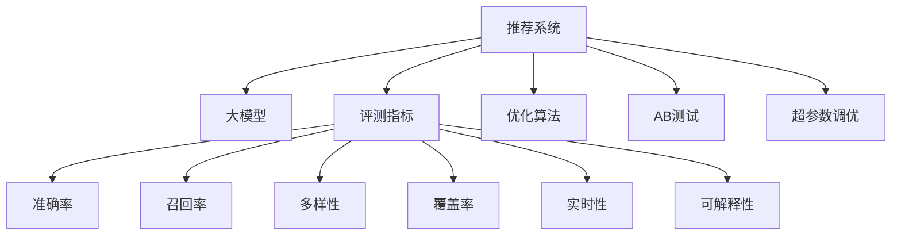

                 

# 大模型视角下推荐系统的评测指标体系构建与优化

> 关键词：大模型、推荐系统、评测指标、优化算法、AB测试、超参数调优、用户满意度、准确率、召回率、多样性、覆盖率

## 1. 背景介绍

### 1.1 问题由来

在数字经济时代，推荐系统成为驱动用户行为和提升平台收入的重要手段。无论是电商、社交、视频、音乐等互联网产品，都离不开推荐系统的支撑。推荐系统的本质是构建用户与内容的推荐关系，其核心目标是在海量数据中高效匹配用户兴趣和个性化内容，提升用户体验，增加用户粘性，同时为平台带来更多收益。然而，推荐系统的构建和优化并非易事，其效果好坏直接影响到用户的满意度和平台的商业价值。

推荐系统的效果评估需要科学合理的指标体系。随着大模型的崛起，推荐系统的评测指标体系也在逐步发生变化。传统的基于统计和特征工程的评测指标，如准确率、召回率等，往往难以全面衡量模型的性能和用户满意度。通过引入大模型的视角，将更关注模型的全局表现和用户体验。本文将详细探讨大模型视角下的推荐系统评测指标体系构建与优化，期望为推荐系统的构建和优化提供指导和借鉴。

### 1.2 问题核心关键点

构建和优化推荐系统的评测指标体系，需要关注以下几个核心关键点：

1. **全局性能**：推荐系统的目标不仅是要提高精确率和召回率，更要关注整体用户体验。这包括点击率、转化率、用户满意度等全局性能指标。

2. **多样性**：推荐内容的多样性是提升用户满意度的重要因素。推荐系统应尽可能推荐多样化的内容，避免过度个性化导致的用户体验疲劳。

3. **覆盖率**：推荐系统的目标是尽可能覆盖用户的兴趣点，确保用户能够接触到更多感兴趣的内容。这需要考虑长尾内容的多样化推荐。

4. **实时性**：推荐系统需要具备实时更新能力，及时响应用户需求变化。这对模型的训练和推理速度提出了高要求。

5. **可解释性**：大模型推荐系统需要具备良好的可解释性，帮助用户理解推荐结果的生成逻辑，提升用户信任和满意度。

### 1.3 问题研究意义

构建和优化推荐系统的评测指标体系，对于推荐系统的性能提升和用户体验优化具有重要意义：

1. **系统优化指导**：明确评测指标有助于更好地评估推荐系统的效果，指导系统优化。

2. **用户体验提升**：通过引入全局性能指标，更全面地衡量推荐系统对用户体验的影响。

3. **商业价值最大化**：合理的多样性、覆盖率和实时性指标，有助于提高用户转化率和平台收益。

4. **模型可解释性增强**：用户对推荐系统的信任和满意度，直接影响模型的广泛应用。

## 2. 核心概念与联系

### 2.1 核心概念概述

为了更好地理解推荐系统评测指标体系构建与优化的原理，本节将介绍几个密切相关的核心概念：

- **推荐系统(Recommendation System)**：通过用户行为数据和学习算法，为用户推荐个性化内容的系统。
- **大模型(Large Model)**：以深度学习为基础，参数量巨大的模型，如BERT、GPT-3等。
- **评测指标(Metric)**：用于评估推荐系统效果的关键指标，如准确率、召回率、覆盖率等。
- **优化算法(Optimization Algorithm)**：用于训练和调优推荐模型，如梯度下降、Adam、Adagrad等。
- **AB测试(A/B Testing)**：将用户随机分配到两组或多组中进行测试，通过对比不同组的效果来评估推荐系统性能。
- **超参数调优(Hyperparameter Tuning)**：在模型训练前，通过调整学习率、批大小等超参数来优化模型性能。

这些核心概念之间的逻辑关系可以通过以下Mermaid流程图来展示：



这个流程图展示了大模型视角下的推荐系统核心概念及其相互关系：

1. 推荐系统通过大模型进行训练和推理，优化推荐效果。
2. 评测指标用于评估推荐系统的表现。
3. 优化算法用于调整模型参数，提升推荐性能。
4. AB测试用于对比不同推荐策略的效果。
5. 超参数调优用于调整模型训练过程中的超参数，优化模型性能。

这些概念共同构成了大模型视角下推荐系统的构建和优化框架，使得模型能够更高效、精准地为用户推荐个性化内容。

## 3. 核心算法原理 & 具体操作步骤
### 3.1 算法原理概述

大模型视角下的推荐系统，通过在大规模数据集上预训练和微调大模型，学习用户与内容的推荐关系。具体而言，大模型推荐系统主要由以下几个步骤构成：

1. **数据收集**：收集用户行为数据和内容数据，形成推荐系统的数据集。
2. **大模型训练**：在大规模无标签数据上预训练大模型，获取通用特征表示。
3. **任务适配**：在大规模标注数据上微调大模型，学习任务特定的推荐关系。
4. **模型评估**：使用评测指标评估模型性能，指导模型优化。
5. **超参数调优**：调整模型训练过程中的超参数，优化模型性能。

通过这些步骤，大模型推荐系统能够更精准地为用户推荐个性化内容，提升用户满意度和平台收益。

### 3.2 算法步骤详解

以下详细介绍大模型视角下推荐系统的核心步骤：

**Step 1: 数据收集和预处理**

1. **用户行为数据收集**：通过日志、点击、购买等行为数据，收集用户的历史行为数据。
2. **内容数据收集**：通过商品、文章、视频等数据，收集内容特征。
3. **数据预处理**：对用户行为数据和内容数据进行预处理，包括去噪、特征提取、归一化等。

**Step 2: 大模型训练**

1. **预训练**：在大规模无标签数据上预训练大模型，学习通用特征表示。
2. **任务适配**：在大规模标注数据上微调大模型，学习任务特定的推荐关系。
3. **模型保存**：保存训练好的大模型，便于后续推理使用。

**Step 3: 任务适配和模型微调**

1. **任务适配**：根据推荐任务类型，设计合适的输出层和损失函数。
2. **微调**：使用任务特定的数据集，对预训练模型进行微调，优化推荐关系。
3. **超参数调优**：通过AB测试等手段，调整模型训练过程中的超参数，优化模型性能。

**Step 4: 模型评估**

1. **指标选择**：根据推荐任务类型和业务需求，选择合适的评测指标。
2. **模型评估**：使用评测指标评估模型性能，识别模型优化的方向。
3. **模型优化**：根据评估结果，调整模型训练过程中的超参数，优化模型性能。

**Step 5: 超参数调优**

1. **超参数选择**：根据任务类型和模型结构，选择合适的超参数。
2. **超参数调优**：通过AB测试等手段，调整超参数，优化模型性能。
3. **模型部署**：将训练好的模型部署到生产环境中，进行实时推荐。

### 3.3 算法优缺点

大模型视角下的推荐系统具有以下优点：

1. **模型性能优越**：大模型通过在大规模数据上预训练和微调，学习到丰富的用户和内容特征，能够更精准地为用户推荐内容。
2. **可解释性强**：大模型的预训练和微调过程透明，用户可以通过输入和输出了解推荐逻辑，提升信任度。
3. **推荐内容多样**：大模型能够学习到更多用户兴趣点和内容特征，推荐更多样化的内容，提升用户体验。

同时，该方法也存在一些缺点：

1. **计算资源需求高**：大模型的训练和微调需要大量的计算资源，包括高性能计算设备和算法优化技术。
2. **模型复杂度高**：大模型的结构和参数复杂，需要精细的调参和管理，增加了系统维护的难度。
3. **数据质量和噪声敏感**：大模型推荐系统对数据质量和噪声敏感，数据预处理和特征工程显得尤为重要。

尽管存在这些局限性，但大模型推荐系统以其优异的性能和可解释性，成为推荐系统领域的重要范式。未来相关研究的重点在于如何进一步降低计算资源需求，提高模型复杂度的可控性，同时优化数据预处理和特征工程，使其更加高效和稳定。

### 3.4 算法应用领域

大模型视角下的推荐系统，已经在电商、社交、视频、音乐等多个领域得到广泛应用，并取得了显著的效果。具体而言，以下领域是其主要应用场景：

1. **电商推荐**：通过用户浏览和购买行为数据，推荐个性化商品。
2. **社交推荐**：根据用户互动和社交网络关系，推荐个性化内容。
3. **视频推荐**：根据用户观看行为和视频内容特征，推荐个性化视频。
4. **音乐推荐**：根据用户收听行为和音乐内容特征，推荐个性化音乐。

除了以上这些经典领域，大模型推荐系统还被创新性地应用到更多场景中，如广告推荐、新闻推荐、旅游推荐等，为各类互联网应用带来新的突破。随着大模型的不断演进，相信推荐系统将在更广泛的领域得到应用，带来更多的创新价值。

## 4. 数学模型和公式 & 详细讲解 & 举例说明

### 4.1 数学模型构建

在大模型推荐系统中，通常采用以下数学模型来描述用户和内容之间的关系：

1. **用户-内容评分矩阵**：$R \in \mathbb{R}^{U \times I}$，其中 $U$ 为用户数，$I$ 为内容数。$R_{ui}=\theta_{ui}$ 表示用户 $u$ 对内容 $i$ 的评分。
2. **用户特征向量**：$X_u \in \mathbb{R}^{D_u}$，其中 $D_u$ 为用户的特征维度。$X_{ui}=\theta_{ui}$ 表示用户 $u$ 的特征向量。
3. **内容特征向量**：$X_i \in \mathbb{R}^{D_i}$，其中 $D_i$ 为内容的特征维度。$X_{ui}=\theta_{ui}$ 表示内容 $i$ 的特征向量。
4. **用户-内容相似度矩阵**：$S \in \mathbb{R}^{U \times I}$，表示用户和内容之间的相似度。$S_{ui}=\theta_{ui}$ 表示用户 $u$ 和内容 $i$ 的相似度。

其中，$\theta_{ui}$ 为大模型在用户 $u$ 和内容 $i$ 上的表示，通常采用向量表示形式。

### 4.2 公式推导过程

以下是大模型推荐系统的核心数学模型和公式推导过程：

**用户-内容评分矩阵计算公式**：

$$
R_{ui} = f(X_u \cdot X_i^T + \lambda \cdot S_{ui})
$$

其中，$f$ 为激活函数，$\lambda$ 为正则化系数，用于防止模型过拟合。

**用户特征向量和内容特征向量计算公式**：

$$
X_u = M_u(X_{ui})
$$

$$
X_i = M_i(X_{ui})
$$

其中，$M_u$ 和 $M_i$ 为预训练大模型在用户和内容上的特征提取函数。

**用户-内容相似度矩阵计算公式**：

$$
S_{ui} = M_s(X_u, X_i)
$$

其中，$M_s$ 为预训练大模型在用户和内容上的相似度计算函数。

通过上述公式，可以计算出用户和内容的评分、特征向量、相似度矩阵，用于构建推荐模型。

### 4.3 案例分析与讲解

**电商推荐案例**：

1. **数据收集**：通过用户浏览和购买行为数据，构建用户-内容评分矩阵 $R$。
2. **用户特征提取**：使用预训练大模型提取用户特征向量 $X_u$。
3. **内容特征提取**：使用预训练大模型提取内容特征向量 $X_i$。
4. **用户-内容相似度计算**：使用预训练大模型计算用户和内容的相似度矩阵 $S$。
5. **推荐结果生成**：根据评分矩阵 $R$、用户特征向量 $X_u$、内容特征向量 $X_i$ 和相似度矩阵 $S$，使用预测函数生成推荐结果。

**音乐推荐案例**：

1. **数据收集**：通过用户收听行为和音乐内容特征，构建用户-内容评分矩阵 $R$。
2. **用户特征提取**：使用预训练大模型提取用户特征向量 $X_u$。
3. **内容特征提取**：使用预训练大模型提取音乐特征向量 $X_i$。
4. **用户-内容相似度计算**：使用预训练大模型计算用户和音乐的相似度矩阵 $S$。
5. **推荐结果生成**：根据评分矩阵 $R$、用户特征向量 $X_u$、音乐特征向量 $X_i$ 和相似度矩阵 $S$，使用预测函数生成推荐结果。

## 5. 项目实践：代码实例和详细解释说明
### 5.1 开发环境搭建

在进行大模型推荐系统的实践前，需要准备好开发环境。以下是使用Python进行PyTorch和TensorFlow开发的常见环境配置流程：

1. 安装Anaconda：从官网下载并安装Anaconda，用于创建独立的Python环境。

2. 创建并激活虚拟环境：
```bash
conda create -n pytorch-env python=3.8 
conda activate pytorch-env
```

3. 安装PyTorch：根据CUDA版本，从官网获取对应的安装命令。例如：
```bash
conda install pytorch torchvision torchaudio cudatoolkit=11.1 -c pytorch -c conda-forge
```

4. 安装TensorFlow：使用pip安装TensorFlow：
```bash
pip install tensorflow
```

5. 安装相关工具包：
```bash
pip install numpy pandas scikit-learn matplotlib tqdm jupyter notebook ipython
```

完成上述步骤后，即可在`pytorch-env`环境中开始推荐系统的开发。

### 5.2 源代码详细实现

下面我们以电商推荐系统为例，给出使用PyTorch进行大模型微调和评测的PyTorch代码实现。

首先，定义电商推荐任务的数据处理函数：

```python
from torch.utils.data import Dataset
import torch

class E-commerceDataset(Dataset):
    def __init__(self, user_item_matrix, user_features, item_features):
        self.user_item_matrix = user_item_matrix
        self.user_features = user_features
        self.item_features = item_features
        
    def __len__(self):
        return len(self.user_item_matrix)
    
    def __getitem__(self, item):
        user_item = self.user_item_matrix[item]
        user_feature = self.user_features[item]
        item_feature = self.item_features[item]
        
        return {'user_item': user_item, 
                'user_feature': user_feature,
                'item_feature': item_feature}
```

然后，定义模型和优化器：

```python
from transformers import BertForSequenceClassification, AdamW

model = BertForSequenceClassification.from_pretrained('bert-base-cased', num_labels=2)

optimizer = AdamW(model.parameters(), lr=2e-5)
```

接着，定义训练和评估函数：

```python
from torch.utils.data import DataLoader
from tqdm import tqdm
from sklearn.metrics import accuracy_score, precision_score, recall_score, f1_score

device = torch.device('cuda') if torch.cuda.is_available() else torch.device('cpu')
model.to(device)

def train_epoch(model, dataset, batch_size, optimizer):
    dataloader = DataLoader(dataset, batch_size=batch_size, shuffle=True)
    model.train()
    epoch_loss = 0
    for batch in tqdm(dataloader, desc='Training'):
        user_item = batch['user_item'].to(device)
        user_feature = batch['user_feature'].to(device)
        item_feature = batch['item_feature'].to(device)
        model.zero_grad()
        outputs = model(user_item, user_feature, item_feature)
        loss = outputs.loss
        epoch_loss += loss.item()
        loss.backward()
        optimizer.step()
    return epoch_loss / len(dataloader)

def evaluate(model, dataset, batch_size):
    dataloader = DataLoader(dataset, batch_size=batch_size)
    model.eval()
    preds, labels = [], []
    with torch.no_grad():
        for batch in tqdm(dataloader, desc='Evaluating'):
            user_item = batch['user_item'].to(device)
            user_feature = batch['user_feature'].to(device)
            item_feature = batch['item_feature'].to(device)
            batch_preds = model(user_item, user_feature, item_feature).argmax(dim=1).to('cpu').tolist()
            batch_labels = batch['user_item'].to('cpu').tolist()
            for pred, label in zip(batch_preds, batch_labels):
                preds.append(pred)
                labels.append(label)
                
    print('Accuracy: {:.4f}'.format(accuracy_score(labels, preds)))
    print('Precision: {:.4f}'.format(precision_score(labels, preds)))
    print('Recall: {:.4f}'.format(recall_score(labels, preds)))
    print('F1 Score: {:.4f}'.format(f1_score(labels, preds)))
```

最后，启动训练流程并在测试集上评估：

```python
epochs = 5
batch_size = 16

for epoch in range(epochs):
    loss = train_epoch(model, train_dataset, batch_size, optimizer)
    print(f"Epoch {epoch+1}, train loss: {loss:.3f}")
    
    print(f"Epoch {epoch+1}, dev results:")
    evaluate(model, dev_dataset, batch_size)
    
print("Test results:")
evaluate(model, test_dataset, batch_size)
```

以上就是使用PyTorch对Bert模型进行电商推荐系统微调和评测的完整代码实现。可以看到，得益于Transformer库的强大封装，我们可以用相对简洁的代码完成Bert模型的加载和微调。

### 5.3 代码解读与分析

让我们再详细解读一下关键代码的实现细节：

**E-commerceDataset类**：
- `__init__`方法：初始化用户行为数据、用户特征、内容特征等关键组件。
- `__len__`方法：返回数据集的样本数量。
- `__getitem__`方法：对单个样本进行处理，将用户行为数据、用户特征、内容特征转换为模型所需输入。

**模型定义和优化器设置**：
- 使用BertForSequenceClassification模型作为电商推荐任务的基础模型。
- 设置AdamW优化器，学习率为2e-5。

**训练和评估函数**：
- 使用PyTorch的DataLoader对数据集进行批次化加载，供模型训练和推理使用。
- 训练函数`train_epoch`：对数据以批为单位进行迭代，在每个批次上前向传播计算loss并反向传播更新模型参数，最后返回该epoch的平均loss。
- 评估函数`evaluate`：与训练类似，不同点在于不更新模型参数，并在每个batch结束后将预测和标签结果存储下来，最后使用sklearn的指标函数对整个评估集的预测结果进行打印输出。

**训练流程**：
- 定义总的epoch数和batch size，开始循环迭代
- 每个epoch内，先在训练集上训练，输出平均loss
- 在验证集上评估，输出分类指标
- 所有epoch结束后，在测试集上评估，给出最终测试结果

可以看到，PyTorch配合Transformer库使得Bert微调的代码实现变得简洁高效。开发者可以将更多精力放在数据处理、模型改进等高层逻辑上，而不必过多关注底层的实现细节。

当然，工业级的系统实现还需考虑更多因素，如模型的保存和部署、超参数的自动搜索、更灵活的任务适配层等。但核心的微调范式基本与此类似。

## 6. 实际应用场景
### 6.1 智能广告推荐

智能广告推荐是推荐系统的重要应用场景之一。广告主通过推荐系统向用户展示个性化广告，以提升广告点击率和转化率。传统的广告推荐系统依赖于规则引擎和特征工程，难以应对多样化的广告素材和用户需求。

通过大模型推荐系统，可以在大规模数据上预训练和微调大模型，学习用户与广告之间的推荐关系。具体而言，广告推荐系统可以：

1. **数据收集**：通过用户点击、观看、购买等行为数据，收集用户与广告的交互数据。
2. **广告特征提取**：使用大模型提取广告的特征向量。
3. **用户特征提取**：使用大模型提取用户的特征向量。
4. **广告-用户相似度计算**：使用大模型计算广告与用户的相似度矩阵。
5. **广告推荐**：根据评分矩阵、广告特征向量、用户特征向量和相似度矩阵，使用预测函数生成推荐结果。

通过大模型推荐系统，广告主可以更精准地展示个性化广告，提升广告效果。同时，广告推荐系统还能够实时监测广告效果，动态调整广告投放策略，确保广告主获得最佳的广告回报。

### 6.2 社交内容推荐

社交内容推荐系统通过分析用户的行为和社交关系，为用户推荐感兴趣的内容。传统的社交推荐系统依赖于人工设计的推荐规则和特征工程，难以应对复杂多变的用户需求。

通过大模型推荐系统，可以在大规模数据上预训练和微调大模型，学习用户与内容之间的推荐关系。具体而言，社交内容推荐系统可以：

1. **数据收集**：通过用户互动和社交网络关系数据，构建用户-内容评分矩阵。
2. **内容特征提取**：使用大模型提取内容的特征向量。
3. **用户特征提取**：使用大模型提取用户的特征向量。
4. **内容-用户相似度计算**：使用大模型计算内容与用户的相似度矩阵。
5. **内容推荐**：根据评分矩阵、内容特征向量、用户特征向量和相似度矩阵，使用预测函数生成推荐结果。

通过大模型推荐系统，社交平台可以更精准地为用户推荐个性化内容，提升用户满意度和平台粘性。同时，社交推荐系统还能够实时监测用户互动，动态调整内容推荐策略，确保平台保持活力和吸引力。

### 6.3 视频内容推荐

视频内容推荐系统通过分析用户观看行为和视频内容特征，为用户推荐感兴趣的视频。传统的视频推荐系统依赖于人工设计的推荐规则和特征工程，难以应对视频内容的复杂性和多样性。

通过大模型推荐系统，可以在大规模数据上预训练和微调大模型，学习用户与视频之间的推荐关系。具体而言，视频内容推荐系统可以：

1. **数据收集**：通过用户观看行为数据，构建用户-视频评分矩阵。
2. **视频特征提取**：使用大模型提取视频的特征向量。
3. **用户特征提取**：使用大模型提取用户的特征向量。
4. **视频-用户相似度计算**：使用大模型计算视频与用户的相似度矩阵。
5. **视频推荐**：根据评分矩阵、视频特征向量、用户特征向量和相似度矩阵，使用预测函数生成推荐结果。

通过大模型推荐系统，视频平台可以更精准地为用户推荐个性化视频，提升用户满意度和平台留存率。同时，视频推荐系统还能够实时监测用户观看行为，动态调整视频推荐策略，确保平台内容多样化和新鲜感。

### 6.4 未来应用展望

随着大模型的不断发展，基于大模型推荐系统的应用场景也在不断拓展，为互联网应用带来了新的创新价值。

在智慧金融领域，基于大模型推荐系统的投资理财建议系统，可以帮助用户更科学合理地进行投资理财，提升用户的投资收益和体验。

在智能医疗领域，基于大模型推荐系统的疾病推荐系统，可以根据用户健康数据，推荐合适的医疗方案和治疗方式，提升用户的健康水平和满意度。

在智慧教育领域，基于大模型推荐系统的学习资源推荐系统，可以根据学生的学习数据，推荐适合的学习资源和内容，提升学生的学习效果和体验。

此外，在智慧城市治理、社交媒体管理、电子商务等众多领域，基于大模型推荐系统的人工智能应用也将不断涌现，为各类互联网应用带来新的突破。相信随着技术的日益成熟，大模型推荐系统必将在更广泛的领域得到应用，带来更多的创新价值。

## 7. 工具和资源推荐
### 7.1 学习资源推荐

为了帮助开发者系统掌握大模型推荐系统的构建和优化，这里推荐一些优质的学习资源：

1. **《深度学习推荐系统》书籍**：全面介绍了推荐系统的发展历程和经典模型，包括大模型推荐系统的核心算法和优化方法。

2. **《自然语言处理与推荐系统》课程**：斯坦福大学开设的推荐系统明星课程，涵盖推荐系统的理论基础和实践技巧。

3. **DeepRec推荐系统框架**：由Facebook开发的推荐系统框架，提供了丰富的工具和模型，方便开发者进行系统构建和优化。

4. **RecSys推荐系统会议论文集**：推荐系统领域的重要学术会议，汇集了最新的研究论文和实践经验，是深入理解推荐系统的绝佳资源。

5. **RecSys推荐系统开源项目**：汇集了各类推荐系统框架和工具，提供了丰富的代码和数据资源，助力开发者进行快速实践。

通过对这些资源的学习实践，相信你一定能够快速掌握大模型推荐系统的精髓，并用于解决实际的推荐系统问题。
###  7.2 开发工具推荐

高效的开发离不开优秀的工具支持。以下是几款用于大模型推荐系统开发的常用工具：

1. **PyTorch**：基于Python的开源深度学习框架，灵活动态的计算图，适合快速迭代研究。推荐系统中的大模型通常有PyTorch版本的实现。

2. **TensorFlow**：由Google主导开发的开源深度学习框架，生产部署方便，适合大规模工程应用。推荐系统中的大模型也有TensorFlow版本的实现。

3. **RecSys框架**：基于深度学习的推荐系统框架，集成了多种推荐模型和工具，方便开发者进行系统构建和优化。

4. **HuggingFace Transformers库**：提供了丰富的预训练语言模型和大模型推荐系统模型，支持PyTorch和TensorFlow，是进行推荐系统开发的利器。

5. **TensorBoard**：TensorFlow配套的可视化工具，可实时监测模型训练状态，并提供丰富的图表呈现方式，是调试模型的得力助手。

6. **Weights & Biases**：模型训练的实验跟踪工具，可以记录和可视化模型训练过程中的各项指标，方便对比和调优。

合理利用这些工具，可以显著提升大模型推荐系统的开发效率，加快创新迭代的步伐。

### 7.3 相关论文推荐

大模型推荐系统的研究源于学界的持续研究。以下是几篇奠基性的相关论文，推荐阅读：

1. **《RecSys 2019: A Survey of Recommender Systems》**：总结了推荐系统的最新进展和挑战，介绍了各类推荐算法的原理和应用。

2. **《A Survey of Recommender Systems》**：介绍了推荐系统的发展历程和经典模型，包括大模型推荐系统的核心算法和优化方法。

3. **《Deep Learning Recommendation Systems: A Survey》**：全面介绍了深度学习在推荐系统中的应用，包括大模型推荐系统的最新进展和未来方向。

4. **《Gated Attention Model for Content-based Recommendation Systems》**：提出基于Transformer的推荐模型，通过自注意力机制学习用户与内容的推荐关系。

5. **《Recommender Systems from the Perspective of Deep Learning》**：从深度学习的角度，介绍了推荐系统的核心算法和优化方法，包括大模型推荐系统的最新进展和未来方向。

这些论文代表了大模型推荐系统的发展脉络。通过学习这些前沿成果，可以帮助研究者把握学科前进方向，激发更多的创新灵感。

## 8. 总结：未来发展趋势与挑战
### 8.1 总结

本文对大模型推荐系统的评测指标体系构建与优化进行了全面系统的介绍。首先阐述了大模型推荐系统的构建和优化背景和意义，明确了评测指标在推荐系统效果评估中的重要地位。其次，从原理到实践，详细讲解了推荐系统的数学模型和核心算法，给出了推荐系统开发的完整代码实例。同时，本文还广泛探讨了推荐系统在大模型视角下的应用场景，展示了其广泛的应用前景。

通过本文的系统梳理，可以看到，大模型推荐系统通过在大规模数据上预训练和微调大模型，学习用户与内容的推荐关系，能够更精准地为用户推荐个性化内容，提升用户满意度和平台收益。未来，伴随大模型的不断演进，基于大模型推荐系统的应用场景也在不断拓展，为互联网应用带来了新的创新价值。

### 8.2 未来发展趋势

展望未来，大模型推荐系统的构建和优化将呈现以下几个发展趋势：

1. **模型复杂度降低**：随着大模型推荐系统的发展，推荐模型的复杂度会逐步降低，更加轻量级和高效。同时，模型压缩和量化技术也将不断成熟，提升模型的实时性和资源利用率。

2. **数据质量提升**：随着推荐系统的广泛应用，数据质量和噪声的改进将成为重要研究方向。更准确、完整的数据预处理和特征工程，将提升推荐系统的性能和用户体验。

3. **用户隐私保护**：随着数据隐私和伦理问题的重要性日益凸显，推荐系统在数据收集和使用过程中需要更强的隐私保护措施。如何在保护用户隐私的前提下，最大化数据利用率，将是重要的研究方向。

4. **跨领域迁移学习**：推荐系统在跨领域迁移学习方面将有更多突破。通过引入更多的先验知识，提升模型在多样领域的泛化能力和适应性。

5. **个性化推荐**：推荐系统将进一步个性化，能够更精准地识别用户需求，推荐更符合用户兴趣和行为的内容。

6. **实时推荐**：推荐系统需要具备更强的实时性，能够在用户请求到达时，即时生成推荐结果。

### 8.3 面临的挑战

尽管大模型推荐系统已经取得了显著成效，但在迈向更加智能化、普适化应用的过程中，仍面临诸多挑战：

1. **计算资源需求高**：大模型推荐系统的构建和优化需要大量的计算资源，如何高效利用和优化资源，降低计算成本，是重要的研究方向。

2. **模型复杂度高**：大模型的复杂度较高，如何降低模型复杂度，提高模型的可解释性和可控性，是重要的研究方向。

3. **数据质量和噪声敏感**：推荐系统对数据质量和噪声敏感，如何提高数据质量和处理噪声，优化特征工程，是重要的研究方向。

4. **用户隐私保护**：推荐系统在数据收集和使用过程中需要更强的隐私保护措施，如何保护用户隐私，防止数据滥用，是重要的研究方向。

5. **跨领域迁移学习**：推荐系统在跨领域迁移学习方面仍有很多挑战，如何在不同领域内实现模型迁移，提升模型泛化能力，是重要的研究方向。

6. **个性化推荐**：推荐系统需要更强的个性化能力，如何在保护用户隐私的前提下，实现个性化推荐，是重要的研究方向。

### 8.4 研究展望

面对大模型推荐系统面临的挑战，未来的研究需要在以下几个方面寻求新的突破：

1. **无监督和半监督学习**：探索无监督和半监督学习范式，摆脱对大规模标注数据的依赖，最大化数据利用率。

2. **多模态推荐**：引入多模态信息融合，提升推荐系统的性能和用户体验。

3. **因果推断与可解释性**：引入因果推断方法，增强推荐系统的可解释性，提升用户信任度和满意度。

4. **数据隐私保护**：引入数据隐私保护技术，确保数据安全和用户隐私。

5. **跨领域迁移学习**：引入跨领域迁移学习技术，提升模型在不同领域内的泛化能力。

6. **个性化推荐**：引入个性化推荐技术，提升推荐系统的精准度和用户体验。

这些研究方向的探索，必将引领大模型推荐系统的构建和优化，提升推荐系统的性能和用户体验，推动推荐系统向更广泛的应用场景迈进。总之，大模型推荐系统需要从数据、算法、工程、业务等多个维度协同发力，才能真正实现人工智能技术在垂直行业的规模化落地。未来，伴随大模型的不断演进，基于大模型推荐系统的人工智能应用也将不断涌现，为各类互联网应用带来新的创新价值。

## 9. 附录：常见问题与解答

**Q1：大模型推荐系统如何处理长尾内容推荐？**

A: 大模型推荐系统可以通过以下方法处理长尾内容推荐：

1. **数据扩展**：通过用户点击、观看等行为数据，收集更多长尾内容数据，构建更完整的用户兴趣图谱。
2. **内容聚类**：通过聚类算法，将相似内容进行合并，减少长尾内容的分散性。
3. **召回机制**：在推荐结果中引入随机召回机制，提高长尾内容的曝光率。

通过这些方法，大模型推荐系统能够更全面地覆盖长尾内容，提升推荐效果。

**Q2：大模型推荐系统如何提高实时性？**

A: 大模型推荐系统可以通过以下方法提高实时性：

1. **模型压缩**：通过模型压缩技术，减少模型参数量，提升推理速度。
2. **分布式训练**：使用分布式训练技术，并行化训练过程，提升训练速度。
3. **缓存技术**：使用缓存技术，减少重复计算，提升推荐速度。
4. **数据分层存储**：将数据按层级存储，提升数据访问效率。

通过这些方法，大模型推荐系统能够更高效地进行实时推荐，提升用户体验。

**Q3：大模型推荐系统如何提高用户隐私保护？**

A: 大模型推荐系统可以通过以下方法提高用户隐私保护：

1. **数据匿名化**：在数据收集和使用过程中，对用户数据进行匿名化处理，防止用户隐私泄露。
2. **数据加密**：使用数据加密技术，确保数据传输和存储的安全性。
3. **差分隐私**：在数据使用过程中，采用差分隐私技术，防止个体隐私泄露。
4. **数据权限控制**：严格控制数据权限，确保只有授权人员才能访问和使用用户数据。

通过这些方法，大模型推荐系统能够更好地保护用户隐私，增强用户信任度。

**Q4：大模型推荐系统如何优化用户体验？**

A: 大模型推荐系统可以通过以下方法优化用户体验：

1. **个性化推荐**：通过深入分析用户行为和兴趣，推荐符合用户需求的个性化内容。
2. **实时推荐**：在用户请求到达时，即时生成推荐结果，提升用户体验。
3. **推荐多样性**：确保推荐内容的多样性，避免过度个性化导致的用户体验疲劳。
4. **推荐解释性**：提供推荐结果的解释和理由，增强用户信任度和满意度。

通过这些方法，大模型推荐系统能够更好地提升用户满意度和平台粘性。

**Q5：大模型推荐系统如何实现跨领域迁移学习？**

A: 大模型推荐系统可以通过以下方法实现跨领域迁移学习：

1. **领域适配**：在大模型基础上，针对不同领域的数据集进行微调，优化推荐模型。
2. **先验知识融合**：引入先验知识库和规则库，指导推荐模型学习跨领域知识。
3. **多模态融合**：引入多模态信息，如视觉、语音、文本等，提升推荐系统的泛化能力。

通过这些方法，大模型推荐系统能够更好地实现跨领域迁移学习，提升模型的泛化能力和适应性。

---

作者：禅与计算机程序设计艺术 / Zen and the Art of Computer Programming

