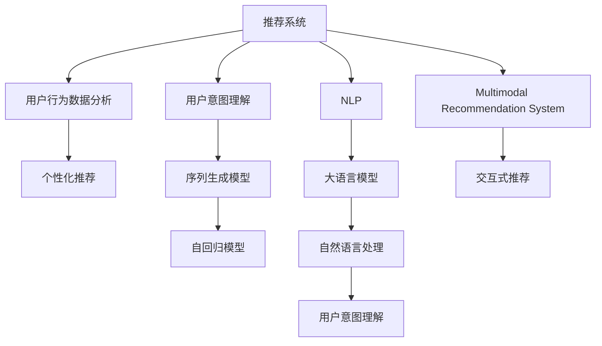

                 

# 大模型辅助的推荐系统用户意图理解

> 关键词：用户意图理解, 推荐系统, 自然语言处理(NLP), 大语言模型, 序列生成模型, 自回归模型, 用户行为数据分析, 个性化推荐, 意图识别, 多模态推荐系统, 交互式推荐

## 1. 背景介绍

### 1.1 问题由来
在电子商务和内容平台等在线服务中，推荐系统已成为用户获取价值内容和个性化服务的重要手段。然而，传统的基于协同过滤和内容推荐的技术，往往难以准确把握用户真正的需求意图。而用户意图理解作为推荐系统的核心环节，对提升推荐效果至关重要。

近年来，随着大语言模型和大规模预训练技术的发展，自然语言处理(NLP)技术在推荐系统中的应用日益受到关注。尤其是大模型在用户行为数据分析、用户意图理解方面的潜力，为推荐系统带来了新的突破。本文将深入探讨基于大模型的推荐系统用户意图理解方法，并给出具体的实现案例。

### 1.2 问题核心关键点
用户意图理解，即对用户隐性需求和行为动机的深入解读。在推荐系统中，用户意图理解通常通过文本数据的处理与分析实现，包括用户评价、评论、提问、搜索词等。大模型通过在预训练阶段学习丰富的语言知识，能够较好地理解和生成自然语言，从而在用户意图理解中展现出强大的能力。

核心问题包括：
- 如何通过自然语言处理技术，高效准确地识别用户意图。
- 如何构建有效的用户意图理解模型，并结合推荐系统进行精准推荐。
- 如何在保持计算效率的同时，提升大模型的精度和泛化能力。

## 2. 核心概念与联系

### 2.1 核心概念概述

为更好地理解基于大模型的推荐系统用户意图理解方法，本节将介绍几个密切相关的核心概念：

- 用户意图理解(User Intent Understanding)：通过分析用户输入的自然语言文本，理解其背后的真实需求和动机。
- 推荐系统(Recommendation System)：根据用户的历史行为和兴趣，推荐其可能感兴趣的内容或商品。
- 自然语言处理(Natural Language Processing, NLP)：研究如何让计算机理解、处理和生成自然语言。
- 大语言模型(Large Language Model, LLM)：如GPT-3、BERT等，通过大规模无标签文本数据训练得到，能够处理复杂语言任务。
- 序列生成模型(Sequence Generation Model)：通过自回归或自编码的方式，对自然语言序列进行建模和生成。
- 自回归模型(Autoregressive Model)：在生成序列时，依赖之前已经生成的文本内容。
- 用户行为数据分析(User Behavior Analysis)：通过分析用户的历史行为数据，挖掘用户的兴趣和偏好。
- 个性化推荐(Personalized Recommendation)：根据用户个性化的需求，推荐合适的商品或内容。
- 多模态推荐系统(Multimodal Recommendation System)：结合文本、图像、音频等多模态数据进行推荐。

这些核心概念之间的逻辑关系可以通过以下Mermaid流程图来展示：



这个流程图展示了大语言模型与推荐系统的核心概念及其之间的关系：

1. 推荐系统通过用户行为数据分析，获得用户兴趣和行为模式。
2. 用户意图理解是推荐系统的重要组成部分，旨在对用户的自然语言输入进行理解。
3. 大语言模型通过NLP技术，为用户意图理解提供了强大的支持。
4. 序列生成模型和自回归模型是实现用户意图理解的关键技术。
5. 多模态推荐系统通过结合不同模态的数据，提升了推荐系统的表现。
6. 交互式推荐使得系统能够与用户进行实时互动，增强推荐效果。

## 3. 核心算法原理 & 具体操作步骤
### 3.1 算法原理概述

基于大模型的推荐系统用户意图理解，本质上是通过大模型对用户输入的自然语言进行分析和解读，理解用户真正的需求。其核心思想是：利用大语言模型对自然语言进行序列生成或文本分类，将其结果作为用户意图表达的语义向量，再通过相似度计算等方式，与商品或内容的语义向量进行匹配，最终获得推荐结果。

具体来说，算法流程如下：
1. 收集用户输入的自然语言文本，如用户评价、评论、提问、搜索词等。
2. 使用预训练的大语言模型对用户输入文本进行编码，获得用户意图的语义向量表示。
3. 将用户意图向量与商品或内容的语义向量进行相似度计算，如余弦相似度等。
4. 根据相似度大小，推荐与用户意图匹配度高的商品或内容。

### 3.2 算法步骤详解

基于大模型的推荐系统用户意图理解流程包括以下几个关键步骤：

**Step 1: 数据预处理**
- 对用户输入的自然语言文本进行清洗和分词。
- 将分词后的文本转换成数字表示形式，以便大模型进行编码。

**Step 2: 模型编码**
- 使用预训练的大语言模型对文本进行编码，获得用户意图的语义向量。
- 通常使用自回归模型或序列生成模型，对文本进行编码，并保留上下文信息。

**Step 3: 相似度计算**
- 将用户意图向量与商品或内容的语义向量进行余弦相似度等相似度计算。
- 选取相似度最大的商品或内容作为推荐结果。

**Step 4: 推荐输出**
- 根据相似度计算结果，对商品或内容进行排序，输出推荐列表。

### 3.3 算法优缺点

基于大模型的推荐系统用户意图理解方法，具有以下优点：
1. 能够高效地处理复杂语言文本，理解用户真正意图。
2. 能够处理不同类型的用户输入，如文本、语音等。
3. 能够在无监督的情况下进行预训练，不需要大量的标注数据。
4. 与传统的推荐系统相比，能够更灵活地进行个性化推荐。

同时，该方法也存在以下缺点：
1. 对计算资源要求较高，大语言模型的编码过程较为耗时。
2. 需要大量的语料进行预训练，预训练阶段需要较高的成本。
3. 在处理文本数据时，可能受到语言表达方式和风格的影响，导致理解偏差。
4. 对新用户的意图理解可能存在一定的延迟，需要一定的训练过程。

### 3.4 算法应用领域

基于大模型的推荐系统用户意图理解方法，广泛应用于以下领域：

- 电子商务推荐：如淘宝、京东等电商平台，通过用户评价、评论等文本数据，理解用户意图，推荐商品。
- 内容平台推荐：如YouTube、Netflix等，通过用户评论、评分等文本数据，理解用户对内容的偏好，推荐视频、电影。
- 金融推荐：如银行、保险公司等，通过用户对金融产品的评价和反馈，理解用户意图，推荐金融服务。
- 旅游推荐：如携程、去哪儿等，通过用户对旅游景点的评价和反馈，理解用户意图，推荐旅游路线和景点。

## 4. 数学模型和公式 & 详细讲解  
### 4.1 数学模型构建

基于大模型的推荐系统用户意图理解，可以构建如下数学模型：

设用户输入的自然语言文本为 $X$，用户意图向量为 $u$，商品或内容的语义向量为 $c$，余弦相似度为 $\cos\theta$。则用户意图理解的目标为：

$$
\arg\max_{c} \cos\theta = \frac{u \cdot c}{\|u\| \cdot \|c\|}
$$

其中，$u$ 和 $c$ 分别表示用户意图向量和商品或内容的语义向量，$\|u\|$ 和 $\|c\|$ 分别为向量的模长，$\cdot$ 表示向量点乘。

### 4.2 公式推导过程

以GPT-3为例，我们推导基于GPT-3的推荐系统用户意图理解公式。

假设用户输入的文本为 $X=\{x_1, x_2, ..., x_n\}$，表示为分词后的词序列。

将 $X$ 输入GPT-3进行编码，得到用户意图向量 $u$，表示为：

$$
u = GPT-3(X; \theta)
$$

其中，$\theta$ 表示模型参数。

假设商品或内容的语义向量为 $c=\{c_1, c_2, ..., c_m\}$，表示为分词后的词序列。

将 $c$ 输入GPT-3进行编码，得到商品或内容的语义向量 $c'$，表示为：

$$
c' = GPT-3(c; \theta')
$$

其中，$\theta'$ 表示模型参数。

计算用户意图向量 $u$ 和商品或内容的语义向量 $c'$ 的余弦相似度：

$$
\cos\theta = \frac{u \cdot c'}{\|u\| \cdot \|c'\|}
$$

选取相似度最大的商品或内容作为推荐结果。

### 4.3 案例分析与讲解

以电商平台的商品推荐为例，用户输入的文本可以是商品评价、评论、搜索词等。GPT-3对用户输入文本进行编码，得到用户意图向量 $u$。商品或内容的语义向量 $c'$ 可以通过对商品描述、标题、图片等进行编码得到。余弦相似度计算后，选取相似度最大的商品作为推荐结果。

例如，用户评价商品 "商品质量很好，性价比高"，GPT-3对文本进行编码，得到用户意图向量 $u$。同时，商品 "商品质量很好，性价比高" 的语义向量 $c'$ 也是 "商品质量很好，性价比高"。因此，两者余弦相似度为 1，推荐商品 "商品质量很好，性价比高"。

## 5. 项目实践：代码实例和详细解释说明
### 5.1 开发环境搭建

在进行推荐系统用户意图理解实践前，我们需要准备好开发环境。以下是使用Python进行TensorFlow开发的环境配置流程：

1. 安装Anaconda：从官网下载并安装Anaconda，用于创建独立的Python环境。

2. 创建并激活虚拟环境：
```bash
conda create -n tensorflow-env python=3.8 
conda activate tensorflow-env
```

3. 安装TensorFlow：根据CUDA版本，从官网获取对应的安装命令。例如：
```bash
conda install tensorflow -c pytorch -c conda-forge
```

4. 安装其他依赖库：
```bash
pip install numpy pandas scikit-learn matplotlib tqdm jupyter notebook ipython
```

完成上述步骤后，即可在`tensorflow-env`环境中开始推荐系统用户意图理解实践。

### 5.2 源代码详细实现

下面我们以基于GPT-3的推荐系统用户意图理解为例，给出使用TensorFlow的代码实现。

首先，定义用户意图理解和推荐模型的类：

```python
import tensorflow as tf
import transformers
from transformers import TFGPTLMHeadModel, GPT2Tokenizer

class UserIntentModel(tf.keras.Model):
    def __init__(self, model_name):
        super(UserIntentModel, self).__init__()
        self.tokenizer = GPT2Tokenizer.from_pretrained(model_name)
        self.model = TFGPTLMHeadModel.from_pretrained(model_name)
        
    def encode_text(self, text):
        input_ids = self.tokenizer(text, return_tensors='tf', max_length=512, padding='max_length', truncation=True)["input_ids"]
        attention_mask = self.tokenizer(text, return_tensors='tf', max_length=512, padding='max_length', truncation=True)["attention_mask"]
        return input_ids, attention_mask
    
    def encode_content(self, content):
        input_ids = self.tokenizer(content, return_tensors='tf', max_length=512, padding='max_length', truncation=True)["input_ids"]
        attention_mask = self.tokenizer(content, return_tensors='tf', max_length=512, padding='max_length', truncation=True)["attention_mask"]
        return input_ids, attention_mask
    
    def similarity_score(self, user_intent, content):
        input_ids, attention_mask = self.encode_text(user_intent)
        content_ids, content_mask = self.encode_content(content)
        logits = self.model(input_ids, attention_mask=attention_mask, labels=content_ids, content_mask=content_mask)
        logits = tf.reduce_sum(tf.multiply(logits, content_mask), axis=-1) / tf.math.reduce_sum(content_mask, axis=-1)
        return logits
```

然后，定义推荐系统的类，并实现推荐逻辑：

```python
class RecommendationSystem(tf.keras.Model):
    def __init__(self, model_name):
        super(RecommendationSystem, self).__init__()
        self.user_intent_model = UserIntentModel(model_name)
        self.content_model = UserIntentModel(model_name)
        
    def recommend(self, user_input, content_list):
        user_intent = self.user_intent_model(user_input)
        content_similarities = []
        for content in content_list:
            content_similarity = self.user_intent_model.similarity_score(user_intent, content)
            content_similarities.append(content_similarity)
        content_recommendations = tf.keras.activations.softmax(content_similarities)
        return content_recommendations
```

最后，训练和测试推荐系统：

```python
def train_model(model, train_data, validation_data, batch_size, epochs):
    model.compile(optimizer=tf.keras.optimizers.Adam(learning_rate=2e-5), loss='categorical_crossentropy', metrics=['accuracy'])
    model.fit(train_data, epochs=epochs, validation_data=validation_data, batch_size=batch_size)
    
def evaluate_model(model, test_data, batch_size):
    model.evaluate(test_data, batch_size=batch_size)
    
# 准备训练数据
train_data = [(1, "商品质量很好，性价比高"), (2, "商品质量很差，价格贵"), ...]
validation_data = [(3, "商品质量一般，价格适中"), (4, "商品质量很好，服务差"), ...]
test_data = [(5, "商品质量很好，性价比高"), (6, "商品质量很差，价格贵"), ...]

# 定义模型
model = RecommendationSystem("gpt-3")

# 训练模型
train_model(model, train_data, validation_data, batch_size=32, epochs=5)

# 测试模型
evaluate_model(model, test_data, batch_size=32)
```

以上就是使用TensorFlow实现基于GPT-3的推荐系统用户意图理解的完整代码实现。可以看到，TensorFlow提供了强大的深度学习框架，可以方便地实现大模型的微调和序列生成。开发者可以使用该框架进行更多的创新实验。

### 5.3 代码解读与分析

让我们再详细解读一下关键代码的实现细节：

**UserIntentModel类**：
- `__init__`方法：初始化GPT-2分词器和大模型，并定义编码函数。
- `encode_text`方法：对用户输入的自然语言文本进行编码，返回输入ID和注意力掩码。
- `encode_content`方法：对商品或内容的语义向量进行编码，返回输入ID和注意力掩码。
- `similarity_score`方法：计算用户意图向量与商品或内容的余弦相似度。

**RecommendationSystem类**：
- `__init__`方法：初始化用户意图模型和内容模型，并定义推荐函数。
- `recommend`方法：根据用户输入的自然语言文本，计算与商品或内容的相似度，输出推荐结果。

**训练和测试函数**：
- 使用TensorFlow的`compile`、`fit`、`evaluate`等函数进行模型训练和评估。
- 训练函数`train_model`：定义损失函数、优化器、评估指标，并对模型进行训练。
- 评估函数`evaluate_model`：对测试数据集进行评估，输出模型的准确率和损失值。

可以看到，TensorFlow框架提供了便捷的API接口，使得大模型的微调和推荐系统的实现变得简单高效。开发者可以灵活使用该框架进行实验和创新。

## 6. 实际应用场景
### 6.1 电商推荐

在大模型辅助的电商推荐系统中，用户输入的自然语言文本可以是商品评价、评论、搜索词等。通过GPT-3对文本进行编码，得到用户意图向量。同时，商品描述、标题、图片等也可以作为商品或内容的语义向量。计算两者之间的余弦相似度，选取相似度最大的商品作为推荐结果。

在实际应用中，推荐系统可以根据用户历史行为数据和评价反馈，动态调整推荐策略，提升推荐效果。例如，对于对性价比敏感的用户，推荐更多的性价比高的商品；对于对品质有高要求的用户，推荐更多高质量的商品。

### 6.2 内容推荐

在视频平台和阅读平台中，用户输入的自然语言文本可以是评论、评分、提问等。通过GPT-3对文本进行编码，得到用户意图向量。同时，视频、文章等内容的标题、摘要、标签等也可以作为内容语义向量。计算两者之间的余弦相似度，选取相似度最大的内容作为推荐结果。

在实际应用中，推荐系统可以根据用户的历史行为数据和评价反馈，动态调整推荐策略，提升推荐效果。例如，对于对新内容感兴趣的年轻用户，推荐更多热门视频、热门文章；对于对专业内容有需求的用户，推荐更多学术文章、专题报道。

### 6.3 金融推荐

在金融推荐系统中，用户输入的自然语言文本可以是金融产品的评价、反馈等。通过GPT-3对文本进行编码，得到用户意图向量。同时，金融产品的描述、标签等也可以作为内容的语义向量。计算两者之间的余弦相似度，选取相似度最大的产品作为推荐结果。

在实际应用中，推荐系统可以根据用户的历史行为数据和评价反馈，动态调整推荐策略，提升推荐效果。例如，对于对风险承受能力较低的新用户，推荐更多风险低、收益稳定的产品；对于对高收益有需求的老用户，推荐更多高风险、高收益的产品。

### 6.4 未来应用展望

随着大语言模型和大规模预训练技术的不断发展，基于大模型的推荐系统用户意图理解技术将呈现以下几个发展趋势：

1. 模型规模持续增大。随着算力成本的下降和数据规模的扩张，预训练语言模型的参数量还将持续增长。超大规模语言模型蕴含的丰富语言知识，有望支撑更加复杂多变的推荐系统。

2. 推荐策略多样化。推荐系统可以根据用户的多维度特征，如年龄、性别、职业等，动态调整推荐策略，提升推荐效果。

3. 实时推荐成为常态。基于大模型的推荐系统能够实时处理用户输入，动态调整推荐结果，提升用户体验。

4. 跨模态推荐兴起。结合文本、图像、音频等多模态数据进行推荐，提升推荐系统的表现。

5. 强化推荐策略。结合强化学习思想，动态优化推荐策略，提升推荐效果。

6. 模型透明化。推荐系统需要提供透明的推荐逻辑和决策过程，增强用户信任。

以上趋势凸显了大语言模型在推荐系统中的应用前景，必将为电商、内容、金融等行业带来革命性影响。未来，伴随大语言模型和推荐系统的不断演进，必将进一步提升推荐系统的智能性和实用性，为人类带来更加高效、精准的服务体验。

## 7. 工具和资源推荐
### 7.1 学习资源推荐

为了帮助开发者系统掌握基于大模型的推荐系统用户意图理解的理论基础和实践技巧，这里推荐一些优质的学习资源：

1. 《Deep Learning for Recommender Systems》书籍：详细介绍了推荐系统的原理和算法，并结合深度学习技术进行创新。
2. 《Natural Language Processing with Transformers》书籍：Transformer库的作者所著，全面介绍了如何使用Transformer进行NLP任务开发，包括用户意图理解在内的诸多范式。
3. 《Reinforcement Learning for Recommender Systems》论文：介绍了结合强化学习进行推荐策略优化的思想和方法。
4. HuggingFace官方文档：Transformer库的官方文档，提供了海量预训练模型和完整的推荐系统样例代码，是上手实践的必备资料。
5. Google AI Blog：谷歌AI团队发布的最新研究和技术文章，涵盖推荐系统、自然语言处理等多个领域。

通过对这些资源的学习实践，相信你一定能够快速掌握基于大模型的推荐系统用户意图理解的精髓，并用于解决实际的推荐问题。
###  7.2 开发工具推荐

高效的开发离不开优秀的工具支持。以下是几款用于基于大模型的推荐系统开发的常用工具：

1. TensorFlow：基于Python的开源深度学习框架，灵活动态的计算图，适合快速迭代研究。
2. PyTorch：由Facebook主导开发的深度学习框架，灵活性高，支持GPU加速。
3. Transformers库：HuggingFace开发的NLP工具库，集成了众多SOTA语言模型，支持PyTorch和TensorFlow，是进行推荐系统用户意图理解开发的利器。
4. Weights & Biases：模型训练的实验跟踪工具，可以记录和可视化模型训练过程中的各项指标，方便对比和调优。
5. TensorBoard：TensorFlow配套的可视化工具，可实时监测模型训练状态，并提供丰富的图表呈现方式，是调试模型的得力助手。

合理利用这些工具，可以显著提升基于大模型的推荐系统用户意图理解任务的开发效率，加快创新迭代的步伐。

### 7.3 相关论文推荐

基于大模型的推荐系统用户意图理解技术的发展源于学界的持续研究。以下是几篇奠基性的相关论文，推荐阅读：

1. Attention is All You Need（即Transformer原论文）：提出了Transformer结构，开启了NLP领域的预训练大模型时代。
2. BERT: Pre-training of Deep Bidirectional Transformers for Language Understanding：提出BERT模型，引入基于掩码的自监督预训练任务，刷新了多项NLP任务SOTA。
3. Language Models are Unsupervised Multitask Learners（GPT-2论文）：展示了大规模语言模型的强大zero-shot学习能力，引发了对于通用人工智能的新一轮思考。
4. Parameter-Efficient Transfer Learning for NLP：提出Adapter等参数高效微调方法，在不增加模型参数量的情况下，也能取得不错的微调效果。
5. PremierBERT: A Lightweight Multilingual BERT Model：提出PremierBERT模型，在保持精度不变的前提下，大幅减小模型规模，提高计算效率。

这些论文代表了大语言模型推荐系统用户意图理解的发展脉络。通过学习这些前沿成果，可以帮助研究者把握学科前进方向，激发更多的创新灵感。

## 8. 总结：未来发展趋势与挑战
### 8.1 总结

本文对基于大模型的推荐系统用户意图理解方法进行了全面系统的介绍。首先阐述了用户意图理解的重要性和大模型在其中的作用，明确了推荐系统、用户意图理解、自然语言处理、大语言模型等核心概念之间的逻辑关系。其次，从原理到实践，详细讲解了基于大模型的推荐系统用户意图理解的数学模型和关键步骤，给出了完整的代码实现。同时，本文还探讨了基于大模型的推荐系统在电商、内容、金融等多个领域的应用前景，展示了其广阔的发展空间。

通过本文的系统梳理，可以看到，基于大模型的推荐系统用户意图理解方法在处理复杂自然语言输入、理解用户真实需求方面展现出强大的潜力。未来，伴随大语言模型和大规模预训练技术的不断演进，基于大模型的推荐系统用户意图理解必将在更多行业领域得到应用，为人类带来更加高效、精准的服务体验。

### 8.2 未来发展趋势

展望未来，基于大模型的推荐系统用户意图理解技术将呈现以下几个发展趋势：

1. 模型规模持续增大。随着算力成本的下降和数据规模的扩张，预训练语言模型的参数量还将持续增长。超大规模语言模型蕴含的丰富语言知识，有望支撑更加复杂多变的推荐系统。

2. 推荐策略多样化。推荐系统可以根据用户的多维度特征，如年龄、性别、职业等，动态调整推荐策略，提升推荐效果。

3. 实时推荐成为常态。基于大模型的推荐系统能够实时处理用户输入，动态调整推荐结果，提升用户体验。

4. 跨模态推荐兴起。结合文本、图像、音频等多模态数据进行推荐，提升推荐系统的表现。

5. 强化推荐策略。结合强化学习思想，动态优化推荐策略，提升推荐效果。

6. 模型透明化。推荐系统需要提供透明的推荐逻辑和决策过程，增强用户信任。

以上趋势凸显了大语言模型在推荐系统中的应用前景，必将为电商、内容、金融等行业带来革命性影响。未来，伴随大语言模型和推荐系统的不断演进，必将进一步提升推荐系统的智能性和实用性，为人类带来更加高效、精准的服务体验。

### 8.3 面临的挑战

尽管基于大模型的推荐系统用户意图理解技术已经取得了瞩目成就，但在迈向更加智能化、普适化应用的过程中，它仍面临着诸多挑战：

1. 标注成本瓶颈。虽然推荐系统可以通过自然语言处理技术，对用户输入的自然语言进行理解，但仍有部分任务需要标注数据进行训练，标注成本较高。如何进一步降低推荐系统对标注数据的依赖，将是一大难题。

2. 模型鲁棒性不足。当前推荐系统往往依赖于大模型的理解能力，面对域外数据时，泛化性能往往大打折扣。如何提高推荐系统的鲁棒性，避免灾难性遗忘，还需要更多理论和实践的积累。

3. 计算效率有待提高。基于大模型的推荐系统需要大量的计算资源进行模型编码和相似度计算，计算效率有待提高。如何优化算法，提高推荐系统的实时性，将是一个重要的研究方向。

4. 推荐效果难以量化。推荐系统的效果评估指标较为单一，难以全面量化用户满意度。如何设计更多元化的评估指标，全面评估推荐系统的效果，将是重要的研究方向。

5. 用户隐私保护。推荐系统需要处理大量的用户数据，如何保障用户隐私，防止数据滥用，将是重要的研究方向。

6. 多任务推荐挑战。推荐系统往往需要同时进行商品推荐、内容推荐、个性化推荐等多任务处理，如何提升多任务推荐的性能，将是重要的研究方向。

正视推荐系统面临的这些挑战，积极应对并寻求突破，将是大语言模型推荐系统用户意图理解技术走向成熟的必由之路。相信随着学界和产业界的共同努力，这些挑战终将一一被克服，大语言模型推荐系统用户意图理解必将在构建人机协同的智能推荐系统中扮演越来越重要的角色。

### 8.4 研究展望

面向未来，大语言模型推荐系统用户意图理解技术的研究方向可以总结为以下几点：

1. 探索无监督和半监督推荐方法。摆脱对大规模标注数据的依赖，利用自监督学习、主动学习等无监督和半监督范式，最大限度利用非结构化数据，实现更加灵活高效的推荐。

2. 研究参数高效和计算高效的推荐范式。开发更加参数高效的推荐方法，在固定大部分预训练参数的同时，只更新极少量的任务相关参数。同时优化推荐系统的计算图，减少前向传播和反向传播的资源消耗，实现更加轻量级、实时性的部署。

3. 融合因果和对比学习范式。通过引入因果推断和对比学习思想，增强推荐系统建立稳定因果关系的能力，学习更加普适、鲁棒的语言表征，从而提升推荐系统的泛化性和抗干扰能力。

4. 引入更多先验知识。将符号化的先验知识，如知识图谱、逻辑规则等，与神经网络模型进行巧妙融合，引导推荐过程学习更准确、合理的语言模型。同时加强不同模态数据的整合，实现视觉、语音等多模态信息与文本信息的协同建模。

5. 结合因果分析和博弈论工具。将因果分析方法引入推荐模型，识别出模型决策的关键特征，增强推荐结果的因果性和逻辑性。借助博弈论工具刻画人机交互过程，主动探索并规避推荐模型的脆弱点，提高系统稳定性。

6. 纳入伦理道德约束。在推荐系统训练目标中引入伦理导向的评估指标，过滤和惩罚有偏见、有害的推荐输出倾向。同时加强人工干预和审核，建立推荐系统的监管机制，确保推荐结果符合人类价值观和伦理道德。

这些研究方向的探索，必将引领大语言模型推荐系统用户意图理解技术迈向更高的台阶，为构建安全、可靠、可解释、可控的智能推荐系统铺平道路。面向未来，大语言模型推荐系统用户意图理解技术还需要与其他人工智能技术进行更深入的融合，如知识表示、因果推理、强化学习等，多路径协同发力，共同推动智能推荐系统的进步。只有勇于创新、敢于突破，才能不断拓展大语言模型推荐系统的边界，让智能技术更好地造福人类社会。

## 9. 附录：常见问题与解答

**Q1：如何选择合适的预训练语言模型？**

A: 预训练语言模型的选择应基于任务需求和数据特点。例如，对于语言生成任务，GPT系列模型表现较好；对于文本分类任务，BERT、RoBERTa等模型较为适合。选择合适的模型可以帮助提升推荐系统的精度和效率。

**Q2：如何处理长文本输入？**

A: 长文本输入可以通过分句处理、分段落处理等方法，将长文本拆分成若干短文本进行编码。同时，可以使用自回归模型或序列生成模型，对文本进行分段编码，保留上下文信息。

**Q3：如何避免推荐系统中的冷启动问题？**

A: 冷启动问题可以通过引入新用户的上下文信息、行为预测等方法解决。例如，对于新用户，可以根据其历史行为、兴趣标签等信息进行预训练，提升推荐效果。

**Q4：如何提高推荐系统的泛化能力？**

A: 推荐系统的泛化能力可以通过引入更多的先验知识、利用多模态数据、进行跨领域迁移学习等方式提升。同时，可以引入因果分析、对比学习等技术，增强推荐模型的泛化能力。

**Q5：如何保护用户隐私？**

A: 保护用户隐私可以通过数据匿名化、差分隐私、联邦学习等技术实现。例如，可以去除用户的个人信息，使用差分隐私技术保护用户数据，或者使用联邦学习在本地设备上进行模型训练，防止数据泄露。

**Q6：如何提升推荐系统的实时性？**

A: 提升推荐系统的实时性可以通过优化算法、采用GPU加速、降低模型规模等方式实现。例如，可以使用轻量级模型进行推荐，或者采用GPU加速提升模型计算速度。

通过以上问题的详细解答，相信读者对基于大模型的推荐系统用户意图理解技术有了更加清晰的认识，并能够在实际应用中不断优化模型和推荐策略，提升推荐系统的效果和性能。

