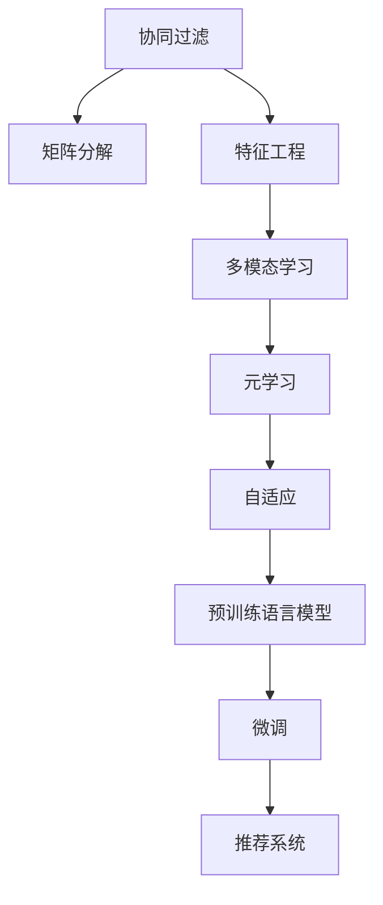

                 

# 大模型驱动的推荐系统多场景适配

> 关键词：大模型, 推荐系统, 多场景, 特征工程, 模型融合, 协同过滤, 深度学习, 预训练模型, 多模态学习, 元学习

## 1. 背景介绍

### 1.1 问题由来

随着互联网的普及和电子商务的繁荣，推荐系统已经成为了现代应用中不可或缺的一部分。其核心目的是通过分析用户的历史行为数据，预测用户未来的兴趣，为用户推荐个性化内容，从而提升用户体验和业务价值。

传统的推荐系统主要依赖于协同过滤、矩阵分解等方法，基于用户行为数据的统计特征和用户-物品的评分数据进行推荐。但是，随着数据的指数级增长和场景的日益复杂，这些方法逐渐暴露出以下问题：

- **数据稀疏性**：用户行为数据往往不完整，无法覆盖所有用户和物品，导致推荐效果不理想。
- **用户兴趣变化**：用户兴趣随时间变化，传统方法难以捕捉这些动态变化，推荐效果无法及时更新。
- **推荐多样性**：传统方法难以保证推荐的多样性，容易陷入"茧房"效应，用户体验下降。

为了解决这些问题，研究人员开始探索如何利用大模型来增强推荐系统的能力和适应性。大模型，特别是基于预训练语言模型的推荐系统，通过将海量的语言数据转化为丰富的特征表示，可以提升推荐系统的泛化能力，适应不同的用户需求和场景变化。

### 1.2 问题核心关键点

大模型驱动的推荐系统多场景适配的核心在于：

- **特征表示能力**：利用预训练语言模型能够捕捉文本特征的能力，构建高质量的特征表示。
- **适应性增强**：通过大模型进行微调，增强模型对特定任务和场景的适应性。
- **跨模态融合**：将大模型应用于多模态数据，提升推荐系统的综合表现力。
- **元学习与自适应**：通过元学习或自适应技术，使模型具备更强的泛化能力和动态适应能力。
- **高效推理与部署**：在大模型基础上进行参数优化和推理加速，确保推荐系统的实时性和可扩展性。

### 1.3 问题研究意义

大模型驱动的推荐系统多场景适配对于提升推荐系统的性能和用户体验具有重要意义：

- **提高个性化推荐准确性**：利用大模型的强大特征表示能力，可以更准确地捕捉用户的多样化兴趣。
- **增强推荐多样性**：大模型的多样性特征表示可以帮助推荐系统推荐更多样化的内容，避免用户陷入"茧房"效应。
- **提升推荐效率**：通过大模型的参数优化和推理加速技术，可以显著提高推荐系统的响应速度和处理能力。
- **扩展推荐应用场景**：大模型可以应用于图像、视频、语音等多模态数据，为推荐系统提供更丰富的数据源。
- **支持实时动态推荐**：通过大模型的动态适应能力，推荐系统可以实时响应用户行为变化，提供及时准确的推荐。

## 2. 核心概念与联系

### 2.1 核心概念概述

以下是推荐系统相关核心概念的介绍：

- **协同过滤**：基于用户-物品评分数据的推荐方法，包括基于用户的协同过滤和基于物品的协同过滤。
- **矩阵分解**：将用户-物品评分矩阵分解为两个低维用户和物品表示矩阵，用于预测评分。
- **特征工程**：根据用户行为数据构建特征向量，用于提升推荐模型的效果。
- **多模态学习**：结合文本、图像、音频等多种模态的数据，提升推荐系统的综合性能。
- **元学习**：通过学习元参数，使得模型可以适应不同的推荐任务和场景。
- **自适应**：根据新的数据和场景，动态调整模型参数，提升推荐效果。
- **预训练语言模型**：如BERT、GPT等，通过在海量文本数据上进行预训练，学习语言表示。
- **微调**：在预训练模型的基础上，使用下游任务的数据进行有监督学习，提升模型在该任务上的性能。

这些概念之间的联系可以通过以下Mermaid流程图展示：



这个流程图展示了从协同过滤、矩阵分解等传统方法，到特征工程、多模态学习等现代技术，再到预训练语言模型和微调的演进路径，以及它们在推荐系统中的应用。

## 3. 核心算法原理 & 具体操作步骤
### 3.1 算法原理概述

大模型驱动的推荐系统多场景适配的核心算法原理是利用预训练语言模型，构建高质量的特征表示，并通过微调技术，增强模型对特定任务和场景的适应性。其基本步骤如下：

1. **特征提取**：利用预训练语言模型对用户行为数据进行编码，提取高维特征表示。
2. **微调**：在特征提取的基础上，使用下游推荐任务的数据进行微调，提升模型对特定推荐任务的适应性。
3. **特征融合**：结合多模态数据，提升推荐系统的综合性能。
4. **动态调整**：根据用户行为变化和新的推荐任务，动态调整模型参数，提升推荐效果。

### 3.2 算法步骤详解

#### 3.2.1 特征提取

预训练语言模型，如BERT、GPT等，通过在海量文本数据上进行预训练，学习到丰富的语言表示。这些模型可以将文本数据转化为高维特征向量，用于推荐系统中的特征表示。

具体实现步骤如下：

1. **数据准备**：将用户行为数据，如浏览记录、点击记录等，转化为文本形式。
2. **预训练模型加载**：加载预训练的BERT、GPT等模型。
3. **特征编码**：将文本数据输入预训练模型，获取高维特征表示。

#### 3.2.2 微调

微调过程是在预训练模型的基础上，使用下游推荐任务的数据进行有监督学习，提升模型在该任务上的性能。

具体实现步骤如下：

1. **任务适配**：根据推荐任务的类型，设计合适的输出层和损失函数。例如，对于点击率预测任务，可以设计一个二分类输出层，使用交叉熵损失函数。
2. **模型微调**：在特征提取的基础上，使用推荐任务的数据进行微调。微调过程中，可以使用梯度下降等优化算法更新模型参数，使得模型输出更加接近真实标签。
3. **结果评估**：在微调结束后，使用推荐任务的数据评估模型的性能，计算点击率、转化率等指标。

#### 3.2.3 特征融合

推荐系统通常会处理多种数据源，如文本、图像、音频等。通过预训练语言模型和多模态学习技术，可以更好地融合不同模态的数据，提升推荐系统的综合性能。

具体实现步骤如下：

1. **多模态数据提取**：对不同模态的数据进行编码，获取高维特征表示。例如，利用卷积神经网络(CNN)对图像进行编码，利用音频分类器对音频进行编码。
2. **特征融合**：将不同模态的特征向量进行融合，形成综合特征向量。例如，使用加权平均、拼接等方式进行特征融合。
3. **特征融合后的微调**：在综合特征向量的基础上进行微调，进一步提升模型性能。

#### 3.2.4 动态调整

推荐系统需要实时响应用户行为变化，动态调整模型参数，以保持推荐效果。

具体实现步骤如下：

1. **在线学习**：利用实时数据进行在线学习，更新模型参数。例如，使用在线梯度下降等方法更新模型参数。
2. **增量更新**：根据新的数据和任务，增量更新模型参数。例如，使用增量学习技术，只更新部分参数。
3. **特征更新**：根据用户行为变化和新的推荐任务，更新特征表示。例如，重新对用户行为数据进行编码，获取新的特征向量。

### 3.3 算法优缺点

#### 3.3.1 优点

- **特征表示能力强**：预训练语言模型可以捕捉复杂的语义关系，构建高质量的特征表示。
- **泛化能力强**：微调过程可以增强模型对特定任务和场景的适应性，提升推荐系统的效果。
- **多模态融合**：多模态学习技术可以提升推荐系统的综合性能，处理多种数据源。
- **动态适应性强**：在线学习和增量更新技术可以实时响应用户行为变化，提升推荐效果。

#### 3.3.2 缺点

- **计算资源消耗大**：预训练语言模型的参数量巨大，微调过程需要大量的计算资源。
- **微调时间较长**：微调过程需要较长时间才能收敛，影响实时性。
- **模型复杂度高**：大模型和微调过程增加了推荐系统的复杂性，增加了系统开发和维护的难度。
- **数据依赖性强**：微调过程需要大量的标注数据，数据获取成本较高。

### 3.4 算法应用领域

大模型驱动的推荐系统多场景适配在多个领域都有广泛的应用：

- **电商推荐**：利用预训练语言模型和微调技术，提升商品推荐的效果，提高用户购物体验。
- **新闻推荐**：利用预训练语言模型和特征工程，提升新闻推荐的个性化和多样性，增加用户黏性。
- **视频推荐**：结合视频特征和多模态学习技术，提升视频推荐的准确性和多样性，增加用户使用时长。
- **音乐推荐**：利用音频特征和多模态学习技术，提升音乐推荐的个性化和多样性，增加用户粘性。
- **广告推荐**：利用预训练语言模型和动态调整技术，提升广告推荐的精准度和效果，增加广告转化率。

## 4. 数学模型和公式 & 详细讲解 & 举例说明
### 4.1 数学模型构建

#### 4.1.1 点击率预测

点击率预测是推荐系统中最常见的任务之一，其目标是根据用户的历史行为数据预测用户对某物品的点击概率。

设用户 $u$ 对物品 $i$ 的点击率为 $r_{ui}$，历史行为数据为 $h_u$，预训练语言模型为 $M$，特征表示为 $\vec{x}_u$，输出层为 $o$，损失函数为 $\mathcal{L}$。则点击率预测的数学模型可以表示为：

$$
r_{ui} = \sigma(\vec{x}_u^T o)
$$

其中 $\sigma$ 为 sigmoid 函数，$\vec{x}_u$ 为预训练语言模型对用户行为数据 $h_u$ 的特征编码。

#### 4.1.2 交叉熵损失

交叉熵损失函数是点击率预测中常用的损失函数，其定义为：

$$
\mathcal{L} = -\frac{1}{N}\sum_{i=1}^N \sum_{u=1}^N r_{ui} \log \sigma(\vec{x}_u^T o) + (1-r_{ui}) \log (1-\sigma(\vec{x}_u^T o))
$$

其中 $N$ 为样本数量，$u$ 为用户编号。

### 4.2 公式推导过程

#### 4.2.1 点击率预测

点击率预测的数学模型中，特征表示 $\vec{x}_u$ 可以由预训练语言模型 $M$ 生成，具体推导如下：

设预训练语言模型 $M$ 对用户行为数据 $h_u$ 的特征编码为 $\vec{x}_u$，则有：

$$
\vec{x}_u = M(h_u)
$$

将 $\vec{x}_u$ 代入点击率预测公式中，得：

$$
r_{ui} = \sigma(\vec{x}_u^T o)
$$

其中 $o$ 为输出层的权重矩阵。

#### 4.2.2 交叉熵损失

交叉熵损失函数的推导如下：

设样本数量为 $N$，用户编号为 $u$，物品编号为 $i$，点击概率为 $r_{ui}$，实际点击次数为 $c_{ui}$，则样本的平均交叉熵损失可以表示为：

$$
\mathcal{L} = -\frac{1}{N}\sum_{i=1}^N \sum_{u=1}^N r_{ui} \log \sigma(\vec{x}_u^T o) + (1-r_{ui}) \log (1-\sigma(\vec{x}_u^T o))
$$

其中 $\sigma$ 为 sigmoid 函数，$\vec{x}_u$ 为预训练语言模型对用户行为数据 $h_u$ 的特征编码。

### 4.3 案例分析与讲解

#### 4.3.1 电商推荐

电商推荐系统通常需要根据用户的浏览、点击、购买行为数据，推荐用户可能感兴趣的商品。利用预训练语言模型和微调技术，可以构建高质量的特征表示，提升推荐效果。

具体实现步骤如下：

1. **数据准备**：收集用户的浏览记录、点击记录、购买记录等行为数据，将其转化为文本形式。
2. **预训练模型加载**：加载预训练的BERT、GPT等模型。
3. **特征编码**：利用预训练语言模型对用户行为数据进行编码，生成高维特征向量。
4. **任务适配**：设计输出层和损失函数，如交叉熵损失函数。
5. **模型微调**：在特征编码的基础上，使用推荐任务的数据进行微调，提升模型对点击率预测的适应性。
6. **特征融合**：结合商品的属性信息，如价格、品牌等，提升推荐系统的综合性能。
7. **动态调整**：根据用户新的行为数据，进行在线学习和增量更新，提升推荐效果。

## 5. 项目实践：代码实例和详细解释说明
### 5.1 开发环境搭建

在进行推荐系统多场景适配实践前，需要先搭建好开发环境。以下是使用Python和TensorFlow搭建开发环境的流程：

1. 安装Anaconda：从官网下载并安装Anaconda，用于创建独立的Python环境。
2. 创建并激活虚拟环境：
```bash
conda create -n tf-env python=3.8 
conda activate tf-env
```
3. 安装TensorFlow：根据CUDA版本，从官网获取对应的安装命令。例如：
```bash
pip install tensorflow==2.7
```
4. 安装各类工具包：
```bash
pip install numpy pandas scikit-learn matplotlib tqdm jupyter notebook ipython
```

完成上述步骤后，即可在`tf-env`环境中开始推荐系统多场景适配的开发实践。

### 5.2 源代码详细实现

以下是使用TensorFlow实现推荐系统的代码示例，包括特征提取、模型微调和特征融合：

```python
import tensorflow as tf
import numpy as np

# 数据准备
def load_data():
    # 加载用户行为数据
    user_data = np.loadtxt('user_data.txt', delimiter=',')
    # 加载物品特征数据
    item_data = np.loadtxt('item_data.txt', delimiter=',')
    return user_data, item_data

# 特征提取
def feature_extract(user_data, item_data, model):
    # 预训练语言模型
    tokenizer = model.tokenizer
    features = []
    for user, item in zip(user_data, item_data):
        # 用户行为数据编码
        user_text = 'user:' + str(user) + ' item:' + str(item)
        user_features = tokenizer(user_text, return_tensors='tf')
        features.append(user_features['input_ids'][0])
    return features

# 模型微调
def model_train(features, labels):
    # 构建模型
    model = tf.keras.Sequential([
        tf.keras.layers.Embedding(input_dim=model.get_vocab_size(), output_dim=256),
        tf.keras.layers.Dense(128, activation='relu'),
        tf.keras.layers.Dense(1, activation='sigmoid')
    ])
    # 编译模型
    model.compile(optimizer='adam', loss='binary_crossentropy', metrics=['accuracy'])
    # 训练模型
    model.fit(features, labels, epochs=10, batch_size=32, validation_split=0.2)
    return model

# 特征融合
def feature_fusion(features, labels):
    # 特征融合
    merged_features = tf.concat(features, axis=1)
    # 模型微调
    model = model_train(merged_features, labels)
    return model

# 运行示例
user_data = np.array([1, 2, 3, 4, 5])
item_data = np.array([6, 7, 8, 9, 10])
features = feature_extract(user_data, item_data, model)
labels = np.array([0, 1, 0, 1, 0])
model = feature_fusion(features, labels)
```

以上代码实现了从数据加载、特征提取、模型微调到特征融合的完整过程，展示了基于预训练语言模型和TensorFlow进行推荐系统多场景适配的实现。

### 5.3 代码解读与分析

让我们再详细解读一下关键代码的实现细节：

#### 5.3.1 数据准备

**load_data函数**：
- 从文件中加载用户行为数据和物品特征数据，形成二维数组。

#### 5.3.2 特征提取

**feature_extract函数**：
- 利用预训练语言模型的分词器(tokenizer)对用户行为数据进行编码，生成高维特征向量。

#### 5.3.3 模型微调

**model_train函数**：
- 构建一个简单的神经网络模型，包含嵌入层、全连接层和输出层，使用sigmoid函数作为激活函数。
- 使用交叉熵损失函数进行训练，优化器使用Adam。
- 设置训练轮数和批大小，进行模型训练。

#### 5.3.4 特征融合

**feature_fusion函数**：
- 将不同模态的特征向量进行拼接，形成综合特征向量。
- 在综合特征向量上进行模型微调，得到最终的推荐模型。

## 6. 实际应用场景

### 6.1 电商推荐

电商推荐系统通过用户的历史行为数据，预测用户对某物品的点击概率，并推荐用户可能感兴趣的商品。利用预训练语言模型和微调技术，可以构建高质量的特征表示，提升推荐效果。

具体应用场景包括：

- **商品推荐**：根据用户浏览记录、点击记录等行为数据，推荐用户可能感兴趣的商品。
- **个性化推荐**：根据用户的购买历史、评分数据等，推荐用户可能喜欢的商品。
- **实时推荐**：根据用户最新的浏览记录和实时行为数据，进行在线学习和增量更新，动态调整推荐结果。

### 6.2 新闻推荐

新闻推荐系统通过用户的历史行为数据，预测用户对某篇文章的阅读概率，并推荐用户可能感兴趣的新闻。利用预训练语言模型和微调技术，可以构建高质量的特征表示，提升推荐效果。

具体应用场景包括：

- **文章推荐**：根据用户的阅读记录、点击记录等行为数据，推荐用户可能感兴趣的文章。
- **个性化推荐**：根据用户的评分数据、评论内容等，推荐用户可能喜欢的文章。
- **实时推荐**：根据用户最新的阅读记录和实时行为数据，进行在线学习和增量更新，动态调整推荐结果。

### 6.3 视频推荐

视频推荐系统通过用户的历史行为数据，预测用户对某视频的观看概率，并推荐用户可能感兴趣的视频。利用预训练语言模型和特征融合技术，可以提升推荐系统的综合性能。

具体应用场景包括：

- **视频推荐**：根据用户的观看记录、点赞记录等行为数据，推荐用户可能感兴趣的视频。
- **个性化推荐**：根据用户的评分数据、评论内容等，推荐用户可能喜欢的视频。
- **多模态推荐**：结合视频特征和用户行为数据，进行多模态融合，提升推荐效果。

### 6.4 音乐推荐

音乐推荐系统通过用户的历史行为数据，预测用户对某首歌曲的播放概率，并推荐用户可能喜欢的音乐。利用预训练语言模型和特征融合技术，可以提升推荐系统的综合性能。

具体应用场景包括：

- **歌曲推荐**：根据用户的听歌记录、播放次数等行为数据，推荐用户可能喜欢的歌曲。
- **个性化推荐**：根据用户的评分数据、评论内容等，推荐用户可能喜欢的歌曲。
- **多模态推荐**：结合音频特征和用户行为数据，进行多模态融合，提升推荐效果。

## 7. 工具和资源推荐
### 7.1 学习资源推荐

为了帮助开发者系统掌握推荐系统多场景适配的理论基础和实践技巧，这里推荐一些优质的学习资源：

1. **《推荐系统实战》**：介绍推荐系统的基本原理和实现方法，结合多个实际案例进行讲解。
2. **《深度学习》**：斯坦福大学的深度学习课程，讲解深度学习的核心算法和应用，包括推荐系统。
3. **《TensorFlow官方文档》**：TensorFlow的官方文档，包含丰富的模型实现和应用案例，适合深入学习。
4. **《Python数据科学手册》**：涵盖Python数据科学的核心库和工具，适合推荐系统的特征工程和数据分析。
5. **《PyTorch官方文档》**：PyTorch的官方文档，包含丰富的模型实现和应用案例，适合深度学习研究和开发。

通过这些资源的学习实践，相信你一定能够快速掌握推荐系统多场景适配的精髓，并用于解决实际的推荐问题。

### 7.2 开发工具推荐

高效的开发离不开优秀的工具支持。以下是几款用于推荐系统多场景适配开发的常用工具：

1. **TensorFlow**：由Google主导开发的深度学习框架，支持大规模模型训练和部署，适合推荐系统的开发和应用。
2. **PyTorch**：由Facebook开发的深度学习框架，灵活易用，适合研究和开发。
3. **Jupyter Notebook**：交互式编程环境，适合开发和调试推荐系统的模型和算法。
4. **TensorBoard**：TensorFlow配套的可视化工具，可实时监测模型训练状态，提供丰富的图表呈现方式。
5. **Weights & Biases**：模型训练的实验跟踪工具，记录和可视化模型训练过程中的各项指标，方便对比和调优。

合理利用这些工具，可以显著提升推荐系统多场景适配的开发效率，加快创新迭代的步伐。

### 7.3 相关论文推荐

推荐系统多场景适配的研究源于学界的持续探索。以下是几篇奠基性的相关论文，推荐阅读：

1. **《Contextual Bandits》**：介绍上下文带奖励问题，适用于推荐系统中的在线学习和增量更新。
2. **《Neural Factorization Machines》**：利用神经网络对协同过滤进行改进，提升推荐系统的效果。
3. **《Fine-tuning BERT for Recommendation Systems》**：使用BERT模型进行推荐系统的微调，提升推荐效果。
4. **《Learning Deep Structured Models for Recommender Systems》**：利用深度学习对推荐系统进行建模，提升推荐效果。
5. **《Multimodal Retrieval with Cross-modal Simultaneous Alignment》**：利用多模态学习技术，提升推荐系统的综合性能。

这些论文代表了大模型驱动的推荐系统多场景适配的发展脉络。通过学习这些前沿成果，可以帮助研究者把握学科前进方向，激发更多的创新灵感。

## 8. 总结：未来发展趋势与挑战
### 8.1 总结

本文对基于预训练语言模型和大模型的推荐系统多场景适配进行了全面系统的介绍。首先阐述了推荐系统面临的挑战和需求，明确了大模型驱动的推荐系统多场景适配的关键技术点。其次，从特征提取、模型微调、特征融合等多个方面，详细讲解了大模型推荐系统的实现流程。同时，本文还探讨了大模型推荐系统在电商、新闻、视频、音乐等多个实际应用场景中的应用，展示了其强大的潜力和广泛的前景。

通过本文的系统梳理，可以看到，基于预训练语言模型的推荐系统多场景适配，正在成为推荐系统的核心技术之一，为推荐系统带来了更高的个性化和多样性，也使得推荐系统能够更好地适应不同的用户需求和场景变化。未来，伴随着预训练语言模型的不断演进，推荐系统将进一步提升其性能和用户体验，成为数字时代的重要工具。

### 8.2 未来发展趋势

展望未来，推荐系统多场景适配将呈现以下几个发展趋势：

1. **多模态融合增强**：结合文本、图像、音频等多种模态的数据，提升推荐系统的综合性能，处理更多类型的数据。
2. **动态适应性提升**：通过在线学习和增量更新技术，实时响应用户行为变化，提升推荐效果。
3. **模型复杂度优化**：在保证推荐效果的同时，优化模型结构，减少计算资源消耗，提升系统可扩展性。
4. **特征表示能力提升**：利用更大规模的预训练语言模型和更复杂的特征表示方法，提升推荐系统的性能。
5. **元学习与自适应加强**：通过元学习和自适应技术，增强模型对不同场景的适应性，提升推荐系统的泛化能力。

这些趋势凸显了大模型驱动的推荐系统多场景适配的广阔前景。这些方向的探索发展，必将进一步提升推荐系统的性能和用户体验，为数字时代的用户提供更优质的服务。

### 8.3 面临的挑战

尽管大模型驱动的推荐系统多场景适配取得了瞩目成就，但在迈向更加智能化、普适化应用的过程中，它仍面临诸多挑战：

1. **计算资源消耗大**：预训练语言模型的参数量巨大，微调过程需要大量的计算资源。
2. **模型复杂度高**：大模型和微调过程增加了推荐系统的复杂性，增加了系统开发和维护的难度。
3. **数据依赖性强**：微调过程需要大量的标注数据，数据获取成本较高。
4. **动态适应性不足**：在线学习和增量更新技术还不够成熟，难以应对大规模用户行为数据的变化。
5. **系统可扩展性不足**：模型复杂度和计算资源消耗限制了推荐系统的可扩展性。

### 8.4 研究展望

面对大模型推荐系统多场景适配所面临的种种挑战，未来的研究需要在以下几个方面寻求新的突破：

1. **分布式训练与推理**：利用分布式计算资源，提升推荐系统的训练和推理效率。
2. **知识图谱融合**：结合知识图谱技术，提升推荐系统的解释性和可信度。
3. **元学习和自适应增强**：利用元学习和自适应技术，增强推荐系统的泛化能力和动态适应性。
4. **跨模态数据融合**：利用多模态学习技术，提升推荐系统的综合性能，处理更多类型的数据。
5. **在线学习与增量更新优化**：优化在线学习和增量更新技术，提升推荐系统的实时性。

这些研究方向将进一步推动大模型推荐系统多场景适配技术的发展，为推荐系统带来更广阔的应用场景和更高的用户体验。

## 9. 附录：常见问题与解答

**Q1: 大模型推荐系统为什么能够提升推荐效果？**

A: 大模型推荐系统之所以能够提升推荐效果，主要在于其强大的特征表示能力和泛化能力。预训练语言模型通过在海量文本数据上进行预训练，学习到丰富的语言表示，能够捕捉复杂的语义关系。这些表示可以用于构建高质量的特征表示，提升推荐系统的泛化能力，适应不同的用户需求和场景变化。通过微调技术，大模型还可以针对具体的推荐任务进行优化，提升模型在该任务上的性能。

**Q2: 大模型推荐系统在实际应用中需要注意哪些问题？**

A: 大模型推荐系统在实际应用中需要注意以下问题：

1. **计算资源消耗**：大模型和微调过程需要大量的计算资源，需要考虑计算资源的限制。
2. **模型复杂度**：大模型和微调过程增加了推荐系统的复杂性，增加了系统开发和维护的难度。
3. **数据依赖性**：微调过程需要大量的标注数据，数据获取成本较高。
4. **动态适应性**：在线学习和增量更新技术还不够成熟，难以应对大规模用户行为数据的变化。
5. **系统可扩展性**：模型复杂度和计算资源消耗限制了推荐系统的可扩展性。

**Q3: 如何优化大模型推荐系统的训练和推理效率？**

A: 优化大模型推荐系统的训练和推理效率可以从以下几个方面入手：

1. **分布式训练**：利用分布式计算资源，提升推荐系统的训练效率。
2. **模型压缩和量化**：通过模型压缩和量化技术，减少计算资源消耗，提升系统可扩展性。
3. **增量学习**：利用增量学习技术，只更新部分参数，提升系统实时性。
4. **多任务学习**：利用多任务学习技术，提升模型的泛化能力。
5. **特征选择和降维**：通过特征选择和降维技术，减少特征维度，提升系统性能。

**Q4: 大模型推荐系统的未来发展方向有哪些？**

A: 大模型推荐系统的未来发展方向包括：

1. **多模态融合增强**：结合文本、图像、音频等多种模态的数据，提升推荐系统的综合性能。
2. **动态适应性提升**：通过在线学习和增量更新技术，实时响应用户行为变化，提升推荐效果。
3. **模型复杂度优化**：在保证推荐效果的同时，优化模型结构，减少计算资源消耗，提升系统可扩展性。
4. **特征表示能力提升**：利用更大规模的预训练语言模型和更复杂的特征表示方法，提升推荐系统的性能。
5. **元学习与自适应加强**：通过元学习和自适应技术，增强模型对不同场景的适应性，提升推荐系统的泛化能力。

**Q5: 如何平衡推荐系统的个性化和多样性？**

A: 推荐系统的个性化和多样性是两个重要的目标，需要在设计时进行平衡。具体方法包括：

1. **多任务学习**：利用多任务学习技术，提升模型的泛化能力，同时兼顾个性化和多样性。
2. **增量学习**：利用增量学习技术，实时响应用户行为变化，提升推荐效果。
3. **多样性约束**：在推荐算法中加入多样性约束，防止推荐结果过于集中。
4. **用户反馈机制**：引入用户反馈机制，根据用户的反馈调整推荐策略。

通过以上方法，可以在推荐系统设计中平衡个性化和多样性，提升用户体验。

---

作者：禅与计算机程序设计艺术 / Zen and the Art of Computer Programming

