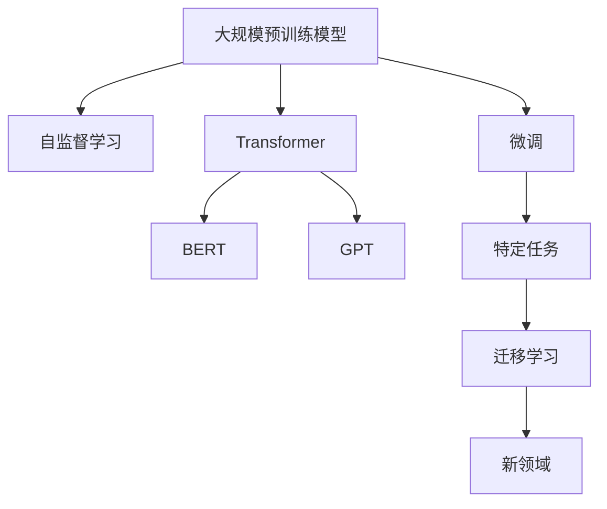

                 

# 大规模预训练模型：GPT、BERT及其变体

> 关键词：大规模预训练模型, GPT, BERT, 自监督学习, 自然语言处理(NLP), 深度学习, Transformers, 微调

## 1. 背景介绍

### 1.1 问题由来
随着深度学习技术在人工智能领域的飞速发展，大规模预训练模型（Large Pre-trained Models, LPMs）成为了推动自然语言处理（Natural Language Processing, NLP）及其他相关领域进步的重要引擎。这些模型通常以自监督学习任务为训练目标，通过在海量无标签文本数据上进行的预训练，获得了强大的语言表示能力，并在下游任务上通过微调进行适应和优化。

近年来，此类模型已经从最初的基于神经网络的线性模型演进为基于深度学习的Transformer模型。其代表性模型包括Google的BERT（Bidirectional Encoder Representations from Transformers）和OpenAI的GPT（Generative Pre-trained Transformer）系列。这些模型在多种NLP任务上展示了惊人的性能，逐渐成为NLP研究与应用的焦点。

### 1.2 问题核心关键点
大规模预训练模型成功的关键在于其庞大的语料规模和高效的自监督学习框架。通过在这些模型上进行预训练，它们可以自动学习到语言中的语法规则、词汇义意以及上下文关系等复杂信息，从而在微调阶段迅速适应并提升下游任务的表现。

然而，大规模预训练模型的训练过程非常消耗计算资源，且模型参数众多，导致其在实时应用中的推理速度和内存占用也成为挑战。此外，尽管这些模型在特定任务上的表现优异，但其在未知领域或新数据上的泛化能力仍有待提升。

### 1.3 问题研究意义
研究大规模预训练模型及其变体，不仅有助于理解其在自然语言处理任务中的原理和应用，还能为模型设计和优化提供理论依据和实际操作指南。更重要的是，通过对这些模型的不断探索和优化，可以实现人工智能技术在更多实际场景中的落地应用，提升生产效率和生活质量。

本文将系统地介绍GPT和BERT等大规模预训练模型的核心概念、算法原理、操作步骤及其实际应用场景，并展望未来发展趋势和面临的挑战，旨在为相关研究人员和从业者提供全面的技术指导。

## 2. 核心概念与联系

### 2.1 核心概念概述

为更好地理解大规模预训练模型的原理和应用，本节将介绍几个核心概念：

- **大规模预训练模型(Large Pre-trained Models, LPMs)**：以Transformer为架构，在大量无标签文本数据上进行预训练，以学习语言的通用表示，具备强大的语言理解和生成能力。
- **自监督学习(Self-supervised Learning)**：利用无标签数据进行训练，通过预测数据自身的信息（如文本中的掩码单词、句子关系等）来获取模型对语言结构的理解。
- **Transformer**：一种基于注意力机制的深度学习模型，相较于传统的RNN和CNN，在处理长距离依赖关系上具有优势。
- **BERT**：一种基于Transformer的预训练模型，通过在双向上下文窗口上进行掩码语言模型和下一句预测任务进行预训练，获取丰富的语言表示。
- **GPT**：一种基于Transformer的预训练模型，专注于生成任务的预训练，通过语言模型任务进行训练，提升生成自然语言的流畅性和创造力。
- **微调(Fine-tuning)**：在大规模预训练模型上进行有监督学习，以适应特定任务的需求。
- **迁移学习(Transfer Learning)**：将在一个领域学习到的知识迁移到另一个领域的应用。

这些概念之间的关系可以通过以下Mermaid流程图来展示：



这个流程图展示了预训练模型通过自监督学习获取语言表示，并通过微调和迁移学习适应特定任务的过程。

## 3. 核心算法原理 & 具体操作步骤
### 3.1 算法原理概述

大规模预训练模型通过自监督学习任务进行训练，通常分为预训练和微调两个阶段。预训练阶段，模型在大量无标签数据上通过自监督任务（如掩码语言模型、下一句预测等）进行训练，学习语言的表示。微调阶段，将预训练模型应用于特定任务，通过有监督数据对其进行优化。

以BERT为例，其在预训练阶段使用了两种自监督学习任务：掩码语言模型和下一句预测任务。掩码语言模型在输入序列中随机掩盖一些单词，让模型预测这些单词，从而学习上下文关系。下一句预测任务则要求模型预测两个句子之间是否是相邻的，从而学习句子之间的关系。

### 3.2 算法步骤详解

预训练过程可以分为以下几个关键步骤：

1. **数据准备**：收集大规模无标签文本数据，例如维基百科、新闻文章等。
2. **模型初始化**：选择一个初始模型结构（如BERT的12层Transformer），并随机初始化参数。
3. **自监督学习**：使用上述两个自监督任务对模型进行训练，训练过程中不使用标签，只让模型自我预测。
4. **参数更新**：通过反向传播和梯度下降算法更新模型参数，优化损失函数。

微调过程大致如下：

1. **任务适配层添加**：根据下游任务类型，添加相应的输出层和损失函数，如分类任务使用线性分类器和交叉熵损失函数。
2. **数据准备**：收集下游任务的标注数据集。
3. **模型加载和微调**：加载预训练模型，使用下游任务的数据集进行微调，优化特定任务的表现。
4. **超参数设置**：选择合适的学习率、批大小、迭代轮数等。
5. **模型评估和优化**：在验证集上评估模型性能，调整超参数以优化模型表现。

### 3.3 算法优缺点

大规模预训练模型具有以下优点：

1. **高效的表示学习**：通过预训练学习到语言的基础表示，后续微调可以在少量数据上快速提升性能。
2. **广泛的应用场景**：适用于多种NLP任务，如文本分类、问答、生成等。
3. **算法简单**：相较于传统的基于规则的NLP方法，大规模预训练模型算法简单，易于实现。

同时，大规模预训练模型也存在一些缺点：

1. **计算资源消耗大**：模型训练和微调过程需要巨大的计算资源。
2. **模型可解释性差**：复杂模型往往难以解释其决策过程。
3. **知识迁移能力有限**：在大规模预训练模型上的微调效果受数据分布影响较大。
4. **泛化能力不足**：在特定领域或新任务上的泛化能力有待提升。

### 3.4 算法应用领域

大规模预训练模型已在NLP领域得到了广泛应用，覆盖了几乎所有常见任务，包括：

- **文本分类**：如情感分析、主题分类、意图识别等。
- **命名实体识别**：识别文本中的人名、地名、机构名等特定实体。
- **关系抽取**：从文本中抽取实体之间的语义关系。
- **问答系统**：对自然语言问题给出答案。
- **机器翻译**：将源语言文本翻译成目标语言。
- **文本摘要**：将长文本压缩成简短摘要。
- **对话系统**：使机器能够与人自然对话。

此外，大规模预训练模型还被创新性地应用于代码生成、文本生成、数据增强等方向，推动了NLP技术的发展和应用。

## 4. 数学模型和公式 & 详细讲解 & 举例说明

### 4.1 数学模型构建

以BERT为例，其数学模型主要包括以下几个部分：

- **输入嵌入层**：将输入的单词转换为向量表示。
- **位置嵌入层**：为每个位置添加位置信息，帮助模型理解词语的顺序。
- **Transformer层**：通过自注意力机制学习上下文信息。
- **线性层和softmax层**：将Transformer层的输出转换为类别概率。

### 4.2 公式推导过程

以BERT的掩码语言模型为例，推导其损失函数的计算过程。

设输入序列为$X = \{x_1, x_2, ..., x_L\}$，其中$L$为序列长度。掩码语言模型的目标是在$X$中选择$M$个位置进行掩码，然后让模型预测这些位置上的单词。

设掩码位置为$P = \{p_1, p_2, ..., p_M\}$，则掩码语言模型的损失函数可以表示为：

$$
L_{MLM} = -\frac{1}{N}\sum_{i=1}^{N}\sum_{p \in P}\sum_{k \in V}y_k\log\hat{y}_{pk}
$$

其中$N$为训练样本数量，$V$为词汇表大小，$y_k$为真实标签，$\hat{y}_{pk}$为模型预测的概率。

### 4.3 案例分析与讲解

以BERT在新闻分类任务中的应用为例，说明其预训练和微调过程。

- **预训练过程**：使用大规模无标签新闻数据集，训练BERT模型，通过掩码语言模型和下一句预测任务进行预训练。
- **微调过程**：收集新闻分类任务的数据集，添加新闻分类任务的适配层（如线性分类器），使用微调后的BERT模型进行训练，优化模型在新闻分类任务上的性能。

## 5. 项目实践：代码实例和详细解释说明

### 5.1 开发环境搭建

在进行模型训练和微调前，需要配置好开发环境。以下是使用Python进行TensorFlow和TensorFlow Addons开发的开发环境配置流程：

1. **安装Anaconda**：从官网下载并安装Anaconda，用于创建独立的Python环境。
2. **创建并激活虚拟环境**：
```bash
conda create -n tf-env python=3.8
conda activate tf-env
```
3. **安装TensorFlow和相关依赖**：
```bash
pip install tensorflow tensorboard tensorflow-addons
```

### 5.2 源代码详细实现

下面以BERT模型在新闻分类任务上的微调为例，给出使用TensorFlow Addons和TensorFlow进行BERT微调的代码实现。

```python
from transformers import BertTokenizer, TFBertForSequenceClassification
from tensorflow import keras
from tensorflow_addons.layers import LayerNorm, LayerDrop

# 数据预处理
tokenizer = BertTokenizer.from_pretrained('bert-base-uncased')
train_data = ...
dev_data = ...
test_data = ...

# 模型初始化
model = TFBertForSequenceClassification.from_pretrained('bert-base-uncased', num_labels=num_labels)
model = keras.Model(inputs=model.inputs, outputs=model outputs)
model.summary()

# 数据增强
def data_augmentation(tokenized_text):
    ...
    return tokenized_input, segment_ids, attention_mask

# 训练和评估
optimizer = tf.keras.optimizers.Adam(learning_rate=learning_rate)
loss_fn = tf.keras.losses.SparseCategoricalCrossentropy(from_logits=True)
metric = tf.keras.metrics.SparseCategoricalAccuracy()

train_dataset = ...
val_dataset = ...

train_loss = model.train_on_batch(x_train, y_train)
val_loss = model.evaluate(x_val, y_val, verbose=2)
print('Validation loss: {:.2f} {}'.format(val_loss, val_metric))

# 模型保存和部署
checkpoint_dir = os.path.join(model_output_dir, "checkpoint")
checkpoint_prefix = os.path.join(checkpoint_dir, "ckpt")
checkpoint_callback = tf.keras.callbacks.ModelCheckpoint(checkpoint_prefix, save_weights_only=True, verbose=1)

# 启动训练和评估
model.fit(train_dataset, epochs=epochs, validation_data=val_dataset, callbacks=[checkpoint_callback])
```

### 5.3 代码解读与分析

这段代码实现了BERT模型在新闻分类任务上的微调过程。具体解释如下：

- **数据预处理**：使用BertTokenizer进行数据分词和编码，将文本转换为模型可以理解的格式。
- **模型初始化**：使用TFBertForSequenceClassification模型，指定输出层的类别数。
- **数据增强**：使用自定义的函数对训练数据进行增强，增加模型的泛化能力。
- **训练和评估**：使用Adam优化器和SparseCategoricalCrossentropy损失函数进行模型训练，并使用SparseCategoricalAccuracy评估模型性能。
- **模型保存和部署**：在训练过程中保存模型权重，以便后续使用和部署。

## 6. 实际应用场景

### 6.1 智能客服系统

智能客服系统是NLP技术的重要应用之一。通过预训练和微调BERT模型，可以为智能客服系统提供强大的文本理解能力，快速响应用户查询，提供个性化和高质量的客服服务。

在实际应用中，可以通过收集用户的聊天记录和常见问题，对模型进行微调。微调后的模型能够理解用户的意图，提供准确的答案和解决方案，从而提升用户满意度。

### 6.2 金融舆情监测

金融机构需要实时监控市场舆情，以避免因负面信息传播导致的风险。使用BERT等预训练模型进行微调，可以自动识别和分析新闻、评论等文本数据，快速捕捉市场动向，提供决策支持。

通过微调，模型能够识别出正负面情感和特定主题，及时预警潜在风险，帮助金融机构做出更明智的决策。

### 6.3 个性化推荐系统

现有的推荐系统往往只依赖用户行为数据，无法深入理解用户的兴趣偏好。通过BERT等预训练模型的微调，可以获取用户文本数据中的语义信息，提供更精准、个性化的推荐服务。

通过微调模型，能够学习到用户对不同物品的评价和兴趣，从而推荐符合用户口味的新商品或服务，提高推荐系统的质量和用户满意度。

### 6.4 未来应用展望

随着大规模预训练模型的不断发展，其在更多领域的应用前景广阔。未来，预训练模型有望在智慧医疗、智慧教育、智慧城市等更多垂直行业带来变革性影响。

在智慧医疗领域，预训练模型可以辅助诊断和治疗，提升医疗服务的智能化水平。在智慧教育领域，预训练模型可以用于作业批改、学情分析、知识推荐等，因材施教，促进教育公平。在智慧城市治理中，预训练模型可以用于城市事件监测、舆情分析、应急指挥等环节，提高城市管理的自动化和智能化水平。

此外，随着技术的不断进步，预训练模型将进一步拓展到多模态学习、因果推理、强化学习等方向，推动人工智能技术的全面发展。

## 7. 工具和资源推荐

### 7.1 学习资源推荐

1. **《Transformers: From Attention to All-Self-Attention》系列博文**：深入浅出地介绍了Transformer和预训练模型的原理和应用。
2. **CS224N《深度学习自然语言处理》课程**：斯坦福大学开设的NLP明星课程，涵盖NLP基本概念和经典模型。
3. **《Natural Language Processing with Transformers》书籍**：Transformers库的作者所著，全面介绍了使用Transformers库进行NLP任务开发。
4. **HuggingFace官方文档**：提供了丰富的预训练模型和微调样例代码。
5. **CLUE开源项目**：包含大量不同类型的中文NLP数据集，提供基于预训练模型的baseline模型。

### 7.2 开发工具推荐

1. **TensorFlow**：灵活的计算图框架，支持大规模深度学习模型训练和推理。
2. **TensorFlow Addons**：扩展了TensorFlow的功能，提供如LayerNorm、LayerDrop等高级API。
3. **Weights & Biases**：模型训练的实验跟踪工具，记录和可视化模型训练过程。
4. **TensorBoard**：TensorFlow配套的可视化工具，实时监测模型训练状态。
5. **Google Colab**：免费的Jupyter Notebook环境，便于快速上手实验最新模型。

### 7.3 相关论文推荐

1. **Attention is All You Need**：提出Transformer模型，开启了预训练模型的时代。
2. **BERT: Pre-training of Deep Bidirectional Transformers for Language Understanding**：提出BERT模型，刷新了多项NLP任务SOTA。
3. **GPT-2: Language Models are Unsupervised Multitask Learners**：展示了大规模语言模型的强大zero-shot学习能力。
4. **Parameter-Efficient Transfer Learning for NLP**：提出Adapter等参数高效微调方法。
5. **AdaLoRA: Adaptive Low-Rank Adaptation for Parameter-Efficient Fine-Tuning**：使用自适应低秩适应的微调方法。
6. **Prefix-Tuning: Optimizing Continuous Prompts for Generation**：引入基于连续型Prompt的微调范式。

这些论文代表了大规模预训练模型的发展脉络，通过学习这些前沿成果，可以帮助研究者把握学科前进方向，激发更多的创新灵感。

## 8. 总结：未来发展趋势与挑战

### 8.1 总结

本文系统地介绍了GPT和BERT等大规模预训练模型的核心概念、算法原理、操作步骤及其实际应用场景，展望了其未来发展趋势和面临的挑战。预训练模型在大规模无标签数据上学习到丰富的语言表示，在微调阶段通过有监督数据进行优化，广泛应用于NLP任务的各个领域，如文本分类、问答、机器翻译等。预训练模型的成功关键在于其庞大的语料规模和高效的自监督学习框架，但其在实时应用中的计算资源消耗、模型可解释性差和泛化能力不足等问题仍需解决。

### 8.2 未来发展趋势

未来，大规模预训练模型的发展趋势主要体现在以下几个方面：

1. **模型规模继续增大**：预训练模型将拥有更大的参数量和更大的语料库，进一步提升其语言表示能力。
2. **自监督学习任务多样化**：除了掩码语言模型和下一句预测任务，预训练任务将更多元化，涵盖更多语言学和语义学任务。
3. **多模态预训练**：预训练模型将逐渐引入图像、视频、音频等多模态数据，实现跨模态的语义表示。
4. **分布式训练和推理**：通过分布式计算技术，提高预训练和推理效率。
5. **持续学习和知识更新**：预训练模型能够实时更新知识，保持其语言表示的准确性和时效性。

### 8.3 面临的挑战

尽管大规模预训练模型在NLP任务中展示了出色的性能，但其在实际应用中仍面临以下挑战：

1. **计算资源消耗大**：模型训练和微调需要巨大的计算资源，需要高性能的计算设备支持。
2. **模型可解释性差**：复杂模型往往难以解释其决策过程，需要更多的模型可视化工具和解释方法。
3. **泛化能力不足**：在特定领域或新任务上的泛化能力有待提升。
4. **数据隐私和安全性**：模型训练和应用过程中涉及大量的用户数据，需要保证数据隐私和安全。

### 8.4 研究展望

针对预训练模型面临的挑战，未来的研究需要在以下几个方面进行突破：

1. **优化模型架构和训练方法**：通过优化模型结构和训练方法，减少计算资源消耗，提高模型效率。
2. **提升模型的可解释性**：引入模型可视化工具和解释方法，增强模型的可解释性。
3. **增强泛化能力**：通过引入跨领域迁移学习和自适应学习等技术，提升模型的泛化能力。
4. **保护数据隐私和安全性**：研究数据隐私保护技术和模型鲁棒性方法，保障模型训练和应用过程中的数据安全。

这些研究方向的探索，将推动预训练模型向更高的台阶发展，为构建安全、可靠、可解释、可控的智能系统提供技术支持。

## 9. 附录：常见问题与解答

**Q1: 预训练模型和微调模型的区别是什么？**

A: 预训练模型通过在大规模无标签数据上自监督学习获取语言表示，而微调模型是在特定任务上进行有监督训练，以适应该任务的特定需求。预训练模型提供通用的语言表示，微调模型则在此基础上进一步优化特定任务的表现。

**Q2: 预训练模型训练需要多长时间？**

A: 预训练模型的训练时间取决于模型规模、计算资源和训练数据量。通常情况下，大型的预训练模型训练需要数天甚至数周，小型模型可能需要几个小时。

**Q3: 预训练模型能否用于多个任务？**

A: 预训练模型通常具有很强的泛化能力，可以在多个任务上进行微调，但具体应用效果仍需根据任务特点进行调整。

**Q4: 预训练模型在特定领域表现不佳怎么办？**

A: 如果预训练模型在特定领域表现不佳，可以针对该领域进行专门预训练，或者在该领域内收集更多的标注数据进行微调。

**Q5: 预训练模型的性能如何提升？**

A: 提升预训练模型性能的方法包括增加训练数据量、优化模型结构、改进训练算法等。通过预训练和微调相结合，可以在少量标注数据上快速提升模型性能。

---

作者：禅与计算机程序设计艺术 / Zen and the Art of Computer Programming

