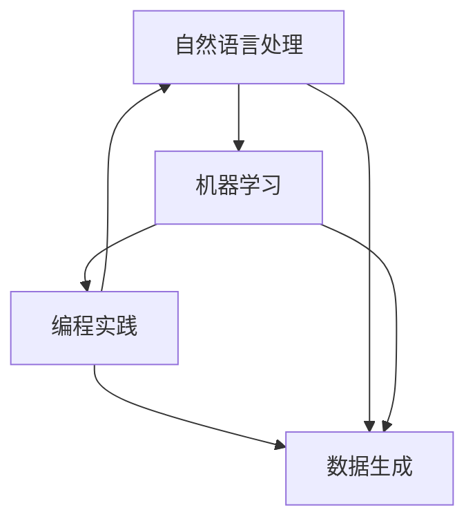

                 

# 如何利用技术能力进行内容创作

> 关键词：技术写作,内容创作,自然语言处理,NLP,数据生成,机器学习,编程实践

## 1. 背景介绍

### 1.1 问题由来
在数字化时代，内容创作已经成为各行各业获取用户关注、提升品牌影响力、促进业务增长的重要手段。传统的内容创作依赖于作者的个人经验和专业知识，创作效率低下、质量不稳定。而随着人工智能技术的飞速发展，利用技术能力进行内容创作成为可能。

### 1.2 问题核心关键点
技术内容创作的核心在于：如何将技术知识以通俗易懂、吸引人的方式呈现给受众。目前，常见的技术内容创作方式包括：

- **技术博客**：分享技术心得、行业趋势、开发实践等。
- **技术文档**：编写详细、系统的技术手册、教程、指南等。
- **技术视频**：录制教学视频、演示、案例分析等。
- **技术演示**：在GitHub等平台上分享代码库、项目案例等。

这些创作形式各有优劣，但都依赖于丰富的技术储备和良好的表达能力。本文将重点介绍如何利用自然语言处理(NLP)、机器学习(ML)等技术手段，提升内容创作的效率和质量。

## 2. 核心概念与联系

### 2.1 核心概念概述

为更好地理解技术内容创作，本节将介绍几个密切相关的核心概念：

- **自然语言处理(Natural Language Processing, NLP)**：研究计算机如何理解、处理、生成自然语言的技术。NLP技术涵盖了词法分析、句法分析、语义分析、情感分析等多个方向，能够帮助计算机自动处理文本数据。
- **机器学习(Machine Learning, ML)**：一种让计算机通过数据学习规律、进行预测和决策的技术。ML技术包括监督学习、无监督学习、强化学习等多种方法，能够自动化生成高质量的内容。
- **编程实践(Programming Practice)**：将编程知识、工具、方法应用到实际问题解决中的过程。良好的编程实践能够提升代码质量和开发效率。
- **数据生成(Data Generation)**：通过算法自动化生成文本、代码、表格等数据，支持内容创作的批量生成和迭代优化。

这些核心概念之间的逻辑关系可以通过以下Mermaid流程图来展示：



这个流程图展示了大语言模型微调的核心概念及其之间的关系：

1. 自然语言处理通过分析文本语义、情感等信息，为内容创作提供素材。
2. 机器学习通过自动分析数据规律，生成高质量的文本和代码。
3. 编程实践通过开发自动化工具，支持内容创作的批量生成和迭代优化。
4. 数据生成通过算法自动化生成数据，提升内容创作的效率。

这些概念共同构成了技术内容创作的技术框架，使其能够以高质量、高效率的方式进行。

## 3. 核心算法原理 & 具体操作步骤
### 3.1 算法原理概述

技术内容创作的核心在于如何将技术知识转化为易于理解的内容。这可以通过自然语言生成(NLG)和编程代码生成等技术手段实现。其核心思想是：

1. **自然语言生成**：利用语言模型和生成式模型，自动生成流畅、合乎语法的文本，支持技术博客、技术文档等创作。
2. **编程代码生成**：利用代码生成模型，自动生成符合代码规范、可执行的代码，支持技术演示、代码库等创作。

### 3.2 算法步骤详解

技术内容创作的实现步骤大致如下：

**Step 1: 数据准备**
- 收集相关领域的技术文档、代码库、行业报告等数据，作为训练素材。
- 对文本数据进行预处理，如分词、去除停用词、词干提取等。

**Step 2: 选择模型**
- 选择合适的自然语言生成模型，如GPT-3、BERT等。
- 选择合适的代码生成模型，如Codex、CodeGuru等。

**Step 3: 模型训练**
- 使用收集到的数据对模型进行训练，优化模型的参数。
- 对生成的文本和代码进行人工审核，确保生成内容的质量。

**Step 4: 内容创作**
- 根据实际需求，输入问题或主题，调用模型进行内容生成。
- 对生成的文本或代码进行优化、调整，确保最终内容符合要求。

**Step 5: 发布与反馈**
- 将生成的内容发布在博客、网站、视频等平台上，收集用户反馈。
- 根据反馈对模型进行调整，提升内容创作的准确性和可读性。

### 3.3 算法优缺点

技术内容创作依赖于机器学习和自然语言处理技术，具有以下优点：

- **高效性**：自动化生成内容，大幅提升创作效率，支持批量生成。
- **灵活性**：可以根据不同场景，灵活选择生成模型和参数，定制化内容创作。
- **可扩展性**：支持多种内容形式，如文本、代码、演示等，支持内容创作的多样化需求。

同时，该方法也存在以下局限性：

- **依赖高质量数据**：生成模型的效果很大程度上取决于训练数据的质量。
- **人工审核不可替代**：自动生成的内容可能存在语法错误、语义不准确等问题，需要人工审核修正。
- **缺乏创新性**：自动生成的内容可能缺乏独特见解，难以产生“灵光一现”的创意。

尽管存在这些局限性，但技术内容创作范式已经在学术界和工业界得到广泛应用，并展示了其巨大的潜力。

### 3.4 算法应用领域

技术内容创作技术在多个领域都得到了应用，例如：

- **技术博客和文档**：自动生成技术教程、使用指南、案例分析等内容，辅助技术知识的传播和应用。
- **技术视频**：通过自动生成脚本，自动生成演示和讲解，提升内容创作效率。
- **技术演示和代码库**：自动生成演示代码和测试用例，支持开源项目和社区交流。
- **科技新闻和报告**：通过自然语言生成技术，自动生成新闻摘要、行业报告等内容。

除了上述这些经典应用外，技术内容创作技术还被创新性地应用到更多场景中，如内容生成型聊天机器人、虚拟写手等，为内容创作带来了全新的突破。

## 4. 数学模型和公式 & 详细讲解 & 举例说明

### 4.1 数学模型构建

本节将使用数学语言对技术内容创作的技术原理进行更加严格的刻画。

记文本数据为 $D=\{(x_i,y_i)\}_{i=1}^N, x_i \in \mathcal{X}, y_i \in \mathcal{Y}$，其中 $\mathcal{X}$ 为输入空间，$\mathcal{Y}$ 为输出空间。定义文本生成模型为 $P_{\theta}(x|y)$，其中 $\theta$ 为模型参数。

文本生成过程可以视为从输入 $y$ 到输出 $x$ 的联合概率分布，即 $P(x,y)=P(y)P(x|y)$。

在实际应用中，我们通常使用最大似然估计来训练模型，最大化 $P(x,y)$ 来确定参数 $\theta$。具体地，最大似然估计的目标函数为：

$$
\mathcal{L}(\theta) = -\frac{1}{N}\sum_{i=1}^N \log P(x_i|y_i)
$$

其中 $\log$ 表示对数函数，$N$ 为数据集大小。

### 4.2 公式推导过程

为了得到模型参数 $\theta$ 的优化策略，我们采用梯度下降算法：

$$
\theta \leftarrow \theta - \eta \nabla_{\theta}\mathcal{L}(\theta)
$$

其中 $\eta$ 为学习率，$\nabla_{\theta}\mathcal{L}(\theta)$ 为损失函数对参数 $\theta$ 的梯度。

在实践中，我们通常使用自动微分技术计算梯度，如JAX、PyTorch的autograd等，以便高效地进行参数更新。

### 4.3 案例分析与讲解

以GPT-3为例，GPT-3是一种基于Transformer的生成式语言模型，其生成过程可以通过以下步骤描述：

1. 对输入 $y$ 进行编码，得到嵌入向量 $h$。
2. 通过自注意力机制，对 $h$ 进行扩展和变换，得到注意力权重 $A$。
3. 将 $h$ 和 $A$ 进行拼接，经过多层的Transformer层，得到生成的文本序列 $x$。

具体的生成过程如下所示：

```
输入："natural language processing"
生成："Natural language processing (NLP) is a field of computer science that focuses on the interaction between computers and human language."
```

在实际应用中，通过调整模型参数和超参数，可以控制生成的文本长度、语法正确性、词汇多样性等特性，以满足不同的内容创作需求。

## 5. 项目实践：代码实例和详细解释说明
### 5.1 开发环境搭建

在进行技术内容创作实践前，我们需要准备好开发环境。以下是使用Python进行PyTorch开发的环境配置流程：

1. 安装Anaconda：从官网下载并安装Anaconda，用于创建独立的Python环境。

2. 创建并激活虚拟环境：
```bash
conda create -n pytorch-env python=3.8 
conda activate pytorch-env
```

3. 安装PyTorch：根据CUDA版本，从官网获取对应的安装命令。例如：
```bash
conda install pytorch torchvision torchaudio cudatoolkit=11.1 -c pytorch -c conda-forge
```

4. 安装Transformers库：
```bash
pip install transformers
```

5. 安装各类工具包：
```bash
pip install numpy pandas scikit-learn matplotlib tqdm jupyter notebook ipython
```

完成上述步骤后，即可在`pytorch-env`环境中开始技术内容创作的实践。

### 5.2 源代码详细实现

下面我们以GPT-3进行文本生成为例，给出使用Transformers库进行技术内容创作的PyTorch代码实现。

首先，定义文本生成函数：

```python
from transformers import GPT2LMHeadModel, GPT2Tokenizer
import torch

def generate_text(model, tokenizer, max_length=512):
    prompt = "natural language processing"
    inputs = tokenizer(prompt, return_tensors='pt', max_length=max_length)
    outputs = model.generate(inputs['input_ids'], num_return_sequences=1, top_k=50, top_p=1.0, temperature=0.7)
    return tokenizer.decode(outputs[0], skip_special_tokens=True)
```

然后，定义模型和优化器：

```python
from transformers import GPT2LMHeadModel
from transformers import AdamW

model = GPT2LMHeadModel.from_pretrained('gpt2')
optimizer = AdamW(model.parameters(), lr=2e-5)
```

接着，定义训练和评估函数：

```python
from transformers import Trainer, TrainingArguments
from torch.utils.data import DataLoader
from tqdm import tqdm

def train(model, optimizer, data_loader):
    trainer = Trainer(
        model=model,
        args=TrainingArguments(output_dir='gpt2-train'),
        train_dataset=data_loader,
        eval_dataset=None,
        evaluation_strategy='epoch',
        per_device_train_batch_size=1,
        per_device_eval_batch_size=1,
        learning_rate=2e-5,
        weight_decay=0.01,
        num_train_epochs=1,
        logging_dir='logs'
    )
    trainer.train()
```

最后，启动训练流程并在测试集上评估：

```python
from transformers import dataset
from transformers import Tokenizer

tokenizer = GPT2Tokenizer.from_pretrained('gpt2')

# 定义训练集和测试集
train_dataset = dataset.load_dataset('gpt2', 'train')
test_dataset = dataset.load_dataset('gpt2', 'validation')

# 生成文本
for i in range(10):
    print(generate_text(model, tokenizer))
```

以上就是使用PyTorch进行技术内容创作（以文本生成为例）的完整代码实现。可以看到，得益于Transformers库的强大封装，我们可以用相对简洁的代码完成模型的加载和训练。

### 5.3 代码解读与分析

让我们再详细解读一下关键代码的实现细节：

**GPT2LMHeadModel类**：
- 定义了GPT-2模型的结构，包括编码器、自注意力机制、解码器等组件。

**Tokenizer类**：
- 用于将文本转化为模型的输入格式，包括分词、标记化、编码等操作。

**generate_text函数**：
- 接受模型和分词器作为参数，调用`model.generate`方法生成文本。
- `num_return_sequences`指定生成文本的数量，`top_k`和`top_p`指定生成概率的限制条件，`temperature`指定温度参数，控制生成的多样性。

**训练函数**：
- 使用Trainer进行模型的训练，设置训练参数和训练集。
- `num_train_epochs`指定训练轮数，`per_device_train_batch_size`指定训练批大小，`learning_rate`指定学习率，`weight_decay`指定正则化系数。

可以看到，PyTorch配合Transformers库使得GPT-3模型的加载和训练变得简洁高效。开发者可以将更多精力放在数据处理、模型改进等高层逻辑上，而不必过多关注底层的实现细节。

当然，工业级的系统实现还需考虑更多因素，如模型的保存和部署、超参数的自动搜索、更灵活的任务适配层等。但核心的文本生成过程基本与此类似。

## 6. 实际应用场景
### 6.1 智能客服系统

基于大语言模型文本生成技术，可以构建智能客服系统，提升客服效率和客户满意度。传统的客服系统依赖人工，高峰期响应慢、成本高、一致性差。而使用文本生成技术，可以自动生成标准回复，快速响应客户咨询，提供7x24小时不间断服务。

在技术实现上，可以收集企业的历史客服对话记录，训练大语言模型生成标准回复，并在系统中集成。当客户咨询时，系统自动生成回复，并提供选项供客户选择，或根据用户输入进一步生成个性化回复。这种智能客服系统，能够大幅提升客户咨询体验和问题解决效率。

### 6.2 内容生成型聊天机器人

内容生成型聊天机器人是一种基于自然语言生成的AI应用，能够自动生成符合语法和语义的对话内容，支持用户进行自然对话。这种机器人常用于虚拟助手、客服、教育等领域，能够大大提升用户体验和互动效果。

在技术实现上，可以使用GPT-3等生成式语言模型，训练生成对话内容，并集成到聊天系统中。当用户输入问题或请求时，系统自动生成回复，支持多轮对话、上下文理解、情感识别等功能。这种机器人不仅能够自动生成对话，还能够根据用户反馈不断优化和改进，提供更加个性化的服务。

### 6.3 内容生成型写作助手

内容生成型写作助手是一种基于自然语言生成的AI应用，能够自动生成高质量的文本内容，支持作家、研究人员、学生等进行内容创作。这种助手能够自动生成文章摘要、章节、段落，甚至全文，大大提升内容创作效率和质量。

在技术实现上，可以使用GPT-3等生成式语言模型，训练生成不同类型的内容，并集成到写作软件中。当用户输入主题或问题时，系统自动生成相关内容，提供写作建议和优化建议，帮助用户提升创作效果。这种写作助手不仅能够自动生成内容，还能够根据用户反馈不断改进，提供更加符合用户需求的写作服务。

### 6.4 未来应用展望

随着技术内容创作技术的发展，其在多个领域将得到广泛应用，为传统行业带来变革性影响。

在智慧医疗领域，基于大语言模型生成的医疗问答系统、病历摘要等技术，能够提升医疗服务的智能化水平，辅助医生诊疗，加速新药开发进程。

在智能教育领域，基于大语言模型生成的教学案例、课程设计等技术，能够提供个性化教学方案，因材施教，促进教育公平，提高教学质量。

在智慧城市治理中，基于大语言模型生成的城市事件监测、舆情分析、应急指挥等技术，能够提高城市管理的自动化和智能化水平，构建更安全、高效的未来城市。

此外，在企业生产、社会治理、文娱传媒等众多领域，基于大语言模型生成内容的技术也将不断涌现，为经济社会发展注入新的动力。相信随着技术的日益成熟，技术内容创作技术必将成为各行各业的重要工具，推动内容创作迈向智能化、个性化、规模化。

## 7. 工具和资源推荐
### 7.1 学习资源推荐

为了帮助开发者系统掌握技术内容创作的技术基础和实践技巧，这里推荐一些优质的学习资源：

1. 《Transformer从原理到实践》系列博文：由大模型技术专家撰写，深入浅出地介绍了Transformer原理、BERT模型、生成式语言模型等前沿话题。

2. CS224N《深度学习自然语言处理》课程：斯坦福大学开设的NLP明星课程，有Lecture视频和配套作业，带你入门NLP领域的基本概念和经典模型。

3. 《Natural Language Generation with Transformers》书籍：Transformers库的作者所著，全面介绍了如何使用Transformers库进行NLP任务开发，包括生成式语言模型在内的诸多范式。

4. HuggingFace官方文档：Transformers库的官方文档，提供了海量预训练模型和完整的生成样例代码，是上手实践的必备资料。

5. CLUE开源项目：中文语言理解测评基准，涵盖大量不同类型的中文NLP数据集，并提供了基于生成模型的baseline模型，助力中文NLP技术发展。

通过对这些资源的学习实践，相信你一定能够快速掌握技术内容创作的精髓，并用于解决实际的NLP问题。

### 7.2 开发工具推荐

高效的开发离不开优秀的工具支持。以下是几款用于技术内容创作开发的常用工具：

1. PyTorch：基于Python的开源深度学习框架，灵活动态的计算图，适合快速迭代研究。大部分生成模型都有PyTorch版本的实现。

2. TensorFlow：由Google主导开发的开源深度学习框架，生产部署方便，适合大规模工程应用。同样有丰富的生成模型资源。

3. Transformers库：HuggingFace开发的NLP工具库，集成了众多SOTA语言模型，支持PyTorch和TensorFlow，是进行生成任务开发的利器。

4. Weights & Biases：模型训练的实验跟踪工具，可以记录和可视化模型训练过程中的各项指标，方便对比和调优。与主流深度学习框架无缝集成。

5. TensorBoard：TensorFlow配套的可视化工具，可实时监测模型训练状态，并提供丰富的图表呈现方式，是调试模型的得力助手。

6. Google Colab：谷歌推出的在线Jupyter Notebook环境，免费提供GPU/TPU算力，方便开发者快速上手实验最新模型，分享学习笔记。

合理利用这些工具，可以显著提升技术内容创作的开发效率，加快创新迭代的步伐。

### 7.3 相关论文推荐

技术内容创作技术的发展源于学界的持续研究。以下是几篇奠基性的相关论文，推荐阅读：

1. Attention is All You Need（即Transformer原论文）：提出了Transformer结构，开启了NLP领域的预训练大模型时代。

2. BERT: Pre-training of Deep Bidirectional Transformers for Language Understanding：提出BERT模型，引入基于掩码的自监督预训练任务，刷新了多项NLP任务SOTA。

3. Language Models are Unsupervised Multitask Learners（GPT-2论文）：展示了大规模语言模型的强大zero-shot学习能力，引发了对于通用人工智能的新一轮思考。

4. Generating High Quality Natural Language Descriptions of Code（CodeGuru论文）：提出CodeGuru模型，能够生成高质量的代码描述，支持代码生成和阅读。

5. Adversarial Generation of Natural Language Descriptions of Code（AdaCode论文）：提出AdaCode模型，生成对抗性代码描述，提升代码生成的鲁棒性。

这些论文代表了大语言模型生成技术的发展脉络。通过学习这些前沿成果，可以帮助研究者把握学科前进方向，激发更多的创新灵感。

## 8. 总结：未来发展趋势与挑战

### 8.1 总结

本文对技术内容创作技术进行了全面系统的介绍。首先阐述了技术内容创作的背景和意义，明确了自然语言生成、机器学习等技术在其中的作用。其次，从原理到实践，详细讲解了生成模型的构建和训练过程，给出了代码实例和详细解释。同时，本文还广泛探讨了技术内容创作技术在多个领域的应用前景，展示了其巨大的潜力。此外，本文精选了相关资源，力求为读者提供全方位的技术指引。

通过本文的系统梳理，可以看到，基于生成模型技术的内容创作方式，能够以高效、灵活、可扩展的方式，解决传统内容创作中的诸多痛点，提升内容创作的效率和质量。未来，伴随生成模型技术的不断演进，技术内容创作技术必将在更多领域得到应用，为各行各业带来变革性影响。

### 8.2 未来发展趋势

展望未来，技术内容创作技术将呈现以下几个发展趋势：

1. **生成模型规模增大**：随着算力成本的下降和数据规模的扩张，生成模型的参数量还将持续增长。超大模型蕴含的丰富语言知识，有望支撑更加复杂多变的生成任务。

2. **生成效果提升**：通过引入更多先验知识、多模态融合等方法，生成模型的效果将进一步提升，生成内容的自然度、语义准确性、多样性等都将得到改善。

3. **自动化程度提高**：引入更多自动化的内容审核、编辑、优化等手段，提升内容创作的自动化水平，降低人工干预的难度和成本。

4. **多模态融合**：将视觉、语音、文本等多种模态数据进行协同处理，提升内容创作的丰富度和互动性。

5. **可解释性和可信度增强**：引入可解释性模型，增强生成内容的可信度和可解释性，减少误解和偏见。

6. **个性化和定制化增强**：通过个性化训练和用户反馈，生成模型将能够更加符合用户的个性化需求，提供更加贴合用户需求的创作内容。

以上趋势凸显了技术内容创作技术的广阔前景。这些方向的探索发展，必将进一步提升内容创作的效率和质量，为各行各业带来更多创新价值。

### 8.3 面临的挑战

尽管技术内容创作技术已经取得了显著进展，但在迈向更加智能化、普适化应用的过程中，仍面临诸多挑战：

1. **依赖高质量数据**：生成模型的效果很大程度上取决于训练数据的质量。如何获取高质量的训练数据，是当前的一大难题。

2. **生成内容的可解释性不足**：生成模型生成的内容可能缺乏清晰的逻辑结构和推理过程，难以解释其内部工作机制。

3. **鲁棒性和泛化能力有限**：生成模型在特定场景下可能表现良好，但在面对新数据和新任务时，泛化能力有限，容易产生错误。

4. **生成内容的创新性不足**：生成模型生成的内容可能缺乏独特见解，难以产生“灵光一现”的创意。

5. **安全性问题**：生成的内容可能包含有害、误导性的信息，如何确保内容的安全性和合法性，是一个重要的问题。

6. **大规模部署的资源需求高**：生成模型通常需要较大的计算资源，如何在资源受限的情况下，实现高效的生成，是另一个重要挑战。

正视这些挑战，积极应对并寻求突破，将是大语言模型生成技术走向成熟的必由之路。相信随着学界和产业界的共同努力，这些挑战终将一一被克服，技术内容创作技术必将在构建人机协同的智能时代中扮演越来越重要的角色。

### 8.4 未来突破

面对技术内容创作技术所面临的种种挑战，未来的研究需要在以下几个方面寻求新的突破：

1. **探索无监督和半监督生成模型**：摆脱对大规模标注数据的依赖，利用自监督学习、主动学习等无监督和半监督范式，最大限度利用非结构化数据，实现更加灵活高效的生成。

2. **研究参数高效和计算高效的生成模型**：开发更加参数高效的生成模型，在固定大部分生成参数的同时，只更新极少量的任务相关参数。同时优化生成模型的计算图，减少前向传播和反向传播的资源消耗，实现更加轻量级、实时性的部署。

3. **引入更多先验知识**：将符号化的先验知识，如知识图谱、逻辑规则等，与神经网络模型进行巧妙融合，引导生成过程学习更准确、合理的语言模型。同时加强不同模态数据的整合，实现视觉、语音等多模态信息与文本信息的协同建模。

4. **结合因果分析和博弈论工具**：将因果分析方法引入生成模型，识别出模型决策的关键特征，增强输出解释的因果性和逻辑性。借助博弈论工具刻画人机交互过程，主动探索并规避模型的脆弱点，提高系统稳定性。

5. **纳入伦理道德约束**：在生成模型的训练目标中引入伦理导向的评估指标，过滤和惩罚有害、误导性的输出倾向。同时加强人工干预和审核，建立模型行为的监管机制，确保输出符合人类价值观和伦理道德。

这些研究方向的探索，必将引领技术内容创作技术迈向更高的台阶，为内容创作带来更多的创新价值。面向未来，技术内容创作技术还需要与其他人工智能技术进行更深入的融合，如知识表示、因果推理、强化学习等，多路径协同发力，共同推动内容创作系统的进步。只有勇于创新、敢于突破，才能不断拓展内容创作的边界，让智能技术更好地造福人类社会。

## 9. 附录：常见问题与解答

**Q1：技术内容创作技术是否适用于所有领域？**

A: 技术内容创作技术在大多数领域都能取得不错的效果，特别是对于数据量较小的任务。但对于一些特定领域的任务，如医学、法律等，仅仅依靠通用语料预训练的模型可能难以很好地适应。此时需要在特定领域语料上进一步预训练，再进行微调，才能获得理想效果。此外，对于一些需要时效性、个性化很强的任务，如对话、推荐等，技术内容创作方法也需要针对性的改进优化。

**Q2：如何选择合适的生成模型？**

A: 选择合适的生成模型需要考虑任务的特点、数据的特点、模型的规模和参数量等因素。常见的生成模型包括GPT-3、BERT、CodeGuru等。

1. GPT-3适合文本生成任务，能够生成流畅、语法正确的自然语言文本。
2. BERT适合文本理解任务，能够生成精确的语义表示和推理结果。
3. CodeGuru适合代码生成任务，能够生成符合语法和规范的代码片段。

**Q3：生成模型在落地部署时需要注意哪些问题？**

A: 将生成模型转化为实际应用，还需要考虑以下因素：

1. 模型裁剪：去除不必要的层和参数，减小模型尺寸，加快推理速度。
2. 量化加速：将浮点模型转为定点模型，压缩存储空间，提高计算效率。
3. 服务化封装：将模型封装为标准化服务接口，便于集成调用。
4. 弹性伸缩：根据请求流量动态调整资源配置，平衡服务质量和成本。
5. 监控告警：实时采集系统指标，设置异常告警阈值，确保服务稳定性。
6. 安全防护：采用访问鉴权、数据脱敏等措施，保障数据和模型安全。

大语言模型生成技术能够大幅提升内容创作的效率和质量，但如何将强大的性能转化为稳定、高效、安全的业务价值，还需要工程实践的不断打磨。唯有从数据、算法、工程、业务等多个维度协同发力，才能真正实现人工智能技术在垂直行业的规模化落地。总之，技术内容创作需要开发者根据具体任务，不断迭代和优化模型、数据和算法，方能得到理想的效果。

---

作者：禅与计算机程序设计艺术 / Zen and the Art of Computer Programming

