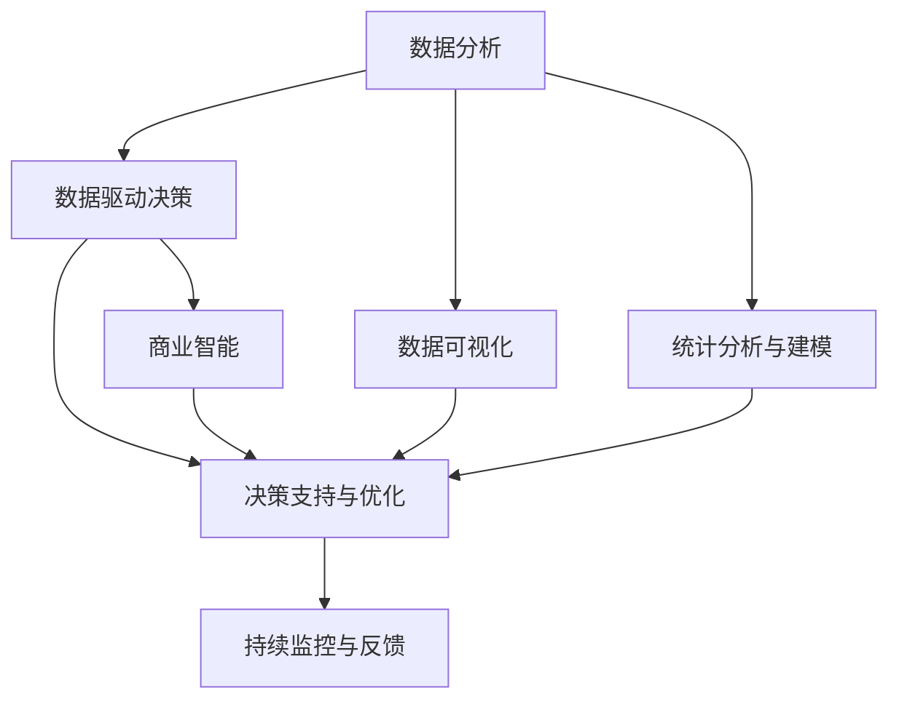

                 

## 1. 背景介绍

### 1.1 问题由来

随着数据时代的到来，各行各业的数据量呈爆炸性增长。企业运营决策需要依赖大量信息，传统的方法往往只能以直觉、经验为主，缺乏数据驱动的科学性。大数据分析技术的兴起，为运营决策提供了新的工具和视角。利用数据分析，可以从海量数据中挖掘出隐藏在背后的规律，辅助企业做出更精准、科学的决策。

例如，电商平台可以通过用户点击、浏览、购买等行为数据，分析出用户的偏好和行为模式，实现个性化推荐，提升转化率和客户满意度。零售商可以利用供应链数据和市场动态，优化库存管理，减少库存积压，提高运营效率。制造业可以借助设备传感器数据，预测设备故障，提前维护，降低生产成本。

因此，利用数据分析指导运营决策，已经成为提升企业竞争力的重要手段。本节将从数据驱动的决策思想入手，系统介绍数据分析在运营决策中的应用，帮助企业构建数据驱动的决策体系，实现业务优化和价值提升。

### 1.2 问题核心关键点

数据分析在运营决策中的应用主要体现在以下几个方面：

1. **数据收集与处理**：从各个业务环节收集数据，并通过清洗、转换、整合等步骤，形成可分析的数据集。
2. **数据可视化**：使用图表、仪表盘等形式，直观展示数据趋势和分布，帮助决策者快速把握关键信息。
3. **统计分析与建模**：运用统计学方法和机器学习模型，分析数据背后的规律，预测未来趋势。
4. **决策支持与优化**：基于分析结果，制定优化策略，调整业务流程，提升运营效率。

通过理解这些核心关键点，我们可以更好地把握数据分析在运营决策中的应用价值和实施步骤。

## 2. 核心概念与联系

### 2.1 核心概念概述

为更好地理解数据分析在运营决策中的应用，本节将介绍几个密切相关的核心概念：

1. **数据分析(Analytics)**：通过统计学、机器学习等技术，从数据中提取信息和洞察的过程。数据分析包括数据清洗、数据探索、统计分析、模型建立、结果解释等环节。

2. **数据驱动决策**：基于数据而不是直觉或经验进行决策的过程。数据驱动决策要求在决策过程中重视数据证据，确保决策的科学性和可靠性。

3. **运营决策**：涉及企业日常运营管理的各种决策，如库存管理、供应链优化、客户服务优化等。

4. **商业智能(Business Intelligence, BI)**：利用数据分析技术，提供洞察和分析，帮助企业制定决策和战略的过程。BI工具通常包括数据仓库、报表、仪表盘、可视化分析等功能。

5. **大数据技术**：指处理、分析大规模数据的技术和方法。大数据技术包括数据采集、存储、处理、分析等环节，可以支持复杂的数据分析任务。

6. **机器学习模型**：通过训练数据，自动学习数据规律和特征，并进行预测或分类等任务的模型。机器学习模型可以应用于分类、回归、聚类等各类分析任务。

7. **持续监控与反馈**：持续收集数据，进行监控分析，并对决策结果进行反馈，调整策略，优化运营过程。

这些核心概念之间的逻辑关系可以通过以下Mermaid流程图来展示：



这个流程图展示了大数据分析在运营决策中的应用框架：

1. 从业务环节收集数据，并进行清洗和整合。
2. 通过数据可视化展示数据趋势，辅助决策。
3. 运用统计分析和机器学习模型，深入挖掘数据规律。
4. 基于分析结果，制定优化策略，调整业务流程。
5. 利用BI工具将分析结果可视化，支持决策。
6. 持续监控数据变化，调整策略，优化运营过程。

这些概念共同构成了数据驱动决策的基础，有助于企业在运营决策中实现更高的效率和效果。

## 3. 核心算法原理 & 具体操作步骤

### 3.1 算法原理概述

数据驱动的运营决策，核心在于通过数据分析技术，从海量数据中提取有价值的洞察和规律，辅助决策者制定最优策略。这一过程可以分为以下几个关键步骤：

1. **数据收集**：从业务运营环节，如供应链、销售、客户服务等，收集相关数据。
2. **数据清洗与转换**：去除数据中的噪声和错误，进行必要的格式转换，确保数据的质量。
3. **数据探索**：使用描述性统计和数据可视化技术，发现数据中的关键模式和趋势。
4. **统计分析与建模**：运用统计学方法和机器学习模型，深入挖掘数据背后的规律和关联。
5. **结果解释与应用**：解释分析结果，结合业务场景，制定优化策略，调整业务流程。

### 3.2 算法步骤详解

#### 3.2.1 数据收集

数据收集是数据分析的第一步，可以从以下几个方面进行：

- **系统数据**：如企业内部系统生成的订单、库存、销售等数据。
- **外部数据**：如市场调研报告、行业数据、新闻资讯等。
- **传感器数据**：如设备传感器生成的生产数据、温度、湿度等。
- **社交媒体数据**：如用户评论、社交媒体上的帖子和活动数据。
- **客户行为数据**：如网站访问记录、移动应用使用行为等。

#### 3.2.2 数据清洗与转换

数据清洗和转换是数据分析的基础，主要包括以下几个步骤：

- **数据清洗**：去除重复数据、缺失值、异常值等。
- **数据转换**：将数据从原始格式转换为分析所需的形式，如将日期时间格式转换为日期数值。
- **数据集成**：将多个数据源的数据进行整合，形成统一的数据集。
- **数据归一化**：对不同来源、不同格式的数据进行标准化处理。

#### 3.2.3 数据探索

数据探索旨在从数据中发现规律和趋势，主要使用描述性统计和数据可视化技术：

- **描述性统计**：如均值、中位数、标准差、四分位距等，描述数据的分布情况。
- **数据可视化**：如折线图、柱状图、饼图等，直观展示数据趋势和分布。
- **探索性数据分析(EDA)**：结合统计分析和可视化技术，发现数据中的异常值、相关性和模式。

#### 3.2.4 统计分析与建模

统计分析和建模是数据分析的核心，主要包括以下几个步骤：

- **统计分析**：如回归分析、假设检验、方差分析等，发现数据中的关联和规律。
- **机器学习模型**：如线性回归、决策树、支持向量机、神经网络等，建立预测或分类模型。
- **特征工程**：对数据进行特征提取、选择、变换，提高模型的准确性和泛化能力。
- **模型评估**：通过交叉验证、ROC曲线、AUC等指标，评估模型的性能和泛化能力。

#### 3.2.5 结果解释与应用

结果解释与应用是将数据分析结果转化为具体策略和操作的过程：

- **结果解释**：将模型输出和分析结果解释为可理解的语言，结合业务场景进行解释。
- **决策制定**：根据分析结果，制定优化策略，调整业务流程。
- **效果评估**：通过跟踪和监控，评估策略实施的效果，并进行调整优化。

### 3.3 算法优缺点

数据分析在运营决策中的应用具有以下优点：

1. **数据驱动决策**：通过数据证据支持决策，提高决策的科学性和可靠性。
2. **全面覆盖**：覆盖业务运营的各个环节，提供全面的洞察和分析。
3. **提高效率**：自动化数据分析过程，减少人工操作，提高决策效率。
4. **风险降低**：通过数据驱动决策，降低决策的随意性和主观性。
5. **持续优化**：通过持续监控和反馈，不断优化决策和业务流程。

同时，数据分析也存在一些局限性：

1. **数据质量问题**：数据清洗和处理过程复杂，数据质量可能存在问题。
2. **模型复杂性**：复杂的分析模型可能需要大量的计算资源和时间。
3. **结果解释难度**：复杂模型输出的结果可能需要专业知识进行解释。
4. **过度依赖数据**：过分依赖数据可能导致忽视业务直觉和经验。
5. **技术门槛**：数据分析需要一定的技术基础，可能面临技术瓶颈。

尽管存在这些局限性，但数据分析在运营决策中的应用前景广阔，未来仍有较大的发展空间。

### 3.4 算法应用领域

数据分析在运营决策中的应用已经渗透到各行各业，包括但不限于以下几个领域：

1. **零售业**：通过客户行为数据分析，实现个性化推荐、库存管理和销售预测。
2. **制造业**：利用设备传感器数据，预测设备故障，优化生产流程和维护策略。
3. **物流业**：通过供应链数据分析，优化配送路线和库存管理，降低运输成本。
4. **金融业**：运用市场数据和客户行为分析，制定投资策略和风险管理方案。
5. **医疗业**：通过病患数据和医疗记录分析，优化诊疗流程和疾病预防方案。
6. **能源业**：利用能源消耗和环境数据，优化能源使用和环境保护策略。
7. **政府公共服务**：通过公共服务数据和居民反馈，优化公共服务质量和效率。

数据分析的广泛应用，为各行各业带来了显著的效率提升和成本降低，促进了业务的智能化转型。

## 4. 数学模型和公式 & 详细讲解  
### 4.1 数学模型构建

数据分析的核心是利用数学模型从数据中提取规律和洞察。本节将使用数学语言对数据分析的基本模型进行说明。

记数据集为 $D=\{(x_i,y_i)\}_{i=1}^N$，其中 $x$ 为特征向量，$y$ 为标签或目标变量。定义模型 $f$ 为从特征向量到目标变量的映射函数。数据分析的目标是通过训练数据 $D$ 学习模型参数 $\theta$，使得 $f$ 能够拟合数据并做出预测。

形式化地，假设模型 $f$ 为线性回归模型，即：

$$
y_i = \theta_0 + \sum_{j=1}^p \theta_j x_{ij} + \epsilon_i
$$

其中 $\epsilon_i$ 为误差项，$\theta=(\theta_0,\theta_1,\dots,\theta_p)^\top$ 为模型参数。则最小二乘法目标函数为：

$$
\mathcal{L}(\theta) = \frac{1}{2N} \sum_{i=1}^N (y_i - \hat{y}_i)^2
$$

其中 $\hat{y}_i = \theta_0 + \sum_{j=1}^p \theta_j x_{ij}$。

通过梯度下降等优化算法，最小化损失函数 $\mathcal{L}(\theta)$，即可得到最优的模型参数 $\hat{\theta}$。

### 4.2 公式推导过程

下面以线性回归模型为例，推导最小二乘法的公式和步骤：

1. **目标函数定义**：

$$
\mathcal{L}(\theta) = \frac{1}{2N} \sum_{i=1}^N (y_i - \hat{y}_i)^2
$$

其中：

$$
\hat{y}_i = \theta_0 + \sum_{j=1}^p \theta_j x_{ij}
$$

2. **目标函数最小化**：

$$
\frac{\partial \mathcal{L}(\theta)}{\partial \theta_j} = \frac{1}{N} \sum_{i=1}^N -2(x_{ij} - \hat{x}_{ij})
$$

3. **求解最优参数**：

$$
\hat{\theta} = (X^\top X)^{-1}X^\top Y
$$

其中 $X$ 为特征矩阵，$Y$ 为目标向量。

通过求解上述优化问题，得到线性回归模型的最优参数 $\hat{\theta}$。在实践中，通常使用迭代算法，如梯度下降法，求解目标函数的最小值。

### 4.3 案例分析与讲解

假设某电商平台的销售数据集 $D=\{(x_i,y_i)\}_{i=1}^N$，其中 $x$ 包括时间、广告花费、促销活动等特征，$y$ 为目标变量，即日销售量。可以通过以下步骤进行数据分析：

1. **数据收集**：从电商平台的数据库中提取销售数据。
2. **数据清洗**：去除异常值、重复值等，补全缺失值。
3. **数据探索**：通过描述性统计和数据可视化，发现数据中的规律和趋势。
4. **统计分析**：使用线性回归模型，分析时间、广告花费、促销活动等对日销售量的影响。
5. **结果解释**：解释模型输出，结合业务场景，制定促销策略。

## 5. 项目实践：代码实例和详细解释说明

### 5.1 开发环境搭建

在进行数据分析实践前，我们需要准备好开发环境。以下是使用Python进行数据分析的环境配置流程：

1. 安装Anaconda：从官网下载并安装Anaconda，用于创建独立的Python环境。

2. 创建并激活虚拟环境：
```bash
conda create -n analytics-env python=3.8 
conda activate analytics-env
```

3. 安装必要的Python包：
```bash
conda install pandas numpy matplotlib seaborn scikit-learn statsmodels
```

4. 安装数据可视化工具：
```bash
conda install plotly seaborn
```

5. 安装机器学习库：
```bash
conda install scikit-learn
```

完成上述步骤后，即可在`analytics-env`环境中开始数据分析实践。

### 5.2 源代码详细实现

下面以销售数据为例，给出使用Python进行数据分析的代码实现。

首先，定义数据处理函数：

```python
import pandas as pd
import numpy as np

def load_data(file_path):
    data = pd.read_csv(file_path)
    return data

def clean_data(data):
    data.dropna(inplace=True)
    data = data[data['day'].notnull()]
    return data

def feature_engineering(data):
    data['ad_spending'] = data['ad_spending'].fillna(data['ad_spending'].mean())
    data['sales'] = data['sales'].fillna(data['sales'].mean())
    data['promotion'] = data['promotion'].fillna(data['promotion'].mode()[0])
    return data

def visualize_data(data):
    import matplotlib.pyplot as plt
    plt.figure(figsize=(12, 6))
    plt.plot(data['day'], data['sales'], 'o-')
    plt.xlabel('Day')
    plt.ylabel('Sales')
    plt.title('Sales Trend')
    plt.show()
```

然后，加载和处理数据：

```python
data = load_data('sales_data.csv')
cleaned_data = clean_data(data)
features = feature_engineering(cleaned_data)
visualize_data(features)
```

最后，进行回归分析：

```python
from sklearn.linear_model import LinearRegression
from sklearn.metrics import mean_squared_error

X = features[['day', 'ad_spending', 'promotion']]
y = features['sales']

model = LinearRegression()
model.fit(X, y)
y_pred = model.predict(X)

print('R-squared:', model.score(X, y))
print('Mean Squared Error:', mean_squared_error(y, y_pred))
```

以上就是使用Python进行数据分析的完整代码实现。可以看到，Python提供的数据分析和可视化库，可以方便地实现数据处理和模型建立。

### 5.3 代码解读与分析

让我们再详细解读一下关键代码的实现细节：

**load_data函数**：
- 从CSV文件中加载数据，并返回一个pandas数据框。

**clean_data函数**：
- 去除数据中的缺失值和异常值，确保数据的质量。

**feature_engineering函数**：
- 对数据进行特征处理，如填补缺失值、标准化处理等。

**visualize_data函数**：
- 使用matplotlib库绘制销售数据的折线图，直观展示销售趋势。

**回归分析部分**：
- 使用sklearn库中的LinearRegression模型，对销售数据进行线性回归分析。
- 输出模型的决定系数（R-squared）和均方误差（Mean Squared Error）。

可以看到，Python的数据分析和机器学习库提供了丰富的功能，可以方便地实现数据处理、模型建立和评估。开发者可以根据具体需求，灵活选择和使用相关库函数，提高数据分析的效率和精度。

## 6. 实际应用场景

### 6.1 智能推荐系统

智能推荐系统是数据分析在零售业和内容服务领域的重要应用。通过分析用户行为数据，推荐系统可以预测用户兴趣，提供个性化推荐。例如，电商平台可以通过用户浏览、点击、购买数据，建立用户画像，推荐相似商品。内容平台可以利用用户阅读、点赞、评论等数据，推荐相关文章和视频。

### 6.2 供应链优化

供应链优化是数据分析在制造业和物流业的重要应用。通过分析库存数据、物流数据、市场需求等，企业可以优化库存管理、降低运输成本、提高供应链效率。例如，通过分析历史订单数据和市场需求，企业可以预测未来的销售量，优化库存水平。利用GPS和传感器数据，企业可以实时监控运输车辆的运行情况，优化配送路线。

### 6.3 金融风险管理

金融风险管理是数据分析在金融业的重要应用。通过分析市场数据、客户行为数据、交易数据等，金融机构可以识别风险点，制定风险管理策略。例如，银行可以利用客户贷款数据和交易记录，分析客户的信用风险和违约概率。保险公司可以利用理赔数据和客户行为数据，评估保险风险和理赔率。

### 6.4 能源消耗优化

能源消耗优化是数据分析在能源业的重要应用。通过分析能源消耗数据、环境数据等，企业可以优化能源使用、降低能源成本、提高环境保护水平。例如，通过分析生产设备的数据，企业可以预测设备故障，优化生产流程。利用传感器数据，企业可以实时监控能源消耗情况，调整使用策略。

## 7. 工具和资源推荐

### 7.1 学习资源推荐

为了帮助开发者系统掌握数据分析的理论基础和实践技巧，这里推荐一些优质的学习资源：

1. 《Python数据分析实战》书籍：详细介绍Python数据分析的基本概念和实践方法，适合初学者快速入门。
2. 《R语言数据分析》课程：R语言在数据分析领域应用广泛，通过学习R语言数据分析方法，可以掌握更多数据分析技巧。
3. Coursera《数据科学与机器学习》课程：由斯坦福大学开设的课程，涵盖数据科学和机器学习的各个方面，适合系统学习。
4. Kaggle竞赛平台：提供大量数据集和竞赛题目，通过参与竞赛，可以锻炼数据分析技能。
5. GitHub开源项目：搜索相关的开源项目，学习数据分析的最佳实践。

通过对这些资源的学习实践，相信你一定能够快速掌握数据分析的核心技能，并应用于实际问题解决。

### 7.2 开发工具推荐

高效的数据分析开发离不开优秀的工具支持。以下是几款用于数据分析开发的常用工具：

1. Jupyter Notebook：一个交互式的编程环境，支持Python、R等多种语言，适合数据分析和可视化。
2. PyCharm：一个集成IDE，支持数据分析和机器学习库的导入和调试。
3. RStudio：一个R语言的集成开发环境，提供强大的数据分析和可视化功能。
4. Excel：虽然功能相对简单，但对于小规模的数据分析任务，Excel也是一个不错的选择。
5. Google Sheets：在线表格工具，适合团队协作和数据共享。

合理利用这些工具，可以显著提升数据分析的开发效率，加速问题解决。

### 7.3 相关论文推荐

数据分析在运营决策中的应用源于学界的持续研究。以下是几篇奠基性的相关论文，推荐阅读：

1. "Data Mining: Concepts and Techniques" 书籍：由Michael Steinbach、Jian Pei和Jorge Gabriel books 编写，系统介绍了数据挖掘和数据分析的基本概念和技术。
2. "Statistical Learning" 书籍：由Gareth James、Daniel Witten、Trevor Hastie和Robert Tibshirani 编写，详细介绍了统计学习方法和机器学习模型。
3. "Predictive Analytics" 书籍：由Eric Siegel编写，介绍了预测分析的基本方法和应用案例。
4. "Pattern Recognition and Machine Learning" 书籍：由Christopher Bishop编写，详细介绍了机器学习的基本概念和方法。
5. "Big Data: Principles and Best Practices of Scalable Real-time Data Systems" 书籍：由Joel Dean、Patrick Cormier和Kentara Shimizu 编写，介绍了大数据技术和系统设计。

这些论文代表了大数据分析领域的研究进展，通过学习这些前沿成果，可以帮助研究者把握学科前进方向，激发更多的创新灵感。

## 8. 总结：未来发展趋势与挑战

### 8.1 总结

本文对利用数据分析指导运营决策的方法进行了全面系统的介绍。首先从数据驱动的决策思想入手，系统介绍了数据分析在运营决策中的应用，帮助企业构建数据驱动的决策体系，实现业务优化和价值提升。其次，从数据收集、处理、探索、分析到结果解释与应用，详细讲解了数据分析的基本流程和方法。同时，本文还探讨了数据分析在智能推荐、供应链优化、金融风险管理、能源消耗优化等多个领域的应用场景，展示了数据分析的广阔前景。最后，本文精选了数据分析的学习资源、开发工具和相关论文，为读者提供了全面的技术指引。

通过本文的系统梳理，可以看到，数据分析在运营决策中的应用已经成为企业数字化转型的重要手段，通过数据驱动的决策，企业可以更科学、高效地做出业务决策，提升竞争力和市场响应速度。未来，随着数据分析技术的不断进步和应用场景的拓展，数据分析必将在更多行业和场景中发挥更大作用，推动企业实现智能化转型。

### 8.2 未来发展趋势

展望未来，数据分析在运营决策中的应用将呈现以下几个发展趋势：

1. **数据源多样化**：除了传统的数据源，更多新兴的数据源，如社交媒体数据、物联网数据、移动数据等，将逐渐被纳入数据分析的范畴。
2. **自动化分析**：自动化数据分析工具将进一步普及，通过机器学习和自然语言处理技术，实现自动化的数据清洗、探索和分析。
3. **实时分析**：实时数据流处理技术的发展，将使数据分析更加实时化，及时响应业务需求。
4. **跨部门协同**：数据分析将打破部门壁垒，实现跨部门的数据共享和协同分析，提升企业整体决策水平。
5. **数据治理**：数据治理技术的进步，将使数据质量得到保障，提升数据分析的准确性和可靠性。
6. **人工智能融合**：数据分析将与人工智能技术深度融合，提升模型的智能性和预测能力。
7. **区块链应用**：区块链技术的应用，将使数据分析更加透明和安全，提高数据可信度。

这些趋势凸显了数据分析在运营决策中的重要地位，随着技术的不断进步和应用场景的拓展，数据分析必将在更多行业和场景中发挥更大作用。

### 8.3 面临的挑战

尽管数据分析在运营决策中的应用前景广阔，但在实施过程中仍面临诸多挑战：

1. **数据质量问题**：数据收集、清洗和整合过程复杂，数据质量可能存在问题。
2. **技术门槛**：数据分析需要一定的技术基础，可能面临技术瓶颈。
3. **数据安全问题**：数据隐私和安全问题日益突出，如何保障数据安全是关键。
4. **业务理解不足**：数据分析师和业务专家之间可能存在沟通障碍，影响分析结果的准确性。
5. **模型复杂性**：复杂的分析模型可能需要大量的计算资源和时间。
6. **结果解释难度**：复杂模型输出的结果可能需要专业知识进行解释。
7. **持续更新**：业务环境和数据变化快速，如何持续更新模型和算法，保持分析结果的准确性是难题。

尽管存在这些挑战，但通过不断优化数据治理、提升技术能力、加强业务理解，数据分析必将在运营决策中发挥更大作用，助力企业实现智能化转型。

### 8.4 研究展望

面向未来，数据分析的研究方向将主要集中在以下几个方面：

1. **自动化数据分析**：通过机器学习和自然语言处理技术，实现自动化的数据清洗、探索和分析。
2. **实时数据分析**：利用实时数据流处理技术，实现实时分析，及时响应业务需求。
3. **跨部门协同**：打破部门壁垒，实现跨部门的数据共享和协同分析，提升企业整体决策水平。
4. **数据治理**：提升数据质量，保障数据安全，增强数据分析的准确性和可靠性。
5. **人工智能融合**：与人工智能技术深度融合，提升模型的智能性和预测能力。
6. **区块链应用**：利用区块链技术，提高数据可信度，保障数据安全和隐私。

这些研究方向将引领数据分析技术的持续进步，为运营决策提供更全面、准确、高效的支持。相信随着技术的不断突破，数据分析必将在更多行业和场景中发挥更大作用，推动企业实现智能化转型。

## 9. 附录：常见问题与解答

**Q1：数据分析如何实现自动化？**

A: 自动化数据分析主要依赖机器学习和自然语言处理技术。通过训练自动化模型，可以实现自动化的数据清洗、探索和分析。例如，可以使用自动文本摘要技术，自动生成数据报告和分析摘要。使用机器学习模型，可以自动发现数据中的规律和趋势。

**Q2：数据分析的常见问题有哪些？**

A: 数据分析的常见问题包括：
1. **数据质量问题**：数据收集、清洗和整合过程复杂，数据质量可能存在问题。
2. **技术门槛**：数据分析需要一定的技术基础，可能面临技术瓶颈。
3. **数据安全问题**：数据隐私和安全问题日益突出，如何保障数据安全是关键。
4. **业务理解不足**：数据分析师和业务专家之间可能存在沟通障碍，影响分析结果的准确性。
5. **模型复杂性**：复杂的分析模型可能需要大量的计算资源和时间。
6. **结果解释难度**：复杂模型输出的结果可能需要专业知识进行解释。

**Q3：如何处理数据质量问题？**

A: 数据质量问题是数据分析的重要挑战。常见的处理方法包括：
1. **数据清洗**：去除重复值、缺失值、异常值等。
2. **数据标准化**：对数据进行标准化处理，提高数据的一致性和可比性。
3. **数据验证**：通过多种数据源和数据类型进行交叉验证，提高数据的可信度。
4. **数据治理**：建立数据治理机制，规范数据采集、处理和存储流程，提升数据质量。

这些方法可以从数据收集、清洗、标准化等多个环节，提升数据质量，确保分析结果的可靠性。

---

作者：禅与计算机程序设计艺术 / Zen and the Art of Computer Programming

