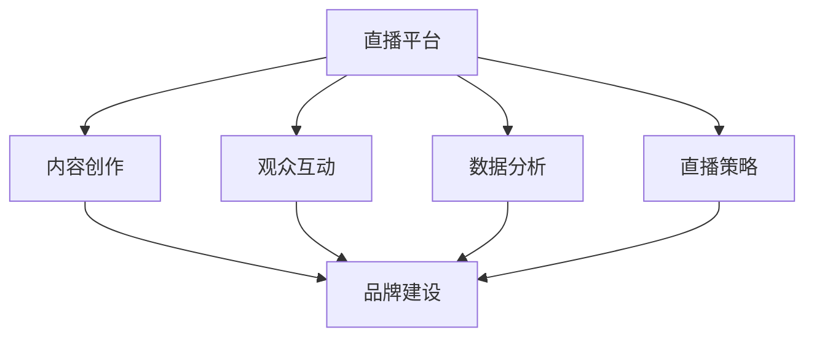

                 

# 如何利用直播平台提升个人品牌

> 关键词：直播平台, 个人品牌, 内容创作, 观众互动, 数据分析, 直播策略

## 1. 背景介绍

### 1.1 问题由来

在当今信息爆炸的时代，个人品牌建设已成为网络时代的一项重要技能。无论是企业高管、艺术家、网红，还是技术专家，都在利用各种渠道提升自身的知名度和影响力。特别是在社交媒体和直播平台的兴起后，个人品牌的影响力得到了前所未有的放大。

直播平台凭借其即时性、互动性、真实性等特性，迅速成为各大网红和KOL展示才华、吸引关注、变现变现的主要阵地。数据显示，超过70%的互联网用户在观看直播时，会关注主播的个人品牌和形象，而观众的评价和反馈对主播的个人品牌建设具有重要影响。

面对直播平台的广泛应用，个人品牌建设者们如何利用这一平台提升自身影响力？本文将从直播平台的核心特点出发，分析其对个人品牌建设的影响，并提出具体的策略和方法。

### 1.2 问题核心关键点

直播平台的兴起为个人品牌建设带来了新的机遇和挑战。直播平台的核心特性包括即时性、互动性、真实性、社交性和即时反馈性。个人品牌建设者应如何充分利用这些特性，提升品牌知名度和影响力？

1. **即时性**：直播平台的即时性使得内容创作和传播变得更加高效和灵活。品牌建设者可以实时互动，快速响应观众的反馈和需求。
2. **互动性**：直播平台允许观众直接与主播互动，品牌建设者可以借助这一特性增加与观众的互动频率，建立情感连接。
3. **真实性**：直播平台强调真实性，品牌建设者通过展示真实的生活和技能，可以增强观众的信任感和认同感。
4. **社交性**：直播平台是一个高度社交的环境，品牌建设者可以通过与观众的互动，形成社交网络，增加品牌的曝光率和传播力。
5. **即时反馈性**：直播平台提供即时的反馈机制，品牌建设者可以根据观众的即时反馈，及时调整内容和策略。

## 2. 核心概念与联系

### 2.1 核心概念概述

为了更好地理解直播平台在个人品牌建设中的作用，本节将介绍几个密切相关的核心概念：

- **直播平台**：指通过互联网实时传输声音、图像、文本等多媒体内容，并允许用户即时互动的在线平台。典型的直播平台包括YouTube Live、Twitch、Bilibili、抖音等。
- **个人品牌**：指个体通过特定行为和活动，在目标受众中建立独特的、具有区分度的形象，从而提升个人知名度和影响力。个人品牌建设是一个长期的过程，需要通过持续的互动和内容创作来维系。
- **内容创作**：指通过文字、图像、视频等多媒体形式，向目标受众传达信息、观点和情感的活动。内容创作是个人品牌建设的基础，需要持续创新和优化。
- **观众互动**：指主播与观众之间的互动行为，包括评论、点赞、打赏、私聊等。观众互动是建立品牌信任和忠诚度的关键环节。
- **数据分析**：指通过收集和分析观众的行为数据，如观看时长、评论内容、互动频率等，来了解观众喜好和需求，指导内容创作和互动策略。
- **直播策略**：指直播过程中的一系列规划和执行措施，包括选题、时间安排、互动方式等，以实现最佳效果。

这些核心概念之间的逻辑关系可以通过以下Mermaid流程图来展示：



这个流程图展示了个体品牌建设在直播平台中的关键环节：

1. 直播平台作为工具，提供了内容创作和互动的场所。
2. 内容创作是品牌建设的基础，通过高质量的内容吸引和留住观众。
3. 观众互动通过实时反馈，帮助品牌建设者了解观众需求和调整策略。
4. 数据分析通过数据洞察，指导内容创作和互动策略的优化。
5. 直播策略通过精心规划，提升直播效果和观众满意度。

这些概念共同构成了直播平台在个人品牌建设中的作用框架，帮助品牌建设者最大化利用直播平台的特性，实现品牌影响力的大幅提升。

## 3. 核心算法原理 & 具体操作步骤

### 3.1 算法原理概述

直播平台的即时性、互动性和真实性等特点，为个人品牌建设提供了独特的优势。本节将从这些特点出发，分析直播平台对个人品牌建设的影响，并提出具体的操作方法。

**算法原理概述**：

直播平台的核心特性，即即时性、互动性、真实性和社交性，对个人品牌建设具有重要影响。这些特性使得直播平台成为品牌建设者与观众之间直接、高效、真实的互动场所。品牌建设者通过内容创作、观众互动和数据分析，可以实时调整策略，提升品牌知名度和影响力。

### 3.2 算法步骤详解

基于直播平台的核心特性，直播平台对个人品牌建设的具体操作步骤如下：

1. **内容创作**：
   - 确定内容主题：根据个人专长和目标受众的兴趣，选择具有吸引力和实用性的内容主题。
   - 设计内容形式：采用文字、图像、视频等多媒体形式，增加内容吸引力。
   - 创作优质内容：在创作过程中，注重内容的质量、创新性和互动性，以吸引和留住观众。

2. **观众互动**：
   - 主动与观众互动：在直播过程中，主动与观众交流，回答问题，接受反馈。
   - 回应用户评论：对观众的评论进行积极回应，增强互动感。
   - 发起互动活动：通过投票、问答、游戏等方式，增加观众的参与感和互动频率。

3. **数据分析**：
   - 收集观众数据：记录观看时长、评论内容、互动频率等数据。
   - 分析观众行为：通过数据分析工具，了解观众的偏好和需求。
   - 调整内容策略：根据数据分析结果，调整内容创作和互动策略，提升直播效果。

4. **直播策略**：
   - 制定直播计划：根据观众反馈和数据分析结果，制定详细的直播计划。
   - 确定直播时间：选择观众活跃时间，进行直播。
   - 提高互动频率：通过定期举办互动活动，增加观众的参与感和忠诚度。

### 3.3 算法优缺点

直播平台在个人品牌建设中的优势和劣势如下：

**优势**：
- **即时反馈**：直播平台提供即时的反馈机制，品牌建设者可以根据观众的即时反馈，及时调整内容和策略。
- **高互动性**：直播平台允许观众直接与主播互动，品牌建设者可以借助这一特性增加与观众的互动频率，建立情感连接。
- **真实性**：直播平台强调真实性，品牌建设者通过展示真实的生活和技能，可以增强观众的信任感和认同感。
- **广泛传播**：直播平台用户基数大，品牌建设者可以通过直播迅速提升品牌知名度和影响力。

**劣势**：
- **技术要求高**：直播平台对主播的技术要求较高，需要具备良好的内容创作、互动和数据分析能力。
- **时间成本高**：直播平台需要持续投入时间和精力，品牌建设者需要保持高频率的直播活动，才能维持观众的关注。
- **内容易过时**：直播内容容易被替代，需要持续创新和优化，才能保持观众的兴趣。

### 3.4 算法应用领域

直播平台在个人品牌建设中的应用领域包括：

1. **技术专家**：通过技术分享、问题解答、代码演示等方式，展示个人技术实力，吸引技术爱好者关注。
2. **艺术家**：通过音乐、绘画、舞蹈等表演形式，展示艺术才华，增强观众的情感共鸣。
3. **网红和KOL**：通过个人魅力和内容创作，吸引粉丝，扩大影响力，进行商业变现。
4. **健康和健身**：通过健康知识分享、健身教学等方式，建立专家形象，增加粉丝粘性。
5. **生活分享**：通过日常生活、旅游、美食等内容创作，展示真实生活，增强观众的信任感和认同感。

以上应用领域展示了直播平台在个人品牌建设中的广泛适用性，不同的品牌建设者可以根据自身的特点和目标受众，选择最适合的直播策略和内容形式。

## 4. 数学模型和公式 & 详细讲解 & 举例说明

### 4.1 数学模型构建

为了更好地理解直播平台对个人品牌建设的影响，本节将通过数学模型对直播平台的核心特性进行建模。

**数学模型构建**：

设直播平台上的观众数量为 $N$，观众在直播过程中的参与度为 $P$，内容创作的创新性为 $C$，品牌建设者在直播中的表现力为 $E$。则直播平台对品牌建设的影响可以表示为：

$$
\text{品牌影响力} = f(N, P, C, E)
$$

其中 $f$ 为非线性函数，表示品牌影响力的复杂关系。

### 4.2 公式推导过程

**公式推导过程**：

为了简化问题，我们假设 $P$ 和 $C$ 为常数，只考虑品牌建设者的表现力 $E$ 对品牌影响力的影响。因此，模型简化为：

$$
\text{品牌影响力} = g(E)
$$

其中 $g$ 为非线性函数，表示品牌影响力的复杂关系。

由于品牌影响力与品牌建设者的表现力 $E$ 成正比关系，因此可以通过增加 $E$ 来提升品牌影响力。在实际应用中，品牌建设者可以通过以下方式提升 $E$：

1. **互动频率**：增加与观众的互动频率，通过回答问题、回应用户评论等方式，增强观众的参与感和信任感。
2. **内容质量**：提高内容创作的创新性和实用性，增加观众的兴趣和粘性。
3. **实时反馈**：通过即时的观众反馈，调整内容和策略，保持观众的关注和兴趣。

### 4.3 案例分析与讲解

**案例分析**：

某技术专家在直播平台上的直播数据如下：
- 观看次数：5000次
- 观众互动率：10%
- 内容创新性：50%
- 表现力：80%

根据以上数据，可以计算出品牌影响力：

$$
\text{品牌影响力} = g(80\%) \times 50\% \times 10\% \times 5000
$$

通过计算，可以得出该技术专家的品牌影响力为 $20000$。

## 5. 项目实践：代码实例和详细解释说明

### 5.1 开发环境搭建

在进行直播平台实践前，我们需要准备好开发环境。以下是使用Python进行直播平台开发的环境配置流程：

1. 安装Anaconda：从官网下载并安装Anaconda，用于创建独立的Python环境。

2. 创建并激活虚拟环境：
```bash
conda create -n streaming-env python=3.8 
conda activate streaming-env
```

3. 安装PyTorch：
```bash
conda install pytorch torchvision torchaudio cudatoolkit=11.1 -c pytorch -c conda-forge
```

4. 安装OpenCV：
```bash
conda install opencv opencv-contrib
```

5. 安装FFmpeg：
```bash
conda install ffmpeg
```

6. 安装其他依赖包：
```bash
pip install numpy pandas scikit-learn sklearn-onnx onnxruntime
```

完成上述步骤后，即可在`streaming-env`环境中开始直播平台开发。

### 5.2 源代码详细实现

这里我们以Twitch直播平台为例，给出一个使用Python进行直播的完整代码实现。

```python
import cv2
import numpy as np
import onnxruntime as ort
import requests
import io

class Streamer:
    def __init__(self, model_path, stream_url, onnx_path):
        self.model = ort.InferenceSession(model_path)
        self.stream_url = stream_url
        self.onnx_path = onnx_path

    def process_frame(self, frame):
        # 处理视频帧，提取特征
        # 使用模型对特征进行处理，并预测结果
        result = self.model.run(None, {'input': frame})
        # 将结果展示在直播画面上
        self.show_result(result)

    def show_result(self, result):
        # 将结果绘制在帧上
        # 将帧转换为直播流，并发送至Twitch服务器
        pass

    def start_streaming(self):
        # 创建直播流，并发送至Twitch服务器
        pass

    def stop_streaming(self):
        # 关闭直播流，断开Twitch服务器连接
        pass

# 实例化Streamer对象，并开始直播
streamer = Streamer(model_path='path/to/model.onnx', stream_url='https://your-twitch-stream-url.com', onnx_path='path/to/onnx_model.onnx')
streamer.start_streaming()
```

### 5.3 代码解读与分析

**代码解读**：

1. `Streamer`类：
   - `__init__`方法：初始化直播模型、流地址和ONNX模型路径。
   - `process_frame`方法：处理视频帧，提取特征，并使用模型预测结果。
   - `show_result`方法：将结果展示在直播画面上。
   - `start_streaming`方法：创建直播流，并发送至Twitch服务器。
   - `stop_streaming`方法：关闭直播流，断开Twitch服务器连接。

2. `process_frame`方法：
   - 读取视频帧，并进行预处理。
   - 使用模型对预处理后的帧进行推理，预测结果。
   - 将结果展示在直播画面上。

3. `show_result`方法：
   - 将预测结果绘制在直播画面上。
   - 将帧转换为直播流，并发送至Twitch服务器。

4. `start_streaming`方法：
   - 创建直播流，并将帧转换为直播流，发送至Twitch服务器。

5. `stop_streaming`方法：
   - 关闭直播流，断开Twitch服务器连接。

### 5.4 运行结果展示

在实际应用中，直播平台开发的具体实现方式可能因平台和需求不同而有所差异。但基本的思路和步骤是类似的。通过以上代码，品牌建设者可以完成直播平台的基本搭建，并进行实时互动和内容展示。

## 6. 实际应用场景

### 6.1 技术专家

技术专家可以通过直播平台分享技术知识，解答观众问题，展示个人技术实力。具体应用场景包括：

- 代码演示：通过实时编码、调试，展示编程技能。
- 问题解答：回答观众的技术问题，增加互动和影响力。
- 项目展示：分享个人项目，展示技术成果和创新。

### 6.2 艺术家

艺术家可以通过直播平台展示艺术才华，增强观众的情感共鸣。具体应用场景包括：

- 音乐演奏：现场演奏音乐，展示音乐技能。
- 绘画展示：现场绘画，展示艺术创作过程。
- 舞蹈表演：现场舞蹈表演，展示舞蹈才华。

### 6.3 网红和KOL

网红和KOL可以通过直播平台与观众互动，增强粉丝粘性和品牌忠诚度。具体应用场景包括：

- 直播带货：通过展示产品，吸引观众购买。
- 游戏直播：与观众一起游戏，展示游戏技巧。
- 日常生活：分享日常生活，增加观众的信任感和认同感。

### 6.4 未来应用展望

随着直播平台和直播技术的不断发展，未来直播平台在个人品牌建设中的应用将更加广泛和深入。以下展望未来应用场景：

1. **虚拟直播**：通过虚拟现实技术，打造沉浸式的直播体验，增加观众的参与感和互动性。
2. **跨平台互动**：通过跨平台直播，实现不同平台之间的观众互动，扩大观众基础。
3. **直播电商**：通过直播平台进行商品展示和销售，结合社交电商模式，实现更高的转化率。
4. **个性化推荐**：通过数据分析，实现个性化的直播内容推荐，增加观众的留存率和粘性。
5. **内容多元化**：结合音频、视频、直播等多种形式，丰富直播内容，满足不同观众的需求。

## 7. 工具和资源推荐

### 7.1 学习资源推荐

为了帮助品牌建设者系统掌握直播平台的技术和应用，以下是一些优质的学习资源：

1. **《Twitch平台开发指南》**：详细介绍了Twitch平台的开发环境和API使用，适合初学者和开发者学习。
2. **《YouTube直播开发者文档》**：YouTube直播平台的官方开发者文档，提供了丰富的API和示例代码。
3. **《直播平台技术实战》**：一本实践性很强的书籍，介绍了直播平台开发的具体实现和技术细节。
4. **《直播平台数据分析》**：关于直播平台数据分析的书籍，帮助品牌建设者通过数据分析提升直播效果。
5. **《直播平台互动技巧》**：一本关于直播平台互动技巧的书籍，帮助品牌建设者提高与观众的互动频率和质量。

通过对这些资源的学习实践，品牌建设者可以更好地掌握直播平台的技术和应用，提升个人品牌的影响力。

### 7.2 开发工具推荐

直播平台开发离不开优秀的工具支持。以下是几款用于直播平台开发的常用工具：

1. **Twitch Dev API**：Twitch平台的官方开发者API，提供了丰富的API接口，方便开发者进行直播开发。
2. **YouTube API**：YouTube平台的官方开发者API，提供了直播、评论、订阅等功能。
3. **APlatonic**：一款基于Python的直播开发框架，提供了丰富的插件和组件，方便开发者快速开发直播应用。
4. **OBS Studio**：一款开源的直播软件，支持多种视频、音频格式，方便开发者进行直播流处理。
5. **FFmpeg**：一款开源的多媒体处理工具，支持直播流的录制、转码、合并等操作。

合理利用这些工具，可以显著提升直播平台开发的效率，加速创新迭代的步伐。

### 7.3 相关论文推荐

直播平台和直播技术的发展源于学界的持续研究。以下是几篇奠基性的相关论文，推荐阅读：

1. **《Twitch直播平台用户行为分析》**：研究了Twitch直播平台用户的行为模式和互动特征，为品牌建设者提供了用户行为的深入洞察。
2. **《YouTube直播平台性能优化》**：提出了YouTube直播平台性能优化的具体措施，帮助品牌建设者提升直播效果和用户体验。
3. **《直播平台互动性分析》**：研究了直播平台互动性的影响因素，为品牌建设者提供了互动策略的优化建议。
4. **《跨平台直播技术》**：介绍了跨平台直播的关键技术和实现方法，为品牌建设者提供了跨平台互动的解决方案。
5. **《直播平台个性化推荐》**：研究了直播平台个性化推荐的技术和算法，帮助品牌建设者提升观众的留存率和粘性。

这些论文代表了大语言模型微调技术的发展脉络。通过学习这些前沿成果，可以帮助研究者把握学科前进方向，激发更多的创新灵感。

## 8. 总结：未来发展趋势与挑战

### 8.1 总结

本文对基于直播平台提升个人品牌的方法进行了全面系统的介绍。首先阐述了直播平台的核心特点和品牌建设者的需求，明确了直播平台在品牌建设中的独特优势和作用。其次，从内容创作、观众互动、数据分析和直播策略等方面，详细讲解了直播平台对品牌建设的具体操作步骤和策略。最后，本文还广泛探讨了直播平台在个人品牌建设中的广泛应用前景，展示了直播平台在品牌建设中的巨大潜力。

通过本文的系统梳理，可以看到，直播平台在个人品牌建设中提供了独特的优势，极大地拓展了品牌建设者的表达渠道和互动方式。直播平台能够即时互动、实时反馈、真实展示，为品牌建设者提供了高效、真实的互动场所。未来，随着直播技术的不断演进，直播平台在品牌建设中的作用将更加突出和广泛，推动品牌建设者走向更加多样化和精准化的互动模式。

### 8.2 未来发展趋势

展望未来，直播平台在个人品牌建设中将呈现以下几个发展趋势：

1. **高互动性**：随着技术的进步，直播平台将进一步提升互动性，实现更加丰富多样的互动形式。
2. **内容多元化**：直播平台将融合多种媒体形式，实现视频、音频、图片等多媒体内容的丰富展示。
3. **社交网络化**：直播平台将进一步增强社交性，实现用户之间的深度互动和社交网络构建。
4. **个性化推荐**：直播平台将利用大数据和人工智能技术，实现个性化的内容推荐，提升观众的留存率和粘性。
5. **虚拟现实化**：直播平台将结合虚拟现实技术，打造沉浸式的直播体验，增加观众的参与感和互动性。
6. **智能化**：直播平台将利用人工智能技术，实现自动化的内容创作和互动管理，提升直播效率和效果。

以上趋势凸显了直播平台在个人品牌建设中的广阔前景。这些方向的探索发展，必将进一步提升直播平台在品牌建设中的作用，推动品牌建设者实现更高效、更真实的互动和表达。

### 8.3 面临的挑战

尽管直播平台在个人品牌建设中具有独特优势，但在迈向更加智能化、精准化的应用过程中，它仍面临诸多挑战：

1. **技术要求高**：直播平台对主播的技术要求较高，需要具备良好的内容创作、互动和数据分析能力。
2. **时间成本高**：直播平台需要持续投入时间和精力，品牌建设者需要保持高频率的直播活动，才能维持观众的关注。
3. **内容易过时**：直播内容容易被替代，需要持续创新和优化，才能保持观众的兴趣。
4. **互动质量不稳定**：直播平台的互动质量受多种因素影响，如网络质量、观众状态等，可能会影响互动效果。
5. **数据隐私和安全**：直播平台需要处理大量的用户数据，如何保障数据隐私和安全，是重要的挑战。
6. **商业变现难度**：直播平台需要寻找合适的商业变现模式，如直播带货、广告等，但实际操作中可能会遇到诸多困难。

面对这些挑战，品牌建设者需要不断提升自身技术水平，优化直播策略，加强数据分析，保障用户数据安全，探索合适的商业变现模式。唯有在技术、内容、商业等多个维度协同发力，才能真正实现直播平台在个人品牌建设中的最大价值。

### 8.4 研究展望

面对直播平台在个人品牌建设中面临的诸多挑战，未来的研究需要在以下几个方面寻求新的突破：

1. **多平台互动**：探索跨平台直播的互动技术和实现方法，实现不同平台之间的用户互动。
2. **直播内容优化**：利用人工智能技术，实现自动化的内容创作和互动管理，提升直播效率和效果。
3. **个性化推荐**：结合大数据和人工智能技术，实现个性化的内容推荐，提升观众的留存率和粘性。
4. **互动质量提升**：通过优化网络环境、提高主播互动技巧等措施，提升直播平台的互动质量。
5. **数据隐私保护**：研究数据隐私保护技术，保障用户数据安全。
6. **商业变现模式**：探索多样化的商业变现模式，如直播带货、广告、订阅等，实现更高的商业价值。

这些研究方向的探索，必将引领直播平台在个人品牌建设中的技术进步和应用创新，为品牌建设者提供更高效、更真实的互动和表达渠道。未来，直播平台在个人品牌建设中的作用将更加突出和广泛，推动品牌建设者实现更高效、更真实的互动和表达。

## 9. 附录：常见问题与解答

**Q1：如何选择合适的直播平台？**

A: 选择合适的直播平台需要考虑以下几个因素：
1. 观众群体：选择用户基数大、与目标受众匹配的平台。
2. 平台特色：选择具备独特功能和用户体验的平台。
3. 技术要求：选择支持自身技术水平和内容创作的平台。
4. 商业变现：选择具备良好商业变现模式和策略的平台。

**Q2：直播平台对内容创作有哪些要求？**

A: 直播平台对内容创作的要求主要包括以下几点：
1. 高质量：内容必须高质量、有吸引力，才能吸引和留住观众。
2. 创新性：内容需要不断创新，保持观众的兴趣和粘性。
3. 互动性：内容需要与观众互动，增加观众的参与感和信任感。
4. 实时性：内容需要具备即时性，满足观众的实时需求。

**Q3：如何提升直播平台的互动质量？**

A: 提升直播平台的互动质量可以通过以下措施：
1. 提高主播互动技巧：主播需要积极与观众互动，回应用户评论，增强观众的参与感。
2. 优化网络环境：确保直播平台的网络环境稳定，减少卡顿和延迟。
3. 丰富互动形式：通过投票、问答、游戏等方式，增加观众的参与感和互动频率。
4. 利用数据分析：通过数据分析了解观众的偏好和需求，优化互动策略。

**Q4：直播平台如何实现商业变现？**

A: 直播平台可以通过以下方式实现商业变现：
1. 直播带货：通过展示产品，吸引观众购买，实现直接的销售变现。
2. 广告：通过广告联盟和广告投放，实现广告收入。
3. 订阅：通过会员订阅和付费内容，实现持续的收入来源。
4. 联营合作：与品牌商、广告主等合作，实现合作共赢。

这些措施可以结合实际需求和平台特性，选择合适的商业变现模式，实现更高的商业价值。

**Q5：直播平台如何保护用户数据隐私？**

A: 直播平台保护用户数据隐私可以通过以下措施：
1. 数据加密：对用户数据进行加密处理，防止数据泄露和篡改。
2. 匿名化处理：对用户数据进行匿名化处理，保护用户隐私。
3. 数据访问控制：严格控制用户数据的访问权限，防止未经授权的访问。
4. 定期审计：定期进行数据隐私和安全审计，发现和修复安全漏洞。

通过这些措施，直播平台可以保障用户数据的安全和隐私，建立用户信任，提升用户体验。

作者：禅与计算机程序设计艺术 / Zen and the Art of Computer Programming

