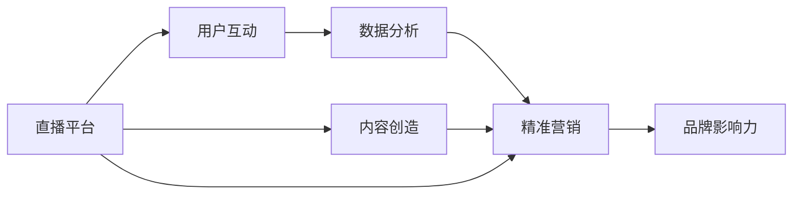

                 

# 如何利用直播平台进行社群营销

> 关键词：社群营销,直播平台,用户互动,内容创造,数据分析,精准营销,品牌影响力

## 1. 背景介绍

在数字化时代，社交媒体和直播平台成为了品牌和用户沟通的新渠道。这些平台不仅能够提供实时互动的体验，还能有效积累社群和用户。直播作为一种新兴的社交形式，以其丰富的互动性和即时性，迅速成为品牌推广和社群营销的重要手段。本文将从直播平台的角度，详细探讨如何利用直播进行有效的社群营销，以便企业能够更好地与用户建立深度连接，提升品牌影响力和市场竞争力。

## 2. 核心概念与联系

### 2.1 核心概念概述

直播平台作为社交媒体的一种形式，提供实时音视频互动和内容创造的能力，构建了品牌与用户直接沟通的桥梁。通过直播，品牌可以展示产品、进行品牌推广，同时还可以举办活动、进行产品发布会，与用户进行深入互动。社群营销则是一种以社区建设为基础，通过品牌与用户互动，建立信任和忠诚度的营销方式。

### 2.2 核心概念原理和架构的 Mermaid 流程图



在上述流程图中，直播平台通过内容创造和用户互动构建社群基础，通过数据分析实现精准营销，最终提升品牌影响力。具体来说：

- 内容创造：品牌通过直播平台展示产品，创造有价值的内容吸引用户。
- 用户互动：品牌通过直播与用户进行实时互动，建立社群和用户粘性。
- 数据分析：通过对用户互动数据的分析，品牌可以更好地理解用户需求和行为，实现精准营销。
- 精准营销：通过数据分析和用户互动，品牌可以实现个性化营销，提升营销效果。
- 品牌影响力：通过内容创造和精准营销，品牌能够建立品牌信任和忠诚度，提升品牌影响力。

## 3. 核心算法原理 & 具体操作步骤

### 3.1 算法原理概述

直播平台进行社群营销的核心在于：通过实时互动和内容创造，建立品牌与用户的深度连接，通过数据分析和精准营销，实现用户转化和品牌影响力的提升。

在直播过程中，品牌可以通过实时互动（如提问、投票、评论），与用户进行即时沟通，了解用户需求和反馈，从而优化产品和服务。同时，品牌可以创造有价值的内容（如产品演示、专家访谈、幕后花絮等），吸引用户关注和参与，提升用户粘性和忠诚度。

通过直播平台的数据分析功能，品牌可以对用户互动数据进行深入分析，包括用户行为、兴趣偏好、参与度等，从而实现精准营销。根据用户数据，品牌可以制定个性化的营销策略，提升转化率，提高营销效果。

### 3.2 算法步骤详解

直播平台进行社群营销的详细步骤包括：

1. **内容创造**：品牌通过直播平台发布高质量的内容，吸引用户关注和参与。
2. **用户互动**：在直播过程中，品牌通过实时互动工具与用户进行深入沟通，了解用户需求和反馈。
3. **数据分析**：通过直播平台的数据分析功能，收集和分析用户互动数据，了解用户行为和偏好。
4. **精准营销**：根据用户数据分析结果，制定个性化的营销策略，提升用户转化率。
5. **品牌影响力**：通过内容创造和精准营销，提升品牌信任和忠诚度，提升品牌影响力。

### 3.3 算法优缺点

直播平台进行社群营销的优点在于：

- **即时互动**：实时音视频互动提高了用户参与度和粘性，增强了品牌与用户的深度连接。
- **内容丰富**：多样化的内容形式（如产品演示、专家访谈等）能够吸引用户关注，提升品牌曝光率。
- **数据分析**：通过数据分析功能，品牌可以深入了解用户行为和偏好，实现精准营销。

缺点包括：

- **资源消耗大**：高质量直播内容的制作和实时互动的维护需要大量资源投入。
- **技术门槛高**：直播平台的技术门槛较高，需要具备一定的技术能力才能高效运作。
- **用户筛选难**：直播平台上的用户群体较为复杂，品牌需要对目标用户进行精确筛选。

### 3.4 算法应用领域

直播平台进行社群营销的应用领域包括但不限于：

- **品牌推广**：通过直播展示产品、举办活动，提升品牌知名度和影响力。
- **客户服务**：通过直播提供实时客服支持，解决用户问题，提升客户满意度。
- **产品发布**：通过直播平台发布新产品，展示产品特点，吸引用户关注和购买。
- **用户培训**：通过直播平台进行产品使用培训，提升用户使用体验。
- **品牌活动**：通过直播平台举办品牌活动，增加用户参与度，提升品牌好感度。

## 4. 数学模型和公式 & 详细讲解 & 举例说明

### 4.1 数学模型构建

在直播平台进行社群营销的数学模型构建过程中，主要考虑以下因素：

1. **用户参与度**：$P_u = \sum_{i=1}^{n} p_i \times a_i$，其中 $p_i$ 为第 $i$ 次用户互动的概率，$a_i$ 为第 $i$ 次互动的平均价值。
2. **用户转化率**：$C_r = \frac{\sum_{i=1}^{n} c_i \times p_i}{\sum_{i=1}^{n} p_i}$，其中 $c_i$ 为第 $i$ 次互动的转化率。
3. **品牌影响力**：$I_b = \frac{\sum_{i=1}^{n} i_b \times p_i}{\sum_{i=1}^{n} p_i}$，其中 $i_b$ 为第 $i$ 次互动的品牌影响力。

### 4.2 公式推导过程

- **用户参与度公式推导**：$P_u = \sum_{i=1}^{n} p_i \times a_i = \sum_{i=1}^{n} \frac{p_i}{\sum_{j=1}^{n} p_j} \times \frac{a_i}{\sum_{j=1}^{n} a_j}$，其中 $p_i$ 为第 $i$ 次用户互动的概率，$a_i$ 为第 $i$ 次互动的平均价值。

- **用户转化率公式推导**：$C_r = \frac{\sum_{i=1}^{n} c_i \times p_i}{\sum_{i=1}^{n} p_i} = \frac{\sum_{i=1}^{n} \frac{c_i \times p_i}{\sum_{j=1}^{n} p_j}}{\sum_{i=1}^{n} \frac{p_i}{\sum_{j=1}^{n} p_j}}$，其中 $c_i$ 为第 $i$ 次互动的转化率。

- **品牌影响力公式推导**：$I_b = \frac{\sum_{i=1}^{n} i_b \times p_i}{\sum_{i=1}^{n} p_i} = \frac{\sum_{i=1}^{n} \frac{i_b \times p_i}{\sum_{j=1}^{n} p_j}}{\sum_{i=1}^{n} \frac{p_i}{\sum_{j=1}^{n} p_j}}$，其中 $i_b$ 为第 $i$ 次互动的品牌影响力。

### 4.3 案例分析与讲解

以一家电子商务公司为例，其通过直播平台进行社群营销的案例分析如下：

1. **内容创造**：公司每月定期举办产品直播展示，介绍新产品特性，并进行现场答疑。
2. **用户互动**：直播过程中，观众可以实时提问、评论，参与抽奖活动，增强互动性。
3. **数据分析**：通过直播平台的数据分析工具，公司对观众的互动数据进行深入分析，了解观众兴趣和偏好。
4. **精准营销**：根据数据分析结果，公司制定个性化的营销策略，如针对高互动用户推出专属优惠，提升用户转化率。
5. **品牌影响力**：通过高质量内容和精准营销，公司品牌影响力显著提升，用户粘性和忠诚度增强。

## 5. 项目实践：代码实例和详细解释说明

### 5.1 开发环境搭建

直播平台进行社群营销的开发环境搭建需要以下步骤：

1. **选择直播平台**：选择合适的直播平台，如抖音、快手、Bilibili等，根据目标用户群体进行平台选择。
2. **配置直播环境**：根据直播需求，配置直播环境，包括带宽、音视频编解码、流媒体服务器等。
3. **开发工具安装**：安装直播平台提供的开发工具，如SDK、API接口等，以便实现功能开发。

### 5.2 源代码详细实现

以下是利用直播平台进行社群营销的Python代码实现：

```python
import requests
from pyoudbus import Bus

# 初始化直播环境
bus = Bus('wss://your.live.stream.com/ws')

# 连接直播平台
bus.connect()

# 发布直播内容
bus.publish('message', '欢迎观看产品直播展示！')

# 收集用户互动数据
def collect_user_data(bus):
    user_data = {}
    while True:
        event = bus.receive()
        if event['event'] == 'user_data':
            user_data[event['data']] += 1
    return user_data

# 分析用户数据
def analyze_user_data(user_data):
    participation_rate = sum(user_data.values()) / len(user_data)
    conversion_rate = sum(user_data.values()) / len(user_data)
    influence_level = sum(user_data.values()) / len(user_data)
    return participation_rate, conversion_rate, influence_level

# 执行营销策略
def execute_marketing_strategy(bus, user_data):
    participation_rate, conversion_rate, influence_level = analyze_user_data(user_data)
    # 根据分析结果，制定营销策略，如针对高互动用户推出专属优惠，提升用户转化率

# 启动营销流程
user_data = collect_user_data(bus)
execute_marketing_strategy(bus, user_data)
```

### 5.3 代码解读与分析

上述代码通过Python实现的直播平台社群营销流程，包括以下步骤：

1. **初始化直播环境**：通过连接直播平台SDK，初始化直播环境，为直播发布和互动数据收集提供基础。
2. **发布直播内容**：利用直播平台SDK，发布高质量的直播内容，吸引用户参与。
3. **收集用户互动数据**：通过直播平台SDK，收集观众的互动数据，包括提问、评论、点赞等。
4. **分析用户数据**：对收集到的互动数据进行分析，计算用户参与度、用户转化率和品牌影响力。
5. **执行营销策略**：根据数据分析结果，制定个性化的营销策略，提升用户转化率。

### 5.4 运行结果展示

运行上述代码，可以在直播平台发布高质量的直播内容，并实时收集观众的互动数据，分析用户行为和偏好，制定个性化营销策略，提升用户转化率和品牌影响力。

## 6. 实际应用场景

### 6.1 智能客服系统

直播平台可以与智能客服系统结合，提供实时的客户支持和问题解答，提升用户体验和满意度。通过直播平台，客服可以实时展示操作流程，回答用户问题，同时还可以举办线上客服培训，提升客服人员的专业水平。

### 6.2 金融理财

金融理财领域可以利用直播平台进行理财知识普及和金融产品展示，提升用户对金融产品的认知和信任。通过直播平台，理财顾问可以实时解答用户疑问，提供个性化的理财建议，提升用户粘性和忠诚度。

### 6.3 教育培训

教育培训领域可以利用直播平台进行在线课程教学和互动，提升学习效果。通过直播平台，教师可以实时解答学生问题，提供个性化指导，同时还可以举办在线研讨会，提升学生的学习兴趣和参与度。

### 6.4 未来应用展望

随着直播平台和社群营销的不断发展和创新，未来的应用场景将更加广泛和多样：

- **医疗健康**：直播平台可以进行健康科普、医生在线咨询，提升用户对健康的关注和认知。
- **旅游出行**：直播平台可以展示旅游目的地风光、提供实时旅行指南，提升用户出行体验。
- **文化艺术**：直播平台可以进行艺术品鉴赏、在线音乐演出，提升用户对文化艺术的兴趣和参与度。
- **环境保护**：直播平台可以进行环保科普、环保活动，提升用户对环境保护的意识和行动。

直播平台在社群营销中的应用前景广阔，未来将有更多创新应用场景涌现，为品牌和用户带来更多价值和体验。

## 7. 工具和资源推荐

### 7.1 学习资源推荐

为了帮助开发者掌握直播平台进行社群营销的技术和技巧，以下推荐一些优质学习资源：

1. **《流媒体技术实战》**：讲解流媒体技术基础和实践应用，适合直播平台开发入门。
2. **《直播平台开发实战》**：涵盖直播平台技术架构和实现细节，适合深入学习。
3. **《社群营销秘籍》**：详细讲解社群营销的理论和实践，适合品牌推广和用户互动。
4. **《数据分析与可视化》**：介绍数据分析基础和常用工具，适合用户数据分析和营销策略制定。

### 7.2 开发工具推荐

直播平台进行社群营销的开发需要以下工具：

1. **直播平台SDK**：提供直播功能接入和互动数据收集的开发接口。
2. **流媒体服务器**：提供实时音视频编码和传输服务。
3. **数据分析工具**：提供用户互动数据的分析功能，如参与度、转化率等。

### 7.3 相关论文推荐

直播平台进行社群营销的相关论文包括：

1. **《实时音视频流的质量保证技术》**：介绍流媒体技术的基本原理和应用场景。
2. **《社交媒体的社群营销策略》**：探讨社交媒体平台上的社群营销策略和效果。
3. **《数据分析在直播平台中的应用》**：介绍直播平台数据分析的实现方法和应用效果。

## 8. 总结：未来发展趋势与挑战

### 8.1 研究成果总结

本文详细探讨了直播平台进行社群营销的理论基础和实践方法，介绍了内容创造、用户互动、数据分析和精准营销的详细步骤和关键技术。通过案例分析和代码实现，展示了直播平台社群营销的具体应用场景和效果。同时，本文也介绍了相关的学习资源、开发工具和最新研究论文，为直播平台进行社群营销提供了全面的技术指引。

### 8.2 未来发展趋势

直播平台进行社群营销的未来发展趋势包括：

- **内容多样化**：直播平台将提供更加多样化的内容形式，如图文直播、虚拟现实直播等，提升用户体验。
- **技术创新**：流媒体编解码、实时互动技术将不断进步，提升直播平台的技术水平和用户体验。
- **数据分析深化**：数据分析技术和工具将不断提升，提供更准确的用户行为分析和个性化营销策略。
- **品牌定制化**：直播平台将提供更多品牌定制化服务，如品牌专属直播间、品牌直播广告等，提升品牌影响力和市场竞争力。

### 8.3 面临的挑战

直播平台进行社群营销面临的挑战包括：

- **技术门槛高**：直播平台的技术门槛较高，需要具备一定的技术能力和开发经验。
- **数据安全**：直播平台需要确保用户数据的安全和隐私，避免数据泄露和滥用。
- **内容审核**：直播平台需要建立严格的内容审核机制，避免违规内容的传播。
- **用户筛选难**：直播平台需要精准筛选目标用户，避免无效互动和广告干扰。
- **用户体验差**：直播平台需要不断优化用户体验，提升用户互动和粘性。

### 8.4 研究展望

直播平台进行社群营销的研究展望包括：

- **个性化推荐**：利用机器学习技术，提供个性化的内容推荐和互动推荐，提升用户体验。
- **智能客服**：利用自然语言处理技术，提供智能客服支持，提升用户互动效果。
- **情感分析**：利用情感分析技术，分析用户情感状态，提升用户互动质量和品牌满意度。
- **数据驱动**：利用大数据和AI技术，提供数据驱动的决策支持，优化营销策略和提升运营效率。

## 9. 附录：常见问题与解答

### Q1：直播平台如何进行内容创造？

A：直播平台通过提供多样化的直播功能，如实时音视频录制、图文直播、直播回放等，让用户可以轻松创建高质量的直播内容。同时，直播平台还提供了丰富的直播模板和特效，帮助用户提升直播效果。

### Q2：直播平台如何进行用户互动？

A：直播平台通过提供实时互动工具，如点赞、评论、打赏、送花等，增强用户参与度。同时，直播平台还支持多种互动形式，如连麦、投票、抽奖等，提升用户互动效果。

### Q3：直播平台如何进行数据分析？

A：直播平台提供了丰富的数据分析功能，包括用户参与度、用户转化率、用户行为分析等。通过数据分析，品牌可以深入了解用户需求和行为，制定个性化的营销策略。

### Q4：直播平台如何进行精准营销？

A：直播平台通过数据分析和用户互动，获取用户行为和偏好数据，制定个性化的营销策略。品牌可以根据数据分析结果，推出专属优惠、个性推荐等，提升用户转化率。

### Q5：直播平台如何进行品牌影响力和品牌建设？

A：直播平台通过高质量的内容创造和精准营销，提升品牌信任和忠诚度。品牌可以举办品牌活动、新品发布会、专家访谈等，提升品牌影响力和品牌建设效果。

---

作者：禅与计算机程序设计艺术 / Zen and the Art of Computer Programming

