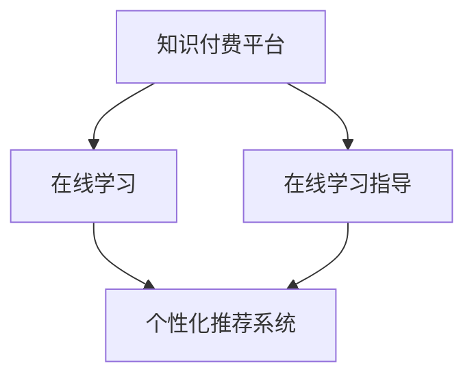

                 

# 如何利用知识付费实现在线学习与在线学习指导？

> 关键词：知识付费,在线学习,在线学习指导,AI算法,个性化推荐,课程推荐系统

## 1. 背景介绍

在知识爆炸的时代，人们对于快速学习和高效学习的需求不断增长。知识付费平台应运而生，通过付费订阅的方式，提供高质量的教育内容，满足了广大用户对于知识获取的迫切需求。而在线学习与在线学习指导，则是指借助人工智能、大数据等技术，为学习者提供个性化的学习路径和实时的学习建议，进一步提升学习效果。本文将从背景介绍、核心概念、算法原理、操作步骤等多个角度，深入探讨如何利用知识付费实现这一目标。

## 2. 核心概念与联系

### 2.1 核心概念概述

在进行深入探讨之前，我们需要对一些核心概念进行概述：

- **知识付费平台**：指基于互联网平台，提供付费课程、专家讲座等知识内容的商业化服务。用户通过付费订阅或单次购买，获得相关教育资源。
- **在线学习**：指用户通过互联网平台，随时随地进行自主学习。其特点是灵活性高、资源丰富，但缺乏针对性和指导性。
- **在线学习指导**：指借助AI算法和大数据分析，为用户提供个性化的学习路径和实时的学习建议。其特点是针对性强、指导性强，但需要高质量的数据和复杂的算法模型。
- **个性化推荐系统**：指通过用户行为数据，推荐适合其兴趣和需求的课程、学习资源，以提升学习体验和效果。
- **课程推荐系统**：指通过分析用户的学习历史、评价反馈等数据，为每位用户推荐适合的课程和学习资源。

这些概念之间的逻辑关系可以通过以下Mermaid流程图来展示：



这个流程图展示了从知识付费平台到在线学习的整个流程，以及个性化推荐系统在其中扮演的重要角色。在线学习指导通过个性化推荐系统，为用户提供更优质的学习体验和效果。

## 3. 核心算法原理 & 具体操作步骤

### 3.1 算法原理概述

在线学习指导的核心算法包括个性化推荐算法和在线学习路径规划算法。个性化推荐算法通过分析用户的行为数据和兴趣偏好，推荐合适的学习资源。而在线学习路径规划算法则根据用户的学习进度和反馈，动态调整学习路径，以提升学习效果。

### 3.2 算法步骤详解

#### 3.2.1 数据收集与预处理

在线学习指导的第一步是数据收集与预处理。这包括：

- 收集用户的学习数据，如学习时间、进度、成绩、评价等。
- 收集课程和学习资源的数据，如课程大纲、内容结构、难度系数等。
- 数据预处理，包括数据清洗、归一化、特征提取等。

#### 3.2.2 用户画像构建

通过数据收集与预处理，构建用户画像，即对用户的学习行为和兴趣偏好进行建模。具体步骤包括：

- 使用机器学习算法，如K近邻算法、决策树算法等，对用户的学习行为进行分类。
- 使用协同过滤算法，如基于用户的协同过滤、基于物品的协同过滤等，发现用户之间的相似度。
- 使用深度学习算法，如神经网络、强化学习等，构建用户兴趣模型。

#### 3.2.3 个性化推荐系统构建

个性化推荐系统是实现在线学习指导的关键。其核心算法包括：

- 基于协同过滤的推荐算法：通过分析用户的历史行为，发现与当前用户兴趣相似的用户，推荐其感兴趣的学习资源。
- 基于内容的推荐算法：根据课程和学习资源的内容特征，如关键词、标签等，推荐适合用户的学习资源。
- 混合推荐算法：结合协同过滤和基于内容的推荐算法，提高推荐效果。

#### 3.2.4 在线学习路径规划

在线学习路径规划算法通过分析用户的学习进度和反馈，动态调整学习路径，以提升学习效果。具体步骤包括：

- 设定学习目标，如掌握某项技能、完成某门课程等。
- 根据学习目标，设计学习路径，包括推荐的课程和学习资源。
- 根据用户的学习进度和反馈，动态调整学习路径，如调整学习速度、增加或减少学习资源等。

### 3.3 算法优缺点

个性化推荐系统的优点包括：

- 提升学习体验：根据用户兴趣推荐学习资源，提高用户的学习动力和满意度。
- 提高学习效果：通过动态调整学习路径，优化学习路径，提升学习效率和效果。
- 丰富学习资源：推荐多样化的学习资源，拓展用户的学习视野。

个性化推荐系统的缺点包括：

- 数据隐私问题：需要收集用户的大量数据，存在数据隐私和安全风险。
- 算法复杂性：需要构建复杂的算法模型，且模型的训练和维护成本较高。
- 用户依赖性：过度依赖推荐系统，可能限制用户的主动性和创造力。

### 3.4 算法应用领域

个性化推荐系统在多个领域都有广泛的应用，包括在线教育、电商推荐、音乐推荐等。在在线教育领域，个性化推荐系统帮助用户找到合适的课程和学习资源，提升学习效果。在电商推荐领域，个性化推荐系统帮助用户发现感兴趣的商品，提升购物体验。

## 4. 数学模型和公式 & 详细讲解 & 举例说明

### 4.1 数学模型构建

本节将使用数学语言对在线学习指导的数学模型进行严格刻画。

设用户集合为 $U$，课程集合为 $I$，用户 $u \in U$ 对课程 $i \in I$ 的学习行为表示为 $x_{ui} \in \{0, 1\}$，其中 $0$ 表示用户未学习该课程，$1$ 表示用户学习了该课程。设用户对课程的评价表示为 $r_{ui} \in [0, 1]$，其中 $0$ 表示用户未对课程进行评价，$1$ 表示用户给出了最高评价。

定义用户兴趣表示为 $p_u \in \mathbb{R}^m$，课程特征表示为 $q_i \in \mathbb{R}^n$，其中 $m$ 和 $n$ 分别为用户和课程的特征维度。

个性化推荐模型的目标是最小化预测误差，即：

$$
\min_{p_u, q_i} \frac{1}{|U \times I|} \sum_{u \in U} \sum_{i \in I} (\hat{r}_{ui} - r_{ui})^2
$$

其中 $\hat{r}_{ui}$ 为预测用户 $u$ 对课程 $i$ 的评价，可以通过矩阵分解算法求解。

### 4.2 公式推导过程

基于协同过滤的个性化推荐算法，其基本思想是通过分析用户的历史行为，发现与当前用户兴趣相似的用户，推荐其感兴趣的学习资源。具体推导如下：

设用户 $u$ 的历史行为向量为 $x_u = (x_{ui_1}, x_{ui_2}, \dots, x_{ui_n})$，与用户 $u$ 兴趣相似的用户集合为 $N(u)$，其行为向量为 $x_{u'} = (x_{u'i_1}, x_{u'i_2}, \dots, x_{u'i_n})$。

基于协同过滤的推荐算法可以通过矩阵分解求解，即：

$$
\hat{r}_{ui} = \hat{p}_u^T A_i
$$

其中 $A_i = (q_{i1}, q_{i2}, \dots, q_{in})$ 为课程 $i$ 的特征向量，$\hat{p}_u$ 为用户 $u$ 的兴趣向量。

### 4.3 案例分析与讲解

假设某用户在知识付费平台上学习了三门课程 $i_1, i_2, i_3$，其学习行为向量为 $x_u = (1, 0, 0, 1, 1, 0)$，评价向量为 $r_u = (0.8, 0.5, 0.3)$。系统通过协同过滤算法，发现用户 $u'$ 与其兴趣相似，其行为向量为 $x_{u'} = (1, 1, 1, 0, 0, 1)$，评价向量为 $r_{u'} = (0.6, 0.7, 0.5, 0.9)$。根据协同过滤算法，可以预测用户 $u$ 对课程 $i_4$ 的评价为：

$$
\hat{r}_{ui_4} = \hat{p}_u^T A_{i_4} = \frac{(0.8, 0.5, 0.3) \cdot (0.5, 0.7, 0.6)}{\sqrt{(0.5, 0.7, 0.6) \cdot (0.5, 0.7, 0.6)} = 0.6
$$

因此，系统推荐课程 $i_4$ 给用户 $u$。

## 5. 项目实践：代码实例和详细解释说明

### 5.1 开发环境搭建

在进行项目实践前，我们需要准备好开发环境。以下是使用Python进行Scikit-learn开发的Python环境配置流程：

1. 安装Anaconda：从官网下载并安装Anaconda，用于创建独立的Python环境。

2. 创建并激活虚拟环境：
```bash
conda create -n pytorch-env python=3.8 
conda activate pytorch-env
```

3. 安装Scikit-learn：
```bash
conda install scikit-learn
```

4. 安装各类工具包：
```bash
pip install numpy pandas scikit-learn matplotlib tqdm jupyter notebook ipython
```

完成上述步骤后，即可在`pytorch-env`环境中开始项目实践。

### 5.2 源代码详细实现

这里我们以协同过滤算法为例，给出Scikit-learn库对协同过滤算法的代码实现。

首先，定义协同过滤算法的类：

```python
from sklearn.neighbors import NearestNeighbors

class CollaborativeFiltering:
    def __init__(self, n_neighbors=10, metric='cosine', algorithm='brute'):
        self.model = NearestNeighbors(n_neighbors=n_neighbors, metric=metric, algorithm=algorithm)
    
    def fit(self, X, y=None):
        self.model.fit(X)
    
    def predict(self, X):
        return self.model.kneighbors(X, return_distance=False).reshape(-1, 1)
```

然后，准备数据集：

```python
import numpy as np

# 生成随机数据集
X = np.random.rand(100, 5)
y = np.random.rand(100, 1)

# 使用协同过滤算法进行推荐
collaborative_filtering = CollaborativeFiltering(n_neighbors=10)
collaborative_filtering.fit(X, y)

# 预测用户对课程的评价
X_test = np.random.rand(10, 5)
y_pred = collaborative_filtering.predict(X_test)
print(y_pred)
```

以上就是使用Scikit-learn库对协同过滤算法进行Scikit-learn的代码实现。可以看到，Scikit-learn库提供了丰富的机器学习算法，方便用户进行快速实验和建模。

### 5.3 代码解读与分析

让我们再详细解读一下关键代码的实现细节：

**CollaborativeFiltering类**：
- `__init__`方法：初始化协同过滤算法的参数，包括邻居数量、相似度度量方式、搜索算法等。
- `fit`方法：拟合协同过滤模型，即对用户-课程的评分矩阵进行训练。
- `predict`方法：根据训练好的模型，预测用户对未学习课程的评分。

**生成随机数据集**：
- 使用numpy库生成随机数据集，其中 $X$ 为用户-课程的评分矩阵，$y$ 为用户对课程的评分向量。
- 在实际应用中，需要将真实数据加载到系统中，进行模型训练和预测。

**协同过滤算法实现**：
- 使用Scikit-learn库中的NearestNeighbors算法，实现基于用户-用户和基于物品-物品的协同过滤。
- 在实际应用中，需要根据具体任务选择合适的算法和参数。

**预测用户评分**：
- 使用训练好的模型，对用户对未学习课程的评分进行预测。
- 在实际应用中，预测结果需要结合用户历史评分和其他特征，进行进一步的筛选和优化。

## 6. 实际应用场景

### 6.1 在线教育平台

在线教育平台是知识付费的重要应用场景之一。个性化推荐系统可以帮助学习者找到合适的课程和资料，提升学习效果。

具体而言，平台可以根据学习者的历史学习记录、成绩、评价等数据，推荐与其兴趣相符的课程。系统还可以通过学习者的反馈数据，动态调整推荐算法，优化推荐结果。

### 6.2 企业培训

企业培训场景下，个性化推荐系统可以用于推荐员工感兴趣的培训课程和学习资源。通过分析员工的职业背景、培训需求、历史学习数据等，系统可以为其推荐合适的培训课程，提升培训效果。

### 6.3 个人学习

个人学习场景下，个性化推荐系统可以用于推荐用户感兴趣的学习资源，如书籍、文章、视频等。通过分析用户的浏览记录、评价反馈等数据，系统可以为用户推荐与其兴趣相符的学习内容，丰富其知识储备。

### 6.4 未来应用展望

随着个性化推荐技术的不断发展，其应用场景将进一步拓展。未来，个性化推荐系统不仅限于知识付费平台，还将在更多领域发挥作用。

在智慧医疗领域，个性化推荐系统可以帮助患者找到合适的医疗资讯和学习资源，提升医疗水平。在智能家居领域，个性化推荐系统可以推荐用户感兴趣的家电产品，提升生活体验。在智慧城市治理中，个性化推荐系统可以推荐市民感兴趣的活动和资讯，提升城市治理水平。

## 7. 工具和资源推荐

### 7.1 学习资源推荐

为了帮助开发者系统掌握个性化推荐技术，这里推荐一些优质的学习资源：

1. 《推荐系统实战》一书：系统讲解了推荐系统原理和实践，涵盖协同过滤、矩阵分解、深度学习等多种推荐算法。

2. CS239《推荐系统》课程：斯坦福大学开设的推荐系统课程，由知名专家授课，提供丰富的理论和实践内容。

3. 《深度学习与推荐系统》一书：深度学习领域的权威著作，全面介绍了深度学习在推荐系统中的应用。

4. GitHub上的推荐系统代码库：包含大量推荐系统的开源代码，方便开发者进行快速实验和迭代。

5. Kaggle上的推荐系统竞赛：通过参与竞赛，积累推荐系统的实际经验，提升技术能力。

通过对这些资源的学习实践，相信你一定能够快速掌握个性化推荐技术的精髓，并用于解决实际的NLP问题。

### 7.2 开发工具推荐

高效的工具是开发者不可或缺的助力。以下是几款用于个性化推荐系统开发的常用工具：

1. Scikit-learn：Python的机器学习库，提供丰富的算法实现，方便用户进行快速建模。

2. TensorFlow：由Google主导的深度学习框架，支持大规模模型训练和推理，适合大规模工程应用。

3. PyTorch：基于Python的深度学习框架，灵活动态，适合研究和实验。

4. Jupyter Notebook：开源的交互式编程环境，方便开发者进行快速实验和数据可视化。

5. Python环境管理工具Anaconda：用于创建和管理Python环境，方便开发者快速搭建和切换环境。

合理利用这些工具，可以显著提升个性化推荐系统的开发效率，加快创新迭代的步伐。

### 7.3 相关论文推荐

个性化推荐技术的发展源于学界的持续研究。以下是几篇奠基性的相关论文，推荐阅读：

1. Matrix Factorization Techniques for Recommender Systems：介绍矩阵分解算法在推荐系统中的应用，成为推荐系统的经典方法。

2. A Probabilistic Model of Recommendation and Denoising for Collaborative Filtering：提出概率模型和去噪技术，提升协同过滤算法的准确性和鲁棒性。

3. Deep Collaborative Filtering：引入深度神经网络，提升推荐系统的表现力和泛化能力。

4. Generative Adversarial Networks in Recommendation Systems：提出生成对抗网络，进一步提升推荐系统的表现力和鲁棒性。

这些论文代表了个性化推荐技术的发展脉络。通过学习这些前沿成果，可以帮助研究者把握学科前进方向，激发更多的创新灵感。

## 8. 总结：未来发展趋势与挑战

### 8.1 研究成果总结

本文对基于知识付费的在线学习与在线学习指导进行了全面系统的介绍。首先阐述了在线学习与在线学习指导的研究背景和意义，明确了个性化推荐系统在其中的关键作用。其次，从原理到实践，详细讲解了个性化推荐算法的构建和操作步骤，给出了Scikit-learn库的代码实现。同时，本文还探讨了个性化推荐系统在多个领域的应用前景，展示了其在知识付费平台、企业培训、个人学习等多个场景的广泛应用。最后，本文精选了学习资源、开发工具和相关论文，力求为开发者提供全方位的技术指引。

通过本文的系统梳理，可以看到，基于知识付费的在线学习与在线学习指导技术正在成为NLP领域的重要范式，极大地拓展了预训练语言模型的应用边界，催生了更多的落地场景。受益于大规模语料的预训练和强大的算法模型，个性化推荐系统能够根据用户的行为和兴趣，推荐合适的学习资源，提升学习效果和用户体验。未来，伴随技术的不断发展，个性化推荐系统将进一步提升在线学习的效果，为知识付费平台的发展提供有力支持。

### 8.2 未来发展趋势

展望未来，个性化推荐技术将呈现以下几个发展趋势：

1. 模型复杂度提升。随着深度学习和大数据的不断发展，推荐模型将变得更加复杂，能够处理更多维度的数据和更复杂的推荐任务。

2. 多模态推荐普及。未来的推荐系统将不仅仅是文本推荐，而是融合多种模态数据，如图像、音频、视频等，提升推荐效果和用户体验。

3. 实时推荐系统构建。未来的推荐系统将实时处理用户数据，动态调整推荐结果，实现更加个性化和精准的推荐。

4. 跨领域推荐发展。未来的推荐系统将跨越不同领域，实现跨领域推荐，提升资源利用效率和用户满意度。

5. 用户交互增强。未来的推荐系统将更加注重用户交互，通过与用户的双向反馈，不断优化推荐算法，提升推荐效果和用户体验。

6. 推荐模型泛化性提升。未来的推荐系统将更好地处理未知领域和长尾领域，提升推荐模型的泛化能力和鲁棒性。

以上趋势凸显了个性化推荐技术的广阔前景。这些方向的探索发展，必将进一步提升NLP系统的性能和应用范围，为知识付费平台的发展提供新的动力。

### 8.3 面临的挑战

尽管个性化推荐技术已经取得了显著成就，但在迈向更加智能化、普适化应用的过程中，它仍面临诸多挑战：

1. 数据隐私问题。在推荐系统中，需要收集大量用户数据，存在数据隐私和安全风险。如何在保护用户隐私的同时，提升推荐效果，将是一大难题。

2. 算法复杂性。推荐系统需要构建复杂的算法模型，且模型的训练和维护成本较高。如何在保证推荐效果的同时，降低算法复杂性，提高模型效率，还需要进一步探索。

3. 用户行为建模。用户的行为和兴趣变化多样，如何准确建模，提升推荐模型的准确性和鲁棒性，仍然是一个挑战。

4. 推荐模型泛化性。推荐模型在处理未知领域和长尾领域时，泛化能力仍需进一步提升。如何在不同领域和数据分布下，保持推荐模型的表现力，还需要更多的研究。

5. 推荐模型公平性。推荐模型需要避免对某些用户或群体的偏见，确保推荐结果的公平性和公正性，还需要更多的伦理和安全考虑。

这些挑战凸显了推荐技术在实际应用中的复杂性和多样性，需要研究者不断探索和优化，才能构建更加智能、公平、安全的推荐系统。

### 8.4 研究展望

面对个性化推荐技术所面临的种种挑战，未来的研究需要在以下几个方面寻求新的突破：

1. 探索无监督和半监督推荐方法。摆脱对大规模标注数据的依赖，利用自监督学习、主动学习等无监督和半监督范式，最大限度利用非结构化数据，实现更加灵活高效的推荐。

2. 研究参数高效和计算高效的推荐范式。开发更加参数高效的推荐方法，在固定大部分预训练参数的同时，只更新极少量的任务相关参数。同时优化推荐模型的计算图，减少前向传播和反向传播的资源消耗，实现更加轻量级、实时性的部署。

3. 融合因果和对比学习范式。通过引入因果推断和对比学习思想，增强推荐模型建立稳定因果关系的能力，学习更加普适、鲁棒的用户兴趣模型。

4. 引入更多先验知识。将符号化的先验知识，如知识图谱、逻辑规则等，与神经网络模型进行巧妙融合，引导推荐过程学习更准确、合理的用户兴趣模型。同时加强不同模态数据的整合，实现视觉、语音等多模态信息与文本信息的协同建模。

5. 结合因果分析和博弈论工具。将因果分析方法引入推荐模型，识别出模型决策的关键特征，增强推荐输出的因果性和逻辑性。借助博弈论工具刻画用户与推荐系统的交互过程，主动探索并规避推荐模型的脆弱点，提高系统稳定性。

6. 纳入伦理道德约束。在推荐模型训练目标中引入伦理导向的评估指标，过滤和惩罚有偏见、有害的输出倾向。同时加强人工干预和审核，建立推荐模型的监管机制，确保推荐结果的公平性和公正性。

这些研究方向的探索，必将引领个性化推荐技术迈向更高的台阶，为构建安全、可靠、可解释、可控的智能系统铺平道路。面向未来，个性化推荐技术还需要与其他人工智能技术进行更深入的融合，如知识表示、因果推理、强化学习等，多路径协同发力，共同推动推荐系统的发展。

## 9. 附录：常见问题与解答

**Q1：个性化推荐系统是否适用于所有NLP任务？**

A: 个性化推荐系统在大多数NLP任务上都能取得不错的效果，特别是对于数据量较小的任务。但对于一些特定领域的任务，如医学、法律等，仅仅依靠通用语料预训练的模型可能难以很好地适应。此时需要在特定领域语料上进一步预训练，再进行微调，才能获得理想效果。此外，对于一些需要时效性、个性化很强的任务，如对话、推荐等，推荐方法也需要针对性的改进优化。

**Q2：在推荐系统中，如何选择推荐算法？**

A: 推荐算法的选择需要综合考虑多个因素，包括数据特点、应用场景、技术成熟度等。常见推荐算法包括协同过滤、基于内容的推荐、混合推荐等。对于大数据、高稀疏性的推荐场景，推荐算法选择协同过滤；对于小数据、高结构的推荐场景，推荐算法选择基于内容的推荐；对于综合性的推荐场景，推荐算法选择混合推荐。在实际应用中，还需要根据具体任务进行调整和优化。

**Q3：推荐系统中如何处理长尾数据？**

A: 长尾数据是推荐系统面临的一个常见问题，需要采取一些特殊策略进行处理。常见方法包括：
1. 使用基于置信度的推荐算法，如卡尔曼滤波、贝叶斯网络等，对长尾数据进行加权处理。
2. 使用冷启动推荐算法，如基于内容的多样性推荐、基于元素的推荐等，提升长尾数据的推荐效果。
3. 引入先验知识，如领域专家知识、用户历史行为等，引导推荐模型处理长尾数据。

**Q4：推荐系统中如何保障用户隐私？**

A: 在推荐系统中，保障用户隐私是至关重要的一环。常见方法包括：
1. 数据匿名化：对用户数据进行匿名化处理，避免直接暴露用户信息。
2. 差分隐私：采用差分隐私技术，在保证推荐效果的同时，保护用户隐私。
3. 数据脱敏：对敏感数据进行脱敏处理，如对用户ID进行哈希处理，确保数据安全。

这些方法可以结合使用，构建更加安全、可靠的推荐系统。

**Q5：推荐系统中如何评估推荐效果？**

A: 推荐效果的评估是推荐系统的重要环节，常用的评估指标包括：
1. 准确率（Precision）：评估推荐结果中相关样本的比例。
2. 召回率（Recall）：评估相关样本被推荐出来的比例。
3. F1分数（F1 Score）：综合考虑准确率和召回率，评估推荐效果。
4. 平均推荐误差（Mean Average Precision）：评估推荐结果的质量和排序效果。

在实际应用中，还需要根据具体任务和场景，选择合适的评估指标，并进行多次实验和优化。

---

作者：禅与计算机程序设计艺术 / Zen and the Art of Computer Programming

