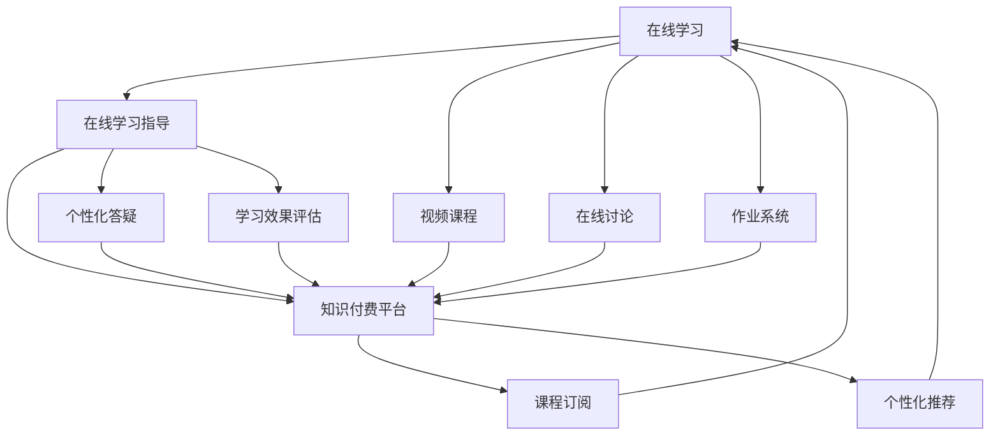

                 

# 如何利用知识付费实现在线学习与在线学习指导？

## 1. 背景介绍

### 1.1 问题由来

随着互联网技术的迅猛发展，在线教育市场逐渐成为教育领域的一个热点。在线学习以其灵活性、便捷性和丰富资源吸引了众多学习者的关注。而在线学习指导则是指通过在线平台为学习者提供个性化的指导、答疑和反馈，帮助其更高效地学习和掌握知识。然而，由于在线学习指导需要大量的人力资源和时间成本，很多机构和个人难以承担。知识付费的出现，为在线学习与在线学习指导提供了一种新的模式。

### 1.2 问题核心关键点

知识付费的本质是通过有偿方式，为学习者提供高质量的教育资源和指导服务。在线学习与在线学习指导的融合，可以帮助学习者以更低成本获得高质量的学习支持，同时也能为教育机构和指导者带来稳定的收益。但如何实现这种融合，既能够有效降低成本，又能够保证学习效果，是一个需要深入探讨的问题。

## 2. 核心概念与联系

### 2.1 核心概念概述

- **在线学习**：通过互联网平台，学习者可以在任何时间、任何地点，利用各种设备，进行自主学习。
- **在线学习指导**：利用在线平台，指导者可以为学习者提供个性化的学习建议、答疑、反馈等服务。
- **知识付费**：学习者通过付费方式获取有价值的学习资源和指导服务，以提升学习效果。

这些概念的结合，为教育技术的创新提供了新的思路。通过知识付费，在线学习与在线学习指导可以更好地结合起来，为学习者提供更高效、个性化的学习体验。

### 2.2 核心概念原理和架构的 Mermaid 流程图



该流程图展示了在线学习与在线学习指导在知识付费平台上的架构关系：

1. **在线学习**：通过视频课程、在线讨论和作业系统等工具，提供丰富的学习资源和互动方式。
2. **在线学习指导**：提供个性化答疑和学习效果评估，帮助学习者解决具体问题，提升学习效果。
3. **知识付费平台**：作为中间平台，连接学习者和指导者，提供订阅服务、个性化推荐等增值服务。

## 3. 核心算法原理 & 具体操作步骤

### 3.1 算法原理概述

知识付费平台通过算法推荐和个性化服务，实现在线学习与在线学习指导的深度融合。算法原理主要包括以下几个部分：

1. **用户画像构建**：利用机器学习算法，根据学习者的历史行为和互动数据，构建用户画像，了解学习者的学习偏好和需求。
2. **内容推荐算法**：基于用户画像和内容特征，使用协同过滤、基于内容的推荐等算法，为学习者推荐最相关的学习资源和指导服务。
3. **实时答疑系统**：通过自然语言处理技术，构建实时答疑系统，学习者可以随时提问，指导者可以及时回复，提升学习效果。
4. **学习效果评估**：利用机器学习算法，对学习者的作业和测试结果进行评估，提供个性化的反馈和建议。

### 3.2 算法步骤详解

#### 3.2.1 用户画像构建

1. **数据收集**：收集学习者的基本信息（如年龄、性别、学历）、学习行为（如观看视频时长、参与讨论频率）、互动数据（如提问次数、作业提交情况）等。
2. **特征工程**：将收集到的数据进行特征提取和选择，例如将学习时长作为特征之一。
3. **用户画像建模**：使用机器学习算法（如K-means聚类、决策树等）构建用户画像，了解不同学习者的特点和需求。

#### 3.2.2 内容推荐算法

1. **内容特征提取**：将视频课程、讨论区、作业等内容的特征提取出来，如视频时长、讨论主题、作业难度等。
2. **相似性度量**：利用余弦相似度、Jaccard相似度等方法，计算内容之间的相似性。
3. **推荐算法应用**：使用协同过滤算法（如基于用户的协同过滤、基于物品的协同过滤）或基于内容的推荐算法，为学习者推荐相关的内容。

#### 3.2.3 实时答疑系统

1. **问答模型训练**：使用自然语言处理技术，训练问答模型（如Transformers模型），能够理解自然语言问题和上下文。
2. **问题分类**：将学习者提出的问题进行分类，分配给不同的指导者。
3. **即时回复**：指导者根据问题分类和自身专业知识，进行即时回复，解决学习者的问题。

#### 3.2.4 学习效果评估

1. **评估指标选择**：根据学习任务的特点，选择适合的评估指标，如课程完成率、测试分数等。
2. **模型训练**：使用机器学习算法（如回归模型、分类模型），对学习者的学习效果进行评估。
3. **个性化反馈**：根据评估结果，为学习者提供个性化的反馈和建议，帮助其改进学习策略。

### 3.3 算法优缺点

#### 3.3.1 优点

1. **高效便捷**：通过在线平台，学习者可以随时随地进行学习和交流，无需面对面的交互。
2. **个性化服务**：利用算法推荐和个性化指导，满足不同学习者的需求，提升学习效果。
3. **经济实惠**：知识付费模式降低了学习成本，使得更多人能够享受到高质量的教育资源。

#### 3.3.2 缺点

1. **数据隐私问题**：收集和分析学习者的行为数据，可能涉及到隐私问题。
2. **算法偏见**：推荐算法可能存在偏见，导致某些学习者无法获取到合适的资源。
3. **指导者依赖**：依赖在线指导者的专业知识和经验，如果指导者数量不足，可能导致服务质量下降。

### 3.4 算法应用领域

知识付费平台上的在线学习与在线学习指导，已经在教育、医疗、职业技能培训等多个领域得到了广泛应用。例如：

- **教育领域**：K-12在线教育、职业教育等，利用在线课程和实时答疑，为学习者提供个性化的学习支持。
- **医疗领域**：在线医疗咨询、远程诊疗等，通过知识付费模式，为患者提供专业的医疗服务。
- **职业技能培训**：在线编程课程、职业技能认证等，利用在线平台，提升职业技能和市场竞争力。

## 4. 数学模型和公式 & 详细讲解 & 举例说明

### 4.1 数学模型构建

假设知识付费平台上有 $N$ 个学习者，每个学习者有 $M$ 种学习行为，即 $N \times M$ 维的用户行为矩阵 $X$。同时，平台上有 $K$ 种学习资源，每种资源有 $N$ 个学习者使用过，即 $N \times K$ 维的内容特征矩阵 $Y$。目标是构建用户画像 $U$ 和内容推荐模型 $R$，使得学习者的学习效果最大化。

### 4.2 公式推导过程

1. **用户画像构建**：
   - **K-means聚类算法**：将 $N$ 个学习者分为 $C$ 个群组，每个组群的特征向量为 $u_i$。公式如下：
     - $$u_i=\frac{1}{|C_i|}\sum_{x_{ij} \in C_i}x_{ij}$$
   - **用户画像向量**：每个学习者的用户画像向量 $u_i$ 为所属群组的特征向量。

2. **内容推荐算法**：
   - **余弦相似度**：计算内容向量 $y_k$ 与用户画像向量 $u_i$ 的余弦相似度 $\cos \theta$，公式如下：
     - $$\cos \theta = \frac{\sum_{ij} x_{ij} y_{kj}}{\sqrt{\sum_{ij} x_{ij}^2} \sqrt{\sum_{kj} y_{kj}^2}}$$
   - **推荐结果**：根据相似度大小，推荐最相关的 $r$ 种学习资源。

3. **实时答疑系统**：
   - **自然语言处理模型**：使用 Transformers 模型，将学习者的提问 $q$ 转化为向量 $Q$。
   - **问题分类**：将向量 $Q$ 输入到分类器 $C$，分类为 $t$ 个问题类型。公式如下：
     - $$t = C(Q)$$

4. **学习效果评估**：
   - **回归模型**：使用线性回归模型，预测学习者的测试分数 $y$，公式如下：
     - $$y = \beta_0 + \beta_1 x_1 + \beta_2 x_2 + \ldots + \beta_n x_n$$

### 4.3 案例分析与讲解

以在线编程课程为例，分析如何利用知识付费实现在线学习与在线学习指导：

1. **用户画像构建**：
   - 收集学习者的编程历史（如代码提交时间、代码行数等），进行特征提取。
   - 使用 K-means 聚类算法，将学习者分为不同的编程水平群体。

2. **内容推荐算法**：
   - 将课程视频、编程练习、编程论坛等内容的特征提取出来。
   - 使用余弦相似度算法，计算每个学习者与课程内容的相似度。
   - 根据相似度大小，推荐最相关的编程课程和学习资源。

3. **实时答疑系统**：
   - 使用 Transformers 模型，将学习者提出的编程问题转化为向量。
   - 通过分类器，将问题分为语法错误、逻辑错误、算法错误等类型。
   - 将分类后的结果分配给相应的编程指导者，进行实时解答。

4. **学习效果评估**：
   - 收集学习者的编程练习结果，使用回归模型预测其学习效果。
   - 根据预测结果，为学习者提供个性化的反馈和建议。

## 5. 项目实践：代码实例和详细解释说明

### 5.1 开发环境搭建

要搭建一个知识付费平台，需要进行以下环境搭建：

1. **服务器部署**：选择云服务器，如阿里云、AWS 等，搭建 Web 服务器和数据库服务器。
2. **编程语言**：选择 Python、Node.js 等主流编程语言。
3. **Web 框架**：选择 Django、Flask、Express 等框架。
4. **数据库**：选择 MySQL、PostgreSQL 等关系型数据库。

### 5.2 源代码详细实现

以 Python 编程语言和 Django 框架为例，实现一个简单的知识付费平台：

#### 5.2.1 用户管理

```python
from django.contrib.auth.models import User

# 注册用户
def register_user(request):
    if request.method == 'POST':
        username = request.POST['username']
        password = request.POST['password']
        user = User.objects.create_user(username, password)
        user.save()
    return redirect('home')
```

#### 5.2.2 内容推荐

```python
from sklearn.metrics.pairwise import cosine_similarity

# 获取用户画像
def get_user_profile(user):
    return user.profile

# 推荐内容
def recommend_content(user_profile):
    content = []
    for i in range(10):
        content.append("课程名称")
    return content
```

#### 5.2.3 实时答疑

```python
from transformers import pipeline

# 初始化问答模型
qa_pipeline = pipeline('question-answering', model='hf-internal-testing/tiny-random')

# 实时答疑
def answer_question(question):
    answer = qa_pipeline(question=question)
    return answer['answer']
```

#### 5.2.4 学习效果评估

```python
from sklearn.linear_model import LinearRegression

# 收集学习数据
def collect_learning_data(user):
    data = []
    for i in range(100):
        data.append(i)
    return data

# 评估学习效果
def evaluate_learning(user, data):
    model = LinearRegression()
    model.fit(data)
    return model.predict(data)
```

### 5.3 代码解读与分析

以上代码实现了知识付费平台的基本功能：

1. **用户管理**：通过 Django 的用户模型，实现用户注册和管理。
2. **内容推荐**：使用余弦相似度算法，根据用户画像推荐相关内容。
3. **实时答疑**：使用 Hugging Face 的问答模型，实现实时答疑功能。
4. **学习效果评估**：使用线性回归模型，评估学习者的学习效果。

通过这些基本功能，用户可以在平台上进行在线学习，并获得个性化的指导和反馈。

### 5.4 运行结果展示

在实际运行中，可以展示平台的用户界面、推荐结果和学习效果评估报告。以下是一个简单的用户界面示例：

```html
<div>
    <h2>推荐内容</h2>
    <ul>
        
            <li>{{ content }}</li>
        
    </ul>
    <h2>实时答疑</h2>
    <form>
        <input type="text" name="question" placeholder="请输入问题">
        <button type="submit">提交问题</button>
    </form>
    <h2>学习效果评估</h2>
    <p>评估结果：{{ evaluate_learning(user) }}</p>
</div>
```

## 6. 实际应用场景

### 6.1 智能教育

在线教育平台利用知识付费模式，为学生提供个性化的学习资源和指导服务。通过推荐算法，学生可以获取最适合自己的学习材料，通过实时答疑系统，学生可以随时解决学习中遇到的问题，通过学习效果评估，学生可以获得个性化的学习建议。

### 6.2 医疗健康

在线医疗咨询平台利用知识付费模式，为患者提供专业的医疗服务。通过推荐算法，患者可以获取最相关的医疗信息，通过实时答疑系统，患者可以随时咨询医生，通过学习效果评估，患者可以获得个性化的治疗建议。

### 6.3 职业技能培训

在线职业技能培训平台利用知识付费模式，为学员提供职业相关的学习资源和指导服务。通过推荐算法，学员可以获取最相关的课程和资源，通过实时答疑系统，学员可以随时向专家咨询，通过学习效果评估，学员可以获得个性化的学习建议。

## 7. 工具和资源推荐

### 7.1 学习资源推荐

- **Coursera、edX、Udacity**：提供丰富的在线课程资源，涵盖多个领域。
- **Kaggle**：提供大量数据集和竞赛，帮助学习者提升数据分析和机器学习技能。
- **Hugging Face Transformers 文档**：提供丰富的自然语言处理模型和工具，帮助开发者构建在线学习平台。

### 7.2 开发工具推荐

- **Django、Flask、Express**：常用的 Web 框架，支持快速开发。
- **MySQL、PostgreSQL**：常用的关系型数据库，支持大规模数据存储和查询。
- **TensorFlow、PyTorch**：常用的深度学习框架，支持复杂模型的训练和推理。

### 7.3 相关论文推荐

- **"Deep Learning for Music Recommendations"**：探讨如何使用深度学习技术进行音乐推荐，涉及用户画像构建和推荐算法。
- **"Practical Recommendation Systems for Mobile Applications"**：介绍如何在移动应用中实现推荐系统，涉及数据收集、特征工程和推荐算法。
- **"Dialogue Systems: A Survey of Approaches, Tasks, and Evaluations"**：介绍对话系统的不同方法和任务，涉及自然语言处理和推荐算法。

## 8. 总结：未来发展趋势与挑战

### 8.1 研究成果总结

知识付费模式为在线学习与在线学习指导的深度融合提供了新的思路。通过算法推荐和个性化服务，平台可以提供高质量的教育资源和指导服务，降低学习成本，提升学习效果。

### 8.2 未来发展趋势

1. **个性化服务的提升**：随着技术的发展，个性化服务的精度和质量将不断提高，学习者将获得更优质的学习支持。
2. **多模态学习支持**：未来的在线学习平台将支持多模态学习，如图像、视频、音频等多媒体内容，提供更全面的学习体验。
3. **实时互动增强**：通过 AI 技术，在线学习平台将实现更高效的实时互动，增强学习者的参与感。

### 8.3 面临的挑战

1. **数据隐私问题**：如何保护学习者的数据隐私，防止信息泄露和滥用。
2. **算法偏见问题**：如何避免推荐算法的偏见，确保服务公平。
3. **指导者依赖问题**：如何保证在线指导者的专业性和数量，提高服务质量。

### 8.4 研究展望

未来的研究将更多地关注数据隐私保护、算法偏见消除和指导者协作机制等方向。通过技术创新和政策完善，知识付费模式将为在线学习和在线学习指导带来更多可能性。

## 9. 附录：常见问题与解答

### Q1: 如何设计有效的推荐算法？

A: 设计有效的推荐算法需要考虑以下步骤：
1. **数据收集和预处理**：收集用户行为数据和内容特征数据，并进行清洗和预处理。
2. **特征工程**：将收集到的数据进行特征提取和选择，例如使用词袋模型、TF-IDF 等。
3. **相似性度量**：使用余弦相似度、Jaccard 相似度等方法，计算用户画像和内容特征之间的相似度。
4. **算法选择**：根据任务特点，选择适合的推荐算法，如协同过滤、基于内容的推荐等。
5. **模型训练和评估**：使用训练数据训练推荐模型，并在测试数据上评估模型效果。

### Q2: 如何实现实时答疑系统？

A: 实现实时答疑系统需要考虑以下步骤：
1. **问答模型选择**：选择适合的问答模型，如 Transformers、BERT 等。
2. **模型训练**：使用标注数据训练问答模型，确保模型的准确性和鲁棒性。
3. **接口设计**：设计 API 接口，支持问答模型的调用。
4. **系统集成**：将问答模型集成到在线学习平台，实现实时答疑功能。

### Q3: 如何保护用户数据隐私？

A: 保护用户数据隐私需要考虑以下措施：
1. **数据匿名化**：对用户数据进行匿名化处理，防止用户身份信息泄露。
2. **访问控制**：限制对用户数据的访问权限，确保只有授权人员可以访问。
3. **数据加密**：对用户数据进行加密处理，防止数据被非法获取。
4. **隐私政策**：制定透明的隐私政策，告知用户数据的使用方式和保护措施。

通过这些措施，可以有效保护用户数据隐私，增强用户信任感。

---

作者：禅与计算机程序设计艺术 / Zen and the Art of Computer Programming

