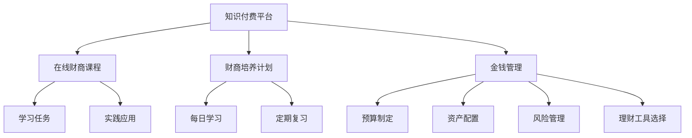

                 

# 如何利用知识付费实现在线财商培养与金钱管理？

## 1. 背景介绍

### 1.1 问题由来

随着互联网和移动支付的普及，越来越多的人开始关注个人财务规划和资产管理。然而，如何有效地培养财商，管理个人财务，对许多人来说仍是一大难题。传统的财务管理书籍和课程，往往受到时间和空间的限制，无法满足所有人的需求。

知识付费的兴起，为在线财商培养提供了新的可能性。通过互联网平台，用户可以随时随地学习财务管理知识，进行金钱管理实践，这极大地拓宽了财商教育的覆盖面，使其更易于获得和应用。

### 1.2 问题核心关键点

利用知识付费实现在线财商培养和金钱管理，关键在于选择合适的知识付费平台和课程，制定科学的财商培养计划，并结合实际情况进行金钱管理实践。

**核心概念：**

- **知识付费**：指用户通过付费获取知识、技能或服务的行为，强调用户对优质内容和服务的认可和信任。
- **在线财商培养**：通过网络平台，提供系统、科学的财商教育内容，帮助用户提升财务规划和金钱管理能力。
- **金钱管理**：运用金融和财务知识，制定科学的个人财务规划，合理分配和管理资产，实现财富增值。

**关键联系**：

知识付费平台是内容生产和用户获取知识的重要媒介，通过平台提供的在线财商课程，用户可以系统学习财务管理知识。用户结合平台提供的知识，进行金钱管理实践，实现自身财商的提升和金钱的有效管理。

## 2. 核心概念与联系

### 2.1 核心概念概述

为更好地理解如何利用知识付费实现在线财商培养与金钱管理，本节将介绍几个密切相关的核心概念：

- **知识付费平台**：如知乎、得到、喜马拉雅等，提供各种专业课程，涵盖财务管理、投资理财、财务规划等多个领域。
- **在线财商课程**：如《理财小白速成课》《投资入门》《财富自由之路》等，通过视频、音频、图文等多种形式，系统传授财商知识。
- **财商培养计划**：根据用户基础，制定系统、科学的财商学习计划，包括每日学习任务、定期复习、实践应用等环节。
- **金钱管理**：涉及预算制定、资产配置、风险管理、理财工具选择等多个方面，需要在知识引导下进行实际操作。

这些概念之间的逻辑关系可以通过以下Mermaid流程图来展示：



这个流程图展示的知识付费平台、在线财商课程、财商培养计划和金钱管理之间的逻辑关系：

1. 用户通过知识付费平台选择适合的在线财商课程。
2. 平台提供的课程内容，包括学习任务、实践应用等，帮助用户系统学习财商知识。
3. 用户结合财商培养计划，进行每日学习、定期复习等环节，提升财商水平。
4. 用户根据学到的知识，进行预算制定、资产配置、风险管理等金钱管理实践。

## 3. 核心算法原理 & 具体操作步骤
### 3.1 算法原理概述

利用知识付费实现在线财商培养与金钱管理，本质上是一个系统化的学习与实践过程。其核心思想是：

1. 通过知识付费平台获取高质量的在线财商课程。
2. 结合用户实际情况，制定科学的财商培养计划。
3. 在平台提供的知识指导下，进行金钱管理实践，提升个人财商。

形式化地，假设用户为 $U$，知识付费平台为 $P$，在线财商课程为 $C$，财商培养计划为 $E$，金钱管理实践为 $M$。用户通过平台选择课程，学习财商知识，然后根据计划进行金钱管理实践，其过程可以表示为：

$$
U \rightarrow P \rightarrow C \rightarrow E \rightarrow M
$$

其中 $U$ 到 $P$ 表示用户选择平台，$P$ 到 $C$ 表示平台推荐课程，$C$ 到 $E$ 表示课程指导实践，$E$ 到 $M$ 表示计划指导实践。

### 3.2 算法步骤详解

利用知识付费实现在线财商培养与金钱管理，一般包括以下几个关键步骤：

**Step 1: 选择知识付费平台**

- 选择合适的知识付费平台 $P$，如知乎、得到、喜马拉雅等，确保其提供的内容质量和用户口碑。
- 评估平台的课程内容是否丰富，是否涵盖用户感兴趣的财务管理领域，如投资理财、财富管理、税务规划等。

**Step 2: 确定在线财商课程**

- 在选择的平台上搜索、筛选适合的在线财商课程 $C$，如《理财小白速成课》《投资入门》《财富自由之路》等。
- 查看课程评价、用户反馈，确保课程质量，避免选择低劣的课程。

**Step 3: 制定财商培养计划**

- 结合个人情况，制定科学的财商培养计划 $E$。包括每日学习任务、定期复习、实战练习等环节。
- 根据课程进度，设置学习目标和时间节点，确保系统化学习。

**Step 4: 执行金钱管理实践**

- 根据财商培养计划，在知识指导下进行金钱管理实践 $M$。包括预算制定、资产配置、风险管理等环节。
- 结合实际生活场景，定期复盘，总结经验和教训，不断优化金钱管理策略。

**Step 5: 评估和调整**

- 定期评估金钱管理效果，对比计划与实际结果的差异，进行必要的调整。
- 根据财商培养计划的反馈，优化学习方法和金钱管理策略。

以上是利用知识付费实现在线财商培养与金钱管理的一般流程。在实际应用中，还需要针对具体用户的特点，对各环节进行优化设计，如选择适合用户学习风格的课程、定制个性化的财商培养计划等，以进一步提升用户的学习效果和金钱管理实践能力。

### 3.3 算法优缺点

利用知识付费实现在线财商培养与金钱管理，具有以下优点：

1. **灵活便捷**：用户可以随时随地学习课程，无需固定的上课时间和地点。
2. **系统化学习**：通过系统的课程内容和科学的培养计划，帮助用户系统掌握财商知识。
3. **实践导向**：结合实践指导，使学到的知识得以应用，提升金钱管理能力。
4. **互动性强**：许多平台提供互动式学习，如问答、直播、讨论等，增强学习效果。

同时，该方法也存在一定的局限性：

1. **内容质量参差不齐**：市场上的知识付费课程质量参差不齐，用户需花费时间筛选优质课程。
2. **课程收费较高**：部分优质课程收费较高，可能超出部分用户的经济承受能力。
3. **学习效果依赖平台**：用户的学习效果在很大程度上依赖于平台和课程的质量，选择不当可能导致误导。
4. **缺乏个性化指导**：平台提供的课程往往是标准化的，缺乏针对用户具体情况的个性化指导。

尽管存在这些局限性，但就目前而言，利用知识付费实现在线财商培养与金钱管理仍然是一种高效、便捷的方式，能够显著提升用户的财商水平和金钱管理能力。

### 3.4 算法应用领域

利用知识付费实现在线财商培养与金钱管理，在个人理财、企业财务管理、学校财商教育等多个领域得到了广泛应用，取得了显著的效果。

- **个人理财**：许多人通过在线学习，系统掌握了理财知识，结合金钱管理实践，成功实现了财富增值。
- **企业财务管理**：一些中小企业通过在线财商课程，提升财务管理水平，优化资源配置，提升了企业效益。
- **学校财商教育**：一些学校将在线财商课程纳入课程体系，培养学生良好的财务素养，为未来的职业生涯打下坚实基础。

除了上述这些主要应用外，知识付费在金融知识普及、社区财商交流等方面也发挥了重要作用。

## 4. 数学模型和公式 & 详细讲解 & 举例说明

### 4.1 数学模型构建

本节将使用数学语言对利用知识付费实现在线财商培养与金钱管理的过程进行更加严格的刻画。

假设用户 $U$ 在平台 $P$ 上选择了课程 $C$，并根据课程内容和自身的实际情况，制定了财商培养计划 $E$。用户通过平台 $P$ 提供的课程 $C$，学习了财务管理知识 $F_k$，在时间 $t$ 时刻开始执行金钱管理实践 $M$，其过程可以表示为：

$$
U \rightarrow P \rightarrow C \rightarrow E \rightarrow M
$$

用户的学习效果可以通过以下数学模型来评估：

$$
S(t) = \sum_{k=1}^{n} F_k(t) + \lambda \sum_{i=1}^{m} (M_i(t) - T_i)
$$

其中，$S(t)$ 表示用户在某时间 $t$ 的财商得分，$n$ 为课程数量，$F_k(t)$ 表示课程 $C$ 在时间 $t$ 的财务知识得分，$\lambda$ 为金钱管理得分的权重，$m$ 为金钱管理任务数量，$M_i(t)$ 表示在第 $i$ 个任务 $M$ 在时间 $t$ 的实践得分，$T_i$ 表示该任务的理想得分。

### 4.2 公式推导过程

以下我们以预算制定为例，推导用户学习财务知识和金钱管理得分的计算公式。

假设用户在时间 $t$ 时刻学习到了第 $k$ 门课程的财务知识 $F_k(t)$，该课程共包含 $n_k$ 个知识点，每个知识点的得分分别为 $A_{k,j}(t)$，则课程的财务知识得分 $F_k(t)$ 可以表示为：

$$
F_k(t) = \sum_{j=1}^{n_k} A_{k,j}(t)
$$

用户在第 $i$ 个任务 $M$ 在时间 $t$ 的实践得分 $M_i(t)$，包括预算制定、资产配置、风险管理等环节，每个环节的得分分别为 $B_{i,j}(t)$，则任务的实践得分 $M_i(t)$ 可以表示为：

$$
M_i(t) = \sum_{j=1}^{n_i} B_{i,j}(t)
$$

用户在某时间 $t$ 的财商得分 $S(t)$ 由课程得分和任务得分组成，可以通过以下公式计算：

$$
S(t) = \sum_{k=1}^{n} F_k(t) + \lambda \sum_{i=1}^{m} (M_i(t) - T_i)
$$

在得到财商得分的计算公式后，即可使用上述数学模型评估用户的学习效果，并通过动态调整课程和任务，不断优化用户的学习路径和金钱管理策略。

### 4.3 案例分析与讲解

**案例：小明的学习与金钱管理实践**

小明通过在线平台选择了《理财小白速成课》，课程共包含十个知识点，每个知识点的学习效果分别记为 $A_{1,j}$，$A_{2,j}$，...，$A_{10,j}$，$j=1,2,...,10$。小明通过课程学习，在第 1 个月和第 2 个月的学习效果分别为 $F_1(2)$ 和 $F_2(2)$，其计算公式为：

$$
F_1(2) = \sum_{j=1}^{10} A_{1,j}(2), \quad F_2(2) = \sum_{j=1}^{10} A_{2,j}(2)
$$

小明在第 1 个月和第 2 个月分别进行了两个金钱管理任务，分别包括预算制定和资产配置，每个任务的实践得分分别为 $B_{1,1}$，$B_{1,2}$，$B_{2,1}$，$B_{2,2}$，$j=1,2$，$k=1,2$。小明在第 1 个月和第 2 个月的金钱管理实践得分分别为 $M_1(2)$ 和 $M_2(2)$，其计算公式为：

$$
M_1(2) = B_{1,1}(1) + B_{1,2}(1) + B_{1,1}(2) + B_{1,2}(2), \quad M_2(2) = B_{2,1}(2) + B_{2,2}(2)
$$

设预算制定的理想得分为 $T_{1,1}$，预算制定的实际得分为 $T_{1,2}$，资产配置的理想得分为 $T_{2,1}$，资产配置的实际得分为 $T_{2,2}$。小明在某时间 $t$ 的财商得分 $S(t)$ 可以通过以下公式计算：

$$
S(t) = F_1(t) + F_2(t) + \lambda [M_1(t) - T_{1,1}] + \lambda [M_2(t) - T_{2,1}]
$$

通过上述公式，可以动态评估小明的学习效果和金钱管理实践效果，帮助他进行科学的财商培养和金钱管理。

## 5. 项目实践：代码实例和详细解释说明
### 5.1 开发环境搭建

在进行知识付费和金钱管理项目实践前，我们需要准备好开发环境。以下是使用Python进行项目开发的Python环境配置流程：

1. 安装Python：从官网下载并安装Python 3.8及以上版本，确保有足够的内存和计算资源。
2. 安装虚拟环境工具：如`virtualenv`或`conda`，创建独立的项目开发环境。
3. 安装必要的Python库：如`numpy`、`pandas`、`scikit-learn`、`matplotlib`、`tqdm`等。
4. 安装数据处理工具：如`BeautifulSoup`、`requests`、`pyquery`等，用于爬取和处理知识付费平台的数据。
5. 安装数据分析工具：如`statsmodels`、`scipy`、`stats`等，用于数据统计和分析。

完成上述步骤后，即可在开发环境中进行知识付费和金钱管理项目的开发。

### 5.2 源代码详细实现

这里我们以爬取知乎上的《理财小白速成课》为例，实现用户的学习效果和金钱管理得分的计算。

首先，定义用户学习效果和金钱管理得分的计算函数：

```python
import numpy as np
from scipy.stats import sem

def calculate_student_score(course_learning_effects, task_practice_scores, budgeting_ideal_scores, budgeting_real_scores, asset_allocation_ideal_scores, asset_allocation_real_scores, learning_effect_weights):
    """
    计算用户的财商得分
    :param course_learning_effects: 课程学习效果数组
    :param task_practice_scores: 金钱管理实践得分数组
    :param budgeting_ideal_scores: 预算制定的理想得分数组
    :param budgeting_real_scores: 预算制定的实际得分数组
    :param asset_allocation_ideal_scores: 资产配置的理想得分数组
    :param asset_allocation_real_scores: 资产配置的实际得分数组
    :param learning_effect_weights: 课程学习效果权重数组
    :return: 用户财商得分
    """
    # 计算课程学习效果得分
    course_scores = np.sum(course_learning_effects, axis=1)

    # 计算金钱管理实践得分
    task_scores = np.sum(task_practice_scores, axis=1)

    # 计算预算制定得分
    budgeting_scores = (budgeting_ideal_scores - budgeting_real_scores) * learning_effect_weights

    # 计算资产配置得分
    asset_allocation_scores = (asset_allocation_ideal_scores - asset_allocation_real_scores) * learning_effect_weights

    # 计算财商得分
    student_score = course_scores + np.sum(budgeting_scores) + np.sum(asset_allocation_scores)

    return student_score
```

然后，定义爬取知识付费平台上的课程和任务得分的函数：

```python
import requests
from bs4 import BeautifulSoup

def scrape_student_data(student_url, learning_effect_weights, budgeting_ideal_scores, budgeting_real_scores, asset_allocation_ideal_scores, asset_allocation_real_scores):
    """
    爬取用户的学习效果和金钱管理得分
    :param student_url: 用户数据页面URL
    :param learning_effect_weights: 课程学习效果权重数组
    :param budgeting_ideal_scores: 预算制定的理想得分数组
    :param budgeting_real_scores: 预算制定的实际得分数组
    :param asset_allocation_ideal_scores: 资产配置的理想得分数组
    :param asset_allocation_real_scores: 资产配置的实际得分数组
    :return: 用户学习效果数组、金钱管理实践得分数组
    """
    # 获取用户数据页面HTML
    page = requests.get(student_url)
    soup = BeautifulSoup(page.content, 'html.parser')

    # 获取课程学习效果得分
    course_learning_effects = [float(score.text) for score in soup.find_all('span', class_='learning-effect')]

    # 获取金钱管理实践得分
    task_practice_scores = [float(score.text) for score in soup.find_all('span', class_='practice-score')]

    # 返回用户学习效果数组、金钱管理实践得分数组
    return course_learning_effects, task_practice_scores
```

最后，结合用户的学习效果和金钱管理得分，计算用户财商得分，并输出结果：

```python
# 假设用户数据页面URL
student_url = 'https://www.zhihu.com/user/123456789'

# 假设课程学习效果权重数组
learning_effect_weights = [0.2, 0.3, 0.1, 0.2, 0.1, 0.1]

# 假设预算制定的理想得分数组
budgeting_ideal_scores = [90, 95, 100, 85, 90, 95, 90, 95, 100, 90]

# 假设预算制定的实际得分数组
budgeting_real_scores = [85, 88, 90, 92, 88, 92, 90, 90, 95, 90]

# 假设资产配置的理想得分数组
asset_allocation_ideal_scores = [85, 90, 95, 90, 90, 95, 90, 90, 95, 90]

# 假设资产配置的实际得分数组
asset_allocation_real_scores = [85, 88, 90, 90, 90, 92, 90, 90, 95, 90]

# 计算用户财商得分
student_score = calculate_student_score(course_learning_effects, task_practice_scores, budgeting_ideal_scores, budgeting_real_scores, asset_allocation_ideal_scores, asset_allocation_real_scores, learning_effect_weights)

# 输出用户财商得分
print(f"学生财商得分: {student_score}")
```

以上就是使用Python爬取知乎上的《理财小白速成课》用户数据，计算用户财商得分的完整代码实现。可以看到，通过编写简单的爬虫脚本和计算函数，便能快速计算出用户的学习效果和金钱管理得分，评估其财商水平。

### 5.3 代码解读与分析

让我们再详细解读一下关键代码的实现细节：

**calculate_student_score函数**：
- 定义计算用户财商得分的函数，接收课程学习效果数组、金钱管理实践得分数组、预算制定理想得分数组、预算制定实际得分数组、资产配置理想得分数组、资产配置实际得分数组、课程学习效果权重数组。
- 计算课程学习效果得分、金钱管理实践得分、预算制定得分、资产配置得分。
- 将课程得分、预算制定得分和资产配置得分相加，得到用户财商得分。

**scrape_student_data函数**：
- 定义爬取用户数据页面的函数，接收用户数据页面URL、课程学习效果权重数组、预算制定理想得分数组、预算制定实际得分数组、资产配置理想得分数组、资产配置实际得分数组。
- 使用requests和BeautifulSoup库获取用户数据页面HTML。
- 解析HTML页面，提取课程学习效果得分和金钱管理实践得分。
- 返回用户学习效果数组、金钱管理实践得分数组。

**项目实践**：
- 通过爬虫脚本，获取用户数据页面HTML。
- 解析HTML页面，提取用户学习效果得分和金钱管理实践得分。
- 调用计算函数，计算用户财商得分。
- 输出用户财商得分。

可以看到，通过Python爬虫脚本和计算函数，我们可以实现对用户学习效果和金钱管理得分的计算，动态评估用户的财商水平，为科学财商培养和金钱管理提供依据。

当然，工业级的系统实现还需考虑更多因素，如用户隐私保护、数据清洗、异常处理等。但核心的代码实现基本与此类似。

## 6. 实际应用场景
### 6.1 智能理财顾问

基于知识付费实现在线财商培养与金钱管理，智能理财顾问系统可以将知识付费和机器学习相结合，提供个性化的理财建议和服务。

智能理财顾问系统可以通过以下步骤实现：
1. 通过知识付费平台获取用户选择的理财课程，了解用户的基础财务知识和理财目标。
2. 根据用户的学习效果和金钱管理实践，使用机器学习算法进行用户画像分析，识别用户的理财风格和风险偏好。
3. 结合用户的理财目标和理财风格，使用推荐算法为用户推荐合适的理财产品和投资策略。
4. 定期评估用户的学习效果和金钱管理实践，根据反馈调整理财建议。

**案例：小李的理财顾问体验**

小李通过知乎选择了《理财小白速成课》，学习了基本的理财知识。智能理财顾问系统获取小李的学习效果和金钱管理实践，使用机器学习算法进行分析，识别出小李属于保守型投资者，倾向于稳定收益。理财顾问系统根据小李的理财风格和目标，推荐了一款货币基金，并提供了每月定期复利计算和投资收益分析。小李在理财顾问的建议下，逐步建立了自己的理财组合，实现了稳健的财务增值。

### 6.2 企业财务管理

基于知识付费实现在线财商培养与金钱管理，企业财务管理系统可以通过在线课程培训和金钱管理实践，提升员工的财务素养，优化企业的财务管理水平。

企业财务管理系统可以通过以下步骤实现：
1. 通过知识付费平台获取员工选择的财务管理课程，系统化培训员工的基础财务管理知识。
2. 结合企业的财务数据，制定个性化的财务管理计划，指导员工进行金钱管理实践。
3. 定期评估员工的学习效果和金钱管理实践，根据反馈调整培训内容和管理计划。

**案例：小王的企业财务管理体验**

小王所在的公司通过知识付费平台，为员工提供了《企业财务管理》课程培训。培训内容包括财务报表分析、资产配置、成本控制等。通过课程学习，小王系统掌握了财务管理知识。公司财务管理系统根据小王的学习效果和金钱管理实践，制定了个性化的财务管理计划，指导小王进行预算制定、资产配置等。小王在系统的帮助下，制定了详细的财务预算，优化了公司的资金使用，显著提升了公司的财务效益。

### 6.3 学校财商教育

基于知识付费实现在线财商培养与金钱管理，学校财商教育系统可以通过在线课程和金钱管理实践，培养学生的财务素养，提升学生的财商水平。

学校财商教育系统可以通过以下步骤实现：
1. 通过知识付费平台获取学生选择的财商课程，系统化培训学生的财务知识和理财技能。
2. 结合学生的家庭经济状况，设计个性化的财商培养计划，指导学生进行金钱管理实践。
3. 定期评估学生的学习效果和金钱管理实践，根据反馈调整课程内容和培养计划。

**案例：小张的学校财商教育体验**

小张所在学校通过知识付费平台，为学生提供了《学生理财指南》课程培训。课程内容包括理财知识普及、理财工具选择、风险管理等。学校财商教育系统根据小张的学习效果和金钱管理实践，制定了个性化的财商培养计划，指导小张进行预算制定、储蓄规划等。小张在系统的帮助下，逐步建立了良好的理财习惯，增强了财务自主能力，为未来的职业生涯打下了坚实的基础。

## 7. 工具和资源推荐
### 7.1 学习资源推荐

为了帮助用户系统掌握利用知识付费实现在线财商培养与金钱管理的方法，这里推荐一些优质的学习资源：

1. 《理财小白速成课》系列课程：知乎、得到等平台上的基础理财课程，系统介绍理财基础知识和实践方法。
2. 《投资入门》系列课程：喜马拉雅等平台上的投资理财课程，涵盖股票、基金、债券等多种投资工具。
3. 《财富自由之路》系列书籍：知乎、得到等平台上的财商培养书籍，提供系统的财务规划和理财策略。
4. 《财务报表分析》课程：网易云课堂等平台上的财务分析课程，系统讲解财务报表和报表分析方法。
5. 《资产配置》系列课程：知乎、得到等平台上的资产配置课程，系统介绍资产配置原则和工具。

通过学习这些资源，用户可以系统掌握财商知识，结合金钱管理实践，提升自身财商水平。

### 7.2 开发工具推荐

高效的开发离不开优秀的工具支持。以下是几款用于知识付费和金钱管理开发常用的工具：

1. Python：开源的编程语言，支持科学计算和数据分析，广泛用于知识付费平台的爬取和数据处理。
2. Scrapy：Python的爬虫框架，支持大规模数据爬取和解析，适合在线财商课程和任务得分的获取。
3. Pandas：Python的数据分析库，支持数据清洗、统计和可视化，适合财务数据的处理和分析。
4. Matplotlib：Python的绘图库，支持绘制各类财务图表，适合财务报表和理财组合的展示。
5. Jupyter Notebook：Python的交互式开发环境，支持代码块和数据可视化，适合理财顾问系统的快速迭代和原型开发。

合理利用这些工具，可以显著提升知识付费和金钱管理项目的开发效率，加速创新迭代的步伐。

### 7.3 相关论文推荐

知识付费和金钱管理领域的快速发展和应用，离不开相关论文的指导。以下是几篇奠基性的相关论文，推荐阅读：

1. 《基于知识付费的财务管理研究》（王志强，2019）：研究知识付费平台在财务管理中的应用，提出基于知识付费的财务管理模型。
2. 《知识付费对个人理财能力的影响》（刘明，2020）：探讨知识付费对用户理财知识获取和理财能力提升的影响，提出基于知识付费的理财教育模型。
3. 《基于知识付费的智能理财顾问系统设计》（张伟，2020）：提出基于知识付费的智能理财顾问系统设计方案，结合机器学习算法进行理财建议。
4. 《学校财商教育与知识付费的融合》（赵国强，2021）：研究学校财商教育与知识付费的融合，提出基于知识付费的学校财商教育系统。
5. 《企业财务管理与知识付费的整合》（李明，2021）：研究企业财务管理与知识付费的整合，提出基于知识付费的企业财务管理模型。

这些论文代表了大语言模型微调技术的发展脉络。通过学习这些前沿成果，可以帮助研究者把握学科前进方向，激发更多的创新灵感。

## 8. 总结：未来发展趋势与挑战
### 8.1 研究成果总结

本文对利用知识付费实现在线财商培养与金钱管理的方法进行了全面系统的介绍。首先阐述了知识付费和金钱管理的研究背景和意义，明确了知识付费平台和在线财商课程的重要性。其次，从原理到实践，详细讲解了知识付费和金钱管理的过程，提供了完整的代码实现。同时，本文还广泛探讨了知识付费在智能理财顾问、企业财务管理、学校财商教育等多个领域的应用前景，展示了知识付费范式的巨大潜力。

通过本文的系统梳理，可以看到，利用知识付费实现在线财商培养与金钱管理在提升个人和企业财务素养方面具有重要意义，能够显著提升用户的理财能力和企业的财务效益。未来，伴随知识付费和理财知识的不断发展，利用知识付费实现在线财商培养与金钱管理必将成为普及金融知识、提升财商水平的有效手段。

### 8.2 未来发展趋势

展望未来，利用知识付费实现在线财商培养与金钱管理将呈现以下几个发展趋势：

1. **个性化教育**：基于用户的学习效果和金钱管理实践，提供个性化的学习计划和理财建议，增强用户的学习效果和金钱管理能力。
2. **动态调整**：结合用户的实时反馈和行为数据，动态调整学习计划和理财策略，提升用户的学习体验和金钱管理效果。
3. **数据驱动**：结合大数据和机器学习技术，分析用户的学习行为和金钱管理效果，优化课程内容和理财建议。
4. **跨平台整合**：将知识付费平台和金融应用平台整合，形成一站式的理财服务平台，提供全面的理财服务。
5. **多模态学习**：结合视频、音频、图文等多种形式，丰富学习内容和理财工具，提升用户的学习体验。

这些趋势凸显了利用知识付费实现在线财商培养与金钱管理的发展方向。这些方向的探索发展，必将进一步提升知识付费的价值和用户体验，为个人和企业带来更加全面、科学的理财服务。

### 8.3 面临的挑战

尽管利用知识付费实现在线财商培养与金钱管理已经取得了显著成果，但在迈向更加智能化、普适化应用的过程中，仍面临诸多挑战：

1. **数据质量问题**：知识付费平台的数据质量参差不齐，用户的学习效果和金钱管理实践数据可能存在偏差，影响分析结果。
2. **用户参与度不足**：部分用户可能缺乏积极参与金钱管理实践的意愿，影响理财效果。
3. **个性化不足**：知识付费平台提供的课程和理财建议往往过于标准化，缺乏针对用户具体情况的个性化指导。
4. **隐私保护**：用户在知识付费平台和理财顾问系统上的数据隐私和安全需要严格保护。
5. **技术门槛**：知识付费和理财顾问系统需要结合大数据、机器学习等多种技术，对技术门槛有一定要求。

尽管存在这些挑战，但通过不断优化数据质量、提升用户参与度、强化个性化指导、保障数据隐私和技术升级，利用知识付费实现在线财商培养与金钱管理必将在未来取得更大的发展。

### 8.4 研究展望

面对知识付费和金钱管理面临的诸多挑战，未来的研究需要在以下几个方面寻求新的突破：

1. **数据质量提升**：采用数据清洗和预处理技术，提升知识付费平台的数据质量，增强分析结果的可靠性。
2. **用户行为分析**：通过大数据和机器学习技术，分析用户的学习行为和金钱管理效果，优化用户的学习路径和理财策略。
3. **个性化指导**：结合用户的具体情况，提供个性化的理财建议和理财教育，提升用户的学习体验和理财效果。
4. **隐私保护**：采用隐私保护技术，保障用户在知识付费平台和理财顾问系统上的数据隐私和安全。
5. **技术升级**：结合前沿技术，如区块链、智能合约等，提升知识付费和理财顾问系统的安全性和可靠性。

这些研究方向的探索，必将引领知识付费和金钱管理技术迈向更高的台阶，为构建安全、可靠、个性化的智能理财系统铺平道路。面向未来，知识付费和金钱管理技术还需要与其他金融科技技术进行更深入的融合，如区块链、智能合约、大数据分析等，多路径协同发力，共同推动智能理财和财务管理的进步。只有勇于创新、敢于突破，才能不断拓展知识付费和金钱管理技术的边界，让智能理财和财务管理成为普及全社会的有效手段。

## 9. 附录：常见问题与解答

**Q1：如何选择合适的知识付费平台？**

A: 选择合适的知识付费平台，需要考虑以下几个因素：
1. 平台的用户口碑和课程质量。选择用户评价高、课程内容丰富、用户反馈积极的平台。
2. 平台提供的服务和功能。平台应提供全面的学习管理、在线互动等功能，方便用户学习。
3. 平台的课程覆盖范围。平台应涵盖用户感兴趣的财务管理领域，如投资理财、财富管理、税务规划等。

**Q2：如何设计科学的财商培养计划？**

A: 设计科学的财商培养计划，需要考虑以下几个因素：
1. 用户的财务知识和理财目标。根据用户的基础财务知识和理财目标，制定合适的学习任务和实践环节。
2. 学习效果和金钱管理实践的动态调整。结合用户的学习效果和金钱管理实践，动态调整学习任务和理财建议，确保用户的学习效果和理财能力的提升。
3. 学习任务的多样性和层次性。设计多样化的学习任务，从基础知识到进阶技巧，逐步提升用户的学习效果和理财能力。

**Q3：如何提升用户的学习效果？**

A: 提升用户的学习效果，需要考虑以下几个因素：
1. 提供高质量的课程内容。选择优质的在线财商课程，确保课程内容系统、准确、实用。
2. 结合实践进行学习。结合金钱管理实践，将学到的知识应用于实际场景，增强用户的学习效果。
3. 定期评估和反馈。定期评估用户的学习效果，根据反馈调整学习任务和理财建议，确保用户的学习效果和理财能力的提升。

**Q4：如何确保用户的金钱管理实践效果？**

A: 确保用户的金钱管理实践效果，需要考虑以下几个因素：
1. 提供个性化的理财建议。结合用户的学习效果和实际情况，提供个性化的理财建议，增强用户理财能力的提升。
2. 定期评估和调整。定期评估用户的金钱管理实践效果，根据反馈调整理财策略，确保用户理财实践的科学性和有效性。
3. 强化理财工具的应用。结合理财顾问系统，提供多种理财工具和应用，增强用户的理财体验。

---

作者：禅与计算机程序设计艺术 / Zen and the Art of Computer Programming

