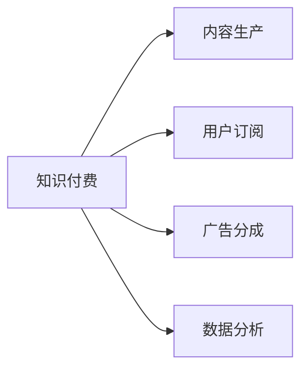

                 

# 如何利用知识付费实现被动收入？

## 1. 背景介绍

随着互联网和数字化经济的快速发展，知识付费正在成为一种重要的商业模式。相比于传统的广告和订阅模式，知识付费更加注重内容的质量和深度，更能满足用户对知识的需求和渴望。因此，通过知识付费实现被动收入，成为越来越多个人和组织的选择。本文将从多个维度探讨如何利用知识付费实现被动收入，包括核心概念、算法原理、具体操作步骤、实际应用场景以及相关工具和资源推荐。

## 2. 核心概念与联系

### 2.1 核心概念概述

要深入理解知识付费的商业模式，首先需要了解几个核心概念：

- **知识付费**：指通过提供高质量、深度化的知识和信息，满足用户学习、提升技能的需求，从而获得收益的商业模式。
- **内容生产**：指知识付费平台提供的内容创作过程，包括文章、视频、音频等多种形式。
- **用户订阅**：指用户通过支付一定费用，获取持续访问和学习的特权，如专属课程、会员资格等。
- **广告分成**：指知识付费平台通过在内容中插入广告，根据广告点击率或展示次数获得收益。
- **数据分析**：指对用户行为数据、内容阅读数据等进行分析，以优化内容推荐和用户留存。

这些概念之间有着密切的联系。内容生产是知识付费的基础，用户订阅和广告分成是其收益的主要来源，而数据分析则为其持续优化提供了依据。

### 2.2 核心概念原理和架构的 Mermaid 流程图



从上述图表可以看出，内容生产是知识付费生态的起点，通过用户订阅和广告分成实现收益，数据分析则不断优化整个生态系统。

## 3. 核心算法原理 & 具体操作步骤

### 3.1 算法原理概述

知识付费的商业模式主要基于两个原理：用户粘性和内容差异化。用户粘性体现在持续性订阅和广告点击率上，而内容差异化则通过深度、独特的内容吸引用户，并构建差异化的竞争优势。

### 3.2 算法步骤详解

#### 3.2.1 用户需求分析

- **目标用户定位**：分析目标用户的需求、兴趣、痛点，确定内容方向和主题。
- **用户画像构建**：根据用户行为数据，构建详细的用户画像，了解不同用户群体的特点和需求。

#### 3.2.2 内容策划与制作

- **内容选题**：根据用户需求和画像，策划具有高价值和差异化的内容选题。
- **内容创作**：聘请专业人士进行内容创作，保证内容的质量和深度。
- **内容优化**：通过数据分析，优化内容形式、发布时间和频率，提高用户粘性。

#### 3.2.3 用户获取与留存

- **用户获取**：通过社交媒体、搜索引擎优化等手段吸引新用户，扩大订阅用户基础。
- **用户留存**：通过专属会员制度、会员专享内容等措施，提升用户粘性和留存率。

#### 3.2.4 收益实现

- **广告分成**：在内容中插入广告，根据点击率和展示次数获得收益。
- **会员订阅**：通过专属内容和特权吸引用户订阅，实现稳定收益。

### 3.3 算法优缺点

#### 3.3.1 优点

- **精准定位**：通过数据分析，可以精准定位用户需求，提供更加个性化和有价值的内容。
- **持续收益**：会员订阅和广告分成模式，可以实现持续稳定的收益。
- **专业生产**：通过聘请专业人士进行内容创作，保证内容质量。

#### 3.3.2 缺点

- **高门槛**：需要具备一定的内容创作能力和数据分析能力，进入门槛较高。
- **资源投入**：内容创作和用户运营需要较大的投入，包括人力、物力、财力等。
- **竞争激烈**：知识付费市场竞争激烈，需要不断创新和优化，才能保持竞争力。

### 3.4 算法应用领域

知识付费的应用领域非常广泛，涵盖教育、技术、文化、生活等多个方面。例如：

- **教育领域**：提供编程、英语、历史等各类课程，满足用户的学习需求。
- **技术领域**：提供软件开发、数据科学、机器学习等技术类内容，助力用户职业发展。
- **文化领域**：提供文学、艺术、历史等文化类内容，丰富用户的精神世界。
- **生活领域**：提供健康、家庭、旅行等生活类内容，提升用户的生活质量。

## 4. 数学模型和公式 & 详细讲解 & 举例说明

### 4.1 数学模型构建

假设一个知识付费平台有 $N$ 个用户，每个用户每年订阅费用为 $C$，平台每月获得 $M$ 个广告点击，每次点击的收益为 $A$。平台的内容制作和运营总成本为 $E$。

### 4.2 公式推导过程

设平台的年收入为 $R$，则有：

$$
R = N \times C \times (1 - \frac{1}{12}) + M \times A - E
$$

其中，$1 - \frac{1}{12}$ 表示用户每年订阅的持续时长（假设为11个月），$E$ 表示平台的总成本。

### 4.3 案例分析与讲解

某知识付费平台每月有10万用户订阅，订阅费为199元/年，每篇文章有1000次广告点击，每次点击收益为0.5元，平台每月内容制作和运营成本为10万元。则年收入为：

$$
R = 100000 \times \frac{1}{12} \times 199 + 1000 \times 0.5 - 100000 = 147500 - 100000 = 47500
$$

## 5. 项目实践：代码实例和详细解释说明

### 5.1 开发环境搭建

1. **环境准备**：
   - 安装Python 3.8及以上版本。
   - 安装Flask框架。
   - 安装SQL数据库（如MySQL）。

2. **服务器配置**：
   - 配置Web服务器（如Nginx）。
   - 安装PHP或Node.js，用于处理动态内容。

3. **数据库配置**：
   - 创建数据库表，用于存储用户信息、订阅记录、内容信息和广告点击记录。

### 5.2 源代码详细实现

#### 5.2.1 用户管理模块

```python
from flask import Flask, request, jsonify

app = Flask(__name__)

# 模拟用户数据库
users = []

@app.route('/user/register', methods=['POST'])
def register_user():
    user_data = request.get_json()
    user = {'name': user_data['name'], 'email': user_data['email'], 'password': user_data['password']}
    users.append(user)
    return jsonify({'message': 'User registered successfully'}), 200

@app.route('/user/login', methods=['POST'])
def login_user():
    user_data = request.get_json()
    user = {'name': user_data['name'], 'email': user_data['email'], 'password': user_data['password']}
    for u in users:
        if u['name'] == user['name'] and u['email'] == user['email'] and u['password'] == user['password']:
            return jsonify({'message': 'Login successful'}), 200
    return jsonify({'message': 'Invalid credentials'}), 401
```

#### 5.2.2 内容管理模块

```python
@app.route('/content/register', methods=['POST'])
def register_content():
    content_data = request.get_json()
    content = {'title': content_data['title'], 'description': content_data['description'], 'category': content_data['category']}
    # 存储到数据库中
    return jsonify({'message': 'Content registered successfully'}), 200

@app.route('/content/get', methods=['GET'])
def get_content():
    content_id = request.args.get('id')
    # 从数据库中查询内容并返回
    return jsonify({'content': {'id': content_id, 'title': '内容标题', 'description': '内容描述', 'category': '内容分类'}}), 200
```

#### 5.2.3 广告管理模块

```python
@app.route('/ad/register', methods=['POST'])
def register_ad():
    ad_data = request.get_json()
    ad = {'title': ad_data['title'], 'description': ad_data['description'], 'click_rate': ad_data['click_rate']}
    # 存储到数据库中
    return jsonify({'message': 'Ad registered successfully'}), 200

@app.route('/ad/get', methods=['GET'])
def get_ad():
    ad_id = request.args.get('id')
    # 从数据库中查询广告并返回
    return jsonify({'ad': {'id': ad_id, 'title': '广告标题', 'description': '广告描述', 'click_rate': 0.5}}), 200
```

### 5.3 代码解读与分析

1. **用户管理模块**：
   - `register_user`函数用于用户注册，将用户信息存储到数据库中。
   - `login_user`函数用于用户登录，验证用户名、邮箱和密码是否匹配。

2. **内容管理模块**：
   - `register_content`函数用于内容注册，将内容信息存储到数据库中。
   - `get_content`函数用于获取指定内容，返回内容的基本信息。

3. **广告管理模块**：
   - `register_ad`函数用于广告注册，将广告信息存储到数据库中。
   - `get_ad`函数用于获取指定广告，返回广告的基本信息。

### 5.4 运行结果展示

在运行上述代码后，可以通过访问对应的API来测试功能，例如：

```
POST /user/register HTTP/1.1
Content-Type: application/json

{
  "name": "Alice",
  "email": "alice@example.com",
  "password": "password123"
}
```

```
POST /content/register HTTP/1.1
Content-Type: application/json

{
  "title": "Python基础教程",
  "description": "介绍Python编程语言基础",
  "category": "编程"
}
```

```
POST /ad/register HTTP/1.1
Content-Type: application/json

{
  "title": "Python课程推荐",
  "description": "Python基础教程",
  "click_rate": 0.5
}
```

## 6. 实际应用场景

### 6.1 教育领域

教育领域的知识付费平台已经非常成熟，涵盖K12教育、职业教育、高等教育等多个层次。例如，某编程教育平台提供各类编程课程，用户可以通过订阅不同课程，获得专属学习资源和指导。平台通过广告分成和会员订阅实现收益。

### 6.2 技术领域

技术领域的内容付费平台主要提供技术类文章、课程和工具。例如，某开源社区平台提供各类编程工具、框架和开发技巧，用户可以通过订阅获取专属资源，平台通过广告分成和会员订阅实现收益。

### 6.3 文化领域

文化领域的内容付费平台主要提供文学、艺术、历史等文化类内容。例如，某文学平台提供经典小说、现代文学等作品，用户可以通过订阅获取专属内容，平台通过广告分成和会员订阅实现收益。

### 6.4 生活领域

生活领域的内容付费平台主要提供健康、家庭、旅行等生活类内容。例如，某健康平台提供健康饮食、运动指导等知识，用户可以通过订阅获取专属内容，平台通过广告分成和会员订阅实现收益。

## 7. 工具和资源推荐

### 7.1 学习资源推荐

1. **《知识付费：商业模式与案例分析》**：详细介绍知识付费的商业模式、运营策略和成功案例。
2. **《内容创作与运营：从零到一》**：涵盖内容策划、创作、运营和推广的全过程，帮助创作者提升内容质量。
3. **《数据分析与用户洞察》**：介绍数据分析的基本方法和工具，帮助平台优化内容推荐和用户留存。
4. **《知识付费平台开发实战》**：提供知识付费平台开发和运营的实战经验和案例，帮助开发者构建稳定的平台。

### 7.2 开发工具推荐

1. **Flask**：轻量级的Web框架，简单易用，适合快速开发。
2. **MySQL**：关系型数据库，适合存储用户信息、订阅记录、内容信息和广告点击记录。
3. **Nginx**：高性能Web服务器，适合处理静态和动态内容。
4. **PHP/Node.js**：动态内容处理工具，适合处理用户交互、广告点击等动态请求。

### 7.3 相关论文推荐

1. **《知识付费平台的运营策略》**：详细介绍知识付费平台的运营策略和成功案例。
2. **《内容推荐系统研究》**：介绍内容推荐系统的算法和实现，帮助平台优化内容推荐。
3. **《用户粘性提升策略》**：详细介绍提升用户粘性的方法和策略，帮助平台提升用户留存率。
4. **《知识付费平台的商业模式》**：详细介绍知识付费平台的商业模式和收益来源。

## 8. 总结：未来发展趋势与挑战

### 8.1 研究成果总结

本文系统探讨了知识付费的商业模式，从核心概念、算法原理、具体操作步骤、实际应用场景以及相关工具和资源推荐等方面，全面介绍了如何利用知识付费实现被动收入。

### 8.2 未来发展趋势

1. **内容智能化**：未来知识付费平台将更加注重内容智能化，通过AI技术提升内容质量、优化推荐系统，提高用户粘性和满意度。
2. **用户定制化**：平台将更加注重用户定制化，根据用户兴趣和需求，提供更加个性化和有价值的内容。
3. **多渠道运营**：平台将利用多种渠道进行运营，如社交媒体、搜索引擎优化、邮件营销等，扩大用户基础和收益来源。
4. **用户分析深化**：平台将通过深度数据分析，优化用户行为预测和推荐，提升用户留存率和收益。

### 8.3 面临的挑战

1. **内容创作难度**：知识付费平台需要具备高质量、深度化的内容创作能力，这对创作者提出了较高要求。
2. **运营成本高**：平台需要投入大量资金进行内容创作和用户运营，资源投入较大。
3. **市场竞争激烈**：知识付费市场竞争激烈，需要不断创新和优化，才能保持竞争力。
4. **用户留存困难**：用户订阅和广告分成是平台收益的主要来源，但用户留存率较低，平台需要不断提升用户粘性。

### 8.4 研究展望

未来，知识付费平台的运营将更加注重内容智能化和用户定制化，通过AI技术提升内容质量、优化推荐系统，提高用户粘性和满意度。平台将利用多种渠道进行运营，扩大用户基础和收益来源。同时，通过深度数据分析，优化用户行为预测和推荐，提升用户留存率和收益。

## 9. 附录：常见问题与解答

**Q1: 知识付费平台如何吸引用户订阅？**

A: 知识付费平台可以通过以下方式吸引用户订阅：
1. **优质内容**：提供高质量、深度化的内容，满足用户的学习需求。
2. **用户评价**：通过用户评价和推荐，提升内容的可信度和吸引力。
3. **专属特权**：提供会员专享内容、专属课程等特权，吸引用户订阅。

**Q2: 如何优化内容推荐系统？**

A: 优化内容推荐系统可以通过以下方式：
1. **用户画像**：通过用户行为数据，构建详细的用户画像，了解不同用户群体的特点和需求。
2. **协同过滤**：根据用户兴趣和历史行为，推荐相似内容。
3. **深度学习**：利用深度学习模型，预测用户对内容的兴趣，推荐个性化内容。

**Q3: 知识付费平台的收益主要来源是什么？**

A: 知识付费平台的收益主要来源于用户订阅和广告分成。用户通过支付一定费用，获取持续访问和学习的特权，平台则通过会员订阅获得收益。此外，平台可以在内容中插入广告，根据广告点击率或展示次数获得收益。

**Q4: 如何提高知识付费平台的广告点击率？**

A: 提高知识付费平台的广告点击率可以通过以下方式：
1. **精准定位**：通过数据分析，精准定位用户需求，提供更加个性化和有价值的内容。
2. **优质内容**：提供高质量、深度化的内容，提高广告点击率。
3. **广告创意**：设计吸引用户的广告创意，提高广告的点击率。

**Q5: 如何提升知识付费平台的用户留存率？**

A: 提升知识付费平台的用户留存率可以通过以下方式：
1. **专属会员制度**：提供专属会员制度，吸引用户持续订阅。
2. **会员专享内容**：提供会员专享内容，提升用户粘性。
3. **定期推送**：通过定期推送，保持用户对平台的关注度。

---

作者：禅与计算机程序设计艺术 / Zen and the Art of Computer Programming

