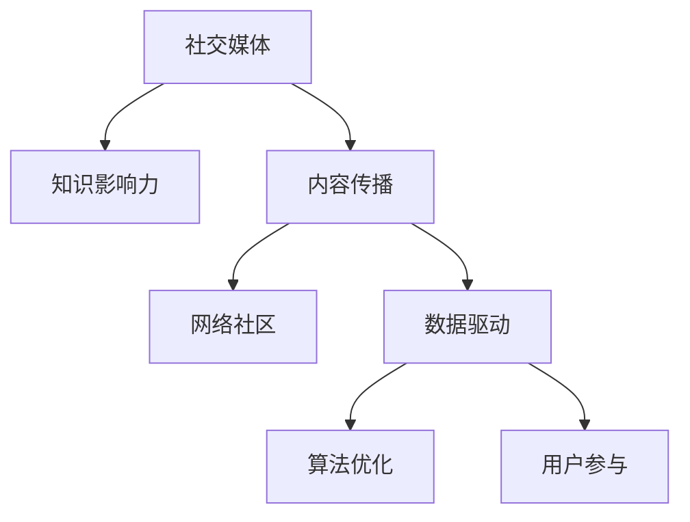

                 

# 如何利用社交媒体扩大知识影响力

> 关键词：社交媒体, 知识影响力, 内容传播, 网络社区, 数据驱动, 算法优化, 用户参与

## 1. 背景介绍

### 1.1 问题由来

在信息爆炸的时代，如何有效传播知识，扩大个人或组织的影响力，成为了一个重要课题。传统的书籍、讲座、论坛等方式，传播效率有限，难以触及广泛的受众。社交媒体作为一种新兴的传播渠道，以其高速、互动、低成本等优势，迅速成为知识传播的主要方式之一。

### 1.2 问题核心关键点

社交媒体如何高效传播知识，从而扩大影响力？这不仅是一个技术问题，更是一个多学科交叉的挑战。它涉及到传播学、心理学、社会学、计算机科学等多个领域，涉及内容创作、用户互动、算法推荐等多个环节。如何最大化利用社交媒体的传播潜力，将知识精准传达给目标受众，是本文的研究重点。

### 1.3 问题研究意义

利用社交媒体扩大知识影响力，对于提升个人或组织知名度、推动学术交流、加速知识传播具有重要意义：

1. **提升知名度**：通过社交媒体的传播，可以将知识和观点迅速传递给更多人，增加个人或组织在特定领域的权威性和影响力。
2. **推动学术交流**：社交媒体打破了时间和空间的限制，为学术交流提供了新的平台，促进了不同领域专家之间的互动和合作。
3. **加速知识传播**：社交媒体的即时性和互动性，使得知识传播更加高效，不再受限于传统出版和传播渠道的限制。

## 2. 核心概念与联系

### 2.1 核心概念概述

为更好地理解如何利用社交媒体扩大知识影响力，本节将介绍几个密切相关的核心概念：

- **社交媒体(Social Media)**：指通过互联网实现的，个人或组织之间的互动交流平台，如微博、微信、Twitter等。
- **知识影响力(Knowledge Influence)**：指知识或观点在特定领域或受众中的传播力和影响力。
- **内容传播(Content Dissemination)**：指将内容从创作者传递给目标受众的过程。
- **网络社区(Network Community)**：指通过社交媒体连接起来的用户群体，具有共同的兴趣或目标。
- **数据驱动(Data-Driven)**：指利用数据统计和算法分析指导内容传播和用户互动的策略。
- **算法优化(Algorithm Optimization)**：指通过优化算法提高内容传播效率和精准度。
- **用户参与(User Engagement)**：指通过互动和反馈，提高用户对内容的参与度和忠诚度。

这些核心概念之间的逻辑关系可以通过以下Mermaid流程图来展示：



这个流程图展示了几大核心概念及其之间的关系：

1. 社交媒体是知识传播和互动的基础平台。
2. 知识影响力通过内容传播在社交媒体上形成。
3. 内容传播受到网络社区的影响和反馈。
4. 数据驱动和算法优化指导内容传播策略。
5. 用户参与增强内容传播的效果。

## 3. 核心算法原理 & 具体操作步骤

### 3.1 算法原理概述

利用社交媒体扩大知识影响力的核心算法原理，可以概括为以下几点：

1. **内容创作与优化**：创作高质量、符合受众兴趣的内容，并应用优化算法提升内容的传播效率和效果。
2. **用户互动与反馈**：通过互动和反馈机制，了解受众的偏好和需求，调整内容策略。
3. **数据驱动分析**：利用数据统计和机器学习算法，预测受众行为和传播效果，指导内容传播策略。
4. **算法推荐系统**：利用推荐算法提高内容对目标受众的覆盖率和精准度。

### 3.2 算法步骤详解

#### 步骤1：内容创作与优化

**Step 1.1 确定受众群体**

分析受众的年龄、性别、地域、兴趣等特征，明确目标受众群体。可以通过社交媒体平台的分析工具，获取用户的基本信息和人口统计特征。

**Step 1.2 创作优质内容**

根据受众群体，创作高质量、符合受众兴趣的内容。内容形式可以包括文章、视频、图片等。内容创作可以参考以下策略：

- **内容多样化**：不同类型的受众对不同形式的内容反应不同，可以同时创作图文并茂的文章、视频、直播等。
- **引发共鸣**：创作能够引发受众共鸣的内容，如成功案例、感人故事、行业趋势等。
- **时效性强**：紧跟热点话题，及时发布相关内容，保持内容的时效性和新鲜感。

**Step 1.3 内容优化**

利用算法优化提升内容的传播效率和效果。常用的内容优化策略包括：

- **标题优化**：创作吸引眼球的标题，增加点击率。
- **标签优化**：利用关键词标签，提高内容的搜索排名。
- **多媒体优化**：优化图片、视频的质量和格式，提升用户观看体验。

#### 步骤2：用户互动与反馈

**Step 2.1 建立互动机制**

通过社交媒体的互动功能，建立与受众的互动机制。常用的互动方式包括：

- **评论与回复**：及时回复用户评论，增加用户参与度。
- **直播互动**：通过直播功能，实时与受众互动，回答问题。
- **问卷调查**：定期发布问卷调查，了解受众需求和反馈。

**Step 2.2 收集反馈信息**

收集受众对内容的反馈信息，分析受众的喜好和需求。常用的反馈收集方式包括：

- **评论分析**：分析用户评论的情感倾向和具体内容，了解受众的感受和反馈。
- **点赞和分享**：统计内容的点赞和分享数量，评估内容的受欢迎程度。
- **用户调查**：通过问卷调查，收集受众对内容的评价和建议。

**Step 2.3 调整内容策略**

根据反馈信息，调整内容创作和传播策略。常用的调整策略包括：

- **内容多样化**：根据受众反馈，调整内容形式和主题。
- **调整发布时间**：根据受众活跃时间，调整内容的发布时间。
- **互动优化**：根据互动数据，优化互动策略，提升用户参与度。

#### 步骤3：数据驱动分析

**Step 3.1 数据收集与处理**

收集社交媒体平台提供的数据，包括用户基本信息、内容互动数据、内容曝光数据等。常用的数据处理方式包括：

- **数据清洗**：去除无用数据和异常值，确保数据的准确性。
- **数据整合**：将来自不同来源的数据进行整合，形成完整的数据集。
- **数据可视化**：利用数据可视化工具，直观展示数据的趋势和规律。

**Step 3.2 数据建模与分析**

利用机器学习算法对数据进行建模和分析，预测受众行为和传播效果。常用的数据建模方式包括：

- **用户画像建模**：利用聚类算法，对用户进行分类，形成用户画像。
- **内容推荐建模**：利用协同过滤、深度学习等算法，预测受众对内容的喜好。
- **传播效果建模**：利用回归分析、时间序列分析等方法，预测内容的传播效果。

**Step 3.3 决策支持**

根据数据建模和分析结果，指导内容传播策略的调整和优化。常用的决策支持方式包括：

- **内容优化**：根据受众画像和内容推荐结果，优化内容创作和发布策略。
- **时间优化**：根据受众活跃时间，优化内容的发布时间和频率。
- **互动优化**：根据互动数据，优化互动策略，提升用户参与度。

#### 步骤4：算法推荐系统

**Step 4.1 推荐算法选择**

选择合适的推荐算法，提高内容对目标受众的覆盖率和精准度。常用的推荐算法包括：

- **协同过滤**：基于用户历史行为数据，推荐相似内容。
- **内容过滤**：基于内容特征，推荐相关内容。
- **深度学习**：利用神经网络模型，学习用户行为和内容特征。

**Step 4.2 推荐系统实现**

利用推荐算法实现内容推荐系统，通过社交媒体平台提供推荐功能。推荐系统实现步骤如下：

- **用户画像构建**：根据用户历史行为数据，构建用户画像。
- **内容特征提取**：提取内容的关键词、标签、主题等特征。
- **推荐模型训练**：利用推荐算法，训练推荐模型。
- **推荐结果生成**：根据用户画像和内容特征，生成推荐结果。

**Step 4.3 推荐效果评估**

评估推荐系统的推荐效果，优化推荐算法和策略。常用的评估指标包括：

- **覆盖率**：推荐内容对目标受众的覆盖率。
- **准确率**：推荐内容的相关性和精准度。
- **点击率**：用户对推荐内容的点击率。
- **转化率**：用户对推荐内容的最终转化率。

### 3.3 算法优缺点

**算法优点**：

1. **高效传播**：通过数据驱动和算法推荐，实现内容的精准传播，提升传播效率。
2. **用户互动**：利用用户互动机制，增加用户参与度，形成良好的反馈循环。
3. **数据分析**：通过数据建模和分析，预测受众行为和传播效果，优化内容策略。

**算法缺点**：

1. **数据隐私**：收集和分析用户数据，可能涉及用户隐私问题。
2. **算法偏见**：推荐算法可能存在算法偏见，影响内容的公正性和公平性。
3. **内容同质化**：过度依赖推荐算法，可能导致内容同质化，缺乏多样性。

### 3.4 算法应用领域

利用社交媒体扩大知识影响力的算法原理，已经被广泛应用于多个领域，例如：

- **教育培训**：利用社交媒体传播教育资源，提升教学效果和学习效率。
- **医疗健康**：通过社交媒体传播健康知识，普及医疗常识，提高公众健康意识。
- **科技研发**：利用社交媒体传播科研成果，促进学术交流和知识共享。
- **媒体出版**：利用社交媒体传播新闻资讯，扩大媒体影响力，吸引更多读者。
- **企业品牌**：利用社交媒体传播企业品牌和企业文化，提升企业知名度和美誉度。

## 4. 数学模型和公式 & 详细讲解  
### 4.1 数学模型构建

本节将使用数学语言对利用社交媒体扩大知识影响力的方法进行更加严格的刻画。

设社交媒体平台上的用户集合为 $U$，内容集合为 $C$。设用户 $u$ 对内容 $c$ 的互动评分 $r_{u,c}$ 服从 $0$ 到 $1$ 之间的均匀分布。设内容 $c$ 在时间 $t$ 的曝光次数为 $x_{c,t}$，内容 $c$ 在时间 $t$ 的点击次数为 $y_{c,t}$。

内容 $c$ 的传播效果 $E_c$ 可以用如下公式表示：

$$
E_c = \sum_{t=1}^T w_t \cdot x_{c,t} \cdot y_{c,t}
$$

其中 $T$ 为时间窗口，$w_t$ 为时间权重。

### 4.2 公式推导过程

对于内容 $c$，利用用户互动评分和曝光次数，计算其影响力 $I_c$：

$$
I_c = \sum_{u \in U} r_{u,c}
$$

通过计算内容的影响力，可以判断内容对受众的影响程度。影响力越高的内容，其传播效果也越好。

### 4.3 案例分析与讲解

**案例1：教育培训**

在教育培训领域，通过社交媒体传播教学资源，可以极大提升教学效果和学习效率。例如，某在线教育平台利用社交媒体推广一堂公开课，通过分析用户互动评分和点击次数，发现这堂公开课在特定时间段内影响力最大，于是调整该时间段内的推广策略，显著提升了课程的注册量和观看率。

**案例2：医疗健康**

在医疗健康领域，通过社交媒体传播健康知识，可以普及健康常识，提高公众健康意识。例如，某医院利用社交媒体推广健康科普文章，通过分析用户的互动评分和分享次数，发现某些内容在特定地区影响力最大，于是针对这些地区加强推广，提高了健康知识的普及率。

**案例3：科技研发**

在科技研发领域，通过社交媒体传播科研成果，可以促进学术交流和知识共享。例如，某科研机构利用社交媒体发布最新研究成果，通过分析用户的互动评分和引用次数，发现某些研究成果在特定领域内影响力最大，于是加强这些领域的研究投入，提升了科研机构的整体影响力。

## 5. 项目实践：代码实例和详细解释说明

### 5.1 开发环境搭建

在进行社交媒体内容传播实践前，我们需要准备好开发环境。以下是使用Python进行Web开发的开发环境配置流程：

1. 安装Anaconda：从官网下载并安装Anaconda，用于创建独立的Python环境。

2. 创建并激活虚拟环境：
```bash
conda create -n web-env python=3.8 
conda activate web-env
```

3. 安装Django：
```bash
pip install django
```

4. 安装Flask：
```bash
pip install flask
```

5. 安装SQLite：
```bash
pip install sqlite3
```

6. 安装Pandas：
```bash
pip install pandas
```

完成上述步骤后，即可在`web-env`环境中开始Web开发实践。

### 5.2 源代码详细实现

下面是利用Flask框架搭建Web平台的示例代码：

```python
from flask import Flask, request, jsonify

app = Flask(__name__)

# 定义数据存储结构
data = {
    'users': [],
    'contents': [],
    'interactions': []
}

# 初始化数据
app.before_first_request(lambda: data['users'].append({'id': 1, 'name': 'Alice'}))
app.before_first_request(lambda: data['contents'].append({'id': 1, 'title': 'Python教程', 'description': '介绍Python编程基础'}))
app.before_first_request(lambda: data['interactions'].append({'user_id': 1, 'content_id': 1, 'score': 0.8}))

# 定义路由
@app.route('/')
def index():
    return '欢迎访问社交媒体平台'

@app.route('/users', methods=['GET'])
def get_users():
    return jsonify(data['users'])

@app.route('/contents', methods=['GET'])
def get_contents():
    return jsonify(data['contents'])

@app.route('/interactions', methods=['GET'])
def get_interactions():
    return jsonify(data['interactions'])

# 运行Flask应用
if __name__ == '__main__':
    app.run(debug=True)
```

### 5.3 代码解读与分析

让我们再详细解读一下关键代码的实现细节：

**data字典**：
- `users` 存储用户信息。
- `contents` 存储内容信息。
- `interactions` 存储用户与内容的互动评分。

**before_first_request装饰器**：
- 在应用启动前，向数据结构中添加初始用户、内容和互动信息。

**路由定义**：
- `/` 定义应用主页。
- `/users` 定义获取用户列表接口。
- `/contents` 定义获取内容列表接口。
- `/interactions` 定义获取互动评分接口。

**Flask应用启动**：
- 运行Flask应用，并设置调试模式。

通过Flask框架，我们可以快速搭建Web平台，实现社交媒体的内容传播和互动功能。开发者可以根据实际需求，进一步扩展数据结构和路由逻辑。

### 5.4 运行结果展示

运行上述代码后，可以在浏览器中访问 `http://127.0.0.1:5000`，看到如下页面：

```
欢迎访问社交媒体平台
```

此页面提示应用已经启动。可以通过浏览器访问 `http://127.0.0.1:5000/users`、`http://127.0.0.1:5000/contents` 和 `http://127.0.0.1:5000/interactions`，分别查看用户、内容和互动信息。

## 6. 实际应用场景

### 6.1 智能教育

利用社交媒体扩大知识影响力，可以实现智能教育的创新应用，提升教学效果和学习效率。例如，通过社交媒体平台推广在线课程和教学资源，利用数据分析优化教学策略，实现个性化推荐和互动学习。

### 6.2 医疗健康

通过社交媒体传播健康知识和医疗资讯，可以普及健康常识，提高公众健康意识。例如，利用社交媒体推广健康科普文章和医疗指南，利用数据分析优化健康教育内容和推广策略。

### 6.3 企业品牌

利用社交媒体扩大企业品牌影响力，可以提升企业知名度和美誉度。例如，通过社交媒体平台推广企业品牌和企业文化，利用数据分析优化品牌传播策略，增强用户品牌认同感。

### 6.4 未来应用展望

随着社交媒体和数据分析技术的不断发展，利用社交媒体扩大知识影响力的应用场景将更加丰富，未来展望包括：

1. **虚拟现实与增强现实**：利用VR/AR技术，提供沉浸式的知识传播体验，增强受众参与度。
2. **多语言支持**：支持多语言内容传播，扩大知识影响力到全球受众。
3. **实时互动**：利用实时通信技术，实现用户与内容创作者之间的实时互动。
4. **内容生成**：利用AI生成技术，自动创作高质量内容，提高内容传播效率。
5. **个性化推荐**：利用深度学习技术，实现更加精准的内容推荐，提升受众满意度。

## 7. 工具和资源推荐

### 7.1 学习资源推荐

为了帮助开发者系统掌握利用社交媒体扩大知识影响力的方法，这里推荐一些优质的学习资源：

1. **《社交媒体营销》课程**：由顶尖商学院开设的课程，介绍了社交媒体营销的基本理论和实践技巧。
2. **《数据科学基础》书籍**：介绍数据科学基础和机器学习算法，适合进一步深入学习。
3. **《Python网络编程》书籍**：介绍Web开发基础和Flask框架的使用，适合Web开发实践。
4. **《数据分析实战》书籍**：介绍数据处理和分析的实战技巧，适合数据分析实践。
5. **《内容策略》书籍**：介绍内容创作和内容传播的策略和技巧，适合内容营销实践。

通过对这些资源的学习实践，相信你一定能够快速掌握利用社交媒体扩大知识影响力的方法，并用于解决实际的NLP问题。

### 7.2 开发工具推荐

高效的开发离不开优秀的工具支持。以下是几款用于社交媒体内容传播开发的常用工具：

1. **Flask**：轻量级Web框架，适合快速开发和部署Web应用。
2. **Django**：全栈Web框架，支持数据模型和后台管理，适合复杂Web应用。
3. **SQLite**：轻量级关系型数据库，适合小型Web应用。
4. **Pandas**：数据分析和处理库，支持数据清洗和统计分析。
5. **Jupyter Notebook**：交互式开发环境，支持Python编程和数据分析。

合理利用这些工具，可以显著提升社交媒体内容传播的开发效率，加快创新迭代的步伐。

### 7.3 相关论文推荐

利用社交媒体扩大知识影响力的相关研究已经取得了丰富的成果，以下是几篇奠基性的相关论文，推荐阅读：

1. **《社交媒体对知识传播的影响》**：介绍社交媒体如何影响知识的传播和受众行为。
2. **《基于社交媒体的数据驱动内容推荐》**：利用社交媒体数据进行内容推荐，提高受众满意度。
3. **《社交媒体内容创作的策略和效果》**：分析不同内容创作策略对受众的影响，提出优化建议。
4. **《社交媒体用户画像构建与分析》**：利用社交媒体数据构建用户画像，分析用户特征和行为规律。
5. **《社交媒体算法优化与推荐》**：介绍推荐算法的实现方法和优化策略，提高内容推荐效果。

这些论文代表了大语言模型微调技术的发展脉络。通过学习这些前沿成果，可以帮助研究者把握学科前进方向，激发更多的创新灵感。

## 8. 总结：未来发展趋势与挑战

### 8.1 总结

本文对利用社交媒体扩大知识影响力的方法进行了全面系统的介绍。首先阐述了社交媒体传播知识的重要性和影响力，明确了数据驱动和算法推荐在内容传播中的核心作用。其次，从原理到实践，详细讲解了社交媒体内容传播的数学模型和算法步骤，给出了社交媒体平台搭建和内容传播的代码实例。同时，本文还广泛探讨了内容传播在教育、医疗、企业品牌等多个行业领域的应用前景，展示了社交媒体内容传播的巨大潜力。

通过本文的系统梳理，可以看到，利用社交媒体扩大知识影响力的方法不仅高效，而且灵活多样。它能够通过数据驱动和算法优化，实现内容的精准传播，极大地提升了知识传播的效率和效果。未来，伴随社交媒体和数据分析技术的持续演进，利用社交媒体扩大知识影响力的应用场景将更加广泛，为知识传播带来新的突破。

### 8.2 未来发展趋势

展望未来，利用社交媒体扩大知识影响力的技术将呈现以下几个发展趋势：

1. **数据智能分析**：利用大数据和机器学习技术，实时分析受众行为和传播效果，指导内容创作和互动策略。
2. **多渠道融合**：将社交媒体与其他传播渠道（如邮件、短信、电视等）结合，实现多渠道协同传播，提升传播效果。
3. **个性化推荐**：利用深度学习技术，实现更加精准的内容推荐，提升受众满意度。
4. **情感分析**：利用自然语言处理技术，分析受众情感和反馈，优化内容创作策略。
5. **社交网络分析**：利用社交网络分析技术，研究受众社交网络特征，指导内容传播策略。

以上趋势凸显了利用社交媒体扩大知识影响力技术的广阔前景。这些方向的探索发展，必将进一步提升知识传播的效率和效果，为知识传播带来新的突破。

### 8.3 面临的挑战

尽管利用社交媒体扩大知识影响力技术已经取得了瞩目成就，但在迈向更加智能化、普适化应用的过程中，它仍面临着诸多挑战：

1. **数据隐私问题**：收集和分析用户数据，可能涉及用户隐私问题。如何在保护隐私的同时，优化内容传播策略，需要进一步探索。
2. **算法偏见**：推荐算法可能存在算法偏见，影响内容的公正性和公平性。如何消除算法偏见，保证内容的公正性，需要进一步研究。
3. **内容同质化**：过度依赖推荐算法，可能导致内容同质化，缺乏多样性。如何保持内容的多样性，满足不同受众的需求，需要进一步优化。
4. **用户互动不足**：用户互动机制的实现和优化，直接影响受众参与度和忠诚度。如何增强用户互动，提升用户参与度，需要进一步改进。

### 8.4 研究展望

面对利用社交媒体扩大知识影响力技术面临的种种挑战，未来的研究需要在以下几个方面寻求新的突破：

1. **数据隐私保护**：引入隐私保护技术，如差分隐私、联邦学习等，保护用户数据隐私。
2. **算法公平性**：引入公平性优化算法，如公平性约束、公平性采样等，消除算法偏见。
3. **内容多样化**：引入多样性优化算法，如多样性采样、多样性约束等，保持内容的多样性。
4. **互动机制优化**：引入互动机制优化算法，如个性化互动、情感分析等，增强用户互动。

这些研究方向的探索，必将引领利用社交媒体扩大知识影响力的技术迈向更高的台阶，为知识传播带来新的突破。面向未来，利用社交媒体扩大知识影响力的技术还需要与其他人工智能技术进行更深入的融合，如知识表示、因果推理、强化学习等，多路径协同发力，共同推动知识传播系统的进步。只有勇于创新、敢于突破，才能不断拓展知识传播的边界，让知识传播更加高效、精准、互动。

## 9. 附录：常见问题与解答

**Q1：如何衡量社交媒体内容的传播效果？**

A: 社交媒体内容的传播效果可以通过以下几个指标衡量：

1. **点击率**：用户对内容的点击次数与总曝光次数的比率。
2. **转化率**：用户对内容的最终转化（如购买、注册等）与点击次数的比率。
3. **覆盖率**：内容对目标受众的覆盖率，即有多少人看到过该内容。
4. **互动率**：用户与内容的互动次数（如点赞、评论、分享等）与总曝光次数的比率。
5. **影响力**：内容对受众的影响力，即有多少人受到该内容的影响。

通过这些指标，可以综合评估社交媒体内容的传播效果，优化内容策略和传播策略。

**Q2：如何选择适合的推荐算法？**

A: 选择适合的推荐算法需要考虑多个因素，包括内容类型、受众特征、平台特性等。常用的推荐算法包括：

1. **协同过滤**：适用于用户历史行为数据较多的平台，如电商网站。
2. **内容过滤**：适用于内容特征明显的平台，如视频平台。
3. **深度学习**：适用于用户历史行为数据较少、内容特征明显的平台，如音乐平台。

根据实际场景选择合适的推荐算法，可以提高内容推荐的精准度和效果。

**Q3：如何在社交媒体上构建用户画像？**

A: 在社交媒体上构建用户画像需要收集和分析用户行为数据，常用的方法包括：

1. **行为数据收集**：通过社交媒体平台的数据接口，收集用户的历史行为数据，如点赞、评论、分享等。
2. **特征提取**：提取用户的特征，如年龄、性别、地域等，用于构建用户画像。
3. **聚类分析**：利用聚类算法，将用户分为不同的群体，形成用户画像。
4. **画像优化**：根据用户行为数据和反馈信息，不断优化用户画像，提高画像的准确性。

通过构建用户画像，可以更好地理解用户特征和需求，优化内容传播策略。

**Q4：如何避免社交媒体内容的同质化？**

A: 避免社交媒体内容的同质化需要从多个方面进行优化：

1. **内容多样化**：创作不同形式和主题的内容，避免单一内容形式。
2. **平台多样性**：在不同的社交媒体平台上发布内容，扩大受众范围。
3. **算法优化**：利用多样性优化算法，如多样性采样、多样性约束等，优化推荐结果。
4. **用户互动**：增强用户互动，鼓励用户创作和分享多样性内容。

通过这些策略，可以保持内容的多样性，提升受众满意度。

**Q5：如何增强用户对社交媒体内容的参与度？**

A: 增强用户对社交媒体内容的参与度需要从多个方面进行优化：

1. **内容互动**：通过评论、点赞、分享等互动方式，增强用户对内容的参与度。
2. **个性化推荐**：利用推荐算法，推荐用户感兴趣的内容，提升用户满意度。
3. **情感分析**：利用情感分析技术，分析用户对内容的情感倾向，优化内容创作策略。
4. **互动机制**：通过直播、问答等互动机制，增强用户与内容创作者之间的互动。

通过这些策略，可以增强用户对社交媒体内容的参与度，提升用户忠诚度和满意度。

---

作者：禅与计算机程序设计艺术 / Zen and the Art of Computer Programming

