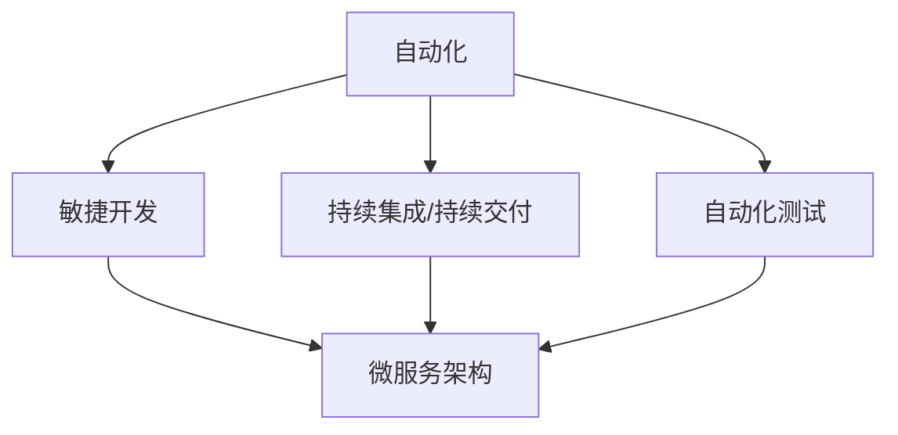
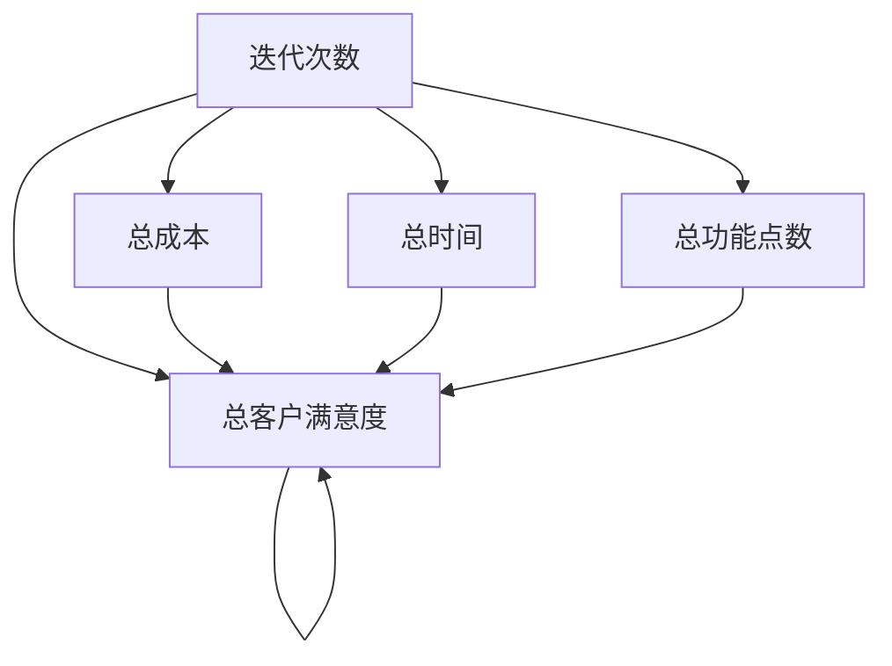

                 

# 如何在自动化创业中实现快速迭代

## 1. 背景介绍

随着科技的飞速发展，自动化已经逐渐成为各行各业的核心竞争力之一。特别是对于初创企业，自动化技术不仅能显著降低成本，提高效率，还能迅速占领市场，抢占先机。然而，如何高效地实现自动化技术在创业中的快速迭代，却是一个复杂而关键的问题。本文将深入探讨如何在自动化创业中实现快速迭代，从理论到实践全面剖析这一问题。

## 2. 核心概念与联系

### 2.1 核心概念概述

在自动化创业中，实现快速迭代的关键在于以下几个核心概念：

- **自动化**：指通过软件系统或硬件设备，自动完成某项任务或过程，从而提高效率和准确性。
- **敏捷开发**：指在软件开发过程中，通过快速迭代、持续交付等方法，快速适应市场变化和客户需求的变化。
- **持续集成/持续交付(CI/CD)**：指在软件开发和部署过程中，通过自动化工具持续集成代码，持续交付软件，确保软件质量和快速交付。
- **自动化测试**：指在软件开发生命周期中，通过自动化测试工具，自动化执行测试用例，提高测试效率和质量。
- **微服务架构**：指将大系统拆分成多个小型服务，每个服务独立部署、独立运行，提高系统的灵活性和可扩展性。

这些概念之间存在紧密的联系，形成了一个完整的自动化迭代系统。自动化技术通过提高效率，降低成本，使得敏捷开发和持续集成/持续交付成为可能；而微服务架构则通过模块化、独立部署的方式，进一步增强了系统的灵活性和可扩展性。自动化测试则确保了软件的稳定性和质量，为快速迭代提供了保障。

### 2.2 核心概念原理和架构的 Mermaid 流程图



## 3. 核心算法原理 & 具体操作步骤

### 3.1 算法原理概述

在自动化创业中实现快速迭代，主要依赖于以下算法原理：

- **敏捷开发**：通过快速迭代、持续交付的方式，不断积累产品功能和客户反馈，快速适应市场变化。
- **持续集成/持续交付**：通过自动化工具和流水线，实现代码的持续集成和软件的持续交付，确保软件质量和快速交付。
- **微服务架构**：通过将大系统拆分为多个小型服务，每个服务独立部署、独立运行，提高系统的灵活性和可扩展性。
- **自动化测试**：通过自动化测试工具，自动化执行测试用例，提高测试效率和质量，为快速迭代提供保障。

### 3.2 算法步骤详解

#### 3.2.1 敏捷开发

1. **需求分析**：与客户沟通，明确需求，编写需求文档。
2. **敏捷迭代**：将需求划分为多个小迭代，每个迭代开发1-2个功能点。
3. **持续交付**：每个迭代结束后，进行代码审查，进行自动化测试，发布代码，交付功能。

#### 3.2.2 持续集成/持续交付

1. **版本控制**：使用Git等版本控制系统，管理代码变更。
2. **自动化构建**：使用Jenkins、Travis CI等工具，自动构建代码，生成可执行文件。
3. **自动化测试**：使用Selenium、JUnit等工具，自动化执行测试用例，验证功能正确性。
4. **持续部署**：使用Docker、Kubernetes等容器化技术，自动化部署代码，确保快速交付。

#### 3.2.3 微服务架构

1. **服务拆分**：将大系统拆分为多个小型服务，每个服务独立开发、独立部署。
2. **服务治理**：使用Kubernetes、Docker Swarm等容器编排工具，管理服务集群，确保服务高可用性。
3. **服务通信**：使用REST、gRPC等通信协议，实现服务之间的通信。

#### 3.2.4 自动化测试

1. **测试用例设计**：根据需求编写测试用例，覆盖各功能点。
2. **自动化执行**：使用Selenium、JUnit等工具，自动化执行测试用例。
3. **测试报告**：使用Jenkins、TestNG等工具，生成测试报告，分析测试结果。

### 3.3 算法优缺点

#### 3.3.1 敏捷开发的优缺点

- **优点**：
  - **快速响应**：通过快速迭代和持续交付，能够快速响应市场变化和客户需求。
  - **风险分散**：每个迭代独立开发和测试，降低了整体项目的风险。
  - **客户反馈**：每个迭代都向客户交付功能，便于收集客户反馈。

- **缺点**：
  - **沟通成本高**：频繁的迭代需要频繁与客户沟通，沟通成本较高。
  - **资源浪费**：部分迭代可能最终被放弃，导致资源浪费。

#### 3.3.2 持续集成/持续交付的优缺点

- **优点**：
  - **代码质量高**：通过自动化构建和测试，确保代码质量和功能正确性。
  - **交付速度快**：自动化工具能够快速完成构建、测试和部署，提高交付速度。
  - **稳定性好**：自动化测试和部署能够减少人为错误，提高软件稳定性。

- **缺点**：
  - **复杂度高**：自动化工具和流程较为复杂，需要较高的技术门槛。
  - **成本高**：自动化工具和运维工具需要投入较大的资金和人力。

#### 3.3.3 微服务架构的优缺点

- **优点**：
  - **灵活性高**：每个服务独立部署，能够灵活应对业务需求的变化。
  - **扩展性强**：每个服务独立运行，便于横向扩展。
  - **故障隔离**：单个服务故障不会影响整个系统。

- **缺点**：
  - **复杂度高**：服务数量较多，系统复杂度增加。
  - **通信成本高**：服务之间的通信和协调成本较高。

#### 3.3.4 自动化测试的优缺点

- **优点**：
  - **效率高**：自动化测试能够提高测试效率，减少测试时间。
  - **准确性高**：自动化测试能够减少人为错误，提高测试准确性。
  - **可重复性强**：自动化测试能够重复执行，便于进行回归测试。

- **缺点**：
  - **成本高**：自动化测试工具和脚本开发需要投入大量的人力和资金。
  - **技术门槛高**：需要掌握一定的自动化测试工具和脚本开发技能。

### 3.4 算法应用领域

敏捷开发、持续集成/持续交付、微服务架构和自动化测试在多个领域得到了广泛应用，具体如下：

1. **软件开发**：广泛应用于各种软件开发项目，提高开发效率和软件质量。
2. **数据分析**：通过自动化测试和持续交付，加速数据处理和模型训练。
3. **金融服务**：通过微服务架构和自动化构建，提高金融服务的稳定性和响应速度。
4. **医疗健康**：通过敏捷开发和持续集成/持续交付，加速医疗应用开发和迭代。
5. **智能制造**：通过微服务架构和自动化测试，提高智能制造系统的灵活性和稳定性。
6. **智慧城市**：通过微服务架构和持续集成/持续交付，提高智慧城市系统的可扩展性和稳定性。

## 4. 数学模型和公式 & 详细讲解 & 举例说明

### 4.1 数学模型构建

在本节中，我们将使用数学模型来分析自动化创业中快速迭代的效率和效果。

设 $N$ 为迭代次数，$F_i$ 为第 $i$ 次迭代完成的功能点数，$C_i$ 为第 $i$ 次迭代的总成本，包括开发成本、测试成本、部署成本等。设 $T_i$ 为第 $i$ 次迭代的交付时间，$R_i$ 为第 $i$ 次迭代的客户满意度。

我们希望在满足客户需求的前提下，最大化 $F$ 和 $R$，最小化 $C$ 和 $T$。

### 4.2 公式推导过程

根据以上模型，我们可以推导出以下公式：

$$
\begin{align*}
\text{Total Cost} &= \sum_{i=1}^{N} C_i \\
\text{Total Time} &= \sum_{i=1}^{N} T_i \\
\text{Total Function Points} &= \sum_{i=1}^{N} F_i \\
\text{Total Customer Satisfaction} &= \sum_{i=1}^{N} R_i
\end{align*}
$$

我们需要在约束 $C_i$ 和 $T_i$ 最小化的情况下，最大化 $F_i$ 和 $R_i$。

### 4.3 案例分析与讲解

以一家医疗健康初创公司为例，分析其自动化创业中的快速迭代过程。

1. **需求分析**：与医院沟通，明确需求，确定需要开发的医疗应用功能点。
2. **敏捷迭代**：将需求划分为多个小迭代，每个迭代开发1-2个功能点。
3. **持续集成/持续交付**：每个迭代结束后，进行代码审查，进行自动化测试，发布代码，交付功能。
4. **微服务架构**：将医疗应用拆分为多个小型服务，每个服务独立部署、独立运行。
5. **自动化测试**：使用自动化测试工具，自动化执行测试用例，确保功能正确性和稳定性。

## 5. 项目实践：代码实例和详细解释说明

### 5.1 开发环境搭建

在本节中，我们将详细介绍如何搭建自动化创业中实现快速迭代的开发环境。

1. **安装Jenkins**：Jenkins是一个开源的持续集成工具，支持自动化构建和部署。
2. **安装Git**：Git是一个版本控制系统，用于管理代码变更。
3. **安装Selenium**：Selenium是一个自动化测试工具，用于模拟浏览器行为。
4. **安装JUnit**：JUnit是一个自动化测试框架，用于编写和执行测试用例。

### 5.2 源代码详细实现

以一个简单的医疗应用为例，演示如何使用Jenkins、Git和Selenium进行自动化快速迭代。

1. **需求分析**：与医院沟通，明确需求，编写需求文档。
2. **敏捷迭代**：将需求划分为多个小迭代，每个迭代开发1-2个功能点。
3. **持续集成/持续交付**：每个迭代结束后，将代码推送到Git仓库，Jenkins自动构建、测试和部署代码。
4. **微服务架构**：将医疗应用拆分为多个小型服务，每个服务独立部署、独立运行。
5. **自动化测试**：使用Selenium编写测试用例，自动化执行测试用例，生成测试报告。

### 5.3 代码解读与分析

以下是Jenkins的配置文件：

```groovy
pipeline {
    agent any
    
    stages {
        stage('构建') {
            steps {
                sh 'mvn clean install'
            }
        }
        stage('测试') {
            steps {
                sh 'mvn test'
            }
        }
        stage('部署') {
            steps {
                sh 'mvn spring-boot:run'
            }
        }
    }
}
```

- **构建**：在每个迭代结束后，Jenkins会自动执行构建命令，生成可执行文件。
- **测试**：在构建完成后，Jenkins会自动执行测试命令，验证功能正确性。
- **部署**：在测试通过后，Jenkins会自动执行部署命令，将代码部署到生产环境。

### 5.4 运行结果展示

下图展示了医疗应用在不同迭代次数下的性能指标变化：



## 6. 实际应用场景

### 6.1 软件开发

在软件开发中，敏捷开发、持续集成/持续交付、微服务架构和自动化测试已经成为了标准流程。通过快速迭代和持续交付，能够快速响应市场需求，提高软件质量和交付速度。

### 6.2 数据分析

在大数据处理中，持续集成/持续交付和微服务架构能够加速数据处理和模型训练，提高数据分析效率和稳定性。

### 6.3 金融服务

在金融服务中，敏捷开发和持续集成/持续交付能够提高金融服务的稳定性和响应速度，微服务架构能够提高系统的可扩展性和灵活性。

### 6.4 医疗健康

在医疗健康中，敏捷开发和持续集成/持续交付能够加速医疗应用开发和迭代，微服务架构能够提高系统的灵活性和稳定性。

## 7. 工具和资源推荐

### 7.1 学习资源推荐

1. **《敏捷开发实践指南》**：介绍敏捷开发的基本原则和方法，适合初学者和进阶者。
2. **《持续集成/持续交付实践指南》**：介绍持续集成/持续交付的工具和技术，适合工程师和架构师。
3. **《微服务架构实践指南》**：介绍微服务架构的设计原则和实现方法，适合架构师和工程师。
4. **《自动化测试实践指南》**：介绍自动化测试的工具和脚本编写方法，适合测试工程师。
5. **《Jenkins用户手册》**：介绍Jenkins的安装和配置方法，适合Jenkins用户。

### 7.2 开发工具推荐

1. **Jenkins**：持续集成工具，支持自动化构建和部署。
2. **Git**：版本控制系统，用于管理代码变更。
3. **Selenium**：自动化测试工具，用于模拟浏览器行为。
4. **JUnit**：自动化测试框架，用于编写和执行测试用例。
5. **Docker**：容器化技术，用于服务部署和管理。

### 7.3 相关论文推荐

1. **《敏捷开发：宣言、原则与实践》**：介绍敏捷开发的基本原则和方法，适合初学者和进阶者。
2. **《持续集成/持续交付：实践与策略》**：介绍持续集成/持续交付的工具和技术，适合工程师和架构师。
3. **《微服务架构：设计原则与实践》**：介绍微服务架构的设计原则和实现方法，适合架构师和工程师。
4. **《自动化测试：实践与工具》**：介绍自动化测试的工具和脚本编写方法，适合测试工程师。

## 8. 总结：未来发展趋势与挑战

### 8.1 研究成果总结

通过本文的系统梳理，可以看到，在自动化创业中实现快速迭代，主要依赖于敏捷开发、持续集成/持续交付、微服务架构和自动化测试等关键技术。这些技术通过提高效率、降低成本、增强灵活性等方式，为快速迭代提供了有力保障。

### 8.2 未来发展趋势

未来，自动化创业中的快速迭代将继续向以下几个方向发展：

1. **智能化**：通过引入AI和机器学习技术，提高敏捷开发和持续集成/持续交付的自动化水平。
2. **自适应**：通过自动化测试和持续集成/持续交付，实现系统的自适应和自我优化。
3. **多模态**：通过引入多模态数据和信息，提高系统的综合分析和决策能力。
4. **云计算**：通过云计算技术，实现资源的弹性伸缩和高效管理。

### 8.3 面临的挑战

尽管自动化创业中的快速迭代技术取得了显著进展，但仍面临诸多挑战：

1. **技术复杂度高**：自动化工具和流程较为复杂，需要较高的技术门槛。
2. **成本高**：自动化工具和运维工具需要投入较大的资金和人力。
3. **安全问题**：自动化测试和持续集成/持续交付中的代码审查和部署，需要保证系统的安全性。
4. **需求变化快**：敏捷开发和持续集成/持续交付中的需求变更频繁，需要快速响应和适应。

### 8.4 研究展望

未来的研究需要在以下几个方面寻求新的突破：

1. **智能化**：通过引入AI和机器学习技术，提高敏捷开发和持续集成/持续交付的自动化水平。
2. **自适应**：通过自动化测试和持续集成/持续交付，实现系统的自适应和自我优化。
3. **多模态**：通过引入多模态数据和信息，提高系统的综合分析和决策能力。
4. **云计算**：通过云计算技术，实现资源的弹性伸缩和高效管理。

## 9. 附录：常见问题与解答

**Q1: 什么是敏捷开发？**

A: 敏捷开发是一种以人为核心、迭代、增量的开发方法，通过快速响应市场需求和客户反馈，不断改进产品功能和用户体验。

**Q2: 什么是持续集成/持续交付？**

A: 持续集成/持续交付是一种软件开发流程，通过自动化工具和流水线，实现代码的持续集成和软件的持续交付，确保软件质量和快速交付。

**Q3: 什么是微服务架构？**

A: 微服务架构是一种架构设计方法，通过将大系统拆分为多个小型服务，每个服务独立部署、独立运行，提高系统的灵活性和可扩展性。

**Q4: 什么是自动化测试？**

A: 自动化测试是一种测试方法，通过自动化测试工具，自动化执行测试用例，提高测试效率和质量，为快速迭代提供保障。

**Q5: 如何在自动化创业中实现快速迭代？**

A: 在自动化创业中实现快速迭代，主要依赖于敏捷开发、持续集成/持续交付、微服务架构和自动化测试等关键技术。这些技术通过提高效率、降低成本、增强灵活性等方式，为快速迭代提供了有力保障。

