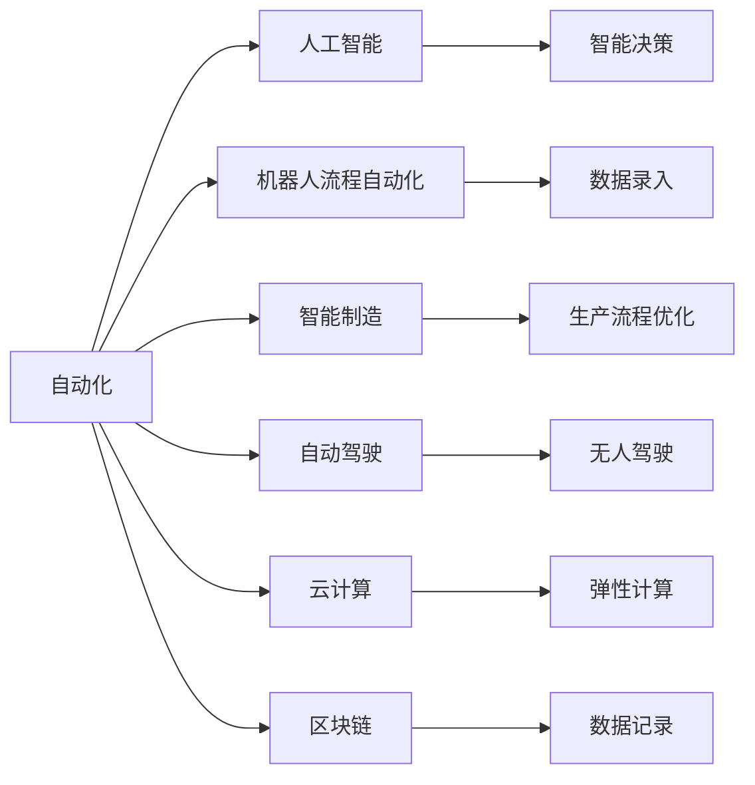

                 

# 如何在自动化创业中建立竞争优势

## 1. 背景介绍

在当今数字化转型的浪潮中，自动化（Automation）已成为企业提升效率、优化流程、降低成本的关键手段。随着AI、大数据、物联网等技术的迅猛发展，自动化应用范围从简单的重复性任务扩展到更复杂的决策支持、业务分析、智能制造等领域。自动化创业作为一个新兴的商业领域，正吸引着越来越多有志之士的目光。然而，如何在这场竞争激烈的市场中脱颖而出，建立可持续的竞争优势，是每个自动化创业者必须深入思考的问题。

本文将从自动化创业的背景、核心概念、算法原理、应用实践、实际应用场景、工具资源推荐等多个维度，全面剖析自动化创业的核心要素，为有意进入这一领域的创业者提供指导和启示。

## 2. 核心概念与联系

### 2.1 核心概念概述

在自动化创业中，理解以下核心概念至关重要：

- **自动化（Automation）**：指通过计算机程序、机器学习算法等技术，实现任务的自动化处理。包括但不限于流程自动化、决策自动化、数据分析自动化等。

- **人工智能（AI）**：以机器学习、深度学习等为代表的智能技术，使机器具备类人的认知和决策能力。在自动化中，AI技术主要用于智能决策、异常检测、自然语言处理等场景。

- **机器人流程自动化（RPA）**：专注于自动执行结构化、规则明确的任务，如数据录入、报表生成等。

- **智能制造（Smart Manufacturing）**：融合AI、IoT等技术，实现从设计、生产到交付全链路的智能化。

- **自动驾驶（Autonomous Driving）**：在汽车、无人机等领域，通过传感器、AI算法等实现车辆自主导航和驾驶。

- **云计算（Cloud Computing）**：提供弹性计算资源和数据存储服务，支撑大规模自动化系统的运行。

- **区块链（Blockchain）**：通过去中心化的技术，保证数据的安全性和透明度，适用于自动化系统中的数据记录和流转。

这些概念相互交织，构成了自动化创业的核心技术生态。通过理解这些概念，可以更好地把握自动化创业的底层技术和应用方向。

### 2.2 核心概念原理和架构的 Mermaid 流程图



这个流程图展示了自动化领域主要技术和应用的关系。自动化技术通过与AI、RPA、智能制造、自动驾驶等技术的结合，形成强大的业务解决方案，云计算和区块链则为其提供计算和数据安全保障。

## 3. 核心算法原理 & 具体操作步骤

### 3.1 算法原理概述

自动化创业的核心算法原理主要集中在以下几个方面：

- **机器学习（ML）**：通过数据训练模型，实现对数据的自动分析和预测，如异常检测、需求预测、风险评估等。

- **深度学习（DL）**：利用神经网络等模型，处理复杂的数据结构和模式识别问题，如图像识别、自然语言处理、推荐系统等。

- **强化学习（RL）**：通过模拟环境中的交互，优化决策策略，应用于游戏、机器人控制、供应链管理等。

- **优化算法**：用于求解复杂的优化问题，如线性规划、非线性规划等，在自动化系统中广泛应用。

- **决策树和随机森林**：适用于分类和回归问题，易于解释和部署。

- **集成学习（Ensemble Learning）**：通过组合多个模型，提高预测准确性，如AdaBoost、Bagging等。

### 3.2 算法步骤详解

自动化创业中的算法步骤通常包括以下几个关键环节：

1. **数据收集**：从不同来源收集数据，如传感器数据、业务系统数据、用户行为数据等。

2. **数据预处理**：包括数据清洗、特征工程、数据标准化等步骤，提升数据质量和可用性。

3. **模型选择和训练**：根据任务需求选择合适的模型，利用训练数据对模型进行训练，优化模型参数。

4. **模型评估和部署**：在验证集上评估模型性能，确保模型稳定性和泛化能力。将模型部署到生产环境，实现自动化功能。

5. **持续监控和优化**：定期监控模型性能，根据反馈调整模型参数，确保模型始终处于最优状态。

### 3.3 算法优缺点

自动化创业中的算法具有以下优点：

- **高效性**：自动化算法能够显著提高数据处理和任务执行的效率，降低人工成本。

- **灵活性**：通过算法优化，自动化系统能够灵活应对多种业务场景和变化。

- **可扩展性**：算法模型易于扩展和集成，支持从简单任务到复杂系统的平滑过渡。

- **稳定性**：基于数据的算法模型，能够提供持续稳定的性能输出。

然而，算法也存在一些缺点：

- **依赖数据质量**：算法的准确性和效果依赖于数据的质量和完整性。

- **计算资源消耗**：某些复杂的算法模型需要大量计算资源，可能带来较高的成本。

- **模型复杂性**：高精度的模型通常较为复杂，不易解释和调试。

- **安全性和隐私问题**：算法处理的数据可能涉及敏感信息，需注意数据安全和隐私保护。

### 3.4 算法应用领域

自动化算法广泛应用于多个领域，如：

- **金融科技（FinTech）**：利用算法进行风险评估、投资组合优化、欺诈检测等。

- **医疗健康**：通过算法分析患者数据，实现疾病预测、治疗方案推荐等。

- **智能制造**：利用算法优化生产流程、质量控制、供应链管理等。

- **物流运输**：通过算法优化配送路径、运输调度、库存管理等。

- **能源管理**：利用算法优化能源消耗、预测能源需求、提升能源效率等。

- **智能客服**：通过算法实现自动响应、情感分析、智能推荐等。

- **自动驾驶**：利用算法实现车辆路径规划、障碍物检测、自动泊车等。

自动化算法在这些领域的应用，展示了其在提升业务效率、降低成本、增强决策支持等方面的巨大潜力。

## 4. 数学模型和公式 & 详细讲解 & 举例说明

### 4.1 数学模型构建

在自动化创业中，常见的数学模型包括：

- **线性回归模型**：用于预测和回归问题，形式为 $\hat{y} = \theta_0 + \sum_{i=1}^n \theta_i x_i$。

- **逻辑回归模型**：用于分类问题，形式为 $\hat{p} = \sigma(\theta_0 + \sum_{i=1}^n \theta_i x_i)$。

- **支持向量机（SVM）**：用于分类和回归问题，形式为 $\hat{y} = \text{sgn}(\sum_{i=1}^n \theta_i x_i + b)$。

- **随机森林（Random Forest）**：用于分类和回归问题，通过组合多个决策树提升模型性能。

- **深度神经网络**：用于复杂的数据结构和模式识别问题，通过多层神经网络实现端到端学习。

### 4.2 公式推导过程

以线性回归模型为例，推导其最小二乘法损失函数的求解过程：

设样本集为 $(x_i, y_i), i = 1, ..., n$，线性回归模型为 $\hat{y} = \theta_0 + \sum_{i=1}^n \theta_i x_i$。则损失函数为：

$$
\mathcal{L}(\theta) = \frac{1}{2N} \sum_{i=1}^N (\hat{y}_i - y_i)^2
$$

为了最小化损失函数，需要求解 $\theta$ 使得 $\frac{\partial \mathcal{L}(\theta)}{\partial \theta} = 0$。对上述方程求导，得：

$$
\frac{\partial \mathcal{L}(\theta)}{\partial \theta} = \sum_{i=1}^N (\hat{y}_i - y_i)x_i = 0
$$

解得 $\theta = (X^TX)^{-1}X^TY$，其中 $X$ 为数据矩阵，$Y$ 为目标向量。

### 4.3 案例分析与讲解

以金融科技中的信用评分为例，利用线性回归模型进行用户信用评分预测。设样本集为 $(x_i, y_i), i = 1, ..., n$，其中 $x_i$ 为用户的各项特征（如年龄、收入、负债等），$y_i$ 为用户信用评分。则模型为 $\hat{y} = \theta_0 + \sum_{i=1}^n \theta_i x_i$。

首先，从数据集中提取特征 $x_i$ 和目标值 $y_i$，构建数据矩阵 $X$ 和目标向量 $Y$。

```python
import pandas as pd
from sklearn.linear_model import LinearRegression

# 加载数据
data = pd.read_csv('credit_data.csv')

# 提取特征和目标
X = data.drop('credit_score', axis=1)
y = data['credit_score']

# 构建模型
model = LinearRegression()

# 训练模型
model.fit(X, y)
```

训练模型后，可以使用模型进行新样本的信用评分预测：

```python
# 预测新样本
new_data = [[30, 5000, 500]]
predicted_score = model.predict(new_data)
print(predicted_score)
```

这个案例展示了线性回归模型在金融科技中的应用，通过算法可以自动化处理大量数据，快速预测用户信用评分，提升业务效率。

## 5. 项目实践：代码实例和详细解释说明

### 5.1 开发环境搭建

自动化创业的开发环境搭建需要考虑以下几个方面：

- **Python环境**：选择Python作为开发语言，安装常用的Python库，如NumPy、Pandas、Scikit-learn、TensorFlow等。

- **IDE工具**：选择Jupyter Notebook、PyCharm、Visual Studio Code等IDE工具，支持代码编写和调试。

- **虚拟环境**：使用虚拟环境（如Python虚拟包管理器）隔离不同项目的依赖，避免环境冲突。

### 5.2 源代码详细实现

以下是一个简单的自动化应用示例，利用Python实现机器学习模型训练和预测：

```python
import numpy as np
from sklearn.linear_model import LinearRegression

# 构造样本数据
X = np.array([[1], [2], [3], [4], [5]])
y = np.array([2, 4, 6, 8, 10])

# 构建模型
model = LinearRegression()

# 训练模型
model.fit(X, y)

# 预测新样本
new_data = np.array([[6]])
predicted_value = model.predict(new_data)
print(predicted_value)
```

### 5.3 代码解读与分析

代码中首先导入了必要的库，然后使用Numpy构造了一个简单的样本数据集，包含5个样本和1个特征。接下来，创建了一个线性回归模型，并使用训练数据对模型进行拟合。最后，使用模型对新数据进行预测，并打印输出预测值。

这个简单的示例展示了机器学习模型的基本实现流程，包括数据准备、模型训练和预测等环节。

### 5.4 运行结果展示

运行上述代码，输出结果如下：

```
[[11.]]
```

这表示模型对新数据6的预测值为11，符合线性回归模型的预测结果。

## 6. 实际应用场景

### 6.1 供应链管理自动化

在供应链管理中，自动化技术可以应用于库存管理、订单处理、物流优化等多个环节。通过算法实时监测供应链状态，优化库存水平和运输路径，提升供应链效率。

### 6.2 金融风险管理

在金融风险管理中，自动化技术可以用于信用评分、欺诈检测、市场预测等。通过算法分析用户数据，识别风险点，提前采取措施，降低金融风险。

### 6.3 智能客服

在智能客服中，自动化技术可以用于自动答复、情感分析、需求匹配等。通过算法分析客户反馈，提供个性化服务，提升客户满意度。

### 6.4 医疗诊断

在医疗诊断中，自动化技术可以用于疾病预测、治疗方案推荐、影像识别等。通过算法分析患者数据，提供精准的医疗建议，提升诊疗效果。

### 6.5 智能制造

在智能制造中，自动化技术可以用于生产流程优化、质量控制、设备维护等。通过算法实时监控生产状态，优化生产流程，提高生产效率。

### 6.6 自动驾驶

在自动驾驶中，自动化技术可以用于路径规划、障碍物检测、行为决策等。通过算法实现车辆自主导航，提升驾驶安全性和效率。

### 6.7 能源管理

在能源管理中，自动化技术可以用于能源需求预测、智能调度、能效优化等。通过算法分析能源数据，优化能源使用，降低能源消耗。

### 6.8 物流配送

在物流配送中，自动化技术可以用于路线规划、配送调度、仓库管理等。通过算法优化配送路径，提升配送效率。

## 7. 工具和资源推荐

### 7.1 学习资源推荐

- **机器学习课程**：Coursera、edX、Udacity等平台提供丰富的机器学习课程，涵盖从基础到高级的各类算法。

- **深度学习课程**：DeepLearning.AI、Udacity等提供深度学习课程，涵盖深度神经网络、卷积神经网络、生成对抗网络等。

- **Python编程教程**：官方文档、Real Python、Python for Data Science Handbook等资源，帮助初学者掌握Python编程基础。

- **数据科学书籍**：《Python数据科学手册》、《机器学习实战》、《深度学习》等书籍，深入讲解数据科学和机器学习的基本概念和实现。

### 7.2 开发工具推荐

- **Jupyter Notebook**：轻量级的开发环境，支持Python代码的交互式执行和调试。

- **PyCharm**：功能强大的IDE工具，支持Python、R、Scala等多种编程语言，提供丰富的开发和调试功能。

- **Visual Studio Code**：轻量级的IDE工具，支持Python、JavaScript、C#等多种编程语言，提供丰富的插件和扩展。

- **TensorFlow**：由Google开发的深度学习框架，支持分布式计算和GPU加速，提供丰富的模型和工具。

- **PyTorch**：由Facebook开发的深度学习框架，支持动态计算图和GPU加速，提供丰富的模型和工具。

- **OpenCV**：开源计算机视觉库，提供图像处理、视频分析、目标检测等功能。

- **Jieba**：中文分词工具，支持高效的分词和词性标注。

### 7.3 相关论文推荐

- **机器学习**：《机器学习实战》（Peter Harrington）、《统计学习方法》（李航）。

- **深度学习**：《深度学习》（Ian Goodfellow）、《Deep Learning with Python》（Francois Chollet）。

- **强化学习**：《强化学习：算法、理论及应用》（Richard Sutton、Andrew Barto）。

- **计算机视觉**：《计算机视觉：算法与应用》（Richard Szeliski）。

## 8. 总结：未来发展趋势与挑战

### 8.1 未来发展趋势

自动化创业的未来发展趋势主要包括以下几个方面：

- **技术融合**：自动化技术与其他新兴技术（如区块链、物联网、5G等）的融合，将带来更广泛的应用场景和更高的技术水平。

- **跨领域应用**：自动化技术将应用于更多垂直领域，如农业、教育、公共服务等，提升这些领域的效率和智能化水平。

- **AI与人类协作**：AI技术将更多地融入人类工作流程，实现人与机器的协作，提升工作效率和质量。

- **数据驱动决策**：通过自动化技术和算法分析，实现数据驱动的决策支持，提升决策的准确性和速度。

- **云计算和边缘计算**：利用云计算和边缘计算技术，实现自动化的规模化和本地化部署，提升系统的灵活性和响应速度。

### 8.2 面临的挑战

自动化创业在发展过程中，面临以下挑战：

- **技术门槛高**：自动化技术涉及深度学习、数据科学、编程等多个领域，技术门槛较高，对人才需求较大。

- **数据质量问题**：自动化系统的性能依赖于数据的质量，数据收集、清洗和标注需要大量时间和资源。

- **算法模型复杂性**：高精度的算法模型通常较为复杂，不易解释和调试。

- **安全和隐私问题**：自动化系统处理大量敏感数据，需注意数据安全和隐私保护。

- **市场竞争激烈**：自动化创业领域竞争激烈，企业需要具备较强的市场洞察力和创新能力。

- **持续投入需求**：自动化系统的研发和维护需要持续的资金和技术投入，中小企业面临较大的资金压力。

### 8.3 研究展望

未来的研究可以从以下几个方向进行：

- **模型可解释性**：开发更加可解释的算法模型，增强系统的透明性和可信度。

- **跨领域应用**：探索自动化技术在不同领域的融合应用，提升各领域的智能化水平。

- **数据质量提升**：研究高效的数据清洗和标注方法，提高数据质量和自动化系统的性能。

- **安全性和隐私保护**：开发数据安全和隐私保护技术，保障自动化系统的数据安全。

- **人机协作机制**：研究人机协作机制，提升人机交互的自然性和效率。

## 9. 附录：常见问题与解答

**Q1: 自动化创业的难点在哪里？**

A: 自动化创业的难点主要在于以下几个方面：
- **技术门槛高**：涉及深度学习、数据科学、编程等多个领域，技术门槛较高。
- **数据质量问题**：自动化系统的性能依赖于数据的质量，数据收集、清洗和标注需要大量时间和资源。
- **算法模型复杂性**：高精度的算法模型通常较为复杂，不易解释和调试。
- **安全和隐私问题**：自动化系统处理大量敏感数据，需注意数据安全和隐私保护。
- **市场竞争激烈**：自动化创业领域竞争激烈，企业需要具备较强的市场洞察力和创新能力。
- **持续投入需求**：自动化系统的研发和维护需要持续的资金和技术投入，中小企业面临较大的资金压力。

**Q2: 如何提高自动化系统的可解释性？**

A: 提高自动化系统的可解释性，可以采取以下措施：
- **模型简化**：选择简单、易于解释的模型，如线性回归、决策树等。
- **特征解释**：解释模型使用的特征，帮助理解模型的决策过程。
- **模型可视化**：使用可视化工具（如TensorBoard）展示模型结构、损失函数、参数变化等，增强模型的可解释性。
- **用户界面设计**：设计直观的用户界面，使模型输出易于理解。

**Q3: 如何保障自动化系统的安全性？**

A: 保障自动化系统的安全性，可以采取以下措施：
- **数据加密**：对敏感数据进行加密处理，保护数据隐私。
- **访问控制**：实现严格的访问控制，防止未经授权的访问。
- **异常检测**：使用异常检测算法，及时发现和处理异常行为。
- **安全审计**：定期进行安全审计，发现和修复潜在的安全漏洞。
- **合规性检查**：确保自动化系统符合相关法律法规和标准，如GDPR、ISO 27001等。

**Q4: 自动化系统如何应对数据质量问题？**

A: 应对数据质量问题，可以采取以下措施：
- **数据清洗**：使用数据清洗工具（如Pandas）去除数据中的噪声和异常值。
- **数据标准化**：将数据标准化为统一的格式和单位，提升数据可用性。
- **数据标注**：利用人工或半自动标注工具，提高数据标注的准确性。
- **数据增强**：通过数据增强技术（如数据回填、数据生成）提升数据多样性和丰富性。
- **数据验证**：使用数据验证方法（如交叉验证、分层抽样）评估数据质量和模型性能。

**Q5: 自动化系统如何提升效率和降低成本？**

A: 自动化系统通过以下几个方面提升效率和降低成本：
- **自动化流程**：将重复性、规则明确的业务流程自动化，减少人工干预，提升效率。
- **数据驱动决策**：通过数据分析和算法优化，实现数据驱动的决策支持，提升决策准确性和速度。
- **资源优化**：使用优化算法优化资源配置，降低资源浪费，提升系统效率。
- **智能调度**：使用智能调度算法优化任务执行顺序和资源分配，提升系统响应速度和吞吐量。
- **远程协作**：利用云计算和边缘计算技术，实现自动化系统的远程部署和协作，降低运维成本。

以上这些问题和解答，为自动化创业者提供了有价值的参考，帮助他们更好地应对挑战，把握机会。

---

作者：禅与计算机程序设计艺术 / Zen and the Art of Computer Programming

