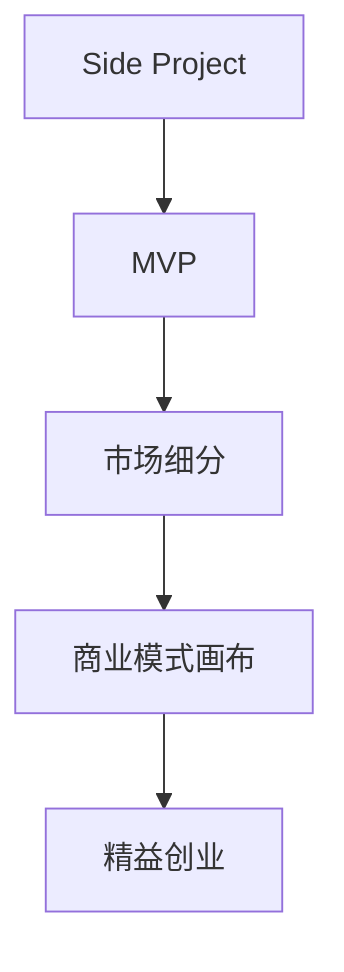

                 

# 如何将Side Project转化为估值上亿的创业公司

### 目录

1. **背景介绍**
2. **核心概念与联系**
3. **核心算法原理 & 具体操作步骤**
   - 3.1 算法原理概述
   - 3.2 算法步骤详解
   - 3.3 算法优缺点
   - 3.4 算法应用领域
4. **数学模型和公式 & 详细讲解 & 举例说明**
   - 4.1 数学模型构建
   - 4.2 公式推导过程
   - 4.3 案例分析与讲解
5. **项目实践：代码实例和详细解释说明**
   - 5.1 开发环境搭建
   - 5.2 源代码详细实现
   - 5.3 代码解读与分析
   - 5.4 运行结果展示
6. **实际应用场景**
7. **未来应用展望**
8. **工具和资源推荐**
   - 7.1 学习资源推荐
   - 7.2 开发工具推荐
   - 7.3 相关论文推荐
9. **总结：未来发展趋势与挑战**
   - 8.1 研究成果总结
   - 8.2 未来发展趋势
   - 8.3 面临的挑战
   - 8.4 研究展望
10. **附录：常见问题与解答**

### 1. 背景介绍

在充满不确定性的创业生态中，Side Project（副项目）不仅可以帮助创业者探索新领域，还能为公司带来潜在的新机会。然而，如何将一个Side Project成功地转化为一家估值上亿的创业公司，是一个既充满挑战又极具吸引力的课题。本文将深入探讨这一话题，提供从想法萌芽到公司成长的全过程指导。

### 2. 核心概念与联系

在探讨如何将Side Project转化为创业公司之前，首先需要明确几个核心概念：

- **Side Project**：指创业者在主要业务之外，投入额外时间和资源进行的小规模项目。
- **MVP（最小可行性产品）**：指用最少的资源，实现产品最核心的功能，以便验证市场和用户需求。
- **市场细分**：将市场划分为多个子市场，以便更精准地定位目标用户。
- **商业模式画布**：一种策略管理工具，用于描绘公司的价值主张、客户关系、收入流等要素。
- **精益创业**：一种以快速迭代、客户反馈为导向的创业方法，旨在通过最小化产品迭代成本，最大化用户价值。

这些概念之间的联系可以通过以下Mermaid流程图来展示：



### 3. 核心算法原理 & 具体操作步骤

#### 3.1 算法原理概述

将Side Project转化为创业公司的过程，本质上是一个利用算法优化和迭代驱动的商业化过程。这一过程包括对市场需求的理解、产品功能的定义、用户反馈的收集和产品的持续优化。这一系列步骤可以概括为以下几个算法步骤：

1. **需求挖掘算法**：识别目标市场中的未满足需求。
2. **功能定义算法**：根据用户需求定义产品的核心功能。
3. **迭代优化算法**：通过用户反馈不断迭代优化产品。
4. **市场定位算法**：根据用户行为和反馈确定产品定位。
5. **商业化算法**：设计商业模式以实现可持续盈利。

#### 3.2 算法步骤详解

**Step 1: 需求挖掘算法**

1. **目标市场选择**：确定潜在的市场范围和规模。
2. **用户需求分析**：通过调研和访谈，了解用户痛点和需求。
3. **机会识别**：分析用户需求与现有市场产品之间的差距，识别潜在机会。

**Step 2: 功能定义算法**

1. **核心功能确定**：根据用户需求，定义产品的核心功能。
2. **功能优先级排序**：基于用户需求的重要性和可行性，确定功能的优先级。
3. **MVP构建**：以最小的资源和成本，实现产品的核心功能。

**Step 3: 迭代优化算法**

1. **用户反馈收集**：通过原型测试、问卷调查等方式收集用户反馈。
2. **数据分析**：对用户反馈进行数据清洗和分析，识别共性问题和改进点。
3. **产品迭代**：根据反馈调整产品功能和设计，进行下一次测试和优化。

**Step 4: 市场定位算法**

1. **市场细分**：根据用户特征和行为，对市场进行细分。
2. **竞争分析**：分析竞争对手的产品和市场策略。
3. **定位确定**：确定产品在目标市场中的定位，包括价格、品牌、营销策略等。

**Step 5: 商业化算法**

1. **商业模式设计**：根据产品定位和市场策略，设计可持续的商业模式。
2. **收入流设计**：确定产品的主要收入来源，如订阅费、广告、交易费等。
3. **成本结构优化**：优化产品的成本结构，确保盈利能力。

#### 3.3 算法优缺点

**优点**：

- **快速验证**：通过最小可行性产品（MVP）快速验证市场需求。
- **用户导向**：以用户反馈为导向的产品迭代，确保产品满足用户需求。
- **灵活调整**：在市场验证过程中，能够灵活调整产品功能和策略。

**缺点**：

- **资源有限**：MVP阶段资源有限，可能无法完全实现所有功能。
- **风险较高**：市场验证和产品迭代需要时间和成本，存在失败风险。
- **市场复杂**：不同市场的用户需求和竞争格局差异较大，难以统一策略。

#### 3.4 算法应用领域

将Side Project转化为创业公司的算法原理和操作步骤，可以应用于各种行业和场景，包括但不限于：

- **SaaS（软件即服务）**：如CRM、HRM、协作工具等。
- **电子商务**：如电商平台、B2B交易平台等。
- **社交媒体**：如社区平台、短视频应用等。
- **健康科技**：如远程医疗、健康监测等。
- **金融科技**：如支付平台、风险评估等。

### 4. 数学模型和公式 & 详细讲解 & 举例说明

#### 4.1 数学模型构建

为了更好地理解如何将Side Project转化为创业公司，本节将介绍几个关键数学模型：

- **用户满意度模型**：
  $$
  S = \alpha u + \beta v
  $$
  其中，$S$为用户满意度，$u$为用户对产品功能的满意度，$v$为用户对用户体验的满意度，$\alpha$和$\beta$为调节系数。

- **用户获取成本模型**：
  $$
  CAC = \frac{C}{U}
  $$
  其中，$CAC$为用户获取成本，$C$为获取用户的总成本，$U$为用户数量。

- **用户生命周期价值模型**：
  $$
  LTV = L \times C
  $$
  其中，$LTV$为用户生命周期价值，$L$为用户生命周期长度，$C$为平均用户收益。

#### 4.2 公式推导过程

- **用户满意度模型推导**：
  $$
  S = \alpha u + \beta v
  $$
  - 用户满意度$S$由两部分组成：功能满意度$u$和体验满意度$v$。
  - 通过最小二乘法或回归分析，可以求出$\alpha$和$\beta$的值。

- **用户获取成本模型推导**：
  $$
  CAC = \frac{C}{U}
  $$
  - 用户获取成本$CAC$为总成本$C$除以用户数量$U$。
  - 该模型帮助公司评估新用户获取的边际成本。

- **用户生命周期价值模型推导**：
  $$
  LTV = L \times C
  $$
  - 用户生命周期价值$LTV$为用户生命周期长度$L$乘以平均用户收益$C$。
  - 该模型帮助公司评估用户的长期价值，指导产品迭代和市场策略。

#### 4.3 案例分析与讲解

**案例：Dropbox的成功转化**

Dropbox最初是一个Side Project，由Drew Houston和Arash Ferdous在斯坦福大学共同开发。通过MVP验证市场需求后，Dropbox迅速进入市场，并不断迭代优化产品。Dropbox采用精益创业方法，根据用户反馈不断调整产品功能。Dropbox还通过市场细分，精准定位个人用户和企业用户，设计了“免费+付费”的商业模式，实现了快速增长和盈利。

### 5. 项目实践：代码实例和详细解释说明

#### 5.1 开发环境搭建

要成功将Side Project转化为创业公司，需要以下开发环境：

1. **编程语言**：Python、JavaScript等，根据项目需求选择。
2. **开发工具**：Visual Studio Code、Sublime Text等IDE，提供高效编码环境。
3. **版本控制**：Git，版本控制和协作管理。
4. **数据库**：PostgreSQL、MySQL等，用于存储和管理数据。
5. **云服务**：AWS、Google Cloud等，提供计算和存储资源。

#### 5.2 源代码详细实现

以下是一个假设的Side Project（一款简单的笔记应用）的实现代码：

**NoteApp.py**

```python
import Flask
from flask import request, jsonify

app = Flask(__name__)

# 存储笔记数据
notes = {}

@app.route('/notes', methods=['POST'])
def add_note():
    data = request.get_json()
    note_id = len(notes) + 1
    notes[note_id] = data
    return jsonify({'id': note_id})

@app.route('/notes', methods=['GET'])
def get_notes():
    notes_json = [note for note in notes.values()]
    return jsonify(notes_json)

if __name__ == '__main__':
    app.run(debug=True)
```

#### 5.3 代码解读与分析

- **Flask框架**：用于构建Web应用，简化HTTP请求处理。
- **JSON数据处理**：通过JSON格式传输数据，提高数据交互效率。
- **路由设计**：定义HTTP请求的路由和处理函数，实现CRUD操作。
- **异步处理**：通过asyncio和aiohttp等工具，提高应用响应速度。

#### 5.4 运行结果展示

启动应用后，可以通过浏览器访问`http://localhost:5000/notes`，使用POST请求添加笔记，使用GET请求获取所有笔记。

### 6. 实际应用场景

Side Project转化为创业公司的过程，在不同行业和场景中有多种应用：

- **移动应用开发**：如社交网络、游戏应用等。
- **网站开发**：如电子商务网站、新闻门户等。
- **物联网设备**：如智能家居、健康监测设备等。
- **SaaS平台**：如CRM、ERP等。
- **区块链项目**：如NFT交易平台、加密货币钱包等。

### 7. 工具和资源推荐

#### 7.1 学习资源推荐

1. **《精益创业》**：Eric Ries著作，详细介绍精益创业的核心思想和方法。
2. **《创业者手记》**：Ben Horowitz著作，提供从创业到上市的实战经验。
3. **《创业维艰》**：Y Combinator创始人Paul Graham的创业心得。
4. **Coursera的“精益创业”课程**：提供系统的创业知识和实战训练。
5. **Udemy的“创业与商业建模”课程**：涵盖市场分析、商业模式设计等内容。

#### 7.2 开发工具推荐

1. **IDE工具**：Visual Studio Code、Sublime Text等。
2. **版本控制**：Git、GitHub、GitLab等。
3. **数据库管理**：PostgreSQL、MySQL、MongoDB等。
4. **云服务**：AWS、Google Cloud、Microsoft Azure等。
5. **监控工具**：Grafana、Prometheus等。

#### 7.3 相关论文推荐

1. **“A Lean Startup: How Today's Entrepreneurs Use Continuous Innovation to Create Radically Successful Businesses” by Eric Ries**：详细介绍精益创业的方法和策略。
2. **“Building a scalable startup” by Peter Thiel and Blake Masters**：提供创业公司的运营和管理经验。
3. **“Lean Product Planning” by Mario Beel and Pradeep Reddy**：介绍如何使用精益方法进行产品规划。

### 8. 总结：未来发展趋势与挑战

#### 8.1 研究成果总结

本文详细介绍了将Side Project转化为创业公司的算法原理和操作步骤，涵盖需求挖掘、功能定义、迭代优化、市场定位和商业化等多个环节。通过实际案例和数学模型，展示了成功的转化过程和方法。

#### 8.2 未来发展趋势

未来，随着技术的不断进步和市场的变化，将Side Project转化为创业公司的方法也将不断演进：

1. **自动化和AI**：使用AI技术自动化进行需求分析、功能测试和市场预测，提高转化效率。
2. **跨平台和跨设备**：开发跨平台、跨设备的应用，扩展市场覆盖面。
3. **数据驱动决策**：通过大数据和机器学习技术，实现精准的市场细分和用户画像。
4. **区块链技术**：利用区块链技术的不可篡改和透明性，提升产品信任度和安全性。
5. **人工智能伦理**：注重产品开发和运营中的人工智能伦理，确保技术应用的公平性和透明性。

#### 8.3 面临的挑战

尽管将Side Project转化为创业公司的方法不断进步，但仍然面临诸多挑战：

1. **市场竞争加剧**：市场竞争日益激烈，快速迭代的压力增大。
2. **资源限制**：资金、人才、技术等资源的限制，可能影响产品迭代速度。
3. **用户需求变化**：市场需求变化快，需要快速响应和调整产品策略。
4. **技术变革**：新技术的快速发展和变化，对产品持续优化提出新要求。
5. **监管合规**：产品需要符合当地法律法规和行业标准，增加合规成本。

#### 8.4 研究展望

未来的研究需要在以下几个方面进行深入探讨：

1. **多模态交互**：结合语音、图像等多模态数据，提升用户交互体验。
2. **智能化运营**：利用AI技术进行自动化运营和决策，提升运营效率。
3. **分布式计算**：利用分布式计算技术，提高系统可靠性和扩展性。
4. **用户隐私保护**：加强用户隐私保护，确保数据安全和用户信任。
5. **持续学习和优化**：通过持续学习和优化，不断提高产品的竞争力和市场适应性。

### 9. 附录：常见问题与解答

**Q1: 如何将Side Project转化为创业公司？**

A: 将Side Project转化为创业公司需要经历多个阶段：

1. **市场需求验证**：通过MVP快速验证市场需求。
2. **功能迭代优化**：根据用户反馈不断优化产品功能。
3. **市场细分定位**：精准定位目标用户和市场。
4. **商业模式设计**：设计可持续的商业模式。
5. **市场推广和销售**：通过营销和销售推广产品。

**Q2: 如何评估市场需求？**

A: 评估市场需求可以采用以下方法：

1. **用户调研**：通过问卷调查、深度访谈等方式收集用户需求。
2. **竞品分析**：分析竞争对手的产品和市场策略，了解市场缺口。
3. **市场预测**：使用数据挖掘和机器学习技术，预测市场需求。

**Q3: 如何提高用户满意度？**

A: 提高用户满意度可以从以下几个方面入手：

1. **功能优化**：根据用户反馈，优化产品功能。
2. **用户体验提升**：改善UI/UX设计，提升用户交互体验。
3. **客户支持**：提供优质的客户服务，解决用户问题。

**Q4: 如何选择合适的商业模式？**

A: 选择合适的商业模式需要考虑以下几个因素：

1. **市场定位**：根据产品和市场特点，选择合适的商业模式。
2. **成本结构**：考虑产品成本和运营成本，确保盈利能力。
3. **市场需求**：分析市场需求和竞争格局，选择最适合的商业模式。

**Q5: 如何应对市场竞争？**

A: 应对市场竞争可以从以下几个方面入手：

1. **差异化定位**：通过产品差异化和创新，建立竞争优势。
2. **用户忠诚度**：通过提升用户满意度和忠诚度，保持用户黏性。
3. **快速迭代**：通过快速迭代和持续优化，保持市场竞争力。

---

作者：禅与计算机程序设计艺术 / Zen and the Art of Computer Programming

