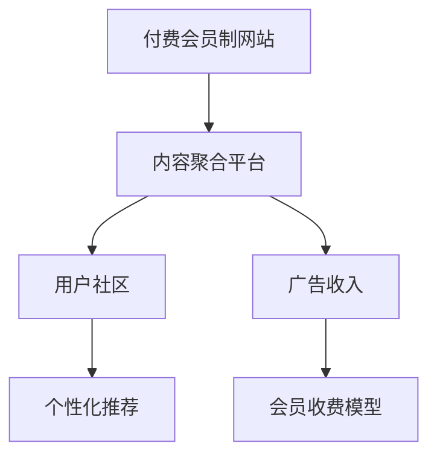

                 

# 如何将技术博客转化为付费会员制网站

## 1. 背景介绍

在互联网时代，内容成为最核心的资产之一。技术博客不仅分享了作者的观点和经验，更成为了传递知识的媒介。然而，传统博客模式存在诸多局限，如阅读体验差、互动不足、版权难以维护等问题，无法充分发挥内容的价值。因此，将技术博客转化为付费会员制网站，成为一种提升作者收益和平台价值的新趋势。

### 1.1 问题由来

随着内容付费的兴起，越来越多的人愿意为优质内容付费。然而，由于内容付费平台的发展尚未成熟，用户对付费内容的认可度较低，流量难以积累。而对于内容创作者而言，虽有提供付费内容的需求，但传统博客模式下，广告收入和阅读量不足以支撑其转型为付费会员制网站。

### 1.2 问题核心关键点

将技术博客转化为付费会员制网站的核心在于：
- 如何吸引并留住付费用户。
- 如何构建具有商业价值的内容生态。
- 如何通过收费机制平衡作者收益和用户需求。

## 2. 核心概念与联系

### 2.1 核心概念概述

为更好地理解付费会员制网站的构建，本节将介绍几个密切相关的核心概念：

- 付费会员制网站：以用户订阅付费内容为核心的网站，通过会员订阅费和广告收入实现盈利。

- 内容聚合平台：收集、整理、呈现多种内容形式的平台，如文章、视频、音频等，供用户浏览和消费。

- 用户社区：围绕特定兴趣主题，用户之间交流互动的社区，如技术问答、论坛讨论、在线课程等。

- 广告收入：通过网站流量和展示位的精准广告投放，实现广告主和平台的双赢。

- 会员收费模型：根据内容价值和使用频率，制定不同的收费标准和会员等级，满足不同用户需求。

- 个性化推荐：通过分析用户行为，个性化推荐适合用户兴趣的内容，提升用户体验和粘性。

这些核心概念之间的逻辑关系可以通过以下Mermaid流程图来展示：



这个流程图展示了一体化付费会员制网站的各个组成部分：

1. 付费会员制网站作为整体平台，集成了内容聚合、用户社区、广告收入和会员收费模型等关键功能。
2. 内容聚合平台是付费网站的基础，提供高质量的内容资源。
3. 用户社区是用户互动的场所，增强用户粘性。
4. 广告收入为网站提供额外的盈利模式。
5. 会员收费模型和个性化推荐系统共同提升用户体验和收益。

这些概念共同构成了付费会员制网站的核心框架，使其能够在内容消费与付费间取得平衡。

## 3. 核心算法原理 & 具体操作步骤
### 3.1 算法原理概述

构建付费会员制网站的核心算法原理在于：

- 通过聚类和标签算法，将内容进行精确分类和推荐。
- 利用机器学习算法，预测用户的行为和偏好，提高个性化推荐的准确性。
- 设计会员收费模型，将内容价值和使用频率转化为合理的收费标准。
- 应用强化学习算法，提升广告投放的精准度，最大化广告收入。

### 3.2 算法步骤详解

付费会员制网站的构建主要包括以下几个关键步骤：

**Step 1: 内容收集与聚合**

- 从各大技术平台（如博客、论坛、GitHub）收集高质量的技术内容，包括文章、代码、项目等。
- 利用爬虫和API接口，快速高效地获取和整理数据。

**Step 2: 内容分类与标注**

- 通过文本分析、图像识别等技术手段，对收集到的内容进行分类和标注。
- 建立内容元数据库，包括标题、关键词、摘要、发布时间等。

**Step 3: 个性化推荐系统设计**

- 利用协同过滤、内容推荐、上下文推荐等算法，构建个性化推荐引擎。
- 引入用户行为数据，如阅读时长、点击率等，增强推荐效果。

**Step 4: 会员收费模型设计**

- 根据内容的价值和使用频率，设计多样化的会员收费方案，如基础会员、高级会员、超级会员等。
- 设置试读权限、免费内容等，吸引新用户注册。

**Step 5: 广告收入优化**

- 应用精准广告投放技术，提高广告点击率和转化率。
- 设计广告推荐算法，根据用户兴趣和行为特征，动态调整广告位。

**Step 6: 网站部署与优化**

- 选择合适的开发环境（如AWS、阿里云等），部署网站服务器。
- 优化网站性能，包括加载速度、缓存策略等，提升用户体验。

**Step 7: 用户社区建设**

- 建立用户反馈机制，收集用户意见和建议，不断改进网站功能。
- 引入讨论版块、在线课程等功能，增加用户粘性和互动性。

### 3.3 算法优缺点

付费会员制网站构建的主要算法优缺点如下：

**优点**

- 高收益。通过收费模式和广告收入，网站可以获得较高的盈利。
- 增强用户体验。通过个性化推荐系统，用户能够快速获取感兴趣的内容。
- 提升内容价值。通过收费和版权保护，保障内容的优质性和原创性。

**缺点**

- 用户流失风险高。如果内容价值不高或推荐不精准，用户可能流失。
- 技术复杂度高。需要多种算法模型和数据处理技术，开发和维护成本较高。
- 数据隐私问题。需要严格保护用户隐私数据，避免数据泄露。

尽管存在这些局限性，但付费会员制网站模式在内容消费和变现方面具有明显的优势，值得进一步探索和实践。

### 3.4 算法应用领域

付费会员制网站模式已经成功应用于多个领域：

- 技术博客：通过订阅费、会员内容、广告收入等形式实现盈利。如掘金、博客园等平台。
- 在线教育：提供课程订阅和付费内容，如网易云课堂、Udacity等。
- 知识付费：如得到、喜马拉雅等平台，通过订阅会员获取高质量音频内容。
- 软件开发：提供工具订阅、技术支持等增值服务，如GitHub、Stack Overflow等。

这些领域已经证明，付费会员制网站能够有效提升内容价值和用户粘性，实现商业变现。未来，随着内容付费市场的成熟和技术的进步，付费会员制网站将有更广阔的应用前景。

## 4. 数学模型和公式 & 详细讲解  
### 4.1 数学模型构建

在付费会员制网站中，数学模型主要应用于以下几个方面：

- 内容分类：使用文本分类算法，将内容分为多个类别。如朴素贝叶斯、支持向量机等。
- 个性化推荐：使用协同过滤算法，如基于用户的协同过滤、基于物品的协同过滤等。
- 会员收费模型：使用回归算法，根据内容价值和使用频率预测价格。如线性回归、随机森林等。
- 广告投放：使用逻辑回归、神经网络等算法，预测广告点击率。

以下是一个简单的文本分类数学模型：

设 $x$ 为文本向量，$y$ 为类别标签，目标为训练分类器 $f(x)$，使得：

$$
f(x) = \mathop{\arg\min}_{y} P(y|x)
$$

常用的分类算法包括朴素贝叶斯、支持向量机、KNN等，对应的数学模型如下：

- 朴素贝叶斯模型：
$$
P(y|x) = \frac{P(x|y)P(y)}{P(x)}
$$

- 支持向量机模型：
$$
f(x) = \arg\min_{w, b} \frac{1}{2}\|w\|^2 + C\sum_{i=1}^n \ell(y_i, w^Tx_i + b)
$$

- KNN模型：
$$
f(x) = \arg\min_{y} \sum_{i=1}^n |x - x_i|^2
$$

## 4.2 公式推导过程

以朴素贝叶斯模型为例，推导文本分类的概率计算过程：

设 $x$ 为文本向量，$y$ 为类别标签，$N(y)$ 为类别 $y$ 的文档数，$N$ 为总文档数。则类别 $y$ 的先验概率为：

$$
P(y) = \frac{N(y)}{N}
$$

给定类别 $y$ 和文档 $x$，后验概率为：

$$
P(y|x) = \frac{P(x|y)P(y)}{P(x)}
$$

其中，$P(x|y)$ 为在类别 $y$ 下文档 $x$ 的概率密度函数，通常使用多项式分布或伯努利分布等。$P(x)$ 为文本 $x$ 的总概率密度函数，通常使用拉普拉斯平滑或加法平滑等方法估计。

通过求解上述最优化问题，可以训练出文本分类模型。

## 4.3 案例分析与讲解

假设我们有一个包含多个技术博客的文章库，目标是将其转化为付费会员制网站。

**Step 1: 内容收集与聚合**

通过爬虫和API接口，从多个技术平台收集高质量文章，如掘金、博客园等。保存文章的标题、作者、发布时间、内容等元数据。

**Step 2: 内容分类与标注**

使用朴素贝叶斯算法，对收集到的文章进行分类，如编程语言、技术框架、算法等。同时，为每篇文章打上标签，如“高级编程”、“机器学习”等。

**Step 3: 个性化推荐系统设计**

利用协同过滤算法，推荐相似的文章给用户。例如，用户阅读了多篇Python编程文章，算法推荐更多关于Python的文章。引入用户行为数据，如阅读时长、点击率等，提高推荐效果。

**Step 4: 会员收费模型设计**

设置基础会员、高级会员、超级会员等不同等级，用户可以选择订阅。基础会员免费访问部分内容，高级会员和超级会员分别提供更多特权，如无广告阅读、专业课程等。

**Step 5: 广告收入优化**

使用逻辑回归算法，预测广告点击率。根据用户行为特征，如兴趣、年龄、职业等，动态调整广告位，提高广告转化率。

**Step 6: 网站部署与优化**

选择合适的云服务，如AWS、阿里云等，部署网站服务器。优化加载速度和缓存策略，提升用户体验。

**Step 7: 用户社区建设**

建立技术论坛，用户可以在论坛讨论技术问题，发布技术文章。定期举办技术沙龙，增加用户互动。

## 5. 项目实践：代码实例和详细解释说明
### 5.1 开发环境搭建

在进行付费会员制网站构建前，我们需要准备好开发环境。以下是使用Python进行Flask开发的环境配置流程：

1. 安装Python：从官网下载并安装Python，用于创建虚拟环境。
2. 安装Flask：使用pip安装Flask，作为网站后端框架。
3. 安装数据库：使用pip安装SQLite或MySQL等数据库。
4. 安装其他库：如TensorFlow、scikit-learn等，用于机器学习算法实现。
5. 安装开发工具：如Git、VSCode等，用于版本控制和代码开发。

完成上述步骤后，即可在虚拟环境中开始开发实践。

### 5.2 源代码详细实现

我们以一个简单的技术博客平台为例，展示如何使用Flask构建付费会员制网站。

**步骤1: 数据库设置**

```python
from flask_sqlalchemy import SQLAlchemy

app.config['SQLALCHEMY_DATABASE_URI'] = 'sqlite:///blog.db'
app.config['SQLALCHEMY_TRACK_MODIFICATIONS'] = False
db = SQLAlchemy(app)
```

**步骤2: 用户模型定义**

```python
class User(db.Model):
    id = db.Column(db.Integer, primary_key=True)
    name = db.Column(db.String(50))
    email = db.Column(db.String(120))
    password = db.Column(db.String(120))
    subscription = db.Column(db.Integer)
```

**步骤3: 文章模型定义**

```python
class Article(db.Model):
    id = db.Column(db.Integer, primary_key=True)
    title = db.Column(db.String(100))
    content = db.Column(db.Text)
    tags = db.Column(db.String(100))
    user_id = db.Column(db.Integer, db.ForeignKey('user.id'))
    views = db.Column(db.Integer)
```

**步骤4: 登录页面实现**

```python
from flask_login import LoginManager, UserMixin, login_user, login_required

login_manager = LoginManager()
login_manager.init_app(app)

@login_manager.user_loader
def load_user(user_id):
    return User.query.get(int(user_id))

@app.route('/login', methods=['GET', 'POST'])
def login():
    if request.method == 'POST':
        username = request.form['username']
        password = request.form['password']
        user = User.query.filter_by(username=username, password=password).first()
        if user:
            login_user(user)
            return redirect(url_for('index'))
        else:
            return 'Invalid credentials'
    return render_template('login.html')
```

**步骤5: 文章列表展示**

```python
@app.route('/')
@login_required
def index():
    articles = Article.query.all()
    return render_template('index.html', articles=articles)
```

**步骤6: 文章推荐算法实现**

```python
from sklearn.feature_extraction.text import CountVectorizer
from sklearn.metrics.pairwise import cosine_similarity

def recommend_articles(article):
    vec = CountVectorizer().fit_transform([a.content for a in Article.query.all()])
    similarity = cosine_similarity(vec[article.id], vec).flatten()
    recommended_articles = [(Article.query.get(i), similarity[i]) for i in range(len(Article.query))]
    recommended_articles.sort(key=lambda x: x[1], reverse=True)
    return recommended_articles[:5]
```

**步骤7: 付费订阅实现**

```python
@app.route('/signup', methods=['GET', 'POST'])
def signup():
    if request.method == 'POST':
        username = request.form['username']
        password = request.form['password']
        email = request.form['email']
        subscription = request.form['subscription']
        user = User(name=username, email=email, password=password, subscription=subscription)
        db.session.add(user)
        db.session.commit()
        login_user(user)
        return redirect(url_for('index'))
    return render_template('signup.html')
```

### 5.3 代码解读与分析

**步骤1: 数据库设置**

使用SQLAlchemy库连接数据库，设置连接地址。SQLite作为轻量级数据库，适合初学者使用。

**步骤2: 用户模型定义**

定义用户模型，包含用户名、邮箱、密码和订阅等级。使用Flask-Login扩展管理用户登录和权限控制。

**步骤3: 文章模型定义**

定义文章模型，包含标题、内容、标签和用户ID。通过外键关联用户，实现文章和用户的关系管理。

**步骤4: 登录页面实现**

使用Flask-Login实现用户登录和认证。提供登录表单，验证用户名和密码，并登录用户。

**步骤5: 文章列表展示**

展示所有文章列表，使用@login_required装饰器保护页面访问权限。

**步骤6: 文章推荐算法实现**

使用CountVectorizer和cosine_similarity计算相似度，推荐5篇与当前文章最相似的文章。

**步骤7: 付费订阅实现**

提供用户注册页面，收集用户名、密码、邮箱和订阅等级，并保存至数据库。

**步骤8: 网站部署**

完成前端页面和后端逻辑的实现后，可以使用Flask命令部署网站：

```bash
flask run
```

在浏览器中访问http://localhost:5000，即可看到网站首页。

## 6. 实际应用场景
### 6.1 在线教育

在线教育平台通过付费会员制模式，提供高质量的课程和内容。用户可以选择订阅各类专业课程，获取专属学习资源和互动服务。平台还可以根据用户行为，推荐更多适合的课程和资料。

### 6.2 技术博客

技术博客通过订阅费和广告收入实现盈利，为作者提供稳定的收益来源。用户可以访问各类技术文章，阅读最新科技动态和经验分享。平台还可以根据用户兴趣，推荐更多相关内容。

### 6.3 知识付费

知识付费平台提供音频、视频、文章等形式的内容，用户可以通过订阅会员获取高质量内容。平台通过会员订阅费和广告收入实现盈利。用户可以听取专家讲解、阅读深度文章、参与在线讨论。

### 6.4 软件开发

软件开发平台提供工具订阅、技术支持等增值服务，如GitHub、Stack Overflow等。用户可以访问开源代码库，参与项目协作，获取技术支持。平台通过订阅费和广告收入实现盈利。

## 7. 工具和资源推荐
### 7.1 学习资源推荐

为了帮助开发者系统掌握付费会员制网站的理论基础和实践技巧，这里推荐一些优质的学习资源：

1.《Web开发实战》系列博文：系统介绍Flask、SQLAlchemy等技术栈，涵盖前后端开发、数据库管理等全栈知识。

2.《Python Web开发框架Flask》书籍：详细讲解Flask的各个模块和功能，提供大量实战案例，帮助读者上手快速开发网站。

3. Flask官方文档：提供Flask的详细API和使用方法，是Flask开发的必备资料。

4.《Web应用架构》课程：由知名博主编写，介绍Web应用的架构设计、安全性和性能优化等高级话题。

5. Weights & Biases：用于模型训练的实验跟踪工具，可以记录和可视化模型训练过程中的各项指标，方便调试和优化。

6. TensorBoard：用于模型训练的可视化工具，实时监测模型训练状态，提供丰富的图表呈现方式，便于分析模型性能。

通过对这些资源的学习实践，相信你一定能够快速掌握付费会员制网站的开发流程，并用于解决实际的Web应用问题。

### 7.2 开发工具推荐

高效的开发离不开优秀的工具支持。以下是几款用于付费会员制网站开发的常用工具：

1. Flask：轻量级Web框架，简单易用，适合快速迭代开发。

2. SQLAlchemy：高级ORM库，用于数据库操作和模型定义。

3. Scikit-learn：机器学习库，用于文本分类、推荐算法等。

4. TensorFlow：深度学习库，用于广告点击率预测等。

5. Weights & Biases：实验跟踪工具，记录和可视化模型训练过程。

6. TensorBoard：可视化工具，实时监测模型训练状态。

合理利用这些工具，可以显著提升付费会员制网站的开发效率，加快创新迭代的步伐。

### 7.3 相关论文推荐

付费会员制网站的发展得益于学界的持续研究。以下是几篇奠基性的相关论文，推荐阅读：

1. "Paying Per Click"（Pay-per-Click）：介绍基于点击量收费的商业模式，为后续付费网站的发展提供理论基础。

2. "Membership Networks"：提出会员网络的数学模型，分析会员流失的预测和干预。

3. "Economics of Free and Paid Content"：探讨免费和付费内容的经济模型，为内容收费提供理论支持。

4. "SaaS Business Model"：介绍基于SaaS（软件即服务）模式的商业模式，为付费网站提供商业模式参考。

这些论文代表了大语言模型微调技术的发展脉络。通过学习这些前沿成果，可以帮助研究者把握学科前进方向，激发更多的创新灵感。

## 8. 总结：未来发展趋势与挑战

### 8.1 总结

本文对将技术博客转化为付费会员制网站的方法进行了全面系统的介绍。首先阐述了付费会员制网站的背景和意义，明确了付费模式在提升作者收益和平台价值方面的独特价值。其次，从原理到实践，详细讲解了付费网站的数学模型和关键步骤，给出了完整的代码实现。同时，本文还广泛探讨了付费网站在多个行业领域的应用前景，展示了付费模式的市场潜力。此外，本文精选了付费网站的相关学习资源，力求为读者提供全方位的技术指引。

通过本文的系统梳理，可以看到，付费会员制网站在内容消费和变现方面具有明显的优势，值得进一步探索和实践。未来，伴随付费模式的市场成熟和技术的进步，付费会员制网站将有更广阔的应用前景。

### 8.2 未来发展趋势

展望未来，付费会员制网站将呈现以下几个发展趋势：

1. 订阅模式多样化。除了传统的月度、年度订阅，将推出更多灵活的订阅模式，如按次付费、按需付费等。

2. 内容付费与广告结合。付费网站将更多地引入广告变现，通过精准广告投放，实现盈利最大化。

3. 个性化推荐系统优化。通过机器学习和大数据分析，提升个性化推荐的精准度和用户体验。

4. 用户互动加强。引入社区讨论、在线课程等功能，增加用户粘性和互动性，形成更加活跃的社区生态。

5. 跨平台联动。实现不同平台间的无缝链接和数据互通，提升用户的使用体验。

6. 数据隐私保护。加强对用户隐私数据的安全保护，建立信任机制，保障用户权益。

这些趋势凸显了付费会员制网站的广阔前景，将进一步提升内容价值和用户体验，推动内容变现方式的创新。

### 8.3 面临的挑战

尽管付费会员制网站模式在内容消费和变现方面具有显著优势，但在发展过程中，仍面临诸多挑战：

1. 用户流失风险高。如果内容价值不高或推荐不精准，用户可能流失。

2. 开发成本高。需要开发和维护多种算法模型和数据处理技术，开发和维护成本较高。

3. 数据隐私问题。需要严格保护用户隐私数据，避免数据泄露。

4. 广告收入不稳定。广告点击率受多种因素影响，难以保证稳定收入。

5. 用户付费意愿低。用户对于付费内容的价值评估较低，需要提升用户对付费内容的认可度。

6. 技术复杂度高。需要多种技术栈的支持，开发和维护难度较大。

尽管存在这些挑战，但付费会员制网站模式在内容消费和变现方面具有明显的优势，值得进一步探索和实践。相信随着技术的发展和市场的成熟，这些挑战终将一一克服，付费会员制网站必将在内容消费和变现方面取得更大成功。

### 8.4 研究展望

面对付费会员制网站所面临的挑战，未来的研究需要在以下几个方面寻求新的突破：

1. 探索无监督和半监督内容推荐方法。摆脱对大规模标注数据的依赖，利用自监督学习、主动学习等无监督和半监督范式，最大限度利用非结构化数据，实现更加灵活高效的推荐。

2. 开发更加参数高效的推荐算法。开发更加参数高效的推荐算法，在固定大部分预训练参数的同时，只更新极少量的任务相关参数。

3. 融合因果和对比学习范式。通过引入因果推断和对比学习思想，增强推荐模型建立稳定因果关系的能力，学习更加普适、鲁棒的内容推荐。

4. 引入更多先验知识。将符号化的先验知识，如知识图谱、逻辑规则等，与推荐模型进行巧妙融合，引导推荐过程学习更准确、合理的推荐结果。

5. 结合因果分析和博弈论工具。将因果分析方法引入推荐模型，识别出模型决策的关键特征，增强推荐结果的因果性和逻辑性。

6. 纳入伦理道德约束。在推荐目标中引入伦理导向的评估指标，过滤和惩罚有偏见、有害的推荐结果，确保推荐内容的公正性和合理性。

这些研究方向的探索，必将引领付费会员制网站模式迈向更高的台阶，为内容推荐技术的发展提供新的思路和方向。

## 9. 附录：常见问题与解答

**Q1：付费会员制网站如何吸引并留住用户？**

A: 付费会员制网站需要从多个方面吸引并留住用户：
1. 提供有价值的内容。高质量、有深度的内容能够吸引用户付费订阅。
2. 设计合理的会员收费方案。多样化的收费模式和特权，满足不同用户需求。
3. 优化个性化推荐系统。精准的推荐算法能够提升用户体验，增加用户粘性。
4. 增强社区互动。建立用户社区，增加用户之间的互动和交流。
5. 提供优质的客户服务。快速响应用户反馈，解决用户问题，提升用户满意度。

**Q2：付费会员制网站如何保持稳定的广告收入？**

A: 保持稳定的广告收入需要从多个方面进行优化：
1. 精准广告投放。利用用户行为数据，进行定向广告投放，提高广告点击率和转化率。
2. 广告位优化。合理设计广告位，增加广告展示频率，提高广告收入。
3. 广告模型优化。使用机器学习算法，优化广告点击率预测模型，提升广告效果。
4. 实时监测与优化。实时监测广告投放效果，根据反馈数据及时调整投放策略。
5. 多元化广告形式。引入多样化广告形式，如视频广告、横幅广告等，提高广告收入来源。

**Q3：付费会员制网站如何保护用户隐私？**

A: 保护用户隐私是付费会员制网站的关键：
1. 数据匿名化。对用户数据进行匿名化处理，防止数据泄露。
2. 数据加密。对存储和传输的数据进行加密，保障数据安全。
3. 数据访问控制。严格控制用户数据的访问权限，防止数据滥用。
4. 数据审计。定期审计数据使用情况，防止数据滥用。
5. 合规性保障。确保数据处理符合相关法律法规，保障用户权益。

**Q4：付费会员制网站如何实现跨平台联动？**

A: 实现跨平台联动需要从多个方面进行优化：
1. 数据标准化。对不同平台的数据进行标准化，实现数据互通。
2. 接口统一。统一不同平台的接口，实现无缝链接。
3. 身份认证。实现跨平台的用户身份认证，保障用户权益。
4. 跨平台推荐。根据用户在不同平台的行为数据，进行跨平台推荐。
5. 数据同步。实时同步不同平台的数据，实现跨平台数据的统一管理。

这些问题的解答，有助于我们更好地理解和应对付费会员制网站在实践过程中可能遇到的问题，提高网站的运营效率和用户体验。

---

作者：禅与计算机程序设计艺术 / Zen and the Art of Computer Programming

