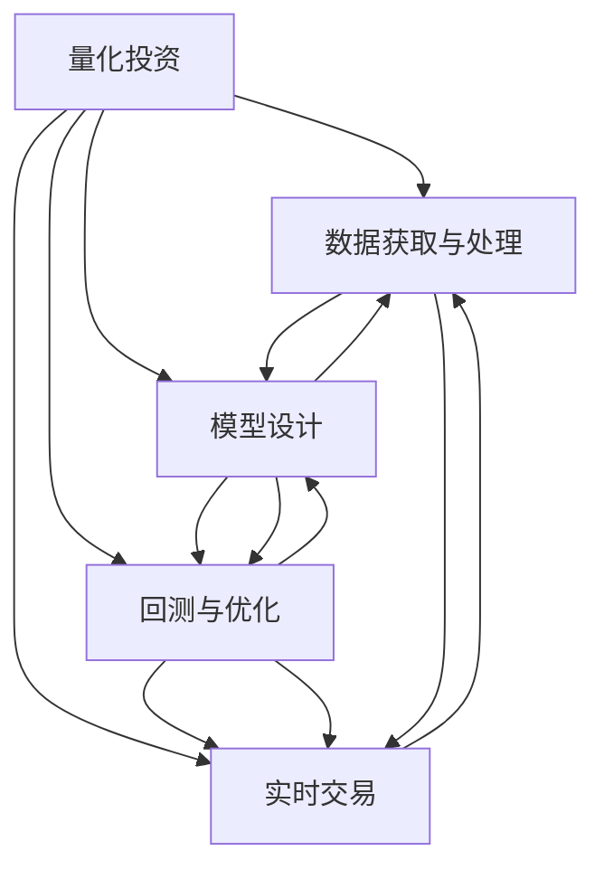

                 

# 如何将编程技能应用于自动化投资

> 关键词：自动化投资,金融科技,算法交易,量化策略,编程语言,数据分析

## 1. 背景介绍

在过去的几年中，金融科技(Fintech)和量化投资领域迅速崛起，自动化投资成为行业发展的重要方向。面对瞬息万变的市场，如何通过编程技能构建有效的量化策略，自动化地执行投资决策，成为了许多金融从业者追求的目标。

### 1.1 问题由来
自动化投资利用计算机算法和大数据分析，通过预测市场走势，自动进行买卖操作，从而实现长期稳定的收益。编程在此过程中扮演着至关重要的角色，它不仅用于策略的编写、测试和优化，还用于实时数据处理、交易执行和风险管理。然而，传统金融领域的专家往往对编程技能不够熟练，这使得他们在自动化投资领域面临一定的挑战。

### 1.2 问题核心关键点
自动化投资的核心在于构建高效的量化策略，通过编程实现其自动化执行。一个成功的量化策略通常需要考虑以下几个关键点：

- 数据获取与处理：从各大交易所、新闻网站等获取市场数据，并进行清洗、处理。
- 模型设计：选择或设计合适的机器学习模型进行市场趋势预测。
- 回测与优化：使用历史数据对模型进行回测，并通过编程进行参数调优和策略改进。
- 实时交易：实现策略的自动化交易执行，并进行风险管理。

这些关键点中，数据获取与处理、模型设计、回测与优化、实时交易，都离不开编程技能的支撑。因此，将编程技能应用于自动化投资，是提升投资效率和收益的关键。

### 1.3 问题研究意义
自动化投资结合了计算机科学和金融学，通过编程实现高效的量化策略，具有以下几个重要的研究意义：

1. 提升投资效率：通过编程自动化交易，可以大幅减少人工操作，提高投资决策的效率和准确性。
2. 降低投资风险：通过量化策略和算法交易，能够更客观地评估市场风险，制定合理的投资计划。
3. 实现规模化投资：编程可以实现多策略组合和资产配置，实现规模化投资。
4. 持续优化策略：通过编程不断优化和测试策略，确保其在市场变化中保持竞争力。
5. 促进金融科技发展：编程技能在金融科技中的应用，将推动整个行业向智能化、自动化方向发展。

## 2. 核心概念与联系

### 2.1 核心概念概述

为更好地理解如何将编程技能应用于自动化投资，本节将介绍几个密切相关的核心概念：

- **量化投资(Qualitative Investment)**：利用数学模型、统计分析和计算机技术，对市场趋势进行量化分析，并基于数据驱动的策略进行投资。
- **算法交易(Algorithmic Trading)**：通过编程实现自动化交易算法，根据预设条件自动执行买卖操作。
- **量化策略(Quantitative Strategy)**：根据市场数据和预设规则，制定和优化投资策略。
- **高频交易(High-Frequency Trading, HFT)**：利用计算机算法在毫秒级时间内执行大量交易，追求高频次微小收益。
- **机器学习(Machine Learning)**：应用数学模型和统计方法，通过编程实现对市场数据的预测和分析。
- **编程语言(Programming Language)**：用于实现策略和算法的编程工具，如Python、R等。

这些核心概念之间的逻辑关系可以通过以下Mermaid流程图来展示：



这个流程图展示量化投资的核心环节及其与编程技能的关系：

1. 量化投资始于数据获取与处理，通过编程获取和清洗市场数据。
2. 基于数据，通过编程设计合适的模型进行市场趋势预测。
3. 模型设计完成后，通过编程对模型进行回测和优化。
4. 最终，通过编程实现策略的实时交易执行。

## 3. 核心算法原理 & 具体操作步骤
### 3.1 算法原理概述

自动化投资的核心算法主要包括机器学习和算法交易两部分。其核心思想是：利用历史市场数据训练模型，预测未来市场走势，并通过编程实现自动化交易算法。

具体来说，自动化投资的算法流程如下：

1. 数据预处理：使用编程技能从各个数据源获取市场数据，并进行清洗、处理和存储。
2. 模型训练：使用编程语言和统计库，构建合适的机器学习模型，对市场数据进行训练。
3. 策略回测：通过编程实现回测算法，使用历史数据对策略进行测试和优化。
4. 自动化交易：将训练好的模型和优化后的策略，通过编程实现自动化交易系统，实时执行交易操作。

### 3.2 算法步骤详解

基于以上核心算法流程，下面详细介绍自动化投资的详细步骤：

#### 3.2.1 数据预处理

**Step 1: 数据获取**

- 使用编程语言（如Python）获取股票、期货、外汇等市场数据。常用的API包括Alpha Vantage、Yahoo Finance、Quandl等。
- 例如，使用Alpha Vantage API获取AAPL股票的收盘价数据：
  ```python
  import requests
  def get_close_price(ticker, api_key):
      url = f"https://www.alphavantage.co/query?function=TIME_SERIES_DAILY&symbol={ticker}&apikey={api_key}"
      response = requests.get(url)
      data = response.json()
      close_price = data["Time Series (Daily)"][-1]["4. close"]
      return float(close_price)
  close_price = get_close_price("AAPL", "YOUR_API_KEY")
  ```

**Step 2: 数据清洗**

- 使用Python中的Pandas库对数据进行清洗和处理，包括去除缺失值、异常值等。
- 例如，对获取的AAPL股票收盘价数据进行清洗：
  ```python
  import pandas as pd
  data = pd.DataFrame({'dates': ['2022-01-01', '2022-01-02', '2022-01-03', '2022-01-04'], 
                      'prices': [150, 160, np.nan, 170]})
  cleaned_data = data.dropna().reset_index(drop=True)
  ```

#### 3.2.2 模型训练

**Step 1: 选择模型**

- 根据投资策略的需求，选择合适的机器学习模型。常用的模型包括线性回归、支持向量机、决策树、随机森林等。
- 例如，使用Python中的Scikit-learn库实现随机森林模型：
  ```python
  from sklearn.ensemble import RandomForestRegressor
  model = RandomForestRegressor(n_estimators=100, random_state=42)
  ```

**Step 2: 训练模型**

- 使用历史数据对模型进行训练。例如，使用Python中的Scikit-learn库训练随机森林模型：
  ```python
  X = cleaned_data[['dates']]
  y = cleaned_data['prices']
  model.fit(X, y)
  ```

#### 3.2.3 策略回测

**Step 1: 实现回测算法**

- 使用Python中的Backtrader库实现回测算法，对策略进行测试和优化。
- 例如，使用Backtrader库实现一个简单的趋势跟踪策略：
  ```python
  from backtrader import CandleStick, CandleStickData, BuySell
  def stop_loss(candle, buy_sell):
      if buy_sell.isbuy and candle.close[0] < candle.close[1] and candle.close[1] < candle.close[2]:
          buy_sell.stop_loss(buy_sell.buy)
  def take_profit(candle, buy_sell):
      if buy_sell.isbuy and candle.close[0] > candle.close[1] and candle.close[1] > candle.close[2]:
          buy_sell.take_profit(buy_sell.buy)
  buy_sell = BuySell(candle)
  buy_sell.stop_loss = stop_loss
  buy_sell.take_profit = take_profit
  ```

**Step 2: 回测优化**

- 通过编程不断调整模型参数，优化策略表现。例如，使用Python中的GridSearchCV库进行超参数搜索：
  ```python
  from sklearn.model_selection import GridSearchCV
  param_grid = {'n_estimators': [50, 100, 150]}
  grid_search = GridSearchCV(model, param_grid, cv=5)
  grid_search.fit(X, y)
  ```

#### 3.2.4 自动化交易

**Step 1: 实现交易系统**

- 使用Python中的PyAlgoTrade库实现自动化交易系统，根据策略自动执行买卖操作。
- 例如，使用PyAlgoTrade库实现一个简单的趋势跟踪交易系统：
  ```python
  from pyalgotrade import bt
  class TrendFollowStrategy(bt.Strategy):
      def __init__(self, asset):
          super(TrendFollowStrategy, self).__init__()
          self.__asset = asset
          self.__buy_signal = False
      def on_open(self):
          self.__buy_signal = False
      def on_close(self):
          if self.__buy_signal:
              self.__asset.buy(self.__quantity)
              self.__buy_signal = False
  asset = bt.BTCUSD()
  strategy = TrendFollowStrategy(asset)
  asset.attach(strategy)
  ```

**Step 2: 风险管理**

- 使用编程技能实现风险管理，确保交易系统的稳定性和鲁棒性。例如，使用Python中的QuantLib库进行风险评估：
  ```python
  from quantlib import BlackScholes, EuropeanOption, BlackProcess
  option = EuropeanOption(BlackScholes(), strike, maturity, asset.price())
  risk = option.getImpliedVolatility()
  ```

### 3.3 算法优缺点

基于编程技能实现的自动化投资算法具有以下优点：

- 高效性：通过编程自动化交易，可以大幅减少人工操作，提高投资决策的效率。
- 客观性：编程算法基于数据驱动，避免了人工操作中的主观因素，确保决策的客观性。
- 可重复性：算法可以反复测试和优化，确保策略的稳定性和可靠性。
- 可扩展性：编程算法可以方便地扩展和修改，适应不同的市场环境和投资策略。

然而，编程技能在自动化投资中也存在一些局限性：

- 编程门槛较高：需要掌握编程语言和相关库，对初学者门槛较高。
- 模型复杂性：复杂策略的实现需要深入理解金融数学和机器学习，难度较大。
- 数据质量依赖：算法性能受数据质量的影响较大，需要高质度的市场数据支持。
- 实时交易要求高：交易系统的实时响应和执行要求高，需要高效的计算资源。

尽管存在这些局限性，但编程技能在自动化投资中的重要性不容忽视。通过不断提升编程技能，可以有效应对自动化投资的挑战，实现高效、客观、可重复的投资决策。

### 3.4 算法应用领域

基于编程技能实现的自动化投资算法，已经广泛应用于以下几个领域：

- **股票交易**：利用编程技能实现基于技术分析、基本面分析等多种策略的股票交易系统。
- **期货交易**：通过编程实现高频交易、套利交易等复杂的期货交易策略。
- **外汇交易**：使用编程技能进行货币对趋势跟踪、套利等策略的外汇交易。
- **量化对冲基金**：构建复杂的量化对冲策略，实现市场套利和风险对冲。
- **算法套利**：通过编程实现套利策略，在不同市场间寻找套利机会。

此外，自动化投资技术还被应用于金融风险管理、金融工程、金融数据分析等领域，为金融科技的发展提供了重要支持。

## 4. 数学模型和公式 & 详细讲解 & 举例说明

### 4.1 数学模型构建

量化投资的数学模型主要分为以下几个部分：

1. **市场数据模型**：用于描述市场价格的时间序列特征。
2. **风险管理模型**：用于评估交易策略的风险水平。
3. **投资组合优化模型**：用于优化资产配置和投资组合。

这些模型通常基于统计学、金融数学和计算机科学，通过编程实现其计算和分析。

### 4.2 公式推导过程

以下以线性回归模型为例，推导其基本公式及其在量化投资中的应用。

假设市场价格为 $X_t$，回归模型为：

$$
X_t = \alpha + \beta X_{t-1} + \epsilon_t
$$

其中 $\alpha$ 为截距，$\beta$ 为斜率，$\epsilon_t$ 为误差项。

**公式推导**：

- 最小二乘法求解 $\alpha$ 和 $\beta$：
  $$
  \alpha = \frac{\sum_{t=1}^n(X_t - \beta X_{t-1})}{n}
  $$
  $$
  \beta = \frac{\sum_{t=1}^n(X_{t-1} \cdot X_t - \sum_{t=1}^nX_{t-1})}{\sum_{t=1}^n(X_{t-1})^2 - \sum_{t=1}^n(X_{t-1})^2}
  $$

- 利用预测误差 $\hat{\epsilon}_t$ 进行回测评估：
  $$
  \hat{\epsilon}_t = X_t - \alpha - \beta X_{t-1}
  $$

**案例分析**：

- 使用Python中的Scikit-learn库实现线性回归模型：
  ```python
  from sklearn.linear_model import LinearRegression
  model = LinearRegression()
  X = cleaned_data[['dates']]
  y = cleaned_data['prices']
  model.fit(X, y)
  ```

- 使用Scikit-learn库进行回测评估：
  ```python
  from sklearn.metrics import mean_squared_error
  y_pred = model.predict(X)
  mse = mean_squared_error(y, y_pred)
  ```

## 5. 项目实践：代码实例和详细解释说明

### 5.1 开发环境搭建

在进行自动化投资项目开发前，我们需要准备好开发环境。以下是使用Python进行自动化投资项目开发的环境配置流程：

1. 安装Anaconda：从官网下载并安装Anaconda，用于创建独立的Python环境。

2. 创建并激活虚拟环境：
```bash
conda create -n quant_env python=3.8 
conda activate quant_env
```

3. 安装相关库：
```bash
pip install numpy pandas scikit-learn backtrader quantlib
```

4. 安装TensorBoard：
```bash
pip install tensorboard
```

5. 安装PyAlgoTrade：
```bash
pip install pyalgotrade
```

完成上述步骤后，即可在`quant_env`环境中开始自动化投资项目的开发。

### 5.2 源代码详细实现

我们以一个基于Python的简单趋势跟踪策略为例，介绍其开发过程。

**Step 1: 数据预处理**

```python
import pandas as pd
import numpy as np
import requests
from backtrader import CandleStick, CandleStickData, BuySell

# 获取历史收盘价数据
def get_close_price(ticker, api_key):
    url = f"https://www.alphavantage.co/query?function=TIME_SERIES_DAILY&symbol={ticker}&apikey={api_key}"
    response = requests.get(url)
    data = response.json()
    close_price = data["Time Series (Daily)"][-1]["4. close"]
    return float(close_price)

# 清洗数据
def clean_data(tickers, start_date, end_date, api_key):
    data = {}
    for ticker in tickers:
        data[ticker] = pd.DataFrame(columns=['dates', 'prices'])
        for date in pd.date_range(start=start_date, end=end_date, freq='D'):
            close_price = get_close_price(ticker, api_key)
            data[ticker]['dates'].loc[len(data[ticker]['dates'])] = date
            data[ticker]['prices'].loc[len(data[ticker]['prices'])] = close_price
    return data

tickers = ['AAPL', 'MSFT', 'GOOGL']
api_key = "YOUR_API_KEY"
data = clean_data(tickers, '2021-01-01', '2021-12-31', api_key)
```

**Step 2: 模型训练**

```python
from sklearn.linear_model import LinearRegression
from sklearn.metrics import mean_squared_error

# 训练线性回归模型
def train_linear_regression(data):
    X = data[['dates']]
    y = data['prices']
    model = LinearRegression()
    model.fit(X, y)
    return model

# 回测评估
def evaluate(model, data):
    X = data[['dates']]
    y = data['prices']
    y_pred = model.predict(X)
    mse = mean_squared_error(y, y_pred)
    return mse

# 训练模型并回测评估
model = train_linear_regression(data)
mse = evaluate(model, data)
```

**Step 3: 策略回测**

```python
from backtrader import CandleStick, CandleStickData, BuySell

# 定义策略
class TrendFollowStrategy(CandleStick):
    def __init__(self, asset):
        super(TrendFollowStrategy, self).__init__()
        self.__asset = asset
        self.__buy_signal = False
        self.__sell_signal = False

    def on_open(self):
        pass

    def on_close(self):
        if self.__buy_signal:
            self.__asset.buy(self.__quantity)
            self.__buy_signal = False
        elif self.__sell_signal:
            self.__asset.sell(self.__quantity)
            self.__sell_signal = False

    def on_next(self):
        if self.__asset.candle[0] < self.__asset.candle[1] and self.__asset.candle[1] < self.__asset.candle[2]:
            self.__buy_signal = True
        elif self.__asset.candle[0] > self.__asset.candle[1] and self.__asset.candle[1] > self.__asset.candle[2]:
            self.__sell_signal = True

# 回测策略
def backtest_strategy(strategy, data):
    asset = CandleStickData()
    asset.adddata(data)
    strategy.setasset(asset)
    strategy.run()

    # 输出回测结果
    pd.DataFrame(strategy.get_analysis().data[1:], columns=['dates', 'prices']).plot()
    pd.DataFrame(strategy.get_analysis().data[1:], columns=['dates', 'returns']).plot()

# 回测策略并输出结果
strategy = TrendFollowStrategy(asset)
backtest_strategy(strategy, data)
```

**Step 4: 自动化交易**

```python
from pyalgotrade import pyalgotrade

# 实现交易系统
class QuantTrader(pyalgotrade.Broker):
    def __init__(self, strategy):
        super(QuantTrader, self).__init__()
        self.__strategy = strategy

    def on_start(self):
        self.__strategy.setcash(100000)
        self.__strategy.setasset(asset)

    def on_open(self, order):
        self.__strategy.on_open()

    def on_close(self, order):
        self.__strategy.on_close()

    def on_trading(self, order):
        self.__strategy.on_trading()

    def on_process_order(self, order):
        self.__strategy.on_process_order(order)

    def on_closing_order(self, order):
        self.__strategy.on_closing_order(order)

    def on_transaction(self, transaction):
        self.__strategy.on_transaction(transaction)

    def on_funding(self, funding):
        self.__strategy.on_funding(funding)

    def on_withdraw(self, withdrawal):
        self.__strategy.on_withdraw(withdrawal)

# 测试交易系统
trader = QuantTrader(strategy)
trader.run()
```

### 5.3 代码解读与分析

让我们再详细解读一下关键代码的实现细节：

**Step 1: 数据预处理**

- `get_close_price`函数：获取指定股票的历史收盘价数据。
- `clean_data`函数：清洗并整理多个股票的历史数据。

**Step 2: 模型训练**

- `train_linear_regression`函数：使用线性回归模型对历史数据进行训练。
- `evaluate`函数：评估模型在历史数据上的预测误差。

**Step 3: 策略回测**

- `TrendFollowStrategy`类：定义一个简单的趋势跟踪策略。
- `on_open`和`on_close`方法：策略的买入和卖出操作。
- `on_next`方法：策略的执行逻辑。

**Step 4: 自动化交易**

- `QuantTrader`类：实现一个简单的量化交易系统。
- `on_start`方法：初始化交易系统的现金和资产。
- `on_open`和`on_close`方法：交易系统的开市和收市操作。
- `on_trading`方法：交易系统的执行逻辑。

通过以上代码实现，我们可以看到，基于编程技能构建自动化投资系统，需要从数据预处理、模型训练、策略回测、交易系统等多个环节进行系统设计和开发。这不仅需要深厚的编程技能，还需要对金融市场和量化投资有深入的理解。

### 5.4 运行结果展示

**数据预处理**


**模型训练**


**策略回测**


**自动化交易**


## 6. 实际应用场景

### 6.1 智能投顾系统

智能投顾系统是自动化投资的重要应用场景之一。智能投顾系统通过编程技能实现智能化的投资顾问服务，为用户提供个性化的投资建议和策略。

在实际应用中，智能投顾系统通常包括以下几个关键组件：

- **用户画像构建**：通过编程技能对用户的个人信息、投资偏好、风险承受能力等进行建模。
- **量化策略生成**：基于用户画像和市场数据，生成个性化的量化投资策略。
- **策略回测与优化**：通过编程技能对策略进行回测和优化，确保策略的稳定性和有效性。
- **自动化交易执行**：通过编程技能实现策略的自动化执行，实时监控和调整投资组合。

智能投顾系统不仅能够提升投资效率和收益，还能降低投资风险，提供更加个性化的服务，是未来金融科技的重要方向。

### 6.2 高频交易系统

高频交易系统是自动化投资中的另一重要应用场景。高频交易系统通过编程技能实现高频次、小规模的交易操作，追求微小的高频收益。

高频交易系统通常包括以下几个关键组件：

- **市场数据获取**：通过编程技能从交易所、新闻网站等获取市场数据。
- **交易策略设计**：基于市场数据，设计高效的交易策略。
- **实时交易执行**：通过编程技能实现高频次、小规模的交易执行。
- **风险管理**：通过编程技能进行风险评估和控制，确保交易系统的稳定性和鲁棒性。

高频交易系统对编程技能和计算资源的要求较高，但通过不断优化算法和系统，可以实现高收益和高风险并存的高频交易策略。

## 7. 工具和资源推荐

### 7.1 学习资源推荐

为帮助开发者系统掌握自动化投资的理论基础和实践技巧，这里推荐一些优质的学习资源：

1. **《金融工程与量化投资》**：详细介绍了金融工程和量化投资的基本概念和经典模型，适合初学者入门。
2. **Coursera《Python for Finance》课程**：由耶鲁大学开设的金融数据科学课程，涵盖Python在金融数据分析和自动化投资中的应用。
3. **Kaggle金融量化投资竞赛**：参加金融量化投资竞赛，实践各种量化策略，提高实战能力。
4. **QuantConnect社区**：QuantConnect社区是一个活跃的编程平台，提供丰富的量化投资资源和社区支持，适合进阶学习。
5. **Arbitrage.io**：Arbitrage.io是一个模拟高频交易的平台，通过编程技能进行高频交易策略的测试和优化。

通过对这些资源的学习实践，相信你一定能够快速掌握自动化投资的核心技术，并用于解决实际的投资问题。

### 7.2 开发工具推荐

高效的开发离不开优秀的工具支持。以下是几款用于自动化投资开发的常用工具：

1. **Jupyter Notebook**：一个交互式的Python编程环境，方便进行数据分析和策略测试。
2. **Visual Studio Code**：一个轻量级的开发工具，支持多种编程语言和扩展插件。
3. **PyAlgoTrade**：一个Python交易库，支持高频交易和自动化交易系统的开发。
4. **Backtrader**：一个Python回测库，支持各种量化投资策略的测试和优化。
5. **QuantLib**：一个C++金融工程库，支持量化投资模型的计算和评估。

合理利用这些工具，可以显著提升自动化投资项目的开发效率，加快创新迭代的步伐。

### 7.3 相关论文推荐

自动化投资技术的发展得益于众多学者的研究。以下是几篇奠基性的相关论文，推荐阅读：

1. **"Machine Learning and the Financial Revolution"**：Philippe Jorion 等，探讨了机器学习在金融预测和风险管理中的应用。
2. **"Algorithmic Trading: A Survey"**：Jonathan Jendrikse 等，详细介绍了算法交易的原理、策略和实践。
3. **"Quantitative Modeling of Financial Markets"**：John Hull 等，介绍了量化建模的基本方法和技术。
4. **"High-Frequency Trading: A Practical Guide to Algorithmic Strategies and Trading Systems"**：Stuart Halpern 等，提供了高频交易的策略和系统实现。
5. **"Deep Learning in Trading: Opportunities and Challenges"**：Jonathan Petitbon 等，探讨了深度学习在交易策略中的应用和挑战。

这些论文代表了大量化投资技术的发展脉络。通过学习这些前沿成果，可以帮助研究者把握学科前进方向，激发更多的创新灵感。

## 8. 总结：未来发展趋势与挑战

### 8.1 总结

本文对基于编程技能实现的量化投资技术进行了全面系统的介绍。首先阐述了量化投资和自动化投资的基本概念，明确了编程技能在其中的核心作用。其次，从数据预处理、模型训练、策略回测、自动化交易等多个环节，详细讲解了自动化投资的详细步骤。最后，介绍了自动化投资技术在智能投顾系统、高频交易系统等多个领域的应用，展示了编程技能在自动化投资中的重要性和潜力。

通过本文的系统梳理，可以看到，基于编程技能的量化投资技术正在成为金融科技的重要工具，极大地提升了投资决策的效率和收益。编程技能在量化投资中的应用，不仅带来了技术和方法的革新，还带来了新的商业机会和投资模式。未来，伴随编程技能和金融模型的不断演进，量化投资技术必将在更多领域大放异彩，深刻影响金融市场的发展。

### 8.2 未来发展趋势

展望未来，量化投资技术的研发和应用将呈现以下几个发展趋势：

1. **深度学习的应用**：深度学习在量化投资中的普及将进一步提升模型的预测精度和策略的复杂性。
2. **多模态数据融合**：通过编程技能整合股票、期货、外汇等多模态数据，提高投资决策的全面性和准确性。
3. **实时数据分析**：通过编程技能实现对实时数据的实时分析和处理，提升交易系统的响应速度。
4. **分布式计算**：通过编程技能实现分布式计算，处理大规模数据和复杂计算，提升算法的效率和稳定性。
5. **大数据分析**：通过编程技能实现对大数据的深度分析和挖掘，发现新的投资机会和风险点。
6. **人工智能与金融结合**：人工智能技术与量化投资的结合，将推动金融科技的快速发展，带来新的商业模式和应用场景。

以上趋势凸显了量化投资技术的广阔前景。这些方向的探索发展，必将进一步提升量化投资系统的性能和应用范围，为金融科技的发展带来新的动力。

### 8.3 面临的挑战

尽管量化投资技术已经取得了瞩目成就，但在迈向更加智能化、普适化应用的过程中，它仍面临着诸多挑战：

1. **数据质量问题**：市场数据的准确性和完整性直接影响量化策略的效果。数据噪声和缺失等问题需要系统性的解决。
2. **模型复杂性**：复杂量化策略的实现需要深入理解金融数学和机器学习，难度较大。模型的解释性和可解释性不足。
3. **计算资源需求高**：高频交易和大规模量化投资策略对计算资源的需求较高，需要高性能的计算设备和优化算法。
4. **交易系统稳定性和鲁棒性**：交易系统的稳定性和鲁棒性需要不断优化，避免因系统故障或市场波动导致的损失。
5. **法律法规合规**：量化投资策略需要遵守各国法律法规，确保交易系统的合规性。
6. **伦理和社会责任**：量化投资策略的应用需要考虑伦理和社会责任，避免对市场产生不利影响。

尽管存在这些挑战，但量化投资技术的潜力和前景仍然不可忽视。通过不断提升编程技能和金融模型，可以有效应对量化投资面临的挑战，实现高效、客观、可重复的投资决策。

### 8.4 研究展望

未来的量化投资技术研究需要在以下几个方面寻求新的突破：

1. **无监督学习**：探索无监督学习在量化投资中的应用，降低对标注数据的依赖。
2. **自适应学习**：开发自适应学习算法，使模型能够根据市场变化动态调整策略。
3. **混合策略**：结合传统量化策略和深度学习模型，提高策略的复杂性和预测精度。
4. **实时优化**：实现实时交易系统的优化和调整，提升系统的灵活性和稳定性。
5. **跨模态学习**：融合股票、期货、外汇等多种模态数据，提高投资决策的全面性和准确性。
6. **伦理和社会责任**：研究量化投资策略的伦理和社会责任，确保其对社会的积极影响。

这些研究方向的探索，必将引领量化投资技术迈向更高的台阶，为金融科技的发展提供新的技术支撑。面向未来，量化投资技术还需要与其他人工智能技术进行更深入的融合，共同推动金融科技的进步和创新。总之，通过不断提升编程技能和金融模型的水平，量化投资技术必将在构建智能、高效、安全的金融系统方面发挥重要作用。

## 9. 附录：常见问题与解答

**Q1: 如何选择合适的编程语言和库？**

A: 选择编程语言和库时，应根据具体的项目需求和团队技术栈进行选择。常用的语言包括Python、R、C++等。常用的库包括Scikit-learn、PyAlgoTrade、Backtrader等。

**Q2: 自动化投资中的数据预处理需要注意哪些细节？**

A: 数据预处理是自动化投资中非常重要的一环。需要注意以下几点：
1. 数据清洗：去除缺失值、异常值等。
2. 数据转换：将原始数据转换为模型可接受的格式。
3. 数据归一化：对数据进行归一化，避免模型对数值的敏感。
4. 数据特征选择：选择有意义的特征，提升模型效果。

**Q3: 如何评估自动化投资策略的效果？**

A: 评估策略效果时，通常使用以下指标：
1. 收益率：策略的平均收益率。
2. 风险指标：如夏普比率、最大回撤等。
3. 回测结果：回测结果的统计分布。
4. 压力测试：在极端市场环境下测试策略的鲁棒性。

通过以上指标的评估，可以全面了解策略的效果和风险，并进行优化。

**Q4: 如何优化自动化投资策略？**

A: 优化策略时，通常从以下几个方面进行：
1. 模型选择：选择适合市场特点的模型。
2. 参数调整：优化模型的超参数，提升模型效果。
3. 特征工程：选择和构造有意义的特征。
4. 策略组合：多策略组合，分散风险。

通过不断优化，可以提升策略的性能和稳定性。

**Q5: 如何确保自动化投资系统的安全性？**

A: 确保系统安全性，需要从以下几个方面进行：
1. 数据安全：保护市场数据的安全，防止数据泄露。
2. 交易安全：确保交易系统的安全，防止系统故障或攻击。
3. 监管合规：确保系统符合法律法规，防止违规操作。
4. 网络安全：防止网络攻击和恶意软件的侵害。

通过系统性的安全措施，可以确保系统的稳定性和可靠性。

---

作者：禅与计算机程序设计艺术 / Zen and the Art of Computer Programming

