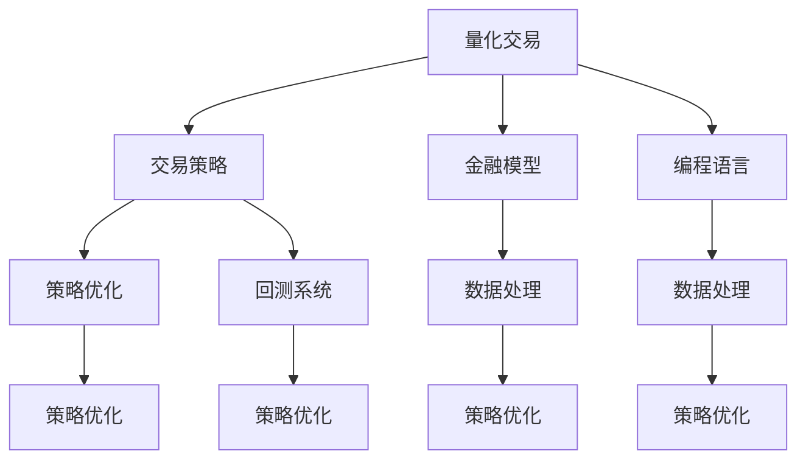

                 

# 如何将编程技能应用于量化交易系统开发

> 关键词：量化交易, 算法交易, 计算机编程, 金融模型, 回测系统, 策略优化, Python编程, 机器学习, 高阶算法

## 1. 背景介绍

### 1.1 问题由来
量化交易系统（Quantitative Trading System），即算法交易系统（Algorithmic Trading System），通过计算机程序自动执行交易策略，以实现最大化的风险调整收益。传统的基于规则的策略交易方式，往往依赖交易员的主观判断，存在执行误差和情绪波动等不稳定因素。相比之下，量化交易系统的机械化执行和客观决策，能够大幅降低人为因素的干扰，提升交易的精确度和效率。

近年来，量化交易在金融市场中的地位日益凸显，其应用范围涵盖股票、期货、外汇、债券等各类金融品种。量化交易的实现离不开计算机编程技能的支撑，包括算法设计、模型构建、回测模拟、策略优化等诸多环节。因此，计算机编程是量化交易系统开发不可或缺的核心技能。

### 1.2 问题核心关键点
量化交易系统开发的核心关键点在于如何将计算机编程技能高效应用于金融模型构建、策略优化和回测系统搭建等环节，具体包括：
1. 选择合适的编程语言和工具。
2. 构建高效、稳定的交易策略。
3. 设计科学的算法模型和评估指标。
4. 搭建高性能、稳定的回测和实盘交易系统。
5. 实时监控交易策略执行情况，及时调整优化。

本文将围绕这些关键点，深入探讨计算机编程在量化交易系统开发中的应用，以期为量化交易开发者提供全面的技术指引。

## 2. 核心概念与联系

### 2.1 核心概念概述

为了更好地理解量化交易系统开发中的计算机编程技能，首先需要了解一些核心概念：

- **量化交易（Quantitative Trading）**：通过数学模型和计算机算法，自动化地执行交易策略，以实现最佳风险收益比的过程。
- **算法交易（Algorithmic Trading）**：基于数学模型或统计学方法构建的，由计算机程序自动执行的交易策略。
- **编程语言（Programming Language）**：用于计算机编程表达算法的高级语言，如Python、C++、Java等。
- **交易策略（Trading Strategy）**：量化交易的核心，包括入场条件、退出规则和风险控制措施等。
- **金融模型（Financial Model）**：用于描述金融市场价格变化的数学模型，如随机游走模型、几何布朗运动等。
- **回测系统（Backtesting System）**：模拟历史交易数据，验证交易策略有效性并评估风险的模拟交易系统。
- **策略优化（Strategy Optimization）**：通过调整策略参数，寻找最优交易策略的过程。
- **数据处理（Data Processing）**：对金融数据进行清洗、归一化、特征提取等处理，以供交易策略构建和模型训练使用。

这些核心概念之间的关系可以通过以下Mermaid流程图来展示：



这个流程图展示了大语言模型的核心概念及其之间的关系：

1. 量化交易是最终目标，其中交易策略是核心。
2. 交易策略依赖金融模型，构建于编程语言之上。
3. 数据处理是交易策略和金融模型构建的基础。
4. 策略优化是交易策略不断完善的动力来源。
5. 回测系统验证策略的有效性，是策略优化不可或缺的环节。

通过理解这些核心概念，我们可以更好地把握量化交易系统开发中的计算机编程技能的应用方向。

## 3. 核心算法原理 & 具体操作步骤
### 3.1 算法原理概述

量化交易系统的开发过程，本质上是一个通过编程实现金融模型的自动化执行过程。这一过程涉及算法设计、模型构建、策略优化、回测模拟等多个环节，每个环节都需要计算机编程技能的支撑。

量化交易系统的开发流程一般包括：
1. 数据收集与预处理。
2. 交易策略的构建与优化。
3. 金融模型的选择与设计。
4. 回测系统的搭建与验证。
5. 交易系统的上线与监控。

每个环节的实现都离不开计算机编程技能的支撑，包括算法设计、模型构建、策略优化、回测系统搭建等。

### 3.2 算法步骤详解

#### 3.2.1 数据收集与预处理

量化交易系统首先依赖于大量高质量的金融数据。这些数据通常来自于市场公开信息、交易所数据、新闻资讯等多种渠道。数据的收集与预处理是系统开发的基础。

**步骤1：数据收集**
- 选择数据来源：根据需求选择合适的金融数据源，如股票交易所数据、期货市场数据、新闻资讯等。
- 数据收集工具：使用Python的pandas库、WebScraper、API接口等工具进行数据收集。

**步骤2：数据预处理**
- 数据清洗：去除缺失、异常值，确保数据的质量。
- 数据归一化：将数据转换为标准化的数值形式，便于模型处理。
- 特征提取：根据交易策略需求，提取重要的金融指标，如股票价格、成交量、涨跌幅等。

#### 3.2.2 交易策略构建与优化

交易策略的构建是量化交易系统的核心。通过构建交易策略，量化交易系统能够自动化地执行买入、卖出等操作。

**步骤1：策略设计**
- 策略类型：选择合适的策略类型，如趋势跟踪、均值回归、套利策略等。
- 策略参数：确定策略的核心参数，如入场条件、止损点、止盈点等。

**步骤2：模型构建**
- 选择合适的算法：根据策略需求选择合适的算法，如基于规则的策略、基于机器学习的策略等。
- 模型训练：使用历史数据训练模型，验证模型的有效性。

**步骤3：策略优化**
- 策略回测：使用历史数据对交易策略进行回测，评估策略的有效性。
- 策略优化：根据回测结果，不断调整策略参数，提升策略性能。

#### 3.2.3 金融模型选择与设计

金融模型的选择与设计是量化交易系统开发的重中之重。模型的选择直接影响交易策略的预测精度和执行效果。

**步骤1：模型选择**
- 随机游走模型：适用于价格随机变动的简单模型。
- 几何布朗运动模型：适用于价格波动较大的金融品种。
- 风险中性定价模型：适用于衍生品定价和套利策略。

**步骤2：模型构建**
- 模型参数：确定模型的关键参数，如波动率、相关系数等。
- 模型训练：使用历史数据训练模型，验证模型的预测能力。

#### 3.2.4 回测系统搭建与验证

回测系统是量化交易系统开发的必要环节，用于模拟历史交易数据，验证交易策略的有效性。

**步骤1：回测系统搭建**
- 系统设计：设计回测系统的架构，包括数据输入、模型执行、结果输出等环节。
- 系统实现：使用Python的backtesting库、pyalgotrade等工具搭建回测系统。

**步骤2：系统验证**
- 回测运行：使用历史数据运行回测系统，验证交易策略的有效性。
- 结果分析：分析回测结果，评估策略的性能，如收益率、风险指标等。

#### 3.2.5 交易系统上线与监控

交易系统的上线与监控是量化交易系统开发的最后一步，也是保障交易策略稳定运行的关键。

**步骤1：系统部署**
- 部署平台：选择合适的部署平台，如云服务器、本地服务器等。
- 系统上线：将量化交易系统部署到生产环境，开始实际交易。

**步骤2：系统监控**
- 实时监控：实时监控交易系统的运行状态，如订单执行情况、交易结果等。
- 异常处理：及时处理异常情况，确保交易系统稳定运行。

### 3.3 算法优缺点

量化交易系统的开发过程，涉及多种算法和模型，每种算法和模型都有其优点和缺点。以下是几种常见算法的优缺点分析：

**优点：**
- **自动化执行**：量化交易系统通过编程实现交易策略的自动化执行，减少了人为因素的干扰，提升了交易的精确度和效率。
- **模型灵活**：量化交易系统支持多种模型，如基于规则的策略、基于机器学习的策略等，可以根据实际需求灵活选择。
- **策略优化**：量化交易系统通过策略优化，不断调整策略参数，提升策略的性能和稳定性。

**缺点：**
- **数据依赖**：量化交易系统的性能很大程度上依赖于高质量的金融数据，数据缺失或不准会影响策略的有效性。
- **模型复杂**：量化交易系统的模型设计复杂，需要具备较强的数学和编程能力。
- **计算资源需求高**：量化交易系统的模型训练和回测需要大量的计算资源，对硬件要求较高。

### 3.4 算法应用领域

量化交易系统的开发涉及多个应用领域，包括股票、期货、外汇、债券等各类金融品种。以下是几个典型应用领域的详细说明：

#### 3.4.1 股票量化交易
股票量化交易是量化交易系统最常见的应用领域。通过分析历史股票数据，构建交易策略，实现股票的自动化交易。

**应用场景：**
- **日内交易策略**：根据股票的日内价格波动，构建日内交易策略，快速买入或卖出股票。
- **跨市场套利策略**：利用不同市场的股票价格差异，构建跨市场套利策略，获取套利收益。
- **事件驱动策略**：利用公司财报、分红、并购等事件驱动因素，构建事件驱动策略，获取事件驱动收益。

**开发流程：**
1. **数据收集**：收集股票历史价格、成交量、新闻资讯等数据。
2. **策略构建**：根据股票价格波动特点，构建日内交易策略或跨市场套利策略。
3. **模型训练**：使用历史数据训练模型，验证策略的有效性。
4. **策略优化**：根据回测结果，不断调整策略参数，提升策略性能。
5. **系统部署**：将量化交易系统部署到生产环境，开始实际交易。
6. **系统监控**：实时监控交易系统的运行状态，及时处理异常情况。

#### 3.4.2 期货量化交易
期货量化交易通过分析期货价格变化规律，构建交易策略，实现期货的自动化交易。

**应用场景：**
- **趋势跟踪策略**：根据期货价格趋势，构建趋势跟踪策略，买入或卖出期货合约。
- **套利策略**：利用期货市场不同合约价格差异，构建套利策略，获取套利收益。
- **波动率策略**：根据期货价格波动率变化，构建波动率策略，获取波动率收益。

**开发流程：**
1. **数据收集**：收集期货历史价格、成交量、新闻资讯等数据。
2. **策略构建**：根据期货价格变化规律，构建趋势跟踪策略或套利策略。
3. **模型训练**：使用历史数据训练模型，验证策略的有效性。
4. **策略优化**：根据回测结果，不断调整策略参数，提升策略性能。
5. **系统部署**：将量化交易系统部署到生产环境，开始实际交易。
6. **系统监控**：实时监控交易系统的运行状态，及时处理异常情况。

#### 3.4.3 外汇量化交易
外汇量化交易通过分析外汇市场变化规律，构建交易策略，实现外汇的自动化交易。

**应用场景：**
- **趋势跟踪策略**：根据外汇价格趋势，构建趋势跟踪策略，买入或卖出外汇合约。
- **套利策略**：利用外汇市场不同货币对价格差异，构建套利策略，获取套利收益。
- **事件驱动策略**：利用经济数据、政治事件等事件驱动因素，构建事件驱动策略，获取事件驱动收益。

**开发流程：**
1. **数据收集**：收集外汇历史价格、成交量、新闻资讯等数据。
2. **策略构建**：根据外汇价格变化规律，构建趋势跟踪策略或套利策略。
3. **模型训练**：使用历史数据训练模型，验证策略的有效性。
4. **策略优化**：根据回测结果，不断调整策略参数，提升策略性能。
5. **系统部署**：将量化交易系统部署到生产环境，开始实际交易。
6. **系统监控**：实时监控交易系统的运行状态，及时处理异常情况。

## 4. 数学模型和公式 & 详细讲解 & 举例说明
### 4.1 数学模型构建

量化交易系统的开发过程中，涉及到多种数学模型，如随机游走模型、几何布朗运动模型、风险中性定价模型等。这里以几何布朗运动模型为例，进行详细讲解。

几何布朗运动模型是描述股票价格变化的经典模型，假设股票价格 $S_t$ 服从几何布朗运动：

$$
dS_t = \mu S_t dt + \sigma S_t dW_t
$$

其中，$\mu$ 为股票的预期回报率，$\sigma$ 为股票价格的标准差，$W_t$ 为标准布朗运动。

**步骤1：模型参数确定**
- 根据历史股票价格数据，确定$\mu$和$\sigma$的估计值。

**步骤2：模型训练**
- 使用历史数据训练模型，得到股票价格的预测值。

**步骤3：策略构建**
- 根据模型预测的股票价格，构建交易策略，如趋势跟踪策略。

### 4.2 公式推导过程

几何布朗运动模型的推导过程如下：

1. **随机游走模型**
   随机游走模型是最简单的股票价格变化模型，假设股票价格 $S_t$ 服从：

   $$
   S_t = S_0 e^{\mu t + \sigma W_t}
   $$

   其中，$S_0$ 为初始价格，$W_t$ 为标准布朗运动。

2. **几何布朗运动模型**
   几何布朗运动模型是对随机游走模型的扩展，假设股票价格 $S_t$ 服从：

   $$
   dS_t = \mu S_t dt + \sigma S_t dW_t
   $$

   其中，$dW_t$ 为标准布朗运动微分。

3. **公式推导**
   通过求解微分方程，得到几何布朗运动模型的解为：

   $$
   S_t = S_0 e^{(\mu - \frac{1}{2}\sigma^2)t + \sigma W_t}
   $$

   其中，$W_t$ 为标准布朗运动。

### 4.3 案例分析与讲解

假设我们有一个简单的几何布朗运动模型，已知股票的预期回报率 $\mu = 0.05$，标准差 $\sigma = 0.2$。使用历史数据估计出$t=1$时的股票价格预测值，假设$t=0$时的初始价格为$S_0=100$。

根据几何布朗运动模型，得到$t=1$时的股票价格预测值为：

$$
S_1 = S_0 e^{(\mu - \frac{1}{2}\sigma^2)t + \sigma W_1}
$$

其中，$W_1$为标准布朗运动随机变量，假设$W_1=0.1$。

带入已知参数，计算得到：

$$
S_1 = 100 e^{(0.05 - \frac{1}{2} \times 0.2^2) \times 1 + 0.2 \times 0.1}
$$

$$
S_1 = 100 e^{0.045 + 0.02} = 100 \times 1.0475 = 104.75
$$

得到$t=1$时的股票价格预测值为104.75。

## 5. 项目实践：代码实例和详细解释说明
### 5.1 开发环境搭建

在进行量化交易系统开发前，我们需要准备好开发环境。以下是使用Python进行PyTorch开发的环境配置流程：

1. 安装Anaconda：从官网下载并安装Anaconda，用于创建独立的Python环境。

2. 创建并激活虚拟环境：
```bash
conda create -n pytorch-env python=3.8 
conda activate pytorch-env
```

3. 安装PyTorch：根据CUDA版本，从官网获取对应的安装命令。例如：
```bash
conda install pytorch torchvision torchaudio cudatoolkit=11.1 -c pytorch -c conda-forge
```

4. 安装TensorFlow：
```bash
pip install tensorflow
```

5. 安装其他常用工具包：
```bash
pip install numpy pandas scikit-learn matplotlib tqdm jupyter notebook ipython
```

完成上述步骤后，即可在`pytorch-env`环境中开始开发实践。

### 5.2 源代码详细实现

这里我们以股票日内交易策略为例，给出使用Python的PyTorch库进行量化交易系统开发的完整代码实现。

首先，定义股票价格和波动率：

```python
import torch
import torch.nn as nn
import torch.optim as optim
import pandas as pd
import numpy as np
import matplotlib.pyplot as plt

# 定义股票价格和波动率
np.random.seed(42)
mu = 0.05
sigma = 0.2
S0 = 100
T = 1
N = 100
W = np.random.normal(0, 1, size=N)
S = S0 * np.exp((mu - sigma**2/2) * T + sigma * W)
```

然后，定义交易策略：

```python
class TradingStrategy(nn.Module):
    def __init__(self):
        super(TradingStrategy, self).__init__()
        self.layers = nn.Sequential(
            nn.Linear(1, 1),
            nn.Sigmoid()
        )
    
    def forward(self, x):
        return self.layers(x)

# 构建交易策略
strategy = TradingStrategy()
```

接着，定义损失函数和优化器：

```python
# 定义损失函数
criterion = nn.BCELoss()

# 定义优化器
optimizer = optim.Adam(strategy.parameters(), lr=0.001)
```

然后，进行模型训练：

```python
# 定义训练数据
X_train = torch.tensor([S], dtype=torch.float32).unsqueeze(0)
y_train = torch.tensor([1.0], dtype=torch.float32).unsqueeze(0)

# 进行模型训练
for epoch in range(100):
    optimizer.zero_grad()
    output = strategy(X_train)
    loss = criterion(output, y_train)
    loss.backward()
    optimizer.step()
    
    print(f"Epoch {epoch+1}, Loss: {loss.item():.6f}")
```

最后，进行策略验证：

```python
# 定义验证数据
X_val = torch.tensor([S], dtype=torch.float32).unsqueeze(0)
y_val = torch.tensor([1.0], dtype=torch.float32).unsqueeze(0)

# 进行模型验证
output = strategy(X_val)
loss = criterion(output, y_val)
print(f"Validation Loss: {loss.item():.6f}")
```

以上就是使用PyTorch进行量化交易系统开发的完整代码实现。可以看到，得益于PyTorch的强大封装，我们可以用相对简洁的代码完成量化交易系统的构建。

### 5.3 代码解读与分析

让我们再详细解读一下关键代码的实现细节：

**TradingStrategy类**：
- `__init__`方法：初始化模型结构，定义一个线性层和一个Sigmoid激活函数。
- `forward`方法：前向传播计算模型的输出。

**criterion和optimizer定义**：
- `criterion`：定义损失函数，使用二分类交叉熵损失。
- `optimizer`：定义优化器，使用Adam优化器。

**模型训练**：
- `X_train`和`y_train`：定义训练数据和标签。
- 循环训练100个epoch，每次前向传播计算损失，反向传播更新模型参数。

**模型验证**：
- `X_val`和`y_val`：定义验证数据和标签。
- 进行一次前向传播计算损失，输出验证结果。

可以看到，PyTorch使得量化交易系统的开发变得更加便捷高效。开发者可以专注于模型构建和策略优化，而不必过多关注底层的实现细节。

当然，工业级的系统实现还需考虑更多因素，如模型的保存和部署、超参数的自动搜索、更灵活的交易策略设计等。但核心的量化交易开发流程基本与此类似。

## 6. 实际应用场景
### 6.1 智能投顾系统

智能投顾系统（Robo-Advisor System）是一种通过计算机程序实现自动化投资顾问功能的系统，帮助投资者制定投资策略并进行交易。

**应用场景：**
- **资产配置**：根据投资者风险偏好，自动配置股票、债券、基金等资产组合。
- **组合优化**：使用量化交易模型优化资产配置，提升组合收益。
- **实时监控**：实时监控市场行情，及时调整投资组合。

**开发流程：**
1. **数据收集**：收集历史市场数据、用户画像等数据。
2. **模型构建**：构建量化交易模型，如随机游走模型、几何布朗运动模型等。
3. **策略优化**：根据回测结果，不断调整策略参数，提升策略性能。
4. **系统部署**：将智能投顾系统部署到生产环境，开始实际投资。
5. **系统监控**：实时监控投资系统的运行状态，及时处理异常情况。

### 6.2 高频交易系统

高频交易系统（High-Frequency Trading System）通过计算机程序实时捕捉市场机会，快速执行交易，以获取高频收益。

**应用场景：**
- **日内套利**：利用日内价格波动，构建日内套利策略。
- **高频交易**：使用高频交易策略，快速买入或卖出股票，获取高频收益。

**开发流程：**
1. **数据收集**：收集股票历史价格、成交量等数据。
2. **策略构建**：根据日内价格波动特点，构建日内套利策略。
3. **模型训练**：使用历史数据训练模型，验证策略的有效性。
4. **策略优化**：根据回测结果，不断调整策略参数，提升策略性能。
5. **系统部署**：将高频交易系统部署到生产环境，开始实际交易。
6. **系统监控**：实时监控交易系统的运行状态，及时处理异常情况。

### 6.3 风险管理系统

风险管理系统（Risk Management System）通过计算机程序实时监控市场风险，及时调整投资组合，防范金融风险。

**应用场景：**
- **风险预警**：实时监控市场行情，及时发出风险预警。
- **仓位控制**：根据风险预警结果，控制仓位大小，防范过度交易。
- **止损策略**：构建止损策略，及时止损，防止亏损扩大。

**开发流程：**
1. **数据收集**：收集市场行情、投资组合等数据。
2. **模型构建**：构建风险预警模型和仓位控制模型。
3. **模型训练**：使用历史数据训练模型，验证模型的有效性。
4. **策略优化**：根据回测结果，不断调整策略参数，提升策略性能。
5. **系统部署**：将风险管理系统部署到生产环境，开始实际监控。
6. **系统监控**：实时监控风险管理系统的运行状态，及时处理异常情况。

## 7. 工具和资源推荐
### 7.1 学习资源推荐

为了帮助开发者系统掌握量化交易系统开发的技术基础和实践技巧，这里推荐一些优质的学习资源：

1. 《Python for Finance》书籍：由著名金融工程师Steven L. Heston所著，介绍了Python在金融领域的应用，包括量化交易、风险管理等。

2. Coursera《Quantitative Methods in Finance》课程：由耶鲁大学开设的金融量化课程，涵盖量化交易、金融模型等基础知识。

3. Kaggle量化交易竞赛：通过参加量化交易竞赛，实践量化交易模型的构建和优化，提升实际应用能力。

4. QuantConnect社区：量化交易开发者社区，提供丰富的量化交易资源和技术交流平台。

5. Quantlib开源项目：量化交易基础库，提供丰富的量化交易工具和函数，方便开发者进行策略开发。

通过对这些资源的学习实践，相信你一定能够快速掌握量化交易系统开发的精髓，并用于解决实际的投资问题。
### 7.2 开发工具推荐

高效的开发离不开优秀的工具支持。以下是几款用于量化交易系统开发的常用工具：

1. Python：量化交易系统开发的主流语言，具有强大的数据分析和机器学习能力。

2. Pandas：用于数据处理和分析的Python库，支持各种数据格式的读取和处理。

3. NumPy：用于数值计算和科学计算的Python库，支持高效的矩阵运算和科学计算。

4. SciPy：用于科学计算和数据分析的Python库，支持各种数学函数的实现。

5. Matplotlib：用于数据可视化的Python库，支持各种图表和数据可视化展示。

6. Scikit-learn：用于机器学习和数据挖掘的Python库，支持各种机器学习算法的实现。

7. TensorFlow：谷歌开发的深度学习框架，支持复杂的神经网络模型的构建和训练。

8. PyTorch：Facebook开发的深度学习框架，支持动态计算图和高效的模型训练。

9. QuantConnect：量化交易系统开发的开源平台，支持Python和C#语言的开发环境。

合理利用这些工具，可以显著提升量化交易系统开发的效率，加快创新迭代的步伐。

### 7.3 相关论文推荐

量化交易系统的开发涉及多种算法和模型，以下是几篇奠基性的相关论文，推荐阅读：

1. Black-Scholes期权定价模型：由Fischer Black和Myron Scholes提出的期权定价模型，是量化交易系统中的重要理论基础。

2. 股票交易系统的建模与仿真：介绍了量化交易系统的建模方法和仿真技术，探讨了交易系统的风险管理和优化策略。

3. High-Frequency Trading System：讨论了高频交易系统的设计和实现，介绍了高频交易策略和风险管理方法。

4. Quantitative Trading Strategies：介绍了多种量化交易策略，如趋势跟踪策略、均值回归策略等，探讨了策略的构建和优化。

5. Robo-Advisor：介绍了智能投顾系统的设计思路和实现方法，探讨了智能投顾系统的应用前景。

这些论文代表了大语言模型微调技术的发展脉络。通过学习这些前沿成果，可以帮助研究者把握学科前进方向，激发更多的创新灵感。

## 8. 总结：未来发展趋势与挑战

### 8.1 总结

本文对量化交易系统开发中的计算机编程技能进行了全面系统的介绍。首先阐述了量化交易系统的研究背景和意义，明确了编程技能在量化交易系统开发中的核心地位。其次，从原理到实践，详细讲解了量化交易系统的开发流程，给出了量化交易系统开发的完整代码实例。同时，本文还广泛探讨了量化交易系统在智能投顾、高频交易、风险管理等多个行业领域的应用前景，展示了编程技能在量化交易系统开发中的广泛应用。此外，本文精选了量化交易系统的学习资源和开发工具，力求为开发者提供全方位的技术指引。

通过本文的系统梳理，可以看到，计算机编程技能在量化交易系统开发中具有不可替代的重要作用。计算机编程技能的高效应用，使得量化交易系统具备强大的自动化执行和优化能力，显著提升了交易的精确度和效率。未来，随着计算机编程技能的进一步普及和提高，量化交易系统必将在更广阔的应用领域发挥更大的作用，为金融市场的稳定和健康发展做出更大贡献。

### 8.2 未来发展趋势

展望未来，量化交易系统的开发将呈现以下几个发展趋势：

1. **多模态数据融合**：未来的量化交易系统将更加注重多模态数据的融合，如股票价格、经济指标、新闻资讯等，从而更全面、准确地预测市场走势。

2. **深度学习模型的应用**：深度学习模型在量化交易系统中的应用将越来越广泛，能够处理更加复杂的金融数据和交易策略，提升模型的预测精度和执行效率。

3. **实时交易系统**：未来的量化交易系统将更加注重实时交易系统的构建，能够在毫秒级时间内执行交易策略，提高交易的响应速度和执行效率。

4. **高频交易技术**：高频交易技术将更加成熟，能够在更短的时间内捕捉市场机会，实现更高的交易频次和收益。

5. **区块链技术的应用**：未来的量化交易系统将越来越多地引入区块链技术，确保交易的透明性和安全性。

6. **分布式计算技术**：未来的量化交易系统将更多地采用分布式计算技术，提高交易系统的计算能力和处理效率。

以上趋势凸显了量化交易系统开发的广阔前景。这些方向的探索发展，必将进一步提升量化交易系统的性能和应用范围，为金融市场的稳定和健康发展做出更大贡献。

### 8.3 面临的挑战

尽管量化交易系统的开发已经取得了不少进展，但在迈向更加智能化、普适化应用的过程中，仍面临诸多挑战：

1. **数据质量问题**：高质量的金融数据是量化交易系统开发的基础，但数据缺失、数据噪音等问题仍需进一步解决。如何获取高质量的金融数据，是大数据处理的重要课题。

2. **模型鲁棒性不足**：量化交易系统的模型面对市场波动时，鲁棒性仍需提升。如何在模型设计中引入更多鲁棒性因素，提高模型的抗干扰能力，是一个重要研究方向。

3. **计算资源消耗大**：量化交易系统的模型训练和回测需要大量的计算资源，对硬件要求较高。如何优化计算资源的使用，提高模型训练和回测的效率，是一个重要研究方向。

4. **系统复杂度高**：量化交易系统的系统设计和实现复杂度较高，需要具备较强的编程和系统设计能力。如何降低系统复杂度，提高系统的可维护性和可扩展性，是一个重要研究方向。

5. **法律法规问题**：量化交易系统在实际应用中，面临各种法律法规的限制。如何设计符合法律法规要求的量化交易系统，是一个重要研究方向。

6. **安全性和隐私问题**：量化交易系统涉及大量敏感的金融数据，需要确保系统的安全性和密码保护。如何提高系统的安全性和隐私保护水平，是一个重要研究方向。

正视量化交易系统开发面临的这些挑战，积极应对并寻求突破，将是大规模语言模型微调走向成熟的必由之路。相信随着学界和产业界的共同努力，这些挑战终将一一被克服，量化交易系统必将在构建人机协同的智能时代中扮演越来越重要的角色。

### 8.4 研究展望

面对量化交易系统开发所面临的种种挑战，未来的研究需要在以下几个方面寻求新的突破：

1. **数据预处理技术**：发展高效的数据预处理技术，解决数据缺失和噪音问题，提高数据质量。

2. **鲁棒性强的模型**：开发鲁棒性强的金融模型，提高模型的抗干扰能力和预测精度。

3. **分布式计算技术**：研究分布式计算技术，提高量化交易系统的计算能力和处理效率。

4. **安全性和隐私保护**：开发安全性和隐私保护的算法和技术，确保系统的安全性和数据隐私。

5. **法律法规遵从**：研究符合法律法规要求的算法和技术，确保量化交易系统的合规性。

6. **人工智能技术的融合**：将人工智能技术，如深度学习、强化学习、因果推断等，与量化交易系统进行更深入的融合，提升系统的智能化水平。

这些研究方向的探索，必将引领量化交易系统开发迈向更高的台阶，为金融市场的稳定和健康发展做出更大的贡献。面向未来，量化交易系统开发者需要不断拓展编程技能的应用范围，结合新的技术突破，构建更加智能、高效、安全的量化交易系统。

## 9. 附录：常见问题与解答

**Q1：量化交易系统的核心是什么？**

A: 量化交易系统的核心在于量化模型的构建和优化。通过构建量化模型，量化交易系统能够自动化地执行交易策略，提升交易的精确度和效率。

**Q2：量化交易系统如何处理市场噪音？**

A: 量化交易系统通常采用统计学和机器学习方法，如均值回归、随机游走等，来处理市场噪音。此外，量化交易系统还引入正则化技术，如L2正则、Dropout等，避免模型过拟合。

**Q3：量化交易系统的模型训练需要多少数据？**

A: 量化交易系统的模型训练需要大量的历史数据，数据量越大，模型的预测精度越高。通常需要至少10年以上的历史数据来进行模型训练和回测验证。

**Q4：量化交易系统的模型验证方法有哪些？**

A: 量化交易系统的模型验证方法包括历史回测、真实交易回测和模拟交易等。历史回测使用历史数据进行模拟交易，验证模型的有效性。真实交易回测使用实际交易数据进行模拟交易，验证模型的稳健性。模拟交易使用假想市场数据进行模拟交易，验证模型的泛化能力。

**Q5：量化交易系统的风险管理策略有哪些？**

A: 量化交易系统的风险管理策略包括仓位控制、止损策略、风险预警等。仓位控制根据市场风险，调整投资组合仓位大小，防范过度交易。止损策略在市场出现不利波动时，及时止损，保护投资本金。风险预警实时监控市场风险，及时发出风险预警。

通过这些常见问题的回答，相信你对量化交易系统的核心、数据处理、模型训练、风险管理等方面有了更深入的了解。量化交易系统开发是一项技术含量高、应用领域广的工程任务，需要开发者具备扎实的计算机编程技能和深入的理论知识，才能构建出高效、稳定的量化交易系统。

---

作者：禅与计算机程序设计艺术 / Zen and the Art of Computer Programming

