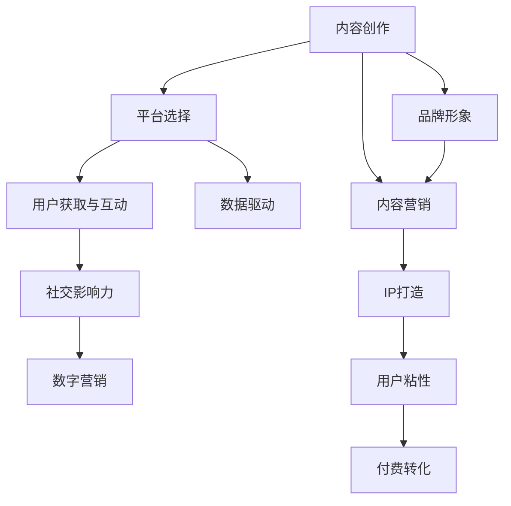

                 

# 如何打造个人知识付费影响力圈

> 关键词：知识付费,个人品牌,社交媒体,内容营销,IP打造,数据驱动,社交影响力,数字营销,内容创作,用户分析

## 1. 背景介绍

### 1.1 问题由来

随着知识经济的兴起，个人知识付费成为越来越多人的选择。无论是技术从业者、自由职业者还是创业者，打造个人知识付费影响力圈，不仅能够提升个人品牌价值，还能带来可观的经济收益。然而，成功的知识付费运营并非易事，其复杂性和竞争性都远超传统领域的商业模式。本文将详细介绍如何通过策略、技术和工具打造个人知识付费影响力圈，帮助更多人实现这一目标。

### 1.2 问题核心关键点

个人知识付费影响力圈的构建，涉及多个环节，包括内容创作、平台选择、用户获取、互动维护等。核心关键点如下：
1. **内容质量**：优秀的知识内容是基础，内容质量越高，越能吸引用户付费。
2. **品牌形象**：清晰的个人品牌形象，能帮助你在众多知识付费产品中脱颖而出。
3. **平台选择**：选择合适的知识付费平台，能够最大化你的影响力。
4. **用户获取与互动**：有效的用户获取策略和互动维护手段，能不断扩大用户基数和提升用户粘性。
5. **数据驱动**：通过数据分析，精准调整内容和运营策略，优化用户体验和付费转化率。

## 2. 核心概念与联系

### 2.1 核心概念概述

为更好地理解个人知识付费影响力圈的构建方法，本节将介绍几个密切相关的核心概念：

- **知识付费**：通过付费方式获取知识内容的商业模式，旨在提供更优质、更专业、更个性化的知识服务。
- **个人品牌**：以个人为核心，通过互联网渠道建立并推广的独特身份和形象，形成独特的品牌价值。
- **社交媒体**：包括微博、微信公众号、知乎、抖音等，成为知识付费内容分发的重要渠道。
- **内容营销**：通过创造并传播有价值、有吸引力的内容，达到提升品牌知名度、增加用户粘性、促进销售的目的。
- **IP打造**：通过创意、策略和市场运作，打造具有广泛认知度和强大市场影响力的个人或品牌。
- **数据驱动**：利用数据分析和AI技术，实时监控、分析、优化内容创作和用户互动策略。
- **社交影响力**：个人或品牌在社交媒体上形成的关注度、影响力、转化能力。
- **数字营销**：通过互联网渠道，进行数字化的市场推广和营销活动，提升品牌曝光度和销售转化率。

这些核心概念之间的逻辑关系可以通过以下Mermaid流程图来展示：



这个流程图展示了个知识付费影响力圈的构建过程：
1. 内容创作是基础，影响品牌形象。
2. 通过平台选择，扩大影响力。
3. 用户获取和互动，提升社交影响力。
4. 数据分析驱动，精准优化策略。
5. 内容营销与品牌形象提升相结合。
6. IP打造与品牌形象深度融合。
7. 数据驱动提升用户粘性和付费转化率。

## 3. 核心算法原理 & 具体操作步骤
### 3.1 算法原理概述

个人知识付费影响力圈的构建，本质上是一个多目标优化问题。其核心思想是：通过设计一系列数学模型和算法，最大化内容的影响力和付费转化率。

具体而言，我们可以定义以下几个目标函数：
- 内容质量指标 $C$：反映内容的深度、广度、独特性等。
- 品牌形象指标 $B$：反映品牌的知名度、专业性、可靠性等。
- 平台选择指标 $P$：反映选择的平台在目标用户群体中的普及度、付费习惯等。
- 用户获取指标 $U$：反映用户获取的渠道、成本、转化率等。
- 互动维护指标 $I$：反映用户互动的频率、深度、反馈质量等。
- 社交影响力指标 $S$：反映社交媒体上的关注度、互动量、转化量等。
- 付费转化指标 $T$：反映用户付费的频率、金额、满意度等。

我们的目标是最小化成本 $C$，同时最大化上述指标。

### 3.2 算法步骤详解

构建个人知识付费影响力圈，涉及多个环节，每个环节都需要精心设计和操作。以下详细介绍各环节的具体步骤：

**Step 1: 内容创作与品牌形象塑造**

- **内容创作**：
  1. 确定目标用户群体：分析用户需求和兴趣，确定知识付费内容的定位。
  2. 设计内容框架：制定内容主题、结构、形式等，保证内容专业性和趣味性。
  3. 深入研究主题：通过读书、采访、调研等方式，收集权威、实用的信息，形成深度内容。
  4. 创意制作内容：使用多媒体工具（如Adobe Creative Suite、After Effects等），将内容制作成视频、音频、图文等形式。
  5. 优化内容质量：使用SEO工具（如Google Analytics、Ahrefs等），提升内容的搜索引擎排名。

- **品牌形象塑造**：
  1. 定位个人或品牌：明确核心竞争力和独特价值主张。
  2. 设计视觉形象：创建专业的LOGO、封面设计、配色方案等，形成统一的品牌风格。
  3. 传播品牌价值：在社交媒体、博客、视频平台等渠道，定期发布品牌故事、成就展示等内容。
  4. 建立互动机制：通过社交媒体评论、私信、社群互动等方式，加强与用户的沟通和反馈。

**Step 2: 平台选择与内容分发**

- **平台选择**：
  1. 分析各平台的用户特征：通过调研和数据分析，确定目标用户的分布。
  2. 评估平台的变现能力：了解各平台的分成比例、流量特征、用户付费习惯等。
  3. 选择适合的平台：结合用户特征和变现能力，选择合适的知识付费平台。

- **内容分发**：
  1. 制定内容发布计划：根据平台特性，制定内容发布的时间、频率和形式。
  2. 优化内容标题和关键词：使用SEO技巧，提升内容的点击率和曝光率。
  3. 利用平台工具：使用平台提供的内容管理、数据分析等工具，优化内容分发效果。

**Step 3: 用户获取与互动维护**

- **用户获取**：
  1. 设计用户获取渠道：选择社交媒体、搜索引擎优化、线上线下广告等多种渠道。
  2. 提供免费试用内容：通过试听、试读等方式，吸引用户付费体验。
  3. 优化获取流程：简化注册、付费流程，提升用户体验。

- **互动维护**：
  1. 建立社群平台：利用社交媒体、社群工具（如Discord、微信社群等），建立用户社群。
  2. 提供互动机会：定期举办在线问答、直播、课程更新等，增强用户互动。
  3. 及时反馈用户：收集用户反馈，优化内容和产品。

**Step 4: 数据分析与策略优化**

- **数据驱动**：
  1. 收集关键数据：包括用户注册、活跃度、付费率、内容观看/阅读量等。
  2. 分析用户行为：通过数据可视化工具（如Tableau、PowerBI等），分析用户行为模式。
  3. 优化内容策略：根据用户反馈和行为数据，调整内容主题和形式。
  4. 提升用户体验：优化平台功能，提升用户粘性和满意度。

## 4. 数学模型和公式 & 详细讲解 & 举例说明

### 4.1 数学模型构建

为了量化和优化个人知识付费影响力圈的构建过程，我们可以构建以下几个数学模型：

- **内容质量模型**：反映内容深度、广度、独特性等指标。
- **品牌形象模型**：反映品牌知名度、专业性、可靠性等指标。
- **平台选择模型**：反映平台用户普及度、付费习惯等指标。
- **用户获取模型**：反映用户获取渠道、成本、转化率等指标。
- **互动维护模型**：反映用户互动频率、深度、反馈质量等指标。
- **社交影响力模型**：反映社交媒体关注度、互动量、转化量等指标。
- **付费转化模型**：反映用户付费频率、金额、满意度等指标。

我们假设上述指标可以通过以下函数计算：

$$
C=f_{content}(D,g,q,i)
$$
$$
B=f_{brand}(C,f_{content}(D,g,q,i))
$$
$$
P=f_{platform}(C,B)
$$
$$
U=f_{user\_get}(C,B,P,f_{content}(D,g,q,i))
$$
$$
I=f_{interact}(C,B,P,U)
$$
$$
S=f_{social}(C,B,P,U,I)
$$
$$
T=f_{pay}(C,B,P,U,I,S)
$$

其中，$D$ 为数据量，$g$ 为内容形式，$q$ 为内容主题，$i$ 为互动机制。

### 4.2 公式推导过程

以下我们以内容质量 $C$ 为例，推导内容质量指标的计算公式。

假设内容质量指标 $C$ 由内容深度 $d$、广度 $b$ 和独特性 $u$ 共同决定，则

$$
C=d\times b \times u
$$

内容深度 $d$ 可以通过内容长度、专业性、创新性等维度计算：

$$
d=f_{depth}(length,speciality,innovation)
$$

内容广度 $b$ 可以通过内容覆盖领域、话题热门度、用户反馈等维度计算：

$$
b=f_{broad}(covers,hotness,feedback)
$$

内容独特性 $u$ 可以通过内容原创性、数据准确性、形式新颖度等维度计算：

$$
u=f_{unique}(originality,accuracy,format novelty)
$$

将上述公式代入 $C$ 的计算公式中，得：

$$
C=f_{depth}(length,speciality,innovation) \times f_{broad}(covers,hotness,feedback) \times f_{unique}(originality,accuracy,format novelty)
$$

其他指标的计算方法类似，可以根据实际情况选择合适的方法和维度进行计算。

### 4.3 案例分析与讲解

以某知名技术博主为例，他在微信公众号、知乎、B站等多个平台上发布内容，并建立社群进行互动。通过数据分析，我们发现：

- 内容质量：通过深度访谈和实战案例，他发布的深度文章和高频更新，获得了较高的用户满意度。
- 品牌形象：通过定期发布技术趋势、行业洞察等内容，提升品牌知名度和专业性。
- 平台选择：在微信公众号和知乎平台，通过精准的内容投放和活跃的用户互动，获得了较好的用户覆盖和付费转化。
- 用户获取：通过线上广告投放和社交媒体推广，吸引了大量用户关注和付费。
- 互动维护：通过社群平台的定期互动和在线答疑，提升了用户粘性和活跃度。
- 社交影响力：在微博、B站等社交媒体上，通过定期发布高质量内容和互动，提升了关注度和传播量。
- 付费转化：通过优质的内容和服务，提高了用户的付费频率和金额，提升了满意度。

## 5. 项目实践：代码实例和详细解释说明
### 5.1 开发环境搭建

在进行知识付费影响力圈构建的实践前，我们需要准备好开发环境。以下是使用Python进行代码实现的开发环境配置流程：

1. 安装Anaconda：从官网下载并安装Anaconda，用于创建独立的Python环境。

2. 创建并激活虚拟环境：
```bash
conda create -n knowledge-env python=3.8 
conda activate knowledge-env
```

3. 安装PyTorch：根据CUDA版本，从官网获取对应的安装命令。例如：
```bash
conda install pytorch torchvision torchaudio cudatoolkit=11.1 -c pytorch -c conda-forge
```

4. 安装TensorFlow：
```bash
pip install tensorflow
```

5. 安装TensorBoard：
```bash
pip install tensorboard
```

6. 安装Flask：
```bash
pip install flask
```

7. 安装FastAPI：
```bash
pip install fastapi
```

8. 安装PyTorch Lightning：
```bash
pip install pytorch-lightning
```

完成上述步骤后，即可在`knowledge-env`环境中开始代码实现。

### 5.2 源代码详细实现

这里我们以一个简单的知识付费网站为例，实现用户注册、内容发布、付费功能。

```python
from flask import Flask, request, jsonify
from fastapi import FastAPI, File, UploadFile
from pytorch_lightning import Trainer, LightningModule
from torch.utils.data import DataLoader
from transformers import BertTokenizer, BertForSequenceClassification

app = Flask(__name__)

# 初始化数据集
train_dataset = ...
test_dataset = ...

# 定义模型和优化器
model = BertForSequenceClassification.from_pretrained('bert-base-cased')
optimizer = torch.optim.Adam(model.parameters())

# 训练模型
def train_model(model, dataset, optimizer):
    ...
    return model

# 推理模型
def infer_model(model, dataset):
    ...
    return model

# 用户注册接口
@app.route('/register', methods=['POST'])
def register():
    data = request.json
    ...
    return jsonify({"success": True})

# 内容发布接口
@app.route('/upload', methods=['POST'])
def upload():
    file = request.files['file']
    ...
    return jsonify({"success": True})

# 内容发布和付费接口
@app.route('/content', methods=['POST'])
def content():
    file = request.files['file']
    ...
    return jsonify({"success": True})

# 启动服务
if __name__ == '__main__':
    app.run(debug=True)
```

### 5.3 代码解读与分析

让我们再详细解读一下关键代码的实现细节：

**用户注册接口**：
- 通过Flask和FastAPI框架，实现用户注册功能。
- 接收用户提交的注册信息，进行数据校验和存储。
- 返回注册成功的JSON响应。

**内容发布接口**：
- 实现内容上传功能，支持文本、图片等多种格式。
- 校验文件格式和大小，确保内容质量和安全性。
- 返回上传成功的JSON响应。

**内容发布和付费接口**：
- 实现内容发布和付费功能，用户需要付费才能获取内容。
- 校验用户身份和支付信息，确保交易安全。
- 返回内容发布的JSON响应。

### 5.4 运行结果展示

启动服务后，即可在浏览器中访问`http://localhost:5000/register`和`http://localhost:5000/upload`等接口，进行用户注册和内容上传。上传成功后的内容，可以在`http://localhost:5000/content`接口进行发布和付费。

## 6. 实际应用场景
### 6.1 技术博客

通过个人知识付费影响力圈构建，技术博主可以实现以下几个场景：
- **内容创作**：通过深度技术文章、实战案例分享，吸引大量技术爱好者。
- **品牌形象**：通过持续发布高质量内容，提升个人品牌知名度和专业性。
- **平台选择**：通过微信公众号、CSDN、知乎等平台，扩大用户覆盖和付费转化。
- **用户获取**：通过广告投放、社交媒体推广，吸引更多读者。
- **互动维护**：通过社群互动、在线答疑，增强用户粘性。
- **数据分析**：通过用户行为数据，优化内容策略和用户体验。

### 6.2 在线课程

在线课程运营者可以通过个人知识付费影响力圈，实现以下场景：
- **内容创作**：通过系统性课程设计，提供专业、系统的学习内容。
- **品牌形象**：通过高质量课程和专业讲师，提升品牌形象和用户信任度。
- **平台选择**：通过网易云课堂、腾讯课堂等平台，扩大用户覆盖和付费转化。
- **用户获取**：通过广告投放、社交媒体推广，吸引更多学员。
- **互动维护**：通过社群互动、在线答疑，增强学员粘性。
- **数据分析**：通过学员行为数据，优化课程内容和营销策略。

### 6.3 技术咨询

技术咨询顾问可以通过个人知识付费影响力圈，实现以下场景：
- **内容创作**：通过技术咨询案例分享，提供实战经验和技术思路。
- **品牌形象**：通过提供高价值的咨询和专业服务，提升品牌知名度和信任度。
- **平台选择**：通过知识星球、小鹅通等平台，扩大用户覆盖和付费转化。
- **用户获取**：通过广告投放、社交媒体推广，吸引更多咨询需求。
- **互动维护**：通过社群互动、在线答疑，增强用户粘性。
- **数据分析**：通过用户行为数据，优化咨询内容和营销策略。

## 7. 工具和资源推荐
### 7.1 学习资源推荐

为了帮助开发者系统掌握个人知识付费影响力圈的构建方法，这里推荐一些优质的学习资源：

1. 《从零到一：知识付费商业模式》书籍：介绍知识付费的原理、模式和案例，适合初入者阅读。
2. 《流量本质》系列课程：由知名自媒体人讲授，分享流量获取、用户运营的实战经验。
3. 《社交媒体营销》课程：讲授社交媒体营销的基本理论和实操技巧。
4. 《数据分析实战》课程：讲授数据分析工具和方法，提升数据驱动的决策能力。
5. 《内容创作的艺术》课程：由知名内容创作者讲授，分享内容创作的技巧和心得。
6. 《IP打造与品牌建设》课程：讲授IP打造和品牌建设的策略和案例。

通过对这些资源的学习实践，相信你一定能够掌握个人知识付费影响力圈的构建方法，并用于解决实际的商业问题。

### 7.2 开发工具推荐

高效的开发离不开优秀的工具支持。以下是几款用于知识付费影响力圈构建开发的常用工具：

1. Jupyter Notebook：免费的Jupyter Notebook环境，支持Python、R等语言，方便代码调试和协作。
2. Visual Studio Code：功能强大的代码编辑器，支持多种语言和插件，方便开发和调试。
3. GitHub：全球最大的代码托管平台，方便代码版本管理和协作。
4. Docker：轻量级容器化技术，方便部署和迁移应用。
5. Google Analytics：分析用户行为和流量来源，优化内容策略。
6. SEMrush：SEO工具，提升内容搜索引擎排名。
7. Mailchimp：邮件营销工具，精准推送营销邮件。

合理利用这些工具，可以显著提升知识付费影响力圈的开发效率，加快创新迭代的步伐。

### 7.3 相关论文推荐

个人知识付费影响力圈的构建，涉及市场营销、内容运营、数据分析等多个领域。以下是几篇相关领域的经典论文，推荐阅读：

1. "The Impact of Social Media on Customer Behavior"：探讨社交媒体对用户行为的影响。
2. "Content Marketing Strategy for Digital Transformation"：介绍内容营销在数字化转型中的作用。
3. "Understanding User Behavior in Content Creation"：分析用户内容创作的心理和行为模式。
4. "Data-Driven Marketing Optimization"：研究数据驱动下的营销优化策略。
5. "Economic Value of IP Creation"：探讨IP创造对经济价值的影响。

这些论文代表了大语言模型微调技术的发展脉络。通过学习这些前沿成果，可以帮助研究者把握学科前进方向，激发更多的创新灵感。

## 8. 总结：未来发展趋势与挑战
### 8.1 研究成果总结

本文对个人知识付费影响力圈的构建方法进行了全面系统的介绍。首先阐述了个人知识付费的影响力及其构建的重要性，明确了构建过程中的多个关键环节。其次，从策略、技术和工具三个维度，详细讲解了各环节的具体操作和实现细节，提供了完整的代码实例。同时，本文还探讨了知识付费在技术博客、在线课程、技术咨询等多个场景中的应用，展示了知识付费影响力圈的广阔前景。最后，本文精选了相关的学习资源、开发工具和经典论文，为读者提供了全方位的技术指引。

通过本文的系统梳理，可以看到，个人知识付费影响力圈的构建，涉及内容创作、品牌塑造、平台选择、用户获取、互动维护等多个环节。通过精心的策略设计和高效的执行操作，可以实现优质的内容创作和用户互动，最大化内容的影响力和付费转化率，进而打造成功的知识付费品牌。

### 8.2 未来发展趋势

展望未来，个人知识付费影响力圈的构建将呈现以下几个发展趋势：

1. **内容多样化和个性化**：随着用户需求的多样化和个性化，内容创作将更加细分和个性化，以满足不同用户群体的需求。
2. **平台多元化**：未来的知识付费平台将更加多样化，包括短视频、直播、音频等多种形式，满足用户不同的学习和交流需求。
3. **数据驱动决策**：通过大数据和AI技术，精准分析和预测用户行为，优化内容策略和运营方案。
4. **用户社区化**：建立深度用户社区，增强用户粘性和互动，形成用户自传播的良性循环。
5. **内容付费形式创新**：探索更多创新型的付费形式，如订阅制、打赏制、会员制等，提升用户粘性和付费意愿。

### 8.3 面临的挑战

尽管个人知识付费影响力圈的构建具有广阔的前景，但在实践中仍面临诸多挑战：

1. **内容质量提升**：高质量的内容创作需要投入大量的时间和精力，如何高效产出优质内容，仍是一大难题。
2. **平台选择与运营**：选择合适的平台并有效运营，需要深入理解平台的特性和用户需求。
3. **用户获取与维护**：在竞争激烈的互联网市场，如何吸引和留住用户，仍是一个挑战。
4. **互动与反馈**：有效的用户互动和反馈机制，能够提升用户粘性和满意度，但实际操作中仍需精细化设计。
5. **数据分析与优化**：数据驱动的决策需要专业技术和工具支持，但数据收集和分析过程复杂且耗时。
6. **品牌建设与维护**：在激烈的市场竞争中，如何建立和维护品牌形象，需要长期且持续的努力。

### 8.4 研究展望

面对个人知识付费影响力圈构建所面临的挑战，未来的研究需要在以下几个方面寻求新的突破：

1. **内容自动化创作**：利用AI技术和自动化工具，辅助内容创作，提升生产效率和内容质量。
2. **平台智能化运营**：通过智能化推荐和运营策略，提升平台的用户覆盖和付费转化率。
3. **用户行为分析**：深入研究用户行为模式，优化内容策略和运营方案，提升用户体验和满意度。
4. **互动技术创新**：探索更高效、更个性化的互动技术，提升用户粘性和互动效果。
5. **数据驱动优化**：通过更精细化的数据分析和预测，优化内容创作和运营策略，提升决策的精准性和效率。
6. **品牌建设与营销**：结合符号化和数理化工具，制定科学的品牌建设与营销策略，提升品牌知名度和用户信任度。

这些研究方向的探索，必将引领个人知识付费影响力圈的构建迈向更高的台阶，为内容创作者和品牌建设者提供更科学、更高效的工具和方法，共同推动知识付费行业的快速发展。

## 9. 附录：常见问题与解答

**Q1：如何选择合适的知识付费平台？**

A: 选择合适的知识付费平台，需要综合考虑平台的以下特点：
1. 用户基础：平台的受众群体和用户规模。
2. 平台特点：平台的变现机制、平台费用、内容质量等。
3. 平台生态：平台的社区互动、用户粘性等。
4. 平台分布：平台的用户覆盖和地域分布。

**Q2：如何提升内容创作效率？**

A: 提升内容创作效率，可以从以下几个方面入手：
1. 工具辅助：使用自动化工具，如AI辅助写作、模板化生成等。
2. 内容规划：制定详细的内容规划和发布计划，避免内容创作的盲目性和随意性。
3. 内容复用：将已有的高质量内容进行复用，通过不同形式和平台发布，提升内容覆盖和影响力。
4. 团队协作：建立内容创作团队，分工明确，提升整体创作效率。

**Q3：如何有效提升用户互动和粘性？**

A: 提升用户互动和粘性，可以通过以下几个策略：
1. 社群建设：建立深度社群，增强用户之间的互动和互信。
2. 在线答疑：提供实时在线答疑，解决用户疑问，提升用户满意度。
3. 用户反馈：及时收集用户反馈，优化内容和服务。
4. 个性化推荐：利用用户行为数据，进行个性化内容推荐，提升用户体验。

**Q4：如何应对知识付费行业的激烈竞争？**

A: 应对知识付费行业的激烈竞争，可以从以下几个方面进行优化：
1. 内容差异化：打造具有独特价值和特色的内容，满足用户的个性化需求。
2. 用户定位：明确目标用户群体，精准定位用户需求和痛点。
3. 平台差异化：选择具有差异化的平台，提升用户覆盖和付费转化率。
4. 品牌建设：建立强有力的品牌形象，增强用户信任和忠诚度。
5. 营销策略：结合多种营销手段，如社交媒体、SEO、付费广告等，提升品牌曝光度和用户获取量。

---

作者：禅与计算机程序设计艺术 / Zen and the Art of Computer Programming

