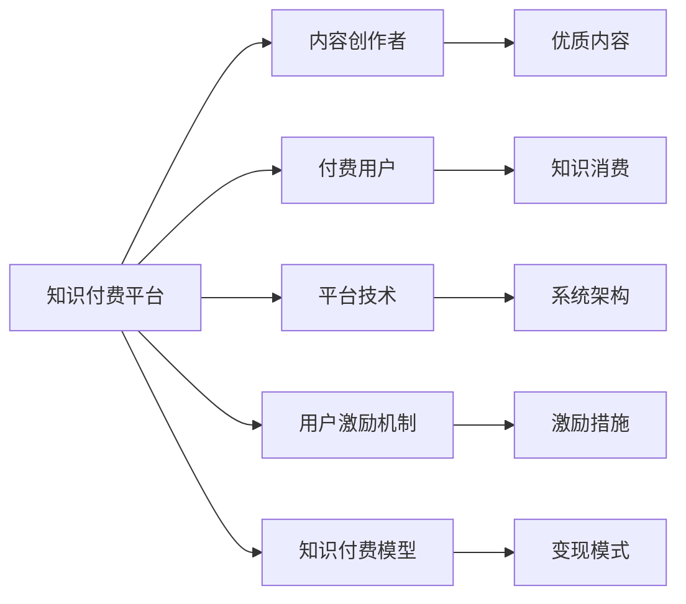

                 

# 如何打造个人知识付费生态

在知识经济蓬勃发展的今天，个人知识付费生态的建设已成为企业和个人共同追求的目标。个人知识付费生态不仅仅是知识和技能传播的渠道，更是连接用户、创作者和平台的桥梁。本文将详细阐述如何从零开始打造一个成功的个人知识付费生态，涵盖内容创作、用户运营、平台技术等关键环节，帮助广大创作者和开发者构建可持续发展的知识付费系统。

## 1. 背景介绍

随着信息时代的到来，知识变得越来越重要，个人知识付费生态应运而生。它为创作者提供了表达专业知识和技能的新平台，为用户提供了获取高质量信息的新渠道。个人知识付费生态的成功，不仅能够提升创作者的经济收益，也能丰富用户的知识储备。但同时，这一生态的构建需要应对一系列复杂挑战，如内容质量管控、用户激励机制、平台技术架构等。本文将从这些问题出发，系统介绍如何构建一个成功的个人知识付费生态。

## 2. 核心概念与联系

### 2.1 核心概念概述

为了更好地理解个人知识付费生态的构建方法，本节将介绍几个密切相关的核心概念：

- **知识付费平台(Knowledge Payment Platforms)**：指以知识内容为核心的付费平台，通过付费模式鼓励优质内容创作，为创作者和用户提供高效互动的交流环境。

- **内容创作者(Content Creators)**：指具有特定领域专业知识或技能，通过知识付费平台提供专业信息、技能培训、工具课程等内容的个人或机构。

- **付费用户(Paid Users)**：指愿意为高质量内容支付费用的用户，根据消费习惯和需求选择各类知识服务。

- **平台技术(Architecture and Technology)**：指支持知识付费生态运行的底层技术架构，包括但不限于用户管理系统、内容管理系统、支付系统等。

- **用户激励机制(User Engagement Mechanisms)**：指平台为了鼓励内容创作和用户活跃而设计的各类激励措施，如积分、折扣、会员特权等。

- **知识付费模型(Knowledge Monetization Models)**：指知识付费平台实现变现的商业模式，如订阅模式、单次付费模式、会员模式等。

这些核心概念之间的逻辑关系可以通过以下Mermaid流程图来展示：



这个流程图展示了个体知识付费生态的关键组件及其之间的关系：

1. **知识付费平台**：是整个生态的中心，提供内容创作和付费的场所。
2. **内容创作者**：提供高质量的原创内容，通过平台进行分发。
3. **付费用户**：为优质内容付费，获取知识和技能。
4. **平台技术**：确保平台稳定高效运行，支持内容的上传、审核、推荐、支付等功能。
5. **用户激励机制**：通过激励措施促进创作者和用户的互动，提升生态活力。
6. **知识付费模型**：通过多样化的付费方式，实现平台和创作者的收入增长。

## 3. 核心算法原理 & 具体操作步骤

### 3.1 算法原理概述

个人知识付费生态的构建，核心在于如何平衡创作者、平台和用户三方利益。这涉及内容推荐算法、用户行为分析、收益分配模型等多个方面。我们以内容推荐算法为例，介绍核心算法原理。

内容推荐算法通过分析用户的历史行为和偏好，为其推荐最相关的知识内容。其核心思想可以概括为：

1. **用户行为建模**：将用户的历史行为转化为向量表示，如阅读时长、点赞数、评论等。
2. **内容特征提取**：对内容进行特征提取，如关键词、主题、作者等。
3. **相似度计算**：计算用户行为向量与内容特征向量的相似度。
4. **推荐排序**：根据相似度计算结果，对内容进行排序推荐。

形式化地，假设用户行为向量为 $u$，内容特征向量为 $c$，相似度函数为 $sim(u, c)$。推荐排序过程可以表示为：

$$
\text{Rank}(c) \propto \sum_{i=1}^N sim(u_i, c) \times w_i
$$

其中，$u_i$ 为用户的历史行为向量，$w_i$ 为每个行为的重要性权重。

### 3.2 算法步骤详解

以推荐算法为例，以下是具体步骤：

1. **数据收集**：从平台日志、用户行为数据等渠道收集数据，构建用户行为向量 $u$ 和内容特征向量 $c$。

2. **特征提取**：使用NLP、图像识别等技术提取内容特征，使用聚类、降维等技术处理用户行为数据，得到特征向量。

3. **相似度计算**：使用余弦相似度、欧式距离等算法计算用户行为向量 $u$ 和内容特征向量 $c$ 的相似度。

4. **排序计算**：根据相似度计算结果和内容重要性权重，对内容进行排序。

5. **推荐呈现**：将排序后的内容呈现在用户界面，通过互动反馈进一步优化推荐算法。

### 3.3 算法优缺点

推荐算法具有以下优点：

- **个性化推荐**：通过分析用户行为，为用户推荐个性化的内容，提升用户满意度。
- **高效展示**：快速计算并排序推荐内容，为用户节省搜索时间。

同时，该算法也存在一些局限性：

- **数据依赖**：算法的有效性依赖于高质量、完整的数据，数据不充分时可能出现偏差。
- **冷启动问题**：新用户或新内容难以快速融入推荐体系，需要进行初期引导。
- **动态变化**：用户行为和兴趣会随时间变化，推荐算法需要不断更新。

### 3.4 算法应用领域

推荐算法广泛应用于知识付费平台，涵盖课程推荐、作者推荐、活动推荐等多个方面。在具体应用中，常见的推荐算法包括协同过滤、基于内容的推荐、混合推荐等。

## 4. 数学模型和公式 & 详细讲解 & 举例说明

### 4.1 数学模型构建

基于推荐算法的知识付费平台，可以使用协同过滤模型进行内容推荐。协同过滤模型通过分析用户和内容之间的相似度，推荐与用户偏好相似的内容。

形式化地，协同过滤模型的推荐函数可以表示为：

$$
\text{Rank}(c) \propto \sum_{u=1}^U \alpha_u \times \sum_{i=1}^N sim(u, c) \times w_i
$$

其中，$\alpha_u$ 为用户 $u$ 的权重，$sim(u, c)$ 为用户与内容之间的相似度。

### 4.2 公式推导过程

协同过滤模型的推导过程如下：

1. **用户行为矩阵**：构建用户-内容交互矩阵 $R$，其中 $R_{ui} = 1$ 表示用户 $u$ 对内容 $i$ 进行了交互。

2. **相似度计算**：计算用户 $u$ 和内容 $i$ 之间的相似度 $sim(u, i)$，一般使用余弦相似度或皮尔逊相关系数。

3. **用户权重计算**：根据用户的历史行为和互动程度，计算用户 $u$ 的权重 $\alpha_u$，一般使用平均互信息或加权和等方法。

4. **内容排序计算**：计算用户 $u$ 对内容 $i$ 的兴趣度 $r_u(i)$，然后对所有内容进行排序推荐。

### 4.3 案例分析与讲解

假设平台有两位用户 $A$ 和 $B$，以及两门课程 $C$ 和 $D$。用户 $A$ 和 $B$ 的评分如下表所示：

| 用户 | 课程 | 评分 |
| --- | --- | --- |
| $A$ | $C$ | 4 |
| $A$ | $D$ | 5 |
| $B$ | $C$ | 3 |
| $B$ | $D$ | 5 |

使用余弦相似度计算用户 $A$ 和 $B$ 之间的相似度：

$$
sim(A, B) = \frac{\sum_{i=1}^N a_i \times b_i}{\sqrt{\sum_{i=1}^N a_i^2} \times \sqrt{\sum_{i=1}^N b_i^2}}
$$

其中，$a_i$ 和 $b_i$ 为用户 $A$ 和 $B$ 对内容 $i$ 的评分。

计算得到：

$$
sim(A, B) = \frac{4 \times 5 + 5 \times 5}{\sqrt{4^2 + 5^2} \times \sqrt{3^2 + 5^2}} = 0.9
$$

使用协同过滤算法，为用户 $A$ 推荐与 $B$ 相似的内容 $C$ 和 $D$。具体步骤如下：

1. 构建用户行为矩阵 $R$：

$$
R = \begin{bmatrix}
4 & 0 \\
0 & 5 \\
3 & 0 \\
0 & 5
\end{bmatrix}
$$

2. 计算用户 $A$ 和内容 $i$ 的相似度 $sim(A, i)$：

$$
sim(A, C) = 0.5, \quad sim(A, D) = 1.0
$$

3. 计算用户 $A$ 的权重 $\alpha_A$，一般使用平均互信息：

$$
\alpha_A = \frac{1}{1 + \sqrt{\sum_{i=1}^N (1 - R_{iA}) \times (1 - R_{iB})}}
$$

4. 计算用户 $A$ 对内容 $i$ 的兴趣度 $r_A(i)$，并排序推荐：

$$
r_A(C) = \alpha_A \times sim(A, C) = 0.25, \quad r_A(D) = \alpha_A \times sim(A, D) = 0.5
$$

最终推荐结果为 $D$。

## 5. 项目实践：代码实例和详细解释说明

### 5.1 开发环境搭建

在进行知识付费生态开发前，我们需要准备好开发环境。以下是使用Python进行开发的环境配置流程：

1. 安装Anaconda：从官网下载并安装Anaconda，用于创建独立的Python环境。

2. 创建并激活虚拟环境：
```bash
conda create -n knowledge-env python=3.8 
conda activate knowledge-env
```

3. 安装PyTorch：根据CUDA版本，从官网获取对应的安装命令。例如：
```bash
conda install pytorch torchvision torchaudio cudatoolkit=11.1 -c pytorch -c conda-forge
```

4. 安装Flask：用于构建知识付费平台的Web接口。

5. 安装TensorBoard：用于可视化推荐算法的训练过程。

6. 安装SQLAlchemy：用于管理数据库。

完成上述步骤后，即可在`knowledge-env`环境中开始开发。

### 5.2 源代码详细实现

以下是一个简单的知识付费平台推荐系统的PyTorch代码实现。

```python
import torch
import torch.nn as nn
import torch.optim as optim
from sklearn.metrics import precision_recall_fscore_support

class UserEmbedding(nn.Module):
    def __init__(self, n_users, dim):
        super().__init__()
        self.linear = nn.Linear(n_users, dim)
        
    def forward(self, x):
        return self.linear(x)

class ItemEmbedding(nn.Module):
    def __init__(self, n_items, dim):
        super().__init__()
        self.linear = nn.Linear(n_items, dim)
        
    def forward(self, x):
        return self.linear(x)

class Similarity(nn.Module):
    def __init__(self, dim):
        super().__init__()
        self.cosine_similarity = nn.CosineSimilarity(dim=1, eps=1e-12)
        
    def forward(self, x, y):
        return self.cosine_similarity(x, y)

class RecommendationSystem(nn.Module):
    def __init__(self, n_users, n_items, dim):
        super().__init__()
        self.user_embed = UserEmbedding(n_users, dim)
        self.item_embed = ItemEmbedding(n_items, dim)
        self.similarity = Similarity(dim)
        
    def forward(self, users, items):
        user_embed = self.user_embed(users)
        item_embed = self.item_embed(items)
        return self.similarity(user_embed, item_embed)

def evaluate(model, users, items, ratings, threshold):
    predictions = model(users, items).detach().cpu().numpy()
    thresholded_predictions = (predictions >= threshold).astype(int)
    true_positives = (ratings == 1) & thresholded_predictions
    false_positives = (ratings == 0) & thresholded_predictions
    true_negatives = (ratings == 0) & (~thresholded_predictions)
    false_negatives = (ratings == 1) & (~thresholded_predictions)
    precision = true_positives.sum() / (true_positives.sum() + false_positives.sum())
    recall = true_positives.sum() / (true_positives.sum() + false_negatives.sum())
    f1_score = 2 * precision * recall / (precision + recall)
    return precision, recall, f1_score

def train(model, users, items, ratings, epochs, batch_size):
    model.train()
    optimizer = optim.Adam(model.parameters(), lr=0.001)
    for epoch in range(epochs):
        for batch in range(0, len(users), batch_size):
            users_batch = users[batch:batch+batch_size]
            items_batch = items[batch:batch+batch_size]
            ratings_batch = ratings[batch:batch+batch_size]
            optimizer.zero_grad()
            loss = model(users_batch, items_batch).mean()
            loss.backward()
            optimizer.step()
            if epoch % 10 == 0:
                precision, recall, f1_score = evaluate(model, users, items, ratings, 0.5)
                print(f"Epoch {epoch+1}, precision={precision:.3f}, recall={recall:.3f}, f1_score={f1_score:.3f}")
```

这里我们定义了用户嵌入、物品嵌入和相似度计算模块，并通过构建推荐系统对用户行为进行预测。

### 5.3 代码解读与分析

让我们再详细解读一下关键代码的实现细节：

**UserEmbedding类**：
- `__init__`方法：初始化用户嵌入层，将用户向量映射到指定维度。
- `forward`方法：对用户向量进行嵌入操作，返回嵌入后的向量表示。

**ItemEmbedding类**：
- `__init__`方法：初始化物品嵌入层，将物品向量映射到指定维度。
- `forward`方法：对物品向量进行嵌入操作，返回嵌入后的向量表示。

**Similarity类**：
- `__init__`方法：初始化相似度计算模块，使用余弦相似度算法。
- `forward`方法：计算用户向量和物品向量之间的相似度。

**RecommendationSystem类**：
- `__init__`方法：初始化推荐系统模块，包含用户嵌入、物品嵌入和相似度计算模块。
- `forward`方法：计算用户对物品的兴趣度，返回相似度值。

**evaluate函数**：
- 使用精度、召回率和F1-score指标评估推荐结果的质量。
- 将用户行为矩阵与模型预测结果进行对比，统计各类指标值。

**train函数**：
- 使用Adam优化器进行模型训练，迭代更新模型参数。
- 在每个epoch结束时，打印当前模型的精度、召回率和F1-score。

以上代码实现了基本的协同过滤推荐算法，并通过训练不断优化模型性能。

## 6. 实际应用场景

### 6.1 在线教育

在线教育平台通过知识付费生态，为教师和学生提供互动交流的场所。教师可以在平台发布各类课程、资源、讲座等，学生通过付费订阅，获取高质量的学习材料和专业指导。平台可以根据学生的学习行为和反馈，推荐适合的课程和学习资料，提升学习效果。

### 6.2 职场培训

企业内部培训系统通过知识付费生态，帮助员工提升职业技能。平台可以发布各类培训课程、工作坊、认证考试等，员工通过付费订阅，获取专业知识和技能培训。平台可以根据员工的培训历史和绩效，推荐适合的课程和导师，提升培训效果。

### 6.3 医疗健康

医疗知识付费平台通过知识付费生态，为医生和患者提供互动交流的场所。医生可以在平台发布各类医学知识、病例分析、手术视频等，患者通过付费订阅，获取专业医学知识和治疗建议。平台可以根据患者的健康数据和医疗记录，推荐适合的医生和诊疗方案，提升医疗效果。

### 6.4 未来应用展望

随着知识付费生态的不断发展，未来的应用场景将会更加丰富和多样化。我们期待未来在以下领域看到更多创新应用：

- **智能客服**：知识付费平台结合智能客服技术，提供24小时在线服务，快速响应用户咨询，提供个性化的解决方案。
- **远程教育**：知识付费平台结合远程教育技术，提供随时随地学习的解决方案，打破地理限制，提升教育公平。
- **医疗咨询**：知识付费平台结合医疗咨询技术，提供智能化的健康咨询服务，为患者提供专业的健康建议和治疗方案。
- **职业发展**：知识付费平台结合职业发展技术，提供全面的职业规划和发展建议，帮助用户实现职业目标。

## 7. 工具和资源推荐

### 7.1 学习资源推荐

为了帮助开发者系统掌握知识付费生态的构建方法，这里推荐一些优质的学习资源：

1. **《推荐系统实战》**：李翔所著，系统介绍了推荐系统的原理、算法和工程实现，适合入门和进阶学习。

2. **《推荐系统》**：肖建中、郭全海合著，全面介绍了推荐系统的理论和实践，涵盖协同过滤、内容推荐等多种算法。

3. **Coursera《推荐系统》课程**：斯坦福大学开设的推荐系统课程，涵盖协同过滤、矩阵分解、深度学习等推荐技术。

4. **Kaggle竞赛**：参与推荐系统相关的Kaggle竞赛，实战学习推荐算法，提升算法设计和实现能力。

5. **GitHub开源项目**：通过阅读和参与推荐系统的开源项目，了解实际应用中的推荐算法和工程实践。

通过对这些资源的学习实践，相信你一定能够快速掌握知识付费生态的构建方法，并用于解决实际的推荐问题。

### 7.2 开发工具推荐

高效的开发离不开优秀的工具支持。以下是几款用于知识付费生态开发的常用工具：

1. **Flask**：Python的Web框架，轻量级且易于上手，适合快速开发推荐系统的Web接口。

2. **TensorFlow**：Google开发的深度学习框架，支持构建复杂的推荐系统模型。

3. **PyTorch**：Facebook开源的深度学习框架，灵活高效，适合构建推荐系统的数据处理和模型训练部分。

4. **AWS SageMaker**：亚马逊提供的云平台服务，支持构建和部署推荐系统，提供丰富的数据处理和模型训练资源。

5. **Kaggle**：提供Kaggle竞赛和社区交流平台，方便开发者获取数据、分享代码和成果。

6. **GitHub**：全球最大的代码托管平台，方便开发者分享和协作开发推荐系统。

合理利用这些工具，可以显著提升知识付费生态的开发效率，加快创新迭代的步伐。

### 7.3 相关论文推荐

知识付费生态的构建涉及推荐系统、知识管理、用户体验等多个方面。以下是几篇奠基性的相关论文，推荐阅读：

1. **《协同过滤推荐系统综述》**：Adomavicius和Tuzel综述了协同过滤算法的原理、应用和挑战，适合深入理解协同过滤推荐系统的理论基础。

2. **《基于内容的推荐系统》**：Breese、Heckerman和Kadie介绍了基于内容的推荐系统原理，适合理解基于内容的推荐算法。

3. **《深度学习在推荐系统中的应用》**：Bengio、Vincent和LeCun综述了深度学习在推荐系统中的应用，适合理解深度推荐算法。

4. **《知识图谱在推荐系统中的应用》**：张华军、唐文辉等人介绍了知识图谱在推荐系统中的应用，适合理解知识图谱推荐算法。

5. **《基于个性化推荐的搜索系统》**：Wang、Wang和Kwok综述了基于个性化推荐的搜索系统，适合理解搜索推荐一体化的推荐算法。

这些论文代表了大规模知识付费生态的研究脉络。通过学习这些前沿成果，可以帮助研究者把握学科前进方向，激发更多的创新灵感。

## 8. 总结：未来发展趋势与挑战

### 8.1 总结

本文对如何构建个人知识付费生态进行了系统介绍。首先阐述了知识付费生态的建设背景和意义，明确了推荐算法在平台建设中的核心作用。其次，从原理到实践，详细讲解了推荐算法的数学模型和工程实现，给出了知识付费生态开发的完整代码实例。同时，本文还广泛探讨了推荐系统在教育、职场、医疗等多个领域的应用前景，展示了推荐技术的巨大潜力。

通过本文的系统梳理，可以看到，知识付费生态的构建不仅需要推荐算法，还需要用户行为分析、平台技术架构等多个维度的协同发力。唯有从数据、算法、工程、业务等多个维度协同发力，才能真正实现知识付费生态的可持续发展。

### 8.2 未来发展趋势

展望未来，知识付费生态的构建将呈现以下几个发展趋势：

1. **技术融合**：推荐系统将与人工智能、大数据、区块链等技术深度融合，实现更高效、精准的推荐服务。

2. **内容多样化**：知识付费生态将从单一内容形式扩展到视频、音频、图像等多种形式，提升用户的多元化体验。

3. **实时互动**：知识付费平台将结合实时互动技术，如智能客服、在线课程、实时问答等，提升用户互动和参与感。

4. **个性化定制**：通过深度学习等技术，实现个性化的推荐服务，提升用户满意度和粘性。

5. **多模态融合**：知识付费平台将结合多模态数据，如文本、语音、图像等，提升推荐系统的准确性和全面性。

6. **社会化网络**：知识付费平台将结合社交网络技术，实现用户之间、创作者之间、创作者与用户之间的互动和分享，构建更紧密的社区生态。

以上趋势凸显了知识付费生态的广阔前景。这些方向的探索发展，必将进一步提升推荐系统的性能和应用范围，为知识付费生态带来更大的价值。

### 8.3 面临的挑战

尽管知识付费生态已经取得了一定的进展，但在迈向更加智能化、普适化应用的过程中，它仍面临着诸多挑战：

1. **数据质量问题**：推荐系统需要高质量的数据进行训练，数据不完整或不准确会影响推荐效果。

2. **隐私和安全问题**：平台需要保护用户隐私，避免数据泄露或滥用，同时保证推荐算法的安全性和鲁棒性。

3. **算法复杂度问题**：推荐算法涉及复杂的数学模型和工程实现，需要高水平的算法设计和开发能力。

4. **用户粘性问题**：如何保持用户持续参与和活跃，避免用户流失，是知识付费生态的重要挑战。

5. **经济模型问题**：如何平衡平台、创作者和用户的利益，设计合理的定价策略和收益分配模型，是知识付费生态的关键问题。

6. **技术普适性问题**：如何将复杂的推荐系统技术推广到更广泛的行业和场景，需要考虑技术普适性和易用性。

正视知识付费生态面临的这些挑战，积极应对并寻求突破，将知识付费生态推向成熟，需要技术、商业、法律等多方面的共同努力。

### 8.4 研究展望

面对知识付费生态所面临的挑战，未来的研究需要在以下几个方面寻求新的突破：

1. **数据增强和噪声过滤**：通过数据增强和噪声过滤技术，提升推荐系统的数据质量和准确性。

2. **跨平台推荐**：通过跨平台推荐技术，实现多终端、多平台的统一推荐，提升用户的多样化体验。

3. **实时动态推荐**：通过实时动态推荐技术，实现基于实时数据和上下文信息的推荐，提升推荐系统的即时性和准确性。

4. **多模态融合**：通过多模态融合技术，实现多模态数据的协同建模，提升推荐系统的全面性和多样性。

5. **推荐系统的透明度和可解释性**：通过推荐系统的透明度和可解释性技术，提升推荐算法的可理解性和可信任性。

6. **用户行为预测**：通过用户行为预测技术，提升推荐系统的预见性和主动性，提前识别用户需求和兴趣。

这些研究方向将引领知识付费生态的不断演进，为构建更智能、更普适的知识付费系统铺平道路。面向未来，知识付费生态需要从多角度进行创新，才能不断适应行业需求，提供更优质、更全面的知识服务。

## 9. 附录：常见问题与解答

**Q1：如何设计知识付费平台的激励机制？**

A: 设计知识付费平台的激励机制，需要考虑多方面因素：

1. **内容质量激励**：对优质内容进行奖励，如推荐优先、流量加权等，鼓励创作者发布高质量内容。

2. **用户互动激励**：对用户互动行为进行奖励，如积分、折扣、会员特权等，提升用户粘性和参与度。

3. **平台贡献激励**：对平台贡献者进行奖励，如技术支持、活动组织等，增强平台活跃度和稳定性。

4. **社区建设激励**：对社区建设者进行奖励，如意见领袖、活跃用户等，促进社区交流和分享。

5. **用户反馈激励**：对用户反馈进行奖励，如改进建议、功能需求等，提升平台的用户体验。

通过设计合理的激励机制，可以显著提升平台的用户参与度和创作者活力，推动知识付费生态的健康发展。

**Q2：如何优化知识付费平台的推荐系统？**

A: 优化知识付费平台的推荐系统，可以从以下几个方面入手：

1. **数据质量提升**：通过数据清洗、数据增强等技术，提升推荐系统的数据质量和完整性。

2. **算法模型优化**：选择合适的推荐算法，如协同过滤、内容推荐、混合推荐等，并对其进行参数调优和模型优化。

3. **实时动态更新**：通过实时数据和上下文信息，进行动态推荐，提升推荐系统的即时性和准确性。

4. **多模态融合**：结合文本、语音、图像等多种数据形式，实现多模态融合推荐，提升推荐系统的全面性和多样性。

5. **模型评估与优化**：通过A/B测试等方法，评估推荐系统的性能，并根据测试结果进行优化。

6. **用户行为分析**：通过分析用户行为，提升推荐系统的个性化和预测能力。

通过以上措施，可以显著提升知识付费平台的推荐系统性能，为用户提供更优质的推荐服务。

**Q3：知识付费平台如何保护用户隐私？**

A: 保护用户隐私是知识付费平台的重要责任。以下是一些保护用户隐私的措施：

1. **数据匿名化**：在数据收集和存储过程中，对用户个人信息进行匿名化处理，避免隐私泄露。

2. **数据加密**：对用户数据进行加密存储和传输，防止数据被非法访问和篡改。

3. **访问控制**：对用户数据进行访问控制，限制非授权人员的访问和使用。

4. **合规管理**：遵守相关法律法规，如GDPR、CCPA等，确保用户数据的合规性。

5. **隐私协议**：制定隐私协议，明确用户数据的使用范围和保护措施，增强用户信任。

6. **隐私声明**：在平台显要位置公开隐私声明，告知用户数据收集和使用情况，增强用户透明度。

通过以上措施，可以有效保护用户隐私，增强用户对平台的信任感和安全感。

**Q4：知识付费平台如何实现内容个性化推荐？**

A: 实现内容个性化推荐，需要考虑以下几个方面：

1. **用户行为分析**：通过分析用户的历史行为和偏好，为用户建立行为画像，进行个性化推荐。

2. **内容特征提取**：对内容进行特征提取，如关键词、主题、作者等，提升推荐系统的准确性。

3. **相似度计算**：使用余弦相似度、欧式距离等算法计算用户行为向量与内容特征向量的相似度。

4. **个性化排序**：根据相似度计算结果和内容重要性权重，对内容进行排序推荐。

5. **动态调整**：根据用户反馈和行为变化，动态调整推荐算法和策略，提升推荐系统的时效性。

6. **推荐多样化**：结合多种推荐算法和策略，提升推荐系统的多样性和全面性。

通过以上措施，可以显著提升知识付费平台的内容个性化推荐能力，为用户提供更精准、更高效的推荐服务。

**Q5：如何构建知识付费平台的推荐系统？**

A: 构建知识付费平台的推荐系统，可以分为以下几个步骤：

1. **数据收集与处理**：从平台日志、用户行为数据等渠道收集数据，进行清洗和预处理。

2. **特征提取与建模**：使用NLP、图像识别等技术提取内容特征，使用聚类、降维等技术处理用户行为数据，构建用户行为向量 $u$ 和内容特征向量 $c$。

3. **相似度计算与排序**：使用余弦相似度、欧式距离等算法计算用户行为向量 $u$ 和内容特征向量 $c$ 的相似度，对内容进行排序推荐。

4. **模型训练与优化**：使用Adam、SGD等优化算法训练推荐模型，并根据测试结果进行模型优化。

5. **上线部署与监控**：将训练好的推荐模型部署到生产环境，实时监控模型性能，根据需求进行优化调整。

通过以上步骤，可以构建高效、精准的知识付费平台推荐系统，为用户提供个性化的推荐服务。

---

作者：禅与计算机程序设计艺术 / Zen and the Art of Computer Programming

