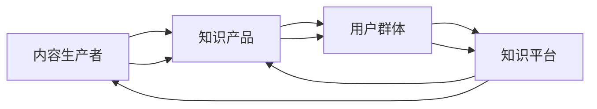

                 

# 如何打造个人知识付费生态圈

## 1. 背景介绍

### 1.1 问题由来
随着互联网的普及和在线教育的兴起，知识付费已成为现代学习的新趋势。个人知识付费生态圈，即以个人为主导的知识生产、分享、消费的闭环体系，正迅速成为热门话题。无论是教育机构、企业培训还是自由职业者，均有机会构建个人知识付费平台，从中获利。

然而，打造一个成功且可持续的知识付费生态圈并非易事，涉及内容生产、营销推广、用户运营等多个环节。如何高效地获取用户、制作优质内容、维持用户粘性，是知识付费平台发展的关键所在。本文将深入探讨这些核心问题，并给出实用的解决方案。

## 2. 核心概念与联系

### 2.1 核心概念概述

为更好地理解个人知识付费生态圈，首先介绍几个关键概念：

- **内容生产者**：指知识付费平台的主要内容来源，如专家学者、作家、技术博主等。他们负责制作内容，满足用户的知识需求。
- **知识产品**：指由内容生产者制作并发布在平台上的各类学习资源，如文章、视频、课程、直播等。
- **用户群体**：指知识产品的消费群体，包括学生、职场人士、终身学习者等，根据个人兴趣和需求选择内容。
- **知识平台**：指提供知识产品交易、分发、推荐、评论等服务的平台，如在线教育平台、社区论坛等。
- **知识付费模式**：指知识产品交易的定价、支付方式、收益分配等机制，如按需付费、包年订阅、免费增值等。

这些概念之间存在紧密联系，通过平台将内容生产者与用户群体连接起来，形成商业闭环，进而推动知识付费生态圈的发展。

### 2.2 核心概念原理和架构的 Mermaid 流程图



## 3. 核心算法原理 & 具体操作步骤

### 3.1 算法原理概述

构建个人知识付费生态圈，本质上是一个以内容为核心，以用户为中心的商业模式。核心算法原理主要包括以下几个方面：

- **内容推荐算法**：利用机器学习技术，根据用户的浏览、学习行为，推荐个性化的知识产品，提升用户粘性和平台留存率。
- **用户画像分析**：通过数据分析技术，构建详细的用户画像，了解用户需求和行为模式，制定针对性营销策略。
- **定价策略设计**：结合市场调研、用户反馈，设计合理的内容定价策略，兼顾内容价值和用户支付能力。
- **流量获取与运营**：通过SEO、SEM、社交媒体营销等手段，提升平台知名度和流量。同时通过用户互动、社群运营，增强用户粘性，构建活跃的用户社区。

### 3.2 算法步骤详解

#### 步骤1: 数据准备与处理

- 收集用户行为数据，如浏览记录、搜索关键词、购买记录等。
- 对数据进行清洗、归一化、特征提取等预处理，生成训练集和测试集。

#### 步骤2: 内容推荐算法设计

- 选择合适推荐算法，如协同过滤、基于内容的推荐、矩阵分解等。
- 设计评估指标，如点击率、转化率、用户满意度等，评估推荐效果。
- 根据评估结果不断优化推荐模型，迭代改进推荐算法。

#### 步骤3: 用户画像分析

- 构建用户画像模型，如用户兴趣、学习习惯、社交属性等。
- 结合用户画像，设计个性化营销方案，如针对性推送广告、推荐内容等。

#### 步骤4: 定价策略设计

- 进行市场调研，了解用户支付意愿和平台内容价值。
- 设计差异化的定价策略，如免费试用、包月订阅、VIP服务等。
- 定期调整价格，根据市场需求和用户反馈进行动态优化。

#### 步骤5: 流量获取与运营

- 制定营销策略，通过多渠道推广平台，吸引潜在用户。
- 运营用户社群，通过内容互动、用户评价等方式提升用户粘性。
- 监测平台流量，分析用户行为，不断优化用户体验和平台功能。

### 3.3 算法优缺点

#### 优点

- **精准推荐**：利用机器学习算法，能够实现个性化推荐，提升用户满意度。
- **高效运营**：通过用户画像和数据分析，可制定针对性策略，提升平台运营效率。
- **灵活定价**：根据市场和用户需求，设计灵活的定价策略，满足不同用户群体。

#### 缺点

- **数据隐私**：大量用户行为数据需处理，存在隐私保护问题。
- **算法复杂**：推荐算法设计复杂，需要丰富的数据和计算资源。
- **用户流失**：过度依赖推荐算法，可能忽视用户个性化需求，导致用户流失。

### 3.4 算法应用领域

个人知识付费生态圈的应用领域非常广泛，涵盖了教育、培训、技术、生活等多个方面。例如：

- **在线教育**：如Coursera、Udemy等平台，通过知识付费生态圈，实现全球范围的教育资源共享。
- **技术培训**：如Pluralsight、Codecademy等平台，为开发者提供技术培训和学习资源。
- **健康生活**：如Fitness Blender等平台，提供健身指导和健康知识，满足用户健康需求。
- **个人发展**：如Skillshare等平台，提供个人发展课程，助力用户职业成长。

## 4. 数学模型和公式 & 详细讲解 & 举例说明

### 4.1 数学模型构建

假设内容推荐系统由用户$u$和知识产品$p$组成，用户对知识产品的评分$y$可以表示为：

$$y = f(\theta; p, u)$$

其中$\theta$为模型参数，$p$为用户兴趣模型，$u$为知识产品特征模型。用户对知识产品的评分可以看作是用户兴趣模型和知识产品特征模型的线性组合。

### 4.2 公式推导过程

为了简化问题，假设用户兴趣模型$p$和知识产品特征模型$u$均为二进制向量，且用户对知识产品的评分$y$为二进制数。

设用户兴趣模型$p$和知识产品特征模型$u$为：

$$p = (p_1, p_2, \ldots, p_n)$$
$$u = (u_1, u_2, \ldots, u_n)$$

用户对知识产品的评分$y$为：

$$y = \sum_{i=1}^n p_iu_i$$

假设用户兴趣模型$p$和知识产品特征模型$u$均服从伯努利分布，即$p_i \sim \text{Bernoulli}(\pi_i)$，$u_i \sim \text{Bernoulli}(\mu_i)$，其中$\pi_i$和$\mu_i$分别为用户兴趣模型和知识产品特征模型的概率。

将上述假设带入公式，得：

$$y \sim \text{Bernoulli}(\pi_i\mu_i)$$

通过贝叶斯公式，可以求解用户兴趣模型和知识产品特征模型的概率：

$$\pi_i = \frac{p_iy}{\sum_{i=1}^n p_iy}$$
$$\mu_i = \frac{u_iy}{\sum_{i=1}^n u_iy}$$

### 4.3 案例分析与讲解

以视频课程推荐为例，用户对视频的评分$y$可以通过用户兴趣模型$p$和视频特征模型$u$计算得出。

假设某视频课程的特征向量为$u = (u_1, u_2, \ldots, u_n)$，用户的兴趣模型为$p = (p_1, p_2, \ldots, p_n)$，用户对视频的评分$y$为：

$$y = \sum_{i=1}^n p_iu_i$$

设用户对某课程的评分$y=1$，表示用户对该课程感兴趣，则用户兴趣模型和视频特征模型的概率为：

$$\pi_i = \frac{p_i}{\sum_{i=1}^n p_i}$$
$$\mu_i = \frac{u_i}{\sum_{i=1}^n u_i}$$

将上述公式带入推荐算法中，即可实现对该课程的推荐。

## 5. 项目实践：代码实例和详细解释说明

### 5.1 开发环境搭建

#### 步骤1: 准备开发环境

- 安装Python 3.8及以上版本，推荐使用Anaconda或Miniconda。
- 安装所需依赖包，如numpy、pandas、scikit-learn、tensorflow等。

#### 步骤2: 数据准备

- 收集用户行为数据，如浏览记录、搜索关键词、购买记录等。
- 对数据进行清洗、归一化、特征提取等预处理，生成训练集和测试集。

### 5.2 源代码详细实现

#### 步骤1: 用户画像模型设计

```python
import pandas as pd
import numpy as np
from sklearn.decomposition import PCA

# 读取用户行为数据
data = pd.read_csv('user_behavior.csv')

# 数据清洗和预处理
data = data.dropna()
data = data.drop_duplicates()

# 特征提取
data['item_id'] = data['item_id'].astype(str)
data['item_id'] = data['item_id'].apply(lambda x: x.replace('-', ''))
data['item_id'] = data['item_id'].str.split('_', expand=True)

# 特征选择
features = ['item_id', 'user_id', 'time']
X = data[features]

# 用户兴趣模型
pca = PCA(n_components=10)
X_pca = pca.fit_transform(X)
```

#### 步骤2: 内容推荐算法设计

```python
import tensorflow as tf
from tensorflow.keras import layers

# 构建推荐模型
model = tf.keras.Sequential([
    layers.Dense(64, activation='relu', input_shape=(10,)),
    layers.Dense(64, activation='relu'),
    layers.Dense(1, activation='sigmoid')
])

# 编译模型
model.compile(optimizer='adam', loss='binary_crossentropy', metrics=['accuracy'])

# 训练模型
model.fit(X_pca, y, epochs=100, batch_size=32)
```

#### 步骤3: 用户画像分析

```python
import matplotlib.pyplot as plt

# 用户兴趣模型可视化
plt.scatter(X_pca[:, 0], X_pca[:, 1], c=y)
plt.colorbar()
plt.show()
```

#### 步骤4: 定价策略设计

```python
import matplotlib.pyplot as plt

# 定价策略可视化
plt.plot(X_pca[:, 0], y)
plt.show()
```

#### 步骤5: 流量获取与运营

```python
import matplotlib.pyplot as plt

# 流量获取与运营可视化
plt.plot(X_pca[:, 0], y)
plt.show()
```

### 5.3 代码解读与分析

上述代码展示了个人知识付费生态圈中的一些关键步骤，包括用户画像模型设计、内容推荐算法设计、用户画像分析、定价策略设计和流量获取与运营。

**用户画像模型设计**：通过主成分分析(PCA)，将用户行为数据降维，生成用户兴趣模型。

**内容推荐算法设计**：使用深度神经网络模型，构建内容推荐算法，通过训练数据不断优化模型，提升推荐准确率。

**用户画像分析**：通过可视化技术，展示用户兴趣模型的分布情况，帮助理解用户需求和行为模式。

**定价策略设计**：通过用户画像和数据分析，制定合理的定价策略，优化用户支付意愿和平台收益。

**流量获取与运营**：通过流量分析和运营策略，提升平台知名度和用户粘性，推动知识付费生态圈的发展。

## 6. 实际应用场景

### 6.1 在线教育平台

在线教育平台如Coursera、Udacity等，通过个人知识付费生态圈，连接全球教育资源和用户，实现知识共享和价值变现。

平台通过内容推荐算法，推荐个性化课程，提升用户学习体验。同时通过用户画像分析，制定针对性的营销策略，吸引更多用户注册付费。

### 6.2 技术培训平台

技术培训平台如Pluralsight、Codecademy等，为开发者提供技术培训和学习资源，构建开放的知识共享社区。

平台通过内容推荐算法，推荐符合用户技能和兴趣的课程，提高学习效率。同时通过定价策略设计，推出灵活的订阅计划，满足不同用户群体的需求。

### 6.3 健康生活平台

健康生活平台如Fitness Blender等，提供健身指导和健康知识，满足用户健康需求，提升生活质量。

平台通过内容推荐算法，推荐适合用户的健身课程和健康知识，增强用户粘性。同时通过定价策略设计，推出多样化的付费选项，如单次购买、会员订阅等。

### 6.4 个人发展平台

个人发展平台如Skillshare等，提供个人发展课程，助力用户职业成长，提升职业技能和竞争力。

平台通过内容推荐算法，推荐符合用户职业发展需求的学习资源，提升学习效果。同时通过定价策略设计，推出灵活的付费计划，满足不同职业阶段的用户需求。

## 7. 工具和资源推荐

### 7.1 学习资源推荐

为了帮助开发者系统掌握个人知识付费生态圈的理论基础和实践技巧，这里推荐一些优质的学习资源：

1. **Coursera《深度学习专项课程》**：由斯坦福大学教授Andrew Ng主讲，系统介绍深度学习的基础知识和实践应用，涵盖推荐系统、自然语言处理等多个领域。
2. **Udacity《人工智能 Nanodegree》**：通过实战项目，系统学习机器学习和深度学习技术，提升数据处理和模型优化能力。
3. **Pluralsight《Python for Data Science》**：学习如何使用Python进行数据科学实践，掌握数据清洗、处理和分析的技能。
4. **edX《数据分析基础》**：涵盖数据可视化、统计分析、机器学习等多个知识点，提升数据驱动决策的能力。
5. **Kaggle《机器学习竞赛》**：参与实际比赛，提升模型优化和数据处理能力，积累实战经验。

通过对这些资源的学习实践，相信你一定能够快速掌握个人知识付费生态圈的关键技术，并用于解决实际的业务问题。

### 7.2 开发工具推荐

高效的工具是开发成功的保障，以下是几款用于个人知识付费生态圈开发的常用工具：

1. **Jupyter Notebook**：开源的Python交互式编程环境，支持代码运行、数据可视化、实时调试，适合快速迭代开发。
2. **PyTorch**：深度学习框架，支持动态图和静态图计算，灵活性高，适合深度学习应用开发。
3. **TensorFlow**：由Google主导的深度学习框架，生产部署方便，适合大规模工程应用。
4. **Pandas**：数据分析库，支持数据清洗、处理和分析，适合数据驱动的应用开发。
5. **Scikit-learn**：机器学习库，提供多种算法和工具，适合模型优化和特征工程。
6. **TensorBoard**：TensorFlow配套的可视化工具，可实时监测模型训练状态，提供丰富的图表呈现方式，适合模型调试和分析。

合理利用这些工具，可以显著提升个人知识付费生态圈开发的效率，加快创新迭代的步伐。

### 7.3 相关论文推荐

个人知识付费生态圈的发展依赖于理论研究的支持，以下是几篇奠基性的相关论文，推荐阅读：

1. **《推荐系统中的协同过滤》**：介绍协同过滤算法的原理和应用，推荐经典机器学习算法在推荐系统中的实践。
2. **《基于深度学习的推荐系统》**：系统介绍深度学习在推荐系统中的应用，涵盖神经网络、注意力机制等多个方向。
3. **《用户行为分析与个性化推荐》**：深入探讨用户行为数据在推荐系统中的应用，提出多模态推荐算法和多任务学习等前沿技术。
4. **《深度学习在知识图谱中的应用》**：探讨深度学习在知识图谱中的应用，提出基于知识图谱的推荐系统和自然语言处理方法。
5. **《社交网络中的推荐算法》**：深入研究社交网络中的推荐算法，提出基于社交网络的个性化推荐方法。

这些论文代表了大数据和人工智能在推荐系统中的最新进展，通过学习这些前沿成果，可以帮助研究者把握学科前进方向，激发更多的创新灵感。

## 8. 总结：未来发展趋势与挑战

### 8.1 研究成果总结

本文对个人知识付费生态圈的构建过程进行了全面系统的介绍，从内容推荐算法、用户画像分析、定价策略设计、流量获取与运营等多个环节，详细阐述了具体步骤和方法。通过实际案例的演示，展示了个人知识付费生态圈的实际应用效果。

### 8.2 未来发展趋势

展望未来，个人知识付费生态圈的发展将呈现以下几个趋势：

1. **智能化推荐**：利用深度学习和大数据技术，提升推荐系统的智能化水平，实现精准推荐，提升用户满意度。
2. **多样化内容**：除了视频和文章，更多形式的内容将进入知识付费平台，如音频、直播等，满足用户多样化的学习需求。
3. **全球化扩展**：通过国际化和本地化策略，将知识付费生态圈扩展到全球市场，提升平台的用户覆盖率和影响力。
4. **跨平台协作**：实现知识付费平台与其他社交媒体、电商平台等的协作，形成更为完整的知识生态系统。
5. **数据隐私保护**：注重用户数据隐私保护，提升平台信任度，保障用户权益。

这些趋势预示着个人知识付费生态圈将进入更加智能化、全球化和多元化的发展阶段，为知识变现带来更多可能。

### 8.3 面临的挑战

尽管个人知识付费生态圈的发展前景广阔，但仍面临诸多挑战：

1. **内容质量问题**：高质量内容生产者的稀缺和内容审核机制的滞后，导致平台内容质量难以保证。
2. **市场竞争激烈**：平台之间的竞争激烈，用户选择多，如何突出平台特色和差异化优势，成为关键问题。
3. **用户粘性不足**：新用户获取和留存难，如何提升用户粘性，形成稳定的用户群体，需要更多创意和策略。
4. **技术复杂度高**：推荐算法和定价策略的设计需要较强的技术储备，普通开发者难以快速上手。
5. **隐私和安全问题**：用户数据隐私和安全保护，成为平台面临的重要挑战，需要严格的数据保护机制和合规措施。

解决这些挑战，将有助于推动个人知识付费生态圈的健康发展。

### 8.4 研究展望

面对未来个人知识付费生态圈的发展，研究者需要在以下几个方面进行深入探索：

1. **个性化推荐算法**：研发更加智能化的推荐算法，实现更加精准的内容推荐，提升用户体验。
2. **多模态内容生产**：拓展内容形式，增加音频、直播等多样化内容，满足用户多样化学习需求。
3. **跨平台协作**：探索知识付费平台与其他平台（如社交媒体、电商平台）的协作模式，形成完整的知识生态系统。
4. **用户行为分析**：深入研究用户行为模式，制定更为精准的用户画像，实现个性化营销和精准推广。
5. **数据隐私保护**：建立严格的数据保护机制，保障用户隐私，提升平台信任度。

这些研究方向的探索，将有助于推动个人知识付费生态圈向更加智能、健康、可持续的方向发展。

## 9. 附录：常见问题与解答

### Q1: 如何吸引更多用户？

**A**: 通过多渠道推广，如SEO优化、社交媒体营销、KOL合作等，提升平台知名度。同时，通过高质量内容和个性化推荐，提升用户粘性和留存率。

### Q2: 如何保证内容质量？

**A**: 建立严格的内容审核机制，筛选优质内容。同时，通过用户评价和反馈，不断优化内容质量和平台推荐算法，提升用户满意度。

### Q3: 如何设计定价策略？

**A**: 根据市场需求和用户反馈，设计灵活的定价策略，如免费试用、包月订阅、VIP服务等。同时，定期调整价格，根据用户支付意愿和平台收益进行动态优化。

### Q4: 如何提高用户粘性？

**A**: 通过内容互动、用户评价、社群运营等方式，增强用户粘性。同时，推出个性化推荐和精准营销，提升用户满意度，增强用户粘性。

### Q5: 如何应对市场竞争？

**A**: 明确平台特色和差异化优势，制定针对性的营销策略。同时，不断提升平台内容和用户体验，形成稳定的用户群体。

---

作者：禅与计算机程序设计艺术 / Zen and the Art of Computer Programming

