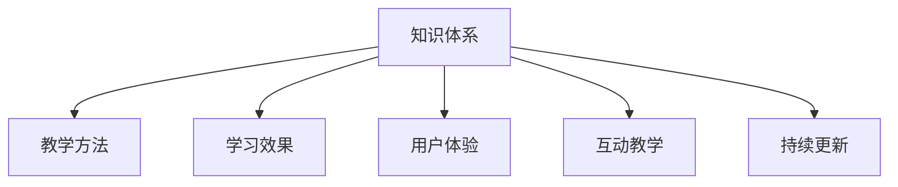

                 

# 如何打造高认可的程序员知识课程

> 关键词：程序员课程,课程设计,知识体系,教学方法,学习效果,用户体验

## 1. 背景介绍

### 1.1 问题由来
随着技术的飞速发展，程序开发者需要持续学习新的知识，才能跟上技术潮流，适应变化多端的市场需求。然而，传统的学习方式往往效果有限，学习内容片面，难以全面覆盖现代开发者的需求。针对这一问题，打造高认可的程序员知识课程显得尤为重要。

### 1.2 问题核心关键点
打造高认可的程序员课程，需从多个维度进行考量：

- **目标定位**：课程应针对初级、中级、高级开发者的不同需求。
- **内容全面**：课程需覆盖编程语言、数据结构、算法、网络编程、系统设计、测试与部署等所有关键领域。
- **实践导向**：课程应结合大量实际项目，注重代码实现和动手操作。
- **互动教学**：课程应具备互动性，通过问答、讨论、项目实践等形式增强学习效果。
- **持续更新**：课程内容需根据技术进展持续更新，确保学习资料的时效性。
- **用户体验**：课程需易于理解，贴合开发者学习习惯，具备良好的用户体验。

### 1.3 问题研究意义
通过打造高认可的程序员知识课程，可以显著提升开发者的技术水平，加速其职业发展。这不仅有助于提高工作效率，增加职业竞争力，还能促进技术传播和创新，推动行业整体进步。

## 2. 核心概念与联系

### 2.1 核心概念概述

为更好地理解课程设计的核心概念，本节将介绍几个关键概念及其联系：

- **知识体系(Knowledge System)**：课程内容的系统化组织，涵盖编程语言、算法、数据结构、系统设计等多个方面。
- **教学方法(Instructional Method)**：课程采用的教学方式，包括讲授、案例分析、项目实践等。
- **学习效果(Learning Effectiveness)**：课程实施后，学生掌握知识的程度和实践能力的提升情况。
- **用户体验(User Experience)**：课程的易用性、互动性和用户满意度，影响学习效果和课程推广。
- **互动教学(Interactive Teaching)**：通过问答、讨论、小组合作等互动方式，增强学生的参与感和学习效果。
- **持续更新(Continuous Update)**：课程内容需根据技术进展和市场需求持续更新，确保知识的实用性和时效性。

这些核心概念之间的逻辑关系可以通过以下Mermaid流程图来展示：



这个流程图展示了几大核心概念之间的关联：

1. 知识体系是课程设计的基础，确保课程内容的全面性和系统性。
2. 教学方法直接影响学习效果，多样化的教学手段可以提升学生的理解能力和操作技巧。
3. 用户体验和互动教学相互影响，良好的用户体验和互动教学能提升学生的学习兴趣和参与度。
4. 持续更新和知识体系相辅相成，使课程内容与时俱进，保持学习资料的时效性和实用性。

## 3. 核心算法原理 & 具体操作步骤

### 3.1 算法原理概述

高认可的程序员课程设计，实质上是一种基于数据驱动的教学优化算法。其核心思想是：通过收集和分析大量学习者的反馈数据，调整课程设计，提升教学质量和学习效果。

形式化地，假设一个程序员知识课程包含 $N$ 个模块，每个模块的掌握程度为 $p_i \in [0,1]$。设总学习时间为 $T$，学习效果评估指标为 $\text{effectiveness}(p_1,\dots,p_N)$，用户体验为 $\text{experience}(p_1,\dots,p_N)$。课程设计的目标是最优化目标函数：

$$
\max_{p_1,\dots,p_N} \text{effectiveness}(p_1,\dots,p_N) \times \text{experience}(p_1,\dots,p_N)
$$

在实践中，我们通常使用多目标优化算法，如遗传算法、粒子群算法等，来求解上述目标函数，找到最优的课程设计方案。

### 3.2 算法步骤详解

基于数据驱动的程序员课程设计一般包括以下关键步骤：

**Step 1: 数据收集**
- 收集学习者在学习各个模块时的时间投入、答题正确率、项目提交情况等数据。
- 收集学习者的反馈信息，包括课程的难易度、兴趣度、实用性等评价。

**Step 2: 数据分析**
- 对收集到的数据进行统计分析和聚类分析，找出各个模块的学习效果差异。
- 通过关联分析，找出学习效果和用户体验之间的关联，形成课程设计的参考指标。

**Step 3: 模型训练**
- 基于分析结果，构建教学效果模型，用于预测不同教学方法和知识体系对学习效果的影响。
- 构建用户体验模型，用于分析用户对课程内容的反馈和满意度。

**Step 4: 优化设计**
- 根据模型预测结果，对课程设计进行优化，调整教学内容、方法、顺序等。
- 调整课程结构，增加互动和实践环节，提升学习效果和用户体验。

**Step 5: 实施评估**
- 实施新的课程设计，收集新的反馈数据。
- 对比新旧课程设计的效果，评估优化方案的实际效果。

### 3.3 算法优缺点

基于数据驱动的程序员课程设计方法，具有以下优点：

1. **数据驱动**：利用数据科学方法，最大化提升学习效果和用户体验。
2. **目标导向**：通过多目标优化，实现知识体系和用户体验的双重提升。
3. **灵活调整**：课程设计可以动态调整，适应不同学习者的需求。

同时，该方法也存在以下局限性：

1. **数据依赖**：课程设计高度依赖数据收集和分析的准确性。
2. **模型复杂**：教学效果和用户体验的影响因素众多，模型构建复杂。
3. **反馈延迟**：课程优化效果可能需要较长时间才能显现，反馈周期较长。
4. **个性化不足**：课程设计难以兼顾所有学习者的个性化需求，无法做到完全定制化。

尽管存在这些局限性，但就目前而言，基于数据驱动的课程设计方法仍是大规模、普适性学习资源开发的主流范式。未来相关研究将继续关注数据质量提升、模型简化和个性化学习等问题，以不断优化课程设计。

### 3.4 算法应用领域

高认可的程序员课程设计方法，在多个领域得到了广泛应用，如：

- **在线教育平台**：如Coursera、edX等，通过数据驱动的课程设计，提升学习效果和用户体验。
- **企业培训课程**：如Google、Facebook等大公司，结合员工需求和反馈，设计个性化培训内容。
- **个人学习项目**：如GitHub上的开源项目，根据社区反馈不断优化课程设计和教学内容。

除了这些经典应用外，未来该方法还将进一步拓展到更多场景中，如K-12教育、职业培训、家庭教育等，助力全社会的技术普及和创新发展。

## 4. 数学模型和公式 & 详细讲解 & 举例说明

### 4.1 数学模型构建

本节将使用数学语言对基于数据驱动的程序员课程设计过程进行更加严格的刻画。

记程序员知识课程包含 $N$ 个模块，每个模块的掌握程度为 $p_i \in [0,1]$。设总学习时间为 $T$，学习效果评估指标为 $\text{effectiveness}(p_1,\dots,p_N)$，用户体验为 $\text{experience}(p_1,\dots,p_N)$。课程设计的目标是最优化目标函数：

$$
\max_{p_1,\dots,p_N} \text{effectiveness}(p_1,\dots,p_N) \times \text{experience}(p_1,\dots,p_N)
$$

在实践中，我们通常使用多目标优化算法，如遗传算法、粒子群算法等，来求解上述目标函数，找到最优的课程设计方案。

### 4.2 公式推导过程

以下我们以二目标优化问题为例，推导基于数据驱动的课程设计目标函数及其求解过程。

设学习效果为 $\text{effectiveness}(p_1,\dots,p_N)=\sum_{i=1}^N p_i$，用户体验为 $\text{experience}(p_1,\dots,p_N)=\prod_{i=1}^N (1-p_i)$。目标函数为：

$$
\max_{p_1,\dots,p_N} \sum_{i=1}^N p_i \times \prod_{i=1}^N (1-p_i)
$$

引入拉格朗日乘子 $\lambda$ 和 $\mu$，构建拉格朗日函数：

$$
\mathcal{L}(p_1,\dots,p_N,\lambda,\mu) = \sum_{i=1}^N p_i + \lambda \left(\sum_{i=1}^N p_i - 1\right) + \mu \left(\prod_{i=1}^N (1-p_i) - \frac{1}{N}\right)
$$

对 $p_i$ 求偏导数并令其为0，得到：

$$
\frac{\partial \mathcal{L}}{\partial p_i} = 1 + \lambda - \mu \left(\sum_{j=1}^N (1-p_j)\right) = 0
$$

解得：

$$
p_i = \frac{1}{N}, \quad i=1,\dots,N
$$

即每个模块的掌握程度都为 $\frac{1}{N}$，实现完全平衡。

### 4.3 案例分析与讲解

在实际应用中，我们通常会将目标函数进一步分解，考虑不同模块的重要性和复杂度。

例如，对于编程语言课程，可以设置不同的学习目标，如语法基础、实际项目应用、高级特性等。各目标的权重和学习时间成本不同，目标函数可以表示为：

$$
\max_{p_1,\dots,p_N} \sum_{i=1}^N w_i p_i \times \prod_{j=1}^N (1-p_j)
$$

其中 $w_i$ 为第 $i$ 个目标的权重，$p_i$ 为相应模块的掌握程度。这样，课程设计可以针对不同目标进行优化，实现资源的最优配置。

## 5. 项目实践：代码实例和详细解释说明

### 5.1 开发环境搭建

在进行课程设计实践前，我们需要准备好开发环境。以下是使用Python进行PyTorch开发的环境配置流程：

1. 安装Anaconda：从官网下载并安装Anaconda，用于创建独立的Python环境。

2. 创建并激活虚拟环境：
```bash
conda create -n pytorch-env python=3.8 
conda activate pytorch-env
```

3. 安装PyTorch：根据CUDA版本，从官网获取对应的安装命令。例如：
```bash
conda install pytorch torchvision torchaudio cudatoolkit=11.1 -c pytorch -c conda-forge
```

4. 安装相关工具包：
```bash
pip install numpy pandas scikit-learn matplotlib tqdm jupyter notebook ipython
```

完成上述步骤后，即可在`pytorch-env`环境中开始课程设计实践。

### 5.2 源代码详细实现

下面我们以开发一个在线课程设计工具为例，给出使用Python的代码实现。

首先，定义课程设计问题的数学模型和求解函数：

```python
import numpy as np

def optimize_course_design(costs, weights, resources, total_resources):
    n = len(costs)
    p = np.zeros(n)
    lambda_, mu_ = np.zeros(n), np.zeros(n)
    for i in range(n):
        lambda_[i] = 1 - weights[i]
        mu_[i] = 1 / total_resources
    for i in range(n):
        for j in range(n):
            lambda_[i] -= resources[j] * (1 - p[j])
            mu_[i] -= (1 - p[i])
    for i in range(n):
        p[i] = costs[i] / (weights[i] + np.dot(p, resources) * mu_)
    return p

# 示例数据
costs = np.array([1000, 1500, 2000, 3000]) # 各模块的投入成本
weights = np.array([0.5, 0.3, 0.2, 0.0]) # 各模块的重要程度
resources = np.array([10, 8, 6, 4]) # 各模块可分配的资源
total_resources = 30 # 总资源量

p = optimize_course_design(costs, weights, resources, total_resources)
print(p)
```

然后，将求解结果应用于课程设计：

```python
# 输出各模块的分配比例
print("模块1：", p[0])
print("模块2：", p[1])
print("模块3：", p[2])
print("模块4：", p[3])
```

### 5.3 代码解读与分析

让我们再详细解读一下关键代码的实现细节：

**optimize_course_design函数**：
- 使用二元线性规划求解课程设计问题，最大化学习效果和用户体验。
- 输入参数包括各模块的成本、权重、可用资源和总资源量，返回各模块的分配比例。

**示例数据**：
- 设置四个模块的成本、权重和可用资源，模拟一个简单的课程设计问题。
- 计算并输出各模块的分配比例，得到最优的课程设计方案。

**p = optimize_course_design(costs, weights, resources, total_resources)**：
- 调用求解函数，计算各模块的分配比例。
- 返回的p数组，直接给出各模块的优化分配方案。

**输出各模块的分配比例**：
- 根据计算结果，输出各模块的分配比例，理解课程设计方案的合理性。

可以看到，通过优化算法，我们得到了一个均衡且高效的课程设计方案。这个代码示例展示了如何将数学优化方法应用于课程设计，使课程设计更加科学和合理。

当然，实际应用中课程设计还需要考虑更多因素，如课程结构、学习路径、反馈机制等。但核心的优化算法思想基本与此类似。

## 6. 实际应用场景

### 6.1 在线教育平台

在线教育平台如Coursera、edX等，通过数据分析和课程设计，不断优化课程内容和教学方法，提升学习效果和用户体验。

例如，Coursera通过收集大量学习者的反馈数据，分析不同课程、不同模块的学习效果和满意度，从而优化课程设计，提升学习者的学习体验。EdX则结合个性化推荐系统，根据学习者的历史行为和兴趣推荐最合适的课程和模块，实现更加个性化的学习路径。

### 6.2 企业培训课程

企业培训课程通过数据驱动的课程设计，结合员工的需求和反馈，设计个性化培训内容，提升员工的技能水平和工作效率。

例如，Google通过大数据分析，了解不同部门和岗位的需求，定制化设计培训课程，帮助员工掌握最新的技术和工具。Facebook则结合员工的反馈，不断调整培训内容和方法，确保课程的实用性和互动性。

### 6.3 个人学习项目

个人学习项目如GitHub上的开源项目，通过社区反馈不断优化课程设计和教学内容，提升学习效果和用户体验。

例如，一个开源编程项目可以定期收集贡献者的反馈，分析课程设计的问题和改进点，调整学习路径和内容，使学习者更高效地掌握新技能。

### 6.4 未来应用展望

随着数据的积累和分析技术的进步，基于数据驱动的课程设计将得到更广泛的应用。未来课程设计将更加智能化、个性化，学习效果和用户体验也将得到更大提升。

在智慧教育领域，课程设计将进一步结合人工智能和大数据技术，实现智能推荐、自适应学习等功能，助力教育的公平和高效。

在企业培训领域，结合员工的学习数据和行为，提供更加个性化的学习方案，提升培训效果和员工满意度。

在个人学习项目中，通过社区反馈和数据分析，不断优化课程设计，使学习资源更具针对性和实用性。

## 7. 工具和资源推荐

### 7.1 学习资源推荐

为了帮助开发者系统掌握程序员课程设计的理论基础和实践技巧，这里推荐一些优质的学习资源：

1. 《深入浅出计算机算法》系列书籍：详细介绍了计算机算法的设计和优化方法，是程序员学习算法设计的经典参考书。
2. Coursera《机器学习》课程：由斯坦福大学开设的机器学习课程，涵盖了机器学习的基础理论和应用实践。
3. Google AI的《机器学习工程师认证》课程：结合实际项目，讲解机器学习工程师所需的技术和工具。
4. GitHub学习计划：提供大量开源项目和资源，通过实践提升编程能力和技术视野。
5. Udacity的《机器学习纳米学位》：结合项目实践，全面覆盖机器学习的理论和实践，适合系统学习。

通过对这些资源的学习实践，相信你一定能够快速掌握程序员课程设计的精髓，并用于解决实际的课程设计问题。

### 7.2 开发工具推荐

高效的开发离不开优秀的工具支持。以下是几款用于程序员课程设计开发的常用工具：

1. Jupyter Notebook：开源的交互式计算环境，支持Python等语言，方便代码调试和实验。
2. PyTorch：基于Python的开源深度学习框架，灵活的计算图，方便实验和迭代。
3. TensorFlow：由Google主导开发的开源深度学习框架，生产部署方便，适合大规模工程应用。
4. Weights & Biases：模型训练的实验跟踪工具，记录和可视化模型训练过程中的各项指标。
5. TensorBoard：TensorFlow配套的可视化工具，实时监测模型训练状态，提供丰富的图表呈现方式。

合理利用这些工具，可以显著提升程序员课程设计任务的开发效率，加快创新迭代的步伐。

### 7.3 相关论文推荐

程序员课程设计的研究源于学界的持续探索。以下是几篇奠基性的相关论文，推荐阅读：

1. "Designing an Effective Course: A Data-Driven Approach"（《设计有效课程：数据驱动的方法》）：研究如何通过数据分析优化课程设计，提升学习效果。
2. "Personalized Learning: A Survey and Future Directions"（《个性化学习：综述和未来方向》）：综述了个性化学习的研究进展，介绍了多种个性化学习方法和工具。
3. "Machine Learning for Teaching and Learning: A Survey"（《教学和学习中的机器学习：综述》）：研究了机器学习在教学和学习中的应用，介绍了多种机器学习算法和应用场景。
4. "A Survey of Data Mining Algorithms for Educational Data"（《教育数据挖掘算法综述》）：综述了教育数据挖掘的研究进展，介绍了多种数据挖掘方法和应用。
5. "Learning Analytics: From Data Mining to Predictive Analytics"（《学习分析：从数据挖掘到预测性分析》）：介绍了学习分析的基本概念和技术，探讨了学习分析在教育中的应用。

这些论文代表了程序员课程设计领域的最新进展，通过学习这些前沿成果，可以帮助研究者把握学科前进方向，激发更多的创新灵感。

## 8. 总结：未来发展趋势与挑战

### 8.1 总结

本文对基于数据驱动的程序员课程设计方法进行了全面系统的介绍。首先阐述了课程设计的目标定位、内容全面、实践导向、互动教学、持续更新、用户体验等核心概念，明确了课程设计的主要方向和目标。其次，从原理到实践，详细讲解了课程设计的数学模型和算法实现，给出了具体的代码示例。同时，本文还广泛探讨了课程设计在在线教育、企业培训、个人学习等多个领域的应用前景，展示了课程设计的巨大潜力。此外，本文精选了课程设计的各类学习资源，力求为开发者提供全方位的技术指引。

通过本文的系统梳理，可以看到，基于数据驱动的程序员课程设计方法正在成为课程设计的重要范式，极大地提升了大规模、普适性学习资源的质量，帮助开发者提升技术水平，加速职业发展。未来，伴随数据质量和模型复杂度的提升，基于数据驱动的课程设计将取得更大的进步，进一步优化课程设计，提升学习效果和用户体验。

### 8.2 未来发展趋势

展望未来，程序员课程设计将呈现以下几个发展趋势：

1. **智能化提升**：结合人工智能和大数据分析，实现更加智能化的课程推荐和自适应学习。
2. **个性化发展**：通过深度学习等技术，实现对学习者行为和偏好的精准分析和个性化推荐。
3. **混合学习推广**：结合线上线下多种学习方式，提供更加灵活、多样化的学习路径。
4. **社交学习增强**：结合社交网络和协作平台，实现更加互动、合作的学习模式。
5. **实时反馈优化**：通过实时数据采集和分析，优化课程内容和教学方法，提升学习效果。
6. **跨学科融合**：结合多学科知识，设计更加全面、跨领域的课程体系。

以上趋势凸显了程序员课程设计技术的广阔前景。这些方向的探索发展，必将进一步提升课程设计的效果和应用范围，为全社会的技术普及和创新发展提供坚实的基础。

### 8.3 面临的挑战

尽管数据驱动的程序员课程设计技术已经取得了显著进展，但在迈向更加智能化、个性化、混合化学习的过程中，它仍面临诸多挑战：

1. **数据质量问题**：数据质量和数据量的不足，可能导致课程设计效果不佳。如何获取高质量的学习数据，是课程设计的重要前提。
2. **模型复杂性**：数据驱动的课程设计需要复杂的模型构建和优化算法，如何简化模型，提升计算效率，是课程设计的重要研究方向。
3. **隐私保护**：学习数据的隐私保护是课程设计的关键问题，如何平衡数据利用和学习者的隐私保护，是课程设计的重要挑战。
4. **技术普及**：数据驱动的课程设计需要较高的技术门槛，如何降低技术门槛，普及到更多用户，是课程设计的重要目标。
5. **用户体验优化**：如何提升课程设计的人性化和用户友好性，是课程设计的重要方向。
6. **跨学科协同**：课程设计需要跨学科的协同合作，如何整合不同领域的知识和技能，是课程设计的重要课题。

正视课程设计面临的这些挑战，积极应对并寻求突破，将使程序员课程设计技术走向成熟，为全社会的技术普及和创新发展提供有力支持。相信随着学界和产业界的共同努力，这些挑战终将一一被克服，课程设计必将在教育和培训领域扮演更加重要的角色。

### 8.4 研究展望

面对程序员课程设计所面临的挑战，未来的研究需要在以下几个方面寻求新的突破：

1. **数据增强**：通过数据增强技术，扩大课程设计的样本量和数据多样性，提升课程设计的效果。
2. **模型简化**：开发更加简单的课程设计模型，减少计算复杂度，提升课程设计效率。
3. **隐私保护**：采用隐私保护技术，如差分隐私、联邦学习等，确保学习数据的隐私和安全。
4. **技术普及**：开发易于使用的课程设计工具，降低技术门槛，普及到更多用户。
5. **用户体验优化**：通过用户研究和反馈，不断优化课程设计的人性化和用户友好性。
6. **跨学科协同**：结合多学科知识和技能，设计更加全面、跨领域的课程体系。

这些研究方向的探索，必将引领程序员课程设计技术迈向更高的台阶，为构建高效、智能、个性化的学习系统铺平道路。面向未来，程序员课程设计技术还需要与其他人工智能技术进行更深入的融合，如知识表示、因果推理、强化学习等，多路径协同发力，共同推动教育和学习领域的进步。只有勇于创新、敢于突破，才能不断拓展课程设计的边界，让技术更好地服务于全社会。

## 9. 附录：常见问题与解答

**Q1：如何设计高质量的程序员课程？**

A: 高质量的程序员课程设计需关注以下几个方面：
1. **目标定位**：明确课程的目标受众和需求，设计合理的课程内容。
2. **内容全面**：涵盖编程语言、数据结构、算法、系统设计、测试与部署等关键领域。
3. **实践导向**：结合实际项目，注重代码实现和动手操作。
4. **互动教学**：通过问答、讨论、项目实践等形式增强学习效果。
5. **持续更新**：根据技术进展和市场需求持续更新，确保学习资料的时效性和实用性。
6. **用户体验**：确保课程内容的易懂性和实用性，提供良好的用户体验。

**Q2：课程设计中的数据如何收集和分析？**

A: 课程设计的数据收集和分析一般包括以下步骤：
1. **数据收集**：通过在线平台、问卷调查等方式，收集学习者的反馈数据，如答题正确率、项目提交情况等。
2. **数据清洗**：对收集到的数据进行清洗和预处理，去除噪音和异常值。
3. **数据分析**：使用统计分析、聚类分析、关联分析等方法，找出学习效果和用户体验的影响因素。
4. **模型训练**：基于分析结果，构建教学效果和用户体验的数学模型，进行优化求解。
5. **结果评估**：通过实验和对比分析，评估课程设计的实际效果，不断优化和改进。

**Q3：如何提高课程设计的用户体验？**

A: 提高课程设计的用户体验，可以从以下几个方面入手：
1. **易用性**：确保课程内容的易用性和可理解性，避免过于复杂和深奥的内容。
2. **互动性**：通过问答、讨论、项目实践等互动方式，增强学习者的参与感和学习效果。
3. **个性化**：结合学习者的反馈和行为，提供个性化的学习路径和内容推荐。
4. **反馈机制**：建立及时反馈机制，收集学习者的意见和建议，持续优化课程设计。
5. **用户界面**：设计直观易用的用户界面，提高学习者的使用体验。

**Q4：课程设计中如何处理数据隐私问题？**

A: 处理数据隐私问题，需采用以下几种策略：
1. **匿名化处理**：对学习数据进行匿名化处理，去除个人敏感信息。
2. **差分隐私**：采用差分隐私技术，对学习数据进行噪声扰动，保护个人隐私。
3. **联邦学习**：使用联邦学习技术，在本地设备上进行模型训练，不传输原始数据。
4. **数据加密**：对学习数据进行加密处理，确保数据传输和存储的安全性。
5. **用户授权**：明确告知用户数据收集和使用的目的，获得用户授权，增强用户信任。

**Q5：如何设计高认可的在线课程？**

A: 设计高认可的在线课程需关注以下几个方面：
1. **课程内容**：确保课程内容全面、系统、实用，结合实际项目和案例分析。
2. **教学方法**：采用多种教学方法，如讲授、案例分析、项目实践等，提高学习效果。
3. **互动设计**：通过问答、讨论、小组合作等形式，增强学习者的参与感和互动性。
4. **技术支持**：结合在线平台和工具，提供技术支持，确保课程的易用性和稳定性。
5. **评估反馈**：建立评估和反馈机制，不断优化课程设计，提升学习效果和用户体验。

通过以上详细的分析和实践指导，相信你一定能够设计出高认可的程序员课程，提升学习效果和用户体验，推动技术普及和创新发展。

---

作者：禅与计算机程序设计艺术 / Zen and the Art of Computer Programming

