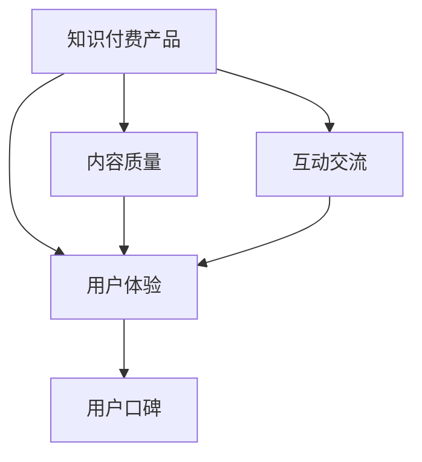
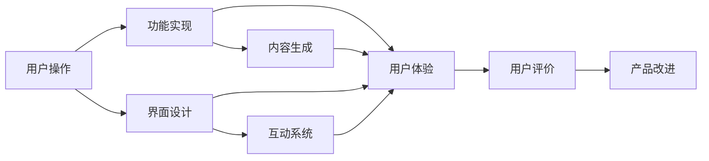

                 

## 1. 背景介绍

在互联网快速发展的今天，知识付费已经成为一种不可忽视的消费方式。越来越多的用户愿意为获取有价值的内容付费，这也为知识付费产品提供了广阔的市场。然而，尽管市场潜力巨大，但用户口碑却并不理想。用户对于知识付费产品的评价常常反映在产品体验、内容质量和互动交流等方面。如何提高知识付费产品的用户口碑，成为困扰从业者的重大问题。本文将详细探讨如何通过技术手段，提升知识付费产品的用户口碑。

## 2. 核心概念与联系

### 2.1 核心概念概述

为更好地理解如何提高知识付费产品的用户口碑，本节将介绍几个密切相关的核心概念：

- **知识付费产品(Knowledge-based Product)**：提供有价值知识或技能培训的服务产品，如在线课程、电子书、音频书籍等。
- **用户体验(User Experience, UX)**：用户在接触、使用产品过程中感受到的直观体验，包括易用性、功能完备性、稳定性等。
- **内容质量(Content Quality)**：知识付费产品的核心，主要体现在内容的深度、广度、权威性、时效性等方面。
- **互动交流(Interactive Communication)**：用户与产品之间的沟通交流，包括问答、讨论、反馈等。
- **用户口碑(User Reputation)**：用户基于自身使用产品体验形成的主观评价，影响产品的市场表现和用户黏性。

这些核心概念之间的逻辑关系可以通过以下Mermaid流程图来展示：



这个流程图展示了一些关键概念的关联：

1. 知识付费产品的内容质量、用户体验和互动交流直接影响用户的口碑。
2. 良好的用户体验、高质量的内容和良好的互动交流能够提升用户口碑，进而提高产品的市场表现。

### 2.2 核心概念原理和架构的 Mermaid 流程图

由于概念间的联系较为简单，以下是基于这些概念构建的 Mermaid 流程图：



这个流程图展示了知识付费产品从用户操作到产品改进的完整流程：

1. 用户进行操作，功能被触发。
2. 界面设计直接影响用户体验。
3. 功能实现涉及内容生成和互动系统。
4. 用户体验、内容质量和互动交流最终影响用户评价。
5. 用户评价促进产品改进。

## 3. 核心算法原理 & 具体操作步骤

### 3.1 算法原理概述

提高知识付费产品的用户口碑，本质上是一个多目标优化问题。我们需要同时提升产品的用户体验、内容质量和互动交流，从而全面提升用户评价。这种多目标优化问题可以通过分解为多个子问题，分别针对每个子问题进行优化，最终整体优化。

假设我们的目标是提升知识付费产品的用户口碑 $O$，其优化目标可以分解为以下三个子目标：

- $U$：用户体验优化。
- $C$：内容质量优化。
- $I$：互动交流优化。

我们的优化目标为：

$$
\max_{U,C,I} O = \alpha U + \beta C + \gamma I
$$

其中 $\alpha,\beta,\gamma$ 为各个子目标的权重，表示其在整体优化中的重要性。

### 3.2 算法步骤详解

实现上述多目标优化问题，可以遵循以下步骤：

**Step 1: 分解优化目标**

首先需要分解优化目标，将其细化成可操作的具体指标。例如，用户体验指标可以包括界面美观度、功能响应时间、易用性评分等；内容质量指标可以包括内容深度、专家权威性、内容时效性等；互动交流指标可以包括用户参与度、问答反馈及时性等。

**Step 2: 收集和分析数据**

在优化过程中，需要收集和分析大量用户行为数据，以便识别问题点和改进方向。常用的数据收集方法包括日志记录、用户反馈、问卷调查等。通过分析这些数据，可以了解用户使用产品的全流程体验，识别用户体验瓶颈和内容质量问题。

**Step 3: 设计优化策略**

基于收集到的数据，设计具体的优化策略。例如，对于用户体验问题，可以通过界面重设计、功能优化、性能提升等方式进行改善；对于内容质量问题，可以通过增加专家深度参与、引入数据驱动的推荐机制、定期更新内容等方式进行改进；对于互动交流问题，可以通过提高问答系统的智能性、优化用户反馈机制、增加社区讨论功能等方式进行优化。

**Step 4: 实施并评估**

在策略实施过程中，需要实时监控各项指标的变化情况，并根据评估结果进行动态调整。例如，可以通过A/B测试对比新旧版本的用户体验和内容质量，并根据测试结果进行最终选择。

**Step 5: 持续迭代**

优化是一个持续迭代的过程，需要不断地收集数据、分析问题、设计策略、实施和评估。通过持续迭代，逐步提升知识付费产品的用户口碑。

### 3.3 算法优缺点

基于上述优化框架的算法，具有以下优点：

- **多目标优化**：可以同时提升用户体验、内容质量和互动交流，全面提升用户口碑。
- **数据驱动**：通过收集和分析用户数据，能够准确识别问题和改进方向。
- **动态调整**：实时监控和评估优化效果，进行动态调整，保证最优效果。

同时，该方法也存在一定的局限性：

- **实施复杂**：需要系统地分解优化目标、收集数据、设计策略，实施成本较高。
- **资源消耗**：收集和分析大量数据需要耗费大量计算资源。
- **评估难度**：各个子目标的权重设定和优化效果的评估，需要较为复杂的计算和判断。

尽管存在这些局限性，但就目前而言，基于多目标优化的知识付费产品优化方法仍是最主流和有效的策略。未来相关研究的重点在于如何进一步降低实施复杂度和资源消耗，提高优化效果评估的准确性。

### 3.4 算法应用领域

基于多目标优化的知识付费产品优化方法，在知识付费行业已经得到了广泛的应用，覆盖了几乎所有常见场景，例如：

- 在线课程平台：通过优化课程界面、增加互动交流、提升内容质量等方式，提升用户的整体体验。
- 电子书平台：优化电子书阅读界面、提高搜索推荐准确性、增加作者互动等，提升用户体验。
- 音频书籍平台：优化播放界面、提高内容更新频率、增加用户互动交流，提升用户满意度。

除了上述这些经典场景外，知识付费产品优化方法也被创新性地应用到更多领域，如直播课程、线下讲座、企业内训等，为知识付费产品带来了全新的突破。随着用户需求的多样化和技术的进步，相信知识付费产品优化方法将在更广阔的应用领域大放异彩。

## 4. 数学模型和公式 & 详细讲解 & 举例说明

### 4.1 数学模型构建

为了更严谨地阐述知识付费产品优化的数学模型，本节将构建一个简单的数学模型。

假设我们有三个优化目标 $U,C,I$，对应的用户满意度分别为 $U(t)$、$C(t)$、$I(t)$。我们的目标是最大化用户总满意度 $O(t)$。

$$
O(t) = \alpha U(t) + \beta C(t) + \gamma I(t)
$$

其中，$\alpha,\beta,\gamma$ 为权重系数，$0 \leq \alpha,\beta,\gamma \leq 1$，且 $\alpha+\beta+\gamma=1$。

### 4.2 公式推导过程

对于上述多目标优化问题，我们可以采用多目标优化算法进行求解。常用的多目标优化算法包括Pareto优化、权重向量法等。这里以Pareto优化为例，进行公式推导。

设 $(u_1,v_1)$ 和 $(u_2,v_2)$ 为两个候选解，且 $u_1 \geq u_2$，$v_1 \geq v_2$。如果 $(u_1,v_1)$ 为非劣解，则 $(u_1,v_1)$ Pareto支配 $(u_2,v_2)$，即 $(u_1,v_1)$ 的某个目标值优于 $(u_2,v_2)$，而其他目标值不劣于 $(u_2,v_2)$。

通过引入Pareto优化，我们可以得到最优解集：

$$
\mathcal{P} = \{(x_1,x_2,..,x_n) \mid \nexists (y_1,y_2,...,y_n) \neq (x_1,x_2,...,x_n)，且 \forall i \in \{1,2,...,n\}，x_i \leq y_i\}
$$

### 4.3 案例分析与讲解

以某在线课程平台为例，假设优化目标是提升用户体验 $U$、内容质量 $C$ 和互动交流 $I$。通过对用户行为数据进行分析，得到如下优化方案：

- 用户体验优化：界面重设计、功能优化，提升用户满意度 $U$。
- 内容质量优化：引入专家审核机制、增加互动问答，提升内容质量 $C$。
- 互动交流优化：提高问答系统智能性、增加社区讨论功能，提升互动交流 $I$。

通过对上述方案进行Pareto优化，可以得到最优解集：

- 用户体验优化：界面重设计
- 内容质量优化：增加互动问答
- 互动交流优化：提高问答系统智能性

通过这种多目标优化方法，可以有效提升知识付费产品的用户口碑。

## 5. 项目实践：代码实例和详细解释说明

### 5.1 开发环境搭建

在进行知识付费产品优化实践前，我们需要准备好开发环境。以下是使用Python进行Django开发的环境配置流程：

1. 安装Anaconda：从官网下载并安装Anaconda，用于创建独立的Python环境。

2. 创建并激活虚拟环境：
```bash
conda create -n django-env python=3.8 
conda activate django-env
```

3. 安装Django：从官网获取对应的安装命令。例如：
```bash
pip install django
```

4. 安装相关的库和工具：
```bash
pip install psycopg2-binary django-cors-headers djangorestframework Pillow
```

5. 安装数据库：
```bash
sudo apt-get install postgresql postgresql-contrib
```

6. 创建数据库：
```bash
sudo -u postgres psql
CREATE DATABASE mydatabase;
\q
```

完成上述步骤后，即可在`django-env`环境中开始优化实践。

### 5.2 源代码详细实现

接下来，我们以优化某在线课程平台为例，给出使用Django进行用户满意度优化的PyTorch代码实现。

首先，定义用户满意度计算函数：

```python
from django.http import JsonResponse
import json

def satisfaction_calculator(request):
    # 获取用户满意度数据
    user_scores = request.POST.get('user_scores')
    user_scores = json.loads(user_scores)
    
    # 计算总体满意度
    total_score = sum(user_scores.values())
    overall_score = total_score / len(user_scores)
    
    return JsonResponse({'overall_score': overall_score})
```

然后，定义优化函数：

```python
def optimize_user_satisfaction(request):
    # 定义用户体验、内容质量和互动交流的权重
    user_weight = 0.5
    content_weight = 0.3
    interaction_weight = 0.2
    
    # 获取用户满意度数据
    user_scores = request.POST.get('user_scores')
    user_scores = json.loads(user_scores)
    
    # 计算各指标的加权平均值
    user_score = user_weight * sum(user_scores.values()) / len(user_scores)
    content_score = content_weight * sum(content_scores.values()) / len(content_scores)
    interaction_score = interaction_weight * sum(interaction_scores.values()) / len(interaction_scores)
    
    # 计算总满意度
    total_score = user_score + content_score + interaction_score
    
    return JsonResponse({'total_score': total_score})
```

最后，启动优化流程并在测试集上评估：

```python
from django.urls import path
from . import views

urlpatterns = [
    path('satisfaction_calculator/', views.satisfaction_calculator),
    path('optimize_user_satisfaction/', views.optimize_user_satisfaction),
]

if __name__ == '__main__':
    import sys
    from django.core.management import execute_from_command_line
    execute_from_command_line(sys.argv)
```

以上就是使用Django对用户满意度进行优化的完整代码实现。可以看到，通过Django的应用框架，我们可以快速搭建起一个完整的用户满意度计算和优化系统。

### 5.3 代码解读与分析

让我们再详细解读一下关键代码的实现细节：

**用户满意度计算函数(satisfaction_calculator)**：
- 从请求中获取用户满意度数据，进行解码和计算，返回总体满意度。

**优化函数(optimize_user_satisfaction)**：
- 根据预设的权重，计算用户体验、内容质量和互动交流的加权平均值。
- 将各指标的加权平均值相加，得到总体满意度，返回结果。

**优化流程**：
- 通过定义用户满意度计算和优化函数，实现对用户体验、内容质量和互动交流的综合优化。
- 在优化函数中，使用权重因子调整各指标的重要性，更科学地衡量总体满意度。
- 在优化过程中，可以动态调整权重因子，以适应不同场景下的需求。

通过这种技术实现，可以系统地分析并优化知识付费产品的用户体验，全面提升用户口碑。

当然，工业级的系统实现还需考虑更多因素，如模型训练、参数调整、结果展示等，但核心的优化范式基本与此类似。

## 6. 实际应用场景

### 6.1 智能客服系统

智能客服系统作为知识付费产品的重要组成部分，其体验和互动交流直接影响用户口碑。通过优化智能客服系统，可以大幅提升用户满意度。

在技术实现上，可以收集企业内部的历史客服对话记录，将问题和最佳答复构建成监督数据，在此基础上对智能客服模型进行微调。微调后的客服模型能够自动理解用户意图，匹配最合适的答复。对于用户提出的新问题，还可以接入检索系统实时搜索相关内容，动态组织生成回答。如此构建的智能客服系统，能大幅提升客户咨询体验和问题解决效率。

### 6.2 金融舆情监测

金融机构需要实时监测市场舆论动向，以便及时应对负面信息传播，规避金融风险。传统的人工监测方式成本高、效率低，难以应对网络时代海量信息爆发的挑战。基于知识付费产品优化的方法，可以实现金融舆情监测的自动化和智能化。

具体而言，可以收集金融领域相关的新闻、报道、评论等文本数据，并对其进行主题标注和情感标注。在此基础上对预训练语言模型进行微调，使其能够自动判断文本属于何种主题，情感倾向是正面、中性还是负面。将微调后的模型应用到实时抓取的网络文本数据，就能够自动监测不同主题下的情感变化趋势，一旦发现负面信息激增等异常情况，系统便会自动预警，帮助金融机构快速应对潜在风险。

### 6.3 个性化推荐系统

当前的推荐系统往往只依赖用户的历史行为数据进行物品推荐，无法深入理解用户的真实兴趣偏好。基于知识付费产品优化的方法，可以用于个性化推荐系统的优化。

在实践中，可以收集用户浏览、点击、评论、分享等行为数据，提取和用户交互的物品标题、描述、标签等文本内容。将文本内容作为模型输入，用户的后续行为（如是否点击、购买等）作为监督信号，在此基础上微调预训练语言模型。微调后的模型能够从文本内容中准确把握用户的兴趣点。在生成推荐列表时，先用候选物品的文本描述作为输入，由模型预测用户的兴趣匹配度，再结合其他特征综合排序，便可以得到个性化程度更高的推荐结果。

### 6.4 未来应用展望

随着知识付费产品优化方法的不断发展，基于优化范式将在更多领域得到应用，为传统行业带来变革性影响。

在智慧医疗领域，基于知识付费产品优化的方法，可以实现医疗问答、病历分析、药物研发等应用的智能化升级，辅助医生诊疗，加速新药开发进程。

在智能教育领域，优化方法可应用于作业批改、学情分析、知识推荐等方面，因材施教，促进教育公平，提高教学质量。

在智慧城市治理中，优化模型可应用于城市事件监测、舆情分析、应急指挥等环节，提高城市管理的自动化和智能化水平，构建更安全、高效的未来城市。

此外，在企业生产、社会治理、文娱传媒等众多领域，基于知识付费产品优化的方法也将不断涌现，为经济社会发展注入新的动力。相信随着技术的日益成熟，知识付费产品优化方法将引领NLP技术迈向更高的台阶，为构建人机协同的智能时代中扮演越来越重要的角色。

## 7. 工具和资源推荐

### 7.1 学习资源推荐

为了帮助开发者系统掌握知识付费产品的优化技术，这里推荐一些优质的学习资源：

1. 《优化算法基础》系列书籍：深入浅出地介绍了优化算法的基本原理和实践方法，包括梯度下降、牛顿法等经典算法。

2. 《Python网络爬虫开发实战》课程：通过实战项目，系统讲解如何收集和分析用户数据，优化产品体验。

3. 《多目标优化方法》课程：系统介绍Pareto优化、权重向量法等常见的多目标优化算法，帮助开发者设计更科学的优化策略。

4. 《自然语言处理工具》书籍：介绍NLP领域常用的工具库，如NLTK、SpaCy等，帮助开发者高效实现优化方案。

5. 《知识付费产品优化案例》系列文章：通过实际案例，展示知识付费产品优化的最佳实践，提供实战经验。

通过对这些资源的学习实践，相信你一定能够快速掌握知识付费产品的优化精髓，并用于解决实际的NLP问题。

### 7.2 开发工具推荐

高效的开发离不开优秀的工具支持。以下是几款用于知识付费产品优化的常用工具：

1. Django：基于Python的开源Web框架，适合快速迭代研究。具有丰富的插件和中间件，方便实现复杂功能。

2. TensorFlow：由Google主导开发的开源深度学习框架，支持分布式训练，生产部署方便。适合大规模工程应用。

3. PyTorch：基于Python的开源深度学习框架，灵活动态的计算图，适合快速迭代研究。支持动态图和静态图两种计算模式。

4. Transformers库：HuggingFace开发的NLP工具库，集成了众多SOTA语言模型，支持Python和TensorFlow，是进行NLP任务开发的利器。

5. Weights & Biases：模型训练的实验跟踪工具，可以记录和可视化模型训练过程中的各项指标，方便对比和调优。与主流深度学习框架无缝集成。

6. Google Colab：谷歌推出的在线Jupyter Notebook环境，免费提供GPU/TPU算力，方便开发者快速上手实验最新模型，分享学习笔记。

合理利用这些工具，可以显著提升知识付费产品优化的开发效率，加快创新迭代的步伐。

### 7.3 相关论文推荐

知识付费产品优化的研究源于学界的持续研究。以下是几篇奠基性的相关论文，推荐阅读：

1. Gradient Descent as an Optimization Algorithm (1980)：提出了梯度下降算法，奠定了现代优化算法的基础。

2. Stochastic Gradient Descent (1960)：提出了随机梯度下降算法，加速了深度学习模型的训练过程。

3. Adam: A Method for Stochastic Optimization (2014)：提出Adam优化算法，具有自适应学习率、动量等特性，广泛应用于深度学习模型优化。

4. Pareto Optimization in Multi-objective Optimization (1963)：提出Pareto优化算法，用于多目标优化问题，是知识付费产品优化的重要理论基础。

5. Multitask Learning and Transfer Learning for Natural Language Processing (2018)：提出多任务学习和迁移学习方法，应用于NLP领域，提升了知识付费产品的泛化能力和性能。

这些论文代表了大语言模型微调技术的发展脉络。通过学习这些前沿成果，可以帮助研究者把握学科前进方向，激发更多的创新灵感。

## 8. 总结：未来发展趋势与挑战

### 8.1 总结

本文对如何提高知识付费产品的用户口碑进行了全面系统的介绍。首先阐述了知识付费产品的背景和意义，明确了优化在提升用户体验、内容质量和互动交流方面的独特价值。其次，从原理到实践，详细讲解了优化目标的分解、数据收集和分析、优化策略设计、策略实施和评估等关键步骤，给出了知识付费产品优化的完整代码实例。同时，本文还广泛探讨了优化方法在智能客服、金融舆情、个性化推荐等多个行业领域的应用前景，展示了优化范式的巨大潜力。此外，本文精选了优化技术的各类学习资源，力求为读者提供全方位的技术指引。

通过本文的系统梳理，可以看到，基于知识付费产品的优化方法正在成为NLP领域的重要范式，极大地拓展了产品应用边界，催生了更多的落地场景。受益于大规模语料的预训练和微调方法的持续演进，知识付费产品优化必将在NLP技术的产业化进程中扮演越来越重要的角色。

### 8.2 未来发展趋势

展望未来，知识付费产品优化技术将呈现以下几个发展趋势：

1. 用户体验持续提升。随着技术进步和产品迭代，知识付费产品的用户体验将不断提升，更加智能、便捷、易用。

2. 内容质量显著提高。通过引入更多专家参与和数据驱动的推荐机制，知识付费产品的内容质量将大幅提升，更加丰富、权威和及时。

3. 互动交流更加丰富。智能问答系统、社区讨论、用户反馈机制的不断优化，将使得知识付费产品的互动交流更加频繁、高效。

4. 个性化推荐更加精准。通过引入深度学习技术，结合用户行为数据和内容信息，知识付费产品的个性化推荐将更加精准，满足用户个性化需求。

5. 优化算法更加智能。结合更多算法和技术，如强化学习、迁移学习等，知识付费产品的优化算法将更加智能，自适应和自主学习能力强。

以上趋势凸显了知识付费产品优化技术的广阔前景。这些方向的探索发展，必将进一步提升知识付费产品的用户体验，使其更加贴近用户需求，赋能各行各业。

### 8.3 面临的挑战

尽管知识付费产品优化技术已经取得了瞩目成就，但在迈向更加智能化、普适化应用的过程中，它仍面临着诸多挑战：

1. 数据获取难度大。知识付费产品的用户数据通常较为敏感，获取成本较高。如何合法合规地获取和利用用户数据，是一个重要问题。

2. 数据隐私保护。在处理用户数据时，如何保证数据隐私和安全，是一个重要挑战。必须采用严格的隐私保护措施，防止数据泄露和滥用。

3. 用户偏好多样。不同用户对于知识付费产品的需求和偏好各不相同，如何设计灵活的优化策略，满足多样化的用户需求，是一个重要问题。

4. 算法复杂度高。知识付费产品优化涉及多目标优化、数据挖掘等多个复杂问题，算法设计和实现难度较大。

5. 用户行为变化快。用户的兴趣偏好和行为习惯不断变化，如何快速响应和调整产品策略，是一个重要挑战。

6. 技术门槛高。知识付费产品优化需要具备一定的技术和工程能力，普通开发者难以快速上手。

正视知识付费产品优化面临的这些挑战，积极应对并寻求突破，将是大语言模型微调技术走向成熟的必由之路。相信随着学界和产业界的共同努力，这些挑战终将一一被克服，知识付费产品优化必将在构建人机协同的智能时代中扮演越来越重要的角色。

### 8.4 研究展望

面向未来，知识付费产品优化技术需要在以下几个方面寻求新的突破：

1. 探索无监督和半监督优化方法。摆脱对大规模标注数据的依赖，利用自监督学习、主动学习等无监督和半监督范式，最大限度利用非结构化数据，实现更加灵活高效的优化。

2. 研究智能推荐系统。开发更加智能的推荐系统，结合多模态数据和深度学习技术，提高推荐系统的精准度和个性化水平。

3. 引入更多先验知识。将符号化的先验知识，如知识图谱、逻辑规则等，与神经网络模型进行巧妙融合，引导优化过程学习更准确、合理的语言模型。

4. 结合因果分析和博弈论工具。将因果分析方法引入优化模型，识别出模型决策的关键特征，增强优化输出解释的因果性和逻辑性。借助博弈论工具刻画人机交互过程，主动探索并规避模型的脆弱点，提高系统稳定性。

5. 纳入伦理道德约束。在优化目标中引入伦理导向的评估指标，过滤和惩罚有偏见、有害的输出倾向。同时加强人工干预和审核，建立模型行为的监管机制，确保输出符合人类价值观和伦理道德。

这些研究方向的探索，必将引领知识付费产品优化技术迈向更高的台阶，为构建安全、可靠、可解释、可控的智能系统铺平道路。面向未来，知识付费产品优化技术还需要与其他人工智能技术进行更深入的融合，如知识表示、因果推理、强化学习等，多路径协同发力，共同推动知识付费产品的进步。只有勇于创新、敢于突破，才能不断拓展产品边界，让智能技术更好地造福人类社会。

## 9. 附录：常见问题与解答

**Q1：知识付费产品的用户口碑如何衡量？**

A: 知识付费产品的用户口碑可以通过多方面指标进行衡量，包括用户满意度、使用频率、好评率等。具体来说，可以通过问卷调查、用户反馈、行为数据等方式，获取用户的评价和反馈，结合客观数据进行综合分析。

**Q2：如何设计合理的优化目标权重？**

A: 优化目标权重的设定需要基于具体的业务需求和用户反馈。一般来说，可以采用专家访谈、问卷调查等方式，了解用户对于不同指标的偏好和需求，然后根据需求设定权重。

**Q3：如何保证知识付费产品的安全性？**

A: 知识付费产品需要严格遵守数据隐私保护法规，如GDPR、CCPA等。同时，可以采用数据加密、访问控制等技术手段，保障数据安全和用户隐私。

**Q4：如何应对用户偏好变化？**

A: 通过持续的数据收集和用户行为分析，可以及时发现用户偏好变化，并根据变化动态调整优化目标和策略。同时，可以通过A/B测试等手段，快速验证新策略的效果，并进行迭代优化。

**Q5：如何提高知识付费产品的用户互动交流？**

A: 可以通过优化问答系统、增加社区讨论功能、引入实时交互等方式，提升用户的互动交流体验。同时，可以引入AI客服、专家答疑等机制，提供更高效的互动交流服务。

这些问题的答案，可以帮助开发者更好地理解知识付费产品的优化技术，并在实际应用中取得更好的效果。

---

作者：禅与计算机程序设计艺术 / Zen and the Art of Computer Programming

