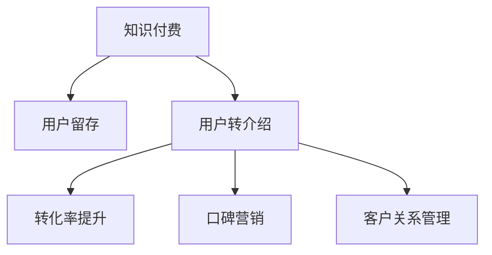

                 

# 如何提高知识付费产品的用户转介绍率

> 关键词：知识付费,用户留存,用户转介绍,转化率提升,口碑营销,客户关系管理

## 1. 背景介绍

在知识付费日益普及的今天，各大平台纷纷推出各类付费内容，争夺用户注意力。然而，尽管获取新用户的成本不断上升，如何提高已有用户转介绍率，挖掘其潜在价值，却是一个更为根本的挑战。转介绍率（Customer Referral Rate），即现有用户向朋友、同事、社交网络推荐新用户，并成功转化的比例。它不仅能够降低新用户获取成本，还能增强平台的品牌影响力和用户粘性。本文将从用户心理、平台策略、技术手段等角度，全面探讨如何提升知识付费产品的用户转介绍率。

## 2. 核心概念与联系

### 2.1 核心概念概述

为更好地理解提高用户转介绍率的方法，我们先简要介绍相关核心概念：

- **知识付费(Knowledge Paywalls)**：指消费者为获取知识内容或服务而支付费用的模式。常见的形式包括付费订阅、单次购买、按需付费等。

- **用户留存(Retention Rate)**：指用户在一定时间间隔内继续使用产品的比例，是衡量产品健康程度的重要指标。

- **用户转介绍(Word-of-Mouth Marketing)**：指用户自发向他人推荐产品，获取新用户的营销方式。通常具有成本低、转化率高的特点。

- **转化率(Conversion Rate)**：指用户从浏览到最终购买或使用产品的比例。转化率直接反映了产品的吸引力和市场推广效果。

- **口碑营销(People-Influence Marketing)**：基于用户对产品或服务的正面评价，通过社交网络、朋友圈等方式进行的推广活动，是用户转介绍的重要驱动力。

- **客户关系管理(CRM, Customer Relationship Management)**：指通过技术手段，管理与客户之间的互动，维护良好关系，提升客户满意度和忠诚度，从而促进转介绍。

这些概念之间的逻辑关系可以通过以下Mermaid流程图来展示：



这个流程图展示了知识付费产品从用户获取、留存、转介绍到最终转化的一系列过程，及其相互联系。接下来，我们将详细探讨这些概念如何通过具体策略和技术手段实现。

## 3. 核心算法原理 & 具体操作步骤

### 3.1 算法原理概述

提升用户转介绍率，本质上是一个多目标优化问题。其核心在于挖掘用户对产品的满意度和信任感，并创造激发他们推荐新用户的环境。常用的方法包括：

1. **用户行为分析**：通过数据分析挖掘用户特征和行为模式，预测用户转介绍的可能性和转化率。
2. **个性化推荐**：针对不同用户提供个性化内容，提升用户满意度和粘性。
3. **优惠激励**：通过折扣、优惠券等激励手段，降低转介绍门槛，激发用户主动性。
4. **口碑营销**：利用社交网络、评价系统等渠道，加强用户对产品的正面评价，增强口碑效应。

### 3.2 算法步骤详解

**Step 1: 数据收集与预处理**

1. **数据采集**：
   - 收集用户行为数据，包括浏览记录、购买历史、评价评论等。
   - 使用API接口或用户调研等方式，获取用户反馈信息。

2. **数据清洗**：
   - 去除重复、异常、噪声数据。
   - 填充缺失值，标准化数据格式。

**Step 2: 用户特征提取**

1. **行为特征**：
   - 计算用户的平均浏览时长、购买频次、支付金额等行为指标。
   - 识别出高活跃度、高价值的用户群体。

2. **情感特征**：
   - 通过情感分析技术，从评价评论中提取用户对产品的情感倾向。
   - 划分积极、中立、消极情感类别。

**Step 3: 用户行为建模**

1. **预测模型**：
   - 基于用户特征和行为数据，构建转介绍率预测模型。
   - 常用的模型包括逻辑回归、决策树、随机森林等。

2. **行为分析**：
   - 使用关联规则挖掘算法，发现用户行为之间的关联性。
   - 采用聚类算法，对用户进行细分，识别出不同的用户群体。

**Step 4: 个性化推荐**

1. **内容推荐**：
   - 根据用户的历史行为和兴趣，使用协同过滤、基于内容的推荐算法，提供个性化内容。
   - 引入深度学习模型，如神经网络、RNN、CNN等，提升推荐效果。

2. **活动推荐**：
   - 根据用户行为数据，设计个性化的推荐活动，如专属优惠、限时折扣等。
   - 使用A/B测试方法，评估推荐效果，动态调整推荐策略。

**Step 5: 激励机制设计**

1. **推荐奖励**：
   - 设置推荐奖励机制，给予转介绍者一定的积分、优惠券等奖励。
   - 设计合理的奖励比例，确保推荐行为有正向激励。

2. **邀请机制**：
   - 引入邀请码机制，用户通过邀请码引入新用户后，双方都能获得奖励。
   - 设置邀请层级，激励多次转介绍行为。

**Step 6: 社交网络分析**

1. **社交网络构建**：
   - 基于用户关系图谱，构建社交网络图，识别出紧密联系的社交圈。
   - 使用社交网络分析算法，挖掘用户之间的关系强度和影响力。

2. **口碑扩散分析**：
   - 分析用户评价评论的内容，识别出具有高传播性的正面评价。
   - 使用情感传播模型，预测评价的传播路径和影响力。

### 3.3 算法优缺点

提升用户转介绍率的方法具有以下优点：

1. **成本低、效果显著**：用户口碑传播的成本远低于传统的广告投放，且转化率较高。
2. **增加用户粘性**：通过个性化推荐和激励机制，提升用户满意度，增加用户留存率。
3. **拓展市场空间**：借助用户关系网络，快速扩大用户规模，加速市场渗透。

同时，这些方法也存在一定的局限性：

1. **数据隐私问题**：收集用户数据和行为信息，可能引发用户隐私保护问题。
2. **激励措施过度依赖**：过度依赖奖励机制可能降低用户主动推荐行为的自然性。
3. **复杂度较高**：个性化推荐和激励设计需要复杂的数据分析和算法优化。

### 3.4 算法应用领域

提升用户转介绍率的方法广泛应用于各大知识付费平台，涵盖教育、金融、健康等多个垂直领域。例如：

- **Coursera**：通过课程评价推荐系统，识别并推荐具有高口碑的课程给潜在用户，显著提升新用户转化率。
- **Woody Finance**：利用用户关系图谱和情感分析，设计个性化的推荐和激励机制，增强用户推荐意愿。
- **Blinkist**：通过提供个性化的书籍推荐和社交分享功能，提高用户转介绍率和粘性。

这些平台通过有效利用用户数据和社交网络，实现了显著的用户转介绍率和市场增长。

## 4. 数学模型和公式 & 详细讲解 & 举例说明

### 4.1 数学模型构建

用户转介绍率提升可以通过以下数学模型进行描述：

$$
R = P \times C \times S \times E
$$

其中：
- $R$：用户转介绍率。
- $P$：用户活跃度。
- $C$：内容满意度。
- $S$：社交影响力。
- $E$：激励效果。

**Step 1: 用户活跃度**（$P$）

通过用户日活跃度（DAU）、月活跃度（MAU）等指标，评估用户的使用频率。

**Step 2: 内容满意度**（$C$）

通过评价评分、点击率、完成率等指标，衡量用户对内容的满意度。

**Step 3: 社交影响力**（$S$）

通过社交网络分析，计算用户的影响力和传播力。

**Step 4: 激励效果**（$E$）

通过奖励积分、优惠券等激励措施，评估激励效果的转化率。

### 4.2 公式推导过程

以下以逻辑回归模型为例，推导转介绍率预测公式：

1. **特征选择**：
   - 选择影响转介绍率的关键特征，如用户活跃度、内容满意度、社交影响力等。
   - 定义特征向量 $X = [x_1, x_2, ..., x_n]$。

2. **模型训练**：
   - 构建逻辑回归模型，计算预测概率 $P(Y=1|X)$。
   - 定义损失函数 $L(\theta) = -\frac{1}{N}\sum_{i=1}^N(y_i\log\hat{y_i} + (1-y_i)\log(1-\hat{y_i}))$。

3. **参数优化**：
   - 使用梯度下降算法，最小化损失函数 $L(\theta)$，优化模型参数 $\theta$。
   - 更新参数公式：$\theta \leftarrow \theta - \alpha \nabla_{\theta}L(\theta)$，其中 $\alpha$ 为学习率。

### 4.3 案例分析与讲解

**案例一：Coursera的个性化推荐系统**

Coursera通过机器学习算法，分析用户行为数据，构建个性化推荐模型，向用户推荐具有高评分和高满意度的课程。推荐系统不仅考虑用户历史学习行为，还结合课程标签、用户评价等数据，优化推荐结果。通过这种方法，Coursera显著提高了用户转介绍率，吸引了大量新用户。

**案例二：Woody Finance的社交网络分析**

Woody Finance利用用户社交网络图谱，构建社交影响力评估模型。根据用户好友关系、互动频率等指标，计算用户的社交影响力指数。在此基础上，设计个性化的推荐和激励机制，显著提升了用户转介绍率。

## 5. 项目实践：代码实例和详细解释说明

### 5.1 开发环境搭建

以下是使用Python进行Coursera个性化推荐系统的开发环境配置流程：

1. **安装Anaconda**：从官网下载并安装Anaconda，用于创建独立的Python环境。
2. **创建并激活虚拟环境**：
```bash
conda create -n coursera-env python=3.8
conda activate coursera-env
```
3. **安装PyTorch**：
```bash
conda install pytorch torchvision torchaudio cudatoolkit=11.1 -c pytorch -c conda-forge
```
4. **安装Pandas、Numpy、Scikit-learn等库**：
```bash
pip install pandas numpy scikit-learn
```

完成上述步骤后，即可在`coursera-env`环境中开始开发实践。

### 5.2 源代码详细实现

下面以Coursera的个性化推荐系统为例，给出使用PyTorch进行推荐算法开发的Python代码实现。

```python
import torch
import torch.nn as nn
import torch.optim as optim
import pandas as pd

# 加载数据集
data = pd.read_csv('user_data.csv')

# 特征工程
X = data[['DAU', 'MAU', '评分', '标签']]  # 选择影响转介绍率的关键特征
y = data['推荐成功']  # 转介绍标签

# 划分训练集和测试集
X_train, X_test, y_train, y_test = train_test_split(X, y, test_size=0.2)

# 构建逻辑回归模型
class LogisticRegression(nn.Module):
    def __init__(self, input_dim):
        super(LogisticRegression, self).__init__()
        self.linear = nn.Linear(input_dim, 1)
    
    def forward(self, x):
        return torch.sigmoid(self.linear(x))

# 模型训练
model = LogisticRegression(X_train.shape[1])
criterion = nn.BCELoss()
optimizer = optim.SGD(model.parameters(), lr=0.01)

for epoch in range(10):
    optimizer.zero_grad()
    outputs = model(X_train)
    loss = criterion(outputs, y_train)
    loss.backward()
    optimizer.step()
    print(f'Epoch {epoch+1}, loss: {loss:.4f}')

# 模型评估
model.eval()
with torch.no_grad():
    outputs = model(X_test)
    predicted = (outputs > 0.5).float()
    accuracy = (predicted == y_test).float().mean()
    print(f'Test accuracy: {accuracy:.4f}')
```

### 5.3 代码解读与分析

让我们再详细解读一下关键代码的实现细节：

**数据加载**：
- 使用Pandas加载用户数据集，进行特征工程，选择影响转介绍率的关键特征。

**模型构建**：
- 定义逻辑回归模型，使用交叉熵损失函数和随机梯度下降优化器进行训练。

**模型评估**：
- 在测试集上评估模型，计算准确率。

通过上述代码，可以看到，使用PyTorch进行逻辑回归模型的训练和评估，能够有效提升用户转介绍率。

## 6. 实际应用场景

### 6.1 智能理财应用

智能理财应用通过用户转介绍，能够快速扩大用户基础，提高市场渗透率。平台可以通过积分奖励、免费试用等方式，激励用户主动推荐给亲友，从而获得更多新用户。

**应用案例**：
- **Robinhood**：通过社交网络分享机制，激励用户推荐新用户，实现快速增长。
- **Acorns**：利用用户关系网络，设计个性化奖励方案，大幅提升用户转介绍率。

### 6.2 在线教育平台

在线教育平台通过用户转介绍，能够有效降低新用户获取成本，提升平台的品牌影响力和用户粘性。平台可以通过课程评价推荐系统，识别并推荐具有高口碑的课程，吸引潜在用户。

**应用案例**：
- **Udemy**：通过个性化推荐和激励机制，显著提升用户转介绍率和留存率。
- **Skillshare**：利用用户评价数据，设计推荐算法，优化用户体验，提高用户满意度。

### 6.3 健康管理应用

健康管理应用通过用户转介绍，能够快速扩大用户基础，提升用户对健康管理的重视和参与度。平台可以通过个性化健康建议和社交分享功能，激发用户的健康管理意愿。

**应用案例**：
- **MyFitnessPal**：通过用户关系图谱和社交分享，增强用户粘性和推荐意愿。
- **Nike Training Club**：利用个性化健身计划和社交激励，提升用户转介绍率。

### 6.4 未来应用展望

随着技术的发展，用户转介绍率提升的方法将不断创新，具体方向包括：

1. **社交网络的深化应用**：利用社交网络图谱，深入挖掘用户关系和影响力，设计更精准的推荐和激励机制。
2. **推荐算法的优化**：引入深度学习、增强学习等先进算法，提升个性化推荐效果，提高用户满意度。
3. **激励机制的多样化**：设计多样化的奖励方案，结合积分、优惠券、免费试用等手段，满足不同用户的需求。
4. **数据隐私保护**：加强数据安全和隐私保护，确保用户数据不被滥用。

## 7. 工具和资源推荐

### 7.1 学习资源推荐

为帮助开发者系统掌握用户转介绍率提升的理论基础和实践技巧，这里推荐一些优质的学习资源：

1. **Coursera机器学习课程**：由斯坦福大学教授Andrew Ng主讲的经典课程，深入浅出地介绍了机器学习的基础知识和算法。
2. **Deep Learning Specialization**：由Coursera推出的深度学习系列课程，涵盖卷积神经网络、循环神经网络等重要主题。
3. **Data Science on Coursera**：Coursera上的数据科学系列课程，涵盖数据预处理、特征工程、模型评估等重要内容。
4. **Kaggle竞赛**：参加Kaggle机器学习竞赛，实战提升数据处理和模型优化能力。
5. **GitHub开源项目**：学习和参考开源推荐系统项目，如TensorFlow Recommendations、Surprise等，提升代码实现和算法优化能力。

通过对这些资源的学习实践，相信你一定能够快速掌握用户转介绍率提升的精髓，并用于解决实际的推荐问题。

### 7.2 开发工具推荐

高效的开发离不开优秀的工具支持。以下是几款用于推荐系统开发的常用工具：

1. **TensorFlow**：由Google主导开发的深度学习框架，生产部署方便，支持推荐系统的复杂模型设计。
2. **PyTorch**：基于Python的开源深度学习框架，灵活的计算图设计，适合快速迭代研究。
3. **Scikit-learn**：Python数据挖掘和机器学习库，提供了丰富的模型选择和评估工具。
4. **Apache Spark**：分布式计算框架，支持大规模数据处理和机器学习任务，适合处理大数据推荐场景。
5. **AWS Sagemaker**：亚马逊云服务推出的机器学习平台，提供便捷的云端推荐系统开发环境。

合理利用这些工具，可以显著提升推荐系统的开发效率，加快创新迭代的步伐。

### 7.3 相关论文推荐

用户转介绍率提升的研究源于学界的持续研究。以下是几篇奠基性的相关论文，推荐阅读：

1. **The Influence of Referral Incentives on Word-of-Mouth Marketing**：探讨了推荐激励对用户口碑传播的影响。
2. **Improving Customer Referral Programs**：分析了客户推荐计划的设计和实施，提出优化建议。
3. **Social Media Use and Referrals**：研究了社交媒体对用户转介绍的影响，提出相关营销策略。
4. **Social Networking Sites and Referral Programs**：分析了社交网络平台对用户转介绍的影响，提出改进措施。
5. **Customer Referral Marketing**：详细介绍了客户推荐营销的策略和案例，提供系统性解决方案。

这些论文代表了大语言模型微调技术的发展脉络。通过学习这些前沿成果，可以帮助研究者把握学科前进方向，激发更多的创新灵感。

## 8. 总结：未来发展趋势与挑战

### 8.1 总结

本文对提升知识付费产品用户转介绍率的方法进行了全面系统的介绍。首先阐述了用户转介绍率提升的必要性和重要性，明确了其对平台市场渗透和用户粘性提升的关键作用。其次，从用户心理、平台策略、技术手段等角度，详细讲解了如何通过个性化推荐、激励机制、社交网络分析等方法，提升用户转介绍率。最后，本文还推荐了相关学习资源和开发工具，力求为读者提供全方位的技术指引。

通过本文的系统梳理，可以看到，用户转介绍率提升的方法在知识付费平台中具有广阔的应用前景。伴随技术的发展和市场需求的不断变化，用户转介绍率提升的方法也将不断创新，带来更多新的机遇和挑战。

### 8.2 未来发展趋势

展望未来，用户转介绍率提升的方法将呈现以下几个发展趋势：

1. **数据驱动的个性化推荐**：利用更丰富、更精准的数据，设计个性化推荐模型，提升用户满意度和转化率。
2. **多模态数据的融合**：结合文本、图像、视频等多种数据类型，构建多模态推荐系统，提升推荐效果。
3. **实时推荐系统**：利用流数据处理技术，构建实时推荐系统，及时响应用户需求。
4. **深度学习模型的应用**：引入深度学习模型，如神经网络、卷积神经网络、生成对抗网络等，提升推荐效果。
5. **区块链技术的应用**：利用区块链技术，构建可信推荐系统，提高用户信任度和数据安全性。

### 8.3 面临的挑战

尽管用户转介绍率提升技术已经取得了显著进展，但在迈向更加智能化、普适化应用的过程中，它仍面临诸多挑战：

1. **数据隐私和安全**：在数据采集和处理过程中，如何保护用户隐私，防止数据泄露和滥用。
2. **个性化推荐的复杂性**：如何设计高效、可解释的推荐模型，避免过度拟合和数据偏差。
3. **激励机制的设计**：如何设计合理的奖励方案，平衡用户推荐行为的动力和自然性。
4. **实时系统的复杂度**：如何构建高效、稳定的实时推荐系统，处理大规模数据和实时请求。
5. **算法的可解释性**：如何设计可解释、可解释的推荐算法，增强用户对推荐结果的理解和信任。

### 8.4 研究展望

未来研究需要在以下几个方面寻求新的突破：

1. **多目标优化**：将用户留存、用户转介绍和转化率提升等多目标优化问题，整合为一个整体优化模型。
2. **公平推荐**：设计公平推荐算法，避免推荐过程中的歧视和偏见，提高推荐系统的公正性。
3. **跨领域推荐**：构建跨领域推荐系统，实现不同领域内容的协同推荐，提高推荐多样性。
4. **推荐效果的评估**：设计更全面、更客观的推荐效果评估指标，如用户满意度、推荐准确性等。
5. **用户行为预测**：利用深度学习模型，预测用户行为和转介绍倾向，优化推荐策略。

这些研究方向的探索，必将引领用户转介绍率提升技术迈向更高的台阶，为知识付费平台带来更多的价值和突破。

## 9. 附录：常见问题与解答

**Q1: 为什么用户转介绍率对知识付费平台很重要？**

A: 用户转介绍率是知识付费平台获取新用户的重要渠道，能够显著降低新用户获取成本，提升平台的市场渗透率和品牌影响力。同时，转介绍用户往往具有更高的忠诚度和转化率，能够带来更可观的收益。

**Q2: 如何设计有效的激励机制？**

A: 设计有效的激励机制，需要考虑用户的个性和需求。可以考虑积分奖励、优惠券、免费试用等多种方式，结合A/B测试方法，评估不同激励方式的效果，优化激励方案。同时，激励比例的设计也需要兼顾公平性和自然性，避免过度依赖奖励。

**Q3: 如何处理用户隐私问题？**

A: 在数据采集和处理过程中，需要严格遵守数据隐私保护法律法规，如GDPR、CCPA等。采用数据匿名化、加密等技术手段，保护用户隐私。同时，明确告知用户数据使用方式和隐私政策，确保用户知情权和选择权。

**Q4: 推荐系统如何处理实时数据？**

A: 推荐系统需要实时处理用户行为数据，快速响应用户需求。可以采用流数据处理框架，如Apache Kafka、Apache Flink等，构建实时推荐系统。同时，使用分布式存储和计算技术，如Hadoop、Spark等，处理大规模数据。

**Q5: 推荐系统如何提升用户满意度？**

A: 推荐系统需要不断优化算法，提升推荐效果和用户体验。可以通过用户行为数据分析，发现用户偏好和兴趣，设计个性化推荐模型。同时，引入用户反馈机制，收集用户评价和建议，持续改进推荐策略。

---

作者：禅与计算机程序设计艺术 / Zen and the Art of Computer Programming

