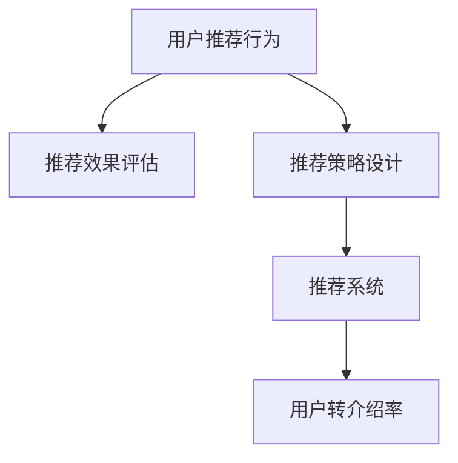

                 

# 如何提高知识付费产品的用户转介绍率

> 关键词：用户转介绍,知识付费产品,行为分析,转化率提升,用户增长

## 1. 背景介绍

### 1.1 问题由来
随着知识经济的兴起，知识付费产品的市场规模持续扩大，各类平台和应用如雨后春笋般涌现。然而，尽管知识付费产品为用户提供了便捷的学习渠道和高质量的内容，但其用户留存和转化仍面临巨大挑战。传统靠单靠付费拉动的增长模式已难以为继，如何提高用户转介绍率，实现健康可持续的增长，成为知识付费平台亟需解决的问题。

### 1.2 问题核心关键点
用户转介绍是指现有用户向新用户推荐产品，有效提升产品的市场渗透率和用户基础。这一过程涉及多个关键环节，包括用户推荐行为分析、推荐策略设计、推荐效果监控等。高质量的用户推荐不仅能提升平台的用户转化率，还能显著降低平台获取新用户的成本，成为知识付费平台的核心增长驱动力。

### 1.3 问题研究意义
通过分析用户推荐行为和推荐策略，掌握用户转介绍率的提升技巧，可以推动知识付费产品用户基础扩大，增加平台收入，加速市场渗透，形成良性循环。对平台来说，提升用户转介绍率意味着更低的运营成本和更高的市场竞争优势，对用户则能提升其价值感和归属感，最终形成良性互动，达到双赢的局面。

## 2. 核心概念与联系

### 2.1 核心概念概述

为更好地理解用户转介绍机制，本节将介绍几个密切相关的核心概念：

- **用户推荐行为**：指用户通过社交媒体、评论、反馈等方式将产品推荐给其他用户的行为。
- **推荐效果评估**：指通过A/B测试、用户行为数据分析等手段，评估推荐策略对用户转介绍率的影响。
- **推荐策略设计**：指根据用户行为数据，设计针对性的推荐机制，提高用户推荐效果。
- **推荐系统**：指使用算法和数据模型，自动化的推荐系统，用于提升用户推荐行为。
- **用户转介绍率**：指新用户中，由现有用户推荐带来的比例，衡量用户推荐的有效性。

这些概念之间的逻辑关系可以通过以下Mermaid流程图来展示：



这个流程图展示了几类核心概念之间的关系：

1. 用户推荐行为驱动推荐策略设计。
2. 推荐策略设计指导推荐系统开发。
3. 推荐系统自动化执行推荐策略。
4. 推荐系统输出的推荐行为最终影响用户转介绍率。

## 3. 核心算法原理 & 具体操作步骤
### 3.1 算法原理概述

用户转介绍率的高低受多种因素影响，包括用户对产品的信任度、产品内容的吸引力、推荐机制的效率等。提升用户转介绍率的核心在于：

1. **构建用户推荐行为模型**：分析用户推荐行为与产品特征、用户属性之间的关系，建立推荐模型。
2. **优化推荐策略**：根据推荐模型结果，设计并调整推荐策略，提升用户推荐行为的效果。
3. **强化推荐系统**：使用强化学习等方法，持续优化推荐系统，提升推荐效果。

通过这三个关键步骤，可以系统地提升用户转介绍率。

### 3.2 算法步骤详解

#### 3.2.1 构建用户推荐行为模型
- **数据收集**：收集用户推荐行为数据，包括推荐次数、推荐渠道、推荐内容等。
- **特征工程**：提取影响用户推荐行为的关键特征，如用户属性、产品属性、推荐渠道等。
- **模型选择**：选择适合的推荐模型，如逻辑回归、决策树、随机森林、深度学习等。
- **模型训练**：使用收集到的数据训练推荐模型，得到预测用户推荐行为的概率模型。
- **模型评估**：使用测试数据集评估模型的预测效果，选择效果最佳的模型。

#### 3.2.2 优化推荐策略
- **策略设计**：根据推荐模型预测结果，设计推荐策略，如用户推荐激励、推荐内容优化等。
- **策略实施**：在平台上实施推荐策略，观察其对用户推荐行为的影响。
- **效果监控**：使用A/B测试等方法，监控推荐策略的实际效果，收集反馈数据。
- **策略调整**：根据监控结果，调整优化推荐策略。

#### 3.2.3 强化推荐系统
- **模型选择**：选择适合的强化学习模型，如Q-learning、Deep Q-learning等。
- **环境设计**：设计推荐系统交互的环境，包括用户行为数据、奖励函数等。
- **训练优化**：使用强化学习算法，持续优化推荐策略，提升推荐效果。
- **效果评估**：使用A/B测试等方法，评估强化推荐系统的实际效果。
- **策略调整**：根据评估结果，调整强化推荐策略。

### 3.3 算法优缺点

用户转介绍策略设计具有以下优点：
1. **提升用户转化率**：通过用户推荐，可以显著降低新用户获取成本，提升用户转化率。
2. **减少运营成本**：用户推荐带来的新用户往往更具粘性，转化成本较低。
3. **提高用户粘性**：积极参与推荐的用户通常对产品更满意，有助于提高用户粘性。

同时，该策略也存在一定的局限性：
1. **依赖推荐效果**：推荐模型和策略设计的效果直接影响用户推荐行为。
2. **数据隐私问题**：推荐行为数据涉及用户隐私，需要谨慎处理和保护。
3. **动态环境适应**：用户行为和市场环境变化迅速，需要持续优化推荐策略。
4. **系统复杂性**：设计和优化推荐策略涉及多方面考虑，系统实现复杂度较高。

尽管存在这些局限性，但就目前而言，用户推荐策略仍是大规模知识付费平台提高用户转介绍率的有效手段。未来相关研究的重点在于如何进一步降低策略设计复杂性，提高模型效果，同时兼顾用户隐私和推荐系统稳定性。

### 3.4 算法应用领域

用户转介绍策略在知识付费产品的多个应用场景中都有广泛应用，例如：

- **课程推荐**：根据用户过去的购买和浏览行为，推荐相关课程，使用户通过推荐找到新内容。
- **讲师推荐**：推荐与用户已有偏好相似的讲师，提升用户对课程的满意度。
- **内容分享**：鼓励用户分享有用内容，使用户在平台上发现更多价值。
- **社群互动**：建立用户互动的社区，增强用户粘性和参与度。
- **优惠券推荐**：通过推荐优惠券，吸引用户继续购买或尝试新课程。

除了上述这些经典场景外，用户推荐策略还被创新性地应用到更多场景中，如课程测评、推荐排行榜等，为知识付费产品带来了全新的增长动力。

## 4. 数学模型和公式 & 详细讲解 & 举例说明
### 4.1 数学模型构建

本节将使用数学语言对用户转介绍机制进行更加严格的刻画。

假设知识付费平台有$N$个用户，每个用户有$m$种推荐内容，推荐内容有$c$种类型。设用户$u$推荐内容$c$的概率为$P_{uc}$，则用户$u$推荐的所有内容$c$的概率总和为1，即：

$$
\sum_{c=1}^c P_{uc} = 1
$$

同时，我们定义用户$u$的推荐率$R_u$，即$u$推荐至少一个内容的比例：

$$
R_u = 1 - (1 - P_{uc})^m
$$

### 4.2 公式推导过程

为了简化问题，我们假设推荐内容$c$和用户$u$的推荐行为相互独立。此时，用户$u$推荐内容$c$的概率为$P_{uc}$，而用户$u$推荐所有内容的概率总和为1，即：

$$
\sum_{c=1}^c P_{uc} = 1
$$

则用户$u$推荐至少一个内容$c$的概率为：

$$
R_u = 1 - \prod_{c=1}^c (1 - P_{uc})
$$

考虑到用户推荐行为与用户属性、产品属性、推荐渠道等因素有关，我们可以进一步构建用户推荐行为模型，将推荐概率建模为上述变量的函数。设推荐概率模型为$f(u, c)$，则有：

$$
P_{uc} = f(u, c)
$$

将$f(u, c)$代入$R_u$公式中，得：

$$
R_u = 1 - \prod_{c=1}^c (1 - f(u, c))
$$

### 4.3 案例分析与讲解

考虑一个知识付费平台，其有$m=3$种推荐内容，用户$u$推荐每种内容的概率分别为$P_{uc} = 0.1$，$0.2$，$0.3$。则用户$u$推荐至少一个内容$c$的概率为：

$$
R_u = 1 - (1 - 0.1)^3 - (1 - 0.2)^3 - (1 - 0.3)^3
$$

将具体数值代入计算，得：

$$
R_u = 1 - (0.9)^3 - (0.8)^3 - (0.7)^3 \approx 0.751
$$

即用户$u$推荐至少一个内容$c$的概率约为75.1%。这个例子展示了在推荐概率相差不大的情况下，用户推荐至少一个内容的概率较高。

## 5. 项目实践：代码实例和详细解释说明
### 5.1 开发环境搭建

在进行推荐系统实践前，我们需要准备好开发环境。以下是使用Python进行推荐系统开发的典型环境配置流程：

1. 安装Python：确保系统上安装了Python 3.8及以上版本，并配置好虚拟环境。

2. 安装必要库：使用pip安装numpy、pandas、scikit-learn、tensorflow等常用库。

3. 准备数据集：从公开数据集获取用户推荐数据和产品属性数据，进行数据预处理。

4. 搭建开发环境：创建Docker容器，或者使用云平台提供的环境，配置好必要的开发工具。

5. 部署模型：搭建模型训练和部署的流水线，使用GCP、AWS等云平台提供的资源，进行模型训练和推理。

### 5.2 源代码详细实现

这里我们以用户推荐行为模型为例，给出使用TensorFlow进行用户推荐行为分析的代码实现。

```python
import tensorflow as tf
from tensorflow.keras.layers import Input, Dense, Embedding, Flatten, Concatenate
from tensorflow.keras.models import Model

# 定义模型输入
user_input = Input(shape=(user_num,), name='user')
item_input = Input(shape=(item_num,), name='item')

# 定义用户嵌入层
user_embedding = Embedding(user_num, emb_dim, input_length=user_num)(user_input)
user_embedding = Flatten()(user_embedding)

# 定义物品嵌入层
item_embedding = Embedding(item_num, emb_dim, input_length=item_num)(item_input)
item_embedding = Flatten()(item_embedding)

# 定义全连接层
concat = Concatenate()([user_embedding, item_embedding])
dense1 = Dense(128, activation='relu')(concat)
dense2 = Dense(64, activation='relu')(dense1)
dense3 = Dense(32, activation='relu')(dense2)

# 定义输出层
output = Dense(1, activation='sigmoid')(dense3)

# 定义模型
model = Model(inputs=[user_input, item_input], outputs=output)
model.compile(optimizer='adam', loss='binary_crossentropy', metrics=['accuracy'])

# 训练模型
model.fit([train_user, train_item], train_recommendation, epochs=num_epochs, batch_size=batch_size)
```

以上代码展示了用户推荐行为模型的基本构建。

### 5.3 代码解读与分析

让我们再详细解读一下关键代码的实现细节：

**用户输入层**：
- `user_input`：定义用户输入层的维度为`user_num`，即用户ID的总数。

**物品输入层**：
- `item_input`：定义物品输入层的维度为`item_num`，即物品ID的总数。

**嵌入层**：
- `Embedding`层：将用户ID和物品ID转化为固定长度的向量，即嵌入层。
- `Flatten`层：将嵌入层输出的高维张量展开为一维张量。

**全连接层**：
- `Dense`层：定义多层全连接层，每层神经元的数量逐层减少。

**输出层**：
- `Dense`层：定义输出层，输出为0到1之间的概率值，表示推荐概率。

**模型编译**：
- `compile`方法：指定优化器、损失函数和评估指标。

**模型训练**：
- `fit`方法：进行模型训练，指定训练数据、批次大小和训练轮数。

## 6. 实际应用场景
### 6.1 智能课程推荐

在知识付费平台中，智能课程推荐是一个典型场景。通过分析用户过去的课程购买和观看记录，推荐相似或相关的课程，可以显著提升用户的满意度和留存率。

### 6.2 讲师推荐

平台上的讲师是知识付费产品的重要组成部分，通过推荐与用户已有偏好相似的讲师，可以提高用户对课程的满意度，同时增加讲师的曝光度和收入。

### 6.3 内容分享

鼓励用户在平台上分享学习心得和成果，不仅能提升用户活跃度，还能使平台内容更加丰富和多样化，吸引更多用户加入。

### 6.4 社群互动

建立用户互动的社区，增强用户粘性和参与度，促进用户间的知识和经验交流，增加平台的用户基础和活跃度。

### 6.5 优惠券推荐

通过推荐优惠券，可以吸引用户继续购买或尝试新课程，提升平台的销售转化率。

### 6.6 个性化推荐

根据用户的特定需求和兴趣，提供个性化的推荐内容，使用户在平台上获得更加精准的学习体验。

### 6.7 话题讨论

平台上的话题讨论区是用户交流的重要场所，通过推荐相关话题，增加用户参与度，提升平台的用户粘性。

### 6.8 新用户留存

通过推荐新用户感兴趣的课程和内容，增加新用户留存率，提升平台的用户基础。

## 7. 工具和资源推荐
### 7.1 学习资源推荐

为了帮助开发者系统掌握推荐系统的理论和实践技巧，这里推荐一些优质的学习资源：

1. **《推荐系统实战》**：由知名推荐系统专家撰写，深入浅出地介绍了推荐系统的基础理论和实战技巧。

2. **《机器学习》课程**：斯坦福大学开设的经典机器学习课程，涵盖推荐系统等多个领域，适合初学者和进阶开发者。

3. **《深度学习基础》书籍**：由TensorFlow等深度学习框架的开发者所写，全面介绍了深度学习基础和推荐系统等应用。

4. **《推荐系统》书籍**：清华大学出版社出版的推荐系统经典教材，涵盖了推荐系统的理论基础和实际应用。

5. **Kaggle推荐系统竞赛**：Kaggle平台上的推荐系统竞赛，提供大量推荐系统数据集和开源模型，适合实践和验证推荐策略。

通过对这些资源的学习实践，相信你一定能够快速掌握推荐系统的精髓，并用于解决实际的推荐问题。

### 7.2 开发工具推荐

高效的开发离不开优秀的工具支持。以下是几款用于推荐系统开发的常用工具：

1. **TensorFlow**：由Google主导开发的开源深度学习框架，生产部署方便，适合大规模工程应用。

2. **PyTorch**：灵活的深度学习框架，适合快速迭代研究和原型开发。

3. **scikit-learn**：常用的机器学习库，提供了丰富的推荐算法和评估指标。

4. **NLTK**：自然语言处理工具库，可用于文本预处理和特征提取。

5. **Gensim**：文本处理和主题建模工具，适用于推荐系统中的特征工程。

6. **Jupyter Notebook**：交互式的开发环境，支持Python、R等多种语言，适合快速迭代开发和模型实验。

合理利用这些工具，可以显著提升推荐系统开发的效率，加快创新迭代的步伐。

### 7.3 相关论文推荐

推荐系统的发展源于学界的持续研究。以下是几篇奠基性的相关论文，推荐阅读：

1. **《Contextual Bandits: Introduction and Review》**：阐述了上下文推荐系统的基本原理和应用场景。

2. **《Deep Neural Networks for Collaborative Filtering》**：提出深度神经网络在协同过滤推荐中的应用，取得了显著的效果。

3. **《Item-based Collaborative Filtering Recommendation Algorithms》**：介绍了基于物品的协同过滤推荐算法，适用于大规模推荐系统的构建。

4. **《The Bellman Equation: An Introduction》**：介绍了强化学习的基础知识和应用场景，适用于推荐系统的优化。

5. **《LaserTagger: A Neural Network Approach for Addressing item-level Latent Factors in Recommender Systems》**：提出LaserTagger模型，结合了序列模型和协同过滤，提高了推荐系统的效果。

这些论文代表了大规模推荐系统的发展脉络。通过学习这些前沿成果，可以帮助研究者把握学科前进方向，激发更多的创新灵感。

## 8. 总结：未来发展趋势与挑战
### 8.1 总结

本文对用户推荐系统进行全面系统的介绍。首先阐述了用户推荐系统的研究背景和意义，明确了推荐系统在提高用户转介绍率中的核心作用。其次，从原理到实践，详细讲解了推荐系统的数学原理和关键步骤，给出了推荐任务开发的完整代码实例。同时，本文还广泛探讨了推荐系统在知识付费产品中的多个应用场景，展示了推荐系统的广泛应用。

通过本文的系统梳理，可以看到，用户推荐系统在知识付费产品中有着举足轻重的地位，极大地推动了平台的用户基础和增长。推荐系统技术的应用，不仅提升了平台的收入，还增强了用户的满意度和粘性，形成了良性循环。

### 8.2 未来发展趋势

展望未来，推荐系统将呈现以下几个发展趋势：

1. **个性化推荐精度提升**：随着深度学习、强化学习等技术的不断发展，推荐系统的个性化推荐精度将进一步提升，更好地满足用户的个性化需求。

2. **实时推荐系统构建**：实时推荐系统将成为推荐系统的未来发展方向，使用户在访问平台时，即可获取最新的推荐内容，提升用户体验。

3. **跨平台推荐系统优化**：跨平台推荐系统将成为一大趋势，实现用户在不同平台间的无缝推荐，提升推荐效果和用户粘性。

4. **多模态推荐技术发展**：多模态推荐系统将结合文本、图像、视频等多种信息，提升推荐系统的丰富度和多样性。

5. **推荐系统的公平性研究**：推荐系统需要更加关注用户公平性问题，避免对少数群体的偏见和歧视，提升推荐系统的公正性。

6. **推荐系统的可持续性**：推荐系统需要实现资源的有效利用和推荐效果的长期稳定，避免过度拟合和资源浪费。

以上趋势凸显了推荐系统的广阔前景。这些方向的探索发展，必将进一步提升推荐系统的精度和效率，为知识付费产品带来更优质的用户体验和服务。

### 8.3 面临的挑战

尽管推荐系统已经取得了显著成就，但在迈向更加智能化、普适化应用的过程中，它仍面临着诸多挑战：

1. **数据隐私保护**：推荐系统涉及大量用户数据，如何在保护用户隐私的前提下，进行推荐模型的训练和优化，是重要挑战之一。

2. **推荐模型复杂性**：推荐模型需要处理大量的高维数据，模型复杂度较高，需要高效的计算资源和算法支持。

3. **推荐算法鲁棒性**：推荐算法在面对新数据和变化多端的市场环境时，需要具备鲁棒性，避免推荐效果波动。

4. **推荐系统公平性**：推荐系统需要关注不同用户群体的公平性问题，避免对某些用户群体的偏见和歧视。

5. **推荐系统效率**：推荐系统需要在保证精度的同时，提升推荐效率，优化资源利用，满足大规模推荐需求。

6. **推荐系统可解释性**：推荐系统需要具备更好的可解释性，使用户了解推荐逻辑和决策依据，增强用户信任度。

这些挑战需要进一步的研究和探索，才能实现推荐系统的长期稳定发展。

### 8.4 研究展望

面对推荐系统面临的挑战，未来的研究需要在以下几个方面寻求新的突破：

1. **研究高效推荐算法**：开发更高效、更稳健的推荐算法，提升推荐系统的计算效率和数据处理能力。

2. **引入因果推断技术**：引入因果推断方法，提升推荐系统的解释性和公正性，增强用户对推荐结果的信任感。

3. **结合多模态数据**：结合视觉、音频等多种模态数据，提升推荐系统的丰富度和精度。

4. **优化推荐系统评价指标**：设计新的评价指标，提升推荐系统的公平性和效率。

5. **实现跨平台推荐**：研究跨平台推荐技术，提升用户在不同平台间的推荐效果。

6. **构建实时推荐系统**：研究实时推荐系统的构建方法，实现实时更新推荐内容，提升用户体验。

这些研究方向将进一步推动推荐系统的进步，为知识付费产品带来更优质的推荐服务和用户体验。相信随着技术的不断突破，推荐系统必将带来更多的创新和应用，助力知识付费行业的健康发展。

## 9. 附录：常见问题与解答

**Q1：推荐系统需要哪些关键数据？**

A: 推荐系统需要以下关键数据：

1. **用户行为数据**：包括用户浏览、点击、购买、评分等行为数据。
2. **物品属性数据**：包括物品的标题、描述、类别等属性信息。
3. **用户属性数据**：包括用户的基本信息、兴趣偏好等。
4. **推荐模型输出**：通过训练得到的推荐模型，用于预测用户对物品的评分和推荐概率。

这些数据是构建推荐系统的基础，通过合理的特征工程和模型选择，可以设计出高效的推荐策略。

**Q2：推荐系统的评估指标有哪些？**

A: 推荐系统的评估指标包括：

1. **准确率（Accuracy）**：推荐系统正确推荐物品的比例。
2. **召回率（Recall）**：实际相关物品被推荐的比例。
3. **F1分数（F1 Score）**：准确率和召回率的调和平均数，用于衡量推荐系统的综合表现。
4. **平均绝对误差（MAE）**：预测值和实际值之间的平均绝对误差，用于衡量推荐系统预测的精度。
5. **均方误差（MSE）**：预测值和实际值之间的均方误差，用于衡量推荐系统预测的精度。

这些指标可以全面评估推荐系统的性能，帮助优化推荐策略。

**Q3：推荐系统如何处理冷启动问题？**

A: 冷启动问题是推荐系统中的常见问题，指新用户或新物品没有足够的历史行为数据，导致无法进行有效推荐。推荐系统可以通过以下方法处理冷启动问题：

1. **基于内容的推荐**：根据物品的属性信息，推荐与新物品相似的物品。
2. **基于用户的推荐**：根据用户的历史行为数据，推荐与用户已有兴趣相似的物品。
3. **基于协同过滤的推荐**：通过新用户或物品的历史行为数据，推断推荐结果。
4. **引入专家知识**：结合领域专家知识，对新用户或物品进行推荐。
5. **用户主动反馈**：通过用户主动反馈，调整推荐策略，逐步优化推荐结果。

通过以上方法，推荐系统可以在面对冷启动问题时，仍能进行有效推荐。

**Q4：推荐系统如何进行实时推荐？**

A: 实时推荐系统需要满足以下几个关键要求：

1. **低延迟**：推荐系统的响应时间需要控制在几毫秒到几十毫秒之间，满足用户的实时需求。
2. **高扩展性**：推荐系统需要具备高并发处理能力，能够应对大规模用户的实时请求。
3. **高可用性**：推荐系统需要具备高可用性，保证服务的稳定性和可靠性。
4. **数据一致性**：推荐系统需要保证数据的一致性和实时性，避免推荐结果的偏差。

实现实时推荐系统，需要采用分布式计算、缓存技术、消息队列等手段，提升系统的处理能力和响应速度。

**Q5：推荐系统如何进行用户个性化推荐？**

A: 用户个性化推荐是推荐系统的核心目标之一，以下方法可以提高推荐系统的个性化推荐效果：

1. **用户画像构建**：通过分析用户的历史行为数据，构建用户的兴趣画像，指导推荐策略的设计。
2. **推荐算法优化**：采用推荐算法中的个性化推荐算法，如协同过滤、深度学习等，提升推荐精度。
3. **推荐内容多样化**：通过推荐多样化的内容，满足用户的不同需求，增强用户体验。
4. **用户反馈处理**：通过用户反馈，调整推荐策略，提升推荐效果。
5. **多模态推荐**：结合多模态数据，提升推荐系统的丰富度和多样性。

通过以上方法，推荐系统可以在不同用户间实现个性化的推荐，提升用户体验和满意度。

---

作者：禅与计算机程序设计艺术 / Zen and the Art of Computer Programming

