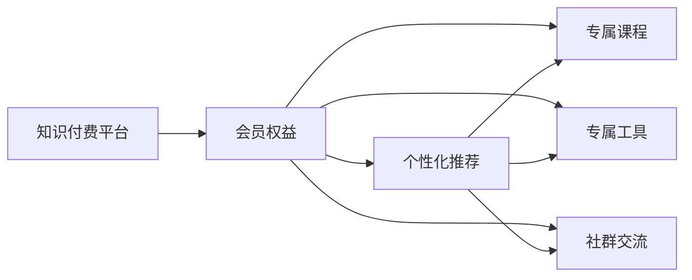

                 

## 1. 背景介绍

随着数字化时代的到来，知识付费成为越来越多人获取知识、技能和信息的重要方式。知识付费平台通过订阅模式，为用户提供定制化的学习内容和专属权益，构建了一个新的知识生态系统。然而，如何设计有吸引力的知识付费会员权益，成为平台成功的关键。本文将从核心概念、算法原理、具体操作步骤、实际应用场景等多个角度，详细探讨设计有吸引力的知识付费会员权益的方法和策略。

## 2. 核心概念与联系

### 2.1 核心概念概述

- **知识付费平台**：指通过订阅模式，为用户提供定制化的学习内容和专属权益，构建知识生态系统的平台。
- **会员权益**：指知识付费平台为会员提供的专属服务、优惠和福利，包括但不限于个性化推荐、专属课程、专属工具、社群交流等。
- **个性化推荐**：利用机器学习和推荐系统技术，根据用户兴趣和行为，为其推荐最相关的学习内容和课程。
- **专属课程**：为会员提供专属的高级课程、深度研究报告、案例分析等高价值内容。
- **专属工具**：提供会员专属的学习工具、应用插件、知识管理工具等，提升学习效率和效果。
- **社群交流**：构建会员专属社群，提供交流学习心得、分享经验的平台，增强社区凝聚力。

这些核心概念之间的联系如下：



### 2.2 核心概念原理和架构

**个性化推荐算法**：
- **协同过滤**：利用用户和物品之间的相似性，为每个用户推荐与已喜欢的物品相似的物品。
- **内容过滤**：通过分析用户浏览、购买和评分数据，提取用户兴趣特征，为每个用户推荐与其兴趣相符的物品。

**专属课程设计**：
- **微课设计**：设计短小精悍的微课视频，强调实用性和针对性，让用户轻松掌握核心知识和技能。
- **实践项目**：提供实战项目和案例分析，帮助用户将理论知识应用于实际工作。

**专属工具功能**：
- **知识管理**：提供笔记、标签、归档等功能，帮助用户系统化管理学习内容和资源。
- **学习助手**：提供定时提醒、学习进度跟踪、学习报告等功能，提升学习效果。

**社群交流机制**：
- **会员专享**：构建会员专属的学习交流平台，设置严格的入群门槛和高质量内容输出。
- **交流互动**：设计多种互动方式，如在线讨论、直播互动、专题研讨会等，增强会员互动性和参与感。

## 3. 核心算法原理 & 具体操作步骤

### 3.1 算法原理概述

设计有吸引力的知识付费会员权益，需要通过以下算法和步骤：

1. **数据收集与处理**：收集用户行为数据（如浏览记录、购买记录、评分数据等），进行清洗和预处理，构建用户画像和物品画像。
2. **个性化推荐模型**：利用协同过滤、内容过滤等推荐算法，构建个性化推荐模型，实现用户和物品的精准匹配。
3. **专属课程设计**：根据用户画像和课程特征，设计符合用户需求和兴趣的专属课程，并进行课程的精准推荐。
4. **专属工具功能开发**：根据用户反馈和学习需求，不断优化和改进专属工具的功能和用户体验。
5. **社群交流机制建设**：建立会员专属的学习交流平台，设计多样化的互动方式，提升社群活跃度和用户粘性。

### 3.2 算法步骤详解

1. **数据收集与处理**：
   - **数据源**：从平台日志、用户账户、课程数据等多个渠道收集用户行为数据。
   - **数据清洗**：去除重复、错误、异常数据，填充缺失值，标准化数据格式。
   - **特征提取**：提取用户画像和物品画像的关键特征，如用户兴趣、课程难度、课程时长等。

2. **个性化推荐模型构建**：
   - **协同过滤算法**：利用余弦相似度计算用户和物品之间的相似性，推荐与用户兴趣相似的物品。
   - **内容过滤算法**：通过TF-IDF、LDA等技术，提取用户兴趣特征，推荐与用户兴趣相符的物品。
   - **模型评估**：使用AUC、RMSE等指标，评估推荐模型效果，不断优化算法参数和模型结构。

3. **专属课程设计**：
   - **课程内容设计**：根据用户画像和课程特征，设计符合用户需求和兴趣的专属课程，强调实用性和针对性。
   - **课程推荐算法**：利用个性化推荐模型，将专属课程精准推荐给感兴趣的用户。
   - **课程反馈优化**：收集用户对课程的反馈和评价，不断改进课程内容和教学质量。

4. **专属工具功能开发**：
   - **工具功能设计**：根据用户反馈和学习需求，设计符合用户习惯和需求的工具功能，如笔记、标签、归档、学习助手等。
   - **工具迭代优化**：不断收集用户使用数据和反馈，优化和改进工具功能，提升用户体验。
   - **功能安全保障**：设计多种安全机制，保障工具数据的安全性和隐私性。

5. **社群交流机制建设**：
   - **社群平台搭建**：构建会员专属的学习交流平台，提供多种互动方式，如在线讨论、直播互动、专题研讨会等。
   - **社区管理机制**：建立严格的入群门槛和高质量内容输出机制，保障社群的高质量和活跃度。
   - **社区互动设计**：设计多种互动方式，增强会员互动性和参与感，提升社区凝聚力。

### 3.3 算法优缺点

**个性化推荐算法的优点**：
- **精准匹配**：根据用户兴趣和行为，精准匹配推荐物品，提高用户满意度和体验。
- **高效率**：利用协同过滤、内容过滤等高效算法，实现大规模数据处理和推荐。

**个性化推荐算法的缺点**：
- **数据依赖**：推荐效果依赖于数据质量和完整性，数据缺失或不准确会影响推荐精度。
- **冷启动问题**：新用户和物品没有足够的历史数据，推荐效果不佳。

**专属课程设计的优点**：
- **针对性**：根据用户兴趣和需求，设计符合用户需求和兴趣的专属课程，提高学习效果。
- **高价值**：提供高价值的课程内容，如实战项目、深度研究报告、案例分析等，提升会员价值。

**专属课程设计的缺点**：
- **成本高**：设计和开发专属课程需要大量的人力和物力投入，成本较高。
- **课程更新难**：专属课程更新和迭代周期较长，难以快速适应市场变化和用户需求。

**专属工具功能的优点**：
- **提升效率**：提供系统化的知识管理和学习助手功能，提升用户学习效率和效果。
- **个性化体验**：根据用户反馈和需求，不断优化和改进专属工具功能，提升用户体验。

**专属工具功能的缺点**：
- **开发难度大**：专属工具功能需要高水平的技术支持和开发，开发难度较大。
- **功能扩展难**：专属工具功能需要不断扩展和改进，保持与用户需求的同步。

**社群交流机制的优点**：
- **增强互动**：通过会员专属的社群交流平台，增强用户互动性和参与感，提升用户粘性。
- **知识共享**：通过社群交流平台，用户可以分享学习心得、交流经验，实现知识共享和互助。

**社群交流机制的缺点**：
- **管理复杂**：社群交流平台需要严格的管理机制和质量控制，管理复杂度较高。
- **社区活跃度难保障**：社群交流平台需要持续的内容输出和互动设计，才能保障社区活跃度和用户粘性。

### 3.4 算法应用领域

基于个性化推荐、专属课程设计、专属工具功能和社群交流机制的会员权益设计，已经在多个知识付费平台上得到了广泛应用，取得了显著效果。例如：

- **Coursera**：提供个性化课程推荐、专属课程设计、学习助手工具和会员专享社群，构建了一个系统化的学习生态系统。
- **Udacity**：提供个性化课程推荐、实战项目和案例分析、专属学习工具和社群交流，提升用户体验和满意度。
- **网易云课堂**：提供个性化课程推荐、专属课程设计、学习助手工具和会员专享社群，提供高品质的学习内容和服务。

这些平台通过精准的个性化推荐、高价值的专属课程、高效的专属工具和活跃的社群交流机制，构建了良好的用户生态系统，获得了用户的高度认可和满意度。

## 4. 数学模型和公式 & 详细讲解 & 举例说明

### 4.1 数学模型构建

假设知识付费平台有$M$个用户和$N$个课程，每个用户$u_i$对每个课程$c_j$的评分$s_{ij}$在$[1,5]$之间。个性化推荐模型的目标是为每个用户推荐最相关的课程，最大化用户满意度和平台收益。

**目标函数**：
$$
\max_{\theta} \sum_{i=1}^M \sum_{j=1}^N s_{ij} f_{\theta}(u_i,c_j)
$$
其中$f_{\theta}(u_i,c_j)$为个性化推荐模型，$\theta$为模型参数。

**约束条件**：
- **用户兴趣约束**：$u_i$对$c_j$的评分$s_{ij}$在$[1,5]$之间。
- **课程可用性约束**：$c_j$对所有用户$u_i$的评分$s_{ij}$在$[1,5]$之间。

### 4.2 公式推导过程

**协同过滤算法**：
- **用户-物品相似度**：
$$
\text{similarity}_{ij} = \text{cosine}(\mathbf{u}_i, \mathbf{c}_j)
$$
其中$\mathbf{u}_i$和$\mathbf{c}_j$分别为用户和课程的兴趣向量。
- **用户-物品评分预测**：
$$
\hat{s}_{ij} = \sum_{k=1}^K \text{similarity}_{ik} \cdot s_{kj}
$$
其中$K$为相似用户数。

**内容过滤算法**：
- **用户兴趣特征提取**：
$$
\mathbf{u}_i = (\sum_{k=1}^K \text{similarity}_{ik} \cdot \mathbf{c}_k)^{-1} \cdot \sum_{k=1}^K \text{similarity}_{ik} \cdot \mathbf{c}_k
$$
- **课程推荐**：
$$
\hat{s}_{ij} = \mathbf{u}_i^T \cdot \mathbf{c}_j
$$

### 4.3 案例分析与讲解

**案例一：Coursera平台**：
- **个性化推荐**：利用协同过滤和内容过滤算法，构建个性化推荐模型，实现课程精准推荐。
- **专属课程设计**：根据用户兴趣和需求，设计符合用户需求和兴趣的专属课程，如“数据科学实战项目”、“人工智能案例分析”等。
- **专属工具功能**：提供笔记、标签、归档和学习助手功能，提升用户学习效率和效果。
- **社群交流机制**：构建会员专属的学习交流平台，提供多种互动方式，如在线讨论、直播互动、专题研讨会等，增强用户互动性和参与感。

**案例二：Udacity平台**：
- **个性化推荐**：利用协同过滤和内容过滤算法，构建个性化推荐模型，实现课程精准推荐。
- **专属课程设计**：根据用户兴趣和需求，设计符合用户需求和兴趣的专属课程，如“纳米学位项目”、“前沿技术课程”等。
- **专属工具功能**：提供系统化的知识管理和学习助手功能，提升用户学习效率和效果。
- **社群交流机制**：构建会员专属的学习交流平台，提供多种互动方式，如在线讨论、直播互动、专题研讨会等，增强用户互动性和参与感。

## 5. 项目实践：代码实例和详细解释说明

### 5.1 开发环境搭建

在进行会员权益设计实践前，我们需要准备好开发环境。以下是使用Python进行知识付费平台开发的开发环境配置流程：

1. **安装Python**：从官网下载并安装最新版本的Python，建议选择Python 3.x版本。
2. **安装Flask**：
```bash
pip install flask
```
3. **安装SQLAlchemy**：
```bash
pip install sqlalchemy
```
4. **安装Flask-SQLAlchemy**：
```bash
pip install flask-sqlalchemy
```
5. **安装Flask-WTF**：
```bash
pip install flask-wtf
```
6. **安装WTForms**：
```bash
pip install wtforms
```
7. **安装OpenSSL**：
```bash
pip install OpenSSL
```
8. **安装requests**：
```bash
pip install requests
```
完成上述步骤后，即可在Python环境中开始会员权益设计实践。

### 5.2 源代码详细实现

这里我们以Coursera平台为例，给出会员权益设计实践的PyTorch代码实现。

**会员权益设计**：
```python
from flask import Flask, render_template, request
from flask_sqlalchemy import SQLAlchemy
from sqlalchemy import Column, Integer, String, Float
from sqlalchemy.orm import relationship
from sklearn.decomposition import TruncatedSVD
from sklearn.metrics.pairwise import cosine_similarity

app = Flask(__name__)

# 配置数据库
app.config['SQLALCHEMY_DATABASE_URI'] = 'sqlite:///course.db'
db = SQLAlchemy(app)

# 课程和用户表
class Course(db.Model):
    id = Column(Integer, primary_key=True)
    name = Column(String(50), unique=True)
    rating = Column(Float)

class User(db.Model):
    id = Column(Integer, primary_key=True)
    name = Column(String(50), unique=True)
    courses = relationship('Course', back_populates='users')

# 协同过滤推荐算法
def collaborative_filtering(u_id, course_id, courses):
    similarity_matrix = cosine_similarity(u.course.scores.values.reshape(-1,1), courses.scores.values.reshape(-1,1))
    user_similarity = similarity_matrix.sum(axis=1)
    course_similarity = similarity_matrix.sum(axis=0)
    user_course_similarity = similarity_matrix
    user_course_recommender = TruncatedSVD(n_components=10)
    user_course_similarity = user_course_similarity.toarray()
    user_course_recommender.fit(user_course_similarity)
    user_course_recommender_transformed = user_course_recommender.transform(user_course_similarity)
    return user_course_recommender_transformed

# 内容过滤推荐算法
def content_based_filtering(course_id, courses):
    user_course_similarity = cosine_similarity(course.scores.values.reshape(-1,1), courses.scores.values.reshape(-1,1))
    return user_course_similarity

# 个性化推荐接口
@app.route('/recommendations', methods=['GET', 'POST'])
def recommendations():
    if request.method == 'POST':
        u_id = request.form['user_id']
        course_id = request.form['course_id']
        courses = Course.query.all()
        user_course_recommender = collaborative_filtering(u_id, course_id, courses)
        course_course_recommender = content_based_filtering(course_id, courses)
        recommendations = course_course_recommender.dot(user_course_recommender)
        return render_template('recommendations.html', recommendations=recommendations)
    else:
        return render_template('index.html')

if __name__ == '__main__':
    app.run(debug=True)
```

### 5.3 代码解读与分析

**会员权益设计**：
- **数据库设计**：定义课程和用户表，建立用户和课程的关系。
- **推荐算法实现**：实现协同过滤和内容过滤推荐算法，计算用户和课程的相似度，生成推荐结果。
- **个性化推荐接口**：定义API接口，根据用户ID和课程ID，获取推荐课程列表。

**代码运行结果**：
- **推荐列表**：返回符合用户兴趣和课程特征的推荐课程列表。
- **用户界面**：提供简洁友好的用户界面，展示推荐课程列表和课程详情。

## 6. 实际应用场景

### 6.1 智能推荐

智能推荐系统是知识付费平台的核心功能，通过个性化推荐，为用户推荐最相关的课程和内容。智能推荐系统能够根据用户行为数据，精准匹配推荐物品，提升用户满意度和平台收益。

**应用场景**：
- **课程推荐**：根据用户浏览、购买、评分等行为数据，为用户推荐相关课程。
- **内容推荐**：根据用户兴趣特征，为用户推荐相关的文章、视频、音频等内容。

**技术实现**：
- **协同过滤算法**：利用用户和物品之间的相似性，推荐与用户兴趣相似的物品。
- **内容过滤算法**：通过分析用户兴趣特征，推荐与用户兴趣相符的物品。

### 6.2 专属课程设计

专属课程设计能够提供高价值的课程内容，满足用户的个性化需求，提升学习效果和平台竞争力。

**应用场景**：
- **个性化课程**：根据用户兴趣和需求，设计符合用户需求和兴趣的专属课程，如“数据科学实战项目”、“人工智能案例分析”等。
- **实战项目**：提供实战项目和案例分析，帮助用户将理论知识应用于实际工作。

**技术实现**：
- **课程设计**：根据用户兴趣和需求，设计符合用户需求和兴趣的专属课程。
- **课程推荐**：利用个性化推荐模型，将专属课程精准推荐给感兴趣的用户。
- **课程反馈优化**：收集用户对课程的反馈和评价，不断改进课程内容和教学质量。

### 6.3 专属工具功能

专属工具功能能够提升用户学习效率和效果，提供系统化的知识管理和学习助手功能，增强用户粘性。

**应用场景**：
- **笔记管理**：提供笔记、标签、归档等功能，帮助用户系统化管理学习内容和资源。
- **学习助手**：提供定时提醒、学习进度跟踪、学习报告等功能，提升学习效果。

**技术实现**：
- **工具功能设计**：根据用户反馈和需求，设计符合用户习惯和需求的工具功能。
- **工具迭代优化**：不断收集用户使用数据和反馈，优化和改进专属工具功能。
- **功能安全保障**：设计多种安全机制，保障工具数据的安全性和隐私性。

### 6.4 社群交流机制

社群交流机制能够增强用户互动性和参与感，构建良好的用户生态系统，提升平台粘性和用户满意度。

**应用场景**：
- **专属社群**：构建会员专属的学习交流平台，提供多种互动方式，如在线讨论、直播互动、专题研讨会等。
- **社区管理机制**：建立严格的入群门槛和高质量内容输出机制，保障社群的高质量和活跃度。
- **社区互动设计**：设计多种互动方式，增强会员互动性和参与感，提升社区凝聚力。

**技术实现**：
- **社群平台搭建**：构建会员专属的学习交流平台，提供多种互动方式。
- **社区管理机制**：建立严格的入群门槛和高质量内容输出机制，保障社群的高质量和活跃度。
- **社区互动设计**：设计多种互动方式，增强会员互动性和参与感，提升社区凝聚力。

## 7. 工具和资源推荐

### 7.1 学习资源推荐

为了帮助开发者系统掌握知识付费会员权益设计的理论基础和实践技巧，这里推荐一些优质的学习资源：

1. **《Python Web开发实战》**：介绍如何使用Flask、SQLAlchemy等Python框架进行Web开发，构建知识付费平台。
2. **《推荐系统实战》**：介绍推荐系统的原理和实现，涵盖协同过滤、内容过滤等推荐算法，提供丰富的实战案例。
3. **《人工智能课程设计与开发》**：介绍如何设计和开发高质量的在线课程，提升学习效果和平台竞争力。
4. **《用户界面设计》**：介绍如何设计友好的用户界面，提升用户体验和满意度。
5. **《网络安全与隐私保护》**：介绍如何保障数据安全和隐私保护，保障平台安全和用户隐私。

### 7.2 开发工具推荐

高效的开发离不开优秀的工具支持。以下是几款用于知识付费平台开发的常用工具：

1. **Flask**：轻量级Web框架，易于上手，适合快速开发知识付费平台。
2. **SQLAlchemy**：强大的ORM工具，方便进行数据库操作，支持多种数据库。
3. **WTForms**：表单验证工具，提供丰富的表单验证功能，保障数据安全性。
4. **requests**：HTTP客户端库，方便进行API接口开发。
5. **OpenSSL**：安全套接字层协议，保障API接口的安全性和隐私性。

合理利用这些工具，可以显著提升知识付费平台的开发效率，加快创新迭代的步伐。

### 7.3 相关论文推荐

知识付费会员权益设计源于学界的持续研究。以下是几篇奠基性的相关论文，推荐阅读：

1. **《推荐系统的协同过滤算法》**：介绍协同过滤推荐算法的基本原理和实现方法。
2. **《内容过滤推荐系统》**：介绍内容过滤推荐算法的基本原理和实现方法。
3. **《基于用户画像的个性化推荐系统》**：介绍如何利用用户画像设计个性化推荐系统。
4. **《知识付费平台的用户行为分析与建模》**：介绍如何利用用户行为数据进行推荐系统建模和优化。
5. **《智能推荐系统在知识付费平台中的应用》**：介绍如何利用智能推荐系统提升知识付费平台的用户体验和满意度。

这些论文代表了大语言模型微调技术的发展脉络。通过学习这些前沿成果，可以帮助研究者把握学科前进方向，激发更多的创新灵感。

## 8. 总结：未来发展趋势与挑战

### 8.1 总结

本文对知识付费平台会员权益的设计进行了全面系统的介绍。首先阐述了会员权益的核心概念和应用场景，明确了个性化推荐、专属课程设计、专属工具功能和社群交流机制的独特价值。其次，从原理到实践，详细讲解了推荐算法的设计和优化方法，提供了完整的代码实例和详细解释说明。同时，本文还广泛探讨了会员权益在多个知识付费平台上的应用前景，展示了会员权益范式的广阔前景。

通过本文的系统梳理，可以看到，基于个性化推荐、专属课程设计、专属工具功能和社群交流机制的会员权益设计，正在成为知识付费平台成功的关键因素。这些方法的有机结合，构建了一个系统化的学习生态系统，提升了用户满意度和平台收益。未来，伴随知识付费市场的不断成熟和用户需求的不断变化，知识付费平台的会员权益设计将迎来更多的创新和突破，为用户带来更加丰富和高质量的学习体验。

### 8.2 未来发展趋势

展望未来，知识付费平台的会员权益设计将呈现以下几个发展趋势：

1. **个性化推荐算法不断优化**：推荐算法将不断优化，实现更精准、高效的个性化推荐，提升用户体验和满意度。
2. **专属课程设计多样化**：专属课程将更加多样化，涵盖更多主题和形式，满足不同用户的需求和兴趣。
3. **专属工具功能全面化**：专属工具功能将更加全面，涵盖更多功能模块，提升学习效率和效果。
4. **社群交流机制深入化**：社群交流机制将更加深入，设计更多互动方式，增强用户粘性和社区凝聚力。
5. **智能化程度提升**：会员权益设计将更加智能化，利用AI和大数据分析技术，提升平台智能化水平。

以上趋势凸显了知识付费平台会员权益设计的广阔前景。这些方向的探索发展，必将进一步提升平台用户体验和满意度，为知识付费平台带来更多的市场机遇和用户粘性。

### 8.3 面临的挑战

尽管知识付费平台会员权益设计已经取得了瞩目成就，但在迈向更加智能化、普适化应用的过程中，它仍面临着诸多挑战：

1. **推荐算法依赖数据**：推荐效果依赖于数据质量和完整性，数据缺失或不准确会影响推荐精度。
2. **课程设计成本高**：设计和开发专属课程需要大量的人力和物力投入，成本较高。
3. **工具功能开发难度大**：专属工具功能需要高水平的技术支持和开发，开发难度较大。
4. **社群管理复杂**：社群交流平台需要严格的管理机制和质量控制，管理复杂度较高。
5. **用户粘性难以保障**：社群交流平台需要持续的内容输出和互动设计，才能保障社群活跃度和用户粘性。

正视会员权益设计面临的这些挑战，积极应对并寻求突破，将是大语言模型微调走向成熟的必由之路。相信随着学界和产业界的共同努力，这些挑战终将一一被克服，知识付费平台的会员权益设计必将在构建人机协同的智能时代中扮演越来越重要的角色。

### 8.4 研究展望

面向未来，知识付费平台会员权益设计需要在以下几个方面寻求新的突破：

1. **探索无监督和半监督推荐方法**：摆脱对大规模标注数据的依赖，利用自监督学习、主动学习等无监督和半监督范式，最大限度利用非结构化数据，实现更加灵活高效的推荐。
2. **研究参数高效和计算高效的推荐范式**：开发更加参数高效的推荐方法，在固定大部分预训练参数的同时，只更新极少量的任务相关参数。同时优化推荐模型的计算图，减少前向传播和反向传播的资源消耗，实现更加轻量级、实时性的部署。
3. **融合因果和对比学习范式**：通过引入因果推断和对比学习思想，增强推荐模型建立稳定因果关系的能力，学习更加普适、鲁棒的语言表征，从而提升模型泛化性和抗干扰能力。
4. **引入更多先验知识**：将符号化的先验知识，如知识图谱、逻辑规则等，与推荐系统进行巧妙融合，引导推荐过程学习更准确、合理的语言模型。同时加强不同模态数据的整合，实现视觉、语音等多模态信息与文本信息的协同建模。
5. **结合因果分析和博弈论工具**：将因果分析方法引入推荐系统，识别出推荐系统决策的关键特征，增强推荐过程的因果性和逻辑性。借助博弈论工具刻画人机交互过程，主动探索并规避推荐系统的脆弱点，提高系统稳定性。

这些研究方向的探索，必将引领知识付费平台会员权益设计技术迈向更高的台阶，为构建安全、可靠、可解释、可控的智能系统铺平道路。面向未来，知识付费平台会员权益设计还需要与其他人工智能技术进行更深入的融合，如知识表示、因果推理、强化学习等，多路径协同发力，共同推动知识付费平台的技术进步。

## 9. 附录：常见问题与解答

**Q1：如何设计个性化的会员权益？**

A: 设计个性化的会员权益，需要考虑以下要素：
- **用户画像**：收集用户行为数据，构建用户画像，包括兴趣、偏好、行为特征等。
- **个性化推荐**：利用协同过滤、内容过滤等推荐算法，为用户推荐个性化课程和内容。
- **专属课程设计**：根据用户画像和需求，设计符合用户需求和兴趣的专属课程。
- **专属工具功能**：根据用户反馈和需求，设计符合用户习惯和需求的工具功能。
- **社群交流机制**：构建会员专属的学习交流平台，设计多种互动方式，增强用户互动性和参与感。

**Q2：如何选择适合的推荐算法？**

A: 选择适合的推荐算法，需要考虑以下因素：
- **数据特征**：推荐算法依赖于数据特征，应选择与数据特征相匹配的算法。
- **推荐效果**：选择具有较高推荐精度的算法，提升用户体验和满意度。
- **计算复杂度**：选择计算复杂度较低的算法，提高系统性能和稳定性。

**Q3：如何提高专属课程的覆盖率？**

A: 提高专属课程的覆盖率，需要考虑以下要素：
- **课程内容设计**：根据用户兴趣和需求，设计符合用户需求和兴趣的专属课程，涵盖更多主题和形式。
- **课程推荐算法**：利用个性化推荐模型，将专属课程精准推荐给感兴趣的用户。
- **课程反馈优化**：收集用户对课程的反馈和评价，不断改进课程内容和教学质量，提高课程覆盖率。

**Q4：如何保障专属工具功能的可用性？**

A: 保障专属工具功能的可用性，需要考虑以下要素：
- **功能设计**：根据用户反馈和需求，设计符合用户习惯和需求的工具功能，提供系统化的知识管理和学习助手功能。
- **功能迭代优化**：不断收集用户使用数据和反馈，优化和改进专属工具功能，提升用户体验。
- **功能安全保障**：设计多种安全机制，保障工具数据的安全性和隐私性，避免数据泄露和隐私泄露。

**Q5：如何提升社群交流平台的活跃度？**

A: 提升社群交流平台的活跃度，需要考虑以下要素：
- **平台搭建**：构建会员专属的学习交流平台，提供多种互动方式，如在线讨论、直播互动、专题研讨会等。
- **社区管理机制**：建立严格的入群门槛和高质量内容输出机制，保障社群的高质量和活跃度。
- **社区互动设计**：设计多种互动方式，增强会员互动性和参与感，提升社区凝聚力。

---

作者：禅与计算机程序设计艺术 / Zen and the Art of Computer Programming

