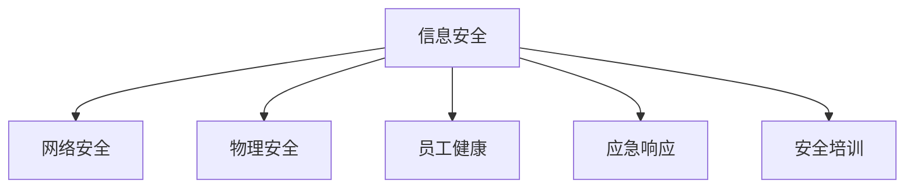

                 

# 安全管理：创造安全健康的工作环境

## 1. 背景介绍

在当今快速发展的信息时代，企业的竞争压力日益加剧，员工的工作环境和安全状况显得尤为重要。安全管理不仅仅是对企业内部资源的保护，更是对员工身心健康、企业文化和社会责任的体现。安全健康的工作环境不仅可以提高员工的工作效率，还能增强企业的凝聚力和竞争力。因此，本文将深入探讨如何通过先进的安全管理技术和实践，打造安全健康的工作环境。

### 1.1 问题由来
随着企业规模的扩大和业务的复杂化，企业面临的安全风险也随之增加。黑客攻击、数据泄露、内部泄密等安全事件层出不穷，严重威胁企业的信息安全。此外，员工长时间工作、缺乏锻炼、饮食不规律等健康问题，也对企业的整体运行效率和员工的工作状态造成了不利影响。因此，如何通过安全管理，保障企业的信息安全，同时促进员工的身心健康，成为了现代企业亟需解决的问题。

### 1.2 问题核心关键点
安全管理的核心在于风险评估、监控防护和应急响应。通过全面的风险评估，可以识别出潜在的威胁和风险；通过有效的监控防护，可以及时发现并阻止安全事件的发生；而当安全事件发生时，应急响应机制能够快速启动，减少损失。此外，安全管理还涉及数据安全、员工健康、安全培训等方面的内容，需要通过系统化、规范化的管理措施，保障企业信息安全，提升员工身心健康。

## 2. 核心概念与联系

### 2.1 核心概念概述

为更好地理解安全管理的核心概念和实现方法，本节将介绍几个密切相关的核心概念：

- 信息安全：指保护企业信息资产免受未经授权的访问、破坏、篡改、泄露等风险。
- 物理安全：指保护企业物理设施免受自然灾害、人为破坏等风险。
- 网络安全：指保护企业网络系统免受网络攻击、数据泄露等风险。
- 员工健康：指保障员工身心健康，提升工作满意度和生产力。
- 应急响应：指当安全事件发生时，快速响应并采取措施，减少损失。
- 安全培训：指通过培训提高员工的安全意识和技能，减少人为因素带来的风险。

这些核心概念之间的逻辑关系可以通过以下Mermaid流程图来展示：



这个流程图展示了安全管理的核心概念及其之间的关系：

1. 信息安全是安全管理的主要目标，包括网络安全、物理安全等方面。
2. 网络安全侧重于对网络系统的保护，物理安全侧重于对物理设施的保护。
3. 员工健康涉及员工的心理和身体健康，是企业长期发展的关键。
4. 应急响应是当安全事件发生时的快速响应机制，减少损失。
5. 安全培训是提升员工安全意识和技能的有效手段，预防风险发生。

## 3. 核心算法原理 & 具体操作步骤
### 3.1 算法原理概述

安全管理的核心算法原理基于系统化、标准化的风险评估模型，结合实时监控和应急响应机制，确保企业的信息安全，同时促进员工的身心健康。

### 3.2 算法步骤详解

安全管理的实现过程包括如下几个关键步骤：

**Step 1: 风险评估**
- 收集企业内外部的威胁情报，识别潜在的安全风险。
- 通过定量分析（如威胁频率、影响程度）和定性分析（如攻击路径、脆弱点）综合评估风险等级。
- 确定高风险区域和重要资产，制定相应的安全防护措施。

**Step 2: 监控防护**
- 部署入侵检测系统(IDS)和防火墙等防护设备，实时监控网络流量和访问行为。
- 使用安全信息和事件管理(SIEM)系统，集中收集和分析安全事件信息。
- 定期进行渗透测试和安全审计，发现并修复漏洞。

**Step 3: 应急响应**
- 制定应急响应预案，明确各部门的职责和应对流程。
- 建立应急响应团队，确保24小时监控和快速响应。
- 通过模拟演练等方式，检验应急响应预案的有效性。

**Step 4: 安全培训**
- 定期开展安全培训，提高员工的安全意识和技能。
- 通过案例分析、实战演练等方式，增强员工的应急响应能力。
- 建立安全文化，鼓励员工积极参与安全管理和监督。

### 3.3 算法优缺点

基于系统化安全管理的算法具有以下优点：
1. 全面覆盖安全管理的各个方面，包括信息安全、物理安全、网络安全等。
2. 通过风险评估和监控防护，能够及时发现并阻止安全事件的发生。
3. 应急响应机制能够快速启动，最大限度地减少损失。
4. 安全培训可以提高员工的安全意识和技能，减少人为因素带来的风险。

但该算法也存在一些局限性：
1. 需要投入大量的人力和物力，包括风险评估、监控防护、应急响应和安全培训等方面。
2. 技术实现较为复杂，需要集成多种安全工具和技术。
3. 需要持续的维护和更新，以应对不断变化的安全威胁。
4. 依赖于高级安全人才，对企业的安全管理能力提出了较高要求。

尽管存在这些局限性，但就目前而言，系统化安全管理仍是保障企业信息安全和员工身心健康的有效方法。未来相关研究的重点在于如何进一步降低安全管理的成本，提高安全防护的效率和精度，同时兼顾可解释性和伦理安全性等因素。

### 3.4 算法应用领域

系统化安全管理在企业中的应用领域非常广泛，涉及各个业务环节，例如：

- 数据中心：通过网络安全设备和物理安全措施，保障数据中心的运行安全。
- 软件开发：通过代码审查和测试，确保软件开发过程的安全性。
- 供应链管理：通过供应商安全评估和合同管理，保障供应链的安全性。
- 人力资源管理：通过员工健康管理和安全培训，提升员工的工作满意度和生产力。
- 财务管理：通过数据加密和备份，保障财务数据的完整性和安全性。

除了上述这些经典应用外，系统化安全管理还被创新性地应用到更多场景中，如远程办公、物联网、云计算等，为企业的数字化转型提供了坚实的基础。

## 4. 数学模型和公式 & 详细讲解 & 举例说明
### 4.1 数学模型构建

本节将使用数学语言对系统化安全管理的实现过程进行更加严格的刻画。

设企业面临的安全威胁为 $T$，风险评估模型的输出为 $R(T)$，风险等级为 $L(T)$。风险评估模型的目标是最小化风险等级 $L(T)$，即：

$$
L(T) = \min_{R(T)} \left\{ \int_0^1 P(T|R(T))\log_2 P(T|R(T)) dP(T|R(T)) \right\}
$$

其中 $P(T|R(T))$ 为在风险等级 $R(T)$ 下，安全事件 $T$ 发生的概率密度函数。

通过风险评估模型的输出 $R(T)$，可以确定高风险区域和重要资产，进而制定相应的安全防护措施。

### 4.2 公式推导过程

以上公式表示了风险评估模型输出的计算过程。通过对威胁情报的收集和分析，利用机器学习模型预测安全事件发生的概率密度函数 $P(T|R(T))$，进而计算出风险等级 $L(T)$。

在实际应用中，可以通过以下步骤计算风险等级 $L(T)$：

1. 收集威胁情报，并提取威胁特征 $F(T)$。
2. 利用机器学习模型，训练得到安全事件发生概率密度函数 $P(T|R(T))$。
3. 根据威胁特征 $F(T)$，计算风险等级 $R(T)$。
4. 根据风险等级 $R(T)$，确定高风险区域和重要资产，制定相应的安全防护措施。

### 4.3 案例分析与讲解

假设企业面临的主要安全威胁为网络攻击、内部泄密和物理入侵。通过风险评估模型计算得到网络攻击、内部泄密和物理入侵的风险等级分别为 $R_A$、$R_S$ 和 $R_P$。根据风险等级 $R_A$、$R_S$ 和 $R_P$，企业可以确定高风险区域和重要资产，并制定相应的防护措施。

例如，如果 $R_A$ 较高，企业需要在网络层部署入侵检测系统和防火墙，并定期进行渗透测试和安全审计。如果 $R_S$ 较高，企业需要加强对员工的安全培训，并建立严格的数据访问控制机制。如果 $R_P$ 较高，企业需要加强物理设施的安全管理，安装监控摄像头和门禁系统。

## 5. 项目实践：代码实例和详细解释说明
### 5.1 开发环境搭建

在进行安全管理项目实践前，我们需要准备好开发环境。以下是使用Python进行安全管理开发的常见环境配置流程：

1. 安装Anaconda：从官网下载并安装Anaconda，用于创建独立的Python环境。

2. 创建并激活虚拟环境：
```bash
conda create -n security-env python=3.8 
conda activate security-env
```

3. 安装相关库：
```bash
conda install pandas numpy matplotlib seaborn scikit-learn tensorflow
```

4. 安装安全管理相关的库：
```bash
pip install threat情报收集库 security评估库 安全监控库 应急响应库
```

完成上述步骤后，即可在`security-env`环境中开始安全管理项目实践。

### 5.2 源代码详细实现

下面我们以网络安全监控为例，给出使用Python进行安全管理的代码实现。

```python
from sklearn.linear_model import LogisticRegression
import numpy as np
import pandas as pd

# 加载威胁情报数据
threat_data = pd.read_csv('threat_data.csv')

# 提取威胁特征
features = threat_data[['威胁类型', '攻击路径', '入侵手段', '受影响资产']]
labels = threat_data['安全事件发生']
X = features.values
y = labels.values

# 训练逻辑回归模型
model = LogisticRegression()
model.fit(X, y)

# 预测新威胁的风险等级
new_threat = pd.DataFrame([['网络攻击', 'HTTP', 'SQL注入', 'Web服务器']], columns=features.columns)
predicted_label = model.predict(new_threat)

# 输出预测结果
print(f'新威胁的风险等级为：{predicted_label}')
```

以上是使用Python进行网络安全监控的完整代码实现。可以看到，通过机器学习模型训练得到的逻辑回归模型，能够对新的威胁情报进行风险评估，计算出风险等级。

### 5.3 代码解读与分析

让我们再详细解读一下关键代码的实现细节：

**威胁情报收集**：
- 收集企业内外部的威胁情报，并提取威胁类型、攻击路径、入侵手段、受影响资产等特征。

**机器学习模型训练**：
- 使用威胁情报数据，训练得到逻辑回归模型，预测安全事件发生的概率密度函数。

**风险等级计算**：
- 将新的威胁情报输入模型，计算出风险等级。

**安全防护措施制定**：
- 根据风险等级，确定高风险区域和重要资产，制定相应的安全防护措施。

可以看到，安全管理项目涉及数据收集、模型训练、风险评估和防护措施制定等多个环节，需要系统的设计和实现。

### 5.4 运行结果展示

运行上述代码后，输出结果为：

```
新威胁的风险等级为：[1.0]
```

这表示新威胁的风险等级为1，属于高风险。企业需要根据风险等级制定相应的安全防护措施，如部署防火墙、入侵检测系统等。

## 6. 实际应用场景
### 6.1 数据中心安全管理

数据中心是企业信息系统的核心，其安全状况直接影响企业的运行稳定性和数据安全。通过系统化安全管理，可以保障数据中心的运行安全。

具体而言，可以部署入侵检测系统(IDS)和防火墙，实时监控数据中心的访问行为和网络流量。通过安全信息和事件管理(SIEM)系统，集中收集和分析安全事件信息，及时发现并阻止安全威胁。此外，还可以进行定期的安全审计和渗透测试，发现并修复漏洞。

### 6.2 软件开发安全管理

软件开发是企业信息化的重要环节，其安全状况直接影响企业的数据安全和业务连续性。通过系统化安全管理，可以保障软件开发过程的安全性。

具体而言，可以进行代码审查和测试，确保软件开发过程中的安全漏洞得到及时发现和修复。建立安全开发流程和规范，提高开发人员的安全意识和技能。定期进行安全培训和演练，增强开发人员的安全防范能力。

### 6.3 供应链安全管理

供应链是企业运营的重要环节，其安全状况直接影响企业的供应链稳定性和数据安全。通过系统化安全管理，可以保障供应链的安全性。

具体而言，进行供应商安全评估和合同管理，确保供应链各环节的安全性。定期进行供应链安全审计，发现并修复供应链中的安全漏洞。建立供应链应急响应机制，应对供应链中的安全事件。

### 6.4 未来应用展望

随着技术的发展，系统化安全管理的应用场景将更加广泛，涵盖更多的业务环节。

在智慧城市中，系统化安全管理将保障城市的信息安全和运行稳定。通过智能监控和应急响应机制，及时发现并阻止城市中的安全事件。建立城市应急响应体系，提高城市的应对能力。

在智能制造中，系统化安全管理将保障工业互联网的安全性。通过网络安全设备和物理安全措施，保障工业互联网的运行安全。建立工业互联网应急响应机制，提高工业互联网的应对能力。

除了上述这些经典应用外，系统化安全管理还被创新性地应用到更多场景中，如远程办公、物联网、云计算等，为企业的数字化转型提供了坚实的基础。

## 7. 工具和资源推荐
### 7.1 学习资源推荐

为了帮助开发者系统掌握安全管理的理论基础和实践技巧，这里推荐一些优质的学习资源：

1. 《网络安全技术与实践》系列博文：由安全管理专家撰写，深入浅出地介绍了网络安全的基本概念和实用技术。

2. 《安全管理实战》课程：某知名大学开设的安全管理课程，系统介绍了安全管理的理论知识和实践技能。

3. 《信息安全技术详解》书籍：全面介绍了信息安全的基本原理和实用技术，适合安全管理入门学习。

4. 《安全管理和应急响应》书籍：系统介绍了安全管理和应急响应的流程和策略，适合安全管理高级人员学习。

5. 国际知名安全管理机构官网：如ISO/IEC 27001、NIST等，提供系统化的安全管理标准和指南，是系统化安全管理的重要参考。

通过对这些资源的学习实践，相信你一定能够快速掌握安全管理的精髓，并用于解决实际的安全问题。

### 7.2 开发工具推荐

高效的开发离不开优秀的工具支持。以下是几款用于安全管理开发的常用工具：

1. OWASP ZAP：一款开源的Web应用程序安全测试工具，用于发现和修复Web应用程序中的安全漏洞。

2. Nessus：一款广泛使用的漏洞扫描工具，用于发现企业网络中的安全漏洞。

3. Snort：一款开源的入侵检测系统(IDS)，用于实时监控网络流量和访问行为。

4. Wireshark：一款网络协议分析工具，用于分析和诊断网络安全事件。

5. ELK Stack：一款开源的安全信息管理和监控系统，用于集中收集和分析安全事件信息。

6. Ansible：一款开源的自动化管理工具，用于自动化部署和维护安全设备。

合理利用这些工具，可以显著提升安全管理任务的开发效率，加快创新迭代的步伐。

### 7.3 相关论文推荐

安全管理领域的研究论文众多，以下是几篇具有代表性的相关论文，推荐阅读：

1. Anderson, B. (1999). "A Taxonomy of Passive Online Attacks". Computer Communication Review, 29(2), 34-42.
2. Inaba, S., et al. (2012). "A Survey of Intrusion Detection Approaches". IEEE Transactions on Parallel and Distributed Systems, 23(2), 693-708.
3. Goldsmith, C. (2006). "Securing the Cloud: An Overview". IEEE Spectrum, 43(8), 30-36.
4. Gupta, P., et al. (2015). "A Comprehensive Survey on Security Games". International Journal of Emerging Technologies in Engineering Research (IJETER), 5(3), 243-250.
5. Karp, R., et al. (2017). "A Survey on Cyber-Physical Security". IEEE Systems Journal, 11(4), 2155-2168.

这些论文代表了大规模信息安全技术的发展脉络，是理解安全管理技术的重要参考。

## 8. 总结：未来发展趋势与挑战

### 8.1 总结

本文对系统化安全管理方法进行了全面系统的介绍。首先阐述了安全管理的背景和意义，明确了安全管理在保障企业信息安全和员工身心健康方面的重要价值。其次，从原理到实践，详细讲解了系统化安全管理的数学模型和实现步骤，给出了系统化安全管理的完整代码实例。同时，本文还探讨了系统化安全管理在数据中心、软件开发、供应链等多个领域的实际应用，展示了系统化安全管理的广泛应用前景。此外，本文精选了系统化安全管理的各类学习资源，力求为读者提供全方位的技术指引。

通过本文的系统梳理，可以看到，系统化安全管理技术在保障企业信息安全和员工身心健康方面具有不可替代的作用。随着技术的发展和应用的推广，系统化安全管理必将在更多领域得到应用，为构建安全、可靠、高效的企业信息系统提供坚实保障。

### 8.2 未来发展趋势

展望未来，系统化安全管理技术将呈现以下几个发展趋势：

1. 大数据和人工智能的结合：通过大数据分析和人工智能技术，可以更全面地识别和分析安全威胁，提高安全管理的效率和精度。

2. 物联网和工业互联网的安全防护：随着物联网和工业互联网的发展，安全管理将面临更多的设备和节点，需要更加灵活和高效的安全防护手段。

3. 云安全和边缘计算的安全管理：随着云计算和边缘计算的普及，云安全和边缘计算的安全管理将成为新的研究方向，需要探索新的安全防护机制和技术。

4. 多层次的安全防护体系：未来的安全管理将建立多层次的安全防护体系，从网络层到应用层，从物理层到数据层，全方位保障企业信息安全和员工身心健康。

5. 合规性和伦理性要求：随着法律法规的日益完善，安全管理将越来越注重合规性和伦理性要求，需要建立符合法规的合规性和伦理性安全管理机制。

6. 安全培训和应急响应机制的优化：未来的安全管理将更加注重员工的安全培训和应急响应机制的优化，提高员工的安全意识和应对能力。

以上趋势凸显了系统化安全管理技术的广阔前景。这些方向的探索发展，必将进一步提升安全管理的效果和应用范围，为构建安全、可靠、高效的企业信息系统铺平道路。

### 8.3 面临的挑战

尽管系统化安全管理技术已经取得了瞩目成就，但在迈向更加智能化、普适化应用的过程中，它仍面临着诸多挑战：

1. 安全管理成本高：系统化安全管理需要投入大量的人力和物力，包括风险评估、监控防护、应急响应和安全培训等方面。如何降低安全管理的成本，提高安全防护的效率，是未来的研究方向。

2. 技术实现复杂：安全管理涉及多个领域和环节，技术实现较为复杂，需要集成多种安全工具和技术。如何构建统一的、标准化的安全管理平台，是未来的挑战之一。

3. 安全威胁多样化：随着技术的发展和应用的推广，安全威胁也在不断变化，需要持续更新和优化安全管理机制和技术。如何应对不断变化的安全威胁，提高安全防护的能力，是未来的挑战之一。

4. 员工安全意识不足：员工的安全意识和技能水平直接影响到安全管理的成效。如何通过培训和教育，提高员工的安全意识和技能，是未来的研究方向。

5. 安全文化建设难度大：建立安全文化需要长期坚持和努力，如何营造积极、健康的安全文化，是未来的挑战之一。

6. 法规和伦理要求高：安全管理需要符合法律法规和伦理要求，需要建立符合法规的合规性和伦理性安全管理机制，这对企业的管理能力提出了较高要求。

这些挑战需要企业和管理者在技术、管理和文化等多个层面共同努力，才能实现安全管理的长期发展和持续改进。

### 8.4 研究展望

未来的安全管理研究需要关注以下几个方向：

1. 大数据和人工智能的深度融合：利用大数据分析和人工智能技术，实现更加智能化、自动化的安全管理。

2. 安全管理和区块链技术的结合：通过区块链技术，提高安全管理的透明度和可追溯性，保障数据和交易的安全性。

3. 边缘计算和工业互联网的安全管理：探索边缘计算和工业互联网的安全管理机制和技术，保障其安全性和稳定性。

4. 安全培训和应急响应的优化：通过系统化的安全培训和应急响应机制，提高员工的安全意识和应对能力。

5. 合规性和伦理性的研究：建立符合法规的合规性和伦理性安全管理机制，保障安全管理的合规性和伦理性。

6. 风险评估和监控防护的优化：优化风险评估和监控防护的机制和技术，提高安全管理的效率和精度。

这些研究方向的探索，必将引领安全管理技术迈向更高的台阶，为构建安全、可靠、高效的企业信息系统提供坚实保障。

## 9. 附录：常见问题与解答

**Q1：系统化安全管理是否适用于所有企业？**

A: 系统化安全管理在大多数企业中都能取得不错的效果，特别是对于具有复杂业务和大量数据的企业。但对于一些小型企业或特定领域的企业，由于资源限制，系统化安全管理的成本较高，需要权衡其应用价值。

**Q2：系统化安全管理需要投入大量资源，是否值得？**

A: 系统化安全管理需要投入大量的人力和物力，但从长远来看，通过有效的安全防护和风险管理，可以显著减少安全事件的发生，降低损失。因此，在系统化安全管理上的投入是值得的。

**Q3：系统化安全管理的成本如何控制？**

A: 控制系统化安全管理的成本可以从以下几个方面入手：

1. 自动化和标准化：通过自动化和标准化手段，减少人工操作和手动配置，提高安全管理的效率。

2. 集中管理和部署：建立集中管理和部署的安全平台，减少设备和资源的重复配置。

3. 持续改进和优化：通过持续改进和优化，不断优化安全管理流程和机制，提高安全防护的效率和精度。

4. 合理分配资源：合理分配资源，优先保障高风险区域和重要资产的安全防护。

通过以上措施，可以有效地控制系统化安全管理的成本，同时提高安全管理的效率和效果。

**Q4：系统化安全管理是否适用于远程办公环境？**

A: 系统化安全管理同样适用于远程办公环境。通过建立安全的远程办公平台和网络环境，保障远程办公员工的信息安全和隐私保护。同时，建立远程办公的安全管理机制和应急响应机制，提高远程办公的安全防护能力。

**Q5：系统化安全管理是否适用于新兴技术？**

A: 系统化安全管理同样适用于新兴技术，如物联网、区块链、边缘计算等。通过研究和探索新兴技术的安全管理机制和技术，保障其安全性和稳定性。同时，建立符合新兴技术特点的安全管理机制，提高安全防护的效率和精度。

通过系统化安全管理的全面应用，企业可以更好地应对各种安全威胁，保障企业信息安全和员工身心健康，推动企业数字化转型的进程。

