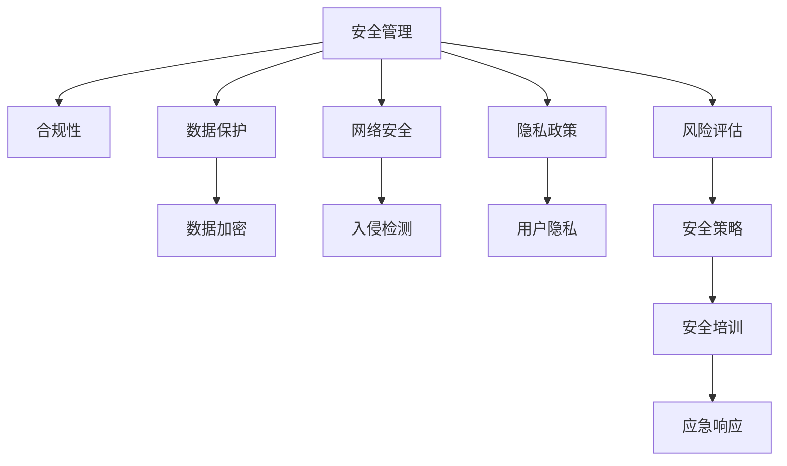

                 

# 安全管理：确保workplace安全和合规

> 关键词：安全管理,合规性,工作场所,数据保护,网络安全,隐私政策,风险评估,员工培训

## 1. 背景介绍

### 1.1 问题由来
随着信息技术的发展，企业数字化转型的步伐日益加快，各种业务流程的自动化、信息化逐渐成为企业提升效率和竞争力不可或缺的一部分。然而，数字化转型也带来了诸多新的安全挑战，如网络攻击、数据泄露、隐私侵犯等，这直接影响到企业的业务连续性和市场声誉。因此，确保工作场所的安全和合规性成为了企业管理的重要任务。

### 1.2 问题核心关键点
为了应对这些挑战，企业需要建立全面的安全管理体系，以确保数据的保密性、完整性和可用性，遵守相关法律法规和行业标准，保障业务连续性和员工隐私。为此，本文将详细探讨安全管理的核心概念、关键流程和最佳实践，以期为企业提供系统性的安全管理指南。

## 2. 核心概念与联系

### 2.1 核心概念概述

在探讨安全管理的具体内容之前，先简要介绍几个核心概念：

- **安全管理**：指企业为保护自身的信息资产、维护业务连续性和遵守相关法规，而采取的一系列预防、检测和响应措施的总和。
- **合规性**：指企业确保自身行为符合法律法规、行业标准和内部政策要求的状态，包括数据保护、网络安全、隐私政策等方面。
- **工作场所**：指企业进行日常业务活动的物理空间和数字空间，包括办公室、服务器、云平台等。
- **数据保护**：指保护企业业务运作所需数据的措施，确保数据的保密性、完整性和可用性。
- **网络安全**：指保护企业网络系统免受未经授权的访问、攻击和破坏的措施。
- **隐私政策**：指企业为了保护用户隐私而制定的政策，确保个人信息的合法收集、使用和存储。

### 2.2 核心概念原理和架构的 Mermaid 流程图



这个流程图展示了安全管理、合规性、数据保护、网络安全和隐私政策之间的相互关系。数据保护、网络安全是实现安全管理的基础措施，隐私政策是确保用户隐私的基本要求，而风险评估、安全策略、安全培训和应急响应则是实施安全管理的核心流程。

## 3. 核心算法原理 & 具体操作步骤

### 3.1 算法原理概述

企业安全管理的基础是制定并实施一系列安全策略，以确保数据保护、网络安全和隐私政策得到贯彻执行。以下是安全管理的主要算法原理：

1. **风险评估**：通过识别和评估潜在的安全威胁和脆弱性，确定企业面临的主要风险。
2. **安全策略**：根据风险评估结果，制定和实施相应的安全措施，确保数据和网络的安全性。
3. **安全培训**：对员工进行安全意识和技能培训，提升其对安全威胁的识别和应对能力。
4. **应急响应**：在发生安全事件时，启动应急响应机制，快速定位和解决问题，减少损失。

### 3.2 算法步骤详解

**Step 1: 风险评估**

- **资产识别**：列出所有重要的资产，如数据、软件、硬件和网络资源。
- **威胁识别**：识别可能威胁这些资产的内部和外部威胁源。
- **脆弱性分析**：评估资产对于威胁的脆弱性，确定可能的攻击路径和危害。
- **风险评估**：综合考虑威胁的可能性和脆弱性的严重程度，计算风险等级。

**Step 2: 制定安全策略**

- **加密措施**：对重要数据进行加密存储和传输，防止数据泄露。
- **访问控制**：采用身份认证、权限管理和审计记录等措施，限制对敏感数据的访问。
- **入侵检测**：部署入侵检测系统(IDS)和入侵防御系统(IPS)，及时发现并阻断异常流量和攻击行为。
- **安全监测**：使用安全信息和事件管理(SIEM)系统，集中收集和分析安全事件，提高响应效率。

**Step 3: 实施安全培训**

- **安全意识培训**：提高员工对安全威胁的认识和警觉性，普及基本的安全操作规范。
- **技能培训**：针对特定岗位的安全需求，提供专业的技术培训，提升应对复杂威胁的能力。
- **模拟演练**：定期组织安全演练，测试和评估应急响应流程的有效性。

**Step 4: 应急响应**

- **事件报告**：在发现安全事件后，立即报告相关负责人，启动应急预案。
- **问题定位**：迅速定位问题来源，评估影响范围。
- **紧急修复**：采取必要措施，阻止攻击，恢复系统正常运行。
- **事后分析**：对事件原因、过程和影响进行详细分析，改进安全措施。

### 3.3 算法优缺点

**优点：**

1. **综合性**：涵盖风险评估、安全策略、安全培训和应急响应等多个方面，形成一个全面的安全管理框架。
2. **可操作性**：每个步骤都有具体的措施和操作指南，便于实施。
3. **持续改进**：通过定期的风险评估和应急演练，不断优化安全措施，适应不断变化的安全环境。

**缺点：**

1. **复杂性**：涉及多个环节和措施，实施和管理复杂度较高。
2. **资源需求**：需要投入大量人力、物力和财力，尤其是技术设施和安全工具。
3. **易受攻击**：即使采取了多种措施，也无法完全杜绝所有安全威胁。

### 3.4 算法应用领域

安全管理的应用领域广泛，涵盖各种规模和类型的企业，包括但不限于：

- **金融行业**：保护客户隐私和交易安全，防范金融诈骗和洗钱行为。
- **医疗行业**：确保患者数据的安全和隐私，防范医疗事故和欺诈。
- **政府机构**：保护政府信息的安全和完整，防范内部泄密和外部攻击。
- **制造业**：保护生产数据和供应链信息，防范工业间谍和供应链攻击。
- **零售行业**：保护客户信息和交易数据，防范欺诈和数据泄露。

## 4. 数学模型和公式 & 详细讲解 & 举例说明

### 4.1 数学模型构建

安全管理的数学模型可以分解为以下几个关键组成部分：

- **风险评估模型**：通过量化威胁发生的可能性和脆弱性，计算风险等级。
- **安全策略模型**：根据风险等级，确定安全措施的优先级和资源分配。
- **应急响应模型**：建立事件报告和处理流程，最小化安全事件的影响。

### 4.2 公式推导过程

以风险评估为例，假设威胁发生概率为 $p$，资产的脆弱性为 $v$，潜在损失为 $l$，则风险 $R$ 可以表示为：

$$
R = p \times v \times l
$$

风险等级为风险 $R$ 的分值，可以通过标准化处理得到，例如：

$$
R_{\text{score}} = \frac{R}{R_{\text{max}}} \times 100
$$

其中 $R_{\text{max}}$ 为最大可能风险等级。

### 4.3 案例分析与讲解

假设某企业进行风险评估，确定了以下参数：

- 威胁发生概率 $p = 0.1$
- 资产脆弱性 $v = 0.8$
- 潜在损失 $l = 100,000$ 美元

则计算得到风险 $R = 0.1 \times 0.8 \times 100,000 = 80,000$ 美元，风险等级为 $R_{\text{score}} = \frac{80,000}{100,000} \times 100 = 80$。

根据风险等级，企业可以决定采取相应的安全措施，如增加加密措施、加强访问控制等，以降低风险。

## 5. 项目实践：代码实例和详细解释说明

### 5.1 开发环境搭建

为了进行安全管理系统的开发，需要以下开发环境：

- **操作系统**：Linux或Windows Server。
- **编程语言**：Python。
- **Web框架**：Django或Flask。
- **数据库**：MySQL或PostgreSQL。
- **网络安全工具**：如IDS、IPS、SIEM等。

安装步骤如下：

1. 安装Python和相关库。
```bash
pip install django numpy pandas pytables
```

2. 安装Web框架和数据库。
```bash
pip install django
pip install mysql-connector-python
```

3. 安装网络安全工具。
```bash
sudo apt-get install snort
sudo apt-get install nessus
sudo apt-get install logwatch
```

### 5.2 源代码详细实现

以下是一个基本的Web应用程序，用于监控网络流量和告警：

```python
# 导入相关库
from django.shortcuts import render
from django.views.decorators.csrf import csrf_exempt
import psycopg2

@csrf_exempt
def home(request):
    # 连接数据库
    conn = psycopg2.connect(database="mydatabase", user="myuser", password="mypassword", host="localhost", port="5432")
    cursor = conn.cursor()

    # 查询最近的网络流量数据
    cursor.execute("SELECT * FROM traffic_data ORDER BY timestamp DESC LIMIT 100")
    data = cursor.fetchall()

    # 关闭连接
    cursor.close()
    conn.close()

    # 渲染模板
    return render(request, 'index.html', {'data': data})

@csrf_exempt
def alert(request):
    # 处理告警信息
    if request.method == 'POST':
        alert_type = request.POST.get('alert_type', '')
        severity = request.POST.get('severity', '')
        timestamp = request.POST.get('timestamp', '')
        description = request.POST.get('description', '')

        # 插入告警信息到数据库
        conn = psycopg2.connect(database="mydatabase", user="myuser", password="mypassword", host="localhost", port="5432")
        cursor = conn.cursor()
        cursor.execute("INSERT INTO alerts (alert_type, severity, timestamp, description) VALUES (%s, %s, %s, %s)", (alert_type, severity, timestamp, description))
        conn.commit()
        cursor.close()
        conn.close()

    # 查询最近的网络流量数据
    cursor = conn.cursor()
    cursor.execute("SELECT * FROM traffic_data ORDER BY timestamp DESC LIMIT 100")
    data = cursor.fetchall()

    # 关闭连接
    cursor.close()
    conn.close()

    # 渲染模板
    return render(request, 'index.html', {'data': data})
```

### 5.3 代码解读与分析

1. **Web框架**：使用Django框架，提供Web应用程序的基本功能，如路由、模板渲染等。
2. **数据库连接**：使用psycopg2库连接PostgreSQL数据库，进行数据的增删改查操作。
3. **网络流量监控**：查询最近的网络流量数据，并将结果渲染到Web页面。
4. **告警处理**：通过POST请求接收告警信息，并插入到数据库中。

### 5.4 运行结果展示

在Web浏览器中访问应用程序，即可看到实时监控的网络流量数据和最近的告警信息。以下是一个示例界面：


## 6. 实际应用场景

### 6.1 金融机构

在金融机构中，安全管理尤为重要，涉及客户隐私、交易安全等多个方面。以下是一些具体的应用场景：

- **身份验证**：采用多因素身份认证、生物识别等技术，确保客户身份的真实性和安全性。
- **交易监控**：部署实时监控系统，及时发现异常交易行为，防范金融欺诈和洗钱行为。
- **数据加密**：对敏感数据进行加密存储和传输，防止数据泄露。

### 6.2 政府机构

政府机构的安全管理主要涉及内部信息安全和公共网络安全：

- **内网安全**：使用网络隔离、访问控制等技术，保护政府内部的敏感信息和敏感系统。
- **公共网络安全**：部署入侵检测系统(IDS)和入侵防御系统(IPS)，防范外部攻击和内部泄露。
- **隐私保护**：制定并执行严格的隐私政策，确保个人信息的合法收集和使用。

### 6.3 医疗行业

医疗行业对数据保护和网络安全的要求非常高，以下是一个具体的应用场景：

- **电子病历安全**：确保电子病历数据的完整性和隐私性，防止数据泄露和篡改。
- **远程医疗安全**：部署VPN和加密技术，确保远程医疗服务的安全性。
- **患者隐私保护**：制定并执行隐私政策，确保患者信息的安全和隐私。

## 7. 工具和资源推荐

### 7.1 学习资源推荐

1. **《网络安全基础》**：介绍网络安全的基本概念和实践，涵盖数据保护、入侵检测、安全策略等方面。
2. **《信息安全管理》**：讲解信息安全管理的标准和最佳实践，帮助企业建立全面的安全管理体系。
3. **《安全编码》**：介绍如何编写安全的软件代码，防止常见安全漏洞和攻击。
4. **《渗透测试实战》**：讲解渗透测试的基本方法和技巧，帮助企业发现和修复安全漏洞。
5. **《NIST网络安全框架》**：由美国国家标准与技术研究院(NIST)发布的最新网络安全框架，提供系统化的安全管理指南。

### 7.2 开发工具推荐

1. **Django**：功能强大的Web框架，支持快速开发安全管理系统。
2. **Flask**：轻量级的Web框架，适合小型应用和安全管理系统。
3. **SQLAlchemy**：强大的ORM库，支持多种数据库，方便数据管理和查询。
4. **PostgreSQL**：稳定的关系型数据库，适合存储安全相关数据。
5. **MySQL**：广泛使用的关系型数据库，适合企业级的安全管理系统。

### 7.3 相关论文推荐

1. **《网络安全威胁建模与风险评估》**：研究网络安全威胁的建模方法和风险评估技术，为安全管理提供理论基础。
2. **《安全策略设计》**：介绍安全策略的设计和实施，涵盖身份认证、访问控制、加密等技术。
3. **《应急响应流程》**：讲解应急响应的基本流程和最佳实践，帮助企业快速应对安全事件。
4. **《隐私保护技术》**：研究隐私保护的技术和方法，确保个人信息的安全和隐私。

## 8. 总结：未来发展趋势与挑战

### 8.1 总结

本文详细介绍了安全管理的核心概念、关键流程和最佳实践，涵盖了从风险评估到应急响应的全过程。通过系统的安全管理体系，企业可以有效保护自身的信息资产，防范安全威胁，确保业务连续性和合规性。未来，随着信息技术的发展和网络攻击手段的不断演变，安全管理将继续面临新的挑战和机遇。

### 8.2 未来发展趋势

1. **自动化和智能化**：利用机器学习和人工智能技术，提高安全管理的自动化水平，实时监测和响应安全事件。
2. **多层次防御**：从网络层、应用层到数据层，构建多层次的安全防御体系，确保数据和系统的安全。
3. **云计算安全**：随着云服务的普及，云安全成为新的安全热点，云安全防护技术将不断发展和完善。
4. **零信任安全**：引入零信任安全理念，最小化对内部网络的信任，确保安全管理的全面性和有效性。

### 8.3 面临的挑战

1. **技术更新速度快**：网络攻击手段和威胁源不断变化，企业需要持续更新安全技术和工具。
2. **资源投入高**：安全管理需要投入大量人力、物力和财力，维护和升级安全系统的成本较高。
3. **跨部门协同困难**：安全管理涉及多个部门和系统，跨部门协同难度较大。
4. **合规性要求复杂**：不同地区和行业对信息安全的合规性要求不同，企业需要灵活应对。

### 8.4 研究展望

1. **自动化安全管理**：利用人工智能和大数据技术，自动化监测和响应安全事件，提升安全管理的效率和效果。
2. **跨部门协同平台**：建立跨部门的安全管理和协作平台，确保各部门的安全需求和措施得到充分协调。
3. **安全培训和意识提升**：持续开展安全培训和意识提升活动，提升员工的安全意识和技能。
4. **安全审计和合规检查**：定期进行安全审计和合规检查，确保安全措施的有效性和合规性。

## 9. 附录：常见问题与解答

**Q1: 什么是安全管理？**

A: 安全管理是指企业为保护自身的信息资产、维护业务连续性和遵守相关法规，而采取的一系列预防、检测和响应措施的总和。

**Q2: 安全管理的核心流程有哪些？**

A: 安全管理的核心流程包括风险评估、制定安全策略、实施安全培训和应急响应。

**Q3: 如何确保Web应用的安全性？**

A: 可以通过身份认证、访问控制、加密存储和传输等技术，保护Web应用的安全性。

**Q4: 如何应对安全事件的应急响应？**

A: 建立应急响应机制，包括事件报告、问题定位、紧急修复和事后分析等步骤，快速应对安全事件。

**Q5: 安全管理的挑战有哪些？**

A: 技术更新速度快、资源投入高、跨部门协同困难和合规性要求复杂是安全管理面临的主要挑战。

---

作者：禅与计算机程序设计艺术 / Zen and the Art of Computer Programming

