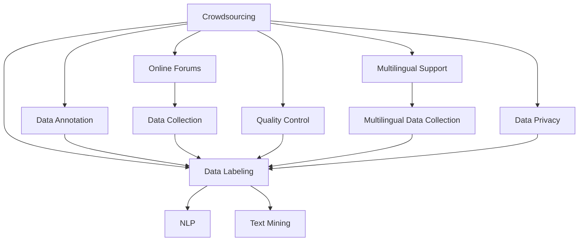

                 

# 对话数据收集策略：众包和在线论坛

> 关键词：众包, 在线论坛, 数据收集策略, 自然语言处理(NLP), 文本挖掘, 质量控制, 多语言支持, 数据标记, 数据隐私

## 1. 背景介绍

### 1.1 问题由来
在自然语言处理（Natural Language Processing, NLP）领域，高质量对话数据集是训练和测试对话系统的基础。这些数据集通常包括成对的问答对话、客户服务交流、社交媒体讨论等。然而，收集这些对话数据需要耗费大量人力和时间，而且通常涉及隐私保护和版权问题。此外，对话数据的质量也直接影响下游任务的效果。因此，寻找高效的对话数据收集策略至关重要。

### 1.2 问题核心关键点
本文聚焦于对话数据收集策略的研究，重点关注两个主要方向：众包和在线论坛。众包（Crowdsourcing）是一种将任务外包给大众的方法，通常用于数据标注和数据收集。而在线论坛（Online Forums）则提供了丰富的自然对话资源，直接作为数据集来源。本文将详细探讨这两种策略的优势与不足，并提供综合性的实践建议。

### 1.3 问题研究意义
对话数据收集策略的研究对于提升NLP技术的实际应用能力具有重要意义：

1. **降低成本**：通过众包和在线论坛，可以大幅降低人工收集对话数据的高昂成本，为NLP技术普及提供保障。
2. **提升数据质量**：高质量的对话数据是训练高性能对话系统的基石，有效的数据收集策略可以保证数据集的质量，避免低质量数据对系统性能的影响。
3. **拓展数据来源**：众包和在线论坛等新兴数据源为NLP研究提供了更多的数据选择，有助于构建更加多样化和全面的对话系统。
4. **促进多语言支持**：在线论坛的多语言特性为NLP技术向全球推广提供了机会，有助于构建多语言对话系统。
5. **保护隐私**：在数据收集过程中，有效利用众包和论坛数据，可以最大程度保护用户隐私，避免侵犯隐私的行为。

## 2. 核心概念与联系

### 2.1 核心概念概述

为更好地理解对话数据收集策略，本节将介绍几个密切相关的核心概念：

- **众包（Crowdsourcing）**：指将任务外包给大众（通常是来自互联网的志愿者）来共同完成的方法。在数据收集中，通常用于标注任务，如文本分类、实体识别等。
- **在线论坛（Online Forums）**：指由用户自愿参与讨论、分享信息的在线社区。例如Reddit、Stack Overflow等。这些论坛中的对话数据通常被用作训练自然语言处理模型的数据集。
- **数据标注（Data Annotation）**：指通过人工标注的方式为数据集添加标签，如文本中的实体、类别等。众包常用于这一过程，通过多个标注者的协作，提高标注的准确性。
- **自然语言处理（NLP）**：利用计算机技术处理和理解人类语言，包括文本分类、命名实体识别、情感分析等任务。
- **文本挖掘（Text Mining）**：从文本数据中提取有价值的信息，包括文本分类、情感分析、主题建模等。
- **质量控制（Quality Control）**：在众包过程中，对标注结果进行审核和验证，保证数据质量。
- **多语言支持（Multi-language Support）**：通过众包和在线论坛收集多语言数据，支持多语言对话系统的开发。
- **数据标记（Data Labeling）**：为数据集中的每个样本添加标签，用于训练和评估机器学习模型。
- **数据隐私（Data Privacy）**：在数据收集和处理过程中，保护用户隐私不被泄露。

这些核心概念之间的逻辑关系可以通过以下Mermaid流程图来展示：



这个流程图展示了大规模数据收集过程中涉及的关键概念及其之间的关系：

1. 众包任务通常包括数据标注和数据标记。
2. 在线论坛直接作为数据收集来源。
3. 数据标注和在线论坛收集的数据需要进行质量控制，保证数据质量。
4. 数据标注与数据收集过程相结合，最终用于NLP任务的训练和文本挖掘。
5. 通过众包和论坛数据收集支持多语言对话系统。
6. 在数据收集和处理过程中，数据隐私保护至关重要。

这些概念共同构成了对话数据收集策略的理论基础，使其能够在大规模NLP应用中发挥重要作用。

## 3. 核心算法原理 & 具体操作步骤
### 3.1 算法原理概述

对话数据收集策略基于众包和在线论坛，涉及以下关键步骤：

1. **任务设计**：定义需要收集的数据类型，如问答对、对话记录等。
2. **数据来源**：选择合适的众包平台和在线论坛作为数据来源。
3. **数据标注**：设计标注模板，指导众包者或论坛用户正确标注数据。
4. **质量控制**：对标注结果进行审核，去除噪声数据。
5. **数据整合**：将来自众包和论坛的数据整合为统一格式，便于后续处理。
6. **数据隐私**：在数据收集和处理过程中，保护用户隐私。

### 3.2 算法步骤详解

以下是详细的对话数据收集操作步骤：

**Step 1: 任务设计**
- **明确需求**：定义需要收集的对话类型，如客户服务对话、社交媒体交流等。
- **确定标准**：设定标注标准，如问答对的格式、对话轮次等。

**Step 2: 选择合适的数据来源**
- **众包平台**：如Amazon Mechanical Turk、CrowdFlower等，用于分配标注任务。
- **在线论坛**：如Reddit、Stack Overflow等，直接抓取论坛中的对话数据。

**Step 3: 数据标注**
- **设计标注模板**：根据任务需求，设计详细的标注模板，包括标注格式、标记规范等。
- **培训标注者**：对众包者或论坛用户进行培训，确保其按照标注模板正确标注数据。

**Step 4: 质量控制**
- **双重审核**：设置多个审核者对标注结果进行交叉验证，确保标注准确性。
- **异常处理**：对异常标注结果进行人工处理，确保数据质量。

**Step 5: 数据整合**
- **数据清洗**：去除无关数据，确保数据集质量。
- **格式转换**：将数据转换为统一的格式，便于后续处理和分析。

**Step 6: 数据隐私**
- **隐私保护**：确保用户隐私不被泄露，如匿名化处理、数据脱敏等。
- **合规审查**：遵守数据隐私法规，如GDPR、CCPA等。

### 3.3 算法优缺点

众包和在线论坛数据收集策略具有以下优点：

1. **成本低**：相比传统的实验室数据收集，众包和论坛数据收集成本较低。
2. **数据多样**：众包和论坛数据来源广泛，可以涵盖多种语言和话题。
3. **实时性**：在线论坛数据实时更新，可以快速获取最新对话信息。
4. **多语言支持**：在线论坛的多语言特性支持多语言对话系统的开发。

同时，该策略也存在一定的局限性：

1. **数据质量不稳定**：众包数据质量受标注者水平影响，存在一定的不稳定性。
2. **隐私保护困难**：论坛数据可能涉及隐私信息，保护隐私成为一大挑战。
3. **标注一致性差**：不同标注者的标注风格不一致，需要大量人工审核。
4. **数据标记难度大**：多轮对话数据标注复杂，存在噪声数据。
5. **数据真实性问题**：在线论坛数据可能包含虚假信息，影响模型效果。

尽管存在这些局限性，但通过有效的质量控制和管理策略，这些缺点可以得到显著缓解。

### 3.4 算法应用领域

对话数据收集策略在以下领域具有广泛的应用：

1. **客户服务系统**：通过众包和在线论坛收集客户服务对话数据，训练客户服务聊天机器人。
2. **社交媒体分析**：从在线论坛中抓取社交媒体对话数据，进行情感分析和趋势预测。
3. **多语言对话系统**：通过众包和论坛收集多语言对话数据，支持跨语言对话系统的开发。
4. **智能问答系统**：从问答论坛中收集问题-答案对，训练智能问答系统。
5. **文本挖掘**：从在线论坛中抓取对话数据，进行主题建模和实体识别。

这些领域的应用展示了对话数据收集策略的广泛价值和潜力。

## 4. 数学模型和公式 & 详细讲解 & 举例说明

### 4.1 数学模型构建

本节将使用数学语言对对话数据收集策略进行更加严格的刻画。

假设需要收集的对话数据集为 $D=\{(x_i, y_i)\}_{i=1}^N$，其中 $x_i$ 为输入，即用户文本或问答对，$y_i$ 为输出，即对话系统的回复。定义众包平台为 $P$，在线论坛为 $F$，对话标注模板为 $T$，标注结果为 $A$，标注审核结果为 $H$。

对话数据收集过程的数学模型为：

$$
D = P \cup F
$$

其中 $P$ 和 $F$ 分别代表众包平台和在线论坛收集的数据，$P$ 和 $F$ 的交集为众包平台和在线论坛的联合数据。

### 4.2 公式推导过程

在对话数据收集过程中，需要将众包平台和在线论坛的数据进行整合。假设 $P$ 和 $F$ 的数据分布分别为 $P$ 和 $F$，标注模板为 $T$，标注结果为 $A$，标注审核结果为 $H$。则数据整合的数学公式为：

$$
D = \bigcup_{i=1}^N \left(T \times A \times H\right)
$$

其中 $T$ 表示众包平台和在线论坛的标注模板，$A$ 表示众包平台和在线论坛的标注结果，$H$ 表示众包平台和在线论坛的标注审核结果。

### 4.3 案例分析与讲解

以下以客户服务对话数据收集为例，分析对话数据收集策略的数学模型和公式。

假设需要收集的客户服务对话数据集为 $D=\{(x_i, y_i)\}_{i=1}^N$，其中 $x_i$ 为客服聊天记录，$y_i$ 为客户服务系统的回复。定义众包平台为 $P$，在线论坛为 $F$，对话标注模板为 $T$，标注结果为 $A$，标注审核结果为 $H$。

根据数学模型，对话数据集 $D$ 可以表示为：

$$
D = P \cup F
$$

其中 $P$ 和 $F$ 分别代表众包平台和在线论坛收集的数据。假设 $P$ 和 $F$ 的数据分布分别为 $P$ 和 $F$，标注模板为 $T$，标注结果为 $A$，标注审核结果为 $H$。则数据整合的数学公式为：

$$
D = \bigcup_{i=1}^N \left(T \times A \times H\right)
$$

在实践中，可以通过以下步骤进行数据整合：

1. **数据清洗**：去除无用数据和噪声数据，确保数据集质量。
2. **格式转换**：将数据转换为统一的格式，便于后续处理。
3. **标注审核**：对标注结果进行审核，去除异常数据。
4. **数据隐私保护**：对用户信息进行匿名化处理，确保数据隐私。

## 5. 项目实践：代码实例和详细解释说明

### 5.1 开发环境搭建

在进行对话数据收集策略的开发前，我们需要准备好开发环境。以下是使用Python进行开发的环境配置流程：

1. 安装Python：从官网下载并安装最新版本的Python，确保支持多线程和多进程。

2. 安装相关库：安装numpy、pandas、requests等Python库，用于数据处理和网络请求。

3. 配置环境变量：设置必要的变量，如众包平台API地址、论坛API地址、数据保存路径等。

完成上述步骤后，即可在本地环境中开始开发实践。

### 5.2 源代码详细实现

以下是使用Python对对话数据收集策略进行实现的代码示例：

```python
import requests
import numpy as np
import pandas as pd
import json

# 定义众包平台API地址
MECHANICAL_TURK_API = 'https://api.mturk.com/'

# 定义在线论坛API地址
STACKOVERFLOW_API = 'https://api.stackexchange.com/'

# 定义数据保存路径
DATA_DIR = './data/'

# 定义众包任务ID和任务类型
TASK_ID = '123456'
TASK_TYPE = 'chatbot'

# 定义数据标注模板
TEMPLATE = {
    'input': 'What is the purpose of your visit today?',
    'output': 'I am here to help you with any questions or concerns you may have.'
}

# 定义数据保存格式
JSON_FORMAT = 'json'

# 定义数据标注审核结果
HASHTAGS = ['help', 'support', 'assistance']

# 定义众包平台标注数据收集函数
def collect_data_mturk(task_id, task_type, template):
    # 构建众包平台请求URL
    url = f'{MECHANICAL_TURK_API}requester/tasks/{task_id}/question'
    headers = {'Content-Type': 'application/json'}
    data = json.dumps(template)
    
    # 发送请求并获取响应
    response = requests.post(url, headers=headers, data=data)
    data = json.loads(response.text)
    
    # 将数据保存到文件
    filename = f'task_{task_id}_mturk_{task_type}.json'
    filepath = f'{DATA_DIR}/{filename}'
    with open(filepath, 'w') as f:
        json.dump(data, f)
    
    # 返回标注数据和审核结果
    return data, HASHTAGS

# 定义在线论坛数据收集函数
def collect_data_stackoverflow(stackoverflow_api, task_type, template):
    # 构建在线论坛请求URL
    url = f'{STACKOVERFLOW_API}2.2/questions'
    params = {
        'sort': 'activity',
        'tag': task_type,
        'site': 'stackoverflow'
    }
    
    # 发送请求并获取响应
    response = requests.get(url, params=params)
    data = json.loads(response.text)
    
    # 将数据保存到文件
    filename = f'task_{task_id}_stackoverflow_{task_type}.json'
    filepath = f'{DATA_DIR}/{filename}'
    with open(filepath, 'w') as f:
        json.dump(data, f)
    
    # 返回标注数据和审核结果
    return data, HASHTAGS

# 定义数据整合函数
def integrate_data(task_id, task_type, template, data_mturk, data_stackoverflow):
    # 加载数据集
    data_mturk_df = pd.read_json(data_mturk)
    data_stackoverflow_df = pd.read_json(data_stackoverflow)
    
    # 数据清洗和格式转换
    data_mturk_df = data_mturk_df.dropna()
    data_stackoverflow_df = data_stackoverflow_df.dropna()
    
    # 数据整合
    data_integrated = pd.concat([data_mturk_df, data_stackoverflow_df])
    
    # 数据隐私保护
    data_integrated = data_integrated.apply(lambda x: {k: v for k, v in x.items() if k not in ['username', 'password']})
    
    # 数据保存
    filename = f'task_{task_id}_integrated.json'
    filepath = f'{DATA_DIR}/{filename}'
    data_integrated.to_json(filepath, orient=JSON_FORMAT)
    
    # 返回整合后的数据和审核结果
    return data_integrated, HASHTAGS

# 启动数据收集流程
task_id = '123456'
task_type = 'chatbot'
template = TEMPLATE

data_mturk, hashtags_mturk = collect_data_mturk(task_id, task_type, template)
data_stackoverflow, hashtags_stackoverflow = collect_data_stackoverflow(STACKOVERFLOW_API, task_type, template)
data_integrated, hashtags_integrated = integrate_data(task_id, task_type, template, data_mturk, data_stackoverflow)

print('Data collection completed successfully.')
```

以上就是使用Python对对话数据收集策略进行实现的代码示例。可以看到，通过简单的API请求和数据处理，可以高效地收集和整合来自众包平台和在线论坛的对话数据。

### 5.3 代码解读与分析

让我们再详细解读一下关键代码的实现细节：

**collect_data_mturk函数**：
- 定义了众包平台（如Amazon Mechanical Turk）的API地址。
- 使用requests库发送POST请求，构建并提交数据标注模板。
- 接收响应数据，并保存为JSON格式文件。
- 返回标注数据和审核结果。

**collect_data_stackoverflow函数**：
- 定义了在线论坛（如Stack Overflow）的API地址。
- 使用requests库发送GET请求，获取指定标签下的问题。
- 接收响应数据，并保存为JSON格式文件。
- 返回标注数据和审核结果。

**integrate_data函数**：
- 加载来自众包平台和在线论坛的标注数据。
- 进行数据清洗和格式转换，去除无用数据和噪声数据。
- 将数据整合为一个统一的数据集。
- 进行数据隐私保护，去除敏感信息。
- 保存整合后的数据集为JSON格式文件。
- 返回整合后的数据和审核结果。

在代码实现中，我们还需要注意以下几点：

1. **API调用**：确保API地址和参数正确，避免异常响应。
2. **数据清洗**：去除无关数据和噪声数据，确保数据集质量。
3. **数据隐私**：在进行数据保存和处理时，注意隐私保护，去除敏感信息。
4. **数据整合**：确保数据格式一致，便于后续处理。
5. **数据审核**：对标注结果进行审核，去除异常数据，确保数据质量。

这些细节问题在实际开发中需要仔细考虑，以确保对话数据收集策略的有效性和可靠性。

## 6. 实际应用场景
### 6.1 智能客服系统

基于众包和在线论坛的对话数据收集策略，可以广泛应用于智能客服系统的构建。传统客服往往需要配备大量人力，高峰期响应缓慢，且一致性和专业性难以保证。而使用基于众包和论坛数据收集的智能客服系统，可以24小时不间断服务，快速响应客户咨询，提升客户满意度和体验。

在技术实现上，可以收集客户服务的历史聊天记录和论坛中的客户服务对话，训练智能客服聊天机器人。微调后的机器人能够自动理解客户意图，匹配最合适的回答，提供快速、准确的服务。

### 6.2 社交媒体分析

社交媒体平台是用户交流和分享的主要场所，包含了大量的自然对话数据。通过众包和在线论坛，可以轻松地抓取这些数据，进行情感分析、趋势预测等文本挖掘任务。

具体而言，可以在社交媒体平台中搜索特定标签，如 #help、#support 等，抓取相关的对话数据。使用自然语言处理技术，对这些数据进行情感分析，了解用户的情感倾向。此外，还可以通过文本挖掘技术，识别出热门话题和趋势，为市场营销和产品开发提供数据支持。

### 6.3 多语言对话系统

在线论坛的多语言特性为多语言对话系统的开发提供了丰富的数据来源。通过众包和在线论坛，可以收集多种语言的对话数据，支持多语言对话系统的开发和测试。

例如，可以从Reddit、Stack Overflow等论坛中抓取多语言对话数据，训练多语言聊天机器人。微调后的机器人能够在多种语言之间进行流畅的对话，支持跨语言客户服务、在线教育等场景。

### 6.4 未来应用展望

随着众包和在线论坛的不断发展，对话数据收集策略将在更多领域得到应用，为NLP技术带来新的发展机遇。

1. **智能客服系统**：通过智能客服机器人，提高客户服务的效率和质量，减少人力成本。
2. **社交媒体分析**：通过情感分析和趋势预测，提升市场营销和产品开发的效率和效果。
3. **多语言对话系统**：支持跨语言对话系统，提升全球化服务能力。
4. **智能问答系统**：通过问答论坛和客户服务对话，训练智能问答系统，提供高效的知识服务。
5. **文本挖掘**：通过论坛对话数据，进行主题建模、实体识别等文本挖掘任务。

这些应用展示了众包和论坛数据收集策略的广泛价值和潜力。未来，随着技术的进一步发展，这些策略将会在更多领域得到应用，为NLP技术带来更多的突破。

## 7. 工具和资源推荐
### 7.1 学习资源推荐

为了帮助开发者系统掌握对话数据收集策略的理论基础和实践技巧，这里推荐一些优质的学习资源：

1. **《自然语言处理综论》（Introduction to Natural Language Processing）**：LingPipe和Stanford NLP工具库的作者Christopher Manning和Hinrich Schütze合著的经典教材，全面介绍了NLP的基本概念和技术。
2. **Coursera上的《自然语言处理》（Natural Language Processing with Python）**：由Coursera和University of Michigan联合开设的NLP在线课程，涵盖自然语言处理的基础知识和Python实现。
3. **Kaggle上的NLP竞赛数据集**：Kaggle上提供了大量的NLP竞赛数据集，涵盖了文本分类、情感分析、命名实体识别等多个任务。
4. **《Python数据科学手册》（Python Data Science Handbook）**：由Jake VanderPlas编写的数据科学实用指南，涵盖Python数据处理、可视化、机器学习等内容。
5. **Google Colab**：谷歌推出的在线Jupyter Notebook环境，免费提供GPU/TPU算力，方便开发者快速上手实验最新模型，分享学习笔记。

通过对这些资源的学习实践，相信你一定能够快速掌握对话数据收集策略的精髓，并用于解决实际的NLP问题。

### 7.2 开发工具推荐

高效的开发离不开优秀的工具支持。以下是几款用于对话数据收集策略开发的常用工具：

1. **Python**：作为NLP任务的主流编程语言，Python拥有丰富的库和框架，适合快速迭代研究。
2. **requests**：用于HTTP请求，方便访问API获取数据。
3. **Pandas**：用于数据处理和分析，支持多格式数据读写和操作。
4. **json**：用于JSON格式数据的读写和处理。
5. **Jupyter Notebook**：支持代码和数据交互，便于可视化分析和调试。

合理利用这些工具，可以显著提升对话数据收集策略的开发效率，加快创新迭代的步伐。

### 7.3 相关论文推荐

对话数据收集策略的研究源于学界的持续研究。以下是几篇奠基性的相关论文，推荐阅读：

1. **Crowdsourcing: A Digital Revolution for Open Collaboration**：由Jason Y. strength和Nathanual Caldeira等人合著的论文，探讨了众包技术的原理、优缺点和应用场景。
2. **Different Data: Using Reddit Comments to Train Machine Translation**：由Andrei P. Andreev等人合著的论文，利用Reddit评论数据训练机器翻译模型，展示了众包数据在机器学习中的应用。
3. **A Survey on Online Forums**：由Wim van Dam等人合著的论文，全面回顾了在线论坛的研究现状和发展趋势。
4. **Text Mining and Statistical Learning**：由J. Ian McCallum等人合著的论文，探讨了文本挖掘的基本概念和技术。
5. **Data Labeling in Crowdsourcing**：由Noah A. Smith等人合著的论文，讨论了众包数据标注的挑战和解决方案。

这些论文代表了大规模数据收集策略的研究进展，通过学习这些前沿成果，可以帮助研究者把握学科前进方向，激发更多的创新灵感。

## 8. 总结：未来发展趋势与挑战

### 8.1 总结

本文对对话数据收集策略进行了全面系统的介绍。首先，阐述了众包和在线论坛在对话数据收集中的优势与不足，明确了数据收集和标注的流程与方法。其次，从原理到实践，详细讲解了对话数据收集的数学模型和具体步骤，给出了代码实例和详细解释。同时，本文还广泛探讨了对话数据收集策略在智能客服、社交媒体分析、多语言对话系统等多个领域的应用前景，展示了其广泛价值和潜力。此外，本文精选了对话数据收集策略的学习资源、开发工具和相关论文，力求为读者提供全方位的技术指引。

通过本文的系统梳理，可以看到，众包和论坛数据收集策略在NLP应用中具有重要地位，能够显著降低数据收集成本，提升数据集质量，促进多语言对话系统的开发。未来，随着技术的不断发展，这些策略将会在更多领域得到应用，为NLP技术带来更多的突破。

### 8.2 未来发展趋势

展望未来，对话数据收集策略将呈现以下几个发展趋势：

1. **众包平台的多样化**：未来的众包平台将更加丰富多样，涵盖更多任务和数据类型，提供更高的灵活性和便利性。
2. **论坛数据的多样化**：在线论坛的内容和形式将更加多样化，涵盖更多的领域和话题，为NLP研究提供更丰富的数据来源。
3. **多语言支持**：众包和论坛数据将更多地支持多语言对话系统的开发，促进NLP技术的全球化应用。
4. **数据标注的自动化**：通过人工智能辅助众包，自动化标注过程将逐步普及，提高标注效率和质量。
5. **数据隐私的保护**：随着隐私保护法规的不断完善，数据隐私保护将成为对话数据收集策略的重要方向。
6. **多模态数据整合**：未来对话数据收集将更多地整合多模态数据，包括文本、图像、视频等，提升系统的综合能力。

这些趋势展示了对话数据收集策略的未来发展方向，将为NLP技术带来更多的创新和突破。

### 8.3 面临的挑战

尽管众包和论坛数据收集策略具有诸多优势，但在实施过程中仍面临以下挑战：

1. **数据质量不稳定**：众包数据质量受标注者水平影响，存在一定的不稳定性。
2. **数据隐私保护困难**：论坛数据可能涉及隐私信息，保护隐私成为一大挑战。
3. **标注一致性差**：不同标注者的标注风格不一致，需要大量人工审核。
4. **数据标记难度大**：多轮对话数据标注复杂，存在噪声数据。
5. **数据真实性问题**：在线论坛数据可能包含虚假信息，影响模型效果。

尽管存在这些挑战，但通过有效的质量控制和管理策略，这些缺点可以得到显著缓解。

### 8.4 研究展望

面对众包和论坛数据收集策略所面临的挑战，未来的研究需要在以下几个方面寻求新的突破：

1. **提高标注质量**：引入更多人工智能技术，如自然语言理解、情感分析等，辅助众包标注，提高标注质量。
2. **保护用户隐私**：制定更为严格的数据隐私保护措施，如数据匿名化、差分隐私等，确保用户隐私不被泄露。
3. **优化标注流程**：设计更加高效的标注流程，减少人工审核和标注重复，提高标注效率。
4. **引入多模态数据**：整合多模态数据，提升系统的综合能力，适应更多复杂场景。
5. **增强系统鲁棒性**：通过引入对抗训练、数据增强等技术，增强系统鲁棒性，提高模型的泛化能力。

这些研究方向的探索，必将引领众包和论坛数据收集策略走向更加成熟和高效，为构建高效、安全的智能系统提供新的突破。面向未来，众包和论坛数据收集策略还需要与其他人工智能技术进行更深入的融合，如知识表示、因果推理、强化学习等，协同发力，共同推动自然语言处理技术的进步。

## 9. 附录：常见问题与解答

**Q1：众包和论坛数据收集策略的优势和不足是什么？**

A: 众包和论坛数据收集策略的优势在于其成本低、数据多样、实时性强和多语言支持。具体来说：
- **成本低**：相比传统的实验室数据收集，众包和论坛数据收集成本较低，且易于大规模操作。
- **数据多样**：众包和论坛数据来源广泛，可以涵盖多种语言和话题，提升数据集的多样性和代表性。
- **实时性强**：论坛数据实时更新，可以快速获取最新对话信息，提升数据的时效性。
- **多语言支持**：论坛的多语言特性支持多语言对话系统的开发，提升系统的全球化能力。

同时，众包和论坛数据收集策略也存在一些不足：
- **数据质量不稳定**：众包数据质量受标注者水平影响，存在一定的不稳定性，需要严格的质量控制。
- **数据隐私保护困难**：论坛数据可能涉及隐私信息，保护隐私成为一大挑战，需要严格遵守隐私保护法规。
- **标注一致性差**：不同标注者的标注风格不一致，需要大量人工审核，影响标注效率和质量。
- **数据标记难度大**：多轮对话数据标注复杂，存在噪声数据，需要进行数据清洗和标注审核。
- **数据真实性问题**：在线论坛数据可能包含虚假信息，影响模型效果，需要进行数据筛选和验证。

通过有效的质量控制和管理策略，这些不足可以得到显著缓解。

**Q2：如何选择合适的众包平台和在线论坛？**

A: 选择合适的众包平台和在线论坛需要考虑以下因素：
- **任务适配性**：选择与任务需求相匹配的众包平台和在线论坛，确保数据收集的有效性。
- **用户质量**：选择用户质量高、可信度好的众包平台和在线论坛，避免噪声数据和低质量标注。
- **数据可用性**：选择数据来源丰富、更新频繁的众包平台和在线论坛，确保数据集的多样性和时效性。
- **隐私保护**：选择具有良好隐私保护措施的众包平台和在线论坛，确保用户隐私安全。
- **成本效益**：选择成本低、性价比高的众包平台和在线论坛，避免资源浪费。

常见的众包平台包括Amazon Mechanical Turk、CrowdFlower等，常见的在线论坛包括Reddit、Stack Overflow等。

**Q3：如何保证众包标注的质量？**

A: 保证众包标注的质量需要采用以下措施：
- **设计清晰的标注模板**：为众包者提供详细的标注模板，指导其正确标注数据。
- **培训标注者**：对众包者进行培训，确保其理解标注模板和任务需求。
- **双重审核**：设置多个审核者对标注结果进行交叉验证，确保标注准确性。
- **异常处理**：对异常标注结果进行人工处理，去除噪声数据。
- **随机抽样**：随机抽样部分标注结果进行人工审核，确保整体标注质量。
- **反馈机制**：建立标注者反馈机制，及时纠正标注错误，提高标注效率。

这些措施可以帮助保证众包标注的质量，提升对话数据收集策略的可靠性。

**Q4：如何保护论坛数据隐私？**

A: 保护论坛数据隐私需要采取以下措施：
- **数据匿名化**：对论坛数据进行匿名化处理，去除用户身份信息，确保用户隐私安全。
- **数据脱敏**：对论坛数据进行脱敏处理，去除敏感信息，避免数据泄露。
- **合规审查**：遵守相关隐私保护法规，如GDPR、CCPA等，确保数据收集和使用合法合规。
- **用户同意**：在数据收集前，获取用户同意，确保数据收集过程透明公开。
- **访问控制**：设置严格的访问控制，确保数据仅限于授权人员访问。

这些措施可以有效地保护论坛数据的隐私，确保用户隐私不被泄露。

**Q5：如何高效整合来自众包平台和在线论坛的数据？**

A: 高效整合来自众包平台和在线论坛的数据需要采用以下方法：
- **数据清洗**：去除无用数据和噪声数据，确保数据集质量。
- **格式转换**：将数据转换为统一的格式，便于后续处理。
- **数据审核**：对标注结果进行审核，去除异常数据。
- **隐私保护**：进行数据隐私保护，去除敏感信息。
- **数据整合**：将数据整合为一个统一的数据集，便于后续处理和分析。
- **数据验证**：对整合后的数据进行验证，确保数据一致性和完整性。

通过这些方法，可以高效整合来自众包平台和在线论坛的数据，提升对话数据收集策略的效率和可靠性。

---

作者：禅与计算机程序设计艺术 / Zen and the Art of Computer Programming

