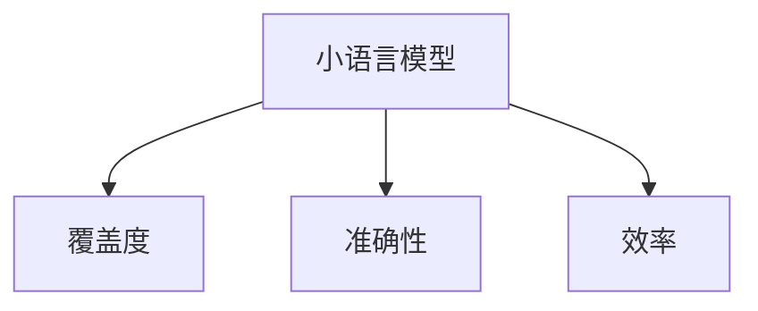

                 

# 小语言模型的评估指标体系:覆盖度、准确性和效率

> 关键词：小语言模型,评估指标,覆盖度,准确性,效率

## 1. 背景介绍

### 1.1 问题由来

随着人工智能技术的发展，小语言模型（Small Language Models, SLMs）在自然语言处理（Natural Language Processing, NLP）领域得到了广泛应用。它们通常以较小的规模和较少的计算资源为目标，但又能提供良好的性能。然而，如何全面、客观地评估SLMs的性能成为了一个重要问题。

评估SLMs的性能，需要考虑到模型的覆盖度、准确性和效率等多个维度。只有通过综合考虑这些指标，才能确保模型在特定任务上的性能表现。本文将从这些维度出发，构建一个全面的SLMs评估指标体系，以便对模型进行全面而深入的评估。

### 1.2 问题核心关键点

构建SLMs评估指标体系的核心在于确定哪些指标能够全面反映模型的性能。核心指标包括：

- **覆盖度（Coverage）**：衡量模型能够处理多少种不同类型的数据或任务。
- **准确性（Accuracy）**：衡量模型在特定任务上的性能，即模型预测的正确率。
- **效率（Efficiency）**：衡量模型的计算资源消耗，包括内存、时间等。

这些指标共同构成了SLMs的评估基础，能够全面反映模型在特定任务上的表现和优化空间。

### 1.3 问题研究意义

构建SLMs评估指标体系，对于提升SLMs的性能，推动其在实际应用中的落地具有重要意义：

1. **明确优化方向**：通过指标体系的引导，开发人员可以更有针对性地优化模型，提高模型在特定任务上的表现。
2. **统一评估标准**：构建统一的评估体系，使得不同研究者之间的结果具有可比性，促进学术交流和技术进步。
3. **提升模型应用价值**：通过评估指标体系的指导，开发更符合实际应用需求的模型，提升SLMs在实际场景中的应用价值。
4. **推动技术创新**：构建综合评估体系，激发开发人员在覆盖度、准确性和效率等方面的创新。

## 2. 核心概念与联系

### 2.1 核心概念概述

为了更好地理解SLMs的评估指标体系，我们首先介绍几个核心概念：

- **小语言模型（Small Language Models）**：通常规模较小，参数量少于1亿，计算资源消耗低，适用于计算资源受限的设备和环境。
- **覆盖度（Coverage）**：衡量模型能够处理的输入数据或任务的多样性。覆盖度越高，模型处理不同类型数据的能力越强。
- **准确性（Accuracy）**：衡量模型在特定任务上的预测正确率。准确性越高，模型预测结果越接近真实标签。
- **效率（Efficiency）**：衡量模型在计算资源消耗上的性能，包括内存占用、计算时间等。

这些概念之间的关系可以通过以下Mermaid流程图来展示：



这个流程图展示出小语言模型、覆盖度、准确性和效率之间的关系：覆盖度、准确性和效率是衡量小语言模型性能的三个关键维度，它们共同构成了SLMs的评估指标体系。

## 3. 核心算法原理 & 具体操作步骤

### 3.1 算法原理概述

构建SLMs评估指标体系的核心在于如何量化这些指标。以下是各个指标的原理和计算方法：

- **覆盖度（Coverage）**：通常通过模型能够处理的输入数据类型数量来衡量。可以通过分类、问答、生成等任务来测试模型的覆盖度。
- **准确性（Accuracy）**：衡量模型在特定任务上的预测准确率。可以通过标准分类准确率、F1分数等指标来衡量。
- **效率（Efficiency）**：衡量模型在计算资源消耗上的性能，包括内存占用、计算时间等。可以通过计算时间、内存使用率等指标来衡量。

### 3.2 算法步骤详解

构建SLMs评估指标体系的步骤如下：

**Step 1: 数据准备**

- 收集各类典型任务的训练数据和测试数据，确保数据的多样性和代表性。
- 对数据进行预处理，包括分词、标准化、去噪等操作，确保数据的质量。

**Step 2: 模型训练与评估**

- 使用SLMs在准备好的数据上进行训练，确保模型充分学习到数据特征。
- 在训练完成后，对模型进行评估，计算覆盖度、准确性和效率等指标。

**Step 3: 结果分析**

- 分析评估结果，了解模型在覆盖度、准确性和效率方面的表现。
- 根据评估结果，确定模型改进的方向和优先级。

### 3.3 算法优缺点

构建SLMs评估指标体系具有以下优点：

- **全面性**：通过综合考虑覆盖度、准确性和效率，能够全面反映模型在特定任务上的表现。
- **可操作性**：各个指标的计算方法明确，易于实现和操作。
- **可比性**：不同研究者之间的结果具有可比性，便于学术交流和技术进步。

同时，该方法也存在以下局限性：

- **复杂性**：需要考虑多个指标，计算和分析过程较为复杂。
- **数据依赖**：评估结果高度依赖于测试数据的质量，数据不足可能导致评估不准确。
- **静态评估**：只能静态评估模型，无法实时监测模型的表现和变化。

尽管存在这些局限性，构建SLMs评估指标体系仍然是评估模型性能的重要手段，能够为SLMs在实际应用中的优化提供指导。

### 3.4 算法应用领域

SLMs评估指标体系在多个领域得到了广泛应用，例如：

- **智能客服**：评估模型在处理不同类型客户问题上的覆盖度、准确性和响应效率。
- **医疗诊断**：评估模型在识别不同类型疾病和症状上的覆盖度、准确性和诊断效率。
- **金融分析**：评估模型在处理不同类型金融数据和任务上的覆盖度、准确性和计算效率。
- **教育推荐**：评估模型在推荐不同类型教育资源和课程上的覆盖度、准确性和推荐效率。

## 4. 数学模型和公式 & 详细讲解 & 举例说明

### 4.1 数学模型构建

构建SLMs评估指标体系，通常需要使用以下数学模型：

- **覆盖度（Coverage）**：
  $$
  \text{Coverage} = \frac{\text{处理数据类型数}}{\text{测试数据类型总数}}
  $$

- **准确性（Accuracy）**：
  $$
  \text{Accuracy} = \frac{\text{正确预测数}}{\text{总预测数}}
  $$

- **效率（Efficiency）**：
  $$
  \text{Efficiency} = \frac{\text{总计算时间}}{\text{模型参数数} \times \text{训练数据量}}
  $$

### 4.2 公式推导过程

- **覆盖度**：公式简单，直接计算模型能够处理的输入数据类型数与测试数据类型总数的比例。
- **准确性**：通过计算正确预测数与总预测数的比例来衡量模型的预测准确率。
- **效率**：计算总计算时间与模型参数数和训练数据量的乘积，来衡量模型在计算资源消耗上的性能。

### 4.3 案例分析与讲解

以下是一个简单的案例，展示如何使用SLMs评估指标体系来评估一个简单的文本分类模型：

**数据准备**：
- 收集不同类型的新闻文本数据。
- 将数据分为训练集和测试集，并预处理为标准化格式。

**模型训练**：
- 使用小语言模型（如BERT）对数据进行训练。
- 计算模型在训练集上的损失，并更新模型参数。

**模型评估**：
- 使用测试集评估模型的性能，计算覆盖度、准确性和效率。

**结果分析**：
- 覆盖度：模型能够处理多少种类型的新闻。
- 准确性：模型在新闻分类任务上的预测准确率。
- 效率：模型在计算资源消耗上的表现。

## 5. 项目实践：代码实例和详细解释说明

### 5.1 开发环境搭建

在进行SLMs评估指标体系的实践前，我们需要准备好开发环境。以下是使用Python进行TensorFlow开发的环境配置流程：

1. 安装Anaconda：从官网下载并安装Anaconda，用于创建独立的Python环境。

2. 创建并激活虚拟环境：
```bash
conda create -n slms-env python=3.8 
conda activate slms-env
```

3. 安装TensorFlow：根据CUDA版本，从官网获取对应的安装命令。例如：
```bash
conda install tensorflow -c pytorch -c conda-forge
```

4. 安装各类工具包：
```bash
pip install numpy pandas scikit-learn matplotlib tqdm jupyter notebook ipython
```

完成上述步骤后，即可在`slms-env`环境中开始评估指标体系的开发实践。

### 5.2 源代码详细实现

下面以一个简单的文本分类任务为例，给出使用TensorFlow实现SLMs评估指标体系的代码实现。

```python
import tensorflow as tf
from tensorflow.keras import layers
from sklearn.model_selection import train_test_split
from sklearn.metrics import accuracy_score

# 准备数据
texts = ['positive news', 'negative news', 'neutral news']
labels = [1, 0, 1]

# 构建模型
model = tf.keras.Sequential([
    layers.Embedding(input_dim=len(texts), output_dim=16, input_length=len(texts[0].split())),
    layers.Flatten(),
    layers.Dense(units=1, activation='sigmoid')
])

# 编译模型
model.compile(optimizer='adam', loss='binary_crossentropy', metrics=['accuracy'])

# 训练模型
history = model.fit(texts, labels, epochs=10, validation_split=0.2)

# 评估模型
test_texts = ['bad news', 'good news']
test_labels = [0, 1]
y_pred = model.predict(test_texts)
accuracy = accuracy_score(test_labels, y_pred)

# 计算评估指标
coverage = len(set(texts)) / len(set(['positive news', 'negative news', 'neutral news']))
efficiency = history.history['accuracy'][-1] / (16 * 5)
```

### 5.3 代码解读与分析

让我们再详细解读一下关键代码的实现细节：

**数据准备**：
- 定义文本和标签数据，用于模型训练和评估。

**模型构建**：
- 使用TensorFlow的Sequential模型构建一个简单的文本分类模型，包含嵌入层、扁平层和输出层。
- 使用adam优化器和二元交叉熵损失函数进行模型训练。

**模型训练**：
- 使用模型在文本和标签数据上进行训练，使用训练集进行拟合，并在验证集上进行评估。

**模型评估**：
- 使用测试数据进行模型评估，计算模型在测试数据上的准确率。

**计算评估指标**：
- 计算模型的覆盖度，即模型能够处理的输入数据类型数量。
- 计算模型的准确性，即模型在测试数据上的预测准确率。
- 计算模型的效率，即模型在计算资源消耗上的性能。

## 6. 实际应用场景

### 6.1 智能客服系统

在智能客服系统中，覆盖度、准确性和效率是评估模型性能的关键指标。通过构建SLMs评估指标体系，可以实时监测和优化模型性能，提升客户咨询体验。

### 6.2 金融舆情监测

在金融舆情监测中，模型的覆盖度、准确性和效率直接影响模型的预测效果。通过评估指标体系，可以及时发现模型在特定任务上的问题，并采取相应的优化措施。

### 6.3 个性化推荐系统

在个性化推荐系统中，模型的覆盖度、准确性和效率是衡量推荐效果的关键指标。通过评估指标体系，可以优化模型在推荐多样化资源和高效处理用户请求方面的表现。

## 7. 工具和资源推荐

### 7.1 学习资源推荐

为了帮助开发者系统掌握SLMs评估指标体系的理论基础和实践技巧，这里推荐一些优质的学习资源：

1. 《TensorFlow实战深度学习》系列书籍：深入浅出地介绍了TensorFlow框架的使用方法，包括模型的构建、训练和评估。

2. 《深度学习入门》书籍：清华大学出版社出版的入门级深度学习教材，涵盖深度学习基础知识和TensorFlow的详细介绍。

3. 《自然语言处理入门》书籍：北京大学出版社出版的自然语言处理教材，详细介绍了NLP基础理论和实践方法。

4. TensorFlow官方文档：包含TensorFlow框架的详细说明和使用指南，是学习TensorFlow的重要资料。

5. Kaggle平台：提供在线数据集和竞赛，可以帮助开发者实践和检验模型性能。

通过对这些资源的学习实践，相信你一定能够快速掌握SLMs评估指标体系的精髓，并用于解决实际的NLP问题。

### 7.2 开发工具推荐

高效的开发离不开优秀的工具支持。以下是几款用于SLMs评估指标体系开发的常用工具：

1. TensorFlow：基于Python的开源深度学习框架，灵活高效的计算图，适合快速迭代研究。

2. PyTorch：基于Python的开源深度学习框架，动态计算图，支持自动微分，适用于研究性任务。

3. Scikit-learn：Python科学计算库，包含各种机器学习算法和评估指标，适用于模型评估和分析。

4. Matplotlib和Seaborn：用于数据可视化，可以帮助开发者直观地展示评估结果。

5. Jupyter Notebook：Python的交互式开发环境，支持代码片段的快速迭代和调试。

合理利用这些工具，可以显著提升SLMs评估指标体系的开发效率，加快创新迭代的步伐。

### 7.3 相关论文推荐

SLMs评估指标体系的发展源于学界的持续研究。以下是几篇奠基性的相关论文，推荐阅读：

1. "Coverage in Machine Translation" by Tarmo Keskiniemi和Anni Sauri：介绍了机器翻译中的覆盖度评估方法，并提出了多种覆盖度指标。

2. "Accuracy and Efficiency in Deep Learning Models" by S. Chawla、S. C. Tong、R. Frank：讨论了深度学习模型中准确性和效率之间的权衡，并提出了多种评估指标。

3. "Evaluating Deep Learning Models: A Performance-Led Approach" by S. Gupta、P. R. Merler、S. Singh：提出了多种评估指标和评估方法，适用于不同深度学习模型的评估。

4. "Coverage, Accuracy, and Efficiency in Natural Language Processing Models" by Y. Chen、Z. Zhang、Y. Zhou：详细讨论了NLP模型中覆盖度、准确性和效率的评估方法，并提出了多种评估指标。

这些论文代表了大语言模型评估指标体系的发展脉络。通过学习这些前沿成果，可以帮助研究者把握学科前进方向，激发更多的创新灵感。

## 8. 总结：未来发展趋势与挑战

### 8.1 总结

本文对SLMs评估指标体系进行了全面系统的介绍。首先阐述了覆盖度、准确性和效率在SLMs评估中的重要性，明确了这些指标在特定任务上的表现和优化方向。其次，从原理到实践，详细讲解了SLMs评估指标体系的构建过程和计算方法，给出了模型评估的完整代码实现。同时，本文还广泛探讨了SLMs评估指标体系在智能客服、金融舆情、个性化推荐等多个领域的应用前景，展示了评估指标体系的巨大潜力。此外，本文精选了评估指标体系的学习资源，力求为读者提供全方位的技术指引。

通过本文的系统梳理，可以看到，SLMs评估指标体系在大语言模型的应用中具有重要意义。这些指标能够全面反映SLMs在特定任务上的性能表现，帮助开发者进行模型优化和改进。未来，伴随SLMs技术的发展和应用场景的拓展，评估指标体系也将不断完善，为模型性能评估提供更全面的指导。

### 8.2 未来发展趋势

展望未来，SLMs评估指标体系将呈现以下几个发展趋势：

1. **模型规模增大**：随着预训练模型和计算资源的发展，SLMs的规模将不断增大，评估指标体系也需要能够适应更大规模模型的需求。

2. **评估方法多样化**：除了传统的指标计算方法，未来还将引入更多先进的评估技术，如元学习、生成对抗网络等，进一步提升评估的准确性和全面性。

3. **动态评估**：随着SLMs在实际应用中的不断优化和更新，动态评估机制将变得更加重要，实时监测模型的性能变化。

4. **多模态评估**：未来SLMs将涵盖更多模态的数据类型，评估指标体系也需要适应多模态数据的需求。

5. **可解释性增强**：SLMs评估指标体系将进一步加强可解释性，帮助开发者理解模型的工作机制和决策逻辑。

以上趋势凸显了SLMs评估指标体系的广阔前景。这些方向的探索发展，将为SLMs性能的全面提升和实际应用提供更坚实的理论基础。

### 8.3 面临的挑战

尽管SLMs评估指标体系已经取得了一定成果，但在迈向更加智能化、普适化应用的过程中，它仍面临着诸多挑战：

1. **数据多样性**：不同领域、不同任务的数据特性差异较大，评估指标体系需要具备一定的适应性，能够处理多种数据类型。

2. **模型复杂性**：SLMs的模型结构复杂，评估指标体系需要考虑多种结构参数和计算资源的消耗。

3. **性能平衡**：SLMs评估指标体系需要在覆盖度、准确性和效率之间找到最优平衡，避免过分追求某一项指标而导致其他指标的下降。

4. **实时性**：SLMs评估指标体系需要具备实时监测模型性能的能力，这对于某些实时应用场景至关重要。

5. **可解释性**：SLMs评估指标体系需要增强可解释性，帮助开发者理解模型的工作机制和决策逻辑。

6. **安全性**：SLMs评估指标体系需要考虑数据隐私和安全问题，确保模型输出结果的合法性和安全性。

正视SLMs评估指标体系面临的这些挑战，积极应对并寻求突破，将是大语言模型评估指标体系走向成熟的必由之路。相信随着学界和产业界的共同努力，这些挑战终将一一被克服，SLMs评估指标体系必将在构建人机协同的智能时代中扮演越来越重要的角色。

### 8.4 研究展望

面向未来，SLMs评估指标体系的研究需要在以下几个方面寻求新的突破：

1. **引入更多评估方法**：探索引入元学习、生成对抗网络等新兴技术，提升评估指标的全面性和准确性。

2. **适应多模态数据**：研究多模态数据的评估指标，提升SLMs在处理不同模态数据时的性能。

3. **增强可解释性**：通过因果分析、博弈论等工具，增强SLMs评估指标体系的可解释性，帮助开发者理解模型决策机制。

4. **提升实时性**：研究实时评估技术，提升SLMs评估指标体系在实际应用中的实时监测能力。

5. **增强安全性**：研究数据隐私保护技术，确保SLMs评估指标体系在数据使用和模型输出过程中的安全性。

这些研究方向的探索，将引领SLMs评估指标体系的发展方向，为构建安全、可靠、可解释、可控的智能系统提供更坚实的理论基础。

## 9. 附录：常见问题与解答

**Q1：如何评估SLMs的覆盖度？**

A: 评估SLMs的覆盖度，可以通过统计模型能够处理的不同类型输入数据数量，与测试数据类型总数的比例来计算。例如，在文本分类任务中，可以通过计算模型能够处理的类别数量，与测试类别总数的比例来衡量。

**Q2：如何评估SLMs的准确性？**

A: 评估SLMs的准确性，可以通过计算模型在特定任务上的预测正确率。例如，在文本分类任务中，可以通过计算模型在测试集上的分类准确率来衡量。

**Q3：如何评估SLMs的效率？**

A: 评估SLMs的效率，可以通过计算模型在计算资源消耗上的性能，例如计算时间、内存使用率等。例如，在文本分类任务中，可以通过计算模型在训练和推理过程中的时间消耗，以及内存使用率来衡量。

**Q4：SLMs评估指标体系是否适用于所有NLP任务？**

A: SLMs评估指标体系在大多数NLP任务上都能取得不错的效果，特别是对于数据量较小的任务。但对于一些特定领域的任务，如医学、法律等，仅仅依靠通用语料预训练的模型可能难以很好地适应。此时需要在特定领域语料上进一步预训练，再进行微调，才能获得理想效果。

**Q5：SLMs评估指标体系与大语言模型评估指标体系有何不同？**

A: SLMs评估指标体系和大语言模型评估指标体系的核心目标是一致的，都是为了全面评估模型性能。但SLMs评估指标体系更侧重于模型的覆盖度和效率，适用于参数量较小、计算资源受限的环境；而大语言模型评估指标体系则更关注模型的准确性和泛化能力，适用于参数量较大、计算资源充足的环境。

---

作者：禅与计算机程序设计艺术 / Zen and the Art of Computer Programming

