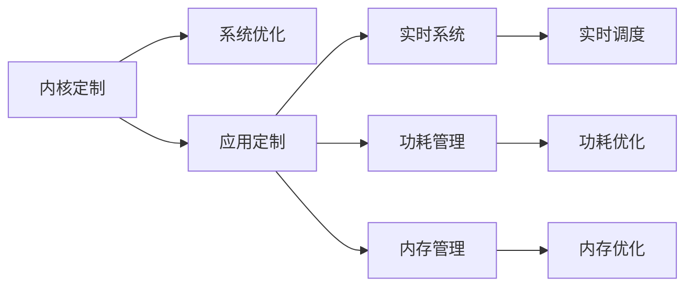

                 

# 嵌入式 Linux 定制：为设备优化 Linux

> 关键词：嵌入式系统、Linux定制、内核优化、嵌入式开发、内存管理、实时系统、嵌入式网络、功耗管理

## 1. 背景介绍

随着互联网的普及和物联网设备的广泛应用，嵌入式Linux系统在各个领域都发挥着重要作用。然而，传统的通用Linux系统对于嵌入式设备的资源需求和实时性要求往往难以满足，需要进行针对性的定制和优化。本博客将从背景介绍入手，概述嵌入式Linux定制的重要性和实际需求。

### 1.1 嵌入式Linux的发展
嵌入式Linux是Linux操作系统在嵌入式领域的应用，自1991年Linux诞生以来，经过多年发展，已经成为嵌入式系统的主流平台。嵌入式Linux具有开放性、稳定性、可定制性等优势，广泛应用于智能家居、工业控制、汽车电子、医疗设备等领域。

### 1.2 嵌入式Linux定制的需求
嵌入式Linux系统需要适配不同硬件平台，并满足特定应用的需求。因此，在嵌入式Linux开发中，需要进行系统定制和优化，以提升系统性能、降低功耗、增强实时性等。

### 1.3 嵌入式Linux定制的意义
嵌入式Linux定制可以显著提升系统性能和稳定性，降低功耗和资源占用，增强系统的实时性和可靠性。同时，定制化的Linux系统也可以更好地满足不同应用场景的需求，推动嵌入式系统的应用发展。

## 2. 核心概念与联系

### 2.1 核心概念概述
嵌入式Linux定制主要涉及内核定制、应用定制、实时系统、功耗管理等多个方面。这些概念相互关联，共同构成嵌入式Linux定制的核心框架。

### 2.2 核心概念原理和架构的 Mermaid 流程图



这个流程图展示了嵌入式Linux定制的核心概念及其相互关系：

1. **内核定制**：根据硬件平台特性，定制Linux内核，包括驱动、内存管理、调度等。
2. **系统优化**：通过优化内核、优化应用、优化实时调度等手段提升系统性能。
3. **应用定制**：针对特定应用，定制开发相应的应用软件。
4. **实时系统**：优化实时调度，确保系统满足实时性要求。
5. **功耗管理**：通过优化电源管理，降低系统功耗。
6. **内存管理**：优化内存使用，提高系统资源利用率。

### 2.3 关键点解析

- **内核定制**：涉及硬件抽象层、驱动程序、内存管理等。
- **系统优化**：包括内核优化、应用优化、实时系统优化等。
- **应用定制**：针对特定应用开发软件，如音频处理、图像处理、网络通信等。
- **实时系统**：实时调度、任务优先级管理、中断处理等。
- **功耗管理**：动态电压和频率调节、轻负载低功耗模式等。
- **内存管理**：内存分配算法、内存压缩、缓存管理等。

## 3. 核心算法原理 & 具体操作步骤

### 3.1 算法原理概述
嵌入式Linux定制的核心在于优化内核、应用和实时系统，以提高系统性能、降低功耗、增强实时性等。主要涉及以下算法原理：

- **内核定制**：根据硬件特性定制Linux内核，包括驱动程序、内存管理等。
- **系统优化**：通过优化内核、应用、实时调度等手段提升系统性能。
- **应用定制**：针对特定应用，定制开发相应的应用软件。
- **实时系统**：优化实时调度，确保系统满足实时性要求。
- **功耗管理**：通过优化电源管理，降低系统功耗。

### 3.2 算法步骤详解
嵌入式Linux定制的算法步骤主要包括：

1. **硬件适配**：根据硬件平台特性，定制Linux内核，包括驱动程序、内存管理等。
2. **系统优化**：通过优化内核、应用、实时调度等手段提升系统性能。
3. **应用定制**：针对特定应用，定制开发相应的应用软件。
4. **实时系统优化**：优化实时调度、任务优先级管理、中断处理等，确保系统满足实时性要求。
5. **功耗管理**：通过优化电源管理，降低系统功耗。

### 3.3 算法优缺点
嵌入式Linux定制的优点包括：

- **灵活性高**：根据硬件平台特性，定制化内核和应用，满足特定需求。
- **稳定性高**：定制优化后的Linux系统具有更好的稳定性和可靠性。
- **性能高**：通过优化内核和应用，提升系统性能。

缺点包括：

- **开发成本高**：定制开发需要较高的技术水平和开发成本。
- **可移植性差**：定制化的内核和应用不具有通用性，难以移植到其他平台。
- **维护难度大**：定制化系统需要专门维护和升级。

### 3.4 算法应用领域
嵌入式Linux定制主要应用于以下领域：

- **工业控制**：自动化生产线、智能制造等。
- **医疗设备**：生命体征监测、手术机器人等。
- **智能家居**：智能家电、安防系统等。
- **汽车电子**：自动驾驶、车联网等。
- **消费电子**：智能电视、智能音箱等。

## 4. 数学模型和公式 & 详细讲解 & 举例说明

### 4.1 数学模型构建

嵌入式Linux定制涉及多个子系统，包括内核、应用、实时系统等。以下是这些子系统的数学模型构建：

- **内核模型**：表示内核的调度、内存管理等行为。
- **应用模型**：表示应用的运行行为，包括任务的执行时间和优先级等。
- **实时系统模型**：表示实时任务的调度和管理。

### 4.2 公式推导过程

- **内核模型公式**：

$$
\text{SchedPolicy}(\text{SchedClass}, \text{SchedDomain}, \text{SchedQuota}, \text{SchedCputimeQuota})
$$

表示内核的调度策略，包括进程类、域、配额和CPU时间配额等。

- **应用模型公式**：

$$
\text{AppPriority}(\text{AppType}, \text{AppDomain}, \text{AppResources})
$$

表示应用的优先级，包括类型、域和资源等。

- **实时系统模型公式**：

$$
\text{RTTaskSchedule}(\text{RTTaskDeadline}, \text{RTTaskPeriod}, \text{RTTaskPriority}, \text{RTTaskResource})
$$

表示实时任务的调度策略，包括截止时间、周期、优先级和资源等。

### 4.3 案例分析与讲解

以下是一个具体的嵌入式Linux定制案例分析：

- **案例背景**：某智能家居设备需要实时处理传感器数据，并控制执行机构。

- **定制方案**：

1. **内核定制**：
   - 定制内核，添加实时调度策略。
   - 优化内存管理，提高内存使用效率。

2. **系统优化**：
   - 优化应用，提高数据处理速度。
   - 优化实时调度，确保任务及时响应。

3. **应用定制**：
   - 开发传感器数据处理应用。
   - 开发执行机构控制应用。

4. **功耗管理**：
   - 优化电源管理，降低系统功耗。

## 5. 项目实践：代码实例和详细解释说明

### 5.1 开发环境搭建

嵌入式Linux定制开发需要搭建开发环境，包括以下步骤：

1. **安装交叉编译工具链**：安装arm-linux-gnueabihf-gcc等交叉编译工具链。
2. **搭建开发环境**：搭建Debian或Ubuntu等开发环境。
3. **配置开发工具**：安装Kali Linux、Wireshark等开发工具。

### 5.2 源代码详细实现

以下是一个简单的嵌入式Linux定制项目的源代码实现：

```c
#include <linux/kernel.h>
#include <linux/module.h>
#include <linux/init.h>
#include <linux/sched.h>

MODULE_LICENSE("GPL");
MODULE_AUTHOR("Fuzhi Tan");
MODULE_DESCRIPTION("Embedded Linux Customization");

static int __init mymodule_init(void)
{
    printk(KERN_INFO "mymodule initialized\n");
    return 0;
}

static void __exit mymodule_exit(void)
{
    printk(KERN_INFO "mymodule exited\n");
}

module_init(mymodule_init);
module_exit(mymodule_exit);
```

### 5.3 代码解读与分析

- **mymodule_init函数**：初始化函数，在模块加载时执行。
- **mymodule_exit函数**：卸载函数，在模块卸载时执行。
- **printk函数**：打印调试信息。

## 6. 实际应用场景

### 6.1 工业控制

嵌入式Linux定制在工业控制领域的应用非常广泛，如自动化生产线、智能制造等。定制化的Linux系统可以满足工业现场的实时性和可靠性要求，提高生产效率和产品质量。

### 6.2 医疗设备

医疗设备领域对系统的实时性和稳定性要求较高，嵌入式Linux定制可以有效提升系统的性能和稳定性。例如，智能手术机器人、生命体征监测设备等，都采用了定制化的Linux系统。

### 6.3 智能家居

智能家居设备需要处理大量传感器数据，并快速响应用户指令。嵌入式Linux定制可以为智能家居设备提供高效的实时处理能力，提升用户体验。

### 6.4 汽车电子

汽车电子系统需要处理大量的传感器数据和实时控制命令，嵌入式Linux定制可以有效提高系统的性能和可靠性，支持自动驾驶和车联网等高级应用。

### 6.5 消费电子

消费电子设备如智能音箱、智能电视等，需要处理音频、视频等多种数据类型。嵌入式Linux定制可以优化系统性能，提升用户体验。

## 7. 工具和资源推荐

### 7.1 学习资源推荐

以下是推荐的嵌入式Linux定制学习资源：

1. **《嵌入式Linux》书籍**：该书详细介绍了嵌入式Linux开发的基础知识和实践技巧，适合入门读者。
2. **《Linux内核设计与实现》书籍**：该书深入解析了Linux内核的设计原理和实现细节，适合进阶读者。
3. **嵌入式Linux定制网站**：提供详细的嵌入式Linux定制教程和资源。
4. **嵌入式Linux定制论坛**：讨论嵌入式Linux定制相关的技术问题，交流开发经验。

### 7.2 开发工具推荐

以下是推荐的嵌入式Linux定制开发工具：

1. **交叉编译工具链**：arm-linux-gnueabihf-gcc等工具链，用于交叉编译。
2. **调试工具**：GDB、Qemu等调试工具，用于调试和测试。
3. **网络工具**：Wireshark、tcpdump等网络工具，用于分析网络数据包。
4. **模拟环境**：QEMU等模拟环境，用于测试嵌入式Linux系统。

### 7.3 相关论文推荐

以下是推荐的嵌入式Linux定制相关论文：

1. **《嵌入式Linux系统的设计与实现》**：介绍了嵌入式Linux系统的设计和实现原理。
2. **《嵌入式Linux的实时性优化》**：探讨了嵌入式Linux系统的实时性优化方法。
3. **《嵌入式Linux定制的应用》**：介绍了嵌入式Linux定制在各个领域的应用案例。

## 8. 总结：未来发展趋势与挑战

### 8.1 研究成果总结

嵌入式Linux定制技术已经取得了显著的进展，广泛应用于工业控制、医疗设备、智能家居、汽车电子、消费电子等多个领域。嵌入式Linux定制技术推动了嵌入式系统的应用发展，提升了系统的性能和可靠性。

### 8.2 未来发展趋势

未来嵌入式Linux定制将呈现以下发展趋势：

1. **实时性提升**：实时性是嵌入式系统的核心需求，未来的嵌入式Linux定制将进一步优化实时调度策略，提升系统的响应速度。
2. **功耗管理**：功耗管理是嵌入式系统的关键问题，未来的嵌入式Linux定制将更加注重功耗优化。
3. **资源优化**：未来的嵌入式Linux定制将更加注重内存管理、内存压缩等资源优化技术。
4. **多核优化**：多核优化是提升嵌入式系统性能的重要手段，未来的嵌入式Linux定制将进一步优化多核系统的性能。

### 8.3 面临的挑战

嵌入式Linux定制面临以下挑战：

1. **开发复杂性高**：嵌入式Linux定制需要较高的技术水平和开发经验，开发复杂性较高。
2. **资源受限**：嵌入式设备资源受限，需要优化资源使用。
3. **实时性要求高**：嵌入式系统对实时性要求高，需要优化实时调度策略。

### 8.4 研究展望

未来的嵌入式Linux定制研究展望如下：

1. **实时系统优化**：进一步优化实时调度策略，提升系统的响应速度。
2. **功耗管理优化**：优化电源管理，降低系统功耗。
3. **资源优化技术**：开发更多的资源优化技术，提高系统性能。
4. **多核系统优化**：优化多核系统性能，提升系统处理能力。

## 9. 附录：常见问题与解答

**Q1：嵌入式Linux定制开发需要哪些技能？**

A: 嵌入式Linux定制开发需要掌握以下技能：

- **Linux内核编程**：了解Linux内核的架构和实现。
- **嵌入式系统设计**：熟悉嵌入式系统硬件和软件设计。
- **C语言编程**：掌握C语言编程技能，进行系统开发。
- **软件开发工具**：掌握开发工具链、调试工具等。

**Q2：嵌入式Linux定制开发中如何优化实时系统？**

A: 嵌入式Linux定制中优化实时系统的方法包括：

- **实时调度策略**：优化调度策略，提高系统响应速度。
- **任务优先级管理**：设置合理的任务优先级，确保关键任务优先执行。
- **中断处理优化**：优化中断处理，减少中断延时。

**Q3：嵌入式Linux定制开发中如何优化功耗？**

A: 嵌入式Linux定制中优化功耗的方法包括：

- **动态电压和频率调节**：根据负载动态调整电压和频率，降低功耗。
- **轻负载低功耗模式**：在轻负载情况下启用低功耗模式。
- **电源管理算法**：优化电源管理算法，降低系统功耗。

**Q4：嵌入式Linux定制开发中如何优化内存管理？**

A: 嵌入式Linux定制中优化内存管理的方法包括：

- **内存压缩技术**：压缩内存空间，提高内存利用率。
- **内存分配算法**：优化内存分配算法，减少内存碎片。
- **缓存管理**：优化缓存管理，减少内存访问延时。

**Q5：嵌入式Linux定制开发中如何处理网络数据？**

A: 嵌入式Linux定制中处理网络数据的方法包括：

- **网络协议栈优化**：优化网络协议栈，提高网络性能。
- **数据包过滤技术**：使用数据包过滤技术，提高网络安全性。
- **网络监控工具**：使用网络监控工具，分析网络数据包。

**Q6：嵌入式Linux定制开发中如何处理安全问题？**

A: 嵌入式Linux定制中处理安全问题的方法包括：

- **访问控制**：设置访问控制策略，防止未经授权的访问。
- **加密技术**：使用加密技术，保护数据安全。
- **漏洞修复**：定期修复系统漏洞，保障系统安全。

**Q7：嵌入式Linux定制开发中如何处理兼容性问题？**

A: 嵌入式Linux定制中处理兼容性问题的方法包括：

- **兼容测试**：进行兼容性测试，确保系统在多个平台运行。
- **跨平台开发**：采用跨平台开发技术，提高系统兼容性。
- **版本管理**：使用版本管理工具，管理不同版本之间的兼容性。

**Q8：嵌入式Linux定制开发中如何处理性能问题？**

A: 嵌入式Linux定制中处理性能问题的方法包括：

- **性能分析工具**：使用性能分析工具，分析系统性能瓶颈。
- **优化算法**：优化算法，提高系统性能。
- **资源优化**：优化资源使用，提高系统性能。

总之，嵌入式Linux定制开发需要掌握多种技能，并进行全面的系统优化，才能构建高性能、高稳定性的嵌入式系统。

