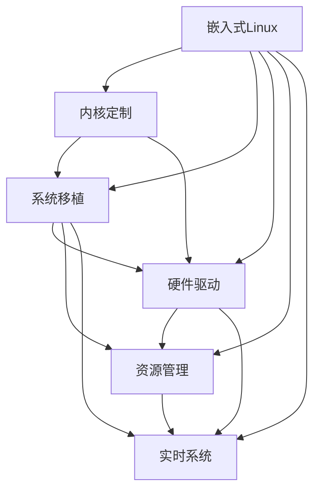

                 

# 嵌入式 Linux：在设备上运行 Linux

> 关键词：嵌入式Linux,内核定制,系统移植,硬件驱动,资源管理,实时系统

## 1. 背景介绍

随着物联网、智能设备等新兴领域的蓬勃发展，嵌入式Linux系统在各个行业的应用变得越来越广泛。嵌入式Linux的强大灵活性和开放生态，使其成为各种小型设备的理想选择，包括智能手机、智能家居、车载系统、工业控制等。然而，嵌入式Linux的运行环境与通用PC架构有很大差异，需要在硬件驱动、系统内核、资源管理等方面进行定制开发。本文将详细介绍嵌入式Linux的基本原理、核心概念，以及如何基于嵌入式Linux构建高效、安全、可靠的嵌入式系统。

## 2. 核心概念与联系

### 2.1 核心概念概述

嵌入式Linux是一种运行在嵌入式设备上的Linux操作系统，它具有通用Linux的诸多优点，同时具备硬件兼容性、资源利用率高等特性，特别适合小型、高性能、实时性要求高的应用场景。

核心概念包括：

- **嵌入式Linux**：运行在嵌入式设备上的Linux操作系统，具备轻量高效、安全稳定、适应性强等特点。
- **内核定制**：针对特定硬件和需求，对Linux内核进行定制开发，实现设备硬件驱动和资源管理。
- **系统移植**：将通用Linux系统迁移到嵌入式平台上，实现功能移植和性能优化。
- **硬件驱动**：编写与设备硬件兼容的驱动程序，实现设备数据的采集与控制。
- **资源管理**：管理嵌入式设备的内存、CPU、网络等资源，确保系统高效运行。
- **实时系统**：针对实时性要求高的应用场景，对嵌入式Linux进行优化，满足实时任务调度的需求。

这些概念之间存在紧密的联系，通过内核定制、系统移植、硬件驱动、资源管理和实时系统，可以构建出一个高效的嵌入式Linux系统。

### 2.2 核心概念原理和架构的 Mermaid 流程图(Mermaid 流程节点中不要有括号、逗号等特殊字符)



## 3. 核心算法原理 & 具体操作步骤

### 3.1 算法原理概述

嵌入式Linux的构建基于以下几个核心算法原理：

1. **内核定制**：对通用Linux内核进行裁剪、修改、加载等操作，以适应目标硬件和应用需求。
2. **系统移植**：将通用Linux系统移植到目标硬件上，实现系统功能、工具链和编译环境适配。
3. **硬件驱动**：编写与目标硬件兼容的驱动程序，实现设备数据采集和控制。
4. **资源管理**：管理嵌入式设备的内存、CPU、网络等资源，确保系统高效运行。
5. **实时系统优化**：针对实时任务调度需求，对内核进行优化，提高系统的响应速度和实时性。

### 3.2 算法步骤详解

#### 步骤1：内核定制

1. **选择合适的基础内核**：根据目标硬件特性选择适合的内核版本，如Yocto Project中的BSP（Board Support Package）。
2. **裁剪内核功能**：根据应用需求，裁剪内核中不需要的模块，如网络、图形等，保留必要功能。
3. **修改内核配置**：修改内核配置文件，如`.config`，设置必要选项和参数。
4. **加载必要的模块**：根据应用需求，加载必要的内核模块，如电源管理、定时器、串口等。

#### 步骤2：系统移植

1. **构建交叉编译环境**：搭建交叉编译工具链，如`gcc-arm-linux-gnueabihf`，编译目标硬件上的二进制文件。
2. **构建文件系统**：构建适合目标硬件的根文件系统，如Yocto Project中的Bitbake系统。
3. **移植应用工具链**：移植必要的编译、调试工具链，如GCC、GDB、Make等。
4. **配置网络环境**：配置目标硬件的网络环境，如以太网、Wi-Fi、蓝牙等。

#### 步骤3：硬件驱动

1. **编写驱动程序**：根据目标硬件特性，编写设备驱动程序，实现设备数据的采集和控制。
2. **加载驱动程序**：将驱动程序加载到内核中，并配置设备树文件（dts），确保设备与驱动正确连接。
3. **测试驱动程序**：编写测试程序，验证驱动程序的功能和稳定性，确保设备正常工作。

#### 步骤4：资源管理

1. **内存管理**：配置内存映射、虚拟内存、静态分配等策略，管理设备内存使用。
2. **CPU管理**：管理CPU调度、资源抢占、线程管理等，提高系统并发能力和响应速度。
3. **网络管理**：配置网络协议栈，优化网络性能，确保网络通信稳定可靠。

#### 步骤5：实时系统优化

1. **选择实时内核**：选择适合实时应用的内核版本，如RT-Linux、uClinux等。
2. **优化实时调度算法**：配置实时任务调度策略，如CFS（Completely Fair Scheduler）、RT-P优先级调度等。
3. **管理实时资源**：优化内存、CPU、网络等资源的管理，确保实时任务高效执行。

### 3.3 算法优缺点

**优点**：

1. **灵活性高**：基于通用Linux系统进行定制开发，可以根据实际需求裁剪和修改内核和驱动。
2. **稳定性好**：Linux系统的稳定性已经经过大量测试，适合实时和高可靠性的应用场景。
3. **开源生态丰富**：大量开源工具和资源可以用于开发和测试，加速开发进程。
4. **跨平台性强**：Linux系统的移植性强，支持多种硬件平台。

**缺点**：

1. **资源消耗大**：相比于RTOS等轻量级系统，Linux系统的资源消耗较大。
2. **开发复杂**：需要掌握嵌入式开发、驱动开发、内核优化等技术，开发门槛高。
3. **安全漏洞风险**：开源系统的安全漏洞可能带来安全风险，需要进行严格的代码审查和测试。

### 3.4 算法应用领域

嵌入式Linux系统广泛应用于以下几个领域：

1. **智能设备**：如智能手机、智能家居、智能穿戴等，需要高性能和复杂应用的设备。
2. **工业控制**：如工业机器人、自动化生产线等，对实时性和稳定性要求高的应用。
3. **汽车电子**：如车载导航、车载娱乐系统等，需要稳定性和安全性的应用。
4. **医疗设备**：如监护仪、手术机器人等，需要高性能和高可靠性的应用。
5. **航空航天**：如飞行控制系统、数据采集系统等，对实时性和安全性的要求极高。

## 4. 数学模型和公式 & 详细讲解 & 举例说明

### 4.1 数学模型构建

嵌入式Linux系统构建的数学模型包括以下几个部分：

1. **硬件资源模型**：描述嵌入式设备的硬件资源特性，如CPU、内存、存储、网络等。
2. **内核资源模型**：描述Linux内核对资源的管理和使用策略，如内存映射、虚拟内存、进程调度等。
3. **驱动资源模型**：描述驱动程序对硬件资源的操作和控制策略，如数据采集、设备控制、中断处理等。
4. **实时资源模型**：描述实时系统的调度和管理策略，如任务优先级、调度算法、资源抢占等。

### 4.2 公式推导过程

以嵌入式设备的CPU资源模型为例，推导其资源管理公式：

假设嵌入式设备的CPU性能为$P$，任务调度策略为$S$，任务数为$N$，每个任务的计算量为$C_i$，则系统利用率$U$可以表示为：

$$ U = \frac{P \cdot S}{N \cdot C} $$

其中$C$为所有任务的计算量之和。

### 4.3 案例分析与讲解

以嵌入式Linux在工业控制中的应用为例：

1. **定制内核**：针对工业控制设备的特定需求，裁剪Linux内核，移除不需要的模块，保留必要的模块。
2. **系统移植**：将通用Linux系统移植到工业控制设备的硬件平台，实现系统功能适配。
3. **硬件驱动**：编写与工业设备兼容的硬件驱动，实现数据采集和控制。
4. **资源管理**：管理工业控制设备的内存、CPU、网络等资源，确保系统高效运行。
5. **实时系统优化**：对内核进行优化，配置实时任务调度策略，确保系统的实时性和稳定性。

## 5. 项目实践：代码实例和详细解释说明

### 5.1 开发环境搭建

#### 步骤1：配置开发环境

1. **安装开发工具**：安装交叉编译工具链、编辑器、编译器等，如`gcc-arm-linux-gnueabihf`、`vi`、`make`等。
2. **配置网络环境**：配置目标硬件的网络环境，如以太网、Wi-Fi、蓝牙等。
3. **搭建开发环境**：搭建开发环境，包括交叉编译环境、根文件系统等。

#### 步骤2：内核定制

1. **裁剪内核**：选择合适的基础内核，裁剪不需要的模块，保留必要的模块。
2. **修改内核配置**：修改内核配置文件，设置必要选项和参数。
3. **加载必要的模块**：加载必要的内核模块，如电源管理、定时器、串口等。

#### 步骤3：系统移植

1. **构建交叉编译环境**：搭建交叉编译工具链，编译目标硬件上的二进制文件。
2. **构建文件系统**：构建适合目标硬件的根文件系统，如Yocto Project中的Bitbake系统。
3. **移植应用工具链**：移植必要的编译、调试工具链，如GCC、GDB、Make等。
4. **配置网络环境**：配置目标硬件的网络环境，如以太网、Wi-Fi、蓝牙等。

#### 步骤4：硬件驱动

1. **编写驱动程序**：根据目标硬件特性，编写设备驱动程序，实现设备数据的采集和控制。
2. **加载驱动程序**：将驱动程序加载到内核中，并配置设备树文件（dts），确保设备与驱动正确连接。
3. **测试驱动程序**：编写测试程序，验证驱动程序的功能和稳定性，确保设备正常工作。

#### 步骤5：资源管理

1. **内存管理**：配置内存映射、虚拟内存、静态分配等策略，管理设备内存使用。
2. **CPU管理**：管理CPU调度、资源抢占、线程管理等，提高系统并发能力和响应速度。
3. **网络管理**：配置网络协议栈，优化网络性能，确保网络通信稳定可靠。

#### 步骤6：实时系统优化

1. **选择实时内核**：选择适合实时应用的内核版本，如RT-Linux、uClinux等。
2. **优化实时调度算法**：配置实时任务调度策略，如CFS（Completely Fair Scheduler）、RT-P优先级调度等。
3. **管理实时资源**：优化内存、CPU、网络等资源的管理，确保实时任务高效执行。

### 5.2 源代码详细实现

#### 步骤1：编写内核模块

1. **创建内核模块**：使用Linux内核模块开发工具编写内核模块代码，实现设备数据的采集和控制。
2. **编译内核模块**：将内核模块编译为目标代码，加载到内核中。
3. **配置设备树**：配置设备树文件（dts），描述设备与驱动的连接关系。

#### 步骤2：编写驱动程序

1. **编写驱动程序**：根据目标硬件特性，编写设备驱动程序，实现设备数据的采集和控制。
2. **编译驱动程序**：将驱动程序编译为目标代码，加载到内核中。
3. **测试驱动程序**：编写测试程序，验证驱动程序的功能和稳定性，确保设备正常工作。

#### 步骤3：配置文件系统

1. **构建文件系统**：使用Yocto Project等工具构建适合目标硬件的根文件系统。
2. **加载文件系统**：将构建好的文件系统加载到嵌入式设备中。

### 5.3 代码解读与分析

#### 步骤1：内核模块实现

```c
#include <linux/module.h>
#include <linux/kernel.h>
#include <linux/init.h>

static int __init my_module_init(void) {
    printk(KERN_INFO "Hello, world!\n");
    return 0;
}

static void __exit my_module_exit(void) {
    printk(KERN_INFO "Goodbye, world!\n");
}

module_init(my_module_init);
module_exit(my_module_exit);
MODULE_LICENSE("GPL");
MODULE_AUTHOR("John Doe");
MODULE_DESCRIPTION("My module description");
```

该代码段实现了内核模块的初始化和退出逻辑，并在内核中打印了一条信息。

#### 步骤2：驱动程序实现

```c
#include <linux/module.h>
#include <linux/kernel.h>
#include <linux/init.h>
#include <linux/delay.h>
#include <linux/interrupt.h>

#define GPIO_PIN 11

static volatile int gpio_value;

static int gpio_init(void) {
    gpio_set_value(GPIO_PIN, 0);
    return 0;
}

static void gpio_exit(void) {
    gpio_set_value(GPIO_PIN, 1);
}

static int gpio_open(struct inode *inode, struct file *file) {
    return 0;
}

static int gpio_close(struct inode *inode, struct file *file) {
    return 0;
}

static ssize_t gpio_read(struct file *file, char *buffer, size_t length, loff_t offset) {
    int count = copy_to_user(buffer, &gpio_value, length);
    if (count != length)
        return -EFAULT;
    return length;
}

static ssize_t gpio_write(struct file *file, const char *buffer, size_t length, loff_t offset) {
    int value;
    if (copy_from_user(&value, buffer, length) != 0)
        return -EFAULT;
    gpio_set_value(GPIO_PIN, value);
    return length;
}

static const struct file_operations gpio_ops = {
    .owner = THIS_MODULE,
    .read = gpio_read,
    .write = gpio_write,
};

static int __init gpio_module_init(void) {
    gpio_init();
    return register_chrdev(0, "gpio", &gpio_ops);
}

static void __exit gpio_module_exit(int unused) {
    gpio_exit();
    unregister_chrdev(0, "gpio");
}

module_init(gpio_module_init);
module_exit(gpio_module_exit);
MODULE_LICENSE("GPL");
MODULE_AUTHOR("John Doe");
MODULE_DESCRIPTION("GPIO driver for my device");
```

该代码段实现了GPIO设备驱动程序的初始化和退出逻辑，并提供了read和write接口，用于读取和写入GPIO的值。

#### 步骤3：文件系统配置

1. **配置设备树文件**：

```plaintext
chosen {
    #config)#clock-source
    ...
    ...

    #config)#f dt-bus, Phy0, #address-cells="2"; #size-cells="2";
    ...

    #config)#gpio[0] = <&gpio, 11, gpio_input, gpio_output>;
    ...
};
```

2. **构建文件系统**：

```bash
$ bitbake /path/to/project-config.bb
```

## 6. 实际应用场景

### 6.1 智能设备

#### 应用场景

智能设备如智能手机、智能家居等需要高性能、复杂应用的嵌入式设备。嵌入式Linux系统可以提供丰富的开发工具和开源生态，满足复杂应用的需求。

#### 技术实现

1. **定制内核**：根据设备特性裁剪Linux内核，实现设备功能。
2. **系统移植**：移植通用Linux系统到目标硬件上，实现系统功能适配。
3. **硬件驱动**：编写设备驱动程序，实现数据采集和控制。
4. **资源管理**：管理设备内存、CPU、网络等资源，确保系统高效运行。
5. **实时系统优化**：对内核进行优化，配置实时任务调度策略，确保系统的实时性和稳定性。

#### 优势

1. **灵活性高**：可以根据设备需求进行内核和驱动的裁剪和修改。
2. **稳定性好**：Linux系统的稳定性已经经过大量测试，适合复杂应用场景。
3. **开源生态丰富**：大量开源工具和资源可以用于开发和测试，加速开发进程。

### 6.2 工业控制

#### 应用场景

工业控制如工业机器人、自动化生产线等对实时性和稳定性要求高的应用场景。嵌入式Linux系统可以提供高稳定性和高可靠性的解决方案。

#### 技术实现

1. **定制内核**：裁剪Linux内核，移除不需要的模块，保留必要的模块。
2. **系统移植**：移植通用Linux系统到工业控制设备的硬件平台。
3. **硬件驱动**：编写与工业设备兼容的硬件驱动，实现数据采集和控制。
4. **资源管理**：管理工业控制设备的内存、CPU、网络等资源，确保系统高效运行。
5. **实时系统优化**：对内核进行优化，配置实时任务调度策略，确保系统的实时性和稳定性。

#### 优势

1. **稳定性好**：Linux系统的稳定性已经经过大量测试，适合高可靠性应用。
2. **实时性高**：优化实时任务调度算法，提高系统的响应速度和实时性。
3. **资源管理灵活**：可以根据应用需求灵活管理资源。

### 6.3 汽车电子

#### 应用场景

汽车电子如车载导航、车载娱乐系统等需要稳定性和安全性的应用场景。嵌入式Linux系统可以提供稳定和高可靠性的解决方案。

#### 技术实现

1. **定制内核**：裁剪Linux内核，移除不需要的模块，保留必要的模块。
2. **系统移植**：移植通用Linux系统到汽车电子的硬件平台。
3. **硬件驱动**：编写与汽车电子设备兼容的硬件驱动，实现数据采集和控制。
4. **资源管理**：管理汽车电子设备的内存、CPU、网络等资源，确保系统高效运行。
5. **实时系统优化**：对内核进行优化，配置实时任务调度策略，确保系统的实时性和稳定性。

#### 优势

1. **稳定性好**：Linux系统的稳定性已经经过大量测试，适合高可靠性应用。
2. **实时性高**：优化实时任务调度算法，提高系统的响应速度和实时性。
3. **安全性高**：采用安全机制，如访问鉴权、数据脱敏等，保障数据和系统安全。

## 7. 工具和资源推荐

### 7.1 学习资源推荐

1. **《嵌入式Linux编程指南》**：这本书详细介绍了嵌入式Linux的开发流程和技术细节，适合初学者学习。
2. **Yocto Project官方文档**：Yocto Project是开源的嵌入式Linux开发框架，提供了详细的文档和教程，适合开发人员学习和使用。
3. **RT-Linux官方文档**：RT-Linux是实时Linux内核，提供了详细的文档和教程，适合开发人员学习和使用。
4. **uClinux官方文档**：uClinux是轻量级的Linux内核，提供了详细的文档和教程，适合开发人员学习和使用。
5. **Linux内核源码**：阅读Linux内核源码可以深入理解内核的工作原理和实现细节。

### 7.2 开发工具推荐

1. **交叉编译工具链**：如`gcc-arm-linux-gnueabihf`，用于编译目标硬件上的二进制文件。
2. **编辑器**：如`vi`，用于编写和调试代码。
3. **编译器**：如`gcc`，用于编译内核和驱动程序。
4. **调试工具**：如`gdb`，用于调试内核和驱动程序。
5. **文件系统构建工具**：如Yocto Project中的Bitbake系统，用于构建适合目标硬件的根文件系统。

### 7.3 相关论文推荐

1. **《嵌入式Linux系统设计与实现》**：这篇文章介绍了嵌入式Linux系统的设计思路和实现方法。
2. **《Linux内核定制与优化》**：这篇文章介绍了Linux内核的裁剪、修改和优化方法。
3. **《嵌入式Linux驱动开发》**：这篇文章介绍了嵌入式Linux设备的驱动程序开发方法。
4. **《嵌入式Linux实时系统优化》**：这篇文章介绍了嵌入式Linux实时系统的优化方法。
5. **《嵌入式Linux资源管理》**：这篇文章介绍了嵌入式Linux系统的资源管理方法。

## 8. 总结：未来发展趋势与挑战

### 8.1 研究成果总结

嵌入式Linux系统在工业控制、智能设备、汽车电子等领域得到了广泛应用。通过内核定制、系统移植、硬件驱动、资源管理和实时系统优化，可以实现高性能、高可靠性、高稳定性的嵌入式Linux系统。未来，嵌入式Linux系统将继续在这些领域发挥重要作用，推动工业智能化和数字化转型。

### 8.2 未来发展趋势

1. **物联网发展**：随着物联网设备的普及，嵌入式Linux系统将得到更广泛的应用。
2. **云计算与边缘计算结合**：嵌入式Linux系统与云计算、边缘计算相结合，可以实现更好的资源利用和数据处理。
3. **人工智能与嵌入式Linux结合**：嵌入式Linux系统结合人工智能技术，可以实现更加智能化的应用场景。
4. **5G技术应用**：嵌入式Linux系统结合5G技术，可以实现更高的实时性和更强的数据处理能力。
5. **跨平台兼容性**：嵌入式Linux系统可以更好地支持跨平台应用，实现设备间的互联互通。

### 8.3 面临的挑战

1. **资源限制**：嵌入式设备资源有限，如何在资源受限的情况下实现高效的系统运行是一个挑战。
2. **实时性要求**：实时应用对系统响应速度和实时性要求高，如何在嵌入式系统中实现高效的实时调度是一个挑战。
3. **安全性和可靠性**：嵌入式系统安全性要求高，如何在嵌入式系统中实现高效的安全性和可靠性是一个挑战。
4. **系统维护和更新**：嵌入式系统维护和更新相对复杂，如何在嵌入式系统中实现高效的系统维护和更新是一个挑战。
5. **软件堆叠**：嵌入式系统软件堆叠复杂，如何在嵌入式系统中实现高效的软件堆叠和集成是一个挑战。

### 8.4 研究展望

未来，嵌入式Linux系统需要在资源管理、实时性、安全性、维护和更新、软件堆叠等方面进行更多的研究和优化。随着技术的不断进步，嵌入式Linux系统将变得更加高效、稳定和可靠，为各个行业的发展提供更强大的支持。

## 9. 附录：常见问题与解答

**Q1：嵌入式Linux系统的优势和劣势分别有哪些？**

A: 嵌入式Linux系统的优势包括灵活性高、稳定性好、开源生态丰富、可移植性强等。劣势包括资源消耗大、开发复杂、安全漏洞风险等。

**Q2：嵌入式Linux系统的内核定制和系统移植有什么区别？**

A: 内核定制是指对通用Linux内核进行裁剪、修改、加载等操作，以适应目标硬件和应用需求。系统移植是将通用Linux系统迁移到嵌入式平台上，实现功能移植和性能优化。内核定制更关注内核的裁剪和修改，系统移植更关注系统功能的适配和优化。

**Q3：嵌入式Linux的实时系统优化有哪些方法？**

A: 嵌入式Linux的实时系统优化包括选择实时内核、优化实时调度算法、管理实时资源等方法。实时内核包括RT-Linux、uClinux等，实时调度算法包括CFS（Completely Fair Scheduler）、RT-P优先级调度等，实时资源管理包括内存、CPU、网络等资源的管理。

**Q4：嵌入式Linux系统如何保证安全性和可靠性？**

A: 嵌入式Linux系统通过访问鉴权、数据脱敏、安全机制等措施保证安全性和可靠性。访问鉴权用于控制设备访问权限，数据脱敏用于保护敏感数据，安全机制包括加密、签名、认证等，确保系统安全。

**Q5：嵌入式Linux系统如何实现高效的系统维护和更新？**

A: 嵌入式Linux系统通过远程管理、软件更新、版本控制等方法实现高效的系统维护和更新。远程管理用于实时监控和维护设备状态，软件更新用于定期升级系统，版本控制用于管理软件变更和发布。

---

作者：禅与计算机程序设计艺术 / Zen and the Art of Computer Programming

