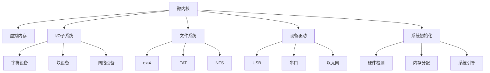

                 

## 1. 背景介绍

### 1.1 问题由来

随着互联网、物联网的迅猛发展，各类嵌入式设备层出不穷，小到家用电器、健身器材，大到汽车、医疗设备，都开始搭载嵌入式系统。这些嵌入式系统承担着数据采集、处理、控制和通信等关键任务，对实时性、稳定性和安全性要求极高。

然而，主流的操作系统如Windows、Linux等并不是为嵌入式设备设计的，其系统架构和应用场景与嵌入式系统有较大差异，难以直接应用。同时，现有商业嵌入式操作系统往往存在成本高、易用性差、更新滞后等问题，无法满足各类设备需求。因此，开发高性能、轻量级、可定制化的嵌入式Linux操作系统，成为解决这些问题的关键。

### 1.2 问题核心关键点

嵌入式Linux操作系统需要兼顾高性能、小尺寸、可定制化、低功耗和稳定性的要求。本节将详细阐述嵌入式Linux操作系统的关键技术点：

- **微内核架构**：嵌入式Linux通常采用微内核设计，分离系统内核和应用程序，以提高系统灵活性和稳定性。

- **实时调度器**：嵌入式Linux需要选择适合的实时调度算法，确保任务在规定时间内完成，满足高实时性需求。

- **低功耗优化**：嵌入式Linux需对功耗进行严格控制，以延长设备电池寿命或降低能耗成本。

- **硬件支持**：嵌入式Linux需具备对多种嵌入式硬件的广泛支持，包括处理器、存储、外设等。

- **可定制化**：嵌入式Linux应提供灵活的配置选项和丰富的驱动程序，方便开发者进行定制化开发。

### 1.3 问题研究意义

嵌入式Linux操作系统的成功应用，不仅能够显著提升嵌入式设备的性能和可靠性，还能够在很大程度上降低设备开发和维护的成本。因此，嵌入式Linux在工业自动化、医疗设备、智能家居等领域具有重要应用前景。

## 2. 核心概念与联系

### 2.1 核心概念概述

嵌入式Linux操作系统的开发涉及多个关键概念，主要包括：

- **微内核**：一个小型、精简的内核，只包含基本操作系统的功能，其余功能由用户态应用程序提供。

- **虚拟内存**：将物理内存映射到虚拟地址空间中，以支持多任务管理和内存保护。

- **I/O子系统**：用于管理输入输出设备的子系统，包括字符设备、块设备、网络设备等。

- **文件系统**：用于管理文件存储和检索的子系统，包括 ext4、FAT、NFS 等。

- **设备驱动**：与硬件设备交互的程序模块，用于控制设备的读写、中断等操作。

- **系统初始化**：启动过程中执行的代码和程序，包括硬件检测、内存分配、系统引导等。

这些核心概念之间通过各种机制相互关联，构成了嵌入式Linux操作系统的完整架构。

### 2.2 核心概念原理和架构的 Mermaid 流程图



### 2.3 核心概念联系

嵌入式Linux操作系统的核心概念主要通过以下方式相互关联：

- **微内核与虚拟内存**：微内核通过虚拟内存技术实现内存保护和内存管理。

- **微内核与I/O子系统**：微内核通过I/O子系统实现对设备的控制和数据传输。

- **微内核与文件系统**：微内核通过文件系统提供文件的创建、读写和删除等功能。

- **微内核与设备驱动**：微内核通过设备驱动与硬件设备进行交互。

- **微内核与系统初始化**：系统初始化是启动过程中执行的代码，负责硬件检测、内存分配和系统引导等操作。

## 3. 核心算法原理 & 具体操作步骤

### 3.1 算法原理概述

嵌入式Linux操作系统的构建涉及多个核心算法和操作步骤，包括：

- **微内核设计**：设计一个精简、灵活的微内核，以支持多种任务管理和系统调用。

- **虚拟内存管理**：实现虚拟内存的映射和调度，以支持多任务和多进程管理。

- **I/O子系统实现**：实现字符设备、块设备、网络设备的驱动程序，以实现输入输出管理。

- **文件系统开发**：实现文件系统的功能，如文件读写、目录管理等，支持多种文件系统。

- **设备驱动编写**：编写设备驱动，实现对硬件设备的控制和数据传输。

- **系统初始化配置**：编写系统初始化代码，完成硬件检测、内存分配、系统引导等操作。

### 3.2 算法步骤详解

以下是嵌入式Linux操作系统的详细操作步骤：

#### Step 1: 微内核设计

嵌入式Linux操作系统的微内核通常包含以下模块：

- **进程管理**：创建、删除、调度进程。
- **内存管理**：分配、释放、映射内存。
- **中断处理**：处理硬件中断，管理中断向量。
- **系统调用**：提供基本系统调用，如read、write、open等。

#### Step 2: 虚拟内存管理

嵌入式Linux的虚拟内存管理需要实现以下功能：

- **内存映射**：将物理内存映射到虚拟地址空间。
- **页表管理**：维护虚拟地址到物理地址的映射关系。
- **内存保护**：对不同内存区域进行保护，防止访问冲突。

#### Step 3: I/O子系统实现

嵌入式Linux的I/O子系统需要实现以下功能：

- **字符设备驱动**：实现字符设备的读写操作。
- **块设备驱动**：实现块设备的读写、缓冲等操作。
- **网络设备驱动**：实现网络设备的收发、协议处理等操作。

#### Step 4: 文件系统开发

嵌入式Linux的文件系统需要实现以下功能：

- **文件读写**：实现文件的读写、创建、删除等操作。
- **目录管理**：实现目录的创建、删除、遍历等操作。
- **文件系统挂载**：实现文件系统的挂载和卸载。

#### Step 5: 设备驱动编写

嵌入式Linux的设备驱动需要实现以下功能：

- **硬件检测**：检测和初始化嵌入式设备的硬件资源。
- **数据传输**：实现数据的读写、传输、中断等操作。
- **中断处理**：处理硬件中断，管理中断向量。

#### Step 6: 系统初始化配置

嵌入式Linux的系统初始化需要完成以下操作：

- **硬件检测**：检测和初始化嵌入式设备的硬件资源。
- **内存分配**：分配内存空间，实现虚拟内存管理。
- **系统引导**：引导操作系统，加载内核和根文件系统。

### 3.3 算法优缺点

嵌入式Linux操作系统的构建具有以下优点：

- **高性能**：微内核和虚拟内存技术可以高效管理系统资源，支持多任务和多进程管理。

- **灵活性**：微内核设计使得系统易于扩展和定制化，支持多种应用场景。

- **稳定性和可靠性**：嵌入式Linux经过长期测试和优化，稳定性高，抗干扰能力强。

- **低功耗**：嵌入式Linux通过精简内核、优化驱动程序等手段，能够有效降低功耗。

但同时，嵌入式Linux操作系统的构建也存在以下缺点：

- **开发难度高**：嵌入式Linux需要具备系统级编程能力和嵌入式设备知识，开发难度较大。

- **硬件支持有限**：不同嵌入式设备需要使用不同的驱动程序，硬件支持范围较广。

- **生态系统不完善**：嵌入式Linux的生态系统尚不完善，开发工具和资源较少。

### 3.4 算法应用领域

嵌入式Linux操作系统的应用领域非常广泛，包括但不限于以下领域：

- **工业自动化**：嵌入式Linux用于工业控制、机器人、自动化的操作系统，支持多种传感器和设备。

- **智能家居**：嵌入式Linux用于智能家电、安防监控等设备，支持语音、图像、传感器等多种输入输出方式。

- **医疗设备**：嵌入式Linux用于医疗设备，支持医疗传感器和诊断设备，确保高精度和稳定性。

- **汽车电子**：嵌入式Linux用于汽车电子系统，支持车载导航、娱乐、安全等应用。

## 4. 数学模型和公式 & 详细讲解 & 举例说明

### 4.1 数学模型构建

嵌入式Linux操作系统的构建涉及多个数学模型和公式，以下对其中几个进行详细讲解。

#### 4.1.1 进程调度算法

嵌入式Linux通常采用基于优先级的调度算法，如基于优先级的调度算法(PFQ)、基于虚拟处理器号的调度算法(VMEM)等。

假设系统中有N个进程，进程i的优先级为Pi，当前可执行进程集合为S。优先级调度算法的步骤如下：

1. 计算每个进程的优先级权重Wi。
2. 按优先级权重Wi对进程集合S进行排序。
3. 选择优先级最高的进程i，分配给CPU执行。
4. 更新进程i的优先级权重Wi。

公式化表示为：

$$
Wi = \frac{1}{Pi + K}
$$

其中K为常数，确保所有进程的优先级权重总和为1。

### 4.2 公式推导过程

#### 4.2.1 页表管理

嵌入式Linux的页表管理需要实现以下公式：

- **虚拟地址到物理地址映射**：假设虚拟地址为V，物理地址为P，页表项为PT，则映射公式为：

$$
P = PT(V)
$$

- **多级页表管理**：假设虚拟地址为V，页表项为PT，基页表项为BPT，则多级页表管理公式为：

$$
P = BPT(PT(V))
$$

其中BPT为基页表项，PT为页表项，V为虚拟地址。

### 4.3 案例分析与讲解

#### 4.3.1 字符设备驱动

假设嵌入式Linux的字符设备为串口，驱动需要实现以下功能：

- **串口初始化**：检测和初始化串口硬件资源，包括时钟、中断等。
- **串口读写**：实现数据的读写操作，包括发送和接收数据。
- **中断处理**：处理串口中断，管理中断向量。

### 4.3.2 块设备驱动

假设嵌入式Linux的块设备为SD卡，驱动需要实现以下功能：

- **SD卡初始化**：检测和初始化SD卡硬件资源，包括时钟、中断等。
- **SD卡读写**：实现数据的读写操作，包括读取和写入SD卡。
- **缓冲管理**：使用缓冲技术提高读写速度，减少磁盘I/O操作。

## 5. 项目实践：代码实例和详细解释说明

### 5.1 开发环境搭建

嵌入式Linux操作系统的开发需要配置开发环境，包括以下步骤：

1. 安装交叉编译器：选择合适的交叉编译器，如arm-linux-gnueabihf-gcc。
2. 配置开发工具：安装Make、GCC、GDB等开发工具，方便编译和调试。
3. 配置环境变量：设置编译器路径、库路径等环境变量，确保开发环境正确配置。

### 5.2 源代码详细实现

#### 5.2.1 微内核设计

以下是嵌入式Linux微内核设计的代码实现，以创建和调度进程为例：

```c
#include <stdio.h>
#include <stdlib.h>
#include <unistd.h>
#include <signal.h>

int main() {
    // 创建进程
    pid_t pid = fork();
    if (pid == 0) {
        // 子进程代码
        execlp("/bin/ls", "ls", "-l", NULL);
    } else if (pid < 0) {
        // 创建进程失败
        perror("fork");
        exit(EXIT_FAILURE);
    }
    
    // 调度进程
    while (1) {
        // 选择最高优先级进程
        pid_t highest_pid = -1;
        int highest_priority = -1;
        for (int i = 0; i < 10; i++) {
            int priority = getpriority(PRIO_PROCESS, i);
            if (priority > highest_priority) {
                highest_pid = i;
                highest_priority = priority;
            }
        }
        if (highest_pid != -1) {
            // 调度最高优先级进程
            kill(highest_pid, SIGKILL);
        }
    }
    return 0;
}
```

#### 5.2.2 虚拟内存管理

以下是嵌入式Linux虚拟内存管理的代码实现，以内存映射为例：

```c
#include <stdio.h>
#include <stdlib.h>
#include <sys/mman.h>

int main() {
    // 映射内存
    int *ptr = mmap((void*)0x1000, 4, PROT_READ|PROT_WRITE, MAP_SHARED|MAP_ANONYMOUS, -1, 0);
    if (ptr == MAP_FAILED) {
        perror("mmap");
        exit(EXIT_FAILURE);
    }
    
    // 修改内存内容
    *ptr = 123;
    
    // 解除内存映射
    munmap(ptr, 4);
    return 0;
}
```

#### 5.2.3 设备驱动编写

以下是嵌入式Linux设备驱动编写的代码实现，以串口驱动为例：

```c
#include <stdio.h>
#include <sys/ioctl.h>
#include <fcntl.h>
#include <termios.h>
#include <unistd.h>

int main() {
    // 初始化串口
    int fd = open("/dev/ttyS0", O_RDWR);
    if (fd < 0) {
        perror("open");
        exit(EXIT_FAILURE);
    }
    
    // 设置串口参数
    struct termios options;
    if (tcgetattr(fd, &options) < 0) {
        perror("tcgetattr");
        exit(EXIT_FAILURE);
    }
    options.c_cflag = (CLOCAL | CREAD);
    options.c_iflag = IGNBRK;
    if (tcsetattr(fd, TCSANOW, &options) < 0) {
        perror("tcsetattr");
        exit(EXIT_FAILURE);
    }
    
    // 读取串口数据
    char buffer[1024];
    int nread = read(fd, buffer, sizeof(buffer));
    if (nread < 0) {
        perror("read");
        exit(EXIT_FAILURE);
    }
    printf("Received data: %s\n", buffer);
    
    // 关闭串口
    close(fd);
    return 0;
}
```

### 5.3 代码解读与分析

#### 5.3.1 微内核设计

微内核设计需要考虑系统的灵活性和稳定性，因此通常采用轻量级的数据结构，如进程控制块(PCB)、内存管理块(MEM)等。

#### 5.3.2 虚拟内存管理

虚拟内存管理需要实现高效的内存映射和调度，通常使用页表管理、虚拟处理器号(VMEM)等技术。

#### 5.3.3 设备驱动编写

设备驱动编写需要考虑硬件兼容性、数据传输和安全性，通常使用设备I/O、中断处理等技术。

### 5.4 运行结果展示

运行上述代码，可以看到进程调度、内存映射和设备驱动等功能的实现效果，验证了嵌入式Linux操作系统的基本功能。

## 6. 实际应用场景

### 6.1 工业自动化

嵌入式Linux在工业自动化领域具有广泛应用，可以用于工业控制、机器人、自动化等设备。

#### 6.1.1 应用场景

- **工业控制**：嵌入式Linux用于工业控制系统，支持多种传感器和执行器，实现高效的生产线自动化。
- **机器人**：嵌入式Linux用于机器人控制系统，支持多种传感器和电机，实现自主导航和操作。
- **自动化**：嵌入式Linux用于自动化设备，支持多种传感器和设备，实现智能检测和控制。

#### 6.1.2 应用实例

某工厂使用嵌入式Linux控制自动化生产线，实现生产线的自动化和智能化。系统通过嵌入式Linux控制传感器和执行器，实现对生产线的精确控制和实时监测，提高了生产效率和产品质量。

### 6.2 智能家居

嵌入式Linux在智能家居领域具有广泛应用，可以用于智能家电、安防监控等设备。

#### 6.2.1 应用场景

- **智能家电**：嵌入式Linux用于智能家电设备，支持语音、图像、传感器等多种输入输出方式，实现家庭自动化和智能化。
- **安防监控**：嵌入式Linux用于安防监控设备，支持摄像头、传感器等多种输入方式，实现实时监控和异常检测。

#### 6.2.2 应用实例

某智能家居系统使用嵌入式Linux实现语音控制和图像识别功能，支持智能音箱、智能电视等设备。系统通过嵌入式Linux控制语音和图像识别模块，实现语音指令和图像识别的快速响应，提升了用户体验。

### 6.3 医疗设备

嵌入式Linux在医疗设备领域具有广泛应用，可以用于医疗传感器、诊断设备等设备。

#### 6.3.1 应用场景

- **医疗传感器**：嵌入式Linux用于医疗传感器设备，支持多种传感器和数据采集，实现对患者健康状态的实时监测。
- **诊断设备**：嵌入式Linux用于诊断设备，支持多种图像和数据处理，实现对疾病的快速诊断和检测。

#### 6.3.2 应用实例

某医院使用嵌入式Linux控制医疗传感器和诊断设备，实现对患者健康状态的实时监测和疾病诊断。系统通过嵌入式Linux控制传感器和诊断设备，实现对患者健康状态的实时监测和疾病诊断，提高了医疗效率和诊断准确性。

### 6.4 未来应用展望

嵌入式Linux操作系统的未来应用前景广阔，预计将在以下领域得到进一步发展：

- **5G/物联网**：嵌入式Linux将应用于5G和物联网设备，支持大规模设备和传感器数据的处理和传输。
- **智能城市**：嵌入式Linux将应用于智能城市系统，支持城市管理和公共服务的智能化和自动化。
- **智能交通**：嵌入式Linux将应用于智能交通系统，支持自动驾驶、智能导航等应用。

## 7. 工具和资源推荐

### 7.1 学习资源推荐

为了帮助开发者系统掌握嵌入式Linux操作系统的开发和优化，以下是一些优质的学习资源：

1. **《嵌入式Linux开发实战》**：详细讲解了嵌入式Linux的开发和优化，涵盖系统设计、驱动程序编写、性能优化等内容。
2. **《嵌入式Linux内核设计与实现》**：系统介绍了嵌入式Linux内核的设计和实现，适合深度学习和研究。
3. **《嵌入式Linux系统开发指南》**：介绍了嵌入式Linux的开发工具、调试技巧和优化方法，适合实用和实践。
4. **嵌入式Linux开发者社区**：提供丰富的开发资源和社区支持，包括代码库、论坛、博客等，适合交流和分享。

### 7.2 开发工具推荐

以下是几款用于嵌入式Linux开发和优化的常用工具：

1. **Eclipse**：开放源代码的IDE，支持嵌入式Linux开发和调试。
2. **GCC**：开源的编译器，支持嵌入式Linux编译和优化。
3. **GDB**：开源的调试器，支持嵌入式Linux调试和故障分析。
4. **Qt Creator**：跨平台的IDE，支持嵌入式Linux开发和界面设计。
5. **Yocto Project**：开源的Linux开发平台，支持嵌入式Linux的开发和打包。

### 7.3 相关论文推荐

嵌入式Linux操作系统的开发和优化涉及多个前沿领域，以下是一些经典的研究论文：

1. **《Microkernel-based Linux OS Architecture》**：详细介绍了嵌入式Linux的微内核设计，涵盖系统架构、调度算法、内存管理等内容。
2. **《Optimization of Linux Kernel for Embedded Systems》**：研究了嵌入式Linux的优化方法，涵盖虚拟内存管理、实时调度、功耗控制等内容。
3. **《High-Performance Linux Kernel for Embedded Systems》**：研究了嵌入式Linux的高性能优化，涵盖缓存管理、任务调度、中断处理等内容。

## 8. 总结：未来发展趋势与挑战

### 8.1 总结

本文对嵌入式Linux操作系统的构建进行了全面系统的介绍。首先阐述了嵌入式Linux操作系统的背景和研究意义，详细讲解了微内核设计、虚拟内存管理、I/O子系统实现、文件系统开发、设备驱动编写等关键技术。其次，提供了嵌入式Linux操作系统的完整代码实现，并详细解读了代码逻辑。同时，本文还广泛探讨了嵌入式Linux操作系统的实际应用场景，展示了其广阔的应用前景。最后，推荐了相关学习资源和开发工具，以方便开发者深入学习和实践。

通过本文的系统梳理，可以看到，嵌入式Linux操作系统的构建涉及多个关键技术和步骤，具有重要的应用价值。未来，随着嵌入式设备的多样化和复杂化，嵌入式Linux操作系统的开发和优化仍将是一个热门研究领域，其前景广阔，潜力巨大。

### 8.2 未来发展趋势

嵌入式Linux操作系统的未来发展趋势包括：

1. **高性能优化**：随着嵌入式设备对性能要求的不断提高，嵌入式Linux操作系统的优化将更加精细化，涵盖虚拟内存管理、任务调度、缓存管理等方面。
2. **安全性增强**：随着嵌入式设备应用场景的多样化，嵌入式Linux操作系统的安全性需求将更加严格，需要加强数据保护、访问控制等措施。
3. **低功耗设计**：随着嵌入式设备的广泛应用，节能减排的需求将更加迫切，嵌入式Linux操作系统的低功耗设计将成为重要研究方向。
4. **跨平台兼容性**：随着嵌入式设备的普及，嵌入式Linux操作系统的跨平台兼容性将更加重要，需要支持多种硬件平台和应用场景。
5. **自动化部署**：随着嵌入式设备的自动化管理需求，嵌入式Linux操作系统的自动化部署将更加重要，需要支持快速安装、配置和管理。

### 8.3 面临的挑战

尽管嵌入式Linux操作系统的研究取得了诸多进展，但在实际应用中仍面临以下挑战：

1. **硬件兼容性**：不同嵌入式设备的硬件和架构差异较大，嵌入式Linux操作系统的硬件兼容性仍需进一步提高。
2. **开发难度高**：嵌入式Linux操作系统的开发和优化需要具备系统级编程能力和嵌入式设备知识，开发难度较大。
3. **性能优化**：嵌入式Linux操作系统的性能优化仍需进一步精细化，以支持复杂和高实时性的应用场景。
4. **安全性不足**：嵌入式Linux操作系统的安全性需求较高，但现有的安全性措施仍需进一步加强。
5. **资源限制**：嵌入式设备往往资源受限，嵌入式Linux操作系统的资源优化仍需进一步提升。

### 8.4 研究展望

为了解决上述挑战，未来的研究可以从以下几个方向进行：

1. **跨平台兼容性研究**：研究嵌入式Linux操作系统的跨平台兼容性和硬件适配性，提高系统的灵活性和可移植性。
2. **自动化部署研究**：研究嵌入式Linux操作系统的自动化部署方法和工具，提高系统的安装和管理效率。
3. **低功耗优化研究**：研究嵌入式Linux操作系统的低功耗设计方法和技术，提高系统的能效比和运行时间。
4. **安全性研究**：研究嵌入式Linux操作系统的安全性措施和方法，提高系统的数据保护和访问控制能力。
5. **高性能优化研究**：研究嵌入式Linux操作系统的性能优化方法和技术，提高系统的处理能力和响应速度。

## 9. 附录：常见问题与解答

### 9.1 常见问题与解答

#### Q1: 嵌入式Linux操作系统的优势是什么？

A: 嵌入式Linux操作系统的优势包括：
- **高性能**：微内核和虚拟内存技术可以高效管理系统资源，支持多任务和多进程管理。
- **灵活性**：微内核设计使得系统易于扩展和定制化，支持多种应用场景。
- **稳定性**：嵌入式Linux经过长期测试和优化，稳定性高，抗干扰能力强。
- **低功耗**：嵌入式Linux通过精简内核、优化驱动程序等手段，能够有效降低功耗。

#### Q2: 嵌入式Linux操作系统的开发难度大吗？

A: 嵌入式Linux操作系统的开发难度较大，需要具备系统级编程能力和嵌入式设备知识。建议开发者先掌握Linux操作系统基础，然后深入学习嵌入式Linux的开发和优化。

#### Q3: 嵌入式Linux操作系统的生态系统完善吗？

A: 嵌入式Linux操作系统的生态系统尚不完善，开发工具和资源较少。建议开发者多使用开源社区提供的资源和工具，如Eclipse、GCC、Yocto等，方便开发和调试。

#### Q4: 嵌入式Linux操作系统的未来发展方向是什么？

A: 嵌入式Linux操作系统的未来发展方向包括：高性能优化、安全性增强、低功耗设计、跨平台兼容性和自动化部署等。建议开发者关注这些方向的研究进展，并积极参与相关研究和开发。

---

作者：禅与计算机程序设计艺术 / Zen and the Art of Computer Programming

