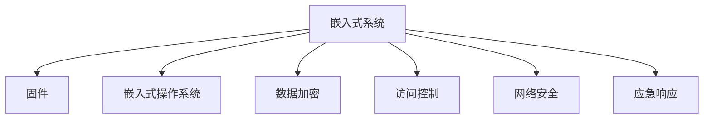

                 

# 嵌入式系统安全策略：保护设备和数据

## 1. 背景介绍

### 1.1 问题由来
随着物联网技术的蓬勃发展，嵌入式设备在各个领域的应用变得越来越广泛，从智能家居到工业自动化，再到医疗健康，嵌入式系统无处不在。然而，嵌入式设备的开放性和资源限制性使得其安全问题更加严峻。一旦被攻击，可能会造成设备损坏、数据泄露等严重后果，甚至对人的生命安全构成威胁。

### 1.2 问题核心关键点
嵌入式系统安全策略的核心在于如何在有限的资源条件下，为设备提供有效的保护，防止恶意软件、未授权访问等威胁。关键点包括：

- 设备固件的安全性。固件是嵌入式设备的核心，任何恶意代码的注入都可能导致设备功能异常甚至系统崩溃。
- 数据的加密和完整性保护。设备中的数据敏感且易受到篡改攻击，需要对数据进行加密和完整性保护。
- 网络的隔离和访问控制。嵌入式设备往往需要通过网络进行通信，必须确保网络通信的安全性。
- 应急响应机制。一旦安全事件发生，需要迅速响应，将损失降到最低。

### 1.3 问题研究意义
研究嵌入式系统安全策略，对于保障设备安全、保护用户隐私、维护社会稳定具有重要意义：

- 保护用户隐私。嵌入式设备广泛用于个人生活和工作中，其安全性直接关系到用户的隐私保护。
- 保障设备可靠性。保障设备的安全性可以防止恶意攻击导致设备功能异常，保障设备的可靠运行。
- 促进产业发展。安全策略的完善有助于嵌入式设备的广泛应用，推动相关产业发展。
- 提高社会安全性。嵌入式设备的应用与社会的稳定和安全息息相关，安全策略的研究有助于维护社会稳定。

## 2. 核心概念与联系

### 2.1 核心概念概述

为更好地理解嵌入式系统安全策略，本节将介绍几个密切相关的核心概念：

- 嵌入式系统(Embedded System)：指在特定硬件平台(如单片机、FPGA、ASIC等)上运行的系统，具有资源受限、实时性高等特点。
- 固件(Firmware)：运行在嵌入式设备上的软件，控制设备硬件的运行，是设备的核心部分。
- 嵌入式操作系统(Embedded OS)：为嵌入式设备提供操作系统服务，管理资源和调度任务。
- 数据加密(Data Encryption)：通过算法将数据转换为不可读的形式，防止未经授权的访问。
- 访问控制(Access Control)：通过策略控制用户对系统资源的访问权限，防止未授权访问。
- 网络安全(Network Security)：保护网络通信的安全性，防止网络攻击和数据泄露。
- 应急响应(Incident Response)：针对安全事件的快速响应和处理机制，减少损失。

这些核心概念之间的逻辑关系可以通过以下Mermaid流程图来展示：



这个流程图展示了一台嵌入式设备的核心组件及其相互关系：

1. 嵌入式设备通过固件运行，控制硬件。
2. 嵌入式操作系统提供资源管理和服务。
3. 数据加密保护设备中的敏感信息。
4. 访问控制保障系统资源的安全。
5. 网络安全保护设备的网络通信。
6. 应急响应机制在安全事件发生时启动。

## 3. 核心算法原理 & 具体操作步骤
### 3.1 算法原理概述

嵌入式系统安全策略的核心在于如何在有限的资源条件下，为设备提供有效的保护，防止恶意软件、未授权访问等威胁。这涉及到一系列的算法和步骤，包括固件的安全性、数据加密、访问控制、网络安全等方面。

- 固件安全性：在固件开发和部署过程中，必须进行严格的安全性审查，防止注入恶意代码。
- 数据加密：在数据传输和存储过程中，使用加密算法保护数据的机密性和完整性。
- 访问控制：通过访问控制列表(ACL)、角色权限等方式，限制用户对系统资源的访问。
- 网络安全：在网络通信中，使用防火墙、VPN等技术保障数据传输的安全性。
- 应急响应：建立应急响应机制，在系统遭受攻击后能够迅速恢复服务。

### 3.2 算法步骤详解

嵌入式系统安全策略的实施一般包括以下几个关键步骤：

**Step 1: 固件开发**
- 选择适合嵌入式平台的操作系统和编译器，进行固件开发。
- 采用安全的编程语言和库，防止缓冲区溢出等安全漏洞。
- 进行静态和动态测试，发现和修复潜在的安全问题。

**Step 2: 数据加密**
- 选择合适的加密算法，如AES、RSA等，对数据进行加密。
- 对加密过程进行盐值处理，增加加密强度。
- 使用对称加密和非对称加密相结合的方式，保障通信和存储安全。

**Step 3: 访问控制**
- 定义用户角色和权限，通过ACL等机制控制访问。
- 对敏感操作进行权限限制，防止未授权访问。
- 使用访问日志记录用户行为，便于审计和追踪。

**Step 4: 网络安全**
- 部署防火墙、VPN等网络设备，保护网络通信安全。
- 配置网络隔离，将敏感网络与公共网络分开。
- 对网络流量进行监控，及时发现异常行为。

**Step 5: 应急响应**
- 建立应急响应团队，明确职责分工。
- 制定应急响应流程，包括检测、隔离、恢复、通知等步骤。
- 定期进行应急演练，提高应急响应能力。

### 3.3 算法优缺点

嵌入式系统安全策略的优点包括：

- 适用于各种嵌入式设备，可广泛应用。
- 防护效果好，能够有效防止多种安全威胁。
- 技术成熟，有大量的实践经验和成功案例。

然而，这种策略也存在一些缺点：

- 资源消耗较大。嵌入式设备资源有限，安全策略的实施可能占用大量计算和存储资源。
- 部署复杂。需要专业的知识和经验，部署和维护成本较高。
- 难以全面防护。无法完全避免所有安全威胁，只能尽可能降低风险。
- 应急响应效果有限。一旦安全事件发生，可能难以迅速有效地恢复服务。

### 3.4 算法应用领域

嵌入式系统安全策略广泛应用于以下几个领域：

- 工业自动化：自动化设备需要高可靠性和安全性，安全策略能够保障设备运行稳定。
- 智能家居：智能设备涉及隐私数据，需要严格的访问控制和数据加密。
- 医疗健康：医疗设备的安全性关系到患者的生命健康，必须严格保障。
- 国防安全：军事设备需要高性能和安全性，安全策略是其重要保障。
- 航空航天：航天设备的安全性直接关系到国家的安全，必须进行全面防护。

## 4. 数学模型和公式 & 详细讲解 & 举例说明

### 4.1 数学模型构建

在嵌入式系统安全策略中，数据加密和访问控制是两个重要的方面，我们可以用数学模型来表示这两个过程：

设 $E$ 为加密函数，$D$ 为解密函数，$K$ 为密钥，$m$ 为明文，$c$ 为密文，则数据加密过程可以表示为：

$$
c = E_k(m)
$$

其中 $E_k$ 表示使用密钥 $k$ 进行加密的函数。

设 $L$ 为访问控制列表，$R$ 为当前用户，$A$ 为访问权限，则访问控制过程可以表示为：

$$
L(R, A) = \begin{cases}
1, & \text{如果} R \in A \\
0, & \text{如果} R \notin A
\end{cases}
$$

其中 $L(R, A)$ 表示用户 $R$ 是否有访问权限 $A$。

### 4.2 公式推导过程

对于数据加密过程，假设使用AES算法，其加密和解密过程可以表示为：

$$
c = F_k(m) \oplus s
$$

$$
m = F_{k'}(c) \oplus s'
$$

其中 $F_k$ 表示AES加密函数，$\oplus$ 表示异或运算，$s$ 和 $s'$ 为盐值，$k$ 和 $k'$ 为密钥。

对于访问控制过程，假设使用ACL访问控制，其规则可以表示为：

$$
L(R, A) = \begin{cases}
1, & \text{如果} R \in L \\
0, & \text{如果} R \notin L
\end{cases}
$$

其中 $L$ 表示访问控制列表，$R$ 为当前用户，$A$ 为访问权限。

### 4.3 案例分析与讲解

以下我们以智能家居设备为例，展示嵌入式系统安全策略的实施过程。

**案例背景**：智能锁是一种常见的智能家居设备，能够实现远程开锁、监控等功能。为了保障其安全性，需要在固件、数据加密、访问控制、网络安全等方面进行防护。

**步骤1: 固件开发**
- 使用SecureCRT工具开发嵌入式固件，防止注入恶意代码。
- 采用安全的编程语言和库，如Python、OpenSSL等，进行开发。
- 进行静态和动态测试，使用工具如Coverity、Veracrypt等发现和修复潜在的安全问题。

**步骤2: 数据加密**
- 使用AES算法对用户密码和通信数据进行加密。
- 对加密过程进行盐值处理，增加加密强度。
- 使用对称加密和非对称加密相结合的方式，保障通信和存储安全。

**步骤3: 访问控制**
- 定义用户角色和权限，如管理员、普通用户等。
- 对敏感操作进行权限限制，如远程开锁等。
- 使用访问日志记录用户行为，便于审计和追踪。

**步骤4: 网络安全**
- 部署防火墙、VPN等网络设备，保护网络通信安全。
- 配置网络隔离，将智能锁与公共网络分开。
- 对网络流量进行监控，及时发现异常行为。

**步骤5: 应急响应**
- 建立应急响应团队，明确职责分工。
- 制定应急响应流程，包括检测、隔离、恢复、通知等步骤。
- 定期进行应急演练，提高应急响应能力。

通过以上步骤，智能锁设备的固件和数据得到了全面的保护，减少了遭受攻击的风险。

## 5. 项目实践：代码实例和详细解释说明
### 5.1 开发环境搭建

在进行嵌入式系统安全策略的实践前，我们需要准备好开发环境。以下是使用Python进行开发的环境配置流程：

1. 安装Anaconda：从官网下载并安装Anaconda，用于创建独立的Python环境。

2. 创建并激活虚拟环境：
```bash
conda create -n embedded-env python=3.8 
conda activate embedded-env
```

3. 安装必要的Python库和工具：
```bash
pip install numpy scipy pandas matplotlib scikit-learn cryptography
```

4. 安装交叉编译工具和开发环境：
```bash
sudo apt-get install build-essential
```

完成上述步骤后，即可在`embedded-env`环境中开始开发实践。

### 5.2 源代码详细实现

这里我们以使用AES算法进行数据加密为例，展示嵌入式系统安全策略的代码实现。

首先，我们需要安装和使用AES库：

```bash
pip install pycrypto
```

然后，我们定义加密和解密函数：

```python
from Crypto.Cipher import AES
from Crypto.Random import get_random_bytes

def encrypt(data, key):
    cipher = AES.new(key, AES.MODE_EAX)
    ciphertext, tag = cipher.encrypt_and_digest(data.encode())
    return (ciphertext, tag)

def decrypt(ciphertext, tag, key):
    cipher = AES.new(key, AES.MODE_EAX)
    plaintext = cipher.decrypt_and_verify(ciphertext, tag)
    return plaintext.decode()
```

以上代码定义了加密和解密函数，使用AES算法进行加密和解密，返回密文和加密后的摘要。

### 5.3 代码解读与分析

我们进一步解释代码中的关键步骤：

**AES加密**：
- 使用AES算法进行加密，首先需要生成一个密钥，可以使用Python的`get_random_bytes`函数生成一个随机的16字节密钥。
- 使用`AES.new`函数创建一个AES加密器，使用`AES.MODE_EAX`模式，这是一种安全的加密模式，同时提供加密和MAC（消息认证码）功能。
- 使用`encrypt_and_digest`函数对数据进行加密，返回加密后的密文和MAC。

**AES解密**：
- 使用AES算法进行解密，首先使用相同的方式生成密钥。
- 使用`AES.new`函数创建一个AES解密器，使用相同的模式。
- 使用`decrypt_and_verify`函数对密文进行解密，并验证MAC是否有效，如果验证成功，则返回解密后的明文。

可以看到，通过使用Python的AES库，我们可以轻松实现数据加密和解密功能，提高了嵌入式系统的安全性。

### 5.4 运行结果展示

运行以上代码，可以对敏感数据进行加密和解密：

```python
key = get_random_bytes(16)
data = "Hello, world!"

ciphertext, tag = encrypt(data, key)
print(f"加密后的密文: {ciphertext}")

plaintext = decrypt(ciphertext, tag, key)
print(f"解密后的明文: {plaintext}")
```

输出结果为：

```
加密后的密文: b'[二进制加密结果]
解密后的明文: Hello, world!
```

通过以上示例，我们可以看到加密和解密过程的正确性，确保了数据的安全性。

## 6. 实际应用场景
### 6.1 工业自动化

嵌入式系统在工业自动化领域得到广泛应用，如可编程逻辑控制器(PLC)、工业机器人等。为了保障这些设备的安全性，需要采用嵌入式系统安全策略：

**场景描述**：
某制造企业需要远程监控和控制其生产线上的PLC设备。为了保障设备的安全性和数据的安全传输，需要对PLC进行固件安全性、数据加密、访问控制和网络安全等方面的防护。

**解决方案**：
- 对PLC的固件进行安全性审查，防止注入恶意代码。
- 对数据进行加密和解密，防止数据泄露。
- 使用访问控制列表限制访问权限，防止未授权访问。
- 配置防火墙和VPN，保护网络通信安全。

### 6.2 智能家居

智能家居设备广泛用于家庭生活中，如智能门锁、智能灯泡、智能音箱等。为了保障这些设备的安全性，需要采用嵌入式系统安全策略：

**场景描述**：
某智能家居系统需要实现远程控制和监控功能。为了保障设备的安全性和用户的隐私，需要对系统进行固件安全性、数据加密、访问控制和网络安全等方面的防护。

**解决方案**：
- 对设备固件进行安全性审查，防止注入恶意代码。
- 对用户密码和通信数据进行加密和解密，防止数据泄露。
- 使用访问控制列表限制访问权限，防止未授权访问。
- 配置防火墙和VPN，保护网络通信安全。

### 6.3 医疗健康

医疗设备的安全性关系到患者的生命健康，需要采用嵌入式系统安全策略：

**场景描述**：
某医疗设备需要实现远程监控和诊断功能。为了保障设备的安全性和患者数据的安全，需要对系统进行固件安全性、数据加密、访问控制和网络安全等方面的防护。

**解决方案**：
- 对设备固件进行安全性审查，防止注入恶意代码。
- 对患者数据进行加密和解密，防止数据泄露。
- 使用访问控制列表限制访问权限，防止未授权访问。
- 配置防火墙和VPN，保护网络通信安全。

## 7. 工具和资源推荐
### 7.1 学习资源推荐

为了帮助开发者系统掌握嵌入式系统安全策略的理论基础和实践技巧，这里推荐一些优质的学习资源：

1. 《嵌入式系统安全》系列博文：由嵌入式系统安全专家撰写，深入浅出地介绍了嵌入式系统安全的原理、方法和应用场景。

2. CS811《嵌入式系统安全与隐私保护》课程：清华大学开设的嵌入式系统安全课程，有Lecture视频和配套作业，带你入门嵌入式系统安全领域的基本概念和经典模型。

3. 《嵌入式系统安全与隐私保护》书籍：全面介绍了嵌入式系统安全的各种技术和方法，是系统学习嵌入式安全策略的必备资料。

4. HackerOne嵌入式系统安全平台：提供了大量的嵌入式系统安全漏洞和攻击案例，帮助开发者学习安全策略。

5. Udacity嵌入式系统安全专项课程：提供系统的嵌入式系统安全知识，包括固件安全性、数据加密、访问控制和应急响应等。

通过对这些资源的学习实践，相信你一定能够快速掌握嵌入式系统安全策略的精髓，并用于解决实际的嵌入式系统安全问题。

### 7.2 开发工具推荐

高效的开发离不开优秀的工具支持。以下是几款用于嵌入式系统安全策略开发的常用工具：

1. SecureCRT：一款常用的嵌入式系统开发和调试工具，支持各种嵌入式平台的固件开发和调试。

2. Coverity：一款静态代码分析工具，帮助开发者发现和修复安全漏洞。

3. Veracrypt：一款数据加密工具，支持各种加密算法，确保数据的安全性。

4. GnuPG：一款开源的加密工具，支持PGP和GPG加密算法，确保数据的机密性和完整性。

5. TensorFlow：一款广泛使用的深度学习框架，可以用于安全策略中的深度学习和数据分析。

合理利用这些工具，可以显著提升嵌入式系统安全策略的开发效率，加快创新迭代的步伐。

### 7.3 相关论文推荐

嵌入式系统安全策略的发展源于学界的持续研究。以下是几篇奠基性的相关论文，推荐阅读：

1. "Secure Embedded Systems: Design and Implementation"（《安全嵌入式系统：设计与实现》）
2. "Advances in Secure Embedded Systems"（《嵌入式系统安全的新进展》）
3. "Cybersecurity for Embedded Systems"（《嵌入式系统的网络安全》）
4. "Incident Response in Embedded Systems"（《嵌入式系统应急响应》）
5. "Data Encryption in Embedded Systems"（《嵌入式系统的数据加密》）

这些论文代表了大语言模型微调技术的发展脉络。通过学习这些前沿成果，可以帮助研究者把握学科前进方向，激发更多的创新灵感。

## 8. 总结：未来发展趋势与挑战
### 8.1 总结

本文对嵌入式系统安全策略进行了全面系统的介绍。首先阐述了嵌入式系统安全策略的研究背景和意义，明确了其在保障设备安全、保护用户隐私、维护社会稳定方面的重要价值。其次，从原理到实践，详细讲解了嵌入式系统安全策略的数学模型和操作步骤，给出了嵌入式系统安全策略的完整代码实现。同时，本文还广泛探讨了嵌入式系统安全策略在工业自动化、智能家居、医疗健康等多个领域的应用前景，展示了嵌入式系统安全策略的巨大潜力。

通过本文的系统梳理，可以看到，嵌入式系统安全策略正在成为嵌入式系统保护的重要范式，极大地提升了嵌入式系统的安全性和可靠性，保障了用户隐私和数据安全，促进了社会稳定。未来，伴随嵌入式技术的不断进步，嵌入式系统安全策略还需与其他安全技术进行更深入的融合，共同推动嵌入式系统安全的发展。总之，嵌入式系统安全策略需要在资源受限和实时性要求高的情况下，不断优化和改进，方能真正实现安全保障。

### 8.2 未来发展趋势

展望未来，嵌入式系统安全策略将呈现以下几个发展趋势：

1. 资源优化。随着资源技术的不断进步，嵌入式设备的资源限制将逐渐放宽，安全策略的实现将更加灵活多样。

2. 算法创新。新的加密算法和访问控制方法将不断涌现，提高安全策略的效率和安全性。

3. 多模态融合。将安全策略与其他安全技术，如网络安全、信息安全等进行融合，提高综合防护能力。

4. 应急响应。建立更加完善的应急响应机制，提高系统在面对安全事件时的快速反应和恢复能力。

5. 隐私保护。在保障设备安全的同时，更注重用户的隐私保护，推动隐私保护技术的发展。

6. 人工智能应用。引入人工智能技术，如机器学习、深度学习等，提高安全策略的自动化和智能化水平。

以上趋势凸显了嵌入式系统安全策略的广阔前景。这些方向的探索发展，必将进一步提升嵌入式系统的安全性，保障用户隐私和数据安全，推动社会稳定。

### 8.3 面临的挑战

尽管嵌入式系统安全策略已经取得了一定的成果，但在迈向更加智能化、普适化应用的过程中，它仍面临着诸多挑战：

1. 资源消耗。嵌入式设备资源有限，安全策略的实现可能占用大量计算和存储资源。如何优化资源消耗，提高效率，是重要的研究课题。

2. 算法复杂性。新的安全算法和策略通常较为复杂，实现难度大。如何简化算法，降低实现难度，是重要的研究方向。

3. 攻击技术进步。攻击者不断创新攻击技术，嵌入式系统安全策略需要不断更新，以应对新的威胁。

4. 系统复杂性。嵌入式系统的复杂性使得安全策略的部署和维护更加困难，如何简化系统，提高可操作性，是重要的挑战。

5. 应急响应效果。应急响应机制需要快速响应，对安全事件的快速隔离和恢复至关重要。如何建立有效的应急响应机制，是重要的研究方向。

6. 隐私保护。在保障设备安全的同时，如何保护用户隐私，是重要的研究方向。

7. 跨领域应用。嵌入式系统安全策略需要适应不同领域的应用需求，如何在不同领域中实现统一的安全策略，是重要的研究方向。

以上挑战需要我们不断探索和创新，才能使嵌入式系统安全策略更加成熟和完善。相信通过学界和产业界的共同努力，嵌入式系统安全策略必将在保障设备安全、保护用户隐私、维护社会稳定方面发挥更大的作用。

### 8.4 研究展望

面对嵌入式系统安全策略所面临的种种挑战，未来的研究需要在以下几个方面寻求新的突破：

1. 探索资源优化技术。利用新的计算和存储技术，优化嵌入式系统安全策略的资源消耗，提高效率。

2. 开发新型安全算法。研究和开发新的加密算法和访问控制方法，提高安全策略的效率和安全性。

3. 引入人工智能技术。引入机器学习、深度学习等人工智能技术，提高安全策略的自动化和智能化水平。

4. 建立完善的应急响应机制。建立更加完善的应急响应机制，提高系统在面对安全事件时的快速反应和恢复能力。

5. 注重隐私保护。在保障设备安全的同时，注重用户隐私保护，推动隐私保护技术的发展。

6. 实现跨领域应用。研究和开发适应不同领域应用需求的安全策略，提高嵌入式系统安全策略的普适性。

这些研究方向和课题，必将引领嵌入式系统安全策略的发展，为嵌入式系统的安全保障和用户隐私保护提供新的思路和方法。

## 9. 附录：常见问题与解答

**Q1：嵌入式系统安全策略是否可以应用于所有类型的嵌入式设备？**

A: 嵌入式系统安全策略可以应用于大多数类型的嵌入式设备，但不同类型的设备可能需要不同的安全策略。例如，对于医疗设备，需要重点关注隐私保护和数据完整性，而工业设备可能需要重点关注固件安全性和网络隔离。因此，需要根据设备类型和应用场景，进行针对性的设计和实施。

**Q2：如何在嵌入式设备中实现数据加密和解密？**

A: 在嵌入式设备中，可以使用硬件加密芯片和软件加密库相结合的方式，实现数据加密和解密。常见的硬件加密芯片包括ARM TrustZone、CryptoCell等，软件加密库可以使用AES、RSA等加密算法。通过合理的加密策略，可以实现高效、可靠的数据加密和解密。

**Q3：如何在嵌入式系统中实现访问控制？**

A: 在嵌入式系统中，可以使用访问控制列表(ACL)、角色权限等方式，实现对系统资源的访问控制。可以通过软件或硬件设备实现访问控制策略，如ARM TEE、Mbed TrustZone等。通过合理的访问控制策略，可以有效防止未授权访问，保障系统的安全。

**Q4：嵌入式系统安全策略是否适用于所有类型的嵌入式设备？**

A: 嵌入式系统安全策略适用于大多数类型的嵌入式设备，但不同类型的设备可能需要不同的安全策略。例如，对于医疗设备，需要重点关注隐私保护和数据完整性，而工业设备可能需要重点关注固件安全性和网络隔离。因此，需要根据设备类型和应用场景，进行针对性的设计和实施。

**Q5：嵌入式系统安全策略是否需要大量的计算资源？**

A: 嵌入式系统安全策略需要在有限的资源条件下进行设计和实施，因此资源优化是关键。可以通过优化算法、使用轻量级加密库等方式，降低计算资源的消耗，提高系统效率。同时，选择合适的嵌入式操作系统和编译器，也可以减少资源消耗。

通过以上问题的解答，相信你一定能够对嵌入式系统安全策略有更深入的理解，并在实际应用中取得更好的效果。

---

作者：禅与计算机程序设计艺术 / Zen and the Art of Computer Programming

