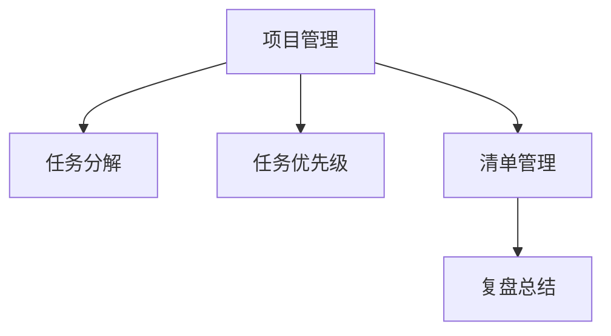

                 

# 巴菲特清单法则在项目管理中的应用

## 1. 背景介绍

### 1.1 问题由来
项目管理的核心目标是通过有效协调和利用资源，实现项目的目标。然而，在实际的项目实施中，项目通常面临诸多不确定性和复杂性，导致项目延期、成本超支、质量不达标等问题时有发生。这些问题不仅影响项目的成功交付，也会对企业的发展产生深远影响。

为了应对这些挑战，现代项目管理方法强调系统化、规范化管理。其中，巴菲特清单法则（Barbara W. Oakley 的清单法则）作为一种简洁而实用的项目管理工具，被广泛应用于项目管理的各个环节。该法则旨在通过清单管理，提升项目管理的系统性和高效性，确保项目的顺利实施。

### 1.2 问题核心关键点
巴菲特清单法则的核心思想是简化管理复杂度，将复杂的任务和过程分解为可控的小步骤，并通过清单形式进行管理，确保每个步骤都得到有效执行。该法则通常包括以下步骤：
1. 任务分解：将项目分解为可执行的小任务。
2. 任务优先级：根据任务的重要性和紧急性，确定任务的优先级。
3. 任务执行：按照优先级执行任务，逐步推进项目。
4. 任务复盘：定期回顾任务执行情况，总结经验，优化管理。

通过有效的任务分解和优先级管理，巴菲特清单法则可以显著提升项目管理效率，降低项目风险。该法则不仅适用于大型复杂项目，也适用于日常管理、团队协作等多个场景。

## 2. 核心概念与联系

### 2.1 核心概念概述

为更好地理解巴菲特清单法则在项目管理中的应用，本节将介绍几个密切相关的核心概念：

- 项目管理（Project Management）：通过规划、执行、监控和控制，确保项目目标的实现。项目管理强调资源协调、风险管理、进度控制等关键环节。
- 任务分解（Task Decomposition）：将复杂项目分解为可执行的小任务，便于管理和执行。任务分解是项目管理的重要基础。
- 任务优先级（Task Priority）：根据任务的重要性和紧急性，确定任务的执行顺序。任务优先级管理是确保项目高效推进的关键。
- 清单管理（To-Do List）：通过清单形式，系统地管理任务的执行情况。清单管理是巴菲特清单法则的核心手段。
- 复盘总结（Review and Retrospect）：定期回顾项目执行情况，总结经验教训，优化项目管理过程。复盘总结是持续改进的重要环节。

这些核心概念之间的逻辑关系可以通过以下Mermaid流程图来展示：



这个流程图展示了他的核心概念及其之间的关系：

1. 项目管理作为系统化的管理框架，是任务分解、优先级管理和清单管理的基础。
2. 任务分解将复杂的项目拆分为可执行的小任务，便于管理。
3. 任务优先级根据任务的重要性和紧急性，确定执行顺序。
4. 清单管理通过系统化的清单形式，管理任务的执行情况。
5. 复盘总结定期回顾执行情况，总结经验，优化管理。

这些概念共同构成了巴菲特清单法则在项目管理中的核心框架，帮助项目管理者有效地推进项目进程，确保项目目标的实现。

## 3. 核心算法原理 & 具体操作步骤
### 3.1 算法原理概述

巴菲特清单法则在项目管理中的应用，本质上是一种简化和系统化的任务管理方法。其核心原理是通过任务分解和优先级管理，将复杂项目拆分为可控的小步骤，并通过清单管理进行有效执行。

该法则的数学原理相对简单，主要涉及任务的数量和优先级排序。假设有 $N$ 个任务，每个任务有一个重要性和紧急性，用 $(I, E)$ 表示，其中 $I$ 表示任务的重要性，$E$ 表示任务的紧急性。任务的优先级 $P$ 可以用 $I$ 和 $E$ 的加权和表示，即：

$$
P = \alpha I + \beta E
$$

其中 $\alpha$ 和 $\beta$ 为权重系数，反映了项目管理者对任务重要性和紧急性的重视程度。任务执行的优先级越低，其执行的紧迫性和重要性越小，优先级越高的任务则需要在有限的时间内优先执行。

### 3.2 算法步骤详解

巴菲特清单法则在项目管理中的应用，通常包括以下几个关键步骤：

**Step 1: 项目任务分解**

1. 识别项目的主要目标和关键里程碑。
2. 将项目分解为多个可执行的任务，列出任务清单。
3. 对每个任务进行详细描述，明确任务的具体要求和执行步骤。
4. 为每个任务设定明确的输出和结果，便于后续的检查和验证。

**Step 2: 任务优先级排序**

1. 根据任务的重要性和紧急性，对任务进行初步排序。
2. 确定每个任务的具体优先级，确定哪些任务需要优先执行。
3. 制定详细的任务执行计划，确定任务的执行时间表和资源分配。

**Step 3: 任务清单管理**

1. 建立任务清单，按照优先级排序，记录每个任务的执行状态。
2. 定期更新任务清单，确保任务进展与计划一致。
3. 使用工具（如Trello、Asana、Jira等）辅助任务清单管理，提升效率。

**Step 4: 任务执行与复盘**

1. 按照任务清单执行任务，逐项完成每个任务。
2. 定期回顾任务执行情况，检查任务是否按计划执行，识别偏差和问题。
3. 总结任务执行的经验教训，优化任务管理流程，提升项目管理效率。

### 3.3 算法优缺点

巴菲特清单法则在项目管理中具有以下优点：
1. 简洁高效。通过任务分解和优先级管理，将复杂项目拆分为可控的小步骤，便于管理和执行。
2. 系统化管理。清单管理提供了一种系统化的任务执行方式，便于跟踪和控制。
3. 灵活可变。任务清单可以根据项目进展进行动态调整，灵活应对变化。
4. 提升效率。通过优先级排序，确保重要的任务得到优先执行，提升项目整体效率。

同时，该法则也存在一定的局限性：
1. 依赖项目经理。项目经理的经验和判断对任务分解和优先级排序具有重要影响，不同经理的处理方式可能不同。
2. 缺乏量化评估。任务的重要性和紧急性需要通过主观判断确定，可能导致不同的执行结果。
3. 适用性有限。对于较为简单、明确的项目，该法则效果显著，但对于复杂、多变的项目，可能需要结合其他方法综合应用。

尽管存在这些局限性，但就目前而言，巴菲特清单法则仍是一种简单而实用的项目管理工具，广泛应用于各类项目中。未来相关研究的重点在于如何进一步提升任务分解和优先级管理的科学性和精确性，以及如何更好地结合其他项目管理工具和技术，提升项目管理的效果。

### 3.4 算法应用领域

巴菲特清单法则在项目管理中的应用领域非常广泛，适用于各种类型的项目，包括但不限于：

- 软件开发项目：通过任务分解和优先级管理，确保软件功能按时完成。
- 市场营销活动：通过任务清单管理，确保活动按计划推进，达到预期效果。
- 企业内部流程改进：通过任务分解和优先级管理，提升流程效率和质量。
- 新产品研发：通过任务清单管理，确保研发进度符合预期，新产品按时上市。
- 日常团队管理：通过任务清单管理，提升团队协作和任务执行效率。

除了上述这些经典应用外，巴菲特清单法则也被创新性地应用到更多场景中，如事件管理、风险控制等，为项目管理提供了新的思路和方法。

## 4. 数学模型和公式 & 详细讲解 & 举例说明（备注：数学公式请使用latex格式，latex嵌入文中独立段落使用 $$，段落内使用 $)
### 4.1 数学模型构建

本节将使用数学语言对巴菲特清单法则在项目管理中的应用进行更加严格的刻画。

假设项目共有 $N$ 个任务，每个任务的重要性为 $I_i$，紧急性为 $E_i$，权重系数为 $\alpha$ 和 $\beta$。任务优先级 $P_i$ 可以用以下公式计算：

$$
P_i = \alpha I_i + \beta E_i
$$

在任务执行过程中，项目管理者需要定期回顾任务执行情况，识别偏差和问题，进行复盘总结。复盘总结通常包括以下步骤：

1. 检查任务执行情况，确认任务是否按计划执行。
2. 总结任务执行的经验教训，优化任务管理流程。
3. 调整任务优先级和执行计划，确保项目顺利推进。

通过复盘总结，项目管理者可以及时发现和解决项目中的问题，优化管理策略，提升项目执行效率。

### 4.2 公式推导过程

以下我们以一个简单的软件开发项目为例，推导任务优先级计算公式及其应用场景。

假设项目有 $N=4$ 个任务，每个任务的重要性和紧急性如下：

- 任务 1：重要性 $I_1=0.7$，紧急性 $E_1=0.8$
- 任务 2：重要性 $I_2=0.5$，紧急性 $E_2=0.6$
- 任务 3：重要性 $I_3=0.6$，紧急性 $E_3=0.5$
- 任务 4：重要性 $I_4=0.8$，紧急性 $E_4=0.7$

假设权重系数 $\alpha=0.6$，$\beta=0.4$，则每个任务优先级 $P_i$ 的计算公式如下：

$$
P_1 = 0.6 \times 0.7 + 0.4 \times 0.8 = 0.66 + 0.32 = 0.98
$$
$$
P_2 = 0.6 \times 0.5 + 0.4 \times 0.6 = 0.3 + 0.24 = 0.54
$$
$$
P_3 = 0.6 \times 0.6 + 0.4 \times 0.5 = 0.36 + 0.2 = 0.56
$$
$$
P_4 = 0.6 \times 0.8 + 0.4 \times 0.7 = 0.48 + 0.28 = 0.76
$$

根据优先级排序，任务 1 的优先级最高，需要优先执行。项目管理者可以根据优先级排序，制定详细的任务执行计划，确保项目顺利推进。

### 4.3 案例分析与讲解

以下我们以一个实际的软件开发项目为例，详细讲解巴菲特清单法则的应用过程。

项目：开发一个企业内部管理软件系统。项目包含以下任务：

1. 需求分析：分析企业需求，制定功能需求。
2. 系统设计：设计软件架构和技术栈。
3. 功能开发：开发核心功能模块。
4. 测试与验收：测试软件功能，确保质量。

项目管理者通过任务分解，将项目分解为以上四个可执行的任务。然后，根据任务的重要性和紧急性，确定每个任务的优先级。假设每个任务的重要性和紧急性如下：

- 需求分析：重要性 $I_1=0.8$，紧急性 $E_1=0.7$
- 系统设计：重要性 $I_2=0.6$，紧急性 $E_2=0.6$
- 功能开发：重要性 $I_3=0.7$，紧急性 $E_3=0.8$
- 测试与验收：重要性 $I_4=0.5$，紧急性 $E_4=0.5$

假设权重系数 $\alpha=0.6$，$\beta=0.4$，则每个任务优先级 $P_i$ 的计算公式如下：

$$
P_1 = 0.6 \times 0.8 + 0.4 \times 0.7 = 0.48 + 0.28 = 0.76
$$
$$
P_2 = 0.6 \times 0.6 + 0.4 \times 0.6 = 0.36 + 0.24 = 0.6
$$
$$
P_3 = 0.6 \times 0.7 + 0.4 \times 0.8 = 0.42 + 0.32 = 0.74
$$
$$
P_4 = 0.6 \times 0.5 + 0.4 \times 0.5 = 0.3 + 0.2 = 0.5
$$

根据优先级排序，任务 3 的优先级最高，需要优先执行。项目管理者制定了详细的任务执行计划，确保任务 3 按时完成。同时，定期回顾任务执行情况，检查任务是否按计划执行，总结经验教训，优化任务管理流程。通过复盘总结，项目管理者发现任务 1 和任务 2 的优先级排序不合理，导致需求分析进度缓慢。因此，调整任务优先级，将任务 1 和任务 2 提前执行。调整后的任务优先级如下：

- 需求分析：重要性 $I_1=0.8$，紧急性 $E_1=0.7$
- 系统设计：重要性 $I_2=0.6$，紧急性 $E_2=0.6$
- 测试与验收：重要性 $I_3=0.7$，紧急性 $E_3=0.8$
- 功能开发：重要性 $I_4=0.5$，紧急性 $E_4=0.5$

调整后的优先级排序如下：

- 需求分析：优先级 $P_1=0.76$
- 系统设计：优先级 $P_2=0.6$
- 测试与验收：优先级 $P_3=0.74$
- 功能开发：优先级 $P_4=0.5$

项目管理者按照优先级排序，制定详细的任务执行计划，确保项目顺利推进。通过有效的任务分解和优先级管理，巴菲特清单法则帮助项目管理者有效应对项目中的不确定性和复杂性，确保项目按时完成。

## 5. 项目实践：代码实例和详细解释说明
### 5.1 开发环境搭建

在进行项目管理实践前，我们需要准备好开发环境。以下是使用Python进行项目管理的环境配置流程：

1. 安装Python：从官网下载并安装Python，建议使用Python 3.x版本。
2. 安装项目管理工具：例如JIRA、Trello、Asana等项目管理工具。
3. 安装Git和GitHub：使用Git进行版本控制，使用GitHub进行代码托管。
4. 安装配置Git客户端：如GitHub Desktop、GitKraken等，方便进行Git操作。
5. 配置环境变量：设置Git、Python等工具的路径，以便系统自动查找使用。

完成上述步骤后，即可在本地环境中开始项目管理实践。

### 5.2 源代码详细实现

以下是一个简单的项目管理实践代码实现，使用Python语言进行描述。

首先，定义任务及其属性：

```python
class Task:
    def __init__(self, name, importance, urgency):
        self.name = name
        self.importance = importance
        self.urgency = urgency
        self.priority = self.calculate_priority()

    def calculate_priority(self):
        alpha = 0.6
        beta = 0.4
        return alpha * self.importance + beta * self.urgency
```

然后，定义任务清单管理类：

```python
class TaskList:
    def __init__(self):
        self.tasks = []

    def add_task(self, task):
        self.tasks.append(task)

    def display_tasks(self):
        for task in self.tasks:
            print(f"{task.name}：优先级 {task.priority}")

    def update_task_priority(self, task_name, importance, urgency):
        for task in self.tasks:
            if task.name == task_name:
                task.importance = importance
                task.urgency = urgency
                task.priority = task.calculate_priority()
```

接着，定义项目管理类：

```python
class ProjectManager:
    def __init__(self, tasks):
        self.tasks = tasks
        self.task_list = TaskList()

    def initialize_tasks(self):
        # 初始化任务
        task1 = Task("需求分析", 0.8, 0.7)
        task2 = Task("系统设计", 0.6, 0.6)
        task3 = Task("功能开发", 0.7, 0.8)
        task4 = Task("测试与验收", 0.5, 0.5)
        self.task_list.add_task(task1)
        self.task_list.add_task(task2)
        self.task_list.add_task(task3)
        self.task_list.add_task(task4)

    def display_tasks(self):
        self.task_list.display_tasks()

    def update_task_priority(self, task_name, importance, urgency):
        self.task_list.update_task_priority(task_name, importance, urgency)
        self.task_list.display_tasks()

    def main(self):
        self.initialize_tasks()
        self.display_tasks()
        self.update_task_priority("需求分析", 0.9, 0.8)
        self.display_tasks()

if __name__ == '__main__':
    project_manager = ProjectManager([])
    project_manager.main()
```

最后，启动项目管理实践：

```python
# 运行项目管理代码
python project_manager.py
```

以上就是使用Python进行项目管理的完整代码实现。可以看到，通过定义任务和任务清单管理类，可以方便地实现任务的优先级排序和清单管理。项目管理器可以通过调用方法，实现任务的添加、更新和显示，确保项目的顺利推进。

### 5.3 代码解读与分析

让我们再详细解读一下关键代码的实现细节：

**Task类**：
- `__init__`方法：初始化任务属性，包括任务名称、重要性和紧急性。
- `calculate_priority`方法：根据任务的重要性和紧急性，计算任务的优先级。

**TaskList类**：
- `__init__`方法：初始化任务列表。
- `add_task`方法：将任务添加到任务列表中。
- `display_tasks`方法：显示任务列表。
- `update_task_priority`方法：更新任务的优先级，重新计算优先级。

**ProjectManager类**：
- `__init__`方法：初始化项目管理类，包含任务列表。
- `initialize_tasks`方法：初始化项目任务。
- `display_tasks`方法：显示任务列表。
- `update_task_priority`方法：更新任务优先级，重新计算优先级，并显示更新后的任务列表。
- `main`方法：启动项目管理流程。

**main方法**：
- 初始化任务列表，添加四个任务。
- 显示任务列表。
- 更新需求分析任务的优先级。
- 再次显示任务列表。

可以看到，通过定义类和继承机制，我们能够将复杂的项目管理任务封装成可重用的代码模块。在实际的项目管理中，可以通过调用这些方法，灵活管理任务，确保项目的顺利推进。

当然，工业级的系统实现还需考虑更多因素，如多任务并发管理、任务依赖关系处理、任务状态追踪等。但核心的任务分解和优先级管理逻辑基本与此类似。

## 6. 实际应用场景
### 6.1 智能客服系统

巴菲特清单法则在智能客服系统的构建中，可以发挥重要作用。智能客服系统需要实时响应客户咨询，提供高质量的咨询服务。通过任务清单管理，可以系统地管理客服任务的执行，确保客户咨询得到及时响应。

在技术实现上，可以收集历史客服对话记录，将问题和最佳答复构建成监督数据，在此基础上对预训练的客服模型进行微调。微调后的客服模型能够自动理解客户意图，匹配最合适的答复。对于客户提出的新问题，还可以接入检索系统实时搜索相关内容，动态生成回答。如此构建的智能客服系统，能大幅提升客户咨询体验和问题解决效率。

### 6.2 金融舆情监测

巴菲特清单法则在金融舆情监测中，可以应用于实时舆情分析，确保舆情信息的及时处理。金融领域需要实时监测市场舆论动向，以便及时应对负面信息传播，规避金融风险。

具体而言，可以收集金融领域相关的新闻、报道、评论等文本数据，并对其进行主题标注和情感标注。在此基础上对预训练语言模型进行微调，使其能够自动判断文本属于何种主题，情感倾向是正面、中性还是负面。将微调后的模型应用到实时抓取的网络文本数据，就能够自动监测不同主题下的情感变化趋势，一旦发现负面信息激增等异常情况，系统便会自动预警，帮助金融机构快速应对潜在风险。

### 6.3 个性化推荐系统

巴菲特清单法则在个性化推荐系统中，可以应用于推荐任务分解和优先级管理。推荐系统需要实时分析用户行为数据，推荐个性化的物品。通过任务清单管理，可以系统地管理推荐任务的执行，确保推荐结果的及时性和准确性。

在技术实现上，可以收集用户浏览、点击、评论、分享等行为数据，提取和用户交互的物品标题、描述、标签等文本内容。将文本内容作为模型输入，用户的后续行为（如是否点击、购买等）作为监督信号，在此基础上微调预训练语言模型。微调后的模型能够从文本内容中准确把握用户的兴趣点。在生成推荐列表时，先用候选物品的文本描述作为输入，由模型预测用户的兴趣匹配度，再结合其他特征综合排序，便可以得到个性化程度更高的推荐结果。

### 6.4 未来应用展望

随着巴菲特清单法则的不断发展，项目管理的应用范围将进一步拓展，带来更高效的项目管理和更高的项目成功率。

在智慧医疗领域，通过任务清单管理，可以系统地管理医疗项目的各个环节，确保医疗项目的按时完成。在智能教育领域，通过任务清单管理，可以系统地管理教育项目的各个环节，提升教育项目的实施效率。在智慧城市治理中，通过任务清单管理，可以系统地管理城市项目的各个环节，提高城市项目的实施效率。

此外，在企业生产、社会治理、文娱传媒等众多领域，巴菲特清单法则也将不断应用，为项目管理带来新的思路和方法。随着方法的不断完善和优化，巴菲特清单法则必将在更广阔的领域发挥更大的作用。

## 7. 工具和资源推荐
### 7.1 学习资源推荐

为了帮助开发者系统掌握巴菲特清单法则的理论基础和实践技巧，这里推荐一些优质的学习资源：

1. 《项目管理之道》（Project Management Essential for Success）：该书详细介绍了项目管理的基本概念和经典方法，包括任务分解、优先级管理等核心内容。
2. PMP（Professional in Project Management）：项目管理领域的国际认证，系统地培训项目管理知识和技能。
3. Agile（敏捷项目管理）：敏捷项目管理方法论，强调灵活性、快速响应和迭代改进，适用于复杂项目。
4. Scrum（Scrum框架）：敏捷项目管理框架，通过Scrum Master和产品负责人等角色，实现项目的高效管理。
5. JIRA（项目管理工具）：全球领先的项目管理工具，支持任务清单管理、优先级排序等功能。

通过对这些资源的学习实践，相信你一定能够快速掌握巴菲特清单法则的精髓，并用于解决实际的项目管理问题。
###  7.2 开发工具推荐

高效的开发离不开优秀的工具支持。以下是几款用于项目管理开发的常用工具：

1. JIRA：全球领先的项目管理工具，支持任务清单管理、优先级排序、任务状态追踪等功能。
2. Trello：简单易用的项目管理工具，通过看板视图展示任务进展。
3. Asana：全面的项目管理工具，支持任务分配、优先级排序、任务依赖等功能。
4. Microsoft Project：经典的项目管理工具，支持甘特图、任务分配等功能。
5. Monday.com：强大的项目管理工具，支持任务清单管理、任务状态追踪、实时协作等功能。

合理利用这些工具，可以显著提升项目管理的效率，降低项目风险，确保项目的顺利推进。

### 7.3 相关论文推荐

巴菲特清单法则作为一种项目管理方法，其应用范围和效果得到了广泛认可。以下是几篇经典的相关论文，推荐阅读：

1. "Project Management Principles and Practices" by PMBOK Guide：项目管理领域的经典指南，详细介绍了项目管理的基本原则和方法。
2. "Agile Project Management: The Definitive Guide" by Scott Sehlhorst：敏捷项目管理的全面指南，详细介绍敏捷项目管理的方法和实践。
3. "Scrum Guide" by Ken Schwaber and Mike Beedle：Scrum框架的官方指南，详细介绍Scrum框架的基本概念和实践。
4. "Project Management for the Masses" by team leaders：针对非专业人士的项目管理入门指南，通俗易懂，易于实践。
5. "The Lean Startup" by Eric Ries：精益创业方法论，强调快速迭代和持续改进，适用于创业项目。

这些论文代表了大项目管理方法的不断发展，通过学习这些前沿成果，可以帮助研究者把握学科前进方向，激发更多的创新灵感。

## 8. 总结：未来发展趋势与挑战

### 8.1 总结

本文对巴菲特清单法则在项目管理中的应用进行了全面系统的介绍。首先阐述了巴菲特清单法则的背景和意义，明确了任务分解和优先级管理在项目管理中的重要性。其次，从原理到实践，详细讲解了巴菲特清单法则的数学原理和关键步骤，给出了项目管理任务开发的完整代码实例。同时，本文还广泛探讨了巴菲特清单法则在智能客服、金融舆情、个性化推荐等多个行业领域的应用前景，展示了巴菲特清单法则的巨大潜力。此外，本文精选了巴菲特清单法则的学习资源，力求为读者提供全方位的技术指引。

通过本文的系统梳理，可以看到，巴菲特清单法则在项目管理中的应用，通过任务分解和优先级管理，将复杂项目拆分为可控的小步骤，并通过清单管理进行有效执行，显著提升了项目管理效率，降低了项目风险。巴菲特清单法则不仅适用于大型复杂项目，也适用于日常管理、团队协作等多个场景。

### 8.2 未来发展趋势

展望未来，巴菲特清单法则在项目管理中呈现以下几个发展趋势：

1. 自动化和智能化：通过引入人工智能和自动化工具，提升任务分解和优先级管理的效率和准确性。
2. 跨领域融合：与敏捷、精益等方法论结合，形成更加灵活和高效的项目管理方法。
3. 多模态管理：引入多模态数据（如文本、图片、音频等），提升项目管理的全面性和系统性。
4. 在线协作：通过在线协作平台，提升团队协作和任务管理的实时性。
5. 数据驱动：利用大数据和机器学习技术，提升项目管理的科学性和智能化水平。

这些趋势凸显了巴菲特清单法则的广泛应用前景。这些方向的探索发展，必将进一步提升项目管理的效果，推动项目管理技术不断创新。

### 8.3 面临的挑战

尽管巴菲特清单法则在项目管理中取得了显著效果，但在应用过程中仍面临诸多挑战：

1. 任务分解的科学性：任务分解的粒度、深度和准确性直接影响项目管理的效果。如何科学地进行任务分解，仍是项目管理的难点。
2. 优先级管理的合理性：优先级管理的科学性直接关系到项目进展的效率和质量。如何合理确定任务的优先级，仍是项目管理的挑战。
3. 任务清单的管理：任务清单的管理需要系统性和灵活性相结合，如何在任务执行过程中动态更新任务清单，仍需进一步优化。
4. 跨部门协作：跨部门协作是项目管理中的常见问题，如何提升跨部门协作效率，仍是项目管理的重要课题。
5. 资源约束：项目管理的资源约束（如时间、人力、资金等）直接影响项目进展和质量。如何在有限的资源条件下，最大化项目效益，仍是项目管理的难题。

尽管存在这些挑战，但通过不断的实践和改进，巴菲特清单法则必将在项目管理中发挥更大的作用，推动项目管理技术的不断进步。

### 8.4 研究展望

面对巴菲特清单法则在项目管理中面临的挑战，未来的研究需要在以下几个方面寻求新的突破：

1. 科学任务分解：结合项目管理的理论和实践，探索科学的任务分解方法，提升任务分解的粒度、深度和准确性。
2. 合理优先级管理：结合项目的实际需求和资源约束，探索合理的优先级管理方法，提升优先级管理的合理性和科学性。
3. 灵活任务清单管理：结合项目管理的实际情况，探索灵活的任务清单管理方法，提升任务清单的动态性和可操作性。
4. 跨部门协作优化：结合组织管理理论和实践，探索跨部门协作的优化方法，提升跨部门协作的效率和质量。
5. 资源优化配置：结合资源管理理论和实践，探索资源优化配置的方法，提升资源的利用率和效益。

这些研究方向的探索，必将引领巴菲特清单法则在项目管理中的应用迈向更高的台阶，为项目管理技术的发展提供新的动力。面向未来，巴菲特清单法则需要在任务分解、优先级管理、任务清单管理等方面不断优化和创新，确保项目管理的科学性和高效性，推动项目管理技术的不断进步。

## 9. 附录：常见问题与解答

**Q1：巴菲特清单法则是否适用于所有类型的项目？**

A: 巴菲特清单法则适用于各类项目，特别是大型复杂项目。通过任务分解和优先级管理，可以显著提升项目管理的系统性和高效性。但对于一些特定领域，如医疗、法律等，巴菲特清单法则可能需要进行适当调整，以适应特定需求。

**Q2：如何科学地进行任务分解？**

A: 科学的任务分解需要考虑项目的复杂性和资源约束，通常可以采用以下步骤：
1. 识别项目的关键里程碑，分解为可执行的小任务。
2. 确定每个任务的具体要求和执行步骤，确保任务的可操作性和可测量性。
3. 评估任务之间的依赖关系，确保任务执行的顺序和时间表。

**Q3：如何合理确定任务的优先级？**

A: 合理确定任务优先级需要考虑任务的重要性和紧急性，通常可以采用以下方法：
1. 根据任务对项目目标的贡献程度，确定任务的重要性。
2. 根据任务的时限和资源需求，确定任务的紧急性。
3. 结合项目管理的实际情况，综合考虑任务的重要性和紧急性，确定优先级排序。

**Q4：如何动态更新任务清单？**

A: 动态更新任务清单需要及时跟踪项目进展，通常可以采用以下方法：
1. 定期回顾任务执行情况，检查任务是否按计划执行。
2. 根据任务执行的实际进展，动态调整任务优先级和执行计划。
3. 使用项目管理工具辅助任务清单管理，提升任务清单的实时性和灵活性。

**Q5：如何提升跨部门协作效率？**

A: 提升跨部门协作效率需要加强沟通和协调，通常可以采用以下方法：
1. 建立跨部门协作机制，明确各部门的职责和任务。
2. 定期召开跨部门协调会议，沟通项目进展和问题。
3. 使用协作工具，如在线协作平台，提升跨部门协作的实时性和效率。

这些问题的解答，有助于进一步理解和应用巴菲特清单法则，提升项目管理的效果和质量。通过科学的任务分解和优先级管理，结合项目管理工具和实践，巴菲特清单法则必将在项目管理中发挥更大的作用，推动项目管理技术的不断进步。

---

作者：禅与计算机程序设计艺术 / Zen and the Art of Computer Programming

