                 

# 2050年的人类生活：科技与生活的融合

> 关键词：人工智能, 机器学习, 自然语言处理, 量子计算, 生物工程, 虚拟现实, 认知增强, 未来城市

## 1. 背景介绍

### 1.1 未来科技发展概述

自20世纪中叶以来，科技的发展日新月异，深刻改变了人类的生活和工作方式。随着大数据、云计算、人工智能、量子计算等技术的飞速进步，未来50年内，科技与人类生活的融合将达到前所未有的高度。

人工智能（AI）作为科技创新的主要驱动力，将在2050年以前迎来里程碑式的发展。机器学习（ML）、深度学习（DL）等技术将进一步深化，推动智能机器在各领域的应用。自然语言处理（NLP）、计算机视觉（CV）、语音识别等技术将变得更加智能和高效，为人类提供更加便捷的服务。

量子计算作为一种全新的计算范式，将解决当前计算机无法处理的复杂问题，带来算力上的突破。生物工程将使人类能够治疗当前无法根治的疾病，甚至改善人类的基因和身体结构。虚拟现实（VR）、增强现实（AR）、混合现实（MR）等技术将重塑人类的感知世界，改变人类与信息交互的方式。

### 1.2 未来生活方式的主要特征

未来50年内，人类生活的方方面面将因科技发展而改变，主要特征包括：

- **智能家居**：智能家电和控制系统将实现全自动化，提升生活质量。
- **远程工作**：通过虚拟会议和远程协作工具，人类可以随时随地工作，打破地域限制。
- **个性化医疗**：基因编辑和精准医疗将使人们能够根据自身基因信息进行个性化治疗，延长寿命。
- **智能交通**：自动驾驶和智能交通管理系统将减少交通事故，提升出行效率。
- **智能教育**：智能教育系统将提供个性化学习内容，提升教育效果。
- **智能能源**：智能电网和新能源技术将实现能源的可持续和高效利用。

## 2. 核心概念与联系

### 2.1 核心概念概述

在探讨未来科技如何改变人类生活之前，首先需要理解几个核心概念：

- **人工智能（AI）**：使机器能够模拟、延伸和扩展人的智能能力，包括感知、学习、推理、问题求解等。
- **机器学习（ML）**：通过算法让机器自动学习数据中的模式，从而实现自主决策。
- **自然语言处理（NLP）**：使机器能够理解、处理和生成人类语言。
- **量子计算**：基于量子力学的计算范式，实现高效的并行计算。
- **生物工程**：通过基因编辑、合成生物学等手段，实现生物系统的改造。
- **虚拟现实（VR）**：创建沉浸式虚拟环境，增强人类对现实世界的感知。
- **增强现实（AR）**：通过数字信息增强现实世界的感知体验。
- **混合现实（MR）**：融合现实世界和虚拟世界的技术。
- **认知增强**：通过神经科学、心理学等手段，提升人类认知能力。
- **未来城市**：基于智能基础设施和系统，实现城市管理的高效化、智能化。

### 2.2 核心概念之间的联系

这些核心概念之间存在着紧密的联系和相互作用。例如：

- **AI与ML**：AI是ML的一种应用，ML提供了AI实现的基础算法。
- **NLP与VR**：NLP通过机器翻译、语音识别等技术，使VR应用更加自然流畅。
- **量子计算与生物工程**：量子计算可以加速基因分析，促进生物工程的突破。
- **智能交通与能源管理**：智能交通系统需要高效能源管理作为支撑，两者相辅相成。
- **认知增强与未来城市**：提升城市居民的认知能力，可以更好地适应智能城市生活。

这些概念的联系可以通过以下Mermaid流程图来展示：

```mermaid
graph TB
    A[人工智能] --> B[机器学习]
    A --> C[自然语言处理]
    A --> D[量子计算]
    A --> E[生物工程]
    A --> F[虚拟现实]
    A --> G[增强现实]
    A --> H[混合现实]
    A --> I[认知增强]
    A --> J[未来城市]
    
    B --> K[深度学习]
    B --> L[数据挖掘]
    B --> M[异常检测]
    B --> N[图像识别]
    B --> O[语音识别]
    
    C --> P[机器翻译]
    C --> Q[语音合成]
    C --> R[情感分析]
    C --> S[文本分类]
    
    D --> T[量子算法]
    D --> U[量子纠缠]
    D --> V[量子编码]
    D --> W[量子模拟]
    
    E --> X[基因编辑]
    E --> Y[合成生物学]
    E --> Z[生物信息学]
    
    F --> AA[沉浸式环境]
    F --> AB[虚拟对象]
    F --> AC[交互式界面]
    
    G --> AD[数字增强]
    G --> AE[场景重构]
    G --> AF[交互式场景]
    
    H --> AG[现实与虚拟融合]
    H --> AH[多感官交互]
    H --> AI[空间映射]
    
    I --> AJ[认知训练]
    I --> AK[认知增强]
    I --> AL[情感认知]
    I --> AM[记忆增强]
    
    J --> AN[智能基础设施]
    J --> AO[智能交通]
    J --> AP[智能能源]
    J --> AQ[智能医疗]
    J --> AR[智能教育]
```



## 3. 核心算法原理 & 具体操作步骤

### 3.1 算法原理概述

人工智能与机器学习技术的融合，使得机器能够自动学习和优化，从而实现自主决策和智能行为。以自然语言处理为例，机器通过深度学习模型，理解自然语言的语义和语法结构，实现文本分类、情感分析、机器翻译等任务。

在未来50年，这些技术将更加成熟和普及，使得人类生活更加智能化和个性化。例如，智能家居系统将通过AI和ML，实现对家庭环境的智能监控和管理。智能交通系统将利用机器学习算法，优化交通流量和路线规划，减少交通拥堵和事故。

### 3.2 算法步骤详解

在未来，科技与生活的融合将通过以下步骤实现：

1. **数据收集与预处理**：收集人类生活相关的数据，并进行清洗和标注，为机器学习模型提供数据基础。
2. **模型训练与优化**：使用机器学习算法对数据进行训练，优化模型参数，提高预测准确率。
3. **模型部署与测试**：将训练好的模型部署到实际场景中，进行测试和优化，确保模型稳定运行。
4. **持续学习与更新**：通过持续收集新数据，对模型进行不断更新和优化，提高模型适应性。
5. **集成与协同**：将多个模型和系统集成，实现协同工作，提升整体性能。

### 3.3 算法优缺点

未来科技与生活融合的优势包括：

- **效率提升**：智能系统可以自动完成重复性、高强度的工作，提高生产效率和生活质量。
- **决策优化**：机器学习模型可以通过大量数据学习最优策略，提升决策准确性和公正性。
- **个性化服务**：智能系统能够根据个体需求提供定制化服务，提升用户体验。

但同时也存在一些挑战和风险：

- **隐私和安全**：智能系统需要收集大量个人数据，可能引发隐私泄露和数据安全问题。
- **公平性和偏见**：机器学习模型的决策可能受到训练数据偏见的影响，导致不公平。
- **技术依赖**：对技术设备的依赖可能导致系统故障和维护成本高昂。
- **社会适应性**：部分社会成员可能难以适应新技术，引发就业和社会问题。

### 3.4 算法应用领域

未来科技与生活的融合将覆盖以下领域：

- **智能制造**：通过机器人、自动化生产线等技术，实现高效、智能的生产流程。
- **智慧农业**：通过智能传感器和AI算法，优化农业生产，提高粮食产量和质量。
- **医疗健康**：通过基因编辑、精准医疗等技术，改善人类健康状况。
- **环保节能**：通过智能电网、节能技术等，实现资源的可持续利用。
- **教育培训**：通过智能教育系统，提供个性化学习体验，提升教育效果。

## 4. 数学模型和公式 & 详细讲解 & 举例说明

### 4.1 数学模型构建

在未来科技与生活的融合中，数学模型将发挥关键作用。以下是几个典型的数学模型：

- **神经网络模型**：用于处理和分析大规模数据，实现智能决策。
- **优化模型**：用于模型参数的优化和调整，提高预测准确性。
- **概率模型**：用于评估事件发生的概率，提供决策依据。
- **动态系统模型**：用于描述系统状态的变化，预测未来趋势。

### 4.2 公式推导过程

以神经网络模型为例，其数学推导过程如下：

$$
\begin{aligned}
    &y = f(z) \\
    &z = W_{\theta} x + b_{\theta}
\end{aligned}
$$

其中，$y$ 表示输出，$z$ 表示中间层特征，$W_{\theta}$ 和 $b_{\theta}$ 是神经网络参数，$f(z)$ 表示激活函数。

### 4.3 案例分析与讲解

例如，一个智能家居系统可以通过神经网络模型，对家庭成员的行为数据进行分析，预测房间的使用情况，自动调整照明和温度。模型输入包括家庭成员的位置、时间、活动类型等，输出为房间的使用状态。

## 5. 项目实践：代码实例和详细解释说明

### 5.1 开发环境搭建

在未来，智能系统的开发将依赖于强大的计算资源和数据平台。以下是开发环境的搭建步骤：

1. **安装编程语言**：选择Python、R等流行的编程语言，并配置好开发环境。
2. **安装开发工具**：安装PyTorch、TensorFlow等深度学习框架，以及VSCode等IDE。
3. **数据准备**：收集相关数据集，并进行预处理和标注。
4. **模型训练**：使用深度学习框架训练模型，优化参数。
5. **系统集成**：将模型集成到实际应用中，进行测试和优化。

### 5.2 源代码详细实现

以智能家居系统为例，以下是Python代码实现：

```python
import torch
import torch.nn as nn
import torch.optim as optim

# 定义神经网络模型
class SmartHomeModel(nn.Module):
    def __init__(self):
        super(SmartHomeModel, self).__init__()
        self.fc1 = nn.Linear(10, 64)
        self.fc2 = nn.Linear(64, 8)
        self.fc3 = nn.Linear(8, 2)

    def forward(self, x):
        x = torch.relu(self.fc1(x))
        x = torch.relu(self.fc2(x))
        x = self.fc3(x)
        return x

# 加载数据集
def load_data():
    # 数据集预处理和加载代码
    pass

# 训练模型
def train_model(model, optimizer, data_loader):
    for epoch in range(100):
        for batch in data_loader:
            inputs, labels = batch
            optimizer.zero_grad()
            outputs = model(inputs)
            loss = nn.functional.mse_loss(outputs, labels)
            loss.backward()
            optimizer.step()

# 测试模型
def test_model(model, data_loader):
    total_loss = 0
    for batch in data_loader:
        inputs, labels = batch
        outputs = model(inputs)
        loss = nn.functional.mse_loss(outputs, labels)
        total_loss += loss.item()
    return total_loss / len(data_loader)

# 主函数
if __name__ == '__main__':
    # 初始化模型和优化器
    model = SmartHomeModel()
    optimizer = optim.Adam(model.parameters(), lr=0.001)

    # 加载数据集
    data_loader = load_data()

    # 训练模型
    train_model(model, optimizer, data_loader)

    # 测试模型
    test_loss = test_model(model, data_loader)
    print(f'Test loss: {test_loss:.4f}')
```

### 5.3 代码解读与分析

上述代码展示了智能家居系统的基本实现步骤：

- **模型定义**：定义了三层神经网络模型，包括两个全连接层和一个输出层。
- **数据加载**：通过函数加载和处理数据集，为模型提供训练和测试数据。
- **模型训练**：使用Adam优化器对模型进行训练，最小化均方误差损失。
- **模型测试**：在测试数据集上评估模型性能，输出测试损失。

## 6. 实际应用场景

### 6.1 智能家居

智能家居系统通过物联网技术，将家庭设备连接起来，实现全自动化控制。例如，智能门锁、智能灯光、智能温控器等设备可以根据家庭成员的偏好和行为，自动调整设置，提升生活质量。

### 6.2 智慧城市

智慧城市利用AI和ML技术，实现城市管理的智能化和高效化。例如，智能交通系统通过实时监控交通流量，优化路线规划，减少交通拥堵。智能能源管理系统通过分析能源消耗数据，优化能源分配，实现资源的高效利用。

### 6.3 个性化医疗

个性化医疗通过基因编辑和精准医疗技术，根据个体基因信息，提供量身定制的治疗方案。例如，基于AI的基因诊断系统可以快速识别疾病的基因突变，提供个性化治疗建议。

### 6.4 未来交通

智能交通系统通过自动驾驶技术和智能调度算法，实现车辆自动驾驶和交通流量优化。例如，自动驾驶车辆可以通过AI算法，实时感知周围环境，安全行驶。智能交通管理系统可以通过大数据分析，优化交通流量和路线规划，减少交通拥堵。

## 7. 工具和资源推荐

### 7.1 学习资源推荐

以下是一些优秀的学习资源：

1. **《深度学习》（Goodfellow et al.）**：介绍了深度学习的基本原理和算法。
2. **《人工智能：一种现代的方法》（Russell & Norvig）**：涵盖了人工智能的各个方面，包括机器学习、知识表示、推理等。
3. **《Python深度学习》（Francois Chollet）**：介绍了使用TensorFlow和Keras进行深度学习的实践。
4. **Coursera、edX等在线课程平台**：提供大量AI和ML相关课程，涵盖从入门到高级的内容。
5. **arXiv预印本网站**：获取最新的AI研究成果和论文。

### 7.2 开发工具推荐

以下是一些常用的开发工具：

1. **PyTorch**：开源深度学习框架，支持动态计算图。
2. **TensorFlow**：由Google开发的深度学习框架，支持分布式计算。
3. **Jupyter Notebook**：用于编写和运行Python代码的交互式环境。
4. **VSCode**：流行的IDE，支持多种编程语言和框架。
5. **Git**：版本控制工具，方便代码管理和协作。

### 7.3 相关论文推荐

以下是一些重要的AI相关论文：

1. **《DeepMind使用AlphaGo战胜围棋世界冠军》（Silver et al.）**：展示了机器学习的强大潜力。
2. **《AlphaZero：自学成才的通用强化学习算法》（Heinrich et al.）**：展示了强化学习在复杂问题上的应用。
3. **《GPT-3：语言模型中的任务导向学习》（Brown et al.）**：展示了大规模预训练语言模型的效果。
4. **《量子计算机算法和实现》（Nguyen et al.）**：介绍了量子计算的基本原理和应用。
5. **《基因组学：未来的医学和生物学》（Gardner）**：介绍了基因编辑和精准医疗的未来前景。

## 8. 总结：未来发展趋势与挑战

### 8.1 研究成果总结

未来50年内，科技与生活的融合将达到新的高度，AI、ML等技术将广泛应用到各个领域，改变人类的生活方式和工作方式。

### 8.2 未来发展趋势

未来科技与生活融合的主要趋势包括：

- **深度学习的应用更加广泛**：AI和ML技术将广泛应用于医疗、制造、交通等领域，提升生产力和生活品质。
- **量子计算的突破**：量子计算将解决当前计算范式无法解决的问题，推动科技的突破性发展。
- **生物工程的发展**：基因编辑和合成生物学将带来新的医学和农业技术，改善人类生活质量。
- **虚拟现实和增强现实的应用**：VR、AR等技术将改变人类的感知世界，提升用户体验。
- **认知增强和智能城市**：通过认知增强技术提升人类认知能力，智能城市实现高效管理。

### 8.3 面临的挑战

未来科技与生活融合面临的挑战包括：

- **隐私和安全**：AI和ML系统需要处理大量个人数据，引发隐私和数据安全问题。
- **公平性和偏见**：机器学习模型的决策可能受到训练数据偏见的影响，导致不公平。
- **技术依赖**：对技术设备的依赖可能导致系统故障和维护成本高昂。
- **社会适应性**：部分社会成员可能难以适应新技术，引发就业和社会问题。

### 8.4 研究展望

未来科技与生活的融合需要解决以下几个关键问题：

- **隐私保护**：开发隐私保护技术，确保数据安全。
- **公平性优化**：优化机器学习算法，消除偏见，实现公平决策。
- **技术融合**：实现AI、ML与物联网、区块链等技术的融合，提升系统综合性能。
- **社会适应性**：开发教育培训和支持体系，帮助社会成员适应新技术。

总之，未来科技与生活的融合需要全社会的共同努力，才能实现更加智能、高效、可持续的生活方式。

## 9. 附录：常见问题与解答

**Q1: 未来科技与生活融合的主要推动力是什么？**

A: 未来科技与生活融合的主要推动力包括：
- **科技进步**：深度学习、量子计算、基因编辑等技术的突破，推动了新应用的开发。
- **市场需求**：智能家居、智慧城市、个性化医疗等领域的市场需求，为技术应用提供了动力。
- **政策支持**：各国政府对科技创新的大力支持，为技术发展提供了政策保障。

**Q2: 未来科技与生活融合的主要挑战是什么？**

A: 未来科技与生活融合的主要挑战包括：
- **隐私和安全**：AI和ML系统需要处理大量个人数据，引发隐私和数据安全问题。
- **公平性和偏见**：机器学习模型的决策可能受到训练数据偏见的影响，导致不公平。
- **技术依赖**：对技术设备的依赖可能导致系统故障和维护成本高昂。
- **社会适应性**：部分社会成员可能难以适应新技术，引发就业和社会问题。

**Q3: 未来科技与生活融合的主要应用领域是什么？**

A: 未来科技与生活融合的主要应用领域包括：
- **智能制造**：通过机器人、自动化生产线等技术，实现高效、智能的生产流程。
- **智慧农业**：通过智能传感器和AI算法，优化农业生产，提高粮食产量和质量。
- **医疗健康**：通过基因编辑、精准医疗等技术，改善人类健康状况。
- **环保节能**：通过智能电网、节能技术等，实现资源的可持续利用。
- **教育培训**：通过智能教育系统，提供个性化学习体验，提升教育效果。

**Q4: 未来科技与生活融合的主要趋势是什么？**

A: 未来科技与生活融合的主要趋势包括：
- **深度学习的应用更加广泛**：AI和ML技术将广泛应用于医疗、制造、交通等领域，提升生产力和生活品质。
- **量子计算的突破**：量子计算将解决当前计算范式无法解决的问题，推动科技的突破性发展。
- **生物工程的发展**：基因编辑和合成生物学将带来新的医学和农业技术，改善人类生活质量。
- **虚拟现实和增强现实的应用**：VR、AR等技术将改变人类的感知世界，提升用户体验。
- **认知增强和智能城市**：通过认知增强技术提升人类认知能力，智能城市实现高效管理。

**Q5: 未来科技与生活融合的主要挑战是什么？**

A: 未来科技与生活融合的主要挑战包括：
- **隐私保护**：开发隐私保护技术，确保数据安全。
- **公平性优化**：优化机器学习算法，消除偏见，实现公平决策。
- **技术融合**：实现AI、ML与物联网、区块链等技术的融合，提升系统综合性能。
- **社会适应性**：开发教育培训和支持体系，帮助社会成员适应新技术。

---

作者：禅与计算机程序设计艺术 / Zen and the Art of Computer Programming

