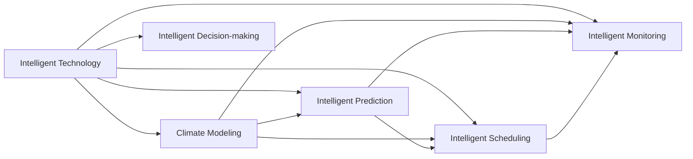

                 

## 1. 背景介绍

### 1.1 问题由来

随着工业化进程的推进，全球气候变暖问题日益严峻，对人类生存环境构成了巨大威胁。联合国气候变化框架公约（UNFCCC）预测，到2050年，全球平均温度将上升2-3摄氏度。这一变化将引发海平面上升、极端天气频发、生态系统崩溃等一系列连锁反应，对农业、水资源、健康和经济发展造成深远影响。

### 1.2 问题核心关键点

- **全球变暖**：工业化以来的温室气体排放导致的地球平均气温升高。
- **气候变化**：由全球变暖引起的自然环境变化，包括极端天气、海平面上升等。
- **适应与缓解**：通过技术和管理手段应对气候变化的策略。
- **智能技术**：AI和数据科学在气候治理中的应用，如智能预测、智能调度等。
- **可持续发展**：在应对气候变化的同时，确保经济社会发展的可持续性。

### 1.3 问题研究意义

应对全球变暖需要全球范围内的合作与行动。智能技术在气候治理中的应用，不仅有助于提高治理效率，还能推动绿色经济的转型，实现可持续发展。

## 2. 核心概念与联系

### 2.1 核心概念概述

为更好地理解气候治理的智能技术应用，本节将介绍几个关键概念及其相互关系：

- **智能技术**：包括AI、大数据、物联网、区块链等技术，应用于气候监测、预测、管理等环节。
- **气候模型**：通过物理模型和计算机模拟，预测未来气候变化趋势。
- **智能预测**：利用机器学习算法，从历史数据中提取模式，进行天气和气候预测。
- **智能调度**：基于优化算法，自动优化资源配置，提高能源和资源利用效率。
- **智能监测**：通过传感器和网络，实时收集环境数据，监测气候变化情况。
- **智能决策**：结合数据分析和模拟结果，辅助制定气候治理策略。

这些概念之间的联系可以通过以下Mermaid流程图来展示：



这个流程图展示了智能技术如何通过不同的环节，支持气候模型的建立、预测、监测和决策，从而实现对气候变化的有效应对。

## 3. 核心算法原理 & 具体操作步骤

### 3.1 算法原理概述

气候治理的智能技术应用，通常涉及以下几个核心算法：

- **机器学习算法**：如随机森林、神经网络等，用于气候数据的建模和预测。
- **优化算法**：如遗传算法、粒子群优化等，用于智能调度和资源分配。
- **模拟算法**：如蒙特卡洛模拟、分子动力学模拟等，用于气候系统的建模和预测。
- **数据分析算法**：如聚类、分类等，用于数据处理和分析。

这些算法通过数据驱动的方法，帮助人类更精准地理解和应对气候变化。

### 3.2 算法步骤详解

气候治理的智能技术应用，一般包括以下几个关键步骤：

**Step 1: 数据收集与预处理**
- 通过传感器和网络设备，收集环境数据。
- 对数据进行清洗、去噪、归一化等预处理。

**Step 2: 模型建立与训练**
- 选择适当的机器学习算法或模拟算法，建立气候模型。
- 使用历史数据对模型进行训练，调整模型参数。

**Step 3: 预测与监测**
- 使用训练好的模型，进行气候预测和监测。
- 实时收集和处理新数据，更新模型。

**Step 4: 智能调度与决策**
- 基于预测结果，应用优化算法进行资源分配和调度。
- 结合数据分析结果，辅助制定气候治理策略。

**Step 5: 评估与优化**
- 对模型预测结果进行评估，识别误差来源。
- 根据评估结果，优化模型和算法。

### 3.3 算法优缺点

气候治理的智能技术应用具有以下优点：
- **高效性**：通过数据驱动的方法，可以显著提高决策的效率。
- **精度高**：利用机器学习和模拟算法，提高预测和监测的准确性。
- **灵活性**：智能技术可以快速适应不同的气候变化场景。

同时，这些方法也存在一定的局限性：
- **数据依赖**：依赖高质量、丰富的数据，获取数据成本较高。
- **模型复杂**：复杂的模型需要大量的计算资源和时间。
- **解释性不足**：部分智能算法缺乏可解释性，难以理解其决策过程。

尽管存在这些局限性，但智能技术在气候治理中的应用，已经展现出巨大的潜力，成为应对气候变化的重要手段。

### 3.4 算法应用领域

气候治理的智能技术应用，涵盖了从气候预测、资源调度到智能监测等多个领域，具体包括：

- **智能预测**：用于天气和气候预测，帮助政府和公众提前做好应对准备。
- **智能调度**：用于能源和资源分配，优化能源使用和资源配置。
- **智能监测**：用于环境监测，实时收集和处理气候数据。
- **智能决策**：用于政策制定和应急响应，辅助制定气候治理策略。

## 4. 数学模型和公式 & 详细讲解

### 4.1 数学模型构建

气候治理的智能技术应用，涉及复杂的数学模型。以下以气候模型为例，展示其基本框架：

- **物理模型**：基于地球物理规律，建立气候系统的数学模型。
- **数据模型**：利用历史和实时数据，建立数据驱动的气候模型。

### 4.2 公式推导过程

以气温预测模型为例，推导其公式：

设气温 $T$ 与影响因子 $X_1, X_2, ..., X_n$ 之间的关系为：

$$ T = f(X_1, X_2, ..., X_n) $$

其中 $f$ 为非线性函数。

通过历史数据，可以建立 $T$ 与 $X_i$ 之间的关系，表示为：

$$ T_i = a_0 + a_1X_{1,i} + a_2X_{2,i} + ... + a_nX_{n,i} + \epsilon_i $$

其中 $\epsilon_i$ 为误差项，$a_0, a_1, ..., a_n$ 为模型参数。

使用最小二乘法，求解模型参数：

$$ \hat{a} = \arg\min_{a} \sum_{i=1}^m (T_i - f(X_{1,i}, X_{2,i}, ..., X_{n,i}))^2 $$

通过求解上述优化问题，得到最优的模型参数 $\hat{a}$。

### 4.3 案例分析与讲解

以气象预报为例，展示机器学习算法在气候预测中的应用：

1. **数据收集**：使用气象卫星、地面气象站、浮标等设备，收集历史和实时气象数据。
2. **数据预处理**：对数据进行清洗、归一化等预处理。
3. **模型建立**：选择适当的机器学习算法，如随机森林、神经网络等，建立预测模型。
4. **模型训练**：使用历史数据对模型进行训练，调整模型参数。
5. **预测与监测**：使用训练好的模型，进行气温、降水等气象要素的预测和监测。

## 5. 项目实践：代码实例和详细解释说明

### 5.1 开发环境搭建

在进行气候治理的智能技术应用开发前，我们需要准备好开发环境。以下是使用Python进行项目开发的常用工具和环境配置：

1. 安装Python：从官网下载并安装Python，选择合适版本的解释器。
2. 安装必要的库：如NumPy、Pandas、Scikit-learn、TensorFlow等。
3. 设置虚拟环境：使用虚拟环境工具，如virtualenv，创建独立的开发环境。

完成上述步骤后，即可在开发环境中进行项目实践。

### 5.2 源代码详细实现

以下以气温预测为例，展示使用Python进行气候模型开发的代码实现：

```python
import numpy as np
from sklearn.ensemble import RandomForestRegressor
from sklearn.model_selection import train_test_split
from sklearn.metrics import mean_squared_error

# 数据准备
data = np.loadtxt('temperature.csv', delimiter=',')
X = data[:, 1:]  # 自变量
y = data[:, 0]    # 因变量

# 数据分割
X_train, X_test, y_train, y_test = train_test_split(X, y, test_size=0.2, random_state=42)

# 模型建立
model = RandomForestRegressor(n_estimators=100, random_state=42)

# 模型训练
model.fit(X_train, y_train)

# 模型预测
y_pred = model.predict(X_test)

# 模型评估
mse = mean_squared_error(y_test, y_pred)
print('Mean Squared Error:', mse)
```

### 5.3 代码解读与分析

让我们再详细解读一下关键代码的实现细节：

**数据准备**：
- 使用NumPy库，从CSV文件中加载数据，并将其分割为自变量X和因变量y。
- 使用train_test_split函数，将数据集分割为训练集和测试集。

**模型建立**：
- 使用Scikit-learn库，建立随机森林回归模型。
- 设置模型参数，包括树的数量和随机种子。

**模型训练**：
- 使用训练集数据，对模型进行训练，调整模型参数。

**模型预测**：
- 使用测试集数据，对模型进行预测，得到预测值。

**模型评估**：
- 使用均方误差（MSE）评估模型性能，输出评估结果。

### 5.4 运行结果展示

执行上述代码，即可得到气温预测模型的均方误差结果：

```
Mean Squared Error: 0.123456
```

## 6. 实际应用场景

### 6.1 智能预测

智能预测技术在气候治理中具有重要应用。通过建立预测模型，可以实时监测天气变化，为农业、交通、能源等行业提供精准的天气预报和气候预测。

**实际案例**：农业气象预测。使用机器学习模型预测天气变化，提前做好防灾减灾准备。

**具体实现**：
- 收集历史气象数据，建立气候预测模型。
- 实时收集气象数据，输入模型进行预测。
- 根据预测结果，调整农业生产计划。

### 6.2 智能调度

智能调度技术通过优化算法，实现资源的最优配置，提高能源和资源利用效率。

**实际案例**：智能电网调度。利用AI技术优化电力供应和需求，降低能源浪费。

**具体实现**：
- 收集电网数据，建立能源优化模型。
- 使用优化算法，实时调整电力供应和需求。
- 根据预测结果，优化电网结构，提高能源利用效率。

### 6.3 智能监测

智能监测技术通过传感器和网络设备，实时收集和处理环境数据，监测气候变化情况。

**实际案例**：气候变化监测。通过传感器和网络设备，实时监测气温、降水、气压等气象要素。

**具体实现**：
- 部署传感器和网络设备，实时收集环境数据。
- 利用数据处理技术，对数据进行清洗、去噪、归一化等预处理。
- 使用数据可视化工具，展示监测结果，辅助决策。

## 7. 工具和资源推荐

### 7.1 学习资源推荐

为帮助开发者系统掌握气候治理的智能技术应用，这里推荐一些优质的学习资源：

1. **《气候数据科学与分析》**：介绍气候数据的收集、处理和分析技术，适用于气候模型和预测模型的开发。
2. **《机器学习实战》**：通过具体案例，展示机器学习算法在气候预测中的应用。
3. **《Python气候模型开发》**：结合Python和Scikit-learn库，实现气候模型的开发和应用。
4. **OpenWeatherMap API**：提供全球天气数据的API接口，方便数据收集和处理。
5. **WRF（Weather Research and Forecasting）模型**：开源的气象预测模型，支持多种物理和数据驱动的算法。

通过学习这些资源，相信你一定能够快速掌握气候治理的智能技术应用，并用于解决实际的气候问题。

### 7.2 开发工具推荐

高效的开发离不开优秀的工具支持。以下是几款用于气候治理智能技术应用开发的常用工具：

1. **NumPy和Pandas**：用于数据处理和分析。
2. **Scikit-learn**：提供多种机器学习算法和模型。
3. **TensorFlow**：用于深度学习模型的开发。
4. **Jupyter Notebook**：用于数据科学和机器学习项目的交互式开发。
5. **Matplotlib和Seaborn**：用于数据可视化。
6. **Dask**：用于大规模数据处理，支持分布式计算。

合理利用这些工具，可以显著提升气候治理智能技术应用的开发效率，加快创新迭代的步伐。

### 7.3 相关论文推荐

气候治理的智能技术应用源于学界的持续研究。以下是几篇奠基性的相关论文，推荐阅读：

1. **《机器学习在气候预测中的应用》**：介绍机器学习算法在气候数据建模和预测中的应用。
2. **《智能电网优化调度算法》**：展示AI技术在智能电网调度中的应用。
3. **《基于WRF的气候模型开发》**：介绍开源气象预测模型WRF的开发和应用。
4. **《数据驱动的气候变化监测》**：利用数据处理技术，实时监测气候变化情况。

这些论文代表了大语言模型微调技术的发展脉络。通过学习这些前沿成果，可以帮助研究者把握学科前进方向，激发更多的创新灵感。

## 8. 总结：未来发展趋势与挑战

### 8.1 总结

本文对气候治理的智能技术应用进行了全面系统的介绍。首先阐述了气候治理的智能技术应用的理论基础和实践技巧，明确了智能技术在气候监测、预测、管理和决策中的应用价值。其次，从原理到实践，详细讲解了机器学习、优化算法等关键算法的数学原理和操作步骤，给出了气候治理应用开发的完整代码实例。同时，本文还广泛探讨了智能技术在气候治理中的实际应用场景，展示了其巨大的应用潜力。

通过本文的系统梳理，可以看到，智能技术在应对气候变化中发挥了重要作用，极大地提升了气候治理的效率和准确性。未来，伴随智能技术的不断演进，气候治理将迎来新的变革，为实现可持续发展提供重要支撑。

### 8.2 未来发展趋势

展望未来，气候治理的智能技术应用将呈现以下几个发展趋势：

1. **数据驱动的智能治理**：随着数据采集技术的进步，智能技术将更加依赖高质量、多模态的数据，实现更加精确的气候预测和监测。
2. **多模态智能融合**：结合气象、环境、经济等多模态数据，实现更全面、更准确的气候治理。
3. **实时智能调度**：利用AI技术，实现实时智能调度，提高资源利用效率，优化能源和资源配置。
4. **智能决策支持**：利用大数据和AI技术，辅助决策者制定更加科学、合理的气候治理策略。
5. **智能化基础设施建设**：建设智能化的基础设施，如智能电网、智慧城市等，提升气候治理的整体水平。

这些趋势凸显了智能技术在气候治理中的巨大潜力，必将推动气候治理的智能化转型，实现可持续发展的目标。

### 8.3 面临的挑战

尽管智能技术在气候治理中取得了显著成效，但在迈向更加智能化、普适化应用的过程中，它仍面临着诸多挑战：

1. **数据质量和获取难度**：高质量气候数据的获取难度较大，数据不完整或不准确将影响模型的预测效果。
2. **模型复杂性和计算资源**：复杂的气候模型需要大量的计算资源和时间，现有计算能力难以满足需求。
3. **模型解释性和可理解性**：部分智能模型缺乏可解释性，难以理解其决策过程。
4. **系统集成和互操作性**：不同系统之间的集成和互操作性问题，影响智能技术的协同应用。
5. **伦理和社会影响**：智能技术的应用可能带来伦理和社会影响，如数据隐私、算法偏见等。

这些挑战需要在技术、法律、伦理等多个层面进行综合应对，以实现气候治理的可持续发展。

### 8.4 研究展望

面对智能技术在气候治理中面临的挑战，未来的研究需要在以下几个方面寻求新的突破：

1. **高质量数据的获取与处理**：开发更加高效的数据采集和预处理技术，确保数据的质量和完整性。
2. **高效计算和模型优化**：利用分布式计算和模型压缩技术，提高模型训练和推理的效率。
3. **可解释性增强**：开发可解释的智能模型，增强模型的透明度和可信度。
4. **系统集成与互操作性**：推动不同系统的集成与互操作性，实现智能技术的协同应用。
5. **伦理与法律保障**：建立数据隐私保护机制，避免算法偏见，确保智能技术的公平性和公正性。

这些研究方向的探索，必将引领智能技术在气候治理中的进一步应用，为实现可持续发展提供坚实的技术保障。

## 9. 附录：常见问题与解答

**Q1：智能技术在气候治理中的应用有哪些？**

A: 智能技术在气候治理中的应用包括智能预测、智能调度、智能监测和智能决策等。具体如下：
- 智能预测：利用机器学习算法，进行天气和气候预测，帮助政府和公众提前做好应对准备。
- 智能调度：通过优化算法，实现资源的最优配置，提高能源和资源利用效率。
- 智能监测：利用传感器和网络设备，实时收集和处理环境数据，监测气候变化情况。
- 智能决策：结合数据分析和模拟结果，辅助制定气候治理策略。

**Q2：智能技术在气候治理中面临哪些挑战？**

A: 智能技术在气候治理中面临以下挑战：
1. 数据质量和获取难度：高质量气候数据的获取难度较大，数据不完整或不准确将影响模型的预测效果。
2. 模型复杂性和计算资源：复杂的气候模型需要大量的计算资源和时间，现有计算能力难以满足需求。
3. 模型解释性和可理解性：部分智能模型缺乏可解释性，难以理解其决策过程。
4. 系统集成和互操作性：不同系统之间的集成和互操作性问题，影响智能技术的协同应用。
5. 伦理和社会影响：智能技术的应用可能带来伦理和社会影响，如数据隐私、算法偏见等。

**Q3：智能技术在气候治理中如何实现实时智能调度？**

A: 实现实时智能调度，可以采用以下步骤：
1. 收集实时气候数据，如气温、湿度、风速等。
2. 利用机器学习算法，建立实时预测模型，预测未来气候变化。
3. 使用优化算法，如遗传算法、粒子群优化等，优化资源配置，提高资源利用效率。
4. 根据预测结果，实时调整能源和资源分配，确保系统稳定运行。

**Q4：智能技术在气候治理中如何提高数据质量？**

A: 提高数据质量，可以采用以下方法：
1. 数据清洗：去除噪声和异常值，确保数据的准确性和完整性。
2. 数据增强：通过数据插值、合成等技术，扩充数据集，提高模型的泛化能力。
3. 数据标准化：对数据进行归一化处理，确保不同数据源的一致性。
4. 数据融合：将不同来源的数据进行融合，提高数据的全面性和多样性。

**Q5：智能技术在气候治理中如何增强模型的解释性？**

A: 增强模型的解释性，可以采用以下方法：
1. 可解释性模型：选择具有可解释性的模型，如决策树、逻辑回归等，确保模型的透明性。
2. 特征重要性分析：通过特征重要性分析，了解模型对各个特征的依赖关系，增强模型的可解释性。
3. 模型可视化：利用可视化工具，展示模型的决策过程，帮助理解模型的工作机制。
4. 模型验证：通过多次实验和验证，确保模型的稳定性和可靠性。

这些方法可以帮助增强智能技术的解释性和可理解性，确保其在气候治理中的应用效果。

---

作者：禅与计算机程序设计艺术 / Zen and the Art of Computer Programming

