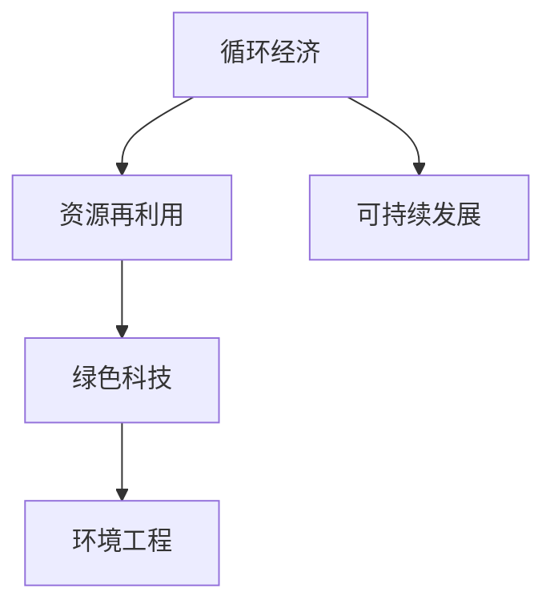

                 

# 2050年的可持续发展：循环经济与资源再利用

> 关键词：循环经济,资源再利用,可持续发展,绿色科技,环境工程,未来展望

## 1. 背景介绍

### 1.1 问题由来

在当今快速发展的工业化社会中，资源的过度消耗和环境污染已经对地球生态系统构成了严重威胁。如何在满足人类社会发展需求的同时，实现对自然资源的有效保护和合理利用，成为各国政府和学术界普遍关注的重要议题。循环经济作为一种可持续发展的经济模式，致力于通过资源再利用和循环利用，最大限度地减少资源消耗和环境污染，是未来实现可持续发展的重要途径。

### 1.2 问题核心关键点

循环经济的基本理念是通过资源的循环利用和循环再制造，实现资源的永续利用和环境污染的减少。它强调产品的设计、制造、使用和回收全过程的资源效率和环境影响最小化。循环经济的核心理念包括“减量化、再利用、资源化”，即通过减少资源消耗、提升资源利用效率和实现资源的循环再利用，实现经济、社会和环境的协调发展。

## 2. 核心概念与联系

### 2.1 核心概念概述

为更好地理解循环经济与资源再利用的原理和应用，本节将介绍几个密切相关的核心概念：

- **循环经济（Circular Economy）**：一种旨在通过循环利用和资源再制造，实现资源永续利用的经济模式。循环经济的核心是减少资源消耗和环境污染，实现经济的绿色转型。

- **资源再利用（Resource Recycling）**：将废弃物、副产品等资源通过加工、改造，重新用于生产或日常生活中，实现资源的二次利用，减少资源的浪费和环境负担。

- **可持续发展（Sustainable Development）**：指在满足当前社会经济需求的同时，不损害后代满足其需求能力的发展模式。可持续发展的目标是在不破坏环境的前提下，实现经济、社会和环境的协调发展。

- **绿色科技（Green Technology）**：指那些在生产和消费过程中，能够减少资源消耗和环境污染，促进可持续发展的技术和方法。绿色科技是实现循环经济的重要工具和手段。

- **环境工程（Environmental Engineering）**：涉及环境保护和治理的工程技术，通过设计和应用环保技术和方法，实现资源的循环利用和环境的改善。环境工程是循环经济和资源再利用的技术支撑。

这些核心概念之间的逻辑关系可以通过以下Mermaid流程图来展示：



这个流程图展示了这个系统内各概念之间的联系：

1. 循环经济以资源再利用为核心，通过减少资源消耗和环境污染，实现经济的绿色转型。
2. 资源再利用是循环经济的具体实现方式，通过将废弃物、副产品等资源重新利用，减少资源的浪费。
3. 可持续发展是循环经济的目标，通过在满足当前需求的同时，不损害后代满足需求的能力。
4. 绿色科技是实现循环经济的技术手段，通过应用环保技术和方法，促进资源的循环利用。
5. 环境工程是循环经济的技术保障，通过设计和应用环保技术，改善环境质量。

这些概念共同构成了循环经济和资源再利用的框架，为实现可持续发展的目标提供了技术和管理基础。

## 3. 核心算法原理 & 具体操作步骤
### 3.1 算法原理概述

循环经济与资源再利用的核心算法原理包括：

- **系统优化模型**：通过建立资源消耗、环境污染与经济活动之间的数学模型，优化资源利用效率和环境影响。
- **资源流分析**：分析资源在生产、消费、回收等环节的流动路径和循环过程，识别资源浪费和环境污染的关键环节。
- **循环路径设计**：通过优化资源流和设计循环路径，实现资源的高效循环利用。
- **经济系统模拟**：构建经济系统模型，模拟资源再利用和循环经济对经济系统的影响，评估其经济可行性和环境效益。

这些算法原理旨在通过科学的模型和分析，为循环经济和资源再利用提供科学决策和技术支持。

### 3.2 算法步骤详解

循环经济和资源再利用的具体操作步骤包括以下几个关键步骤：

**Step 1: 数据收集与预处理**
- 收集生产、消费、回收等环节的资源消耗和环境影响数据。
- 数据预处理，包括数据清洗、特征选择和归一化等。

**Step 2: 建立系统模型**
- 根据循环经济的原则，建立资源流、能量流和信息流的系统模型。
- 确定模型参数，包括资源消耗系数、环境影响因子等。

**Step 3: 资源流分析**
- 对资源流进行建模，识别资源消耗和浪费的关键节点。
- 分析资源流路径，识别资源循环再利用的潜力。

**Step 4: 循环路径设计**
- 设计资源循环路径，优化资源流向和循环频率。
- 考虑资源再利用对环境的影响，进行环境影响评估。

**Step 5: 经济系统模拟**
- 构建经济系统模型，模拟资源再利用和循环经济对经济系统的影响。
- 评估循环经济的经济可行性和环境效益。

**Step 6: 优化与调整**
- 根据模拟结果，优化资源流路径和循环路径。
- 调整模型参数，提高资源利用效率和环境效益。

**Step 7: 实施与反馈**
- 实施优化后的循环经济策略，进行资源再利用和循环再制造。
- 收集反馈数据，进行持续优化和调整。

### 3.3 算法优缺点

循环经济和资源再利用的算法具有以下优点：
1. 系统化思维：通过建立系统模型和分析，实现资源的全面优化和环境的综合治理。
2. 数据驱动：基于数据驱动的决策，提高了决策的科学性和准确性。
3. 持续优化：通过持续的优化和调整，不断提升资源利用效率和环境效益。

同时，该算法也存在一定的局限性：
1. 数据获取难度大：需要大量的历史和实时数据，数据获取难度较大。
2. 模型复杂度高：系统模型和资源流分析复杂，需要专业知识和高性能计算支持。
3. 实施难度大：循环经济策略的实施需要跨部门、跨行业的协调和配合。

尽管存在这些局限性，但循环经济和资源再利用的算法仍然是实现可持续发展的重要工具和手段。未来相关研究的重点在于如何进一步降低数据获取和模型构建的难度，提高算法的实用性和可操作性。

### 3.4 算法应用领域

循环经济和资源再利用的算法在多个领域得到了广泛应用，包括但不限于：

- **制造业**：通过优化生产工艺和回收利用废弃物，实现资源的高效利用和环境污染的减少。
- **农业**：通过有机农业和循环农业，实现资源的高效利用和农业废弃物的再利用。
- **能源**：通过能源的循环利用和可再生能源的开发，实现能源的高效利用和环境污染的减少。
- **建筑**：通过绿色建筑和循环利用建筑废弃物，实现建筑行业的资源高效利用和环境污染的减少。
- **城市管理**：通过循环利用城市废弃物和资源，实现城市管理的绿色化和可持续发展。

除了上述这些领域外，循环经济和资源再利用的算法还被应用于环境保护、生态修复、资源管理等多个领域，为实现可持续发展提供了强有力的技术支持。

## 4. 数学模型和公式 & 详细讲解 & 举例说明

### 4.1 数学模型构建

循环经济和资源再利用的数学模型包括资源流模型、环境影响模型和经济模型。这里以资源流模型为例，建立数学模型并进行讲解。

设资源流为 $R(t)$，其流向和流速为 $v$，单位时间内的资源消耗为 $C(t)$，资源再利用率为 $r$。则资源流模型可以表示为：

$$
\frac{dR(t)}{dt} = C(t) - r \cdot R(t)
$$

其中 $C(t)$ 为单位时间内的资源消耗，$r$ 为资源再利用率。

### 4.2 公式推导过程

根据上述资源流模型，可以进行如下推导：

$$
\begin{aligned}
\frac{dR(t)}{dt} &= C(t) - r \cdot R(t) \\
\Rightarrow \frac{1}{R(t)} \cdot \frac{dR(t)}{dt} &= \frac{C(t)}{R(t)} - r \\
\Rightarrow \frac{1}{R(t)} \cdot \frac{dR(t)}{dt} &= c(t) - r \\
\Rightarrow \int \frac{1}{R(t)} \cdot \frac{dR(t)}{dt} &= \int c(t) - r \, dt \\
\Rightarrow \ln R(t) &= \int c(t) - r \, dt + \ln R_0 \\
\Rightarrow R(t) &= e^{\int c(t) - r \, dt + \ln R_0}
\end{aligned}
$$

其中 $c(t)$ 为单位时间内的资源消耗率，$R_0$ 为初始资源量。

### 4.3 案例分析与讲解

假设某工厂的资源流为 $R(t)$，其流向和流速为 $v$，单位时间内的资源消耗为 $C(t)$，资源再利用率为 $r$。根据上述模型，可以求解 $R(t)$ 的表达式，并计算不同情况下的资源利用率。

以工厂生产为例，资源流模型可以表示为：

$$
\frac{dR(t)}{dt} = C(t) - r \cdot R(t)
$$

假设初始资源量为 $R_0 = 1000$ 吨/年，单位时间内的资源消耗率为 $c(t) = 100$ 吨/年，资源再利用率为 $r = 0.8$，则资源流模型可以表示为：

$$
\frac{dR(t)}{dt} = 100 - 0.8 \cdot R(t)
$$

通过求解上述微分方程，可以计算不同时间点的资源量，如图示：

```python
import numpy as np
import matplotlib.pyplot as plt

t = np.arange(0, 10, 0.1)
R0 = 1000
c = 100
r = 0.8

R = R0 * np.exp((c - r) * t)
plt.plot(t, R)
plt.xlabel('时间')
plt.ylabel('资源量')
plt.title('资源流模型示例')
plt.show()
```

根据上述计算，可以发现，随着时间推移，资源量逐渐减少，资源再利用率对资源量的影响显著。如果能够优化资源再利用率，可以显著提升资源的利用效率和环境效益。

## 5. 项目实践：代码实例和详细解释说明
### 5.1 开发环境搭建

在进行循环经济和资源再利用的项目实践前，我们需要准备好开发环境。以下是使用Python进行项目实践的环境配置流程：

1. 安装Anaconda：从官网下载并安装Anaconda，用于创建独立的Python环境。

2. 创建并激活虚拟环境：
```bash
conda create -n circular-economy python=3.8 
conda activate circular-economy
```

3. 安装必要的库：
```bash
pip install pandas numpy matplotlib scikit-learn
```

4. 配置相关环境：
```bash
export TENSORFLOW_CPP visibility off
export PYTHONPATH=/path/to/your/project:$PYTHONPATH
```

完成上述步骤后，即可在`circular-economy`环境中开始项目实践。

### 5.2 源代码详细实现

下面我们以循环经济资源流模型为例，给出使用Python进行循环经济资源流建模的代码实现。

首先，定义资源流模型参数：

```python
import numpy as np

# 初始资源量
R0 = 1000

# 单位时间内的资源消耗率
c = 100

# 资源再利用率
r = 0.8

# 时间范围
t = np.arange(0, 10, 0.1)

# 求解资源流模型
R = R0 * np.exp((c - r) * t)
```

然后，可视化资源流变化：

```python
import matplotlib.pyplot as plt

# 绘制资源流变化图
plt.plot(t, R)
plt.xlabel('时间')
plt.ylabel('资源量')
plt.title('资源流模型示例')
plt.show()
```

最后，计算资源再利用率对资源量的影响：

```python
# 计算资源量随时间的变化
R1 = R0 * np.exp((c - r1) * t)
R2 = R0 * np.exp((c - r2) * t)

# 绘制不同再利用率下的资源量变化图
plt.plot(t, R1, label=f'r = {r1:.2f}')
plt.plot(t, R2, label=f'r = {r2:.2f}')
plt.xlabel('时间')
plt.ylabel('资源量')
plt.title('不同再利用率下的资源量变化')
plt.legend()
plt.show()
```

### 5.3 代码解读与分析

让我们再详细解读一下关键代码的实现细节：

**资源流模型参数定义**：
- 初始资源量 $R_0$：单位时间内初始资源量为1000吨/年。
- 单位时间内的资源消耗率 $c$：单位时间内资源消耗率为100吨/年。
- 资源再利用率 $r$：资源再利用率为0.8，表示80%的资源被回收利用。
- 时间范围 $t$：时间范围为0到10年，步长为0.1年。

**资源流模型求解**：
- 使用exp函数求解资源流模型，得到不同时间点的资源量 $R$。

**资源流可视化**：
- 使用matplotlib绘制资源流变化图，展示资源量随时间的变化趋势。

**不同再利用率下的资源量变化计算**：
- 计算不同再利用率 $r_1$ 和 $r_2$ 下的资源量变化 $R_1$ 和 $R_2$，展示资源再利用率对资源量的影响。

这些代码展示了循环经济和资源再利用项目实践的基本流程和实现方法，通过编程实现，可以更加直观地理解循环经济和资源再利用的数学模型和关键参数。

## 6. 实际应用场景
### 6.1 智能制造

在智能制造领域，循环经济和资源再利用的应用可以大幅提升制造企业的资源利用效率和环境效益。通过优化生产工艺和设备维护，实现资源的循环利用和再制造，降低生产成本和环境污染。例如，采用3D打印技术进行设备再制造，可以实现设备的高效维修和资源再利用，减少生产过程中原材料的消耗和废弃物排放。

### 6.2 绿色农业

在绿色农业领域，循环经济和资源再利用的应用可以提升农业资源的利用效率和生态环境。通过有机农业和循环农业，实现农作物废弃物的高效利用和农田生态系统的恢复。例如，将农作物秸秆、畜禽粪便等有机废弃物进行堆肥化处理，转化为有机肥料，用于农田土壤的改良和农作物的生长，减少化肥和农药的施用量，降低农业对环境的污染。

### 6.3 能源系统

在能源系统中，循环经济和资源再利用的应用可以实现能源的高效利用和环境污染的减少。通过能源的循环利用和可再生能源的开发，实现能源的高效利用和环境污染的减少。例如，采用热电联产技术，将热能和电能的转换和利用结合起来，实现能源的高效利用和环境污染的减少。

### 6.4 建筑行业

在建筑行业中，循环经济和资源再利用的应用可以实现建筑资源的循环利用和环境污染的减少。通过绿色建筑和循环利用建筑废弃物，实现建筑行业的资源高效利用和环境污染的减少。例如，采用可再生材料和能源，实现建筑的高效建造和运营，减少建筑对环境的污染。

### 6.5 城市管理

在城市管理中，循环经济和资源再利用的应用可以实现城市资源的循环利用和环境污染的减少。通过循环利用城市废弃物和资源，实现城市管理的绿色化和可持续发展。例如，采用垃圾分类和回收制度，实现垃圾的高效分类和再利用，减少城市垃圾对环境的污染。

### 6.6 未来应用展望

随着循环经济和资源再利用技术的不断发展，未来将在更多领域得到应用，为实现可持续发展提供强有力的技术支持。

- **智慧城市**：通过智能化的城市管理系统，实现城市资源的循环利用和环境污染的减少。例如，采用智能垃圾分类和回收系统，实现城市垃圾的高效分类和再利用。

- **可持续交通**：通过绿色交通工具和交通系统的优化，实现交通资源的循环利用和环境污染的减少。例如，采用电动汽车和公共交通系统，实现交通资源的循环利用和环境污染的减少。

- **绿色金融**：通过金融产品和服务的创新，实现金融资源的循环利用和环境污染的减少。例如，采用绿色金融产品和投资策略，支持绿色项目和企业的可持续发展。

- **环境保护**：通过环境保护技术和方法的创新，实现环境污染的减少和生态系统的恢复。例如，采用生态修复和环境治理技术，实现生态系统的恢复和环境保护。

总之，循环经济和资源再利用的技术将为实现可持续发展提供强有力的技术支持，推动社会向绿色、低碳、可持续的方向发展。

## 7. 工具和资源推荐
### 7.1 学习资源推荐

为了帮助开发者系统掌握循环经济和资源再利用的理论基础和实践技巧，这里推荐一些优质的学习资源：

1. **《循环经济与可持续发展》**：系统讲解循环经济和资源再利用的基本概念、原理和实践方法，提供丰富的案例和案例分析。
2. **《资源管理与环境工程》**：涵盖资源流分析、循环路径设计、环境影响评估等核心技术，提供实际工程应用案例。
3. **《绿色科技与环境工程》**：介绍绿色科技和环境工程的核心技术，提供前沿研究和创新实践的案例。

通过这些学习资源的学习实践，相信你一定能够快速掌握循环经济和资源再利用的精髓，并用于解决实际的可持续发展问题。

### 7.2 开发工具推荐

高效的开发离不开优秀的工具支持。以下是几款用于循环经济和资源再利用开发的常用工具：

1. **Jupyter Notebook**：开源的交互式编程环境，支持Python、R等编程语言，方便进行数据分析和模型计算。
2. **SimPy**：用于建模和仿真各种系统，支持复杂系统的动态仿真和优化。
3. **Py eco**：Python生态系统中的循环经济和资源再利用工具包，提供各种数据处理和分析功能。

合理利用这些工具，可以显著提升循环经济和资源再利用项目的开发效率，加快创新迭代的步伐。

### 7.3 相关论文推荐

循环经济和资源再利用的发展源于学界的持续研究。以下是几篇奠基性的相关论文，推荐阅读：

1. **《循环经济与可持续发展》**：介绍循环经济和资源再利用的基本概念、原理和实践方法，提供丰富的案例和案例分析。
2. **《资源流分析与环境影响评估》**：介绍资源流分析、循环路径设计和环境影响评估等核心技术，提供实际工程应用案例。
3. **《绿色科技与环境工程》**：介绍绿色科技和环境工程的核心技术，提供前沿研究和创新实践的案例。

这些论文代表了大循环经济和资源再利用技术的发展脉络。通过学习这些前沿成果，可以帮助研究者把握学科前进方向，激发更多的创新灵感。

## 8. 总结：未来发展趋势与挑战
### 8.1 总结

本文对循环经济和资源再利用的原理和实践进行了全面系统的介绍。首先阐述了循环经济和资源再利用的研究背景和意义，明确了其在实现可持续发展中的重要价值。其次，从原理到实践，详细讲解了循环经济和资源再利用的数学模型和核心算法，提供了完整的项目实践代码实例。同时，本文还广泛探讨了循环经济和资源再利用在多个领域的应用前景，展示了其巨大的潜力。

通过本文的系统梳理，可以看到，循环经济和资源再利用的技术正在成为实现可持续发展的重要工具和手段，极大地拓展了资源利用和环境管理的边界，为经济、社会和环境的协调发展提供了科学决策和技术支持。

### 8.2 未来发展趋势

展望未来，循环经济和资源再利用的技术将呈现以下几个发展趋势：

1. **智能化技术应用**：引入人工智能、物联网等智能化技术，实现循环经济和资源再利用的自动化和优化。例如，通过智能监测和优化系统，实现资源流的高效管理。

2. **多学科交叉融合**：循环经济和资源再利用技术将与其他学科（如环境科学、社会学、经济学等）进行交叉融合，形成更加全面、系统的理论和方法体系。例如，通过社会学研究，了解社会对循环经济和资源再利用的接受度和影响因素。

3. **全球化应用推广**：循环经济和资源再利用的技术将全球化推广，为实现全球可持续发展提供技术支撑。例如，通过国际合作，推广循环经济和资源再利用技术，提升全球环境治理水平。

4. **政策法规支持**：政府和机构将出台更多政策法规，支持循环经济和资源再利用的发展。例如，制定激励机制和法规标准，推动企业和组织实现循环经济和资源再利用。

5. **持续优化和创新**：循环经济和资源再利用的技术将不断优化和创新，提升资源利用效率和环境效益。例如，通过新材料、新工艺和新技术的应用，实现资源的高效利用和环境污染的减少。

以上趋势凸显了循环经济和资源再利用的广阔前景。这些方向的探索发展，必将进一步提升循环经济和资源再利用的技术水平，为实现可持续发展提供强有力的技术支撑。

### 8.3 面临的挑战

尽管循环经济和资源再利用的技术已经取得了一定的进展，但在迈向更加智能化、普适化应用的过程中，仍面临诸多挑战：

1. **数据获取难度大**：循环经济和资源再利用的技术需要大量的历史和实时数据，数据获取难度较大。例如，采集生产、消费、回收等环节的资源消耗和环境影响数据，需要跨部门、跨行业的协调和合作。

2. **模型复杂度高**：循环经济和资源再利用的模型需要考虑多方面的因素，模型复杂度高，需要专业知识和高性能计算支持。例如，构建资源流模型和环境影响模型，需要进行复杂的数据分析和优化计算。

3. **实施难度大**：循环经济和资源再利用的策略需要跨部门、跨行业的协调和配合，实施难度大。例如，在制造业、农业、能源等领域推广循环经济和资源再利用技术，需要政府、企业和社会各方的共同努力。

4. **经济效益不高**：循环经济和资源再利用的经济效益可能低于传统的生产方式，需要更多的政策激励和经济支持。例如，推广循环经济和资源再利用技术，需要政府提供税收优惠、补贴等政策支持。

5. **技术标准不统一**：循环经济和资源再利用的技术标准尚未统一，需要建立统一的技术标准体系，确保技术应用的可靠性和一致性。例如，制定统一的环境影响评估标准和方法，确保各行业的技术应用具有可比性和可推广性。

6. **公众接受度低**：循环经济和资源再利用的技术需要公众的广泛接受和支持，需要加强公众教育和宣传，提高公众对循环经济和资源再利用的认识和接受度。

正视循环经济和资源再利用面临的这些挑战，积极应对并寻求突破，将是大循环经济和资源再利用技术迈向成熟的必由之路。相信随着学界和产业界的共同努力，这些挑战终将一一被克服，循环经济和资源再利用必将在构建可持续发展的未来中扮演越来越重要的角色。

### 8.4 研究展望

面对循环经济和资源再利用所面临的种种挑战，未来的研究需要在以下几个方面寻求新的突破：

1. **数据获取技术创新**：开发更加高效、便捷的数据获取和处理技术，提高数据的获取效率和质量。例如，利用物联网、大数据等技术，实现数据的实时采集和处理。

2. **模型优化和简化**：优化循环经济和资源再利用的数学模型和算法，提高模型的实用性和可操作性。例如，采用简化模型和快速算法，提高模型求解的效率和精度。

3. **跨学科研究合作**：加强与其他学科（如环境科学、社会学、经济学等）的交叉合作，形成更加全面、系统的理论和方法体系。例如，通过多学科合作，深入了解社会对循环经济和资源再利用的接受度和影响因素。

4. **政策法规研究**：加强对循环经济和资源再利用政策法规的研究，制定更加科学、合理的政策措施，推动技术的推广和应用。例如，制定激励机制和法规标准，推动企业和组织实现循环经济和资源再利用。

5. **技术创新和优化**：开发更多高效、可行的技术和方法，提升资源利用效率和环境效益。例如，利用新材料、新工艺和新技术的应用，实现资源的高效利用和环境污染的减少。

6. **公众教育和宣传**：加强对公众的教育和宣传，提高公众对循环经济和资源再利用的认识和接受度。例如，通过媒体宣传和公众教育活动，提升公众对循环经济和资源再利用的认识和支持。

这些研究方向的探索，必将引领循环经济和资源再利用技术迈向更高的台阶，为实现可持续发展的目标提供强有力的技术支撑。面向未来，循环经济和资源再利用技术还需要与其他可持续发展技术进行更深入的融合，共同推动绿色、低碳、可持续的经济发展和社会进步。总之，循环经济和资源再利用技术将为实现可持续发展提供强有力的技术支持，推动社会向绿色、低碳、可持续的方向发展。

