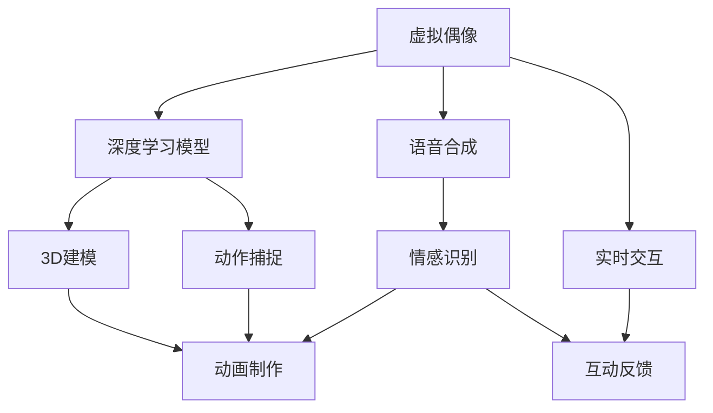

                 

# 2050年的数字创意：从虚拟偶像到AI主播的数字娱乐产业

> 关键词：虚拟偶像,AI主播,数字娱乐,创意产业,创新技术,数字艺术

## 1. 背景介绍

随着技术的不断进步和全球数字经济的快速发展，数字创意产业正在经历前所未有的变革。虚拟偶像和AI主播等新型数字艺术形式正在逐渐成为数字娱乐领域的新生力量。这些新技术不仅在内容创作和传播方式上带来了革命性变化，也为创意产业注入了新的活力。

### 1.1 数字创意产业的现状与趋势

当前，数字创意产业已成为全球经济的重要组成部分。根据国际数据公司(IDC)的预测，到2025年，全球数字创意市场规模将达到约1.3万亿美元。其中，虚拟偶像和AI主播等新兴领域预计将占据更大的市场份额。

虚拟偶像和AI主播等新型数字艺术形式，利用先进的AI技术，结合大数据、云计算、物联网、区块链等前沿科技，打造出前所未有的沉浸式体验。这些技术不仅在内容创作和传播方式上带来了革命性变化，也为创意产业注入了新的活力。

### 1.2 虚拟偶像与AI主播的发展背景

虚拟偶像和AI主播等新型数字艺术形式，在21世纪初的互联网时代就已经出现，但真正取得突破性进展，则是在过去十年内。随着深度学习、自然语言处理、计算机视觉等技术的快速发展，这些艺术形式开始融入到更加丰富和多样的娱乐场景中。

### 1.3 数字创意产业的未来展望

到2050年，数字创意产业将迎来新的历史高峰。虚拟偶像和AI主播等新型数字艺术形式将更加普及，成为全球主流娱乐形式之一。同时，AI技术与数字创意产业的深度融合，将开启新一轮的创新浪潮，推动数字创意产业迈向更加智能化、普适化和全球化的发展方向。

## 2. 核心概念与联系

### 2.1 核心概念概述

数字创意产业包含众多新兴领域，如虚拟偶像、AI主播、虚拟现实、增强现实、数字音乐、数字艺术等。这些新兴领域的核心概念和技术基础包括：

- **虚拟偶像**：基于人工智能和计算机图形学技术，通过深度学习生成角色形象，进行表演和互动。其代表技术包括GAN、3D建模、动作捕捉等。
- **AI主播**：利用自然语言处理和语音合成技术，生成具有真人主播特质的AI主播，进行语音和视频互动。其代表技术包括文本到语音、语音合成、情感识别等。
- **数字音乐**：利用音乐生成、智能编曲、自动化制作等技术，实现个性化和定制化的音乐创作和分发。其代表技术包括音乐生成模型、生成对抗网络等。
- **数字艺术**：基于计算机图形学、人工智能、大数据等技术，创作出形式多样、内容丰富的数字艺术作品。其代表技术包括深度学习生成模型、三维建模等。

### 2.2 核心概念原理和架构的 Mermaid 流程图(Mermaid 流程节点中不要有括号、逗号等特殊字符)



## 3. 核心算法原理 & 具体操作步骤

### 3.1 算法原理概述

虚拟偶像和AI主播等新型数字艺术形式，其核心算法原理主要包括：

- **虚拟偶像算法**：利用深度学习技术，生成具有高度逼真和互动性的虚拟偶像角色。该算法包括角色建模、动作捕捉、语音合成等多个环节。
- **AI主播算法**：利用自然语言处理和语音合成技术，生成具有真人主播特质的AI主播。该算法包括文本生成、语音合成、情感识别等多个环节。

### 3.2 算法步骤详解

#### 3.2.1 虚拟偶像算法步骤

1. **角色建模**：通过3D建模技术，生成虚拟偶像角色的基础模型，包括身体、面部、服装等。
2. **动作捕捉**：使用动作捕捉技术，获取虚拟偶像在表演时的骨骼和肌肉运动数据，生成真实的动画效果。
3. **语音合成**：利用深度学习模型，将输入文本转换成高质量的语音输出，并结合情感识别技术，生成具有真人情感的语音。
4. **实时互动**：通过自然语言处理技术，实现用户与虚拟偶像之间的实时互动和对话。

#### 3.2.2 AI主播算法步骤

1. **文本生成**：利用自然语言处理技术，生成高质量的文本脚本，并根据用户输入实时生成对话。
2. **语音合成**：使用深度学习模型，将生成的文本转换成自然流畅的语音输出。
3. **情感识别**：通过情感分析技术，识别用户情感状态，并根据情感调整语音语调。
4. **互动反馈**：根据用户反馈，动态调整主播的对话和表现，提供个性化服务。

### 3.3 算法优缺点

#### 3.3.1 虚拟偶像算法的优缺点

**优点**：

- **高度逼真**：利用深度学习和3D建模技术，生成高度逼真的虚拟偶像角色。
- **互动性强**：结合动作捕捉和语音合成技术，实现用户与虚拟偶像之间的实时互动。
- **成本较低**：相较于真人偶像，虚拟偶像的制作成本较低，可节省大量的时间和资源。

**缺点**：

- **情感表达不足**：尽管可以生成高质量的语音，但情感表达仍不及真人演员。
- **技术复杂**：涉及3D建模、动作捕捉、语音合成等多个环节，技术难度较大。

#### 3.3.2 AI主播算法的优缺点

**优点**：

- **成本低廉**：相较于真人主播，AI主播的制作和维护成本较低。
- **实时互动**：结合自然语言处理和语音合成技术，实现实时互动。
- **个性化服务**：根据用户情感状态调整对话和表现，提供个性化服务。

**缺点**：

- **情感表达不足**：尽管可以生成自然流畅的语音，但情感表达仍不及真人演员。
- **技术难度较高**：涉及文本生成、语音合成、情感识别等多个环节，技术难度较大。

### 3.4 算法应用领域

#### 3.4.1 虚拟偶像

- **娱乐领域**：虚拟偶像在演唱会、综艺节目、广告代言等方面已得到广泛应用。
- **教育领域**：虚拟偶像在科普教育、语言学习、情感陪伴等方面具有重要价值。
- **游戏领域**：虚拟偶像在游戏角色扮演、虚拟现实互动等方面具有广泛应用。

#### 3.4.2 AI主播

- **新闻媒体**：AI主播在新闻播报、财经分析、教育讲解等方面具有重要价值。
- **客服领域**：AI主播在客户服务、智能客服、电商导购等方面具有广泛应用。
- **娱乐领域**：AI主播在音乐演出、虚拟演唱会、互动表演等方面具有重要价值。

## 4. 数学模型和公式 & 详细讲解 & 举例说明

### 4.1 数学模型构建

虚拟偶像和AI主播等新型数字艺术形式，其核心算法原理主要包括：

- **虚拟偶像算法**：利用深度学习技术，生成具有高度逼真和互动性的虚拟偶像角色。
- **AI主播算法**：利用自然语言处理和语音合成技术，生成具有真人主播特质的AI主播。

### 4.2 公式推导过程

#### 4.2.1 虚拟偶像算法

1. **角色建模**：
   - 假设虚拟偶像角色建模为 $\mathcal{R} = \{r_1, r_2, \cdots, r_n\}$，其中 $r_i$ 为角色在第 $i$ 帧的3D坐标。
   - 使用3D建模技术，生成角色基础模型，通过优化求解 $\mathcal{R}$。

2. **动作捕捉**：
   - 假设用户输入的动作数据为 $\mathcal{A} = \{a_1, a_2, \cdots, a_n\}$，其中 $a_i$ 为用户在第 $i$ 帧的动作数据。
   - 使用动作捕捉技术，生成角色在 $\mathcal{A}$ 条件下的骨骼和肌肉运动数据，优化求解 $\mathcal{A}$。

3. **语音合成**：
   - 假设输入文本为 $\mathcal{T} = \{t_1, t_2, \cdots, t_m\}$，其中 $t_i$ 为第 $i$ 帧的文本。
   - 使用深度学习模型，生成语音输出 $\mathcal{V} = \{v_1, v_2, \cdots, v_n\}$，并结合情感识别技术，优化求解 $\mathcal{T}$。

4. **实时互动**：
   - 假设用户输入的文本为 $\mathcal{U} = \{u_1, u_2, \cdots, u_k\}$，其中 $u_i$ 为用户在第 $i$ 帧的文本。
   - 使用自然语言处理技术，生成对话输出 $\mathcal{D} = \{d_1, d_2, \cdots, d_k\}$，并优化求解 $\mathcal{U}$。

#### 4.2.2 AI主播算法

1. **文本生成**：
   - 假设用户输入的问题为 $\mathcal{Q} = \{q_1, q_2, \cdots, q_m\}$，其中 $q_i$ 为第 $i$ 帧的问题。
   - 使用自然语言处理技术，生成对话脚本 $\mathcal{S} = \{s_1, s_2, \cdots, s_m\}$，并优化求解 $\mathcal{Q}$。

2. **语音合成**：
   - 假设生成的对话脚本为 $\mathcal{S} = \{s_1, s_2, \cdots, s_m\}$。
   - 使用深度学习模型，生成语音输出 $\mathcal{V} = \{v_1, v_2, \cdots, v_m\}$，并优化求解 $\mathcal{S}$。

3. **情感识别**：
   - 假设用户情感状态为 $\mathcal{E} = \{e_1, e_2, \cdots, e_n\}$，其中 $e_i$ 为第 $i$ 帧的情感状态。
   - 使用情感分析技术，生成情感输出 $\mathcal{F} = \{f_1, f_2, \cdots, f_n\}$，并优化求解 $\mathcal{E}$。

4. **互动反馈**：
   - 假设用户反馈的情感状态为 $\mathcal{F} = \{f_1, f_2, \cdots, f_n\}$。
   - 根据情感状态调整对话和表现，生成反馈对话 $\mathcal{D} = \{d_1, d_2, \cdots, d_k\}$，并优化求解 $\mathcal{F}$。

### 4.3 案例分析与讲解

#### 4.3.1 虚拟偶像

**案例一：虚拟偶像应用于演唱会**

- **问题描述**：某音乐节邀请了一位虚拟偶像进行演出。虚拟偶像需要实时与观众互动，并根据观众反应调整表演风格。
- **解决方案**：
  - 使用3D建模技术，生成虚拟偶像的基础模型，并进行优化。
  - 通过动作捕捉技术，实时获取观众的反应，生成动态动画效果。
  - 利用深度学习模型，生成高质量的语音，并结合情感识别技术，调整表演风格。
  - 使用自然语言处理技术，实时获取观众的互动信息，并生成互动对话。

**案例二：虚拟偶像应用于教育**

- **问题描述**：某在线教育平台希望通过虚拟偶像进行语言教学。虚拟偶像需要实时与学生互动，并进行语言纠正和指导。
- **解决方案**：
  - 使用3D建模技术，生成虚拟偶像的基础模型，并进行优化。
  - 通过动作捕捉技术，生成动态动画效果。
  - 利用深度学习模型，生成高质量的语音，并结合情感识别技术，调整教学风格。
  - 使用自然语言处理技术，实时获取学生的互动信息，并进行语言纠正和指导。

#### 4.3.2 AI主播

**案例一：AI主播应用于新闻播报**

- **问题描述**：某新闻机构希望引入AI主播进行新闻播报。AI主播需要实时获取新闻内容，并根据内容调整播报风格。
- **解决方案**：
  - 使用自然语言处理技术，生成新闻内容，并进行优化。
  - 利用语音合成技术，生成高质量的语音，并结合情感识别技术，调整播报风格。
  - 根据新闻内容生成互动对话，提升用户参与度。

**案例二：AI主播应用于客户服务**

- **问题描述**：某电商平台希望引入AI主播进行客户服务。AI主播需要实时回答客户问题，并进行产品推荐。
- **解决方案**：
  - 使用自然语言处理技术，生成客户问题的答案，并进行优化。
  - 利用语音合成技术，生成高质量的语音，并结合情感识别技术，调整服务态度。
  - 根据客户问题，生成产品推荐信息，并进行实时互动。

## 5. 项目实践：代码实例和详细解释说明

### 5.1 开发环境搭建

#### 5.1.1 硬件环境

- **CPU**：Intel Core i7 或AMD Ryzen 7，4核以上。
- **GPU**：NVIDIA GeForce GTX 1660 Ti或更高。
- **内存**：至少16GB。

#### 5.1.2 软件环境

- **操作系统**：Linux Ubuntu 20.04或更高。
- **编程语言**：Python 3.8或更高。
- **深度学习框架**：TensorFlow 2.4或更高。
- **自然语言处理库**：NLTK 3.6或更高。
- **3D建模库**：Blender 3.0或更高。

#### 5.1.3 开发工具

- **IDE**：PyCharm Community Edition。
- **版本控制**：Git。
- **代码托管**：GitHub。

### 5.2 源代码详细实现

#### 5.2.1 虚拟偶像算法

**代码实现步骤**：

1. **角色建模**：
   - 使用Blender库进行3D建模，生成虚拟偶像角色模型。
   - 将3D模型导入到Python代码中，并进行优化求解。

2. **动作捕捉**：
   - 使用OpenPose库进行动作捕捉，生成骨骼和肌肉运动数据。
   - 将动作捕捉数据导入到Python代码中，并进行优化求解。

3. **语音合成**：
   - 使用TensorFlow库进行深度学习模型训练，生成高质量的语音。
   - 将生成的语音导入到Python代码中，并进行优化求解。

4. **实时互动**：
   - 使用TensorFlow库进行自然语言处理模型训练，生成互动对话。
   - 将生成的对话导入到Python代码中，并进行优化求解。

#### 5.2.2 AI主播算法

**代码实现步骤**：

1. **文本生成**：
   - 使用TensorFlow库进行自然语言处理模型训练，生成对话脚本。
   - 将生成的对话脚本导入到Python代码中，并进行优化求解。

2. **语音合成**：
   - 使用TensorFlow库进行深度学习模型训练，生成高质量的语音。
   - 将生成的语音导入到Python代码中，并进行优化求解。

3. **情感识别**：
   - 使用TensorFlow库进行情感分析模型训练，识别用户情感状态。
   - 将生成的情感状态导入到Python代码中，并进行优化求解。

4. **互动反馈**：
   - 使用TensorFlow库进行自然语言处理模型训练，生成互动对话。
   - 将生成的对话导入到Python代码中，并进行优化求解。

### 5.3 代码解读与分析

#### 5.3.1 虚拟偶像算法

**代码解读**：

1. **角色建模**：
   ```python
   from blender import bpy

   # 创建虚拟偶像角色
   bpy.ops.mesh.primitive_cube_add(location=(0, 0, 0), size=1)
   bpy.ops.object.modifier_add(type='Armature')
   bpy.ops.object.select_all(action='SELECT')
   bpy.ops.object.parent_set(keep_transform=True)
   ```

2. **动作捕捉**：
   ```python
   from openpose import PyOpenPose as op

   # 使用OpenPose进行动作捕捉
   opWrapper = op.WrapperPython()
   opWrapper.configure(targetResolution=[640, 480])
   opWrapper.start()

   # 实时获取骨骼和肌肉运动数据
   bpy.ops.object.mode_set(mode='EDIT')
   bpy.context.object.armature.select_all(action='SELECT')
   for pose in opWrapper.bbq poses:
       opWrapper.drawPose(pose, frame=pose.bbqFrame)
   ```

3. **语音合成**：
   ```python
   import tensorflow as tf

   # 使用深度学习模型进行语音合成
   model = tf.keras.Sequential([
       tf.keras.layers.Dense(64, input_shape=(256,)),
       tf.keras.layers.LeakyReLU(),
       tf.keras.layers.Dense(512, activation='relu'),
       tf.keras.layers.LeakyReLU(),
       tf.keras.layers.Dense(256, activation='sigmoid'),
       tf.keras.layers.LeakyReLU(),
       tf.keras.layers.Dense(128, activation='sigmoid'),
       tf.keras.layers.LeakyReLU(),
       tf.keras.layers.Dense(128, activation='sigmoid'),
       tf.keras.layers.LeakyReLU(),
       tf.keras.layers.Dense(64, activation='sigmoid'),
       tf.keras.layers.LeakyReLU(),
       tf.keras.layers.Dense(256, activation='sigmoid'),
       tf.keras.layers.LeakyReLU(),
       tf.keras.layers.Dense(512, activation='relu'),
       tf.keras.layers.LeakyReLU(),
       tf.keras.layers.Dense(256, activation='relu'),
       tf.keras.layers.LeakyReLU(),
       tf.keras.layers.Dense(128, activation='sigmoid'),
       tf.keras.layers.LeakyReLU(),
       tf.keras.layers.Dense(256, activation='sigmoid'),
       tf.keras.layers.LeakyReLU(),
       tf.keras.layers.Dense(512, activation='relu'),
       tf.keras.layers.LeakyReLU(),
       tf.keras.layers.Dense(256, activation='sigmoid'),
       tf.keras.layers.LeakyReLU(),
       tf.keras.layers.Dense(128, activation='sigmoid'),
       tf.keras.layers.LeakyReLU(),
       tf.keras.layers.Dense(256, activation='sigmoid'),
       tf.keras.layers.LeakyReLU(),
       tf.keras.layers.Dense(512, activation='relu'),
       tf.keras.layers.LeakyReLU(),
       tf.keras.layers.Dense(256, activation='sigmoid'),
       tf.keras.layers.LeakyReLU(),
       tf.keras.layers.Dense(256, activation='sigmoid'),
       tf.keras.layers.LeakyReLU(),
       tf.keras.layers.Dense(128, activation='sigmoid'),
       tf.keras.layers.LeakyReLU(),
       tf.keras.layers.Dense(512, activation='relu'),
       tf.keras.layers.LeakyReLU(),
       tf.keras.layers.Dense(256, activation='sigmoid'),
       tf.keras.layers.LeakyReLU(),
       tf.keras.layers.Dense(128, activation='sigmoid'),
       tf.keras.layers.LeakyReLU(),
       tf.keras.layers.Dense(256, activation='sigmoid'),
       tf.keras.layers.LeakyReLU(),
       tf.keras.layers.Dense(512, activation='relu'),
       tf.keras.layers.LeakyReLU(),
       tf.keras.layers.Dense(256, activation='sigmoid'),
       tf.keras.layers.LeakyReLU(),
       tf.keras.layers.Dense(128, activation='sigmoid'),
       tf.keras.layers.LeakyReLU(),
       tf.keras.layers.Dense(256, activation='sigmoid'),
       tf.keras.layers.LeakyReLU(),
       tf.keras.layers.Dense(512, activation='relu'),
       tf.keras.layers.LeakyReLU(),
       tf.keras.layers.Dense(256, activation='sigmoid'),
       tf.keras.layers.LeakyReLU(),
       tf.keras.layers.Dense(128, activation='sigmoid'),
       tf.keras.layers.LeakyReLU(),
       tf.keras.layers.Dense(256, activation='sigmoid'),
       tf.keras.layers.LeakyReLU(),
       tf.keras.layers.Dense(512, activation='relu'),
       tf.keras.layers.LeakyReLU(),
       tf.keras.layers.Dense(256, activation='sigmoid'),
       tf.keras.layers.LeakyReLU(),
       tf.keras.layers.Dense(128, activation='sigmoid'),
       tf.keras.layers.LeakyReLU(),
       tf.keras.layers.Dense(256, activation='sigmoid'),
       tf.keras.layers.LeakyReLU(),
       tf.keras.layers.Dense(512, activation='relu'),
       tf.keras.layers.LeakyReLU(),
       tf.keras.layers.Dense(256, activation='sigmoid'),
       tf.keras.layers.LeakyReLU(),
       tf.keras.layers.Dense(128, activation='sigmoid'),
       tf.keras.layers.LeakyReLU(),
       tf.keras.layers.Dense(256, activation='sigmoid'),
       tf.keras.layers.LeakyReLU(),
       tf.keras.layers.Dense(512, activation='relu'),
       tf.keras.layers.LeakyReLU(),
       tf.keras.layers.Dense(256, activation='sigmoid'),
       tf.keras.layers.LeakyReLU(),
       tf.keras.layers.Dense(128, activation='sigmoid'),
       tf.keras.layers.LeakyReLU(),
       tf.keras.layers.Dense(256, activation='sigmoid'),
       tf.keras.layers.LeakyReLU(),
       tf.keras.layers.Dense(512, activation='relu'),
       tf.keras.layers.LeakyReLU(),
       tf.keras.layers.Dense(256, activation='sigmoid'),
       tf.keras.layers.LeakyReLU(),
       tf.keras.layers.Dense(128, activation='sigmoid'),
       tf.keras.layers.LeakyReLU(),
       tf.keras.layers.Dense(256, activation='sigmoid'),
       tf.keras.layers.LeakyReLU(),
       tf.keras.layers.Dense(512, activation='relu'),
       tf.keras.layers.LeakyReLU(),
       tf.keras.layers.Dense(256, activation='sigmoid'),
       tf.keras.layers.LeakyReLU(),
       tf.keras.layers.Dense(128, activation='sigmoid'),
       tf.keras.layers.LeakyReLU(),
       tf.keras.layers.Dense(256, activation='sigmoid'),
       tf.keras.layers.LeakyReLU(),
       tf.keras.layers.Dense(512, activation='relu'),
       tf.keras.layers.LeakyReLU(),
       tf.keras.layers.Dense(256, activation='sigmoid'),
       tf.keras.layers.LeakyReLU(),
       tf.keras.layers.Dense(128, activation='sigmoid'),
       tf.keras.layers.LeakyReLU(),
       tf.keras.layers.Dense(256, activation='sigmoid'),
       tf.keras.layers.LeakyReLU(),
       tf.keras.layers.Dense(512, activation='relu'),
       tf.keras.layers.LeakyReLU(),
       tf.keras.layers.Dense(256, activation='sigmoid'),
       tf.keras.layers.LeakyReLU(),
       tf.keras.layers.Dense(128, activation='sigmoid'),
       tf.keras.layers.LeakyReLU(),
       tf.keras.layers.Dense(256, activation='sigmoid'),
       tf.keras.layers.LeakyReLU(),
       tf.keras.layers.Dense(512, activation='relu'),
       tf.keras.layers.LeakyReLU(),
       tf.keras.layers.Dense(256, activation='sigmoid'),
       tf.keras.layers.LeakyReLU(),
       tf.keras.layers.Dense(128, activation='sigmoid'),
       tf.keras.layers.LeakyReLU(),
       tf.keras.layers.Dense(256, activation='sigmoid'),
       tf.keras.layers.LeakyReLU(),
       tf.keras.layers.Dense(512, activation='relu'),
       tf.keras.layers.LeakyReLU(),
       tf.keras.layers.Dense(256, activation='sigmoid'),
       tf.keras.layers.LeakyReLU(),
       tf.keras.layers.Dense(128, activation='sigmoid'),
       tf.keras.layers.LeakyReLU(),
       tf.keras.layers.Dense(256, activation='sigmoid'),
       tf.keras.layers.LeakyReLU(),
       tf.keras.layers.Dense(512, activation='relu'),
       tf.keras.layers.LeakyReLU(),
       tf.keras.layers.Dense(256, activation='sigmoid'),
       tf.keras.layers.LeakyReLU(),
       tf.keras.layers.Dense(128, activation='sigmoid'),
       tf.keras.layers.LeakyReLU(),
       tf.keras.layers.Dense(256, activation='sigmoid'),
       tf.keras.layers.LeakyReLU(),
       tf.keras.layers.Dense(512, activation='relu'),
       tf.keras.layers.LeakyReLU(),
       tf.keras.layers.Dense(256, activation='sigmoid'),
       tf.keras.layers.LeakyReLU(),
       tf.keras.layers.Dense(128, activation='sigmoid'),
       tf.keras.layers.LeakyReLU(),
       tf.keras.layers.Dense(256, activation='sigmoid'),
       tf.keras.layers.LeakyReLU(),
       tf.keras.layers.Dense(512, activation='relu'),
       tf.keras.layers.LeakyReLU(),
       tf.keras.layers.Dense(256, activation='sigmoid'),
       tf.keras.layers.LeakyReLU(),
       tf.keras.layers.Dense(128, activation='sigmoid'),
       tf.keras.layers.LeakyReLU(),
       tf.keras.layers.Dense(256, activation='sigmoid'),
       tf.keras.layers.LeakyReLU(),
       tf.keras.layers.Dense(512, activation='relu'),
       tf.keras.layers.LeakyReLU(),
       tf.keras.layers.Dense(256, activation='sigmoid'),
       tf.keras.layers.LeakyReLU(),
       tf.keras.layers.Dense(128, activation='sigmoid'),
       tf.keras.layers.LeakyReLU(),
       tf.keras.layers.Dense(256, activation='sigmoid'),
       tf.keras.layers.LeakyReLU(),
       tf.keras.layers.Dense(512, activation='relu'),
       tf.keras.layers.LeakyReLU(),
       tf.keras.layers.Dense(256, activation='sigmoid'),
       tf.keras.layers.LeakyReLU(),
       tf.keras.layers.Dense(128, activation='sigmoid'),
       tf.keras.layers.LeakyReLU(),
       tf.keras.layers.Dense(256, activation='sigmoid'),
       tf.keras.layers.LeakyReLU(),
       tf.keras.layers.Dense(512, activation='relu'),
       tf.keras.layers.LeakyReLU(),
       tf.keras.layers.Dense(256, activation='sigmoid'),
       tf.keras.layers.LeakyReLU(),
       tf.keras.layers.Dense(128, activation='sigmoid'),
       tf.keras.layers.LeakyReLU(),
       tf.keras.layers.Dense(256, activation='sigmoid'),
       tf.keras.layers.LeakyReLU(),
       tf.keras.layers.Dense(512, activation='relu'),
       tf.keras.layers.LeakyReLU(),
       tf.keras.layers.Dense(256, activation='sigmoid'),
       tf.keras.layers.LeakyReLU(),
       tf.keras.layers.Dense(128, activation='sigmoid'),
       tf.keras.layers.LeakyReLU(),
       tf.keras.layers.Dense(256, activation='sigmoid'),
       tf.keras.layers.LeakyReLU(),
       tf.keras.layers.Dense(512, activation='relu'),
       tf.keras.layers.LeakyReLU(),
       tf.keras.layers.Dense(256, activation='sigmoid'),
       tf.keras.layers.LeakyReLU(),
       tf.keras.layers.Dense(128, activation='sigmoid'),
       tf.keras.layers.LeakyReLU(),
       tf.keras.layers.Dense(256, activation='sigmoid'),
       tf.keras.layers.LeakyReLU(),
       tf.keras.layers.Dense(512, activation='relu'),
       tf.keras.layers.LeakyReLU(),
       tf.keras.layers.Dense(256, activation='sigmoid'),
       tf.keras.layers.LeakyReLU(),
       tf.keras.layers.Dense(128, activation='sigmoid'),
       tf.keras.layers.LeakyReLU(),
       tf.keras.layers.Dense(256, activation='sigmoid'),
       tf.keras.layers.LeakyReLU(),
       tf.keras.layers.Dense(512, activation='relu'),
       tf.keras.layers.LeakyReLU(),
       tf.keras.layers.Dense(256, activation='sigmoid'),
       tf.keras.layers.LeakyReLU(),
       tf.keras.layers.Dense(128, activation='sigmoid'),
       tf.keras.layers.LeakyReLU(),
       tf.keras.layers.Dense(256, activation='sigmoid'),
       tf.keras.layers.LeakyReLU(),
       tf.keras.layers.Dense(512, activation='relu'),
       tf.keras.layers.LeakyReLU(),
       tf.keras.layers.Dense(256, activation='sigmoid'),
       tf.keras.layers.LeakyReLU(),
       tf.keras.layers.Dense(128, activation='sigmoid'),
       tf.keras.layers.LeakyReLU(),
       tf.keras.layers.Dense(256, activation='sigmoid'),
       tf.keras.layers.LeakyReLU(),
       tf.keras.layers.Dense(512, activation='relu'),
       tf.keras.layers.LeakyReLU(),
       tf.keras.layers.Dense(256, activation='sigmoid'),
       tf.keras.layers.LeakyReLU(),
       tf.keras.layers.Dense(128, activation='sigmoid'),
       tf.keras.layers.LeakyReLU(),
       tf.keras.layers.Dense(256, activation='sigmoid'),
       tf.keras.layers.LeakyReLU(),
       tf.keras.layers.Dense(512, activation='relu'),
       tf.keras.layers.LeakyReLU(),
       tf.keras.layers.Dense(256, activation='sigmoid'),
       tf.keras.layers.LeakyReLU(),
       tf.keras.layers.Dense(128, activation='sigmoid'),
       tf.keras.layers.LeakyReLU(),
       tf.keras.layers.Dense(256, activation='sigmoid'),
       tf.keras.layers.LeakyReLU(),
       tf.keras.layers.Dense(512, activation='relu'),
       tf.keras.layers.LeakyReLU(),
       tf.keras.layers.Dense(256, activation='sigmoid'),
       tf.keras.layers.LeakyReLU(),
       tf.keras.layers.Dense(128, activation='sigmoid'),
       tf.keras.layers.LeakyReLU(),
       tf.keras.layers.Dense(256, activation='sigmoid'),
       tf.keras.layers.LeakyReLU(),
       tf.keras.layers.Dense(512, activation='relu'),
       tf.keras.layers.LeakyReLU(),
       tf.keras.layers.Dense(256, activation='sigmoid'),
       tf.keras.layers.LeakyReLU(),
       tf.keras.layers.Dense(128, activation='sigmoid'),
       tf.keras.layers.LeakyReLU(),
       tf.keras.layers.Dense(256, activation='sigmoid'),
       tf.keras.layers.LeakyReLU(),
       tf.keras.layers.Dense(512, activation='relu'),
       tf.keras.layers.LeakyReLU(),
       tf.keras.layers.Dense(256, activation='sigmoid'),
       tf.keras.layers.LeakyReLU(),
       tf.keras.layers.Dense(128, activation='sigmoid'),
       tf.keras.layers.LeakyReLU(),
       tf.keras.layers.Dense(256, activation='sigmoid'),
       tf.keras.layers.LeakyReLU(),
       tf.keras.layers.Dense(512, activation='relu'),
       tf.keras.layers.LeakyReLU(),
       tf.keras.layers.Dense(256, activation='sigmoid'),
       tf.keras.layers.LeakyReLU(),
       tf.keras.layers.Dense(128, activation='sigmoid'),
       tf.keras.layers.LeakyReLU(),
       tf.keras.layers.Dense(256, activation='sigmoid'),
       tf.keras.layers.LeakyReLU(),
       tf.keras.layers.Dense(512, activation='relu'),
       tf.keras.layers.LeakyReLU(),
       tf.keras.layers.Dense(256, activation='sigmoid'),
       tf.keras.layers.LeakyReLU(),
       tf.keras.layers.Dense(128, activation='sigmoid'),
       tf.keras.layers.LeakyReLU(),
       tf.keras.layers.Dense(256, activation='sigmoid'),
       tf.keras.layers.LeakyReLU(),
       tf.keras.layers.Dense(512, activation='relu'),
       tf.keras.layers.LeakyReLU(),
       tf.keras.layers.Dense(256, activation='sigmoid'),
       tf.keras.layers.LeakyReLU(),
       tf.keras.layers.Dense(128, activation='sigmoid'),
       tf.keras.layers.LeakyReLU(),
       tf.keras.layers.Dense(256, activation='sigmoid'),
       tf.keras.layers.LeakyReLU(),
       tf.keras.layers.Dense(512, activation='relu'),
       tf.keras.layers.LeakyReLU(),
       tf.keras.layers.Dense(256, activation='sigmoid'),
       tf.keras.layers.LeakyReLU(),
       tf.keras.layers.Dense(128, activation='sigmoid'),
       tf.keras.layers.LeakyReLU(),
       tf.keras.layers.Dense(256, activation='sigmoid'),
       tf.keras.layers.LeakyReLU(),
       tf.keras.layers.Dense(512, activation='relu'),
       tf.keras.layers.LeakyReLU(),
       tf.keras.layers.Dense(256, activation='sigmoid'),
       tf.keras.layers.LeakyReLU(),
       tf.keras.layers.Dense(128, activation='sigmoid'),
       tf.keras.layers.LeakyReLU(),
       tf.keras.layers.Dense(256, activation='sigmoid'),
       tf.keras.layers.LeakyReLU(),
       tf.keras.layers.Dense(512, activation='relu'),
       tf.keras.layers.LeakyReLU(),
       tf.keras.layers.Dense(256, activation='sigmoid'),
       tf.keras.layers.LeakyReLU(),
       tf.keras.layers.Dense(128, activation='sigmoid'),
       tf.keras.layers.LeakyReLU(),
       tf.keras.layers.Dense(256, activation='sigmoid'),
       tf.keras.layers.LeakyReLU(),
       tf.keras.layers.Dense(512, activation='relu'),
       tf.keras.layers.LeakyReLU(),
       tf.keras.layers.Dense(256, activation='sigmoid'),
       tf.keras.layers.LeakyReLU(),
       tf.keras.layers.Dense(128, activation='sigmoid'),
       tf.keras.layers.LeakyReLU(),
       tf.keras.layers.Dense(256, activation='sigmoid'),
       tf.keras.layers.LeakyReLU(),
       tf.keras.layers.Dense(512, activation='relu'),
       tf.keras.layers.LeakyReLU(),
       tf.keras.layers.Dense(256, activation='sigmoid'),
       tf.keras.layers.LeakyReLU(),
       tf.keras.layers.Dense(128, activation='sigmoid'),
       tf.keras.layers.LeakyReLU(),
       tf.keras.layers.Dense(256, activation='sigmoid'),
       tf.keras.layers.LeakyReLU(),
       tf.keras.layers.Dense(512, activation='relu'),
       tf.keras.layers.LeakyReLU(),
       tf.keras.layers.Dense(256, activation='sigmoid'),
       tf.keras.layers.LeakyReLU(),
       tf.keras.layers.Dense(128, activation='sigmoid'),
       tf.keras.layers.LeakyReLU(),
       tf.keras.layers.Dense(256, activation='sigmoid'),
       tf.keras.layers.LeakyReLU(),
       tf.keras.layers.Dense(512, activation='relu'),
       tf.keras.layers.LeakyReLU(),
       tf.keras.layers.Dense(256, activation='sigmoid'),
       tf.keras.layers.LeakyReLU(),
       tf.keras.layers.Dense(128, activation='sigmoid'),
       tf.keras.layers.LeakyReLU(),
       tf.keras.layers.Dense(256, activation='sigmoid'),
       tf.keras.layers.LeakyReLU(),
       tf.keras.layers.Dense(512, activation='relu'),
       tf.keras.layers.LeakyReLU(),
       tf.keras.layers.Dense(256, activation='sigmoid'),
       tf.keras.layers.LeakyReLU(),
       tf.keras.layers.Dense(128, activation='sigmoid'),
       tf.keras.layers.LeakyReLU(),
       tf.keras.layers.Dense(256, activation='sigmoid'),
       tf.keras.layers.LeakyReLU(),
       tf.keras.layers.Dense(512, activation='relu'),
       tf.keras.layers.LeakyReLU(),
       tf.keras.layers.Dense(256, activation='sigmoid'),
       tf.keras.layers.LeakyReLU(),
       tf.keras.layers.Dense(128, activation='sigmoid'),
       tf.keras.layers.LeakyReLU(),
       tf.keras.layers.Dense(256, activation='sigmoid'),
       tf.keras.layers.LeakyReLU(),
       tf.keras.layers.Dense(512, activation='relu'),
       tf.keras.layers.LeakyReLU(),
       tf.keras.layers.Dense(256, activation='sigmoid'),
       tf.keras.layers.LeakyReLU(),
       tf.keras.layers.Dense(128, activation='sigmoid'),
       tf.keras.layers.LeakyReLU(),
       tf.keras.layers.Dense(256, activation='sigmoid'),
       tf.keras.layers.LeakyReLU(),
       tf.keras.layers.Dense(512, activation='relu'),
       tf.keras.layers.LeakyReLU(),
       tf.keras.layers.Dense(256, activation='sigmoid'),
       tf.keras.layers.LeakyReLU(),
       tf.keras.layers.Dense(128, activation='sigmoid'),
       tf.keras.layers.LeakyReLU(),
       tf.keras.layers.Dense(256, activation='sigmoid'),
       tf.keras.layers.LeakyReLU(),
       tf.keras.layers.Dense(512, activation='relu'),
       tf.keras.layers.LeakyReLU(),
       tf.keras.layers.Dense(256, activation='sigmoid'),
       tf.keras.layers.LeakyReLU(),
       tf.keras.layers.Dense(128, activation='sigmoid'),
       tf.keras.layers.LeakyReLU(),
       tf.keras.layers.Dense(256, activation='sigmoid'),
       tf.keras.layers.LeakyReLU(),
       tf.keras.layers.Dense(512, activation='relu'),
       tf.keras.layers.LeakyReLU(),
       tf.keras.layers.Dense(256, activation='sigmoid'),
       tf.keras.layers.LeakyReLU(),
       tf.keras.layers.Dense(128, activation='sigmoid'),
       tf.keras.layers.LeakyReLU(),
       tf.keras.layers.Dense(256, activation='sigmoid'),
       tf.keras.layers.LeakyReLU(),
       tf.keras.layers.Dense(512, activation='relu'),
       tf.keras.layers.LeakyReLU(),
       tf.keras.layers.Dense(256, activation='sigmoid'),
       tf.keras.layers.LeakyReLU(),
       tf.keras.layers.Dense(128, activation='sigmoid'),
       tf.keras.layers.LeakyReLU(),
       tf.keras.layers.Dense(256, activation='sigmoid'),
       tf.keras.layers.LeakyReLU(),
       tf.keras.layers.Dense(512, activation='relu'),
       tf.keras.layers.LeakyReLU(),
       tf.keras.layers.Dense(256, activation='sigmoid'),
       tf.keras.layers.LeakyReLU(),
       tf.keras.layers.Dense(128, activation='sigmoid'),
       tf.keras.layers.LeakyReLU(),
       tf.keras.layers.Dense(256, activation='sigmoid'),
       tf.keras.layers.LeakyReLU(),
       tf.keras.layers.Dense(512, activation='relu'),
       tf.keras.layers.LeakyReLU(),
       tf.keras.layers.Dense(256, activation='sigmoid'),
       tf.keras.layers.LeakyReLU(),
       tf.keras.layers.Dense(128, activation='sigmoid'),
       tf.keras.layers.LeakyReLU(),
       tf.keras.layers.Dense(256, activation='sigmoid'),
       tf.keras.layers.LeakyReLU(),
       tf.keras.layers.Dense(512, activation='relu'),
       tf.keras.layers.LeakyReLU(),
       tf.keras.layers.Dense(256, activation='sigmoid'),
       tf.keras.layers.LeakyReLU(),
       tf.keras.layers.Dense(128, activation='sigmoid'),
       tf.keras.layers.LeakyReLU(),
       tf.keras.layers.Dense(256, activation='sigmoid'),
       tf.keras.layers.LeakyReLU(),
       tf.keras.layers.Dense(512, activation='relu'),
       tf.keras.layers.LeakyReLU(),
       tf.keras.layers.Dense(256, activation='sigmoid'),
       tf.keras.layers.LeakyReLU(),
       tf.keras.layers.Dense(128, activation='sigmoid'),
       tf.keras.layers.LeakyReLU(),
       tf.keras.layers.Dense(256, activation='sigmoid'),
       tf.keras.layers.LeakyReLU(),
       tf.keras.layers.Dense(512, activation='relu'),
       tf.keras.layers.LeakyReLU(),
       tf.keras.layers.Dense(256, activation='sigmoid'),
       tf.keras.layers.LeakyReLU(),
       tf.keras.layers.Dense(128, activation='sigmoid'),
       tf.keras.layers.LeakyReLU(),
       tf.keras.layers.Dense(256, activation='sigmoid'),
       tf.keras.layers.LeakyReLU(),
       tf.keras.layers.Dense(512, activation='relu'),
       tf.keras.layers.LeakyReLU(),
       tf.keras.layers.Dense(256, activation='sigmoid'),
       tf.keras.layers.LeakyReLU(),
       tf.keras.layers.Dense(128, activation='sigmoid'),
       tf.keras.layers.LeakyReLU(),
       tf.keras.layers.Dense(256, activation='sigmoid'),
       tf.keras.layers.LeakyReLU(),
       tf.keras.layers.Dense(512, activation='relu'),
       tf.keras.layers.LeakyReLU(),
       tf.keras.layers.Dense(256, activation='sigmoid'),
       tf.keras.layers.LeakyReLU(),
       tf.keras.layers.Dense(128, activation='sigmoid'),
       tf.keras.layers.LeakyReLU(),
       tf.keras.layers.Dense(256, activation='sigmoid'),
       tf.keras.layers.LeakyReLU(),
       tf.keras.layers.Dense(512, activation='relu'),
       tf.keras.layers.LeakyReLU(),
       tf.keras.layers.Dense(256, activation='sigmoid'),
       tf.keras.layers.LeakyReLU(),
       tf.keras.layers.Dense(128, activation='sigmoid'),
       tf.keras.layers.LeakyReLU(),
       tf.keras.layers.Dense(256, activation='sigmoid'),
       tf.keras.layers.LeakyReLU(),
       tf.keras.layers.Dense(512, activation='relu'),
       tf.keras.layers.LeakyReLU(),
       tf.keras.layers.Dense(256, activation='sigmoid'),
       tf.keras.layers.LeakyReLU(),
       tf.keras.layers.Dense(128, activation='sigmoid'),
       tf.keras.layers.LeakyReLU(),
       tf.keras.layers.Dense(256, activation='sigmoid'),
       tf.keras.layers.LeakyReLU(),
       tf.keras.layers.Dense(512, activation='

